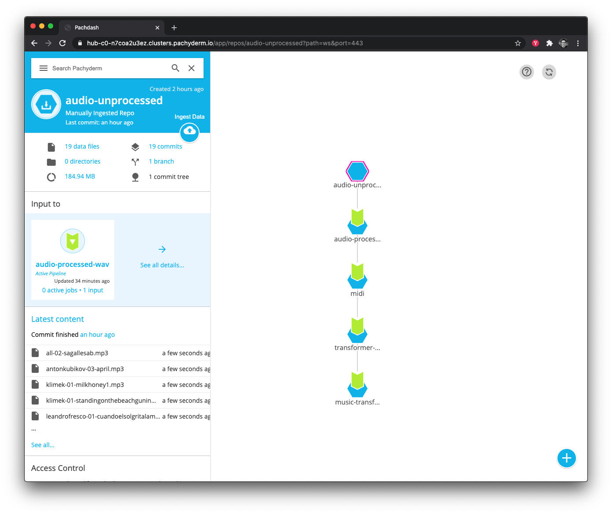

# Ambient Music Generator

An **ambient music generating** machine learning pipeline, using [Pachyderm](https://docs.pachyderm.com/latest/getting_started/beginner_tutorial/) and the [Magenta Project Music Transformer](https://magenta.tensorflow.org/music-transformer).  

Pachyderm makes it supremely simple to string together a bunch of loosely coupled frameworks into a smoothly scaling AI training platform. If you can package up your program in a Docker container you can easily run it in Pachyderm.

- [Generating Songs](#generating-songs)
  - [Requirements](#requirements)
- [Playing Your Song](#playing-your-song)
- [Training Your Own Music Generator in Pachyderm](#training-your-own-music-generator-in-pachyderm)
  - [Training Requirements](#training-requirements)
  - [TLDR; Just give me the code!](#tldr-just-give-me-the-code)
  - [Step 1: Download Your Data](#step-1-download-your-data)
  - [Step 2: Get Pachyderm Running](#step-2-get-pachyderm-running)
  - [Step 3: Clean Your Data](#step-3-clean-your-data)
  - [Step 4: Convert MP3s to Waves](#step-4-convert-mp3s-to-waves)
  - [Step 5: Converting WAVs to MIDI](#step-5-converting-wavs-to-midi)
  - [Step 6: MIDI to TFRecord](#step-6-midi-to-tfrecord)
  - [Step 7: Train the Transformer](#step-7-train-the-transformer)
  - [Step 8: Download the transformer model](#step-8-download-the-transformer-model)


## Generating Songs
In this repo, I've included a fully trained model you can download right here and try out yourself. Additionally, I included a Docker container with the fully trained model so you can start making music fast.

### Requirements
Make sure you have [Docker Desktop](https://www.docker.com/get-started) installed and running. 

Pull down the Ambient Music Transformer container to get started.

    docker pull jimmywhitaker/music-transformer:0.1

Launch the container and generate a song (with the defaults):

    docker run -it -v `pwd`:/data --entrypoint python jimmywhitaker/music-transformer:0.1 generate.py --load_path=/data/trained-models/ambient-musictransformer-model-2-june-3-2020-750-epochs-more-data --inputs /data/samples/midi/1.mid --length=2048 --save_path=/data/generated-music/my-sample-song-1.mid

You should see something like this: 
```
2020-07-16 01:12:09.048700: I tensorflow/core/platform/cpu_feature_guard.cc:143] Your CPU supports instructions that this TensorFlow binary was not compiled to use: AVX2 FMA
2020-07-16 01:12:09.063616: I tensorflow/core/platform/profile_utils/cpu_utils.cc:102] CPU Frequency: 3504000000 Hz
2020-07-16 01:12:09.063934: I tensorflow/compiler/xla/service/service.cc:168] XLA service 0x7f3160000b20 initialized for platform Host (this does not guarantee that XLA will be used). Devices:
2020-07-16 01:12:09.064158: I tensorflow/compiler/xla/service/service.cc:176]   StreamExecutor device (0): Host, Default Version
>> generate with decoder wise... beam size is None
generating |##                              | 182/2048
```

What just happened? We started a docker container with all the code and files to generate an song. When the container starts it maps the present working directory (``--v `pwd`:data``) to `/data` so that we have access to our local directory. The container then generates a song with our pre-trained ambient music generation model.

A seed is passed to the generator to give the model a starting point for style. We've already included 7 midi seeds in [``samples/midi``](samples/midi). You can change them by changing the `--inputs` flag to point at a different file (e.g. `--inputs /data/samples/midi/2.mid`).

Music Transformer will try to predict a good sequence in the style of that original song and deliver something brand new and never before heard by gods or mankind. 

Be sure to change the `--save_path` for different name or you will overwrite the last file!  

If you want to add your own MIDI seed then you can do the following.  Let's say you wanted to have the Music Transformer generate a model with Cuando el Sol Grita la Mañana, by Leandro Fresco as the seed, you’d put the file into the [``samples/midi``](samples/midi) and change the run command to:

    docker run -it -v `pwd`:/data --entrypoint /bin/python jimmywhitaker/music-transformer:0.1 generate.py --load_path=/src/music-transformer-model --inputs /data/samples/midi/leandrofresco-cuando-el-sol-grita-la-mananga.mid --length=2048 --save_path=/data/generated-music/my-sample-song-3.mid

It will take a few minutes, depending on how long of a song you asked it to create. It can’t create sequences longer than 2048. It can create shorter tunes but I’ve found the longer ones more amazing because they have a consistent structure throughout the entire song, something a 10 second sample just can’t capture.

## Playing Your Song

This step is where we really bring in our human-in-the-loop creativity.

We play our MIDI through various software instruments to see how it sounds. The software instruments are what bring our song to life.

Different instruments create very different songs. If you play your MIDI through a drum machine or a piano it will sound like random garbage because ambient music is more irregular than a drum or piano concert.

But pick the right ambient instrument and you might just have musical magic at your fingertips.

Of course, you could automate this step but you’ll need to find a rich collection of open source software instruments. They’re out there, but if you have a Mac you already have a rich collection of software instruments in [Apple’s Logic Pro](https://www.apple.com/logic-pro/). That felt like the best place to start so I could try lots of iterations fast. If you don’t own Logic Pro you can install a 60 day trial version from [the Mac Store](https://apps.apple.com/us/app/logic-pro-x/id634148309?mt=12) that is fully featured and not crippleware.  

If you don’t want to use Logic Pro, there’s lots of amazing music creation software to choose from, like Abelton Live and Cuebase.  You can also use Apple's free [Garageband](https://www.apple.com/mac/garageband/) by installing it from the app store.  If you’re a musical magician then go wild and unleash your favorite software collection on those AI generated songs.

But if you’re using Logic Pro like me, then you just import the MIDI and change out the instrument in the software track.


  
After days of experimentation I found a few amazing software instruments that consistently delivered fantastic songs when the Music Transformer managed to spit out a great sample.

 - Stratosphere
 - Deterioration
 - Peaceful Meadow
 - Calm and Storm 

Here are some of my favorite samples:

-   https://soundcloud.com/laughing-monkey-962936176/ambient-ai-song-seed-aeoliah-angels-of-presence-instrument-peaceful-meadow/s-mrmfusrM76x
    
-   https://soundcloud.com/laughing-monkey-962936176/ambient-ai-song-seed-deuter-mystic-voyage-instrument-peaceful-meadow/s-RKK82x0t5Nm
    
-   https://soundcloud.com/laughing-monkey-962936176/ambient-ai-song-seed-biosphere-instrument-voyager/s-Ax1cDDlLQiW
    
Several software instruments give the very same MIDI a strong, sci-fi vibe that feels otherworldly, as if I was flying through space or dropped down into a 1980s sci-fi [synthwave](https://open.spotify.com/playlist/6FgP4Vq2tctL3p1cNrgocs?si=uu71bBbSS3G3ozPeecpPzQ) blockbuster:

-   Underwater Temple
-   Parallel Universe

Here are a few great sci-fi examples:

-   https://soundcloud.com/laughing-monkey-962936176/ambient-ai-song-seed-biosphere-instrument-parallel-universe/s-aWh5GkKQWWi
    
-   https://soundcloud.com/laughing-monkey-962936176/ambient-ai-song-seed-love-on-a-train-instrument-underwater-temple/s-NxCgMvHFsoV
    
Music Transformer does a terrific job depending on what you feed it. Some seeds really make the Music Transformer sing.

But not all seeds are created equal. It really struggles sometimes.

No software instrument can save a terrible output no matter how hard you try.

Choose your seed wisely!

Happy music making!

## Training Your Own Music Generator in Pachyderm

In this section, I walk through how to recreate the entire pipeline and train the model yourself. 



I used Pachyderm to handle the full pipeline for scaling and management. Pachyderm is really unique because it will automatically run the rest of the pipeline and retrain your model when you add (or remove) data. This is super handy when you're still in the process of selecting your training data or if you want to try different styles of music without having to re-run scripts - just upload the data and everything is done. 

### Training Requirements
You can deploy a cluster on [PacHub](hub.pachyderm.com) which we did or deploy locally as described here:

- [Pachyderm Getting Started](https://docs.pachyderm.com/latest/getting_started/)

Once everything is up, we can check the setup by running: 
1. `kubectl get all` to ensure all the pods are up. 
2. `pachctl version` which will show both the `pachctl` and `pachd` versions.

We’ve included all the containers and JSON you’ll need to build a complete end-to-end ML pipeline right here. There’s no need to spend time compiling your own containers. We did the hard work for you!

Let's take a look at what it took to train this Transforming monster.

Our ML pipeline had eight stages.
1. [Download Your Data](#step-1-download-your-data)
2. [Get Pachyderm Running](#step-2-get-pachyderm-running) 
3. [Clean Your Data](#step-3-clean-your-data)
4. [Convert MP3s to Waves](#step-4-convert-mp3s-to-waves)
5. [Converting WAVs to MIDI](#step-5-converting-wavs-to-midi)
6. [MIDI to TFRecord](#step-6-midi-to-tfrecord)
7. [Train the Transformer](#step-7-train-the-transformer)
8. [Download the transformer model](#step-8-download-the-transformer-model)
    
The first step was manual but you can automate it pretty simply. But since we you only have to download the dataset once there didn’t seem to be any reason to script that step.

### TLDR; Just give me the code!

```bash
# Once Pachyderm is set up, run the following:
pachctl create repo audio-unprocessed

### Clean Your Data
mkdir audio-unprocessed # move downloaded mp3 files here
mkdir audio-processed
./scripts/name-standarizer.sh # standardizes and uploads your data to pachyderm

# Convert MP3s to Waves
cd pipelines/
pachctl create pipeline -f ./mp3-to-wav.json 

# Converting WAVs to MIDI
pachctl create pipeline -f ./midi.json 

# MIDI to TFRecord
pachctl create pipeline -f ./transformer-preprocess.json

# Train the Transformer
pachctl create pipeline -f ./music-transformer.json
```

### Step 1: Download Your Data

I used my [Ambient Music for Creativity and Calm](https://open.spotify.com/playlist/6qaujvXpcysfuyFMtp7Ljn?si=p4Vme8YAS9mOlRNNM_xIsA) music collection on Spotify as my dataset. As I wrote earlier, I’ve carefully crafted and curated this list over many years so it has no false notes. By that I mean there are no surprise songs that sound radically different from the rest. You won’t suddenly find a dark techno song mixed in there or a dance beat.

The big advantage of this playlist is that all the songs are very, very similar in terms of style, which means the patterns are very consistent throughout. Because of that I can use less data. A random mix of ambient music pulled from the net would take a lot more data and not have the same inner consistency.

I also built a second playlist called [Ambient AI Training](https://open.spotify.com/playlist/16PvqqR02AL9zsNfPGeMLI?si=JWZ-q4qGTImpVu-eHRCnQg) that's less well curated but where I still took the time to listen to each song to make sure it matched the kinds of songs I love.

You can find lots of free and paid programs out there to download your songs to MP3s. I used [AllToMP3](https://alltomp3.org/).

### Step 2: Get Pachyderm Running 

After I had my songs I pushed them up to Pachyderm. Pachyderm is simple and straightforward to set up. You can [install it locally](https://docs.pachyderm.com/latest/getting_started/local_installation/) or run it in the cloud.

I ran Pachyderm on [PachHub](https://hub.pachyderm.com/orgs/109/workspace) which lives in the Google Cloud. It spins you up a cluster in seconds and gives you a one time login. You’ll eventually need a GPU node if you want to train the model in a few days versus a few months, but you don’t need one to start building your pipeline. When you’re ready you can launch a GPU node through the PachHub interface. It launches a graphics unit and installs the proper driver for you. Now you’re ready to schedule a job on a GPU node.

If you run Pachyderm in the cloud you’ll still need a local instance of Pachyderm to talk with the cloud instance. That’s super simple. Just follow the [local installation instructions](https://docs.pachyderm.com/latest/getting_started/local_installation/) to get it running in Docker Desktop or Minikube in no time.

Once you have Pachyderm up and running, you’ll want to create your ingest repo where all your data will live and where the automated pipeline can start doing its magic. You can do that with the following command:

    pachctl create repo audio-unprocessed

That creates a starting repo called audio-unprocessed.

### Step 3: Clean Your Data

I then used a little [Bash script](scripts/name-standarizer.sh) to rename all my MP3s, making them lowercase and removing all spaces to give me a standard naming convention. The script then pushes them up to the Pachyderm audio-unprocessed repo that gets it all started.

```bash
mkdir audio-unprocessed # move mp3 files here
mkdir audio-processed

./scripts/name-standarizer.sh
```

### Step 4: Convert MP3s to Waves

You create a pipeline with a JSON file. That file simply contains the following info for Pachy:

 - an input repo (where the system fetches data) 
 - an output repo (where
   it puts transformed data) 
 - a container with some code in it
 - the command and switches to run that code

Here’s the JSON for stage three:

    # mp3-to-wav.json
    {
      "pipeline": {
        "name": "audio-processed-wav"
      },
      "description": "A pipeline that converts MP3s to WAVs with ffmpeg.",
      "transform": {
        "cmd": [ "bash", "/ffmpeg-convert-pachy.sh" ],
        "image": "rabbit37/audio-preprocessor:v5"
      },
      "input": {
        "pfs": {
          "repo": "audio-unprocessed",
          "glob": "/*"
        }
      }
    }

My container runs Ubuntu and there’s a bash script in it that calls ffmpeg to convert my MP3s to WAVs. You can [grab that JSON file here](pipelines/mp3towav.json) and then push it up to the cloud with the following command:

```bash
cd pipelines
pachctl create pipeline -f ./mp3-to-wav.json
```

That will fire up your new pipeline, chew through all your MP3s and turn them into WAVs before putting them in the audio-processed repo.

### Step 5: Converting WAVs to MIDI

The third step uses the Magenta Project’s Onsets and Frames Python code to transform our WAVs into MIDI files. Onsets and Frames uses a fully trained ML model to transcribe the music. It’s not perfect but no MIDI transcription software is perfect.

If you want to take this project farther then consider exploring different music transcription packages out there to get the best results. Better transcription will almost certainly create a better and more robots model. But for now this works great.

[Grab the JSON file here](pipelines/midi.json) and then push it up to the Pachy cloud with the following command:

```bash
pachctl create pipeline -f ./midi.json
```

The container installs and sets up Magenta's [Onsets & Frames](https://github.com/magenta/magenta/tree/master/magenta/models/onsets_frames_transcription). It relies on [this repo](https://github.com/the-laughing-monkey/onsets-and-frames-transcription) to orchestrate the reading of files and transcription.

**Container:** [`hitheory/onsets-and-frames:v1.0`](https://hub.docker.com/repository/docker/hitheory/musictransformer)

**Dockerfile:** [`dockerfiles/onsets-and-frames.Dockerfile`](dockerfiles/onsets-and-frames.Dockerfile)

**Pipeline JSON:** [`pipelines/midi.json`](pipelines/midi.json)

**Entry script:** [`/src/transcribe.py`](https://github.com/the-laughing-monkey/onsets-and-frames-transcription/blob/master/transcribe.py)

**Arguments:**

-   `--input` - the directory containing the input files
-   `--output` - the directory in which to write the MIDI files

Example:

```bash
python3 /src/transcribe.py --input /pfs/audio-processed-wav --output /pfs/out

```

### Step 6: MIDI to TFRecord

Before training the model, we need to do one more step. We’ve got to convert those MIDI files into a format TensorFlow can understand, called the TFRecord format. The [JSON is here](pipelines/transformer-preprocess.json), and we push it with the following command:

    pachctl create pipeline -f ./transformer-preprocess.json

We rely on [a fork of an implementation](https://github.com/the-laughing-monkey/MusicTransformer-tensorflow2.0) of MusicTransformer by [@jason9693](https://github.com/jason9693).

**Container:** [`hitheory/musictranformer:v1.0.0`](https://hub.docker.com/repository/docker/hitheory/musictransformer)

**Dockerfile:** [`dockerfiles/musictransformer.Dockerfile`](dockerfiles/musictransformer.Dockerfile)

**Pipeline JSON:** [`pipelines/transformer-preprocess.json`](pipelines/transformer-preprocess.json)

**Entry script:** [`/src/preprocess.py`](https://github.com/the-laughing-monkey/MusicTransformer-tensorflow2.0/blob/master/preprocess.py)

**Arguments:**

-   `<first arg>` - the directory containing the input files to pre-process
-   `<second arg>` - the directory in which to write the pre-processed files

Example:

```
python3 /src/preprocess.py /pfs/midi /pfs/out

```

### Step 7: Train the Transformer

Now we can finally unleash the power of GPUs to train our model. We used one monster Nvidia GPU, on a single node, and it took about three days running 24x7 to train, but you could use more GPUs and let [Pachyderm scale up the training for you](https://docs.pachyderm.com/latest/concepts/advanced-concepts/distributed_computing/) to train it a lot faster.

The [training JSON file is right here](pipelines/musictransformer.json) and you push it like so:

    pachctl create pipeline -f ./music-transformer.json

We rely on [the same fork of an implementation](https://github.com/the-laughing-monkey/MusicTransformer-tensorflow2.0) of MusicTransformer by [@jason9693](https://github.com/jason9693), and use the same container and Dockerfile.

**Container:** [`hitheory/musictranformer:v1.0.0`](https://hub.docker.com/repository/docker/hitheory/musictransformer)

**Dockerfile:** [`dockerfiles/musictransformer.Dockerfile`](dockerfiles/musictransformer.Dockerfile)

**Pipeline JSON:** [`pipelines/musictransformer.json`](pipelines/musictransformer.json)

**Entry script:** [`/src/preprocess.py`](https://github.com/the-laughing-monkey/MusicTransformer-tensorflow2.0/blob/master/train.py)

**Arguments:**

-   `--l_r` - The learning rate to use. If `None`, [a custom learning rate is used, as defined in the original repo](https://github.com/the-laughing-monkey/MusicTransformer-tensorflow2.0#hyper-parameter).
-   `--batch_size` - The batch size to use
-   `--max_seq` - The sequence length to use ([more information in the paper](https://arxiv.org/pdf/1809.04281.pdf)).
-   `--epochs` - The number of epochs to use
-   `--input_path` - The directory containing the files to use for training
-   `--save_path` - The directory in which to write the trained model
-   `--num_layers` - [The number of layers to use](https://github.com/the-laughing-monkey/MusicTransformer-tensorflow2.0/blob/master/model.py#L15).

Example:

```
python3 /src/train.py --epochs 500 --save_path /pfs/out --input_path /pfs/transformer-preprecess --batch_size 2 --max_seq 2048

```

### Step 8: Download the transformer model
Once the model is finished training, we can download it from pachyderm by running the following: 
```bash
pachctl list file music-transformer@master 
pachctl get file --recursive music-transformer@master
```
