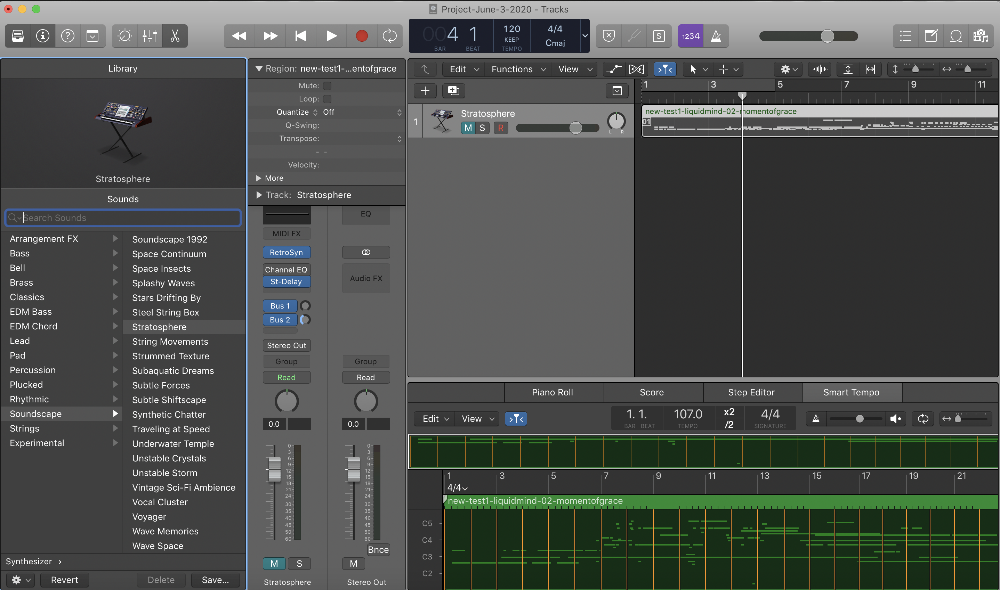

To build our **ambient music generating** machine learning pipeline, we used [Pachyderm](https://docs.pachyderm.com/latest/getting_started/beginner_tutorial/) and the [Magenta Project Music Transformer](https://magenta.tensorflow.org/music-transformer). 

Pachyderm makes it supremely simple to string together a bunch of loosely coupled frameworks into a smoothly scaling AI training platform. If you can package up your program in a Docker container you can easily run it in Pachyderm.

In this section I walk through how to recreate the entire pipeline and train the model yourself. But you don’t have to do that if you don’t want to do it.

I’ve also included a fully trained model you can download right here and try out yourself. Lastly, I included a Docker container with the fully trained model so you can start making music fast. You can jump right to the section [Creating Beautiful Music Together](#Creating%20Beautiful%20Music%20Together) to start making songs right now.

## Building Your ML Pipeline in Pachyderm

We’ve included all the containers and JSON you’ll need to build a complete end-to-end ML pipeline right here. There’s no need to spend time compiling your own containers. We did the hard work for you.

Let's take a look at what it took to train this Transforming monster.

Our ML pipeline had seven stages.

1.  Download our dataset to MP3s
    
2.  Convert those MP3s to Waves
    
3.  Transcribe those Waves into Midi
    
4.  Preprocess those Midi files
    
5.  Train our ML model on GPUs
    
6.  Output AI generated songs in Midi with our trained model
    
7.  Play those Midi files in software instruments
    
The first step was manual but you can automate it pretty simply. But since we you only have to download the dataset once there didn’t seem to be any reason to script that step.

### Step One: Download Your Data

I used my [Ambient Music for Creativity and Calm](https://open.spotify.com/playlist/6qaujvXpcysfuyFMtp7Ljn?si=p4Vme8YAS9mOlRNNM_xIsA) music collection on Spotify as my dataset. As I wrote earlier, I’ve carefully crafted and curated this list over many years so it has no false notes. By that I mean there are no surprise songs that sound radically different from the rest. You won’t suddenly find a dark techno song mixed in there or a dance beat.

The big advantage of this playlist is that all the songs are very, very similar in terms of style, which means the patterns are very consistent throughout. Because of that I can use less data. A random mix of ambient music pulled from the net would take a lot more data and not have the same inner consistency.

I also built a second playlist called [Ambient AI Training](https://open.spotify.com/playlist/16PvqqR02AL9zsNfPGeMLI?si=JWZ-q4qGTImpVu-eHRCnQg) that's less well curated but where I still took the time to listen to each song to make sure it matched the kinds of songs I love.

You can find lots of free and paid programs out there to download your songs to MP3s. I used [AllToMP3](https://alltomp3.org/).

### Step Two: Get Pachyderm Running and Clean Your Data

After I had my songs I pushed them up to Pachyderm. Pachyderm is simple and straightforward to set up. You can [install it locally](https://docs.pachyderm.com/latest/getting_started/local_installation/) or run it in the cloud.

I ran Pachyderm on [PachHub](https://hub.pachyderm.com/orgs/109/workspace) which lives in the Google Cloud. It spins you up a cluster in seconds and gives you a one time login. You’ll eventually need a GPU node if you want to train the model in a few days versus a few months, but you don’t need one to start building your pipeline. When you’re ready you can launch a GPU node through the PachHub interface. It launches a graphics unit and installs the proper driver for you. Now you’re ready to schedule a job on a GPU node.

If you run Pachyderm in the cloud you’ll still need a local instance of Pachyderm to talk with the cloud instance. That’s super simple. Just follow the [local installation instructions](https://docs.pachyderm.com/latest/getting_started/local_installation/) to get it running in Docker Desktop or Minikube in no time.

Once you have Pachyderm up and running, you’ll want to create your ingest repo where all your data will live and where the automated pipeline can start doing its magic. You can do that with the following command:

    pachctl create repo audio-unprocessed

That creates a starting repo called audio-unprocessed.

I then used a little [Bash script](scripts/name-standarizer.sh) to rename all my MP3s, making them lowercase and removing all spaces to give me a standard naming convention. The script then pushes them up to the Pachyderm audio-unprocessed repo that gets it all started.

I created a few local directories for my Bash script to use:

    /pfs/audio-unprocessed
    /pfs/out

Those mimic the Pachyderm filesystem naming convention but they’re just local directories on my Mac laptop. PFS stands for [Pachyderm File System](https://www.pachyderm.com/pfs/).

 `/pfs/audio-unprocessed` is where all my MP3s go. It outputs my freshly renamed files to `/pfs/out` and then pushes those files up to my audio-unprocessed repository with the Pachyderm push command, like so:

    pachctl put file audio-unprocessed@master:$newfilename -f $some-file-name

Depending on your internet connection this could take a bit. But once they’re up there in your repo you’re ready to create all your pipelines and train your model.

### Step Three: Convert MP3s to Waves

You create a pipeline with a JSON file. That file simply contains the following info for Pachy:

 - an input repo (where the system fetches data) 
 - an output repo (where
   it puts transformed data) 
 - a container with some code in it
 - the command and switches to run that code

Here’s the JSON for stage three:

    # mp3towav.json
    {
      "pipeline": {
        "name": "audio-processed-wav"
      },
      "description": "A pipeline that converts MP3s to WAVs with ffmpeg.",
      "transform": {
        "cmd": [ "bash", "/ffmpeg-convert-pachy.sh" ],
        "image": "rabbit37/audio-preprocessor:v5"
      },
      "input": {
        "pfs": {
          "repo": "audio-unprocessed",
          "glob": "/*"
        }
      }
    }

My container runs Ubuntu and there’s a bash script in it that calls ffmpeg to convert my MP3s to WAVs. You can [grab that JSON file here](pipelines/mp3towav.json) and then push it up to the cloud with the following command:

    pachctl create pipeline -f ./mp3towav.json

That will fire up your new pipeline, chew through all your MP3s and turn them into WAVs before putting them in the audio-processed repo.

### Step Four: Converting WAVs to MIDI

The third step uses the Magenta Project’s Onsets and Frames Python code to transform our WAVs into MIDI files. Onsets and Frames uses a fully trained ML model to transcribe the music. It’s not perfect but no MIDI transcription software is perfect.

If you want to take this project farther then consider exploring different music transcription packages out there to get the best results. Better transcription will almost certainly create a better and more robots model. But for now this works great.

[Grab the JSON file here](pipelines/midi.json) and then push it up to the Pachy cloud with the following command:

    pachctl create pipeline -f ./midi.json

The container installs and sets up Magenta's [Onsets & Frames](https://github.com/magenta/magenta/tree/master/magenta/models/onsets_frames_transcription). It relies on [this repo](https://github.com/thekevinscott/onsets-and-frames-transcription) to orchestrate the reading of files and transcription.

**Container:** [`hitheory/onsets-and-frames:v1.0`](https://hub.docker.com/repository/docker/hitheory/musictransformer)

**Dockerfile:** [`dockerfiles/onsets-and-frames.Dockerfile`](https://github.com/thekevinscott/ambient-music-generation/blob/master/dockerfiles/onsets-and-frames.Dockerfile)

**Pipeline JSON:** [`pipelines/midi.json`](https://github.com/thekevinscott/ambient-music-generation/blob/master/pipelines/midi.json)

**Entry script:** [`/src/transcribe.py`](https://github.com/thekevinscott/onsets-and-frames-transcription/blob/master/transcribe.py)

**Arguments:**

-   `--input` - the directory containing the input files
-   `--output` - the directory in which to write the MIDI files

Example:

```
python3 /src/transcribe.py --input /pfs/audio-processed-wav --output /pfs/out

```

### Step Four: Preprocessing

Before training the model, we need to do one more step. We’ve got to convert those MIDI files into a format TensorFlow can understand, called the TFRecord format. The [JSON is here](pipelines/transformer-preprocess.json) and we push it with the following command:

    pachctl create pipeline -f ./transformer-preprocess.json

We rely on [a fork of an implementation](https://github.com/thekevinscott/MusicTransformer-tensorflow2.0) of MusicTransformer by [@jason9693](https://github.com/jason9693).

**Container:** [`hitheory/musictranformer:v1.0.0`](https://hub.docker.com/repository/docker/hitheory/musictransformer)

**Dockerfile:** [`dockerfiles/musictransformer.Dockerfile`](https://github.com/thekevinscott/ambient-music-generation/blob/master/dockerfiles/musictransformer.Dockerfile)

**Pipeline JSON:** [`pipelines/transformer-preprocess.json`](https://github.com/thekevinscott/ambient-music-generation/blob/master/pipelines/transformer-preprocess.json)

**Entry script:** [`/src/preprocess.py`](https://github.com/thekevinscott/MusicTransformer-tensorflow2.0/blob/master/preprocess.py)

**Arguments:**

-   `<first arg>` - the directory containing the input files to pre-process
-   `<second arg>` - the directory in which to write the pre-processed files

Example:

```
python3 /src/preprocess.py /pfs/midi /pfs/out

```

### Step Five: Train the Transformer

Now we can finally unleash the power of GPUs to train our model. We used one monster Nvidia GPU, on a single node, and it took about three days running 24x7 to train, but you could use more GPUs and let [Pachyderm scale up the training for you](https://docs.pachyderm.com/latest/concepts/advanced-concepts/distributed_computing/) to train it a lot faster.

The [training JSON file is right here](pipelines/musictransformer.json) and you push it like so:

    pachctl create pipeline -f ./transformer.json

We rely on [the same fork of an implementation](https://github.com/thekevinscott/MusicTransformer-tensorflow2.0) of MusicTransformer by [@jason9693](https://github.com/jason9693), and use the same container and Dockerfile.

**Container:** [`hitheory/musictranformer:v1.0.0`](https://hub.docker.com/repository/docker/hitheory/musictransformer)

**Dockerfile:** [`dockerfiles/musictransformer.Dockerfile`](https://github.com/thekevinscott/ambient-music-generation/blob/master/dockerfiles/musictransformer.Dockerfile)

**Pipeline JSON:** [`pipelines/musictransformer.json`](https://github.com/thekevinscott/ambient-music-generation/blob/master/pipelines/musictransformer.json)

**Entry script:** [`/src/preprocess.py`](https://github.com/thekevinscott/MusicTransformer-tensorflow2.0/blob/master/train.py)

**Arguments:**

-   `--l_r` - The learning rate to use. If `None`, [a custom learning rate is used, as defined in the original repo](https://github.com/thekevinscott/MusicTransformer-tensorflow2.0#hyper-parameter).
-   `--batch_size` - The batch size to use
-   `--max_seq` - The sequence length to use ([more information in the paper](https://arxiv.org/pdf/1809.04281.pdf)).
-   `--epochs` - The number of epochs to use
-   `--input_path` - The directory containing the files to use for training
-   `--save_path` - The directory in which to write the trained model
-   `--num_layers` - [The number of layers to use](https://github.com/thekevinscott/MusicTransformer-tensorflow2.0/blob/master/model.py#L15).

Example:

```
python3 /src/train.py --epochs 500 --save_path /pfs/out --input_path /pfs/transformer-preprecess --batch_size 2 --max_seq 2048

```

## Creating Beautiful Music Together

### Step Six: Generating New Songs

Now we’re ready to have some fun with the fully trained model. It’s time to make some music!

Make sure you have [Docker Desktop](https://www.docker.com/get-started) installed and running. 

Pull down the Ambient Music Transformer container to get started.

    docker pull rabbit37/ambient-musictransformer:v1

Launch an instance of the container with the following command:

    docker run -dit rabbit37/ambient-music-transformer:v1

Give it second to start and then get the instance name of that container so you can talk to it:

     docker ps | grep ambient-musictransformer

Let’s pretend it was called `magical_cannon`. Now you can talk to that instance by its funny little name.

You'll need a MIDI file to “seed" the model. The seed gives the model a starting point for style. We've already included 7 midi seeds for you in the directory `/src/audio/midi-transcriptions`

 - 1.mid
 - 2.mid
 - 3.mid
 - 4.mid
 - 5.mid
 - 6.mid
 - 7.mid

Music Transformer will try to predict a good sequence in the style of that original song and deliver something brand new and never before heard by gods or mankind. 

Then you tell Music Transformer to create a song like this:

    python generate.py --load_path=/src/music-transformer-model --length=2048 --save_path=/src/generated-audio/my-sample-song-1.mid

I've already configured the generator.py script with the 1.mid file for you.  Feel free to try the others or add your own!

If you want to try one of the others then simply edit the `generator.py` file and find the following line:

    inputs = encode_midi('/src/audio/midi-transcriptions/1.mid')

Then run the script again.  Be sure to change the `--save_path` name or you will overwrite the last file!  It will put generated MIDI files in `/src/generated-audio/`.

If you want to add your own MIDI seed then you can do the following.  Let's say you wanted to have the Music Transformer generate a model with Cuando el Sol Grita la Mañana, by Leandro Fresco as the seed, you’d put the file into the container like this:
 

    docker cp leandrofresco-cuando-el-sol-grita-la-mananga.mid magical_cannon:/src/audio/midi-transcriptions/

That copies your MIDI file into the container’s /src/audio/midi-transcriptions/ directory.

Now you can step inside your container and get it to create songs for you. You can do that like so:

    docker exec -it magical_cannon /bin/bash

Now you’re inside the musical machine in the `/src` directory.

Edit the generator python script to change the seed file.

    vi generate.py

Edit this line to change the seed file to point to the one that you copied into the instance:

    inputs = encode_midi('/src/audio/midi-transcriptions/1.mid')

Change it to this (or whatever you named your MIDI file):

    inputs = encode_midi('/src/audio/midi-transcriptions/leandrofresco-cuando-el-sol-grita-la-mananga.mid')


Now you're ready to tell Music Transformer to create another new song.


    python generate.py --load_path=/src/music-transformer-model --length=2048 --save_path=/src/generated-audio/my-sample-song-2.mid


It will take a few minutes, depending on how long of a song you asked it to create. It can’t create sequences longer than 2048. It can create shorter tunes but I’ve found the longer ones more amazing because they have a consistent structure throughout the entire song, something a 10 second sample just can’t capture.

### Step Seven: Playing Your Song

The last step is where we really bring in our human-in-the-loop creativity.

We play our MIDI through various software instruments to see how it sounds. The software instruments are what bring our song to life.

Different instruments create very different songs. If you play your MIDI through a drum machine or a piano it will sound like random garbage because ambient music is more irregular than a drum or piano concert.

But pick the right ambient instrument and you might just have musical magic at your fingertips.

Of course, you could automate this step but you’ll need to find a rich collection of open source software instruments. They’re out there, but if you have a Mac you already have a rich collection of software instruments in [Apple’s Logic Pro](https://www.apple.com/logic-pro/). That felt like the best place to start so I could try lots of iterations fast. If you don’t own Logic Pro you can install a 60 day trial version from [the Mac Store](https://apps.apple.com/us/app/logic-pro-x/id634148309?mt=12) that is fully featured and not crippleware.

If you don’t want to use Logic Pro, there’s lots of amazing music creation software to choose from, like Abelton Live and Cuebase. If you’re a musical magician then go wild and unleash your favorite software collection on those AI generated songs.

But if you’re using Logic Pro like me, then you just import the MIDI and change out the instrument in the software track.


  
After days of experimentation I found a few amazing software instruments that consistently delivered fantastic songs when the Music Transformer managed to spit out a great sample.

 - Stratosphere
 - Deterioration
 - Peaceful Meadow
 - Calm and Storm 

Here are some of my favorite samples:

-   https://soundcloud.com/laughing-monkey-962936176/ambient-ai-song-seed-aeoliah-angels-of-presence-instrument-peaceful-meadow/s-mrmfusrM76x
    
-   https://soundcloud.com/laughing-monkey-962936176/ambient-ai-song-seed-deuter-mystic-voyage-instrument-peaceful-meadow/s-RKK82x0t5Nm
    
-   https://soundcloud.com/laughing-monkey-962936176/ambient-ai-song-seed-biosphere-instrument-voyager/s-Ax1cDDlLQiW
    
Several software instruments give the very same MIDI a strong, sci-fi vibe that feels otherworldly, as if I was flying through space or dropped down into a 1980s sci-fi [synthwave](https://open.spotify.com/playlist/6FgP4Vq2tctL3p1cNrgocs?si=uu71bBbSS3G3ozPeecpPzQ) blockbuster:

-   Underwater Temple
-   Parallel Universe

Here are a few great sci-fi examples:

-   https://soundcloud.com/laughing-monkey-962936176/ambient-ai-song-seed-biosphere-instrument-parallel-universe/s-aWh5GkKQWWi
    
-   https://soundcloud.com/laughing-monkey-962936176/ambient-ai-song-seed-love-on-a-train-instrument-underwater-temple/s-NxCgMvHFsoV
    
Music Transformer does a terrific job depending on what you feed it. Some seeds really make the Music Transformer sing.

But not all seeds are created equal. It really struggles sometimes.

No software instrument can save a terrible output no matter how hard you try.

Choose your seed wisely!

Happy music making!
