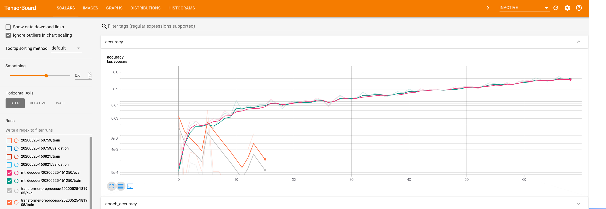
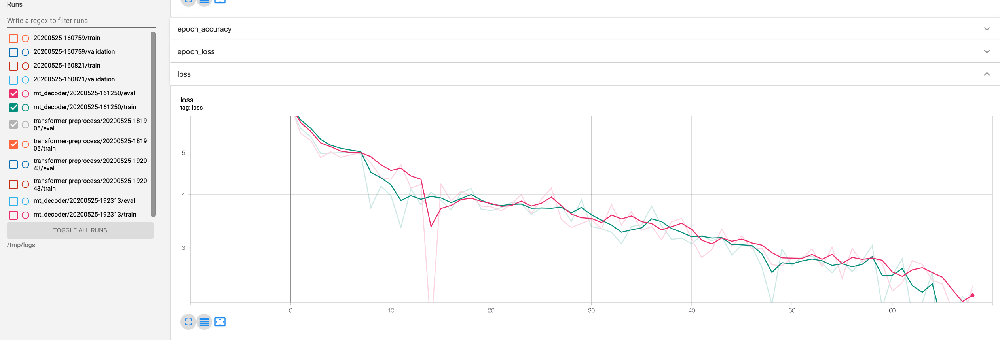
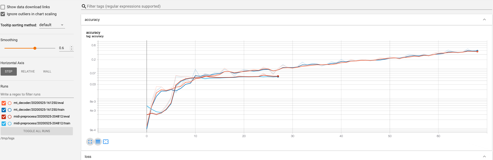
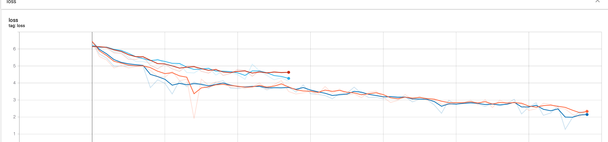

This is a collection of observations around why MIDI is not training well.


```python
%load_ext autoreload
%autoreload 2
%cd ../MusicTransformer-tensorflow2.0
```

    The autoreload extension is already loaded. To reload it, use:
      %reload_ext autoreload
    /notebooks/src/MusicTransformer-tensorflow2.0


# 1. Comparing Datasets

I first worked through the local GPU issues, and then set it up to train `classic_piano` in comparison to `midi`. I graphed the metrics through Tensorboard.


```python
from train import train
train(
    '/data/classic_piano_preprocessed',
    './save',
    log_dir='/tmp/logs/classic_piano_preprocessed')
```


```python
from train import train
train(
    '../out/transformer-preprocess',
    './save-transformer-preprocess',
    log_dir='/tmp/logs/transformer-preprocess'
)
```

Below is a graph of the accuracy, with `classic_piano` through ~65 epochs and `midi` through ~20 epochs. `classic_piano` is clearly on the upswing, and looks [comparable in slope to the results in the original repo](https://github.com/jason9693/MusicTransformer-tensorflow2.0#result).

`midi` is going nowhere fast (which is why I stopped it early).



Here's a graph of the loss. The loss for `midi` stays at 0.



The most likely culprit is that there's something wrong with the underlying data. So let's look at that.

# 2. Examining the Data

Let's log out the tensor information we're getting from each dataset.


```python
from data import Data
import tensorflow as tf

batch_size = 2
max_seq = 1024

input_paths = [
    '/data/classic_piano_preprocessed',
    '../out/transformer-preprocess',    
]

for input_path in input_paths:
    print('\n\nInput path: {}'.format(input_path))
    dataset = Data(input_path)
    batch_x, batch_y = dataset.slide_seq2seq_batch(batch_size, max_seq)
    print('batch_x')
    print(batch_x.shape)
    print(batch_x[0:5])
    print('min', tf.math.reduce_min(batch_x, axis=None, keepdims=False, name=None))
    print('max', tf.math.reduce_max(batch_x, axis=None, keepdims=False, name=None))
    print('mean', tf.math.reduce_mean(batch_x, axis=None, keepdims=False, name=None))
    print('batch_y')
    print(batch_y.shape)
    print(batch_y)
    print('min', tf.math.reduce_min(batch_y, axis=None, keepdims=False, name=None))
    print('max', tf.math.reduce_max(batch_y, axis=None, keepdims=False, name=None))
    print('mean', tf.math.reduce_mean(batch_y, axis=None, keepdims=False, name=None))
```

    
    
    Input path: /data/classic_piano_preprocessed
    batch_x
    (2, 1024)
    [[367  51 256 ... 304 163 361]
     [369  79 281 ...  75 366  60]]
    min tf.Tensor(27, shape=(), dtype=int64)
    max tf.Tensor(380, shape=(), dtype=int64)
    mean tf.Tensor(218, shape=(), dtype=int64)
    batch_y
    (2, 1024)
    [[ 51 256 168 ... 163 361  40]
     [ 79 281 179 ... 366  60 308]]
    min tf.Tensor(27, shape=(), dtype=int64)
    max tf.Tensor(380, shape=(), dtype=int64)
    mean tf.Tensor(218, shape=(), dtype=int64)
    
    
    Input path: ../out/transformer-preprocess
    batch_x
    (2, 1024)
    [[390. 388. 388. ... 388. 388. 388.]
     [390. 388. 388. ... 388. 388. 388.]]
    min tf.Tensor(388.0, shape=(), dtype=float64)
    max tf.Tensor(390.0, shape=(), dtype=float64)
    mean tf.Tensor(388.001953125, shape=(), dtype=float64)
    batch_y
    (2, 1024)
    [[388. 388. 388. ... 388. 388. 388.]
     [388. 388. 388. ... 388. 388. 388.]]
    min tf.Tensor(388.0, shape=(), dtype=float64)
    max tf.Tensor(388.0, shape=(), dtype=float64)
    mean tf.Tensor(388.0, shape=(), dtype=float64)


The shapes of each tensor batch are identical, but the data is pretty different. For `classic_piano`, there's a pretty wide range of values (27-380), but for `midi`, they all seem to fall in a small band (`388-390`).

That seems pretty suspicious.

# 3. Preprocessing MIDI step

Next let's see how the data is being preprocessed by in the original repo.


```python
# Download the classic_piano dataset

!sh /src/dataset/scripts/classic_piano_downloader.sh /data/classic_piano
```

    Pages: albeniz.htm bach.htm balak.htm beeth.htm borodin.htm brahms.htm burgm.htm chopin.htm clementi.htm debuss.htm godowsky.htm grana.htm grieg.htm haydn.htm liszt.htm mendelssohn.htm moszkowski.htm mozart.htm muss.htm rach.htm ravel.htm schub.htm schum.htm sinding.htm tschai.htm xmas.htm
    http://www.piano-midi.de/midis/albeniz/alb_esp1_format0.mid
    http://www.piano-midi.de/midis/albeniz/alb_esp2_format0.mid
    http://www.piano-midi.de/midis/albeniz/alb_esp3_format0.mid
    http://www.piano-midi.de/midis/albeniz/alb_esp4_format0.mid
    http://www.piano-midi.de/midis/albeniz/alb_esp5_format0.mid
    http://www.piano-midi.de/midis/albeniz/alb_esp6_format0.mid
    http://www.piano-midi.de/midis/albeniz/alb_se1_format0.mid
    http://www.piano-midi.de/midis/albeniz/alb_se2_format0.mid
    http://www.piano-midi.de/midis/albeniz/alb_se3_format0.mid
    http://www.piano-midi.de/midis/albeniz/alb_se4_format0.mid
    http://www.piano-midi.de/midis/albeniz/alb_se5_format0.mid
    http://www.piano-midi.de/midis/albeniz/alb_se6_format0.mid
    http://www.piano-midi.de/midis/albeniz/alb_se7_format0.mid
    http://www.piano-midi.de/midis/albeniz/alb_se8_format0.mid
    --2020-05-25 19:50:04--  http://www.piano-midi.de/midis/albeniz/alb_esp1_format0.mid
    Resolving www.piano-midi.de (www.piano-midi.de)... 82.165.134.185
    Connecting to www.piano-midi.de (www.piano-midi.de)|82.165.134.185|:80... connected.
    HTTP request sent, awaiting response... 200 OK
    Length: 9202 (9.0K) [audio/midi]
    Saving to: ‘/data/classic_piano/alb_esp1_format0.mid’
    
    alb_esp1_format0.mi 100%[===================>]   8.99K  --.-KB/s    in 0s      
    
    2020-05-25 19:50:05 (82.7 MB/s) - ‘/data/classic_piano/alb_esp1_format0.mid’ saved [9202/9202]
    
    --2020-05-25 19:50:05--  http://www.piano-midi.de/midis/albeniz/alb_esp2_format0.mid
    Reusing existing connection to www.piano-midi.de:80.
    HTTP request sent, awaiting response... 200 OK
    Length: 7696 (7.5K) [audio/midi]
    Saving to: ‘/data/classic_piano/alb_esp2_format0.mid’
    
    alb_esp2_format0.mi 100%[===================>]   7.52K  --.-KB/s    in 0s      
    
    2020-05-25 19:50:05 (257 MB/s) - ‘/data/classic_piano/alb_esp2_format0.mid’ saved [7696/7696]
    
    --2020-05-25 19:50:05--  http://www.piano-midi.de/midis/albeniz/alb_esp3_format0.mid
    Reusing existing connection to www.piano-midi.de:80.
    HTTP request sent, awaiting response... 200 OK
    Length: 14438 (14K) [audio/midi]
    Saving to: ‘/data/classic_piano/alb_esp3_format0.mid’
    
    alb_esp3_format0.mi 100%[===================>]  14.10K  --.-KB/s    in 0s      
    
    2020-05-25 19:50:05 (28.7 MB/s) - ‘/data/classic_piano/alb_esp3_format0.mid’ saved [14438/14438]
    
    --2020-05-25 19:50:05--  http://www.piano-midi.de/midis/albeniz/alb_esp4_format0.mid
    Reusing existing connection to www.piano-midi.de:80.
    HTTP request sent, awaiting response... 200 OK
    Length: 14276 (14K) [audio/midi]
    Saving to: ‘/data/classic_piano/alb_esp4_format0.mid’
    
    alb_esp4_format0.mi 100%[===================>]  13.94K  --.-KB/s    in 0.001s  
    
    2020-05-25 19:50:05 (26.0 MB/s) - ‘/data/classic_piano/alb_esp4_format0.mid’ saved [14276/14276]
    
    --2020-05-25 19:50:05--  http://www.piano-midi.de/midis/albeniz/alb_esp5_format0.mid
    Reusing existing connection to www.piano-midi.de:80.
    HTTP request sent, awaiting response... 200 OK
    Length: 9262 (9.0K) [audio/midi]
    Saving to: ‘/data/classic_piano/alb_esp5_format0.mid’
    
    alb_esp5_format0.mi 100%[===================>]   9.04K  --.-KB/s    in 0s      
    
    2020-05-25 19:50:05 (74.7 MB/s) - ‘/data/classic_piano/alb_esp5_format0.mid’ saved [9262/9262]
    
    --2020-05-25 19:50:05--  http://www.piano-midi.de/midis/albeniz/alb_esp6_format0.mid
    Reusing existing connection to www.piano-midi.de:80.
    HTTP request sent, awaiting response... 200 OK
    Length: 14333 (14K) [audio/midi]
    Saving to: ‘/data/classic_piano/alb_esp6_format0.mid’
    
    alb_esp6_format0.mi 100%[===================>]  14.00K  --.-KB/s    in 0s      
    
    2020-05-25 19:50:06 (36.0 MB/s) - ‘/data/classic_piano/alb_esp6_format0.mid’ saved [14333/14333]
    
    --2020-05-25 19:50:06--  http://www.piano-midi.de/midis/albeniz/alb_se1_format0.mid
    Reusing existing connection to www.piano-midi.de:80.
    HTTP request sent, awaiting response... 200 OK
    Length: 18661 (18K) [audio/midi]
    Saving to: ‘/data/classic_piano/alb_se1_format0.mid’
    
    alb_se1_format0.mid 100%[===================>]  18.22K  --.-KB/s    in 0.001s  
    
    2020-05-25 19:50:06 (22.1 MB/s) - ‘/data/classic_piano/alb_se1_format0.mid’ saved [18661/18661]
    
    --2020-05-25 19:50:06--  http://www.piano-midi.de/midis/albeniz/alb_se2_format0.mid
    Reusing existing connection to www.piano-midi.de:80.
    HTTP request sent, awaiting response... 200 OK
    Length: 22123 (22K) [audio/midi]
    Saving to: ‘/data/classic_piano/alb_se2_format0.mid’
    
    alb_se2_format0.mid 100%[===================>]  21.60K  --.-KB/s    in 0.001s  
    
    2020-05-25 19:50:06 (20.0 MB/s) - ‘/data/classic_piano/alb_se2_format0.mid’ saved [22123/22123]
    
    --2020-05-25 19:50:06--  http://www.piano-midi.de/midis/albeniz/alb_se3_format0.mid
    Reusing existing connection to www.piano-midi.de:80.
    HTTP request sent, awaiting response... 200 OK
    Length: 28324 (28K) [audio/midi]
    Saving to: ‘/data/classic_piano/alb_se3_format0.mid’
    
    alb_se3_format0.mid 100%[===================>]  27.66K  --.-KB/s    in 0.005s  
    
    2020-05-25 19:50:06 (5.06 MB/s) - ‘/data/classic_piano/alb_se3_format0.mid’ saved [28324/28324]
    
    --2020-05-25 19:50:06--  http://www.piano-midi.de/midis/albeniz/alb_se4_format0.mid
    Reusing existing connection to www.piano-midi.de:80.
    HTTP request sent, awaiting response... 200 OK
    Length: 22052 (22K) [audio/midi]
    Saving to: ‘/data/classic_piano/alb_se4_format0.mid’
    
    alb_se4_format0.mid 100%[===================>]  21.54K  --.-KB/s    in 0.001s  
    
    2020-05-25 19:50:06 (19.6 MB/s) - ‘/data/classic_piano/alb_se4_format0.mid’ saved [22052/22052]
    
    --2020-05-25 19:50:06--  http://www.piano-midi.de/midis/albeniz/alb_se5_format0.mid
    Reusing existing connection to www.piano-midi.de:80.
    HTTP request sent, awaiting response... 200 OK
    Length: 26722 (26K) [audio/midi]
    Saving to: ‘/data/classic_piano/alb_se5_format0.mid’
    
    alb_se5_format0.mid 100%[===================>]  26.10K  --.-KB/s    in 0.002s  
    
    2020-05-25 19:50:06 (14.9 MB/s) - ‘/data/classic_piano/alb_se5_format0.mid’ saved [26722/26722]
    
    --2020-05-25 19:50:06--  http://www.piano-midi.de/midis/albeniz/alb_se6_format0.mid
    Reusing existing connection to www.piano-midi.de:80.
    HTTP request sent, awaiting response... 200 OK
    Length: 31415 (31K) [audio/midi]
    Saving to: ‘/data/classic_piano/alb_se6_format0.mid’
    
    alb_se6_format0.mid 100%[===================>]  30.68K  --.-KB/s    in 0.002s  
    
    2020-05-25 19:50:06 (14.9 MB/s) - ‘/data/classic_piano/alb_se6_format0.mid’ saved [31415/31415]
    
    --2020-05-25 19:50:06--  http://www.piano-midi.de/midis/albeniz/alb_se7_format0.mid
    Reusing existing connection to www.piano-midi.de:80.
    HTTP request sent, awaiting response... 200 OK
    Length: 22697 (22K) [audio/midi]
    Saving to: ‘/data/classic_piano/alb_se7_format0.mid’
    
    alb_se7_format0.mid 100%[===================>]  22.17K  --.-KB/s    in 0.001s  
    
    2020-05-25 19:50:07 (19.3 MB/s) - ‘/data/classic_piano/alb_se7_format0.mid’ saved [22697/22697]
    
    --2020-05-25 19:50:07--  http://www.piano-midi.de/midis/albeniz/alb_se8_format0.mid
    Reusing existing connection to www.piano-midi.de:80.
    HTTP request sent, awaiting response... 200 OK
    Length: 24059 (23K) [audio/midi]
    Saving to: ‘/data/classic_piano/alb_se8_format0.mid’
    
    alb_se8_format0.mid 100%[===================>]  23.50K  --.-KB/s    in 0.007s  
    
    2020-05-25 19:50:07 (3.46 MB/s) - ‘/data/classic_piano/alb_se8_format0.mid’ saved [24059/24059]
    
    FINISHED --2020-05-25 19:50:07--
    Total wall clock time: 2.9s
    Downloaded: 14 files, 259K in 0.02s (11.8 MB/s)
    http://www.piano-midi.de/midis/bach/bach_846_format0.mid
    http://www.piano-midi.de/midis/bach/bach_847_format0.mid
    http://www.piano-midi.de/midis/bach/bach_850_format0.mid
    --2020-05-25 19:50:07--  http://www.piano-midi.de/midis/bach/bach_846_format0.mid
    Resolving www.piano-midi.de (www.piano-midi.de)... 82.165.134.185
    Connecting to www.piano-midi.de (www.piano-midi.de)|82.165.134.185|:80... connected.
    HTTP request sent, awaiting response... 200 OK
    Length: 12633 (12K) [audio/midi]
    Saving to: ‘/data/classic_piano/bach_846_format0.mid’
    
    bach_846_format0.mi 100%[===================>]  12.34K  --.-KB/s    in 0s      
    
    2020-05-25 19:50:07 (64.0 MB/s) - ‘/data/classic_piano/bach_846_format0.mid’ saved [12633/12633]
    
    --2020-05-25 19:50:07--  http://www.piano-midi.de/midis/bach/bach_847_format0.mid
    Reusing existing connection to www.piano-midi.de:80.
    HTTP request sent, awaiting response... 200 OK
    Length: 15447 (15K) [audio/midi]
    Saving to: ‘/data/classic_piano/bach_847_format0.mid’
    
    bach_847_format0.mi 100%[===================>]  15.08K  --.-KB/s    in 0.001s  
    
    2020-05-25 19:50:07 (25.7 MB/s) - ‘/data/classic_piano/bach_847_format0.mid’ saved [15447/15447]
    
    --2020-05-25 19:50:07--  http://www.piano-midi.de/midis/bach/bach_850_format0.mid
    Reusing existing connection to www.piano-midi.de:80.
    HTTP request sent, awaiting response... 200 OK
    Length: 11881 (12K) [audio/midi]
    Saving to: ‘/data/classic_piano/bach_850_format0.mid’
    
    bach_850_format0.mi 100%[===================>]  11.60K  --.-KB/s    in 0s      
    
    2020-05-25 19:50:08 (68.6 MB/s) - ‘/data/classic_piano/bach_850_format0.mid’ saved [11881/11881]
    
    FINISHED --2020-05-25 19:50:08--
    Total wall clock time: 0.5s
    Downloaded: 3 files, 39K in 0.001s (41.1 MB/s)
    http://www.piano-midi.de/midis/balakirew/islamei_format0.mid
    --2020-05-25 19:50:08--  http://www.piano-midi.de/midis/balakirew/islamei_format0.mid
    Resolving www.piano-midi.de (www.piano-midi.de)... 82.165.134.185
    Connecting to www.piano-midi.de (www.piano-midi.de)|82.165.134.185|:80... connected.
    HTTP request sent, awaiting response... 200 OK
    Length: 79905 (78K) [audio/midi]
    Saving to: ‘/data/classic_piano/islamei_format0.mid’
    
    islamei_format0.mid 100%[===================>]  78.03K  --.-KB/s    in 0.1s    
    
    2020-05-25 19:50:08 (685 KB/s) - ‘/data/classic_piano/islamei_format0.mid’ saved [79905/79905]
    
    FINISHED --2020-05-25 19:50:08--
    Total wall clock time: 0.4s
    Downloaded: 1 files, 78K in 0.1s (685 KB/s)
    http://www.piano-midi.de/midis/beethoven/beethoven_opus10_1_format0.mid
    http://www.piano-midi.de/midis/beethoven/beethoven_opus10_2_format0.mid
    http://www.piano-midi.de/midis/beethoven/beethoven_opus10_3_format0.mid
    http://www.piano-midi.de/midis/beethoven/pathetique_1_format0.mid
    http://www.piano-midi.de/midis/beethoven/pathetique_2_format0.mid
    http://www.piano-midi.de/midis/beethoven/pathetique_3_format0.mid
    http://www.piano-midi.de/midis/beethoven/beethoven_opus22_1_format0.mid
    http://www.piano-midi.de/midis/beethoven/beethoven_opus22_2_format0.mid
    http://www.piano-midi.de/midis/beethoven/beethoven_opus22_3_format0.mid
    http://www.piano-midi.de/midis/beethoven/beethoven_opus22_4_format0.mid
    http://www.piano-midi.de/midis/beethoven/mond_1_format0.mid
    http://www.piano-midi.de/midis/beethoven/mond_2_format0.mid
    http://www.piano-midi.de/midis/beethoven/mond_3_format0.mid
    http://www.piano-midi.de/midis/beethoven/waldstein_1_format0.mid
    http://www.piano-midi.de/midis/beethoven/waldstein_2_format0.mid
    http://www.piano-midi.de/midis/beethoven/waldstein_3_format0.mid
    http://www.piano-midi.de/midis/beethoven/appass_1_format0.mid
    http://www.piano-midi.de/midis/beethoven/appass_2_format0.mid
    http://www.piano-midi.de/midis/beethoven/appass_3_format0.mid
    http://www.piano-midi.de/midis/beethoven/beethoven_les_adieux_1_format0.mid
    http://www.piano-midi.de/midis/beethoven/beethoven_les_adieux_2_format0.mid
    http://www.piano-midi.de/midis/beethoven/beethoven_les_adieux_3_format0.mid
    http://www.piano-midi.de/midis/beethoven/elise_format0.mid
    http://www.piano-midi.de/midis/beethoven/beethoven_opus90_1_format0.mid
    http://www.piano-midi.de/midis/beethoven/beethoven_opus90_2_format0.mid
    http://www.piano-midi.de/midis/beethoven/beethoven_hammerklavier_1_format0.mid
    http://www.piano-midi.de/midis/beethoven/beethoven_hammerklavier_2_format0.mid
    http://www.piano-midi.de/midis/beethoven/beethoven_hammerklavier_3_format0.mid
    http://www.piano-midi.de/midis/beethoven/beethoven_hammerklavier_4_format0.mid
    --2020-05-25 19:50:09--  http://www.piano-midi.de/midis/beethoven/beethoven_opus10_1_format0.mid
    Resolving www.piano-midi.de (www.piano-midi.de)... 82.165.134.185
    Connecting to www.piano-midi.de (www.piano-midi.de)|82.165.134.185|:80... connected.
    HTTP request sent, awaiting response... 200 OK
    Length: 34393 (34K) [audio/midi]
    Saving to: ‘/data/classic_piano/beethoven_opus10_1_format0.mid’
    
    beethoven_opus10_1_ 100%[===================>]  33.59K  --.-KB/s    in 0.002s  
    
    2020-05-25 19:50:09 (15.0 MB/s) - ‘/data/classic_piano/beethoven_opus10_1_format0.mid’ saved [34393/34393]
    
    --2020-05-25 19:50:09--  http://www.piano-midi.de/midis/beethoven/beethoven_opus10_2_format0.mid
    Reusing existing connection to www.piano-midi.de:80.
    HTTP request sent, awaiting response... 200 OK
    Length: 16321 (16K) [audio/midi]
    Saving to: ‘/data/classic_piano/beethoven_opus10_2_format0.mid’
    
    beethoven_opus10_2_ 100%[===================>]  15.94K  --.-KB/s    in 0.001s  
    
    2020-05-25 19:50:09 (30.9 MB/s) - ‘/data/classic_piano/beethoven_opus10_2_format0.mid’ saved [16321/16321]
    
    --2020-05-25 19:50:09--  http://www.piano-midi.de/midis/beethoven/beethoven_opus10_3_format0.mid
    Reusing existing connection to www.piano-midi.de:80.
    HTTP request sent, awaiting response... 200 OK
    Length: 27680 (27K) [audio/midi]
    Saving to: ‘/data/classic_piano/beethoven_opus10_3_format0.mid’
    
    beethoven_opus10_3_ 100%[===================>]  27.03K  --.-KB/s    in 0.002s  
    
    2020-05-25 19:50:09 (17.4 MB/s) - ‘/data/classic_piano/beethoven_opus10_3_format0.mid’ saved [27680/27680]
    
    --2020-05-25 19:50:09--  http://www.piano-midi.de/midis/beethoven/pathetique_1_format0.mid
    Reusing existing connection to www.piano-midi.de:80.
    HTTP request sent, awaiting response... 200 OK
    Length: 53340 (52K) [audio/midi]
    Saving to: ‘/data/classic_piano/pathetique_1_format0.mid’
    
    pathetique_1_format 100%[===================>]  52.09K  --.-KB/s    in 0.004s  
    
    2020-05-25 19:50:09 (13.4 MB/s) - ‘/data/classic_piano/pathetique_1_format0.mid’ saved [53340/53340]
    
    --2020-05-25 19:50:09--  http://www.piano-midi.de/midis/beethoven/pathetique_2_format0.mid
    Reusing existing connection to www.piano-midi.de:80.
    HTTP request sent, awaiting response... 200 OK
    Length: 15175 (15K) [audio/midi]
    Saving to: ‘/data/classic_piano/pathetique_2_format0.mid’
    
    pathetique_2_format 100%[===================>]  14.82K  --.-KB/s    in 0.001s  
    
    2020-05-25 19:50:10 (25.3 MB/s) - ‘/data/classic_piano/pathetique_2_format0.mid’ saved [15175/15175]
    
    --2020-05-25 19:50:10--  http://www.piano-midi.de/midis/beethoven/pathetique_3_format0.mid
    Reusing existing connection to www.piano-midi.de:80.
    HTTP request sent, awaiting response... 200 OK
    Length: 27473 (27K) [audio/midi]
    Saving to: ‘/data/classic_piano/pathetique_3_format0.mid’
    
    pathetique_3_format 100%[===================>]  26.83K  --.-KB/s    in 0.002s  
    
    2020-05-25 19:50:10 (17.3 MB/s) - ‘/data/classic_piano/pathetique_3_format0.mid’ saved [27473/27473]
    
    --2020-05-25 19:50:10--  http://www.piano-midi.de/midis/beethoven/beethoven_opus22_1_format0.mid
    Reusing existing connection to www.piano-midi.de:80.
    HTTP request sent, awaiting response... 200 OK
    Length: 52283 (51K) [audio/midi]
    Saving to: ‘/data/classic_piano/beethoven_opus22_1_format0.mid’
    
    beethoven_opus22_1_ 100%[===================>]  51.06K  --.-KB/s    in 0.004s  
    
    2020-05-25 19:50:10 (12.6 MB/s) - ‘/data/classic_piano/beethoven_opus22_1_format0.mid’ saved [52283/52283]
    
    --2020-05-25 19:50:10--  http://www.piano-midi.de/midis/beethoven/beethoven_opus22_2_format0.mid
    Reusing existing connection to www.piano-midi.de:80.
    HTTP request sent, awaiting response... 200 OK
    Length: 20409 (20K) [audio/midi]
    Saving to: ‘/data/classic_piano/beethoven_opus22_2_format0.mid’
    
    beethoven_opus22_2_ 100%[===================>]  19.93K  --.-KB/s    in 0.001s  
    
    2020-05-25 19:50:10 (21.4 MB/s) - ‘/data/classic_piano/beethoven_opus22_2_format0.mid’ saved [20409/20409]
    
    --2020-05-25 19:50:10--  http://www.piano-midi.de/midis/beethoven/beethoven_opus22_3_format0.mid
    Reusing existing connection to www.piano-midi.de:80.
    HTTP request sent, awaiting response... 200 OK
    Length: 18321 (18K) [audio/midi]
    Saving to: ‘/data/classic_piano/beethoven_opus22_3_format0.mid’
    
    beethoven_opus22_3_ 100%[===================>]  17.89K  --.-KB/s    in 0.001s  
    
    2020-05-25 19:50:10 (34.8 MB/s) - ‘/data/classic_piano/beethoven_opus22_3_format0.mid’ saved [18321/18321]
    
    --2020-05-25 19:50:10--  http://www.piano-midi.de/midis/beethoven/beethoven_opus22_4_format0.mid
    Reusing existing connection to www.piano-midi.de:80.
    HTTP request sent, awaiting response... 200 OK
    Length: 30199 (29K) [audio/midi]
    Saving to: ‘/data/classic_piano/beethoven_opus22_4_format0.mid’
    
    beethoven_opus22_4_ 100%[===================>]  29.49K  --.-KB/s    in 0.002s  
    
    2020-05-25 19:50:10 (17.8 MB/s) - ‘/data/classic_piano/beethoven_opus22_4_format0.mid’ saved [30199/30199]
    
    --2020-05-25 19:50:10--  http://www.piano-midi.de/midis/beethoven/mond_1_format0.mid
    Reusing existing connection to www.piano-midi.de:80.
    HTTP request sent, awaiting response... 200 OK
    Length: 14768 (14K) [audio/midi]
    Saving to: ‘/data/classic_piano/mond_1_format0.mid’
    
    mond_1_format0.mid  100%[===================>]  14.42K  --.-KB/s    in 0s      
    
    2020-05-25 19:50:10 (53.8 MB/s) - ‘/data/classic_piano/mond_1_format0.mid’ saved [14768/14768]
    
    --2020-05-25 19:50:10--  http://www.piano-midi.de/midis/beethoven/mond_2_format0.mid
    Reusing existing connection to www.piano-midi.de:80.
    HTTP request sent, awaiting response... 200 OK
    Length: 9508 (9.3K) [audio/midi]
    Saving to: ‘/data/classic_piano/mond_2_format0.mid’
    
    mond_2_format0.mid  100%[===================>]   9.29K  --.-KB/s    in 0s      
    
    2020-05-25 19:50:10 (59.5 MB/s) - ‘/data/classic_piano/mond_2_format0.mid’ saved [9508/9508]
    
    --2020-05-25 19:50:10--  http://www.piano-midi.de/midis/beethoven/mond_3_format0.mid
    Reusing existing connection to www.piano-midi.de:80.
    HTTP request sent, awaiting response... 200 OK
    Length: 52877 (52K) [audio/midi]
    Saving to: ‘/data/classic_piano/mond_3_format0.mid’
    
    mond_3_format0.mid  100%[===================>]  51.64K  --.-KB/s    in 0.003s  
    
    2020-05-25 19:50:11 (14.4 MB/s) - ‘/data/classic_piano/mond_3_format0.mid’ saved [52877/52877]
    
    --2020-05-25 19:50:11--  http://www.piano-midi.de/midis/beethoven/waldstein_1_format0.mid
    Reusing existing connection to www.piano-midi.de:80.
    HTTP request sent, awaiting response... 200 OK
    Length: 80375 (78K) [audio/midi]
    Saving to: ‘/data/classic_piano/waldstein_1_format0.mid’
    
    waldstein_1_format0 100%[===================>]  78.49K  --.-KB/s    in 0.006s  
    
    2020-05-25 19:50:11 (12.6 MB/s) - ‘/data/classic_piano/waldstein_1_format0.mid’ saved [80375/80375]
    
    --2020-05-25 19:50:11--  http://www.piano-midi.de/midis/beethoven/waldstein_2_format0.mid
    Reusing existing connection to www.piano-midi.de:80.
    HTTP request sent, awaiting response... 200 OK
    Length: 5166 (5.0K) [audio/midi]
    Saving to: ‘/data/classic_piano/waldstein_2_format0.mid’
    
    waldstein_2_format0 100%[===================>]   5.04K  --.-KB/s    in 0s      
    
    2020-05-25 19:50:11 (242 MB/s) - ‘/data/classic_piano/waldstein_2_format0.mid’ saved [5166/5166]
    
    --2020-05-25 19:50:11--  http://www.piano-midi.de/midis/beethoven/waldstein_3_format0.mid
    Reusing existing connection to www.piano-midi.de:80.
    HTTP request sent, awaiting response... 200 OK
    Length: 77167 (75K) [audio/midi]
    Saving to: ‘/data/classic_piano/waldstein_3_format0.mid’
    
    waldstein_3_format0 100%[===================>]  75.36K  --.-KB/s    in 0.006s  
    
    2020-05-25 19:50:11 (12.8 MB/s) - ‘/data/classic_piano/waldstein_3_format0.mid’ saved [77167/77167]
    
    --2020-05-25 19:50:11--  http://www.piano-midi.de/midis/beethoven/appass_1_format0.mid
    Reusing existing connection to www.piano-midi.de:80.
    HTTP request sent, awaiting response... 200 OK
    Length: 72926 (71K) [audio/midi]
    Saving to: ‘/data/classic_piano/appass_1_format0.mid’
    
    appass_1_format0.mi 100%[===================>]  71.22K  --.-KB/s    in 0.005s  
    
    2020-05-25 19:50:11 (12.7 MB/s) - ‘/data/classic_piano/appass_1_format0.mid’ saved [72926/72926]
    
    --2020-05-25 19:50:11--  http://www.piano-midi.de/midis/beethoven/appass_2_format0.mid
    Reusing existing connection to www.piano-midi.de:80.
    HTTP request sent, awaiting response... 200 OK
    Length: 20937 (20K) [audio/midi]
    Saving to: ‘/data/classic_piano/appass_2_format0.mid’
    
    appass_2_format0.mi 100%[===================>]  20.45K  --.-KB/s    in 0.001s  
    
    2020-05-25 19:50:11 (23.6 MB/s) - ‘/data/classic_piano/appass_2_format0.mid’ saved [20937/20937]
    
    --2020-05-25 19:50:11--  http://www.piano-midi.de/midis/beethoven/appass_3_format0.mid
    Reusing existing connection to www.piano-midi.de:80.
    HTTP request sent, awaiting response... 200 OK
    Length: 68384 (67K) [audio/midi]
    Saving to: ‘/data/classic_piano/appass_3_format0.mid’
    
    appass_3_format0.mi 100%[===================>]  66.78K  --.-KB/s    in 0.005s  
    
    2020-05-25 19:50:11 (12.9 MB/s) - ‘/data/classic_piano/appass_3_format0.mid’ saved [68384/68384]
    
    --2020-05-25 19:50:11--  http://www.piano-midi.de/midis/beethoven/beethoven_les_adieux_1_format0.mid
    Reusing existing connection to www.piano-midi.de:80.
    HTTP request sent, awaiting response... 200 OK
    Length: 32749 (32K) [audio/midi]
    Saving to: ‘/data/classic_piano/beethoven_les_adieux_1_format0.mid’
    
    beethoven_les_adieu 100%[===================>]  31.98K  --.-KB/s    in 0.002s  
    
    2020-05-25 19:50:11 (16.2 MB/s) - ‘/data/classic_piano/beethoven_les_adieux_1_format0.mid’ saved [32749/32749]
    
    --2020-05-25 19:50:11--  http://www.piano-midi.de/midis/beethoven/beethoven_les_adieux_2_format0.mid
    Reusing existing connection to www.piano-midi.de:80.
    HTTP request sent, awaiting response... 200 OK
    Length: 8912 (8.7K) [audio/midi]
    Saving to: ‘/data/classic_piano/beethoven_les_adieux_2_format0.mid’
    
    beethoven_les_adieu 100%[===================>]   8.70K  --.-KB/s    in 0s      
    
    2020-05-25 19:50:11 (54.1 MB/s) - ‘/data/classic_piano/beethoven_les_adieux_2_format0.mid’ saved [8912/8912]
    
    --2020-05-25 19:50:11--  http://www.piano-midi.de/midis/beethoven/beethoven_les_adieux_3_format0.mid
    Reusing existing connection to www.piano-midi.de:80.
    HTTP request sent, awaiting response... 200 OK
    Length: 45644 (45K) [audio/midi]
    Saving to: ‘/data/classic_piano/beethoven_les_adieux_3_format0.mid’
    
    beethoven_les_adieu 100%[===================>]  44.57K  --.-KB/s    in 0.003s  
    
    2020-05-25 19:50:12 (14.1 MB/s) - ‘/data/classic_piano/beethoven_les_adieux_3_format0.mid’ saved [45644/45644]
    
    --2020-05-25 19:50:12--  http://www.piano-midi.de/midis/beethoven/elise_format0.mid
    Reusing existing connection to www.piano-midi.de:80.
    HTTP request sent, awaiting response... 200 OK
    Length: 14210 (14K) [audio/midi]
    Saving to: ‘/data/classic_piano/elise_format0.mid’
    
    elise_format0.mid   100%[===================>]  13.88K  --.-KB/s    in 0.006s  
    
    2020-05-25 19:50:12 (2.11 MB/s) - ‘/data/classic_piano/elise_format0.mid’ saved [14210/14210]
    
    --2020-05-25 19:50:12--  http://www.piano-midi.de/midis/beethoven/beethoven_opus90_1_format0.mid
    Reusing existing connection to www.piano-midi.de:80.
    HTTP request sent, awaiting response... 200 OK
    Length: 23110 (23K) [audio/midi]
    Saving to: ‘/data/classic_piano/beethoven_opus90_1_format0.mid’
    
    beethoven_opus90_1_ 100%[===================>]  22.57K  --.-KB/s    in 0.001s  
    
    2020-05-25 19:50:12 (21.3 MB/s) - ‘/data/classic_piano/beethoven_opus90_1_format0.mid’ saved [23110/23110]
    
    --2020-05-25 19:50:12--  http://www.piano-midi.de/midis/beethoven/beethoven_opus90_2_format0.mid
    Reusing existing connection to www.piano-midi.de:80.
    HTTP request sent, awaiting response... 200 OK
    Length: 36774 (36K) [audio/midi]
    Saving to: ‘/data/classic_piano/beethoven_opus90_2_format0.mid’
    
    beethoven_opus90_2_ 100%[===================>]  35.91K  --.-KB/s    in 0.002s  
    
    2020-05-25 19:50:12 (16.9 MB/s) - ‘/data/classic_piano/beethoven_opus90_2_format0.mid’ saved [36774/36774]
    
    --2020-05-25 19:50:12--  http://www.piano-midi.de/midis/beethoven/beethoven_hammerklavier_1_format0.mid
    Reusing existing connection to www.piano-midi.de:80.
    HTTP request sent, awaiting response... 200 OK
    Length: 74400 (73K) [audio/midi]
    Saving to: ‘/data/classic_piano/beethoven_hammerklavier_1_format0.mid’
    
    beethoven_hammerkla 100%[===================>]  72.66K  --.-KB/s    in 0.006s  
    
    2020-05-25 19:50:12 (12.4 MB/s) - ‘/data/classic_piano/beethoven_hammerklavier_1_format0.mid’ saved [74400/74400]
    
    --2020-05-25 19:50:12--  http://www.piano-midi.de/midis/beethoven/beethoven_hammerklavier_2_format0.mid
    Reusing existing connection to www.piano-midi.de:80.
    HTTP request sent, awaiting response... 200 OK
    Length: 18902 (18K) [audio/midi]
    Saving to: ‘/data/classic_piano/beethoven_hammerklavier_2_format0.mid’
    
    beethoven_hammerkla 100%[===================>]  18.46K  --.-KB/s    in 0.001s  
    
    2020-05-25 19:50:12 (22.3 MB/s) - ‘/data/classic_piano/beethoven_hammerklavier_2_format0.mid’ saved [18902/18902]
    
    --2020-05-25 19:50:12--  http://www.piano-midi.de/midis/beethoven/beethoven_hammerklavier_3_format0.mid
    Reusing existing connection to www.piano-midi.de:80.
    HTTP request sent, awaiting response... 200 OK
    Length: 45653 (45K) [audio/midi]
    Saving to: ‘/data/classic_piano/beethoven_hammerklavier_3_format0.mid’
    
    beethoven_hammerkla 100%[===================>]  44.58K  --.-KB/s    in 0.003s  
    
    2020-05-25 19:50:12 (14.9 MB/s) - ‘/data/classic_piano/beethoven_hammerklavier_3_format0.mid’ saved [45653/45653]
    
    --2020-05-25 19:50:12--  http://www.piano-midi.de/midis/beethoven/beethoven_hammerklavier_4_format0.mid
    Reusing existing connection to www.piano-midi.de:80.
    HTTP request sent, awaiting response... 200 OK
    Length: 82201 (80K) [audio/midi]
    Saving to: ‘/data/classic_piano/beethoven_hammerklavier_4_format0.mid’
    
    beethoven_hammerkla 100%[===================>]  80.27K  --.-KB/s    in 0.006s  
    
    2020-05-25 19:50:12 (12.6 MB/s) - ‘/data/classic_piano/beethoven_hammerklavier_4_format0.mid’ saved [82201/82201]
    
    FINISHED --2020-05-25 19:50:12--
    Total wall clock time: 3.7s
    Downloaded: 29 files, 1.0M in 0.07s (13.8 MB/s)
    http://www.piano-midi.de/midis/borodin/bor_ps1_format0.mid
    http://www.piano-midi.de/midis/borodin/bor_ps2_format0.mid
    http://www.piano-midi.de/midis/borodin/bor_ps3_format0.mid
    http://www.piano-midi.de/midis/borodin/bor_ps6_format0.mid
    http://www.piano-midi.de/midis/borodin/bor_ps7_format0.mid
    --2020-05-25 19:50:13--  http://www.piano-midi.de/midis/borodin/bor_ps1_format0.mid
    Resolving www.piano-midi.de (www.piano-midi.de)... 82.165.134.185
    Connecting to www.piano-midi.de (www.piano-midi.de)|82.165.134.185|:80... connected.
    HTTP request sent, awaiting response... 200 OK
    Length: 7571 (7.4K) [audio/midi]
    Saving to: ‘/data/classic_piano/bor_ps1_format0.mid’
    
    bor_ps1_format0.mid 100%[===================>]   7.39K  --.-KB/s    in 0s      
    
    2020-05-25 19:50:13 (345 MB/s) - ‘/data/classic_piano/bor_ps1_format0.mid’ saved [7571/7571]
    
    --2020-05-25 19:50:13--  http://www.piano-midi.de/midis/borodin/bor_ps2_format0.mid
    Reusing existing connection to www.piano-midi.de:80.
    HTTP request sent, awaiting response... 200 OK
    Length: 13360 (13K) [audio/midi]
    Saving to: ‘/data/classic_piano/bor_ps2_format0.mid’
    
    bor_ps2_format0.mid 100%[===================>]  13.05K  --.-KB/s    in 0s      
    
    2020-05-25 19:50:13 (46.5 MB/s) - ‘/data/classic_piano/bor_ps2_format0.mid’ saved [13360/13360]
    
    --2020-05-25 19:50:13--  http://www.piano-midi.de/midis/borodin/bor_ps3_format0.mid
    Reusing existing connection to www.piano-midi.de:80.
    HTTP request sent, awaiting response... 200 OK
    Length: 14373 (14K) [audio/midi]
    Saving to: ‘/data/classic_piano/bor_ps3_format0.mid’
    
    bor_ps3_format0.mid 100%[===================>]  14.04K  --.-KB/s    in 0.001s  
    
    2020-05-25 19:50:14 (22.6 MB/s) - ‘/data/classic_piano/bor_ps3_format0.mid’ saved [14373/14373]
    
    --2020-05-25 19:50:14--  http://www.piano-midi.de/midis/borodin/bor_ps6_format0.mid
    Reusing existing connection to www.piano-midi.de:80.
    HTTP request sent, awaiting response... 200 OK
    Length: 8698 (8.5K) [audio/midi]
    Saving to: ‘/data/classic_piano/bor_ps6_format0.mid’
    
    bor_ps6_format0.mid 100%[===================>]   8.49K  --.-KB/s    in 0s      
    
    2020-05-25 19:50:14 (50.3 MB/s) - ‘/data/classic_piano/bor_ps6_format0.mid’ saved [8698/8698]
    
    --2020-05-25 19:50:14--  http://www.piano-midi.de/midis/borodin/bor_ps7_format0.mid
    Reusing existing connection to www.piano-midi.de:80.
    HTTP request sent, awaiting response... 200 OK
    Length: 8232 (8.0K) [audio/midi]
    Saving to: ‘/data/classic_piano/bor_ps7_format0.mid’
    
    bor_ps7_format0.mid 100%[===================>]   8.04K  --.-KB/s    in 0s      
    
    2020-05-25 19:50:14 (48.9 MB/s) - ‘/data/classic_piano/bor_ps7_format0.mid’ saved [8232/8232]
    
    FINISHED --2020-05-25 19:50:14--
    Total wall clock time: 0.7s
    Downloaded: 5 files, 51K in 0.001s (40.6 MB/s)
    http://www.piano-midi.de/midis/brahms/brahms_opus1_1_format0.mid
    http://www.piano-midi.de/midis/brahms/brahms_opus1_2_format0.mid
    http://www.piano-midi.de/midis/brahms/brahms_opus1_3_format0.mid
    http://www.piano-midi.de/midis/brahms/brahms_opus1_4_format0.mid
    http://www.piano-midi.de/midis/brahms/br_im2_format0.mid
    http://www.piano-midi.de/midis/brahms/br_im5_format0.mid
    http://www.piano-midi.de/midis/brahms/br_im6_format0.mid
    http://www.piano-midi.de/midis/brahms/brahms_opus117_1_format0.mid
    http://www.piano-midi.de/midis/brahms/brahms_opus117_2_format0.mid
    http://www.piano-midi.de/midis/brahms/br_rhap_format0.mid
    --2020-05-25 19:50:14--  http://www.piano-midi.de/midis/brahms/brahms_opus1_1_format0.mid
    Resolving www.piano-midi.de (www.piano-midi.de)... 82.165.134.185
    Connecting to www.piano-midi.de (www.piano-midi.de)|82.165.134.185|:80... connected.
    HTTP request sent, awaiting response... 200 OK
    Length: 60050 (59K) [audio/midi]
    Saving to: ‘/data/classic_piano/brahms_opus1_1_format0.mid’
    
    brahms_opus1_1_form 100%[===================>]  58.64K  --.-KB/s    in 0.005s  
    
    2020-05-25 19:50:14 (12.5 MB/s) - ‘/data/classic_piano/brahms_opus1_1_format0.mid’ saved [60050/60050]
    
    --2020-05-25 19:50:14--  http://www.piano-midi.de/midis/brahms/brahms_opus1_2_format0.mid
    Reusing existing connection to www.piano-midi.de:80.
    HTTP request sent, awaiting response... 200 OK
    Length: 13218 (13K) [audio/midi]
    Saving to: ‘/data/classic_piano/brahms_opus1_2_format0.mid’
    
    brahms_opus1_2_form 100%[===================>]  12.91K  --.-KB/s    in 0.001s  
    
    2020-05-25 19:50:14 (22.7 MB/s) - ‘/data/classic_piano/brahms_opus1_2_format0.mid’ saved [13218/13218]
    
    --2020-05-25 19:50:14--  http://www.piano-midi.de/midis/brahms/brahms_opus1_3_format0.mid
    Reusing existing connection to www.piano-midi.de:80.
    HTTP request sent, awaiting response... 200 OK
    Length: 40327 (39K) [audio/midi]
    Saving to: ‘/data/classic_piano/brahms_opus1_3_format0.mid’
    
    brahms_opus1_3_form 100%[===================>]  39.38K  --.-KB/s    in 0.003s  
    
    2020-05-25 19:50:15 (14.2 MB/s) - ‘/data/classic_piano/brahms_opus1_3_format0.mid’ saved [40327/40327]
    
    --2020-05-25 19:50:15--  http://www.piano-midi.de/midis/brahms/brahms_opus1_4_format0.mid
    Reusing existing connection to www.piano-midi.de:80.
    HTTP request sent, awaiting response... 200 OK
    Length: 47376 (46K) [audio/midi]
    Saving to: ‘/data/classic_piano/brahms_opus1_4_format0.mid’
    
    brahms_opus1_4_form 100%[===================>]  46.27K  --.-KB/s    in 0.003s  
    
    2020-05-25 19:50:15 (13.9 MB/s) - ‘/data/classic_piano/brahms_opus1_4_format0.mid’ saved [47376/47376]
    
    --2020-05-25 19:50:15--  http://www.piano-midi.de/midis/brahms/br_im2_format0.mid
    Reusing existing connection to www.piano-midi.de:80.
    HTTP request sent, awaiting response... 200 OK
    Length: 11020 (11K) [audio/midi]
    Saving to: ‘/data/classic_piano/br_im2_format0.mid’
    
    br_im2_format0.mid  100%[===================>]  10.76K  --.-KB/s    in 0s      
    
    2020-05-25 19:50:15 (43.5 MB/s) - ‘/data/classic_piano/br_im2_format0.mid’ saved [11020/11020]
    
    --2020-05-25 19:50:15--  http://www.piano-midi.de/midis/brahms/br_im5_format0.mid
    Reusing existing connection to www.piano-midi.de:80.
    HTTP request sent, awaiting response... 200 OK
    Length: 9716 (9.5K) [audio/midi]
    Saving to: ‘/data/classic_piano/br_im5_format0.mid’
    
    br_im5_format0.mid  100%[===================>]   9.49K  --.-KB/s    in 0s      
    
    2020-05-25 19:50:15 (36.8 MB/s) - ‘/data/classic_piano/br_im5_format0.mid’ saved [9716/9716]
    
    --2020-05-25 19:50:15--  http://www.piano-midi.de/midis/brahms/br_im6_format0.mid
    Reusing existing connection to www.piano-midi.de:80.
    HTTP request sent, awaiting response... 200 OK
    Length: 9679 (9.5K) [audio/midi]
    Saving to: ‘/data/classic_piano/br_im6_format0.mid’
    
    br_im6_format0.mid  100%[===================>]   9.45K  --.-KB/s    in 0s      
    
    2020-05-25 19:50:15 (77.8 MB/s) - ‘/data/classic_piano/br_im6_format0.mid’ saved [9679/9679]
    
    --2020-05-25 19:50:15--  http://www.piano-midi.de/midis/brahms/brahms_opus117_1_format0.mid
    Reusing existing connection to www.piano-midi.de:80.
    HTTP request sent, awaiting response... 200 OK
    Length: 11198 (11K) [audio/midi]
    Saving to: ‘/data/classic_piano/brahms_opus117_1_format0.mid’
    
    brahms_opus117_1_fo 100%[===================>]  10.94K  --.-KB/s    in 0s      
    
    2020-05-25 19:50:15 (74.0 MB/s) - ‘/data/classic_piano/brahms_opus117_1_format0.mid’ saved [11198/11198]
    
    --2020-05-25 19:50:15--  http://www.piano-midi.de/midis/brahms/brahms_opus117_2_format0.mid
    Reusing existing connection to www.piano-midi.de:80.
    HTTP request sent, awaiting response... 200 OK
    Length: 13059 (13K) [audio/midi]
    Saving to: ‘/data/classic_piano/brahms_opus117_2_format0.mid’
    
    brahms_opus117_2_fo 100%[===================>]  12.75K  --.-KB/s    in 0s      
    
    2020-05-25 19:50:15 (28.5 MB/s) - ‘/data/classic_piano/brahms_opus117_2_format0.mid’ saved [13059/13059]
    
    --2020-05-25 19:50:15--  http://www.piano-midi.de/midis/brahms/br_rhap_format0.mid
    Reusing existing connection to www.piano-midi.de:80.
    HTTP request sent, awaiting response... 200 OK
    Length: 28882 (28K) [audio/midi]
    Saving to: ‘/data/classic_piano/br_rhap_format0.mid’
    
    br_rhap_format0.mid 100%[===================>]  28.21K  --.-KB/s    in 0.002s  
    
    2020-05-25 19:50:15 (15.0 MB/s) - ‘/data/classic_piano/br_rhap_format0.mid’ saved [28882/28882]
    
    FINISHED --2020-05-25 19:50:15--
    Total wall clock time: 1.3s
    Downloaded: 10 files, 239K in 0.01s (16.5 MB/s)
    http://www.piano-midi.de/midis/burgmueller/burg_perlen_format0.mid
    http://www.piano-midi.de/midis/burgmueller/burg_quelle_format0.mid
    http://www.piano-midi.de/midis/burgmueller/burg_agitato_format0.mid
    http://www.piano-midi.de/midis/burgmueller/burg_geschwindigkeit_format0.mid
    http://www.piano-midi.de/midis/burgmueller/burg_erwachen_format0.mid
    http://www.piano-midi.de/midis/burgmueller/burg_gewitter_format0.mid
    http://www.piano-midi.de/midis/burgmueller/burg_sylphen_format0.mid
    http://www.piano-midi.de/midis/burgmueller/burg_trennung_format0.mid
    http://www.piano-midi.de/midis/burgmueller/burg_spinnerlied_format0.mid
    --2020-05-25 19:50:16--  http://www.piano-midi.de/midis/burgmueller/burg_perlen_format0.mid
    Resolving www.piano-midi.de (www.piano-midi.de)... 82.165.134.185
    Connecting to www.piano-midi.de (www.piano-midi.de)|82.165.134.185|:80... connected.
    HTTP request sent, awaiting response... 200 OK
    Length: 12938 (13K) [audio/midi]
    Saving to: ‘/data/classic_piano/burg_perlen_format0.mid’
    
    burg_perlen_format0 100%[===================>]  12.63K  --.-KB/s    in 0s      
    
    2020-05-25 19:50:16 (28.8 MB/s) - ‘/data/classic_piano/burg_perlen_format0.mid’ saved [12938/12938]
    
    --2020-05-25 19:50:16--  http://www.piano-midi.de/midis/burgmueller/burg_quelle_format0.mid
    Reusing existing connection to www.piano-midi.de:80.
    HTTP request sent, awaiting response... 200 OK
    Length: 13364 (13K) [audio/midi]
    Saving to: ‘/data/classic_piano/burg_quelle_format0.mid’
    
    burg_quelle_format0 100%[===================>]  13.05K  --.-KB/s    in 0s      
    
    2020-05-25 19:50:16 (29.4 MB/s) - ‘/data/classic_piano/burg_quelle_format0.mid’ saved [13364/13364]
    
    --2020-05-25 19:50:16--  http://www.piano-midi.de/midis/burgmueller/burg_agitato_format0.mid
    Reusing existing connection to www.piano-midi.de:80.
    HTTP request sent, awaiting response... 302 Found
    Location: http://www.piano-midi.de/ [following]
    --2020-05-25 19:50:16--  http://www.piano-midi.de/
    Reusing existing connection to www.piano-midi.de:80.
    HTTP request sent, awaiting response... 200 OK
    Length: unspecified [text/html]
    Saving to: ‘/data/classic_piano/burg_agitato_format0.mid’
    
    burg_agitato_format     [ <=>                ]  10.89K  --.-KB/s    in 0.007s  
    
    2020-05-25 19:50:17 (1.50 MB/s) - ‘/data/classic_piano/burg_agitato_format0.mid’ saved [11154]
    
    --2020-05-25 19:50:17--  http://www.piano-midi.de/midis/burgmueller/burg_geschwindigkeit_format0.mid
    Reusing existing connection to www.piano-midi.de:80.
    HTTP request sent, awaiting response... 200 OK
    Length: 12795 (12K) [audio/midi]
    Saving to: ‘/data/classic_piano/burg_geschwindigkeit_format0.mid’
    
    burg_geschwindigkei 100%[===================>]  12.50K  --.-KB/s    in 0s      
    
    2020-05-25 19:50:17 (33.4 MB/s) - ‘/data/classic_piano/burg_geschwindigkeit_format0.mid’ saved [12795/12795]
    
    --2020-05-25 19:50:17--  http://www.piano-midi.de/midis/burgmueller/burg_erwachen_format0.mid
    Reusing existing connection to www.piano-midi.de:80.
    HTTP request sent, awaiting response... 200 OK
    Length: 11109 (11K) [audio/midi]
    Saving to: ‘/data/classic_piano/burg_erwachen_format0.mid’
    
    burg_erwachen_forma 100%[===================>]  10.85K  --.-KB/s    in 0s      
    
    2020-05-25 19:50:17 (92.1 MB/s) - ‘/data/classic_piano/burg_erwachen_format0.mid’ saved [11109/11109]
    
    --2020-05-25 19:50:17--  http://www.piano-midi.de/midis/burgmueller/burg_gewitter_format0.mid
    Reusing existing connection to www.piano-midi.de:80.
    HTTP request sent, awaiting response... 200 OK
    Length: 9879 (9.6K) [audio/midi]
    Saving to: ‘/data/classic_piano/burg_gewitter_format0.mid’
    
    burg_gewitter_forma 100%[===================>]   9.65K  --.-KB/s    in 0s      
    
    2020-05-25 19:50:17 (89.9 MB/s) - ‘/data/classic_piano/burg_gewitter_format0.mid’ saved [9879/9879]
    
    --2020-05-25 19:50:17--  http://www.piano-midi.de/midis/burgmueller/burg_sylphen_format0.mid
    Reusing existing connection to www.piano-midi.de:80.
    HTTP request sent, awaiting response... 200 OK
    Length: 10304 (10K) [audio/midi]
    Saving to: ‘/data/classic_piano/burg_sylphen_format0.mid’
    
    burg_sylphen_format 100%[===================>]  10.06K  --.-KB/s    in 0s      
    
    2020-05-25 19:50:17 (37.2 MB/s) - ‘/data/classic_piano/burg_sylphen_format0.mid’ saved [10304/10304]
    
    --2020-05-25 19:50:17--  http://www.piano-midi.de/midis/burgmueller/burg_trennung_format0.mid
    Reusing existing connection to www.piano-midi.de:80.
    HTTP request sent, awaiting response... 200 OK
    Length: 9357 (9.1K) [audio/midi]
    Saving to: ‘/data/classic_piano/burg_trennung_format0.mid’
    
    burg_trennung_forma 100%[===================>]   9.14K  --.-KB/s    in 0s      
    
    2020-05-25 19:50:17 (28.7 MB/s) - ‘/data/classic_piano/burg_trennung_format0.mid’ saved [9357/9357]
    
    --2020-05-25 19:50:17--  http://www.piano-midi.de/midis/burgmueller/burg_spinnerlied_format0.mid
    Reusing existing connection to www.piano-midi.de:80.
    HTTP request sent, awaiting response... 200 OK
    Length: 12911 (13K) [audio/midi]
    Saving to: ‘/data/classic_piano/burg_spinnerlied_format0.mid’
    
    burg_spinnerlied_fo 100%[===================>]  12.61K  --.-KB/s    in 0s      
    
    2020-05-25 19:50:17 (42.2 MB/s) - ‘/data/classic_piano/burg_spinnerlied_format0.mid’ saved [12911/12911]
    
    FINISHED --2020-05-25 19:50:17--
    Total wall clock time: 1.6s
    Downloaded: 9 files, 101K in 0.009s (10.5 MB/s)
    http://www.piano-midi.de/midis/chopin/chpn_op7_1_format0.mid
    http://www.piano-midi.de/midis/chopin/chpn_op7_2_format0.mid
    http://www.piano-midi.de/midis/chopin/chpn_op10_e01_format0.mid
    http://www.piano-midi.de/midis/chopin/chpn_op10_e05_format0.mid
    http://www.piano-midi.de/midis/chopin/chpn_op10_e12_format0.mid
    http://www.piano-midi.de/midis/chopin/chp_op18_format0.mid
    http://www.piano-midi.de/midis/chopin/chpn_op23_format0.mid
    http://www.piano-midi.de/midis/chopin/chpn_op25_e1_format0.mid
    http://www.piano-midi.de/midis/chopin/chpn_op25_e2_format0.mid
    http://www.piano-midi.de/midis/chopin/chpn_op25_e3_format0.mid
    http://www.piano-midi.de/midis/chopin/chpn_op25_e4_format0.mid
    http://www.piano-midi.de/midis/chopin/chpn_op25_e11_format0.mid
    http://www.piano-midi.de/midis/chopin/chpn_op25_e12_format0.mid
    http://www.piano-midi.de/midis/chopin/chpn_op27_1_format0.mid
    http://www.piano-midi.de/midis/chopin/chpn_op27_2_format0.mid
    http://www.piano-midi.de/midis/chopin/chpn-p1_format0.mid
    http://www.piano-midi.de/midis/chopin/chpn-p2_format0.mid
    http://www.piano-midi.de/midis/chopin/chpn-p3_format0.mid
    http://www.piano-midi.de/midis/chopin/chpn-p4_format0.mid
    http://www.piano-midi.de/midis/chopin/chpn-p5_format0.mid
    http://www.piano-midi.de/midis/chopin/chpn-p6_format0.mid
    http://www.piano-midi.de/midis/chopin/chpn-p7_format0.mid
    http://www.piano-midi.de/midis/chopin/chpn-p8_format0.mid
    http://www.piano-midi.de/midis/chopin/chpn-p9_format0.mid
    http://www.piano-midi.de/midis/chopin/chpn-p10_format0.mid
    http://www.piano-midi.de/midis/chopin/chpn-p11_format0.mid
    http://www.piano-midi.de/midis/chopin/chpn-p12_format0.mid
    http://www.piano-midi.de/midis/chopin/chpn-p13_format0.mid
    http://www.piano-midi.de/midis/chopin/chpn-p14_format0.mid
    http://www.piano-midi.de/midis/chopin/chpn-p15_format0.mid
    http://www.piano-midi.de/midis/chopin/chpn-p16_format0.mid
    http://www.piano-midi.de/midis/chopin/chpn-p17_format0.mid
    http://www.piano-midi.de/midis/chopin/chpn-p18_format0.mid
    http://www.piano-midi.de/midis/chopin/chpn-p19_format0.mid
    http://www.piano-midi.de/midis/chopin/chpn-p20_format0.mid
    http://www.piano-midi.de/midis/chopin/chpn-p21_format0.mid
    http://www.piano-midi.de/midis/chopin/chpn-p22_format0.mid
    http://www.piano-midi.de/midis/chopin/chpn-p23_format0.mid
    http://www.piano-midi.de/midis/chopin/chpn-p24_format0.mid
    http://www.piano-midi.de/midis/chopin/chp_op31_format0.mid
    http://www.piano-midi.de/midis/chopin/chpn_op33_2_format0.mid
    http://www.piano-midi.de/midis/chopin/chpn_op33_4_format0.mid
    http://www.piano-midi.de/midis/chopin/chpn_op35_1_format0.mid
    http://www.piano-midi.de/midis/chopin/chpn_op35_2_format0.mid
    http://www.piano-midi.de/midis/chopin/chpn_op35_3_format0.mid
    http://www.piano-midi.de/midis/chopin/chpn_op35_4_format0.mid
    http://www.piano-midi.de/midis/chopin/chpn_op53_format0.mid
    http://www.piano-midi.de/midis/chopin/chpn_op66_format0.mid
    --2020-05-25 19:50:18--  http://www.piano-midi.de/midis/chopin/chpn_op7_1_format0.mid
    Resolving www.piano-midi.de (www.piano-midi.de)... 82.165.134.185
    Connecting to www.piano-midi.de (www.piano-midi.de)|82.165.134.185|:80... connected.
    HTTP request sent, awaiting response... 200 OK
    Length: 13587 (13K) [audio/midi]
    Saving to: ‘/data/classic_piano/chpn_op7_1_format0.mid’
    
    chpn_op7_1_format0. 100%[===================>]  13.27K  --.-KB/s    in 0s      
    
    2020-05-25 19:50:18 (108 MB/s) - ‘/data/classic_piano/chpn_op7_1_format0.mid’ saved [13587/13587]
    
    --2020-05-25 19:50:18--  http://www.piano-midi.de/midis/chopin/chpn_op7_2_format0.mid
    Reusing existing connection to www.piano-midi.de:80.
    HTTP request sent, awaiting response... 200 OK
    Length: 12148 (12K) [audio/midi]
    Saving to: ‘/data/classic_piano/chpn_op7_2_format0.mid’
    
    chpn_op7_2_format0. 100%[===================>]  11.86K  --.-KB/s    in 0s      
    
    2020-05-25 19:50:18 (84.5 MB/s) - ‘/data/classic_piano/chpn_op7_2_format0.mid’ saved [12148/12148]
    
    --2020-05-25 19:50:18--  http://www.piano-midi.de/midis/chopin/chpn_op10_e01_format0.mid
    Reusing existing connection to www.piano-midi.de:80.
    HTTP request sent, awaiting response... 200 OK
    Length: 10101 (9.9K) [audio/midi]
    Saving to: ‘/data/classic_piano/chpn_op10_e01_format0.mid’
    
    chpn_op10_e01_forma 100%[===================>]   9.86K  --.-KB/s    in 0s      
    
    2020-05-25 19:50:18 (45.4 MB/s) - ‘/data/classic_piano/chpn_op10_e01_format0.mid’ saved [10101/10101]
    
    --2020-05-25 19:50:18--  http://www.piano-midi.de/midis/chopin/chpn_op10_e05_format0.mid
    Reusing existing connection to www.piano-midi.de:80.
    HTTP request sent, awaiting response... 200 OK
    Length: 12361 (12K) [audio/midi]
    Saving to: ‘/data/classic_piano/chpn_op10_e05_format0.mid’
    
    chpn_op10_e05_forma 100%[===================>]  12.07K  --.-KB/s    in 0s      
    
    2020-05-25 19:50:19 (60.1 MB/s) - ‘/data/classic_piano/chpn_op10_e05_format0.mid’ saved [12361/12361]
    
    --2020-05-25 19:50:19--  http://www.piano-midi.de/midis/chopin/chpn_op10_e12_format0.mid
    Reusing existing connection to www.piano-midi.de:80.
    HTTP request sent, awaiting response... 200 OK
    Length: 21603 (21K) [audio/midi]
    Saving to: ‘/data/classic_piano/chpn_op10_e12_format0.mid’
    
    chpn_op10_e12_forma 100%[===================>]  21.10K  --.-KB/s    in 0.001s  
    
    2020-05-25 19:50:19 (17.5 MB/s) - ‘/data/classic_piano/chpn_op10_e12_format0.mid’ saved [21603/21603]
    
    --2020-05-25 19:50:19--  http://www.piano-midi.de/midis/chopin/chp_op18_format0.mid
    Reusing existing connection to www.piano-midi.de:80.
    HTTP request sent, awaiting response... 200 OK
    Length: 41429 (40K) [audio/midi]
    Saving to: ‘/data/classic_piano/chp_op18_format0.mid’
    
    chp_op18_format0.mi 100%[===================>]  40.46K  --.-KB/s    in 0.1s    
    
    2020-05-25 19:50:19 (377 KB/s) - ‘/data/classic_piano/chp_op18_format0.mid’ saved [41429/41429]
    
    --2020-05-25 19:50:19--  http://www.piano-midi.de/midis/chopin/chpn_op23_format0.mid
    Reusing existing connection to www.piano-midi.de:80.
    HTTP request sent, awaiting response... 200 OK
    Length: 57106 (56K) [audio/midi]
    Saving to: ‘/data/classic_piano/chpn_op23_format0.mid’
    
    chpn_op23_format0.m 100%[===================>]  55.77K  --.-KB/s    in 0.004s  
    
    2020-05-25 19:50:19 (14.5 MB/s) - ‘/data/classic_piano/chpn_op23_format0.mid’ saved [57106/57106]
    
    --2020-05-25 19:50:19--  http://www.piano-midi.de/midis/chopin/chpn_op25_e1_format0.mid
    Reusing existing connection to www.piano-midi.de:80.
    HTTP request sent, awaiting response... 200 OK
    Length: 23813 (23K) [audio/midi]
    Saving to: ‘/data/classic_piano/chpn_op25_e1_format0.mid’
    
    chpn_op25_e1_format 100%[===================>]  23.25K  --.-KB/s    in 0.001s  
    
    2020-05-25 19:50:19 (21.5 MB/s) - ‘/data/classic_piano/chpn_op25_e1_format0.mid’ saved [23813/23813]
    
    --2020-05-25 19:50:19--  http://www.piano-midi.de/midis/chopin/chpn_op25_e2_format0.mid
    Reusing existing connection to www.piano-midi.de:80.
    HTTP request sent, awaiting response... 200 OK
    Length: 13845 (14K) [audio/midi]
    Saving to: ‘/data/classic_piano/chpn_op25_e2_format0.mid’
    
    chpn_op25_e2_format 100%[===================>]  13.52K  --.-KB/s    in 0s      
    
    2020-05-25 19:50:20 (68.0 MB/s) - ‘/data/classic_piano/chpn_op25_e2_format0.mid’ saved [13845/13845]
    
    --2020-05-25 19:50:20--  http://www.piano-midi.de/midis/chopin/chpn_op25_e3_format0.mid
    Reusing existing connection to www.piano-midi.de:80.
    HTTP request sent, awaiting response... 200 OK
    Length: 17476 (17K) [audio/midi]
    Saving to: ‘/data/classic_piano/chpn_op25_e3_format0.mid’
    
    chpn_op25_e3_format 100%[===================>]  17.07K  --.-KB/s    in 0.001s  
    
    2020-05-25 19:50:20 (24.7 MB/s) - ‘/data/classic_piano/chpn_op25_e3_format0.mid’ saved [17476/17476]
    
    --2020-05-25 19:50:20--  http://www.piano-midi.de/midis/chopin/chpn_op25_e4_format0.mid
    Reusing existing connection to www.piano-midi.de:80.
    HTTP request sent, awaiting response... 200 OK
    Length: 13077 (13K) [audio/midi]
    Saving to: ‘/data/classic_piano/chpn_op25_e4_format0.mid’
    
    chpn_op25_e4_format 100%[===================>]  12.77K  --.-KB/s    in 0s      
    
    2020-05-25 19:50:20 (31.0 MB/s) - ‘/data/classic_piano/chpn_op25_e4_format0.mid’ saved [13077/13077]
    
    --2020-05-25 19:50:20--  http://www.piano-midi.de/midis/chopin/chpn_op25_e11_format0.mid
    Reusing existing connection to www.piano-midi.de:80.
    HTTP request sent, awaiting response... 200 OK
    Length: 23088 (23K) [audio/midi]
    Saving to: ‘/data/classic_piano/chpn_op25_e11_format0.mid’
    
    chpn_op25_e11_forma 100%[===================>]  22.55K  --.-KB/s    in 0.001s  
    
    2020-05-25 19:50:20 (14.8 MB/s) - ‘/data/classic_piano/chpn_op25_e11_format0.mid’ saved [23088/23088]
    
    --2020-05-25 19:50:20--  http://www.piano-midi.de/midis/chopin/chpn_op25_e12_format0.mid
    Reusing existing connection to www.piano-midi.de:80.
    HTTP request sent, awaiting response... 200 OK
    Length: 38586 (38K) [audio/midi]
    Saving to: ‘/data/classic_piano/chpn_op25_e12_format0.mid’
    
    chpn_op25_e12_forma 100%[===================>]  37.68K  --.-KB/s    in 0.003s  
    
    2020-05-25 19:50:20 (14.0 MB/s) - ‘/data/classic_piano/chpn_op25_e12_format0.mid’ saved [38586/38586]
    
    --2020-05-25 19:50:20--  http://www.piano-midi.de/midis/chopin/chpn_op27_1_format0.mid
    Reusing existing connection to www.piano-midi.de:80.
    HTTP request sent, awaiting response... 200 OK
    Length: 21509 (21K) [audio/midi]
    Saving to: ‘/data/classic_piano/chpn_op27_1_format0.mid’
    
    chpn_op27_1_format0 100%[===================>]  21.00K  --.-KB/s    in 0.001s  
    
    2020-05-25 19:50:20 (19.9 MB/s) - ‘/data/classic_piano/chpn_op27_1_format0.mid’ saved [21509/21509]
    
    --2020-05-25 19:50:20--  http://www.piano-midi.de/midis/chopin/chpn_op27_2_format0.mid
    Reusing existing connection to www.piano-midi.de:80.
    HTTP request sent, awaiting response... 200 OK
    Length: 23368 (23K) [audio/midi]
    Saving to: ‘/data/classic_piano/chpn_op27_2_format0.mid’
    
    chpn_op27_2_format0 100%[===================>]  22.82K  --.-KB/s    in 0.001s  
    
    2020-05-25 19:50:20 (16.3 MB/s) - ‘/data/classic_piano/chpn_op27_2_format0.mid’ saved [23368/23368]
    
    --2020-05-25 19:50:20--  http://www.piano-midi.de/midis/chopin/chpn-p1_format0.mid
    Reusing existing connection to www.piano-midi.de:80.
    HTTP request sent, awaiting response... 200 OK
    Length: 6229 (6.1K) [audio/midi]
    Saving to: ‘/data/classic_piano/chpn-p1_format0.mid’
    
    chpn-p1_format0.mid 100%[===================>]   6.08K  --.-KB/s    in 0s      
    
    2020-05-25 19:50:21 (263 MB/s) - ‘/data/classic_piano/chpn-p1_format0.mid’ saved [6229/6229]
    
    --2020-05-25 19:50:21--  http://www.piano-midi.de/midis/chopin/chpn-p2_format0.mid
    Reusing existing connection to www.piano-midi.de:80.
    HTTP request sent, awaiting response... 200 OK
    Length: 4377 (4.3K) [audio/midi]
    Saving to: ‘/data/classic_piano/chpn-p2_format0.mid’
    
    chpn-p2_format0.mid 100%[===================>]   4.27K  --.-KB/s    in 0s      
    
    2020-05-25 19:50:21 (163 MB/s) - ‘/data/classic_piano/chpn-p2_format0.mid’ saved [4377/4377]
    
    --2020-05-25 19:50:21--  http://www.piano-midi.de/midis/chopin/chpn-p3_format0.mid
    Reusing existing connection to www.piano-midi.de:80.
    HTTP request sent, awaiting response... 200 OK
    Length: 8586 (8.4K) [audio/midi]
    Saving to: ‘/data/classic_piano/chpn-p3_format0.mid’
    
    chpn-p3_format0.mid 100%[===================>]   8.38K  --.-KB/s    in 0s      
    
    2020-05-25 19:50:21 (71.6 MB/s) - ‘/data/classic_piano/chpn-p3_format0.mid’ saved [8586/8586]
    
    --2020-05-25 19:50:21--  http://www.piano-midi.de/midis/chopin/chpn-p4_format0.mid
    Reusing existing connection to www.piano-midi.de:80.
    HTTP request sent, awaiting response... 200 OK
    Length: 7198 (7.0K) [audio/midi]
    Saving to: ‘/data/classic_piano/chpn-p4_format0.mid’
    
    chpn-p4_format0.mid 100%[===================>]   7.03K  --.-KB/s    in 0s      
    
    2020-05-25 19:50:21 (57.2 MB/s) - ‘/data/classic_piano/chpn-p4_format0.mid’ saved [7198/7198]
    
    --2020-05-25 19:50:21--  http://www.piano-midi.de/midis/chopin/chpn-p5_format0.mid
    Reusing existing connection to www.piano-midi.de:80.
    HTTP request sent, awaiting response... 200 OK
    Length: 6896 (6.7K) [audio/midi]
    Saving to: ‘/data/classic_piano/chpn-p5_format0.mid’
    
    chpn-p5_format0.mid 100%[===================>]   6.73K  --.-KB/s    in 0s      
    
    2020-05-25 19:50:21 (313 MB/s) - ‘/data/classic_piano/chpn-p5_format0.mid’ saved [6896/6896]
    
    --2020-05-25 19:50:21--  http://www.piano-midi.de/midis/chopin/chpn-p6_format0.mid
    Reusing existing connection to www.piano-midi.de:80.
    HTTP request sent, awaiting response... 200 OK
    Length: 5204 (5.1K) [audio/midi]
    Saving to: ‘/data/classic_piano/chpn-p6_format0.mid’
    
    chpn-p6_format0.mid 100%[===================>]   5.08K  --.-KB/s    in 0s      
    
    2020-05-25 19:50:21 (245 MB/s) - ‘/data/classic_piano/chpn-p6_format0.mid’ saved [5204/5204]
    
    --2020-05-25 19:50:21--  http://www.piano-midi.de/midis/chopin/chpn-p7_format0.mid
    Reusing existing connection to www.piano-midi.de:80.
    HTTP request sent, awaiting response... 200 OK
    Length: 1936 (1.9K) [audio/midi]
    Saving to: ‘/data/classic_piano/chpn-p7_format0.mid’
    
    chpn-p7_format0.mid 100%[===================>]   1.89K  --.-KB/s    in 0s      
    
    2020-05-25 19:50:21 (99.7 MB/s) - ‘/data/classic_piano/chpn-p7_format0.mid’ saved [1936/1936]
    
    --2020-05-25 19:50:21--  http://www.piano-midi.de/midis/chopin/chpn-p8_format0.mid
    Reusing existing connection to www.piano-midi.de:80.
    HTTP request sent, awaiting response... 200 OK
    Length: 17424 (17K) [audio/midi]
    Saving to: ‘/data/classic_piano/chpn-p8_format0.mid’
    
    chpn-p8_format0.mid 100%[===================>]  17.02K  --.-KB/s    in 0.001s  
    
    2020-05-25 19:50:22 (20.2 MB/s) - ‘/data/classic_piano/chpn-p8_format0.mid’ saved [17424/17424]
    
    --2020-05-25 19:50:22--  http://www.piano-midi.de/midis/chopin/chpn-p9_format0.mid
    Reusing existing connection to www.piano-midi.de:80.
    HTTP request sent, awaiting response... 200 OK
    Length: 3918 (3.8K) [audio/midi]
    Saving to: ‘/data/classic_piano/chpn-p9_format0.mid’
    
    chpn-p9_format0.mid 100%[===================>]   3.83K  --.-KB/s    in 0s      
    
    2020-05-25 19:50:22 (336 MB/s) - ‘/data/classic_piano/chpn-p9_format0.mid’ saved [3918/3918]
    
    --2020-05-25 19:50:22--  http://www.piano-midi.de/midis/chopin/chpn-p10_format0.mid
    Reusing existing connection to www.piano-midi.de:80.
    HTTP request sent, awaiting response... 200 OK
    Length: 3291 (3.2K) [audio/midi]
    Saving to: ‘/data/classic_piano/chpn-p10_format0.mid’
    
    chpn-p10_format0.mi 100%[===================>]   3.21K  --.-KB/s    in 0s      
    
    2020-05-25 19:50:22 (140 MB/s) - ‘/data/classic_piano/chpn-p10_format0.mid’ saved [3291/3291]
    
    --2020-05-25 19:50:22--  http://www.piano-midi.de/midis/chopin/chpn-p11_format0.mid
    Reusing existing connection to www.piano-midi.de:80.
    HTTP request sent, awaiting response... 200 OK
    Length: 4346 (4.2K) [audio/midi]
    Saving to: ‘/data/classic_piano/chpn-p11_format0.mid’
    
    chpn-p11_format0.mi 100%[===================>]   4.24K  --.-KB/s    in 0s      
    
    2020-05-25 19:50:22 (194 MB/s) - ‘/data/classic_piano/chpn-p11_format0.mid’ saved [4346/4346]
    
    --2020-05-25 19:50:22--  http://www.piano-midi.de/midis/chopin/chpn-p12_format0.mid
    Reusing existing connection to www.piano-midi.de:80.
    HTTP request sent, awaiting response... 200 OK
    Length: 12271 (12K) [audio/midi]
    Saving to: ‘/data/classic_piano/chpn-p12_format0.mid’
    
    chpn-p12_format0.mi 100%[===================>]  11.98K  --.-KB/s    in 0s      
    
    2020-05-25 19:50:22 (29.9 MB/s) - ‘/data/classic_piano/chpn-p12_format0.mid’ saved [12271/12271]
    
    --2020-05-25 19:50:22--  http://www.piano-midi.de/midis/chopin/chpn-p13_format0.mid
    Reusing existing connection to www.piano-midi.de:80.
    HTTP request sent, awaiting response... 200 OK
    Length: 10386 (10K) [audio/midi]
    Saving to: ‘/data/classic_piano/chpn-p13_format0.mid’
    
    chpn-p13_format0.mi 100%[===================>]  10.14K  --.-KB/s    in 0s      
    
    2020-05-25 19:50:22 (88.7 MB/s) - ‘/data/classic_piano/chpn-p13_format0.mid’ saved [10386/10386]
    
    --2020-05-25 19:50:22--  http://www.piano-midi.de/midis/chopin/chpn-p14_format0.mid
    Reusing existing connection to www.piano-midi.de:80.
    HTTP request sent, awaiting response... 200 OK
    Length: 6942 (6.8K) [audio/midi]
    Saving to: ‘/data/classic_piano/chpn-p14_format0.mid’
    
    chpn-p14_format0.mi 100%[===================>]   6.78K  --.-KB/s    in 0s      
    
    2020-05-25 19:50:22 (316 MB/s) - ‘/data/classic_piano/chpn-p14_format0.mid’ saved [6942/6942]
    
    --2020-05-25 19:50:22--  http://www.piano-midi.de/midis/chopin/chpn-p15_format0.mid
    Reusing existing connection to www.piano-midi.de:80.
    HTTP request sent, awaiting response... 200 OK
    Length: 19527 (19K) [audio/midi]
    Saving to: ‘/data/classic_piano/chpn-p15_format0.mid’
    
    chpn-p15_format0.mi 100%[===================>]  19.07K  --.-KB/s    in 0.001s  
    
    2020-05-25 19:50:23 (23.0 MB/s) - ‘/data/classic_piano/chpn-p15_format0.mid’ saved [19527/19527]
    
    --2020-05-25 19:50:23--  http://www.piano-midi.de/midis/chopin/chpn-p16_format0.mid
    Reusing existing connection to www.piano-midi.de:80.
    HTTP request sent, awaiting response... 200 OK
    Length: 12827 (13K) [audio/midi]
    Saving to: ‘/data/classic_piano/chpn-p16_format0.mid’
    
    chpn-p16_format0.mi 100%[===================>]  12.53K  --.-KB/s    in 0s      
    
    2020-05-25 19:50:23 (25.2 MB/s) - ‘/data/classic_piano/chpn-p16_format0.mid’ saved [12827/12827]
    
    --2020-05-25 19:50:23--  http://www.piano-midi.de/midis/chopin/chpn-p17_format0.mid
    Reusing existing connection to www.piano-midi.de:80.
    HTTP request sent, awaiting response... 200 OK
    Length: 21832 (21K) [audio/midi]
    Saving to: ‘/data/classic_piano/chpn-p17_format0.mid’
    
    chpn-p17_format0.mi 100%[===================>]  21.32K  --.-KB/s    in 0.001s  
    
    2020-05-25 19:50:23 (20.4 MB/s) - ‘/data/classic_piano/chpn-p17_format0.mid’ saved [21832/21832]
    
    --2020-05-25 19:50:23--  http://www.piano-midi.de/midis/chopin/chpn-p18_format0.mid
    Reusing existing connection to www.piano-midi.de:80.
    HTTP request sent, awaiting response... 200 OK
    Length: 6328 (6.2K) [audio/midi]
    Saving to: ‘/data/classic_piano/chpn-p18_format0.mid’
    
    chpn-p18_format0.mi 100%[===================>]   6.18K  --.-KB/s    in 0s      
    
    2020-05-25 19:50:23 (289 MB/s) - ‘/data/classic_piano/chpn-p18_format0.mid’ saved [6328/6328]
    
    --2020-05-25 19:50:23--  http://www.piano-midi.de/midis/chopin/chpn-p19_format0.mid
    Reusing existing connection to www.piano-midi.de:80.
    HTTP request sent, awaiting response... 200 OK
    Length: 15715 (15K) [audio/midi]
    Saving to: ‘/data/classic_piano/chpn-p19_format0.mid’
    
    chpn-p19_format0.mi 100%[===================>]  15.35K  --.-KB/s    in 0.001s  
    
    2020-05-25 19:50:23 (27.0 MB/s) - ‘/data/classic_piano/chpn-p19_format0.mid’ saved [15715/15715]
    
    --2020-05-25 19:50:23--  http://www.piano-midi.de/midis/chopin/chpn-p20_format0.mid
    Reusing existing connection to www.piano-midi.de:80.
    HTTP request sent, awaiting response... 200 OK
    Length: 2853 (2.8K) [audio/midi]
    Saving to: ‘/data/classic_piano/chpn-p20_format0.mid’
    
    chpn-p20_format0.mi 100%[===================>]   2.79K  --.-KB/s    in 0s      
    
    2020-05-25 19:50:23 (128 MB/s) - ‘/data/classic_piano/chpn-p20_format0.mid’ saved [2853/2853]
    
    --2020-05-25 19:50:23--  http://www.piano-midi.de/midis/chopin/chpn-p21_format0.mid
    Reusing existing connection to www.piano-midi.de:80.
    HTTP request sent, awaiting response... 200 OK
    Length: 10197 (10.0K) [audio/midi]
    Saving to: ‘/data/classic_piano/chpn-p21_format0.mid’
    
    chpn-p21_format0.mi 100%[===================>]   9.96K  --.-KB/s    in 0s      
    
    2020-05-25 19:50:23 (89.8 MB/s) - ‘/data/classic_piano/chpn-p21_format0.mid’ saved [10197/10197]
    
    --2020-05-25 19:50:23--  http://www.piano-midi.de/midis/chopin/chpn-p22_format0.mid
    Reusing existing connection to www.piano-midi.de:80.
    HTTP request sent, awaiting response... 200 OK
    Length: 6141 (6.0K) [audio/midi]
    Saving to: ‘/data/classic_piano/chpn-p22_format0.mid’
    
    chpn-p22_format0.mi 100%[===================>]   6.00K  --.-KB/s    in 0s      
    
    2020-05-25 19:50:24 (269 MB/s) - ‘/data/classic_piano/chpn-p22_format0.mid’ saved [6141/6141]
    
    --2020-05-25 19:50:24--  http://www.piano-midi.de/midis/chopin/chpn-p23_format0.mid
    Reusing existing connection to www.piano-midi.de:80.
    HTTP request sent, awaiting response... 200 OK
    Length: 5275 (5.2K) [audio/midi]
    Saving to: ‘/data/classic_piano/chpn-p23_format0.mid’
    
    chpn-p23_format0.mi 100%[===================>]   5.15K  --.-KB/s    in 0s      
    
    2020-05-25 19:50:24 (254 MB/s) - ‘/data/classic_piano/chpn-p23_format0.mid’ saved [5275/5275]
    
    --2020-05-25 19:50:24--  http://www.piano-midi.de/midis/chopin/chpn-p24_format0.mid
    Reusing existing connection to www.piano-midi.de:80.
    HTTP request sent, awaiting response... 200 OK
    Length: 12604 (12K) [audio/midi]
    Saving to: ‘/data/classic_piano/chpn-p24_format0.mid’
    
    chpn-p24_format0.mi 100%[===================>]  12.31K  --.-KB/s    in 0s      
    
    2020-05-25 19:50:24 (30.1 MB/s) - ‘/data/classic_piano/chpn-p24_format0.mid’ saved [12604/12604]
    
    --2020-05-25 19:50:24--  http://www.piano-midi.de/midis/chopin/chp_op31_format0.mid
    Reusing existing connection to www.piano-midi.de:80.
    HTTP request sent, awaiting response... 200 OK
    Length: 55109 (54K) [audio/midi]
    Saving to: ‘/data/classic_piano/chp_op31_format0.mid’
    
    chp_op31_format0.mi 100%[===================>]  53.82K  --.-KB/s    in 0.004s  
    
    2020-05-25 19:50:24 (13.6 MB/s) - ‘/data/classic_piano/chp_op31_format0.mid’ saved [55109/55109]
    
    --2020-05-25 19:50:24--  http://www.piano-midi.de/midis/chopin/chpn_op33_2_format0.mid
    Reusing existing connection to www.piano-midi.de:80.
    HTTP request sent, awaiting response... 200 OK
    Length: 17892 (17K) [audio/midi]
    Saving to: ‘/data/classic_piano/chpn_op33_2_format0.mid’
    
    chpn_op33_2_format0 100%[===================>]  17.47K  --.-KB/s    in 0.001s  
    
    2020-05-25 19:50:24 (25.6 MB/s) - ‘/data/classic_piano/chpn_op33_2_format0.mid’ saved [17892/17892]
    
    --2020-05-25 19:50:24--  http://www.piano-midi.de/midis/chopin/chpn_op33_4_format0.mid
    Reusing existing connection to www.piano-midi.de:80.
    HTTP request sent, awaiting response... 200 OK
    Length: 21730 (21K) [audio/midi]
    Saving to: ‘/data/classic_piano/chpn_op33_4_format0.mid’
    
    chpn_op33_4_format0 100%[===================>]  21.22K  --.-KB/s    in 0.001s  
    
    2020-05-25 19:50:24 (18.9 MB/s) - ‘/data/classic_piano/chpn_op33_4_format0.mid’ saved [21730/21730]
    
    --2020-05-25 19:50:24--  http://www.piano-midi.de/midis/chopin/chpn_op35_1_format0.mid
    Reusing existing connection to www.piano-midi.de:80.
    HTTP request sent, awaiting response... 200 OK
    Length: 47428 (46K) [audio/midi]
    Saving to: ‘/data/classic_piano/chpn_op35_1_format0.mid’
    
    chpn_op35_1_format0 100%[===================>]  46.32K  --.-KB/s    in 0.003s  
    
    2020-05-25 19:50:24 (14.1 MB/s) - ‘/data/classic_piano/chpn_op35_1_format0.mid’ saved [47428/47428]
    
    --2020-05-25 19:50:24--  http://www.piano-midi.de/midis/chopin/chpn_op35_2_format0.mid
    Reusing existing connection to www.piano-midi.de:80.
    HTTP request sent, awaiting response... 200 OK
    Length: 41664 (41K) [audio/midi]
    Saving to: ‘/data/classic_piano/chpn_op35_2_format0.mid’
    
    chpn_op35_2_format0 100%[===================>]  40.69K  --.-KB/s    in 0.003s  
    
    2020-05-25 19:50:24 (14.9 MB/s) - ‘/data/classic_piano/chpn_op35_2_format0.mid’ saved [41664/41664]
    
    --2020-05-25 19:50:24--  http://www.piano-midi.de/midis/chopin/chpn_op35_3_format0.mid
    Reusing existing connection to www.piano-midi.de:80.
    HTTP request sent, awaiting response... 200 OK
    Length: 23825 (23K) [audio/midi]
    Saving to: ‘/data/classic_piano/chpn_op35_3_format0.mid’
    
    chpn_op35_3_format0 100%[===================>]  23.27K  --.-KB/s    in 0.001s  
    
    2020-05-25 19:50:25 (17.9 MB/s) - ‘/data/classic_piano/chpn_op35_3_format0.mid’ saved [23825/23825]
    
    --2020-05-25 19:50:25--  http://www.piano-midi.de/midis/chopin/chpn_op35_4_format0.mid
    Reusing existing connection to www.piano-midi.de:80.
    HTTP request sent, awaiting response... 200 OK
    Length: 18915 (18K) [audio/midi]
    Saving to: ‘/data/classic_piano/chpn_op35_4_format0.mid’
    
    chpn_op35_4_format0 100%[===================>]  18.47K  --.-KB/s    in 0.001s  
    
    2020-05-25 19:50:25 (21.0 MB/s) - ‘/data/classic_piano/chpn_op35_4_format0.mid’ saved [18915/18915]
    
    --2020-05-25 19:50:25--  http://www.piano-midi.de/midis/chopin/chpn_op53_format0.mid
    Reusing existing connection to www.piano-midi.de:80.
    HTTP request sent, awaiting response... 200 OK
    Length: 54571 (53K) [audio/midi]
    Saving to: ‘/data/classic_piano/chpn_op53_format0.mid’
    
    chpn_op53_format0.m 100%[===================>]  53.29K  --.-KB/s    in 0.004s  
    
    2020-05-25 19:50:25 (13.7 MB/s) - ‘/data/classic_piano/chpn_op53_format0.mid’ saved [54571/54571]
    
    --2020-05-25 19:50:25--  http://www.piano-midi.de/midis/chopin/chpn_op66_format0.mid
    Reusing existing connection to www.piano-midi.de:80.
    HTTP request sent, awaiting response... 200 OK
    Length: 37396 (37K) [audio/midi]
    Saving to: ‘/data/classic_piano/chpn_op66_format0.mid’
    
    chpn_op66_format0.m 100%[===================>]  36.52K  --.-KB/s    in 0.002s  
    
    2020-05-25 19:50:25 (14.5 MB/s) - ‘/data/classic_piano/chpn_op66_format0.mid’ saved [37396/37396]
    
    FINISHED --2020-05-25 19:50:25--
    Total wall clock time: 7.3s
    Downloaded: 48 files, 853K in 0.1s (5.68 MB/s)
    http://www.piano-midi.de/midis/clementi/clementi_opus36_1_1_format0.mid
    http://www.piano-midi.de/midis/clementi/clementi_opus36_1_2_format0.mid
    http://www.piano-midi.de/midis/clementi/clementi_opus36_1_3_format0.mid
    http://www.piano-midi.de/midis/clementi/clementi_opus36_2_1_format0.mid
    http://www.piano-midi.de/midis/clementi/clementi_opus36_2_2_format0.mid
    http://www.piano-midi.de/midis/clementi/clementi_opus36_2_3_format0.mid
    http://www.piano-midi.de/midis/clementi/clementi_opus36_3_1_format0.mid
    http://www.piano-midi.de/midis/clementi/clementi_opus36_3_2_format0.mid
    http://www.piano-midi.de/midis/clementi/clementi_opus36_3_3_format0.mid
    http://www.piano-midi.de/midis/clementi/clementi_opus36_4_1_format0.mid
    http://www.piano-midi.de/midis/clementi/clementi_opus36_4_2_format0.mid
    http://www.piano-midi.de/midis/clementi/clementi_opus36_4_3_format0.mid
    http://www.piano-midi.de/midis/clementi/clementi_opus36_5_1_format0.mid
    http://www.piano-midi.de/midis/clementi/clementi_opus36_5_2_format0.mid
    http://www.piano-midi.de/midis/clementi/clementi_opus36_5_3_format0.mid
    http://www.piano-midi.de/midis/clementi/clementi_opus36_6_1_format0.mid
    http://www.piano-midi.de/midis/clementi/clementi_opus36_6_2_format0.mid
    --2020-05-25 19:50:25--  http://www.piano-midi.de/midis/clementi/clementi_opus36_1_1_format0.mid
    Resolving www.piano-midi.de (www.piano-midi.de)... 82.165.134.185
    Connecting to www.piano-midi.de (www.piano-midi.de)|82.165.134.185|:80... connected.
    HTTP request sent, awaiting response... 200 OK
    Length: 10649 (10K) [audio/midi]
    Saving to: ‘/data/classic_piano/clementi_opus36_1_1_format0.mid’
    
    clementi_opus36_1_1 100%[===================>]  10.40K  --.-KB/s    in 0s      
    
    2020-05-25 19:50:26 (90.4 MB/s) - ‘/data/classic_piano/clementi_opus36_1_1_format0.mid’ saved [10649/10649]
    
    --2020-05-25 19:50:26--  http://www.piano-midi.de/midis/clementi/clementi_opus36_1_2_format0.mid
    Reusing existing connection to www.piano-midi.de:80.
    HTTP request sent, awaiting response... 200 OK
    Length: 3614 (3.5K) [audio/midi]
    Saving to: ‘/data/classic_piano/clementi_opus36_1_2_format0.mid’
    
    clementi_opus36_1_2 100%[===================>]   3.53K  --.-KB/s    in 0s      
    
    2020-05-25 19:50:26 (187 MB/s) - ‘/data/classic_piano/clementi_opus36_1_2_format0.mid’ saved [3614/3614]
    
    --2020-05-25 19:50:26--  http://www.piano-midi.de/midis/clementi/clementi_opus36_1_3_format0.mid
    Reusing existing connection to www.piano-midi.de:80.
    HTTP request sent, awaiting response... 200 OK
    Length: 5638 (5.5K) [audio/midi]
    Saving to: ‘/data/classic_piano/clementi_opus36_1_3_format0.mid’
    
    clementi_opus36_1_3 100%[===================>]   5.51K  --.-KB/s    in 0s      
    
    2020-05-25 19:50:26 (256 MB/s) - ‘/data/classic_piano/clementi_opus36_1_3_format0.mid’ saved [5638/5638]
    
    --2020-05-25 19:50:26--  http://www.piano-midi.de/midis/clementi/clementi_opus36_2_1_format0.mid
    Reusing existing connection to www.piano-midi.de:80.
    HTTP request sent, awaiting response... 200 OK
    Length: 14584 (14K) [audio/midi]
    Saving to: ‘/data/classic_piano/clementi_opus36_2_1_format0.mid’
    
    clementi_opus36_2_1 100%[===================>]  14.24K  --.-KB/s    in 0.001s  
    
    2020-05-25 19:50:26 (25.2 MB/s) - ‘/data/classic_piano/clementi_opus36_2_1_format0.mid’ saved [14584/14584]
    
    --2020-05-25 19:50:26--  http://www.piano-midi.de/midis/clementi/clementi_opus36_2_2_format0.mid
    Reusing existing connection to www.piano-midi.de:80.
    HTTP request sent, awaiting response... 200 OK
    Length: 3328 (3.2K) [audio/midi]
    Saving to: ‘/data/classic_piano/clementi_opus36_2_2_format0.mid’
    
    clementi_opus36_2_2 100%[===================>]   3.25K  --.-KB/s    in 0s      
    
    2020-05-25 19:50:26 (150 MB/s) - ‘/data/classic_piano/clementi_opus36_2_2_format0.mid’ saved [3328/3328]
    
    --2020-05-25 19:50:26--  http://www.piano-midi.de/midis/clementi/clementi_opus36_2_3_format0.mid
    Reusing existing connection to www.piano-midi.de:80.
    HTTP request sent, awaiting response... 200 OK
    Length: 8745 (8.5K) [audio/midi]
    Saving to: ‘/data/classic_piano/clementi_opus36_2_3_format0.mid’
    
    clementi_opus36_2_3 100%[===================>]   8.54K  --.-KB/s    in 0s      
    
    2020-05-25 19:50:26 (45.8 MB/s) - ‘/data/classic_piano/clementi_opus36_2_3_format0.mid’ saved [8745/8745]
    
    --2020-05-25 19:50:26--  http://www.piano-midi.de/midis/clementi/clementi_opus36_3_1_format0.mid
    Reusing existing connection to www.piano-midi.de:80.
    HTTP request sent, awaiting response... 200 OK
    Length: 17155 (17K) [audio/midi]
    Saving to: ‘/data/classic_piano/clementi_opus36_3_1_format0.mid’
    
    clementi_opus36_3_1 100%[===================>]  16.75K  --.-KB/s    in 0s      
    
    2020-05-25 19:50:26 (56.1 MB/s) - ‘/data/classic_piano/clementi_opus36_3_1_format0.mid’ saved [17155/17155]
    
    --2020-05-25 19:50:26--  http://www.piano-midi.de/midis/clementi/clementi_opus36_3_2_format0.mid
    Reusing existing connection to www.piano-midi.de:80.
    HTTP request sent, awaiting response... 200 OK
    Length: 3119 (3.0K) [audio/midi]
    Saving to: ‘/data/classic_piano/clementi_opus36_3_2_format0.mid’
    
    clementi_opus36_3_2 100%[===================>]   3.05K  --.-KB/s    in 0s      
    
    2020-05-25 19:50:26 (145 MB/s) - ‘/data/classic_piano/clementi_opus36_3_2_format0.mid’ saved [3119/3119]
    
    --2020-05-25 19:50:26--  http://www.piano-midi.de/midis/clementi/clementi_opus36_3_3_format0.mid
    Reusing existing connection to www.piano-midi.de:80.
    HTTP request sent, awaiting response... 200 OK
    Length: 8495 (8.3K) [audio/midi]
    Saving to: ‘/data/classic_piano/clementi_opus36_3_3_format0.mid’
    
    clementi_opus36_3_3 100%[===================>]   8.30K  --.-KB/s    in 0s      
    
    2020-05-25 19:50:27 (50.7 MB/s) - ‘/data/classic_piano/clementi_opus36_3_3_format0.mid’ saved [8495/8495]
    
    --2020-05-25 19:50:27--  http://www.piano-midi.de/midis/clementi/clementi_opus36_4_1_format0.mid
    Reusing existing connection to www.piano-midi.de:80.
    HTTP request sent, awaiting response... 200 OK
    Length: 17541 (17K) [audio/midi]
    Saving to: ‘/data/classic_piano/clementi_opus36_4_1_format0.mid’
    
    clementi_opus36_4_1 100%[===================>]  17.13K  --.-KB/s    in 0s      
    
    2020-05-25 19:50:27 (41.8 MB/s) - ‘/data/classic_piano/clementi_opus36_4_1_format0.mid’ saved [17541/17541]
    
    --2020-05-25 19:50:27--  http://www.piano-midi.de/midis/clementi/clementi_opus36_4_2_format0.mid
    Reusing existing connection to www.piano-midi.de:80.
    HTTP request sent, awaiting response... 200 OK
    Length: 5258 (5.1K) [audio/midi]
    Saving to: ‘/data/classic_piano/clementi_opus36_4_2_format0.mid’
    
    clementi_opus36_4_2 100%[===================>]   5.13K  --.-KB/s    in 0s      
    
    2020-05-25 19:50:27 (251 MB/s) - ‘/data/classic_piano/clementi_opus36_4_2_format0.mid’ saved [5258/5258]
    
    --2020-05-25 19:50:27--  http://www.piano-midi.de/midis/clementi/clementi_opus36_4_3_format0.mid
    Reusing existing connection to www.piano-midi.de:80.
    HTTP request sent, awaiting response... 200 OK
    Length: 11231 (11K) [audio/midi]
    Saving to: ‘/data/classic_piano/clementi_opus36_4_3_format0.mid’
    
    clementi_opus36_4_3 100%[===================>]  10.97K  --.-KB/s    in 0s      
    
    2020-05-25 19:50:27 (68.8 MB/s) - ‘/data/classic_piano/clementi_opus36_4_3_format0.mid’ saved [11231/11231]
    
    --2020-05-25 19:50:27--  http://www.piano-midi.de/midis/clementi/clementi_opus36_5_1_format0.mid
    Reusing existing connection to www.piano-midi.de:80.
    HTTP request sent, awaiting response... 200 OK
    Length: 24655 (24K) [audio/midi]
    Saving to: ‘/data/classic_piano/clementi_opus36_5_1_format0.mid’
    
    clementi_opus36_5_1 100%[===================>]  24.08K  --.-KB/s    in 0.007s  
    
    2020-05-25 19:50:27 (3.56 MB/s) - ‘/data/classic_piano/clementi_opus36_5_1_format0.mid’ saved [24655/24655]
    
    --2020-05-25 19:50:27--  http://www.piano-midi.de/midis/clementi/clementi_opus36_5_2_format0.mid
    Reusing existing connection to www.piano-midi.de:80.
    HTTP request sent, awaiting response... 200 OK
    Length: 7256 (7.1K) [audio/midi]
    Saving to: ‘/data/classic_piano/clementi_opus36_5_2_format0.mid’
    
    clementi_opus36_5_2 100%[===================>]   7.09K  --.-KB/s    in 0s      
    
    2020-05-25 19:50:27 (322 MB/s) - ‘/data/classic_piano/clementi_opus36_5_2_format0.mid’ saved [7256/7256]
    
    --2020-05-25 19:50:27--  http://www.piano-midi.de/midis/clementi/clementi_opus36_5_3_format0.mid
    Reusing existing connection to www.piano-midi.de:80.
    HTTP request sent, awaiting response... 200 OK
    Length: 15047 (15K) [audio/midi]
    Saving to: ‘/data/classic_piano/clementi_opus36_5_3_format0.mid’
    
    clementi_opus36_5_3 100%[===================>]  14.69K  --.-KB/s    in 0s      
    
    2020-05-25 19:50:27 (118 MB/s) - ‘/data/classic_piano/clementi_opus36_5_3_format0.mid’ saved [15047/15047]
    
    --2020-05-25 19:50:27--  http://www.piano-midi.de/midis/clementi/clementi_opus36_6_1_format0.mid
    Reusing existing connection to www.piano-midi.de:80.
    HTTP request sent, awaiting response... 200 OK
    Length: 30890 (30K) [audio/midi]
    Saving to: ‘/data/classic_piano/clementi_opus36_6_1_format0.mid’
    
    clementi_opus36_6_1 100%[===================>]  30.17K  --.-KB/s    in 0.002s  
    
    2020-05-25 19:50:27 (16.7 MB/s) - ‘/data/classic_piano/clementi_opus36_6_1_format0.mid’ saved [30890/30890]
    
    --2020-05-25 19:50:27--  http://www.piano-midi.de/midis/clementi/clementi_opus36_6_2_format0.mid
    Reusing existing connection to www.piano-midi.de:80.
    HTTP request sent, awaiting response... 200 OK
    Length: 13953 (14K) [audio/midi]
    Saving to: ‘/data/classic_piano/clementi_opus36_6_2_format0.mid’
    
    clementi_opus36_6_2 100%[===================>]  13.63K  --.-KB/s    in 0s      
    
    2020-05-25 19:50:28 (61.6 MB/s) - ‘/data/classic_piano/clementi_opus36_6_2_format0.mid’ saved [13953/13953]
    
    FINISHED --2020-05-25 19:50:28--
    Total wall clock time: 2.1s
    Downloaded: 17 files, 196K in 0.01s (18.0 MB/s)
    http://www.piano-midi.de/midis/debussy/deb_prel_format0.mid
    http://www.piano-midi.de/midis/debussy/deb_menu_format0.mid
    http://www.piano-midi.de/midis/debussy/deb_clai_format0.mid
    http://www.piano-midi.de/midis/debussy/deb_pass_format0.mid
    http://www.piano-midi.de/midis/debussy/debussy_cc_1_format0.mid
    http://www.piano-midi.de/midis/debussy/debussy_cc_2_format0.mid
    http://www.piano-midi.de/midis/debussy/debussy_cc_3_format0.mid
    http://www.piano-midi.de/midis/debussy/debussy_cc_4_format0.mid
    http://www.piano-midi.de/midis/debussy/debussy_cc_5_format0.mid
    http://www.piano-midi.de/midis/debussy/debussy_cc_6_format0.mid
    --2020-05-25 19:50:28--  http://www.piano-midi.de/midis/debussy/deb_prel_format0.mid
    Resolving www.piano-midi.de (www.piano-midi.de)... 82.165.134.185
    Connecting to www.piano-midi.de (www.piano-midi.de)|82.165.134.185|:80... connected.
    HTTP request sent, awaiting response... 200 OK
    Length: 18620 (18K) [audio/midi]
    Saving to: ‘/data/classic_piano/deb_prel_format0.mid’
    
    deb_prel_format0.mi 100%[===================>]  18.18K  --.-KB/s    in 0.001s  
    
    2020-05-25 19:50:28 (21.5 MB/s) - ‘/data/classic_piano/deb_prel_format0.mid’ saved [18620/18620]
    
    --2020-05-25 19:50:28--  http://www.piano-midi.de/midis/debussy/deb_menu_format0.mid
    Reusing existing connection to www.piano-midi.de:80.
    HTTP request sent, awaiting response... 200 OK
    Length: 21951 (21K) [audio/midi]
    Saving to: ‘/data/classic_piano/deb_menu_format0.mid’
    
    deb_menu_format0.mi 100%[===================>]  21.44K  --.-KB/s    in 0.001s  
    
    2020-05-25 19:50:28 (27.1 MB/s) - ‘/data/classic_piano/deb_menu_format0.mid’ saved [21951/21951]
    
    --2020-05-25 19:50:28--  http://www.piano-midi.de/midis/debussy/deb_clai_format0.mid
    Reusing existing connection to www.piano-midi.de:80.
    HTTP request sent, awaiting response... 200 OK
    Length: 16653 (16K) [audio/midi]
    Saving to: ‘/data/classic_piano/deb_clai_format0.mid’
    
    deb_clai_format0.mi 100%[===================>]  16.26K  --.-KB/s    in 0s      
    
    2020-05-25 19:50:28 (33.8 MB/s) - ‘/data/classic_piano/deb_clai_format0.mid’ saved [16653/16653]
    
    --2020-05-25 19:50:28--  http://www.piano-midi.de/midis/debussy/deb_pass_format0.mid
    Reusing existing connection to www.piano-midi.de:80.
    HTTP request sent, awaiting response... 200 OK
    Length: 22115 (22K) [audio/midi]
    Saving to: ‘/data/classic_piano/deb_pass_format0.mid’
    
    deb_pass_format0.mi 100%[===================>]  21.60K  --.-KB/s    in 0.001s  
    
    2020-05-25 19:50:29 (19.0 MB/s) - ‘/data/classic_piano/deb_pass_format0.mid’ saved [22115/22115]
    
    --2020-05-25 19:50:29--  http://www.piano-midi.de/midis/debussy/debussy_cc_1_format0.mid
    Reusing existing connection to www.piano-midi.de:80.
    HTTP request sent, awaiting response... 200 OK
    Length: 13409 (13K) [audio/midi]
    Saving to: ‘/data/classic_piano/debussy_cc_1_format0.mid’
    
    debussy_cc_1_format 100%[===================>]  13.09K  --.-KB/s    in 0s      
    
    2020-05-25 19:50:29 (56.9 MB/s) - ‘/data/classic_piano/debussy_cc_1_format0.mid’ saved [13409/13409]
    
    --2020-05-25 19:50:29--  http://www.piano-midi.de/midis/debussy/debussy_cc_2_format0.mid
    Reusing existing connection to www.piano-midi.de:80.
    HTTP request sent, awaiting response... 200 OK
    Length: 7532 (7.4K) [audio/midi]
    Saving to: ‘/data/classic_piano/debussy_cc_2_format0.mid’
    
    debussy_cc_2_format 100%[===================>]   7.36K  --.-KB/s    in 0s      
    
    2020-05-25 19:50:29 (329 MB/s) - ‘/data/classic_piano/debussy_cc_2_format0.mid’ saved [7532/7532]
    
    --2020-05-25 19:50:29--  http://www.piano-midi.de/midis/debussy/debussy_cc_3_format0.mid
    Reusing existing connection to www.piano-midi.de:80.
    HTTP request sent, awaiting response... 200 OK
    Length: 12130 (12K) [audio/midi]
    Saving to: ‘/data/classic_piano/debussy_cc_3_format0.mid’
    
    debussy_cc_3_format 100%[===================>]  11.85K  --.-KB/s    in 0s      
    
    2020-05-25 19:50:29 (98.2 MB/s) - ‘/data/classic_piano/debussy_cc_3_format0.mid’ saved [12130/12130]
    
    --2020-05-25 19:50:29--  http://www.piano-midi.de/midis/debussy/debussy_cc_4_format0.mid
    Reusing existing connection to www.piano-midi.de:80.
    HTTP request sent, awaiting response... 200 OK
    Length: 13741 (13K) [audio/midi]
    Saving to: ‘/data/classic_piano/debussy_cc_4_format0.mid’
    
    debussy_cc_4_format 100%[===================>]  13.42K  --.-KB/s    in 0s      
    
    2020-05-25 19:50:29 (44.1 MB/s) - ‘/data/classic_piano/debussy_cc_4_format0.mid’ saved [13741/13741]
    
    --2020-05-25 19:50:29--  http://www.piano-midi.de/midis/debussy/debussy_cc_5_format0.mid
    Reusing existing connection to www.piano-midi.de:80.
    HTTP request sent, awaiting response... 200 OK
    Length: 3967 (3.9K) [audio/midi]
    Saving to: ‘/data/classic_piano/debussy_cc_5_format0.mid’
    
    debussy_cc_5_format 100%[===================>]   3.87K  --.-KB/s    in 0s      
    
    2020-05-25 19:50:29 (191 MB/s) - ‘/data/classic_piano/debussy_cc_5_format0.mid’ saved [3967/3967]
    
    --2020-05-25 19:50:29--  http://www.piano-midi.de/midis/debussy/debussy_cc_6_format0.mid
    Reusing existing connection to www.piano-midi.de:80.
    HTTP request sent, awaiting response... 200 OK
    Length: 12365 (12K) [audio/midi]
    Saving to: ‘/data/classic_piano/debussy_cc_6_format0.mid’
    
    debussy_cc_6_format 100%[===================>]  12.08K  --.-KB/s    in 0s      
    
    2020-05-25 19:50:29 (104 MB/s) - ‘/data/classic_piano/debussy_cc_6_format0.mid’ saved [12365/12365]
    
    FINISHED --2020-05-25 19:50:29--
    Total wall clock time: 1.4s
    Downloaded: 10 files, 139K in 0.004s (34.2 MB/s)
    http://www.piano-midi.de/midis/godowsky/god_chpn_op10_e01_format0.mid
    http://www.piano-midi.de/midis/godowsky/god_alb_esp2_format0.mid
    --2020-05-25 19:50:30--  http://www.piano-midi.de/midis/godowsky/god_chpn_op10_e01_format0.mid
    Resolving www.piano-midi.de (www.piano-midi.de)... 82.165.134.185
    Connecting to www.piano-midi.de (www.piano-midi.de)|82.165.134.185|:80... connected.
    HTTP request sent, awaiting response... 200 OK
    Length: 21276 (21K) [audio/midi]
    Saving to: ‘/data/classic_piano/god_chpn_op10_e01_format0.mid’
    
    god_chpn_op10_e01_f 100%[===================>]  20.78K  --.-KB/s    in 0.001s  
    
    2020-05-25 19:50:30 (20.6 MB/s) - ‘/data/classic_piano/god_chpn_op10_e01_format0.mid’ saved [21276/21276]
    
    --2020-05-25 19:50:30--  http://www.piano-midi.de/midis/godowsky/god_alb_esp2_format0.mid
    Reusing existing connection to www.piano-midi.de:80.
    HTTP request sent, awaiting response... 200 OK
    Length: 11111 (11K) [audio/midi]
    Saving to: ‘/data/classic_piano/god_alb_esp2_format0.mid’
    
    god_alb_esp2_format 100%[===================>]  10.85K  --.-KB/s    in 0s      
    
    2020-05-25 19:50:30 (37.0 MB/s) - ‘/data/classic_piano/god_alb_esp2_format0.mid’ saved [11111/11111]
    
    FINISHED --2020-05-25 19:50:30--
    Total wall clock time: 0.4s
    Downloaded: 2 files, 32K in 0.001s (24.3 MB/s)
    http://www.piano-midi.de/midis/granados/gra_esp_2_format0.mid
    http://www.piano-midi.de/midis/granados/gra_esp_3_format0.mid
    http://www.piano-midi.de/midis/granados/gra_esp_4_format0.mid
    --2020-05-25 19:50:30--  http://www.piano-midi.de/midis/granados/gra_esp_2_format0.mid
    Resolving www.piano-midi.de (www.piano-midi.de)... 82.165.134.185
    Connecting to www.piano-midi.de (www.piano-midi.de)|82.165.134.185|:80... connected.
    HTTP request sent, awaiting response... 200 OK
    Length: 18729 (18K) [audio/midi]
    Saving to: ‘/data/classic_piano/gra_esp_2_format0.mid’
    
    gra_esp_2_format0.m 100%[===================>]  18.29K  --.-KB/s    in 0.001s  
    
    2020-05-25 19:50:31 (22.3 MB/s) - ‘/data/classic_piano/gra_esp_2_format0.mid’ saved [18729/18729]
    
    --2020-05-25 19:50:31--  http://www.piano-midi.de/midis/granados/gra_esp_3_format0.mid
    Reusing existing connection to www.piano-midi.de:80.
    HTTP request sent, awaiting response... 200 OK
    Length: 23356 (23K) [audio/midi]
    Saving to: ‘/data/classic_piano/gra_esp_3_format0.mid’
    
    gra_esp_3_format0.m 100%[===================>]  22.81K  --.-KB/s    in 0.001s  
    
    2020-05-25 19:50:31 (19.3 MB/s) - ‘/data/classic_piano/gra_esp_3_format0.mid’ saved [23356/23356]
    
    --2020-05-25 19:50:31--  http://www.piano-midi.de/midis/granados/gra_esp_4_format0.mid
    Reusing existing connection to www.piano-midi.de:80.
    HTTP request sent, awaiting response... 200 OK
    Length: 20767 (20K) [audio/midi]
    Saving to: ‘/data/classic_piano/gra_esp_4_format0.mid’
    
    gra_esp_4_format0.m 100%[===================>]  20.28K  --.-KB/s    in 0.001s  
    
    2020-05-25 19:50:31 (19.7 MB/s) - ‘/data/classic_piano/gra_esp_4_format0.mid’ saved [20767/20767]
    
    FINISHED --2020-05-25 19:50:31--
    Total wall clock time: 0.5s
    Downloaded: 3 files, 61K in 0.003s (20.3 MB/s)
    http://www.piano-midi.de/midis/grieg/grieg_walzer_format0.mid
    http://www.piano-midi.de/midis/grieg/grieg_waechter_format0.mid
    http://www.piano-midi.de/midis/grieg/grieg_elfentanz_format0.mid
    http://www.piano-midi.de/midis/grieg/grieg_berceuse_format0.mid
    http://www.piano-midi.de/midis/grieg/grieg_halling_format0.mid
    http://www.piano-midi.de/midis/grieg/grieg_butterfly_format0.mid
    http://www.piano-midi.de/midis/grieg/grieg_wanderer_format0.mid
    http://www.piano-midi.de/midis/grieg/grieg_voeglein_format0.mid
    http://www.piano-midi.de/midis/grieg/grieg_spring_format0.mid
    http://www.piano-midi.de/midis/grieg/grieg_album_format0.mid
    http://www.piano-midi.de/midis/grieg/grieg_march_format0.mid
    http://www.piano-midi.de/midis/grieg/grieg_zwerge_format0.mid
    http://www.piano-midi.de/midis/grieg/grieg_brooklet_format0.mid
    http://www.piano-midi.de/midis/grieg/grieg_wedding_format0.mid
    http://www.piano-midi.de/midis/grieg/grieg_once_upon_a_time_format0.mid
    http://www.piano-midi.de/midis/grieg/grieg_kobold_format0.mid
    --2020-05-25 19:50:31--  http://www.piano-midi.de/midis/grieg/grieg_walzer_format0.mid
    Resolving www.piano-midi.de (www.piano-midi.de)... 82.165.134.185
    Connecting to www.piano-midi.de (www.piano-midi.de)|82.165.134.185|:80... connected.
    HTTP request sent, awaiting response... 200 OK
    Length: 6842 (6.7K) [audio/midi]
    Saving to: ‘/data/classic_piano/grieg_walzer_format0.mid’
    
    grieg_walzer_format 100%[===================>]   6.68K  --.-KB/s    in 0s      
    
    2020-05-25 19:50:31 (239 MB/s) - ‘/data/classic_piano/grieg_walzer_format0.mid’ saved [6842/6842]
    
    --2020-05-25 19:50:31--  http://www.piano-midi.de/midis/grieg/grieg_waechter_format0.mid
    Reusing existing connection to www.piano-midi.de:80.
    HTTP request sent, awaiting response... 200 OK
    Length: 6220 (6.1K) [audio/midi]
    Saving to: ‘/data/classic_piano/grieg_waechter_format0.mid’
    
    grieg_waechter_form 100%[===================>]   6.07K  --.-KB/s    in 0s      
    
    2020-05-25 19:50:32 (284 MB/s) - ‘/data/classic_piano/grieg_waechter_format0.mid’ saved [6220/6220]
    
    --2020-05-25 19:50:32--  http://www.piano-midi.de/midis/grieg/grieg_elfentanz_format0.mid
    Reusing existing connection to www.piano-midi.de:80.
    HTTP request sent, awaiting response... 200 OK
    Length: 8026 (7.8K) [audio/midi]
    Saving to: ‘/data/classic_piano/grieg_elfentanz_format0.mid’
    
    grieg_elfentanz_for 100%[===================>]   7.84K  --.-KB/s    in 0s      
    
    2020-05-25 19:50:32 (33.7 MB/s) - ‘/data/classic_piano/grieg_elfentanz_format0.mid’ saved [8026/8026]
    
    --2020-05-25 19:50:32--  http://www.piano-midi.de/midis/grieg/grieg_berceuse_format0.mid
    Reusing existing connection to www.piano-midi.de:80.
    HTTP request sent, awaiting response... 200 OK
    Length: 9155 (8.9K) [audio/midi]
    Saving to: ‘/data/classic_piano/grieg_berceuse_format0.mid’
    
    grieg_berceuse_form 100%[===================>]   8.94K  --.-KB/s    in 0s      
    
    2020-05-25 19:50:32 (53.8 MB/s) - ‘/data/classic_piano/grieg_berceuse_format0.mid’ saved [9155/9155]
    
    --2020-05-25 19:50:32--  http://www.piano-midi.de/midis/grieg/grieg_halling_format0.mid
    Reusing existing connection to www.piano-midi.de:80.
    HTTP request sent, awaiting response... 200 OK
    Length: 4515 (4.4K) [audio/midi]
    Saving to: ‘/data/classic_piano/grieg_halling_format0.mid’
    
    grieg_halling_forma 100%[===================>]   4.41K  --.-KB/s    in 0s      
    
    2020-05-25 19:50:32 (89.3 MB/s) - ‘/data/classic_piano/grieg_halling_format0.mid’ saved [4515/4515]
    
    --2020-05-25 19:50:32--  http://www.piano-midi.de/midis/grieg/grieg_butterfly_format0.mid
    Reusing existing connection to www.piano-midi.de:80.
    HTTP request sent, awaiting response... 200 OK
    Length: 12195 (12K) [audio/midi]
    Saving to: ‘/data/classic_piano/grieg_butterfly_format0.mid’
    
    grieg_butterfly_for 100%[===================>]  11.91K  --.-KB/s    in 0s      
    
    2020-05-25 19:50:32 (63.2 MB/s) - ‘/data/classic_piano/grieg_butterfly_format0.mid’ saved [12195/12195]
    
    --2020-05-25 19:50:32--  http://www.piano-midi.de/midis/grieg/grieg_wanderer_format0.mid
    Reusing existing connection to www.piano-midi.de:80.
    HTTP request sent, awaiting response... 200 OK
    Length: 4453 (4.3K) [audio/midi]
    Saving to: ‘/data/classic_piano/grieg_wanderer_format0.mid’
    
    grieg_wanderer_form 100%[===================>]   4.35K  --.-KB/s    in 0s      
    
    2020-05-25 19:50:32 (196 MB/s) - ‘/data/classic_piano/grieg_wanderer_format0.mid’ saved [4453/4453]
    
    --2020-05-25 19:50:32--  http://www.piano-midi.de/midis/grieg/grieg_voeglein_format0.mid
    Reusing existing connection to www.piano-midi.de:80.
    HTTP request sent, awaiting response... 200 OK
    Length: 8002 (7.8K) [audio/midi]
    Saving to: ‘/data/classic_piano/grieg_voeglein_format0.mid’
    
    grieg_voeglein_form 100%[===================>]   7.81K  --.-KB/s    in 0s      
    
    2020-05-25 19:50:32 (135 MB/s) - ‘/data/classic_piano/grieg_voeglein_format0.mid’ saved [8002/8002]
    
    --2020-05-25 19:50:32--  http://www.piano-midi.de/midis/grieg/grieg_spring_format0.mid
    Reusing existing connection to www.piano-midi.de:80.
    HTTP request sent, awaiting response... 200 OK
    Length: 16499 (16K) [audio/midi]
    Saving to: ‘/data/classic_piano/grieg_spring_format0.mid’
    
    grieg_spring_format 100%[===================>]  16.11K  --.-KB/s    in 0.001s  
    
    2020-05-25 19:50:32 (28.5 MB/s) - ‘/data/classic_piano/grieg_spring_format0.mid’ saved [16499/16499]
    
    --2020-05-25 19:50:32--  http://www.piano-midi.de/midis/grieg/grieg_album_format0.mid
    Reusing existing connection to www.piano-midi.de:80.
    HTTP request sent, awaiting response... 200 OK
    Length: 16864 (16K) [audio/midi]
    Saving to: ‘/data/classic_piano/grieg_album_format0.mid’
    
    grieg_album_format0 100%[===================>]  16.47K  --.-KB/s    in 0.001s  
    
    2020-05-25 19:50:33 (23.2 MB/s) - ‘/data/classic_piano/grieg_album_format0.mid’ saved [16864/16864]
    
    --2020-05-25 19:50:33--  http://www.piano-midi.de/midis/grieg/grieg_march_format0.mid
    Reusing existing connection to www.piano-midi.de:80.
    HTTP request sent, awaiting response... 200 OK
    Length: 17314 (17K) [audio/midi]
    Saving to: ‘/data/classic_piano/grieg_march_format0.mid’
    
    grieg_march_format0 100%[===================>]  16.91K  --.-KB/s    in 0.001s  
    
    2020-05-25 19:50:33 (21.1 MB/s) - ‘/data/classic_piano/grieg_march_format0.mid’ saved [17314/17314]
    
    --2020-05-25 19:50:33--  http://www.piano-midi.de/midis/grieg/grieg_zwerge_format0.mid
    Reusing existing connection to www.piano-midi.de:80.
    HTTP request sent, awaiting response... 200 OK
    Length: 19451 (19K) [audio/midi]
    Saving to: ‘/data/classic_piano/grieg_zwerge_format0.mid’
    
    grieg_zwerge_format 100%[===================>]  19.00K  --.-KB/s    in 0.001s  
    
    2020-05-25 19:50:33 (20.6 MB/s) - ‘/data/classic_piano/grieg_zwerge_format0.mid’ saved [19451/19451]
    
    --2020-05-25 19:50:33--  http://www.piano-midi.de/midis/grieg/grieg_brooklet_format0.mid
    Reusing existing connection to www.piano-midi.de:80.
    HTTP request sent, awaiting response... 200 OK
    Length: 17613 (17K) [audio/midi]
    Saving to: ‘/data/classic_piano/grieg_brooklet_format0.mid’
    
    grieg_brooklet_form 100%[===================>]  17.20K  --.-KB/s    in 0.001s  
    
    2020-05-25 19:50:33 (18.6 MB/s) - ‘/data/classic_piano/grieg_brooklet_format0.mid’ saved [17613/17613]
    
    --2020-05-25 19:50:33--  http://www.piano-midi.de/midis/grieg/grieg_wedding_format0.mid
    Reusing existing connection to www.piano-midi.de:80.
    HTTP request sent, awaiting response... 200 OK
    Length: 33585 (33K) [audio/midi]
    Saving to: ‘/data/classic_piano/grieg_wedding_format0.mid’
    
    grieg_wedding_forma 100%[===================>]  32.80K  --.-KB/s    in 0.002s  
    
    2020-05-25 19:50:33 (16.2 MB/s) - ‘/data/classic_piano/grieg_wedding_format0.mid’ saved [33585/33585]
    
    --2020-05-25 19:50:33--  http://www.piano-midi.de/midis/grieg/grieg_once_upon_a_time_format0.mid
    Reusing existing connection to www.piano-midi.de:80.
    HTTP request sent, awaiting response... 200 OK
    Length: 15045 (15K) [audio/midi]
    Saving to: ‘/data/classic_piano/grieg_once_upon_a_time_format0.mid’
    
    grieg_once_upon_a_t 100%[===================>]  14.69K  --.-KB/s    in 0s      
    
    2020-05-25 19:50:33 (31.1 MB/s) - ‘/data/classic_piano/grieg_once_upon_a_time_format0.mid’ saved [15045/15045]
    
    --2020-05-25 19:50:33--  http://www.piano-midi.de/midis/grieg/grieg_kobold_format0.mid
    Reusing existing connection to www.piano-midi.de:80.
    HTTP request sent, awaiting response... 200 OK
    Length: 12846 (13K) [audio/midi]
    Saving to: ‘/data/classic_piano/grieg_kobold_format0.mid’
    
    grieg_kobold_format 100%[===================>]  12.54K  --.-KB/s    in 0s      
    
    2020-05-25 19:50:33 (38.3 MB/s) - ‘/data/classic_piano/grieg_kobold_format0.mid’ saved [12846/12846]
    
    FINISHED --2020-05-25 19:50:33--
    Total wall clock time: 2.1s
    Downloaded: 16 files, 204K in 0.007s (27.1 MB/s)
    http://www.piano-midi.de/midis/haydn/haydn_7_1_format0.mid
    http://www.piano-midi.de/midis/haydn/haydn_7_2_format0.mid
    http://www.piano-midi.de/midis/haydn/haydn_7_3_format0.mid
    http://www.piano-midi.de/midis/haydn/haydn_8_1_format0.mid
    http://www.piano-midi.de/midis/haydn/haydn_8_2_format0.mid
    http://www.piano-midi.de/midis/haydn/haydn_8_3_format0.mid
    http://www.piano-midi.de/midis/haydn/haydn_8_4_format0.mid
    http://www.piano-midi.de/midis/haydn/haydn_9_1_format0.mid
    http://www.piano-midi.de/midis/haydn/haydn_9_2_format0.mid
    http://www.piano-midi.de/midis/haydn/haydn_9_3_format0.mid
    http://www.piano-midi.de/midis/haydn/haydn_33_1_format0.mid
    http://www.piano-midi.de/midis/haydn/haydn_33_2_format0.mid
    http://www.piano-midi.de/midis/haydn/haydn_33_3_format0.mid
    http://www.piano-midi.de/midis/haydn/haydn_35_1_format0.mid
    http://www.piano-midi.de/midis/haydn/haydn_35_2_format0.mid
    http://www.piano-midi.de/midis/haydn/haydn_35_3_format0.mid
    http://www.piano-midi.de/midis/haydn/hay_40_1_format0.mid
    http://www.piano-midi.de/midis/haydn/hay_40_2_format0.mid
    http://www.piano-midi.de/midis/haydn/haydn_43_1_format0.mid
    http://www.piano-midi.de/midis/haydn/haydn_43_2_format0.mid
    http://www.piano-midi.de/midis/haydn/haydn_43_3_format0.mid
    --2020-05-25 19:50:34--  http://www.piano-midi.de/midis/haydn/haydn_7_1_format0.mid
    Resolving www.piano-midi.de (www.piano-midi.de)... 82.165.134.185
    Connecting to www.piano-midi.de (www.piano-midi.de)|82.165.134.185|:80... connected.
    HTTP request sent, awaiting response... 200 OK
    Length: 5737 (5.6K) [audio/midi]
    Saving to: ‘/data/classic_piano/haydn_7_1_format0.mid’
    
    haydn_7_1_format0.m 100%[===================>]   5.60K  --.-KB/s    in 0s      
    
    2020-05-25 19:50:34 (176 MB/s) - ‘/data/classic_piano/haydn_7_1_format0.mid’ saved [5737/5737]
    
    --2020-05-25 19:50:34--  http://www.piano-midi.de/midis/haydn/haydn_7_2_format0.mid
    Reusing existing connection to www.piano-midi.de:80.
    HTTP request sent, awaiting response... 200 OK
    Length: 9579 (9.4K) [audio/midi]
    Saving to: ‘/data/classic_piano/haydn_7_2_format0.mid’
    
    haydn_7_2_format0.m 100%[===================>]   9.35K  --.-KB/s    in 0s      
    
    2020-05-25 19:50:34 (83.1 MB/s) - ‘/data/classic_piano/haydn_7_2_format0.mid’ saved [9579/9579]
    
    --2020-05-25 19:50:34--  http://www.piano-midi.de/midis/haydn/haydn_7_3_format0.mid
    Reusing existing connection to www.piano-midi.de:80.
    HTTP request sent, awaiting response... 200 OK
    Length: 8531 (8.3K) [audio/midi]
    Saving to: ‘/data/classic_piano/haydn_7_3_format0.mid’
    
    haydn_7_3_format0.m 100%[===================>]   8.33K  --.-KB/s    in 0s      
    
    2020-05-25 19:50:34 (46.3 MB/s) - ‘/data/classic_piano/haydn_7_3_format0.mid’ saved [8531/8531]
    
    --2020-05-25 19:50:34--  http://www.piano-midi.de/midis/haydn/haydn_8_1_format0.mid
    Reusing existing connection to www.piano-midi.de:80.
    HTTP request sent, awaiting response... 200 OK
    Length: 11768 (11K) [audio/midi]
    Saving to: ‘/data/classic_piano/haydn_8_1_format0.mid’
    
    haydn_8_1_format0.m 100%[===================>]  11.49K  --.-KB/s    in 0s      
    
    2020-05-25 19:50:34 (92.4 MB/s) - ‘/data/classic_piano/haydn_8_1_format0.mid’ saved [11768/11768]
    
    --2020-05-25 19:50:34--  http://www.piano-midi.de/midis/haydn/haydn_8_2_format0.mid
    Reusing existing connection to www.piano-midi.de:80.
    HTTP request sent, awaiting response... 200 OK
    Length: 4023 (3.9K) [audio/midi]
    Saving to: ‘/data/classic_piano/haydn_8_2_format0.mid’
    
    haydn_8_2_format0.m 100%[===================>]   3.93K  --.-KB/s    in 0s      
    
    2020-05-25 19:50:34 (190 MB/s) - ‘/data/classic_piano/haydn_8_2_format0.mid’ saved [4023/4023]
    
    --2020-05-25 19:50:34--  http://www.piano-midi.de/midis/haydn/haydn_8_3_format0.mid
    Reusing existing connection to www.piano-midi.de:80.
    HTTP request sent, awaiting response... 200 OK
    Length: 4076 (4.0K) [audio/midi]
    Saving to: ‘/data/classic_piano/haydn_8_3_format0.mid’
    
    haydn_8_3_format0.m 100%[===================>]   3.98K  --.-KB/s    in 0s      
    
    2020-05-25 19:50:35 (189 MB/s) - ‘/data/classic_piano/haydn_8_3_format0.mid’ saved [4076/4076]
    
    --2020-05-25 19:50:35--  http://www.piano-midi.de/midis/haydn/haydn_8_4_format0.mid
    Reusing existing connection to www.piano-midi.de:80.
    HTTP request sent, awaiting response... 200 OK
    Length: 4204 (4.1K) [audio/midi]
    Saving to: ‘/data/classic_piano/haydn_8_4_format0.mid’
    
    haydn_8_4_format0.m 100%[===================>]   4.11K  --.-KB/s    in 0s      
    
    2020-05-25 19:50:35 (192 MB/s) - ‘/data/classic_piano/haydn_8_4_format0.mid’ saved [4204/4204]
    
    --2020-05-25 19:50:35--  http://www.piano-midi.de/midis/haydn/haydn_9_1_format0.mid
    Reusing existing connection to www.piano-midi.de:80.
    HTTP request sent, awaiting response... 200 OK
    Length: 13474 (13K) [audio/midi]
    Saving to: ‘/data/classic_piano/haydn_9_1_format0.mid’
    
    haydn_9_1_format0.m 100%[===================>]  13.16K  --.-KB/s    in 0s      
    
    2020-05-25 19:50:35 (78.0 MB/s) - ‘/data/classic_piano/haydn_9_1_format0.mid’ saved [13474/13474]
    
    --2020-05-25 19:50:35--  http://www.piano-midi.de/midis/haydn/haydn_9_2_format0.mid
    Reusing existing connection to www.piano-midi.de:80.
    HTTP request sent, awaiting response... 200 OK
    Length: 13491 (13K) [audio/midi]
    Saving to: ‘/data/classic_piano/haydn_9_2_format0.mid’
    
    haydn_9_2_format0.m 100%[===================>]  13.17K  --.-KB/s    in 0s      
    
    2020-05-25 19:50:35 (114 MB/s) - ‘/data/classic_piano/haydn_9_2_format0.mid’ saved [13491/13491]
    
    --2020-05-25 19:50:35--  http://www.piano-midi.de/midis/haydn/haydn_9_3_format0.mid
    Reusing existing connection to www.piano-midi.de:80.
    HTTP request sent, awaiting response... 200 OK
    Length: 4984 (4.9K) [audio/midi]
    Saving to: ‘/data/classic_piano/haydn_9_3_format0.mid’
    
    haydn_9_3_format0.m 100%[===================>]   4.87K  --.-KB/s    in 0s      
    
    2020-05-25 19:50:35 (247 MB/s) - ‘/data/classic_piano/haydn_9_3_format0.mid’ saved [4984/4984]
    
    --2020-05-25 19:50:35--  http://www.piano-midi.de/midis/haydn/haydn_33_1_format0.mid
    Reusing existing connection to www.piano-midi.de:80.
    HTTP request sent, awaiting response... 200 OK
    Length: 31139 (30K) [audio/midi]
    Saving to: ‘/data/classic_piano/haydn_33_1_format0.mid’
    
    haydn_33_1_format0. 100%[===================>]  30.41K  --.-KB/s    in 0.002s  
    
    2020-05-25 19:50:35 (18.1 MB/s) - ‘/data/classic_piano/haydn_33_1_format0.mid’ saved [31139/31139]
    
    --2020-05-25 19:50:35--  http://www.piano-midi.de/midis/haydn/haydn_33_2_format0.mid
    Reusing existing connection to www.piano-midi.de:80.
    HTTP request sent, awaiting response... 200 OK
    Length: 16094 (16K) [audio/midi]
    Saving to: ‘/data/classic_piano/haydn_33_2_format0.mid’
    
    haydn_33_2_format0. 100%[===================>]  15.72K  --.-KB/s    in 0s      
    
    2020-05-25 19:50:35 (42.8 MB/s) - ‘/data/classic_piano/haydn_33_2_format0.mid’ saved [16094/16094]
    
    --2020-05-25 19:50:35--  http://www.piano-midi.de/midis/haydn/haydn_33_3_format0.mid
    Reusing existing connection to www.piano-midi.de:80.
    HTTP request sent, awaiting response... 200 OK
    Length: 18972 (19K) [audio/midi]
    Saving to: ‘/data/classic_piano/haydn_33_3_format0.mid’
    
    haydn_33_3_format0. 100%[===================>]  18.53K  --.-KB/s    in 0.001s  
    
    2020-05-25 19:50:35 (24.9 MB/s) - ‘/data/classic_piano/haydn_33_3_format0.mid’ saved [18972/18972]
    
    --2020-05-25 19:50:35--  http://www.piano-midi.de/midis/haydn/haydn_35_1_format0.mid
    Reusing existing connection to www.piano-midi.de:80.
    HTTP request sent, awaiting response... 200 OK
    Length: 36018 (35K) [audio/midi]
    Saving to: ‘/data/classic_piano/haydn_35_1_format0.mid’
    
    haydn_35_1_format0. 100%[===================>]  35.17K  --.-KB/s    in 0.002s  
    
    2020-05-25 19:50:36 (15.6 MB/s) - ‘/data/classic_piano/haydn_35_1_format0.mid’ saved [36018/36018]
    
    --2020-05-25 19:50:36--  http://www.piano-midi.de/midis/haydn/haydn_35_2_format0.mid
    Reusing existing connection to www.piano-midi.de:80.
    HTTP request sent, awaiting response... 200 OK
    Length: 19728 (19K) [audio/midi]
    Saving to: ‘/data/classic_piano/haydn_35_2_format0.mid’
    
    haydn_35_2_format0. 100%[===================>]  19.27K  --.-KB/s    in 0.001s  
    
    2020-05-25 19:50:36 (20.3 MB/s) - ‘/data/classic_piano/haydn_35_2_format0.mid’ saved [19728/19728]
    
    --2020-05-25 19:50:36--  http://www.piano-midi.de/midis/haydn/haydn_35_3_format0.mid
    Reusing existing connection to www.piano-midi.de:80.
    HTTP request sent, awaiting response... 200 OK
    Length: 15143 (15K) [audio/midi]
    Saving to: ‘/data/classic_piano/haydn_35_3_format0.mid’
    
    haydn_35_3_format0. 100%[===================>]  14.79K  --.-KB/s    in 0s      
    
    2020-05-25 19:50:36 (51.1 MB/s) - ‘/data/classic_piano/haydn_35_3_format0.mid’ saved [15143/15143]
    
    --2020-05-25 19:50:36--  http://www.piano-midi.de/midis/haydn/hay_40_1_format0.mid
    Reusing existing connection to www.piano-midi.de:80.
    HTTP request sent, awaiting response... 200 OK
    Length: 30588 (30K) [audio/midi]
    Saving to: ‘/data/classic_piano/hay_40_1_format0.mid’
    
    hay_40_1_format0.mi 100%[===================>]  29.87K  --.-KB/s    in 0.002s  
    
    2020-05-25 19:50:36 (17.4 MB/s) - ‘/data/classic_piano/hay_40_1_format0.mid’ saved [30588/30588]
    
    --2020-05-25 19:50:36--  http://www.piano-midi.de/midis/haydn/hay_40_2_format0.mid
    Reusing existing connection to www.piano-midi.de:80.
    HTTP request sent, awaiting response... 200 OK
    Length: 21019 (21K) [audio/midi]
    Saving to: ‘/data/classic_piano/hay_40_2_format0.mid’
    
    hay_40_2_format0.mi 100%[===================>]  20.53K  --.-KB/s    in 0.001s  
    
    2020-05-25 19:50:36 (23.3 MB/s) - ‘/data/classic_piano/hay_40_2_format0.mid’ saved [21019/21019]
    
    --2020-05-25 19:50:36--  http://www.piano-midi.de/midis/haydn/haydn_43_1_format0.mid
    Reusing existing connection to www.piano-midi.de:80.
    HTTP request sent, awaiting response... 200 OK
    Length: 30354 (30K) [audio/midi]
    Saving to: ‘/data/classic_piano/haydn_43_1_format0.mid’
    
    haydn_43_1_format0. 100%[===================>]  29.64K  --.-KB/s    in 0.002s  
    
    2020-05-25 19:50:36 (18.2 MB/s) - ‘/data/classic_piano/haydn_43_1_format0.mid’ saved [30354/30354]
    
    --2020-05-25 19:50:36--  http://www.piano-midi.de/midis/haydn/haydn_43_2_format0.mid
    Reusing existing connection to www.piano-midi.de:80.
    HTTP request sent, awaiting response... 200 OK
    Length: 9260 (9.0K) [audio/midi]
    Saving to: ‘/data/classic_piano/haydn_43_2_format0.mid’
    
    haydn_43_2_format0. 100%[===================>]   9.04K  --.-KB/s    in 0s      
    
    2020-05-25 19:50:36 (53.7 MB/s) - ‘/data/classic_piano/haydn_43_2_format0.mid’ saved [9260/9260]
    
    --2020-05-25 19:50:36--  http://www.piano-midi.de/midis/haydn/haydn_43_3_format0.mid
    Reusing existing connection to www.piano-midi.de:80.
    HTTP request sent, awaiting response... 200 OK
    Length: 24339 (24K) [audio/midi]
    Saving to: ‘/data/classic_piano/haydn_43_3_format0.mid’
    
    haydn_43_3_format0. 100%[===================>]  23.77K  --.-KB/s    in 0.001s  
    
    2020-05-25 19:50:36 (22.1 MB/s) - ‘/data/classic_piano/haydn_43_3_format0.mid’ saved [24339/24339]
    
    FINISHED --2020-05-25 19:50:36--
    Total wall clock time: 2.8s
    Downloaded: 21 files, 325K in 0.01s (25.8 MB/s)
    http://www.piano-midi.de/midis/liszt/liz_donjuan_format0.mid
    http://www.piano-midi.de/midis/liszt/liz_liebestraum_format0.mid
    http://www.piano-midi.de/midis/liszt/liz_et1_format0.mid
    http://www.piano-midi.de/midis/liszt/liz_et2_format0.mid
    http://www.piano-midi.de/midis/liszt/liz_et3_format0.mid
    http://www.piano-midi.de/midis/liszt/liz_et4_format0.mid
    http://www.piano-midi.de/midis/liszt/liz_et5_format0.mid
    http://www.piano-midi.de/midis/liszt/liz_et6_format0.mid
    http://www.piano-midi.de/midis/liszt/liz_et_trans4_format0.mid
    http://www.piano-midi.de/midis/liszt/liz_et_trans5_format0.mid
    http://www.piano-midi.de/midis/liszt/liz_et_trans8_format0.mid
    http://www.piano-midi.de/midis/liszt/liz_rhap02_format0.mid
    http://www.piano-midi.de/midis/liszt/liz_rhap09_format0.mid
    http://www.piano-midi.de/midis/liszt/liz_rhap10_format0.mid
    http://www.piano-midi.de/midis/liszt/liz_rhap12_format0.mid
    http://www.piano-midi.de/midis/liszt/liz_rhap15_format0.mid
    --2020-05-25 19:50:37--  http://www.piano-midi.de/midis/liszt/liz_donjuan_format0.mid
    Resolving www.piano-midi.de (www.piano-midi.de)... 82.165.134.185
    Connecting to www.piano-midi.de (www.piano-midi.de)|82.165.134.185|:80... connected.
    HTTP request sent, awaiting response... 200 OK
    Length: 159773 (156K) [audio/midi]
    Saving to: ‘/data/classic_piano/liz_donjuan_format0.mid’
    
    liz_donjuan_format0 100%[===================>] 156.03K   706KB/s    in 0.2s    
    
    2020-05-25 19:50:37 (706 KB/s) - ‘/data/classic_piano/liz_donjuan_format0.mid’ saved [159773/159773]
    
    --2020-05-25 19:50:37--  http://www.piano-midi.de/midis/liszt/liz_liebestraum_format0.mid
    Reusing existing connection to www.piano-midi.de:80.
    HTTP request sent, awaiting response... 200 OK
    Length: 20987 (20K) [audio/midi]
    Saving to: ‘/data/classic_piano/liz_liebestraum_format0.mid’
    
    liz_liebestraum_for 100%[===================>]  20.50K  --.-KB/s    in 0.001s  
    
    2020-05-25 19:50:37 (20.9 MB/s) - ‘/data/classic_piano/liz_liebestraum_format0.mid’ saved [20987/20987]
    
    --2020-05-25 19:50:37--  http://www.piano-midi.de/midis/liszt/liz_et1_format0.mid
    Reusing existing connection to www.piano-midi.de:80.
    HTTP request sent, awaiting response... 200 OK
    Length: 44045 (43K) [audio/midi]
    Saving to: ‘/data/classic_piano/liz_et1_format0.mid’
    
    liz_et1_format0.mid 100%[===================>]  43.01K  --.-KB/s    in 0.003s  
    
    2020-05-25 19:50:37 (13.6 MB/s) - ‘/data/classic_piano/liz_et1_format0.mid’ saved [44045/44045]
    
    --2020-05-25 19:50:37--  http://www.piano-midi.de/midis/liszt/liz_et2_format0.mid
    Reusing existing connection to www.piano-midi.de:80.
    HTTP request sent, awaiting response... 200 OK
    Length: 32272 (32K) [audio/midi]
    Saving to: ‘/data/classic_piano/liz_et2_format0.mid’
    
    liz_et2_format0.mid 100%[===================>]  31.52K  --.-KB/s    in 0.002s  
    
    2020-05-25 19:50:38 (16.3 MB/s) - ‘/data/classic_piano/liz_et2_format0.mid’ saved [32272/32272]
    
    --2020-05-25 19:50:38--  http://www.piano-midi.de/midis/liszt/liz_et3_format0.mid
    Reusing existing connection to www.piano-midi.de:80.
    HTTP request sent, awaiting response... 200 OK
    Length: 38973 (38K) [audio/midi]
    Saving to: ‘/data/classic_piano/liz_et3_format0.mid’
    
    liz_et3_format0.mid 100%[===================>]  38.06K  --.-KB/s    in 0.003s  
    
    2020-05-25 19:50:38 (13.2 MB/s) - ‘/data/classic_piano/liz_et3_format0.mid’ saved [38973/38973]
    
    --2020-05-25 19:50:38--  http://www.piano-midi.de/midis/liszt/liz_et4_format0.mid
    Reusing existing connection to www.piano-midi.de:80.
    HTTP request sent, awaiting response... 200 OK
    Length: 14497 (14K) [audio/midi]
    Saving to: ‘/data/classic_piano/liz_et4_format0.mid’
    
    liz_et4_format0.mid 100%[===================>]  14.16K  --.-KB/s    in 0.001s  
    
    2020-05-25 19:50:38 (27.5 MB/s) - ‘/data/classic_piano/liz_et4_format0.mid’ saved [14497/14497]
    
    --2020-05-25 19:50:38--  http://www.piano-midi.de/midis/liszt/liz_et5_format0.mid
    Reusing existing connection to www.piano-midi.de:80.
    HTTP request sent, awaiting response... 200 OK
    Length: 19907 (19K) [audio/midi]
    Saving to: ‘/data/classic_piano/liz_et5_format0.mid’
    
    liz_et5_format0.mid 100%[===================>]  19.44K  --.-KB/s    in 0.001s  
    
    2020-05-25 19:50:38 (17.8 MB/s) - ‘/data/classic_piano/liz_et5_format0.mid’ saved [19907/19907]
    
    --2020-05-25 19:50:38--  http://www.piano-midi.de/midis/liszt/liz_et6_format0.mid
    Reusing existing connection to www.piano-midi.de:80.
    HTTP request sent, awaiting response... 200 OK
    Length: 46634 (46K) [audio/midi]
    Saving to: ‘/data/classic_piano/liz_et6_format0.mid’
    
    liz_et6_format0.mid 100%[===================>]  45.54K  --.-KB/s    in 0.003s  
    
    2020-05-25 19:50:38 (14.1 MB/s) - ‘/data/classic_piano/liz_et6_format0.mid’ saved [46634/46634]
    
    --2020-05-25 19:50:38--  http://www.piano-midi.de/midis/liszt/liz_et_trans4_format0.mid
    Reusing existing connection to www.piano-midi.de:80.
    HTTP request sent, awaiting response... 200 OK
    Length: 66943 (65K) [audio/midi]
    Saving to: ‘/data/classic_piano/liz_et_trans4_format0.mid’
    
    liz_et_trans4_forma 100%[===================>]  65.37K  --.-KB/s    in 0.005s  
    
    2020-05-25 19:50:38 (13.1 MB/s) - ‘/data/classic_piano/liz_et_trans4_format0.mid’ saved [66943/66943]
    
    --2020-05-25 19:50:38--  http://www.piano-midi.de/midis/liszt/liz_et_trans5_format0.mid
    Reusing existing connection to www.piano-midi.de:80.
    HTTP request sent, awaiting response... 200 OK
    Length: 37129 (36K) [audio/midi]
    Saving to: ‘/data/classic_piano/liz_et_trans5_format0.mid’
    
    liz_et_trans5_forma 100%[===================>]  36.26K  --.-KB/s    in 0.002s  
    
    2020-05-25 19:50:38 (14.4 MB/s) - ‘/data/classic_piano/liz_et_trans5_format0.mid’ saved [37129/37129]
    
    --2020-05-25 19:50:38--  http://www.piano-midi.de/midis/liszt/liz_et_trans8_format0.mid
    Reusing existing connection to www.piano-midi.de:80.
    HTTP request sent, awaiting response... 200 OK
    Length: 61377 (60K) [audio/midi]
    Saving to: ‘/data/classic_piano/liz_et_trans8_format0.mid’
    
    liz_et_trans8_forma 100%[===================>]  59.94K  --.-KB/s    in 0.004s  
    
    2020-05-25 19:50:38 (13.2 MB/s) - ‘/data/classic_piano/liz_et_trans8_format0.mid’ saved [61377/61377]
    
    --2020-05-25 19:50:38--  http://www.piano-midi.de/midis/liszt/liz_rhap02_format0.mid
    Reusing existing connection to www.piano-midi.de:80.
    HTTP request sent, awaiting response... 200 OK
    Length: 68018 (66K) [audio/midi]
    Saving to: ‘/data/classic_piano/liz_rhap02_format0.mid’
    
    liz_rhap02_format0. 100%[===================>]  66.42K  --.-KB/s    in 0.005s  
    
    2020-05-25 19:50:39 (13.3 MB/s) - ‘/data/classic_piano/liz_rhap02_format0.mid’ saved [68018/68018]
    
    --2020-05-25 19:50:39--  http://www.piano-midi.de/midis/liszt/liz_rhap09_format0.mid
    Reusing existing connection to www.piano-midi.de:80.
    HTTP request sent, awaiting response... 200 OK
    Length: 76903 (75K) [audio/midi]
    Saving to: ‘/data/classic_piano/liz_rhap09_format0.mid’
    
    liz_rhap09_format0. 100%[===================>]  75.10K  --.-KB/s    in 0.006s  
    
    2020-05-25 19:50:39 (12.9 MB/s) - ‘/data/classic_piano/liz_rhap09_format0.mid’ saved [76903/76903]
    
    --2020-05-25 19:50:39--  http://www.piano-midi.de/midis/liszt/liz_rhap10_format0.mid
    Reusing existing connection to www.piano-midi.de:80.
    HTTP request sent, awaiting response... 200 OK
    Length: 44760 (44K) [audio/midi]
    Saving to: ‘/data/classic_piano/liz_rhap10_format0.mid’
    
    liz_rhap10_format0. 100%[===================>]  43.71K  --.-KB/s    in 0.003s  
    
    2020-05-25 19:50:39 (13.8 MB/s) - ‘/data/classic_piano/liz_rhap10_format0.mid’ saved [44760/44760]
    
    --2020-05-25 19:50:39--  http://www.piano-midi.de/midis/liszt/liz_rhap12_format0.mid
    Reusing existing connection to www.piano-midi.de:80.
    HTTP request sent, awaiting response... 200 OK
    Length: 68622 (67K) [audio/midi]
    Saving to: ‘/data/classic_piano/liz_rhap12_format0.mid’
    
    liz_rhap12_format0. 100%[===================>]  67.01K  --.-KB/s    in 0.005s  
    
    2020-05-25 19:50:39 (13.3 MB/s) - ‘/data/classic_piano/liz_rhap12_format0.mid’ saved [68622/68622]
    
    --2020-05-25 19:50:39--  http://www.piano-midi.de/midis/liszt/liz_rhap15_format0.mid
    Reusing existing connection to www.piano-midi.de:80.
    HTTP request sent, awaiting response... 200 OK
    Length: 52914 (52K) [audio/midi]
    Saving to: ‘/data/classic_piano/liz_rhap15_format0.mid’
    
    liz_rhap15_format0. 100%[===================>]  51.67K  --.-KB/s    in 0.004s  
    
    2020-05-25 19:50:39 (13.9 MB/s) - ‘/data/classic_piano/liz_rhap15_format0.mid’ saved [52914/52914]
    
    FINISHED --2020-05-25 19:50:39--
    Total wall clock time: 2.3s
    Downloaded: 16 files, 834K in 0.3s (3.03 MB/s)
    http://www.piano-midi.de/midis/mendelssohn/mendel_op19_1_format0.mid
    http://www.piano-midi.de/midis/mendelssohn/mendel_op19_2_format0.mid
    http://www.piano-midi.de/midis/mendelssohn/mendel_op19_3_format0.mid
    http://www.piano-midi.de/midis/mendelssohn/mendel_op19_4_format0.mid
    http://www.piano-midi.de/midis/mendelssohn/mendel_op19_5_format0.mid
    http://www.piano-midi.de/midis/mendelssohn/mendel_op19_6_format0.mid
    http://www.piano-midi.de/midis/mendelssohn/mendel_op30_1_format0.mid
    http://www.piano-midi.de/midis/mendelssohn/mendel_op30_2_format0.mid
    http://www.piano-midi.de/midis/mendelssohn/mendel_op30_3_format0.mid
    http://www.piano-midi.de/midis/mendelssohn/mendel_op30_4_format0.mid
    http://www.piano-midi.de/midis/mendelssohn/mendel_op30_5_format0.mid
    http://www.piano-midi.de/midis/mendelssohn/mendel_op53_5_format0.mid
    http://www.piano-midi.de/midis/mendelssohn/mendel_op62_3_format0.mid
    http://www.piano-midi.de/midis/mendelssohn/mendel_op62_4_format0.mid
    http://www.piano-midi.de/midis/mendelssohn/mendel_op62_5_format0.mid
    --2020-05-25 19:50:39--  http://www.piano-midi.de/midis/mendelssohn/mendel_op19_1_format0.mid
    Resolving www.piano-midi.de (www.piano-midi.de)... 82.165.134.185
    Connecting to www.piano-midi.de (www.piano-midi.de)|82.165.134.185|:80... connected.
    HTTP request sent, awaiting response... 200 OK
    Length: 14302 (14K) [audio/midi]
    Saving to: ‘/data/classic_piano/mendel_op19_1_format0.mid’
    
    mendel_op19_1_forma 100%[===================>]  13.97K  --.-KB/s    in 0.001s  
    
    2020-05-25 19:50:40 (26.0 MB/s) - ‘/data/classic_piano/mendel_op19_1_format0.mid’ saved [14302/14302]
    
    --2020-05-25 19:50:40--  http://www.piano-midi.de/midis/mendelssohn/mendel_op19_2_format0.mid
    Reusing existing connection to www.piano-midi.de:80.
    HTTP request sent, awaiting response... 200 OK
    Length: 8256 (8.1K) [audio/midi]
    Saving to: ‘/data/classic_piano/mendel_op19_2_format0.mid’
    
    mendel_op19_2_forma 100%[===================>]   8.06K  --.-KB/s    in 0s      
    
    2020-05-25 19:50:40 (66.5 MB/s) - ‘/data/classic_piano/mendel_op19_2_format0.mid’ saved [8256/8256]
    
    --2020-05-25 19:50:40--  http://www.piano-midi.de/midis/mendelssohn/mendel_op19_3_format0.mid
    Reusing existing connection to www.piano-midi.de:80.
    HTTP request sent, awaiting response... 200 OK
    Length: 19538 (19K) [audio/midi]
    Saving to: ‘/data/classic_piano/mendel_op19_3_format0.mid’
    
    mendel_op19_3_forma 100%[===================>]  19.08K  --.-KB/s    in 0.001s  
    
    2020-05-25 19:50:40 (22.4 MB/s) - ‘/data/classic_piano/mendel_op19_3_format0.mid’ saved [19538/19538]
    
    --2020-05-25 19:50:40--  http://www.piano-midi.de/midis/mendelssohn/mendel_op19_4_format0.mid
    Reusing existing connection to www.piano-midi.de:80.
    HTTP request sent, awaiting response... 200 OK
    Length: 5466 (5.3K) [audio/midi]
    Saving to: ‘/data/classic_piano/mendel_op19_4_format0.mid’
    
    mendel_op19_4_forma 100%[===================>]   5.34K  --.-KB/s    in 0s      
    
    2020-05-25 19:50:40 (261 MB/s) - ‘/data/classic_piano/mendel_op19_4_format0.mid’ saved [5466/5466]
    
    --2020-05-25 19:50:40--  http://www.piano-midi.de/midis/mendelssohn/mendel_op19_5_format0.mid
    Reusing existing connection to www.piano-midi.de:80.
    HTTP request sent, awaiting response... 200 OK
    Length: 23352 (23K) [audio/midi]
    Saving to: ‘/data/classic_piano/mendel_op19_5_format0.mid’
    
    mendel_op19_5_forma 100%[===================>]  22.80K  --.-KB/s    in 0.001s  
    
    2020-05-25 19:50:40 (19.3 MB/s) - ‘/data/classic_piano/mendel_op19_5_format0.mid’ saved [23352/23352]
    
    --2020-05-25 19:50:40--  http://www.piano-midi.de/midis/mendelssohn/mendel_op19_6_format0.mid
    Reusing existing connection to www.piano-midi.de:80.
    HTTP request sent, awaiting response... 200 OK
    Length: 6656 (6.5K) [audio/midi]
    Saving to: ‘/data/classic_piano/mendel_op19_6_format0.mid’
    
    mendel_op19_6_forma 100%[===================>]   6.50K  --.-KB/s    in 0s      
    
    2020-05-25 19:50:40 (300 MB/s) - ‘/data/classic_piano/mendel_op19_6_format0.mid’ saved [6656/6656]
    
    --2020-05-25 19:50:40--  http://www.piano-midi.de/midis/mendelssohn/mendel_op30_1_format0.mid
    Reusing existing connection to www.piano-midi.de:80.
    HTTP request sent, awaiting response... 200 OK
    Length: 17422 (17K) [audio/midi]
    Saving to: ‘/data/classic_piano/mendel_op30_1_format0.mid’
    
    mendel_op30_1_forma 100%[===================>]  17.01K  --.-KB/s    in 0.001s  
    
    2020-05-25 19:50:40 (21.8 MB/s) - ‘/data/classic_piano/mendel_op30_1_format0.mid’ saved [17422/17422]
    
    --2020-05-25 19:50:40--  http://www.piano-midi.de/midis/mendelssohn/mendel_op30_2_format0.mid
    Reusing existing connection to www.piano-midi.de:80.
    HTTP request sent, awaiting response... 200 OK
    Length: 16005 (16K) [audio/midi]
    Saving to: ‘/data/classic_piano/mendel_op30_2_format0.mid’
    
    mendel_op30_2_forma 100%[===================>]  15.63K  --.-KB/s    in 0.001s  
    
    2020-05-25 19:50:40 (29.5 MB/s) - ‘/data/classic_piano/mendel_op30_2_format0.mid’ saved [16005/16005]
    
    --2020-05-25 19:50:40--  http://www.piano-midi.de/midis/mendelssohn/mendel_op30_3_format0.mid
    Reusing existing connection to www.piano-midi.de:80.
    HTTP request sent, awaiting response... 200 OK
    Length: 4388 (4.3K) [audio/midi]
    Saving to: ‘/data/classic_piano/mendel_op30_3_format0.mid’
    
    mendel_op30_3_forma 100%[===================>]   4.29K  --.-KB/s    in 0s      
    
    2020-05-25 19:50:40 (217 MB/s) - ‘/data/classic_piano/mendel_op30_3_format0.mid’ saved [4388/4388]
    
    --2020-05-25 19:50:40--  http://www.piano-midi.de/midis/mendelssohn/mendel_op30_4_format0.mid
    Reusing existing connection to www.piano-midi.de:80.
    HTTP request sent, awaiting response... 200 OK
    Length: 27243 (27K) [audio/midi]
    Saving to: ‘/data/classic_piano/mendel_op30_4_format0.mid’
    
    mendel_op30_4_forma 100%[===================>]  26.60K  --.-KB/s    in 0.002s  
    
    2020-05-25 19:50:41 (16.3 MB/s) - ‘/data/classic_piano/mendel_op30_4_format0.mid’ saved [27243/27243]
    
    --2020-05-25 19:50:41--  http://www.piano-midi.de/midis/mendelssohn/mendel_op30_5_format0.mid
    Reusing existing connection to www.piano-midi.de:80.
    HTTP request sent, awaiting response... 200 OK
    Length: 12221 (12K) [audio/midi]
    Saving to: ‘/data/classic_piano/mendel_op30_5_format0.mid’
    
    mendel_op30_5_forma 100%[===================>]  11.93K  --.-KB/s    in 0s      
    
    2020-05-25 19:50:41 (64.4 MB/s) - ‘/data/classic_piano/mendel_op30_5_format0.mid’ saved [12221/12221]
    
    --2020-05-25 19:50:41--  http://www.piano-midi.de/midis/mendelssohn/mendel_op53_5_format0.mid
    Reusing existing connection to www.piano-midi.de:80.
    HTTP request sent, awaiting response... 200 OK
    Length: 16090 (16K) [audio/midi]
    Saving to: ‘/data/classic_piano/mendel_op53_5_format0.mid’
    
    mendel_op53_5_forma 100%[===================>]  15.71K  --.-KB/s    in 0.001s  
    
    2020-05-25 19:50:41 (29.8 MB/s) - ‘/data/classic_piano/mendel_op53_5_format0.mid’ saved [16090/16090]
    
    --2020-05-25 19:50:41--  http://www.piano-midi.de/midis/mendelssohn/mendel_op62_3_format0.mid
    Reusing existing connection to www.piano-midi.de:80.
    HTTP request sent, awaiting response... 200 OK
    Length: 8370 (8.2K) [audio/midi]
    Saving to: ‘/data/classic_piano/mendel_op62_3_format0.mid’
    
    mendel_op62_3_forma 100%[===================>]   8.17K  --.-KB/s    in 0s      
    
    2020-05-25 19:50:41 (50.2 MB/s) - ‘/data/classic_piano/mendel_op62_3_format0.mid’ saved [8370/8370]
    
    --2020-05-25 19:50:41--  http://www.piano-midi.de/midis/mendelssohn/mendel_op62_4_format0.mid
    Reusing existing connection to www.piano-midi.de:80.
    HTTP request sent, awaiting response... 200 OK
    Length: 6929 (6.8K) [audio/midi]
    Saving to: ‘/data/classic_piano/mendel_op62_4_format0.mid’
    
    mendel_op62_4_forma 100%[===================>]   6.77K  --.-KB/s    in 0s      
    
    2020-05-25 19:50:41 (119 MB/s) - ‘/data/classic_piano/mendel_op62_4_format0.mid’ saved [6929/6929]
    
    --2020-05-25 19:50:41--  http://www.piano-midi.de/midis/mendelssohn/mendel_op62_5_format0.mid
    Reusing existing connection to www.piano-midi.de:80.
    HTTP request sent, awaiting response... 200 OK
    Length: 9411 (9.2K) [audio/midi]
    Saving to: ‘/data/classic_piano/mendel_op62_5_format0.mid’
    
    mendel_op62_5_forma 100%[===================>]   9.19K  --.-KB/s    in 0s      
    
    2020-05-25 19:50:41 (31.9 MB/s) - ‘/data/classic_piano/mendel_op62_5_format0.mid’ saved [9411/9411]
    
    FINISHED --2020-05-25 19:50:41--
    Total wall clock time: 1.8s
    Downloaded: 15 files, 191K in 0.007s (27.6 MB/s)
    http://www.piano-midi.de/midis/moszkowski/mos_op36_6_format0.mid
    --2020-05-25 19:50:42--  http://www.piano-midi.de/midis/moszkowski/mos_op36_6_format0.mid
    Resolving www.piano-midi.de (www.piano-midi.de)... 82.165.134.185
    Connecting to www.piano-midi.de (www.piano-midi.de)|82.165.134.185|:80... connected.
    HTTP request sent, awaiting response... 200 OK
    Length: 35075 (34K) [audio/midi]
    Saving to: ‘/data/classic_piano/mos_op36_6_format0.mid’
    
    mos_op36_6_format0. 100%[===================>]  34.25K  --.-KB/s    in 0.002s  
    
    2020-05-25 19:50:42 (15.1 MB/s) - ‘/data/classic_piano/mos_op36_6_format0.mid’ saved [35075/35075]
    
    FINISHED --2020-05-25 19:50:42--
    Total wall clock time: 0.3s
    Downloaded: 1 files, 34K in 0.002s (15.1 MB/s)
    http://www.piano-midi.de/midis/mozart/mz_311_1_format0.mid
    http://www.piano-midi.de/midis/mozart/mz_311_2_format0.mid
    http://www.piano-midi.de/midis/mozart/mz_311_3_format0.mid
    http://www.piano-midi.de/midis/mozart/mz_330_1_format0.mid
    http://www.piano-midi.de/midis/mozart/mz_330_2_format0.mid
    http://www.piano-midi.de/midis/mozart/mz_330_3_format0.mid
    http://www.piano-midi.de/midis/mozart/mz_331_1_format0.mid
    http://www.piano-midi.de/midis/mozart/mz_331_2_format0.mid
    http://www.piano-midi.de/midis/mozart/mz_331_3_format0.mid
    http://www.piano-midi.de/midis/mozart/mz_332_1_format0.mid
    http://www.piano-midi.de/midis/mozart/mz_332_2_format0.mid
    http://www.piano-midi.de/midis/mozart/mz_332_3_format0.mid
    http://www.piano-midi.de/midis/mozart/mz_333_1_format0.mid
    http://www.piano-midi.de/midis/mozart/mz_333_2_format0.mid
    http://www.piano-midi.de/midis/mozart/mz_333_3_format0.mid
    http://www.piano-midi.de/midis/mozart/mz_545_1_format0.mid
    http://www.piano-midi.de/midis/mozart/mz_545_2_format0.mid
    http://www.piano-midi.de/midis/mozart/mz_545_3_format0.mid
    http://www.piano-midi.de/midis/mozart/mz_570_1_format0.mid
    http://www.piano-midi.de/midis/mozart/mz_570_2_format0.mid
    http://www.piano-midi.de/midis/mozart/mz_570_3_format0.mid
    --2020-05-25 19:50:42--  http://www.piano-midi.de/midis/mozart/mz_311_1_format0.mid
    Resolving www.piano-midi.de (www.piano-midi.de)... 82.165.134.185
    Connecting to www.piano-midi.de (www.piano-midi.de)|82.165.134.185|:80... connected.
    HTTP request sent, awaiting response... 200 OK
    Length: 28636 (28K) [audio/midi]
    Saving to: ‘/data/classic_piano/mz_311_1_format0.mid’
    
    mz_311_1_format0.mi 100%[===================>]  27.96K  --.-KB/s    in 0.006s  
    
    2020-05-25 19:50:42 (4.29 MB/s) - ‘/data/classic_piano/mz_311_1_format0.mid’ saved [28636/28636]
    
    --2020-05-25 19:50:42--  http://www.piano-midi.de/midis/mozart/mz_311_2_format0.mid
    Reusing existing connection to www.piano-midi.de:80.
    HTTP request sent, awaiting response... 200 OK
    Length: 15420 (15K) [audio/midi]
    Saving to: ‘/data/classic_piano/mz_311_2_format0.mid’
    
    mz_311_2_format0.mi 100%[===================>]  15.06K  --.-KB/s    in 0s      
    
    2020-05-25 19:50:42 (47.6 MB/s) - ‘/data/classic_piano/mz_311_2_format0.mid’ saved [15420/15420]
    
    --2020-05-25 19:50:42--  http://www.piano-midi.de/midis/mozart/mz_311_3_format0.mid
    Reusing existing connection to www.piano-midi.de:80.
    HTTP request sent, awaiting response... 200 OK
    Length: 34546 (34K) [audio/midi]
    Saving to: ‘/data/classic_piano/mz_311_3_format0.mid’
    
    mz_311_3_format0.mi 100%[===================>]  33.74K  --.-KB/s    in 0.002s  
    
    2020-05-25 19:50:43 (17.9 MB/s) - ‘/data/classic_piano/mz_311_3_format0.mid’ saved [34546/34546]
    
    --2020-05-25 19:50:43--  http://www.piano-midi.de/midis/mozart/mz_330_1_format0.mid
    Reusing existing connection to www.piano-midi.de:80.
    HTTP request sent, awaiting response... 200 OK
    Length: 42178 (41K) [audio/midi]
    Saving to: ‘/data/classic_piano/mz_330_1_format0.mid’
    
    mz_330_1_format0.mi 100%[===================>]  41.19K  --.-KB/s    in 0.003s  
    
    2020-05-25 19:50:43 (15.8 MB/s) - ‘/data/classic_piano/mz_330_1_format0.mid’ saved [42178/42178]
    
    --2020-05-25 19:50:43--  http://www.piano-midi.de/midis/mozart/mz_330_2_format0.mid
    Reusing existing connection to www.piano-midi.de:80.
    HTTP request sent, awaiting response... 200 OK
    Length: 18113 (18K) [audio/midi]
    Saving to: ‘/data/classic_piano/mz_330_2_format0.mid’
    
    mz_330_2_format0.mi 100%[===================>]  17.69K  --.-KB/s    in 0.001s  
    
    2020-05-25 19:50:43 (22.2 MB/s) - ‘/data/classic_piano/mz_330_2_format0.mid’ saved [18113/18113]
    
    --2020-05-25 19:50:43--  http://www.piano-midi.de/midis/mozart/mz_330_3_format0.mid
    Reusing existing connection to www.piano-midi.de:80.
    HTTP request sent, awaiting response... 200 OK
    Length: 39113 (38K) [audio/midi]
    Saving to: ‘/data/classic_piano/mz_330_3_format0.mid’
    
    mz_330_3_format0.mi 100%[===================>]  38.20K  --.-KB/s    in 0.003s  
    
    2020-05-25 19:50:43 (13.8 MB/s) - ‘/data/classic_piano/mz_330_3_format0.mid’ saved [39113/39113]
    
    --2020-05-25 19:50:43--  http://www.piano-midi.de/midis/mozart/mz_331_1_format0.mid
    Reusing existing connection to www.piano-midi.de:80.
    HTTP request sent, awaiting response... 200 OK
    Length: 61173 (60K) [audio/midi]
    Saving to: ‘/data/classic_piano/mz_331_1_format0.mid’
    
    mz_331_1_format0.mi 100%[===================>]  59.74K  --.-KB/s    in 0.004s  
    
    2020-05-25 19:50:43 (13.6 MB/s) - ‘/data/classic_piano/mz_331_1_format0.mid’ saved [61173/61173]
    
    --2020-05-25 19:50:43--  http://www.piano-midi.de/midis/mozart/mz_331_2_format0.mid
    Reusing existing connection to www.piano-midi.de:80.
    HTTP request sent, awaiting response... 200 OK
    Length: 30087 (29K) [audio/midi]
    Saving to: ‘/data/classic_piano/mz_331_2_format0.mid’
    
    mz_331_2_format0.mi 100%[===================>]  29.38K  --.-KB/s    in 0.002s  
    
    2020-05-25 19:50:43 (16.0 MB/s) - ‘/data/classic_piano/mz_331_2_format0.mid’ saved [30087/30087]
    
    --2020-05-25 19:50:43--  http://www.piano-midi.de/midis/mozart/mz_331_3_format0.mid
    Reusing existing connection to www.piano-midi.de:80.
    HTTP request sent, awaiting response... 200 OK
    Length: 26462 (26K) [audio/midi]
    Saving to: ‘/data/classic_piano/mz_331_3_format0.mid’
    
    mz_331_3_format0.mi 100%[===================>]  25.84K  --.-KB/s    in 0.002s  
    
    2020-05-25 19:50:43 (16.7 MB/s) - ‘/data/classic_piano/mz_331_3_format0.mid’ saved [26462/26462]
    
    --2020-05-25 19:50:43--  http://www.piano-midi.de/midis/mozart/mz_332_1_format0.mid
    Reusing existing connection to www.piano-midi.de:80.
    HTTP request sent, awaiting response... 200 OK
    Length: 50675 (49K) [audio/midi]
    Saving to: ‘/data/classic_piano/mz_332_1_format0.mid’
    
    mz_332_1_format0.mi 100%[===================>]  49.49K  --.-KB/s    in 0.004s  
    
    2020-05-25 19:50:44 (13.1 MB/s) - ‘/data/classic_piano/mz_332_1_format0.mid’ saved [50675/50675]
    
    --2020-05-25 19:50:44--  http://www.piano-midi.de/midis/mozart/mz_332_2_format0.mid
    Reusing existing connection to www.piano-midi.de:80.
    HTTP request sent, awaiting response... 200 OK
    Length: 14764 (14K) [audio/midi]
    Saving to: ‘/data/classic_piano/mz_332_2_format0.mid’
    
    mz_332_2_format0.mi 100%[===================>]  14.42K  --.-KB/s    in 0.001s  
    
    2020-05-25 19:50:44 (22.9 MB/s) - ‘/data/classic_piano/mz_332_2_format0.mid’ saved [14764/14764]
    
    --2020-05-25 19:50:44--  http://www.piano-midi.de/midis/mozart/mz_332_3_format0.mid
    Reusing existing connection to www.piano-midi.de:80.
    HTTP request sent, awaiting response... 200 OK
    Length: 57496 (56K) [audio/midi]
    Saving to: ‘/data/classic_piano/mz_332_3_format0.mid’
    
    mz_332_3_format0.mi 100%[===================>]  56.15K  --.-KB/s    in 0.004s  
    
    2020-05-25 19:50:44 (13.5 MB/s) - ‘/data/classic_piano/mz_332_3_format0.mid’ saved [57496/57496]
    
    --2020-05-25 19:50:44--  http://www.piano-midi.de/midis/mozart/mz_333_1_format0.mid
    Reusing existing connection to www.piano-midi.de:80.
    HTTP request sent, awaiting response... 200 OK
    Length: 53342 (52K) [audio/midi]
    Saving to: ‘/data/classic_piano/mz_333_1_format0.mid’
    
    mz_333_1_format0.mi 100%[===================>]  52.09K  --.-KB/s    in 0.004s  
    
    2020-05-25 19:50:44 (14.3 MB/s) - ‘/data/classic_piano/mz_333_1_format0.mid’ saved [53342/53342]
    
    --2020-05-25 19:50:44--  http://www.piano-midi.de/midis/mozart/mz_333_2_format0.mid
    Reusing existing connection to www.piano-midi.de:80.
    HTTP request sent, awaiting response... 200 OK
    Length: 26265 (26K) [audio/midi]
    Saving to: ‘/data/classic_piano/mz_333_2_format0.mid’
    
    mz_333_2_format0.mi 100%[===================>]  25.65K  --.-KB/s    in 0.001s  
    
    2020-05-25 19:50:44 (22.9 MB/s) - ‘/data/classic_piano/mz_333_2_format0.mid’ saved [26265/26265]
    
    --2020-05-25 19:50:44--  http://www.piano-midi.de/midis/mozart/mz_333_3_format0.mid
    Reusing existing connection to www.piano-midi.de:80.
    HTTP request sent, awaiting response... 200 OK
    Length: 33867 (33K) [audio/midi]
    Saving to: ‘/data/classic_piano/mz_333_3_format0.mid’
    
    mz_333_3_format0.mi 100%[===================>]  33.07K  --.-KB/s    in 0.002s  
    
    2020-05-25 19:50:44 (18.2 MB/s) - ‘/data/classic_piano/mz_333_3_format0.mid’ saved [33867/33867]
    
    --2020-05-25 19:50:44--  http://www.piano-midi.de/midis/mozart/mz_545_1_format0.mid
    Reusing existing connection to www.piano-midi.de:80.
    HTTP request sent, awaiting response... 200 OK
    Length: 31294 (31K) [audio/midi]
    Saving to: ‘/data/classic_piano/mz_545_1_format0.mid’
    
    mz_545_1_format0.mi 100%[===================>]  30.56K  --.-KB/s    in 0.002s  
    
    2020-05-25 19:50:44 (16.1 MB/s) - ‘/data/classic_piano/mz_545_1_format0.mid’ saved [31294/31294]
    
    --2020-05-25 19:50:44--  http://www.piano-midi.de/midis/mozart/mz_545_2_format0.mid
    Reusing existing connection to www.piano-midi.de:80.
    HTTP request sent, awaiting response... 200 OK
    Length: 18162 (18K) [audio/midi]
    Saving to: ‘/data/classic_piano/mz_545_2_format0.mid’
    
    mz_545_2_format0.mi 100%[===================>]  17.74K  --.-KB/s    in 0.001s  
    
    2020-05-25 19:50:44 (22.7 MB/s) - ‘/data/classic_piano/mz_545_2_format0.mid’ saved [18162/18162]
    
    --2020-05-25 19:50:44--  http://www.piano-midi.de/midis/mozart/mz_545_3_format0.mid
    Reusing existing connection to www.piano-midi.de:80.
    HTTP request sent, awaiting response... 200 OK
    Length: 9548 (9.3K) [audio/midi]
    Saving to: ‘/data/classic_piano/mz_545_3_format0.mid’
    
    mz_545_3_format0.mi 100%[===================>]   9.32K  --.-KB/s    in 0s      
    
    2020-05-25 19:50:45 (85.8 MB/s) - ‘/data/classic_piano/mz_545_3_format0.mid’ saved [9548/9548]
    
    --2020-05-25 19:50:45--  http://www.piano-midi.de/midis/mozart/mz_570_1_format0.mid
    Reusing existing connection to www.piano-midi.de:80.
    HTTP request sent, awaiting response... 200 OK
    Length: 43280 (42K) [audio/midi]
    Saving to: ‘/data/classic_piano/mz_570_1_format0.mid’
    
    mz_570_1_format0.mi 100%[===================>]  42.27K  --.-KB/s    in 0.003s  
    
    2020-05-25 19:50:45 (14.1 MB/s) - ‘/data/classic_piano/mz_570_1_format0.mid’ saved [43280/43280]
    
    --2020-05-25 19:50:45--  http://www.piano-midi.de/midis/mozart/mz_570_2_format0.mid
    Reusing existing connection to www.piano-midi.de:80.
    HTTP request sent, awaiting response... 200 OK
    Length: 21665 (21K) [audio/midi]
    Saving to: ‘/data/classic_piano/mz_570_2_format0.mid’
    
    mz_570_2_format0.mi 100%[===================>]  21.16K  --.-KB/s    in 0.001s  
    
    2020-05-25 19:50:45 (19.4 MB/s) - ‘/data/classic_piano/mz_570_2_format0.mid’ saved [21665/21665]
    
    --2020-05-25 19:50:45--  http://www.piano-midi.de/midis/mozart/mz_570_3_format0.mid
    Reusing existing connection to www.piano-midi.de:80.
    HTTP request sent, awaiting response... 200 OK
    Length: 19991 (20K) [audio/midi]
    Saving to: ‘/data/classic_piano/mz_570_3_format0.mid’
    
    mz_570_3_format0.mi 100%[===================>]  19.52K  --.-KB/s    in 0.001s  
    
    2020-05-25 19:50:45 (21.4 MB/s) - ‘/data/classic_piano/mz_570_3_format0.mid’ saved [19991/19991]
    
    FINISHED --2020-05-25 19:50:45--
    Total wall clock time: 2.8s
    Downloaded: 21 files, 660K in 0.04s (14.5 MB/s)
    http://www.piano-midi.de/midis/mussorgsky/muss_1_format0.mid
    http://www.piano-midi.de/midis/mussorgsky/muss_2_format0.mid
    http://www.piano-midi.de/midis/mussorgsky/muss_3_format0.mid
    http://www.piano-midi.de/midis/mussorgsky/muss_4_format0.mid
    http://www.piano-midi.de/midis/mussorgsky/muss_5_format0.mid
    http://www.piano-midi.de/midis/mussorgsky/muss_6_format0.mid
    http://www.piano-midi.de/midis/mussorgsky/muss_7_format0.mid
    http://www.piano-midi.de/midis/mussorgsky/muss_8_format0.mid
    --2020-05-25 19:50:45--  http://www.piano-midi.de/midis/mussorgsky/muss_1_format0.mid
    Resolving www.piano-midi.de (www.piano-midi.de)... 82.165.134.185
    Connecting to www.piano-midi.de (www.piano-midi.de)|82.165.134.185|:80... connected.
    HTTP request sent, awaiting response... 200 OK
    Length: 21009 (21K) [audio/midi]
    Saving to: ‘/data/classic_piano/muss_1_format0.mid’
    
    muss_1_format0.mid  100%[===================>]  20.52K  --.-KB/s    in 0.001s  
    
    2020-05-25 19:50:46 (34.3 MB/s) - ‘/data/classic_piano/muss_1_format0.mid’ saved [21009/21009]
    
    --2020-05-25 19:50:46--  http://www.piano-midi.de/midis/mussorgsky/muss_2_format0.mid
    Reusing existing connection to www.piano-midi.de:80.
    HTTP request sent, awaiting response... 200 OK
    Length: 15500 (15K) [audio/midi]
    Saving to: ‘/data/classic_piano/muss_2_format0.mid’
    
    muss_2_format0.mid  100%[===================>]  15.14K  --.-KB/s    in 0s      
    
    2020-05-25 19:50:46 (57.7 MB/s) - ‘/data/classic_piano/muss_2_format0.mid’ saved [15500/15500]
    
    --2020-05-25 19:50:46--  http://www.piano-midi.de/midis/mussorgsky/muss_3_format0.mid
    Reusing existing connection to www.piano-midi.de:80.
    HTTP request sent, awaiting response... 200 OK
    Length: 8914 (8.7K) [audio/midi]
    Saving to: ‘/data/classic_piano/muss_3_format0.mid’
    
    muss_3_format0.mid  100%[===================>]   8.71K  --.-KB/s    in 0s      
    
    2020-05-25 19:50:46 (75.5 MB/s) - ‘/data/classic_piano/muss_3_format0.mid’ saved [8914/8914]
    
    --2020-05-25 19:50:46--  http://www.piano-midi.de/midis/mussorgsky/muss_4_format0.mid
    Reusing existing connection to www.piano-midi.de:80.
    HTTP request sent, awaiting response... 200 OK
    Length: 9292 (9.1K) [audio/midi]
    Saving to: ‘/data/classic_piano/muss_4_format0.mid’
    
    muss_4_format0.mid  100%[===================>]   9.07K  --.-KB/s    in 0s      
    
    2020-05-25 19:50:46 (77.4 MB/s) - ‘/data/classic_piano/muss_4_format0.mid’ saved [9292/9292]
    
    --2020-05-25 19:50:46--  http://www.piano-midi.de/midis/mussorgsky/muss_5_format0.mid
    Reusing existing connection to www.piano-midi.de:80.
    HTTP request sent, awaiting response... 200 OK
    Length: 15352 (15K) [audio/midi]
    Saving to: ‘/data/classic_piano/muss_5_format0.mid’
    
    muss_5_format0.mid  100%[===================>]  14.99K  --.-KB/s    in 0s      
    
    2020-05-25 19:50:46 (49.2 MB/s) - ‘/data/classic_piano/muss_5_format0.mid’ saved [15352/15352]
    
    --2020-05-25 19:50:46--  http://www.piano-midi.de/midis/mussorgsky/muss_6_format0.mid
    Reusing existing connection to www.piano-midi.de:80.
    HTTP request sent, awaiting response... 200 OK
    Length: 10084 (9.8K) [audio/midi]
    Saving to: ‘/data/classic_piano/muss_6_format0.mid’
    
    muss_6_format0.mid  100%[===================>]   9.85K  --.-KB/s    in 0s      
    
    2020-05-25 19:50:46 (54.2 MB/s) - ‘/data/classic_piano/muss_6_format0.mid’ saved [10084/10084]
    
    --2020-05-25 19:50:46--  http://www.piano-midi.de/midis/mussorgsky/muss_7_format0.mid
    Reusing existing connection to www.piano-midi.de:80.
    HTTP request sent, awaiting response... 200 OK
    Length: 45993 (45K) [audio/midi]
    Saving to: ‘/data/classic_piano/muss_7_format0.mid’
    
    muss_7_format0.mid  100%[===================>]  44.92K  --.-KB/s    in 0.003s  
    
    2020-05-25 19:50:46 (15.2 MB/s) - ‘/data/classic_piano/muss_7_format0.mid’ saved [45993/45993]
    
    --2020-05-25 19:50:46--  http://www.piano-midi.de/midis/mussorgsky/muss_8_format0.mid
    Reusing existing connection to www.piano-midi.de:80.
    HTTP request sent, awaiting response... 200 OK
    Length: 62670 (61K) [audio/midi]
    Saving to: ‘/data/classic_piano/muss_8_format0.mid’
    
    muss_8_format0.mid  100%[===================>]  61.20K  --.-KB/s    in 0.004s  
    
    2020-05-25 19:50:46 (14.1 MB/s) - ‘/data/classic_piano/muss_8_format0.mid’ saved [62670/62670]
    
    FINISHED --2020-05-25 19:50:46--
    Total wall clock time: 1.1s
    Downloaded: 8 files, 184K in 0.009s (20.8 MB/s)
    http://www.piano-midi.de/midis/rachmaninow/rac_op3_2_format0.mid
    http://www.piano-midi.de/midis/rachmaninow/rac_op23_2_format0.mid
    http://www.piano-midi.de/midis/rachmaninow/rac_op23_3_format0.mid
    http://www.piano-midi.de/midis/rachmaninow/rac_op23_5_format0.mid
    http://www.piano-midi.de/midis/rachmaninow/rac_op23_7_format0.mid
    http://www.piano-midi.de/midis/rachmaninow/rac_op32_1_format0.mid
    http://www.piano-midi.de/midis/rachmaninow/rac_op32_13_format0.mid
    http://www.piano-midi.de/midis/rachmaninow/rac_op33_5_format0.mid
    http://www.piano-midi.de/midis/rachmaninow/rac_op33_6_format0.mid
    http://www.piano-midi.de/midis/rachmaninow/rac_op33_8_format0.mid
    --2020-05-25 19:50:47--  http://www.piano-midi.de/midis/rachmaninow/rac_op3_2_format0.mid
    Resolving www.piano-midi.de (www.piano-midi.de)... 82.165.134.185
    Connecting to www.piano-midi.de (www.piano-midi.de)|82.165.134.185|:80... connected.
    HTTP request sent, awaiting response... 200 OK
    Length: 14729 (14K) [audio/midi]
    Saving to: ‘/data/classic_piano/rac_op3_2_format0.mid’
    
    rac_op3_2_format0.m 100%[===================>]  14.38K  --.-KB/s    in 0s      
    
    2020-05-25 19:50:47 (115 MB/s) - ‘/data/classic_piano/rac_op3_2_format0.mid’ saved [14729/14729]
    
    --2020-05-25 19:50:47--  http://www.piano-midi.de/midis/rachmaninow/rac_op23_2_format0.mid
    Reusing existing connection to www.piano-midi.de:80.
    HTTP request sent, awaiting response... 200 OK
    Length: 27133 (26K) [audio/midi]
    Saving to: ‘/data/classic_piano/rac_op23_2_format0.mid’
    
    rac_op23_2_format0. 100%[===================>]  26.50K  --.-KB/s    in 0.001s  
    
    2020-05-25 19:50:47 (18.3 MB/s) - ‘/data/classic_piano/rac_op23_2_format0.mid’ saved [27133/27133]
    
    --2020-05-25 19:50:47--  http://www.piano-midi.de/midis/rachmaninow/rac_op23_3_format0.mid
    Reusing existing connection to www.piano-midi.de:80.
    HTTP request sent, awaiting response... 200 OK
    Length: 23120 (23K) [audio/midi]
    Saving to: ‘/data/classic_piano/rac_op23_3_format0.mid’
    
    rac_op23_3_format0. 100%[===================>]  22.58K  --.-KB/s    in 0.001s  
    
    2020-05-25 19:50:47 (28.7 MB/s) - ‘/data/classic_piano/rac_op23_3_format0.mid’ saved [23120/23120]
    
    --2020-05-25 19:50:47--  http://www.piano-midi.de/midis/rachmaninow/rac_op23_5_format0.mid
    Reusing existing connection to www.piano-midi.de:80.
    HTTP request sent, awaiting response... 200 OK
    Length: 30828 (30K) [audio/midi]
    Saving to: ‘/data/classic_piano/rac_op23_5_format0.mid’
    
    rac_op23_5_format0. 100%[===================>]  30.11K  --.-KB/s    in 0.002s  
    
    2020-05-25 19:50:47 (15.8 MB/s) - ‘/data/classic_piano/rac_op23_5_format0.mid’ saved [30828/30828]
    
    --2020-05-25 19:50:47--  http://www.piano-midi.de/midis/rachmaninow/rac_op23_7_format0.mid
    Reusing existing connection to www.piano-midi.de:80.
    HTTP request sent, awaiting response... 200 OK
    Length: 25581 (25K) [audio/midi]
    Saving to: ‘/data/classic_piano/rac_op23_7_format0.mid’
    
    rac_op23_7_format0. 100%[===================>]  24.98K  --.-KB/s    in 0.007s  
    
    2020-05-25 19:50:47 (3.73 MB/s) - ‘/data/classic_piano/rac_op23_7_format0.mid’ saved [25581/25581]
    
    --2020-05-25 19:50:47--  http://www.piano-midi.de/midis/rachmaninow/rac_op32_1_format0.mid
    Reusing existing connection to www.piano-midi.de:80.
    HTTP request sent, awaiting response... 200 OK
    Length: 11254 (11K) [audio/midi]
    Saving to: ‘/data/classic_piano/rac_op32_1_format0.mid’
    
    rac_op32_1_format0. 100%[===================>]  10.99K  --.-KB/s    in 0s      
    
    2020-05-25 19:50:48 (44.3 MB/s) - ‘/data/classic_piano/rac_op32_1_format0.mid’ saved [11254/11254]
    
    --2020-05-25 19:50:48--  http://www.piano-midi.de/midis/rachmaninow/rac_op32_13_format0.mid
    Reusing existing connection to www.piano-midi.de:80.
    HTTP request sent, awaiting response... 200 OK
    Length: 25862 (25K) [audio/midi]
    Saving to: ‘/data/classic_piano/rac_op32_13_format0.mid’
    
    rac_op32_13_format0 100%[===================>]  25.26K  --.-KB/s    in 0.001s  
    
    2020-05-25 19:50:48 (17.4 MB/s) - ‘/data/classic_piano/rac_op32_13_format0.mid’ saved [25862/25862]
    
    --2020-05-25 19:50:48--  http://www.piano-midi.de/midis/rachmaninow/rac_op33_5_format0.mid
    Reusing existing connection to www.piano-midi.de:80.
    HTTP request sent, awaiting response... 200 OK
    Length: 13672 (13K) [audio/midi]
    Saving to: ‘/data/classic_piano/rac_op33_5_format0.mid’
    
    rac_op33_5_format0. 100%[===================>]  13.35K  --.-KB/s    in 0s      
    
    2020-05-25 19:50:48 (47.2 MB/s) - ‘/data/classic_piano/rac_op33_5_format0.mid’ saved [13672/13672]
    
    --2020-05-25 19:50:48--  http://www.piano-midi.de/midis/rachmaninow/rac_op33_6_format0.mid
    Reusing existing connection to www.piano-midi.de:80.
    HTTP request sent, awaiting response... 200 OK
    Length: 15533 (15K) [audio/midi]
    Saving to: ‘/data/classic_piano/rac_op33_6_format0.mid’
    
    rac_op33_6_format0. 100%[===================>]  15.17K  --.-KB/s    in 0.001s  
    
    2020-05-25 19:50:48 (26.9 MB/s) - ‘/data/classic_piano/rac_op33_6_format0.mid’ saved [15533/15533]
    
    --2020-05-25 19:50:48--  http://www.piano-midi.de/midis/rachmaninow/rac_op33_8_format0.mid
    Reusing existing connection to www.piano-midi.de:80.
    HTTP request sent, awaiting response... 200 OK
    Length: 15418 (15K) [audio/midi]
    Saving to: ‘/data/classic_piano/rac_op33_8_format0.mid’
    
    rac_op33_8_format0. 100%[===================>]  15.06K  --.-KB/s    in 0.001s  
    
    2020-05-25 19:50:48 (26.4 MB/s) - ‘/data/classic_piano/rac_op33_8_format0.mid’ saved [15418/15418]
    
    FINISHED --2020-05-25 19:50:48--
    Total wall clock time: 1.3s
    Downloaded: 10 files, 198K in 0.01s (14.1 MB/s)
    http://www.piano-midi.de/midis/ravel/rav_eau_format0.mid
    http://www.piano-midi.de/midis/ravel/ravel_miroirs_1_format0.mid
    http://www.piano-midi.de/midis/ravel/rav_ondi_format0.mid
    http://www.piano-midi.de/midis/ravel/rav_gib_format0.mid
    http://www.piano-midi.de/midis/ravel/rav_scarbo_format0.mid
    --2020-05-25 19:50:48--  http://www.piano-midi.de/midis/ravel/rav_eau_format0.mid
    Resolving www.piano-midi.de (www.piano-midi.de)... 82.165.134.185
    Connecting to www.piano-midi.de (www.piano-midi.de)|82.165.134.185|:80... connected.
    HTTP request sent, awaiting response... 302 Found
    Location: http://www.piano-midi.de/ [following]
    --2020-05-25 19:50:49--  http://www.piano-midi.de/
    Reusing existing connection to www.piano-midi.de:80.
    HTTP request sent, awaiting response... 200 OK
    Length: unspecified [text/html]
    Saving to: ‘/data/classic_piano/rav_eau_format0.mid’
    
    rav_eau_format0.mid     [ <=>                ]  10.89K  --.-KB/s    in 0.003s  
    
    2020-05-25 19:50:49 (4.22 MB/s) - ‘/data/classic_piano/rav_eau_format0.mid’ saved [11154]
    
    --2020-05-25 19:50:49--  http://www.piano-midi.de/midis/ravel/ravel_miroirs_1_format0.mid
    Reusing existing connection to www.piano-midi.de:80.
    HTTP request sent, awaiting response... 200 OK
    Length: 32102 (31K) [audio/midi]
    Saving to: ‘/data/classic_piano/ravel_miroirs_1_format0.mid’
    
    ravel_miroirs_1_for 100%[===================>]  31.35K  --.-KB/s    in 0.002s  
    
    2020-05-25 19:50:49 (16.1 MB/s) - ‘/data/classic_piano/ravel_miroirs_1_format0.mid’ saved [32102/32102]
    
    --2020-05-25 19:50:49--  http://www.piano-midi.de/midis/ravel/rav_ondi_format0.mid
    Reusing existing connection to www.piano-midi.de:80.
    HTTP request sent, awaiting response... 302 Found
    Location: http://www.piano-midi.de/ [following]
    --2020-05-25 19:50:49--  http://www.piano-midi.de/
    Reusing existing connection to www.piano-midi.de:80.
    HTTP request sent, awaiting response... 200 OK
    Length: unspecified [text/html]
    Saving to: ‘/data/classic_piano/rav_ondi_format0.mid’
    
    rav_ondi_format0.mi     [ <=>                ]  10.89K  --.-KB/s    in 0.004s  
    
    2020-05-25 19:50:49 (3.01 MB/s) - ‘/data/classic_piano/rav_ondi_format0.mid’ saved [11153]
    
    --2020-05-25 19:50:49--  http://www.piano-midi.de/midis/ravel/rav_gib_format0.mid
    Reusing existing connection to www.piano-midi.de:80.
    HTTP request sent, awaiting response... 302 Found
    Location: http://www.piano-midi.de/ [following]
    --2020-05-25 19:50:49--  http://www.piano-midi.de/
    Reusing existing connection to www.piano-midi.de:80.
    HTTP request sent, awaiting response... 200 OK
    Length: unspecified [text/html]
    Saving to: ‘/data/classic_piano/rav_gib_format0.mid’
    
    rav_gib_format0.mid     [ <=>                ]  10.89K  --.-KB/s    in 0.006s  
    
    2020-05-25 19:50:49 (1.80 MB/s) - ‘/data/classic_piano/rav_gib_format0.mid’ saved [11154]
    
    --2020-05-25 19:50:49--  http://www.piano-midi.de/midis/ravel/rav_scarbo_format0.mid
    Reusing existing connection to www.piano-midi.de:80.
    HTTP request sent, awaiting response... 302 Found
    Location: http://www.piano-midi.de/ [following]
    --2020-05-25 19:50:50--  http://www.piano-midi.de/
    Reusing existing connection to www.piano-midi.de:80.
    HTTP request sent, awaiting response... 200 OK
    Length: unspecified [text/html]
    Saving to: ‘/data/classic_piano/rav_scarbo_format0.mid’
    
    rav_scarbo_format0.     [ <=>                ]  10.89K  --.-KB/s    in 0.004s  
    
    2020-05-25 19:50:50 (2.94 MB/s) - ‘/data/classic_piano/rav_scarbo_format0.mid’ saved [11154]
    
    FINISHED --2020-05-25 19:50:50--
    Total wall clock time: 1.4s
    Downloaded: 5 files, 75K in 0.02s (4.18 MB/s)
    http://www.piano-midi.de/midis/schubert/schubert_D850_1_format0.mid
    http://www.piano-midi.de/midis/schubert/schubert_D850_2_format0.mid
    http://www.piano-midi.de/midis/schubert/schubert_D850_3_format0.mid
    http://www.piano-midi.de/midis/schubert/schubert_D850_4_format0.mid
    http://www.piano-midi.de/midis/schubert/schub_d760_1_format0.mid
    http://www.piano-midi.de/midis/schubert/schub_d760_2_format0.mid
    http://www.piano-midi.de/midis/schubert/schub_d760_3_format0.mid
    http://www.piano-midi.de/midis/schubert/schub_d760_4_format0.mid
    http://www.piano-midi.de/midis/schubert/schumm-1_format0.mid
    http://www.piano-midi.de/midis/schubert/schumm-2_format0.mid
    http://www.piano-midi.de/midis/schubert/schumm-3_format0.mid
    http://www.piano-midi.de/midis/schubert/schumm-4_format0.mid
    http://www.piano-midi.de/midis/schubert/schumm-5_format0.mid
    http://www.piano-midi.de/midis/schubert/schumm-6_format0.mid
    http://www.piano-midi.de/midis/schubert/schu_143_1_format0.mid
    http://www.piano-midi.de/midis/schubert/schu_143_2_format0.mid
    http://www.piano-midi.de/midis/schubert/schu_143_3_format0.mid
    http://www.piano-midi.de/midis/schubert/schuim-1_format0.mid
    http://www.piano-midi.de/midis/schubert/schuim-2_format0.mid
    http://www.piano-midi.de/midis/schubert/schuim-3_format0.mid
    http://www.piano-midi.de/midis/schubert/schuim-4_format0.mid
    http://www.piano-midi.de/midis/schubert/schubert_d935_1_format0.mid
    http://www.piano-midi.de/midis/schubert/schubert_d935_2_format0.mid
    http://www.piano-midi.de/midis/schubert/schubert_d935_3_format0.mid
    http://www.piano-midi.de/midis/schubert/schubert_d935_4_format0.mid
    http://www.piano-midi.de/midis/schubert/schub_d960_1_format0.mid
    http://www.piano-midi.de/midis/schubert/schub_d960_2_format0.mid
    http://www.piano-midi.de/midis/schubert/schub_d960_3_format0.mid
    http://www.piano-midi.de/midis/schubert/schub_d960_4_format0.mid
    --2020-05-25 19:50:50--  http://www.piano-midi.de/midis/schubert/schubert_D850_1_format0.mid
    Resolving www.piano-midi.de (www.piano-midi.de)... 82.165.134.185
    Connecting to www.piano-midi.de (www.piano-midi.de)|82.165.134.185|:80... connected.
    HTTP request sent, awaiting response... 200 OK
    Length: 73652 (72K) [audio/midi]
    Saving to: ‘/data/classic_piano/schubert_D850_1_format0.mid’
    
    schubert_D850_1_for 100%[===================>]  71.93K  --.-KB/s    in 0.1s    
    
    2020-05-25 19:50:50 (636 KB/s) - ‘/data/classic_piano/schubert_D850_1_format0.mid’ saved [73652/73652]
    
    --2020-05-25 19:50:50--  http://www.piano-midi.de/midis/schubert/schubert_D850_2_format0.mid
    Reusing existing connection to www.piano-midi.de:80.
    HTTP request sent, awaiting response... 200 OK
    Length: 45577 (45K) [audio/midi]
    Saving to: ‘/data/classic_piano/schubert_D850_2_format0.mid’
    
    schubert_D850_2_for 100%[===================>]  44.51K  --.-KB/s    in 0.003s  
    
    2020-05-25 19:50:51 (14.2 MB/s) - ‘/data/classic_piano/schubert_D850_2_format0.mid’ saved [45577/45577]
    
    --2020-05-25 19:50:51--  http://www.piano-midi.de/midis/schubert/schubert_D850_3_format0.mid
    Reusing existing connection to www.piano-midi.de:80.
    HTTP request sent, awaiting response... 200 OK
    Length: 56306 (55K) [audio/midi]
    Saving to: ‘/data/classic_piano/schubert_D850_3_format0.mid’
    
    schubert_D850_3_for 100%[===================>]  54.99K  --.-KB/s    in 0.004s  
    
    2020-05-25 19:50:51 (13.5 MB/s) - ‘/data/classic_piano/schubert_D850_3_format0.mid’ saved [56306/56306]
    
    --2020-05-25 19:50:51--  http://www.piano-midi.de/midis/schubert/schubert_D850_4_format0.mid
    Reusing existing connection to www.piano-midi.de:80.
    HTTP request sent, awaiting response... 200 OK
    Length: 54074 (53K) [audio/midi]
    Saving to: ‘/data/classic_piano/schubert_D850_4_format0.mid’
    
    schubert_D850_4_for 100%[===================>]  52.81K  --.-KB/s    in 0.004s  
    
    2020-05-25 19:50:51 (13.9 MB/s) - ‘/data/classic_piano/schubert_D850_4_format0.mid’ saved [54074/54074]
    
    --2020-05-25 19:50:51--  http://www.piano-midi.de/midis/schubert/schub_d760_1_format0.mid
    Reusing existing connection to www.piano-midi.de:80.
    HTTP request sent, awaiting response... 200 OK
    Length: 40744 (40K) [audio/midi]
    Saving to: ‘/data/classic_piano/schub_d760_1_format0.mid’
    
    schub_d760_1_format 100%[===================>]  39.79K  --.-KB/s    in 0.003s  
    
    2020-05-25 19:50:51 (14.8 MB/s) - ‘/data/classic_piano/schub_d760_1_format0.mid’ saved [40744/40744]
    
    --2020-05-25 19:50:51--  http://www.piano-midi.de/midis/schubert/schub_d760_2_format0.mid
    Reusing existing connection to www.piano-midi.de:80.
    HTTP request sent, awaiting response... 200 OK
    Length: 33877 (33K) [audio/midi]
    Saving to: ‘/data/classic_piano/schub_d760_2_format0.mid’
    
    schub_d760_2_format 100%[===================>]  33.08K  --.-KB/s    in 0.002s  
    
    2020-05-25 19:50:51 (15.3 MB/s) - ‘/data/classic_piano/schub_d760_2_format0.mid’ saved [33877/33877]
    
    --2020-05-25 19:50:51--  http://www.piano-midi.de/midis/schubert/schub_d760_3_format0.mid
    Reusing existing connection to www.piano-midi.de:80.
    HTTP request sent, awaiting response... 200 OK
    Length: 34817 (34K) [audio/midi]
    Saving to: ‘/data/classic_piano/schub_d760_3_format0.mid’
    
    schub_d760_3_format 100%[===================>]  34.00K  --.-KB/s    in 0.002s  
    
    2020-05-25 19:50:51 (15.8 MB/s) - ‘/data/classic_piano/schub_d760_3_format0.mid’ saved [34817/34817]
    
    --2020-05-25 19:50:51--  http://www.piano-midi.de/midis/schubert/schub_d760_4_format0.mid
    Reusing existing connection to www.piano-midi.de:80.
    HTTP request sent, awaiting response... 200 OK
    Length: 31994 (31K) [audio/midi]
    Saving to: ‘/data/classic_piano/schub_d760_4_format0.mid’
    
    schub_d760_4_format 100%[===================>]  31.24K  --.-KB/s    in 0.002s  
    
    2020-05-25 19:50:51 (14.9 MB/s) - ‘/data/classic_piano/schub_d760_4_format0.mid’ saved [31994/31994]
    
    --2020-05-25 19:50:51--  http://www.piano-midi.de/midis/schubert/schumm-1_format0.mid
    Reusing existing connection to www.piano-midi.de:80.
    HTTP request sent, awaiting response... 200 OK
    Length: 24127 (24K) [audio/midi]
    Saving to: ‘/data/classic_piano/schumm-1_format0.mid’
    
    schumm-1_format0.mi 100%[===================>]  23.56K  --.-KB/s    in 0.001s  
    
    2020-05-25 19:50:51 (19.7 MB/s) - ‘/data/classic_piano/schumm-1_format0.mid’ saved [24127/24127]
    
    --2020-05-25 19:50:51--  http://www.piano-midi.de/midis/schubert/schumm-2_format0.mid
    Reusing existing connection to www.piano-midi.de:80.
    HTTP request sent, awaiting response... 200 OK
    Length: 16239 (16K) [audio/midi]
    Saving to: ‘/data/classic_piano/schumm-2_format0.mid’
    
    schumm-2_format0.mi 100%[===================>]  15.86K  --.-KB/s    in 0.001s  
    
    2020-05-25 19:50:52 (30.4 MB/s) - ‘/data/classic_piano/schumm-2_format0.mid’ saved [16239/16239]
    
    --2020-05-25 19:50:52--  http://www.piano-midi.de/midis/schubert/schumm-3_format0.mid
    Reusing existing connection to www.piano-midi.de:80.
    HTTP request sent, awaiting response... 200 OK
    Length: 8772 (8.6K) [audio/midi]
    Saving to: ‘/data/classic_piano/schumm-3_format0.mid’
    
    schumm-3_format0.mi 100%[===================>]   8.57K  --.-KB/s    in 0s      
    
    2020-05-25 19:50:52 (66.1 MB/s) - ‘/data/classic_piano/schumm-3_format0.mid’ saved [8772/8772]
    
    --2020-05-25 19:50:52--  http://www.piano-midi.de/midis/schubert/schumm-4_format0.mid
    Reusing existing connection to www.piano-midi.de:80.
    HTTP request sent, awaiting response... 200 OK
    Length: 27876 (27K) [audio/midi]
    Saving to: ‘/data/classic_piano/schumm-4_format0.mid’
    
    schumm-4_format0.mi 100%[===================>]  27.22K  --.-KB/s    in 0.002s  
    
    2020-05-25 19:50:52 (14.1 MB/s) - ‘/data/classic_piano/schumm-4_format0.mid’ saved [27876/27876]
    
    --2020-05-25 19:50:52--  http://www.piano-midi.de/midis/schubert/schumm-5_format0.mid
    Reusing existing connection to www.piano-midi.de:80.
    HTTP request sent, awaiting response... 200 OK
    Length: 19018 (19K) [audio/midi]
    Saving to: ‘/data/classic_piano/schumm-5_format0.mid’
    
    schumm-5_format0.mi 100%[===================>]  18.57K  --.-KB/s    in 0.001s  
    
    2020-05-25 19:50:52 (21.8 MB/s) - ‘/data/classic_piano/schumm-5_format0.mid’ saved [19018/19018]
    
    --2020-05-25 19:50:52--  http://www.piano-midi.de/midis/schubert/schumm-6_format0.mid
    Reusing existing connection to www.piano-midi.de:80.
    HTTP request sent, awaiting response... 200 OK
    Length: 19301 (19K) [audio/midi]
    Saving to: ‘/data/classic_piano/schumm-6_format0.mid’
    
    schumm-6_format0.mi 100%[===================>]  18.85K  --.-KB/s    in 0.001s  
    
    2020-05-25 19:50:52 (16.5 MB/s) - ‘/data/classic_piano/schumm-6_format0.mid’ saved [19301/19301]
    
    --2020-05-25 19:50:52--  http://www.piano-midi.de/midis/schubert/schu_143_1_format0.mid
    Reusing existing connection to www.piano-midi.de:80.
    HTTP request sent, awaiting response... 200 OK
    Length: 55340 (54K) [audio/midi]
    Saving to: ‘/data/classic_piano/schu_143_1_format0.mid’
    
    schu_143_1_format0. 100%[===================>]  54.04K  --.-KB/s    in 0.004s  
    
    2020-05-25 19:50:52 (13.5 MB/s) - ‘/data/classic_piano/schu_143_1_format0.mid’ saved [55340/55340]
    
    --2020-05-25 19:50:52--  http://www.piano-midi.de/midis/schubert/schu_143_2_format0.mid
    Reusing existing connection to www.piano-midi.de:80.
    HTTP request sent, awaiting response... 200 OK
    Length: 13470 (13K) [audio/midi]
    Saving to: ‘/data/classic_piano/schu_143_2_format0.mid’
    
    schu_143_2_format0. 100%[===================>]  13.15K  --.-KB/s    in 0.001s  
    
    2020-05-25 19:50:52 (22.6 MB/s) - ‘/data/classic_piano/schu_143_2_format0.mid’ saved [13470/13470]
    
    --2020-05-25 19:50:52--  http://www.piano-midi.de/midis/schubert/schu_143_3_format0.mid
    Reusing existing connection to www.piano-midi.de:80.
    HTTP request sent, awaiting response... 200 OK
    Length: 34873 (34K) [audio/midi]
    Saving to: ‘/data/classic_piano/schu_143_3_format0.mid’
    
    schu_143_3_format0. 100%[===================>]  34.06K  --.-KB/s    in 0.007s  
    
    2020-05-25 19:50:52 (5.05 MB/s) - ‘/data/classic_piano/schu_143_3_format0.mid’ saved [34873/34873]
    
    --2020-05-25 19:50:52--  http://www.piano-midi.de/midis/schubert/schuim-1_format0.mid
    Reusing existing connection to www.piano-midi.de:80.
    HTTP request sent, awaiting response... 200 OK
    Length: 40799 (40K) [audio/midi]
    Saving to: ‘/data/classic_piano/schuim-1_format0.mid’
    
    schuim-1_format0.mi 100%[===================>]  39.84K  --.-KB/s    in 0.003s  
    
    2020-05-25 19:50:53 (14.2 MB/s) - ‘/data/classic_piano/schuim-1_format0.mid’ saved [40799/40799]
    
    --2020-05-25 19:50:53--  http://www.piano-midi.de/midis/schubert/schuim-2_format0.mid
    Reusing existing connection to www.piano-midi.de:80.
    HTTP request sent, awaiting response... 200 OK
    Length: 28500 (28K) [audio/midi]
    Saving to: ‘/data/classic_piano/schuim-2_format0.mid’
    
    schuim-2_format0.mi 100%[===================>]  27.83K  --.-KB/s    in 0.002s  
    
    2020-05-25 19:50:53 (16.1 MB/s) - ‘/data/classic_piano/schuim-2_format0.mid’ saved [28500/28500]
    
    --2020-05-25 19:50:53--  http://www.piano-midi.de/midis/schubert/schuim-3_format0.mid
    Reusing existing connection to www.piano-midi.de:80.
    HTTP request sent, awaiting response... 200 OK
    Length: 38922 (38K) [audio/midi]
    Saving to: ‘/data/classic_piano/schuim-3_format0.mid’
    
    schuim-3_format0.mi 100%[===================>]  38.01K  --.-KB/s    in 0.003s  
    
    2020-05-25 19:50:53 (14.7 MB/s) - ‘/data/classic_piano/schuim-3_format0.mid’ saved [38922/38922]
    
    --2020-05-25 19:50:53--  http://www.piano-midi.de/midis/schubert/schuim-4_format0.mid
    Reusing existing connection to www.piano-midi.de:80.
    HTTP request sent, awaiting response... 200 OK
    Length: 46777 (46K) [audio/midi]
    Saving to: ‘/data/classic_piano/schuim-4_format0.mid’
    
    schuim-4_format0.mi 100%[===================>]  45.68K  --.-KB/s    in 0.003s  
    
    2020-05-25 19:50:53 (14.0 MB/s) - ‘/data/classic_piano/schuim-4_format0.mid’ saved [46777/46777]
    
    --2020-05-25 19:50:53--  http://www.piano-midi.de/midis/schubert/schubert_d935_1_format0.mid
    Reusing existing connection to www.piano-midi.de:80.
    HTTP request sent, awaiting response... 301 Moved Permanently
    Location: http://www.piano-midi.de/midis/schubert/schubert_D935_1_format0.mid [following]
    --2020-05-25 19:50:53--  http://www.piano-midi.de/midis/schubert/schubert_D935_1_format0.mid
    Reusing existing connection to www.piano-midi.de:80.
    HTTP request sent, awaiting response... 200 OK
    Length: 86300 (84K) [audio/midi]
    Saving to: ‘/data/classic_piano/schubert_d935_1_format0.mid’
    
    schubert_d935_1_for 100%[===================>]  84.28K  --.-KB/s    in 0.006s  
    
    2020-05-25 19:50:53 (12.8 MB/s) - ‘/data/classic_piano/schubert_d935_1_format0.mid’ saved [86300/86300]
    
    --2020-05-25 19:50:53--  http://www.piano-midi.de/midis/schubert/schubert_d935_2_format0.mid
    Reusing existing connection to www.piano-midi.de:80.
    HTTP request sent, awaiting response... 301 Moved Permanently
    Location: http://www.piano-midi.de/midis/schubert/schubert_D935_2_format0.mid [following]
    --2020-05-25 19:50:53--  http://www.piano-midi.de/midis/schubert/schubert_D935_2_format0.mid
    Reusing existing connection to www.piano-midi.de:80.
    HTTP request sent, awaiting response... 200 OK
    Length: 26426 (26K) [audio/midi]
    Saving to: ‘/data/classic_piano/schubert_d935_2_format0.mid’
    
    schubert_d935_2_for 100%[===================>]  25.81K  --.-KB/s    in 0.001s  
    
    2020-05-25 19:50:53 (22.2 MB/s) - ‘/data/classic_piano/schubert_d935_2_format0.mid’ saved [26426/26426]
    
    --2020-05-25 19:50:53--  http://www.piano-midi.de/midis/schubert/schubert_d935_3_format0.mid
    Reusing existing connection to www.piano-midi.de:80.
    HTTP request sent, awaiting response... 301 Moved Permanently
    Location: http://www.piano-midi.de/midis/schubert/schubert_D935_3_format0.mid [following]
    --2020-05-25 19:50:53--  http://www.piano-midi.de/midis/schubert/schubert_D935_3_format0.mid
    Reusing existing connection to www.piano-midi.de:80.
    HTTP request sent, awaiting response... 200 OK
    Length: 58540 (57K) [audio/midi]
    Saving to: ‘/data/classic_piano/schubert_d935_3_format0.mid’
    
    schubert_d935_3_for 100%[===================>]  57.17K  --.-KB/s    in 0.004s  
    
    2020-05-25 19:50:54 (13.6 MB/s) - ‘/data/classic_piano/schubert_d935_3_format0.mid’ saved [58540/58540]
    
    --2020-05-25 19:50:54--  http://www.piano-midi.de/midis/schubert/schubert_d935_4_format0.mid
    Reusing existing connection to www.piano-midi.de:80.
    HTTP request sent, awaiting response... 301 Moved Permanently
    Location: http://www.piano-midi.de/midis/schubert/schubert_D935_4_format0.mid [following]
    --2020-05-25 19:50:54--  http://www.piano-midi.de/midis/schubert/schubert_D935_4_format0.mid
    Reusing existing connection to www.piano-midi.de:80.
    HTTP request sent, awaiting response... 200 OK
    Length: 54841 (54K) [audio/midi]
    Saving to: ‘/data/classic_piano/schubert_d935_4_format0.mid’
    
    schubert_d935_4_for 100%[===================>]  53.56K  --.-KB/s    in 0.004s  
    
    2020-05-25 19:50:54 (14.3 MB/s) - ‘/data/classic_piano/schubert_d935_4_format0.mid’ saved [54841/54841]
    
    --2020-05-25 19:50:54--  http://www.piano-midi.de/midis/schubert/schub_d960_1_format0.mid
    Reusing existing connection to www.piano-midi.de:80.
    HTTP request sent, awaiting response... 200 OK
    Length: 104386 (102K) [audio/midi]
    Saving to: ‘/data/classic_piano/schub_d960_1_format0.mid’
    
    schub_d960_1_format 100%[===================>] 101.94K  --.-KB/s    in 0.008s  
    
    2020-05-25 19:50:54 (12.7 MB/s) - ‘/data/classic_piano/schub_d960_1_format0.mid’ saved [104386/104386]
    
    --2020-05-25 19:50:54--  http://www.piano-midi.de/midis/schubert/schub_d960_2_format0.mid
    Reusing existing connection to www.piano-midi.de:80.
    HTTP request sent, awaiting response... 200 OK
    Length: 22863 (22K) [audio/midi]
    Saving to: ‘/data/classic_piano/schub_d960_2_format0.mid’
    
    schub_d960_2_format 100%[===================>]  22.33K  --.-KB/s    in 0.001s  
    
    2020-05-25 19:50:54 (20.3 MB/s) - ‘/data/classic_piano/schub_d960_2_format0.mid’ saved [22863/22863]
    
    --2020-05-25 19:50:54--  http://www.piano-midi.de/midis/schubert/schub_d960_3_format0.mid
    Reusing existing connection to www.piano-midi.de:80.
    HTTP request sent, awaiting response... 200 OK
    Length: 28437 (28K) [audio/midi]
    Saving to: ‘/data/classic_piano/schub_d960_3_format0.mid’
    
    schub_d960_3_format 100%[===================>]  27.77K  --.-KB/s    in 0.001s  
    
    2020-05-25 19:50:54 (18.6 MB/s) - ‘/data/classic_piano/schub_d960_3_format0.mid’ saved [28437/28437]
    
    --2020-05-25 19:50:54--  http://www.piano-midi.de/midis/schubert/schub_d960_4_format0.mid
    Reusing existing connection to www.piano-midi.de:80.
    HTTP request sent, awaiting response... 200 OK
    Length: 56643 (55K) [audio/midi]
    Saving to: ‘/data/classic_piano/schub_d960_4_format0.mid’
    
    schub_d960_4_format 100%[===================>]  55.32K  --.-KB/s    in 0.004s  
    
    2020-05-25 19:50:54 (14.1 MB/s) - ‘/data/classic_piano/schub_d960_4_format0.mid’ saved [56643/56643]
    
    FINISHED --2020-05-25 19:50:54--
    Total wall clock time: 4.3s
    Downloaded: 29 files, 1.1M in 0.2s (5.97 MB/s)
    http://www.piano-midi.de/midis/schumann/schum_abegg_format0.mid
    http://www.piano-midi.de/midis/schumann/scn15_1_format0.mid
    http://www.piano-midi.de/midis/schumann/scn15_2_format0.mid
    http://www.piano-midi.de/midis/schumann/scn15_3_format0.mid
    http://www.piano-midi.de/midis/schumann/scn15_4_format0.mid
    http://www.piano-midi.de/midis/schumann/scn15_5_format0.mid
    http://www.piano-midi.de/midis/schumann/scn15_6_format0.mid
    http://www.piano-midi.de/midis/schumann/scn15_7_format0.mid
    http://www.piano-midi.de/midis/schumann/scn15_8_format0.mid
    http://www.piano-midi.de/midis/schumann/scn15_9_format0.mid
    http://www.piano-midi.de/midis/schumann/scn15_10_format0.mid
    http://www.piano-midi.de/midis/schumann/scn15_11_format0.mid
    http://www.piano-midi.de/midis/schumann/scn15_12_format0.mid
    http://www.piano-midi.de/midis/schumann/scn15_13_format0.mid
    http://www.piano-midi.de/midis/schumann/scn16_1_format0.mid
    http://www.piano-midi.de/midis/schumann/scn16_2_format0.mid
    http://www.piano-midi.de/midis/schumann/scn16_3_format0.mid
    http://www.piano-midi.de/midis/schumann/scn16_4_format0.mid
    http://www.piano-midi.de/midis/schumann/scn16_5_format0.mid
    http://www.piano-midi.de/midis/schumann/scn16_6_format0.mid
    http://www.piano-midi.de/midis/schumann/scn16_7_format0.mid
    http://www.piano-midi.de/midis/schumann/scn16_8_format0.mid
    http://www.piano-midi.de/midis/schumann/scn68_10_format0.mid
    --2020-05-25 19:50:55--  http://www.piano-midi.de/midis/schumann/schum_abegg_format0.mid
    Resolving www.piano-midi.de (www.piano-midi.de)... 82.165.134.185
    Connecting to www.piano-midi.de (www.piano-midi.de)|82.165.134.185|:80... connected.
    HTTP request sent, awaiting response... 200 OK
    Length: 58914 (58K) [audio/midi]
    Saving to: ‘/data/classic_piano/schum_abegg_format0.mid’
    
    schum_abegg_format0 100%[===================>]  57.53K  --.-KB/s    in 0.004s  
    
    2020-05-25 19:50:55 (14.6 MB/s) - ‘/data/classic_piano/schum_abegg_format0.mid’ saved [58914/58914]
    
    --2020-05-25 19:50:55--  http://www.piano-midi.de/midis/schumann/scn15_1_format0.mid
    Reusing existing connection to www.piano-midi.de:80.
    HTTP request sent, awaiting response... 200 OK
    Length: 5441 (5.3K) [audio/midi]
    Saving to: ‘/data/classic_piano/scn15_1_format0.mid’
    
    scn15_1_format0.mid 100%[===================>]   5.31K  --.-KB/s    in 0s      
    
    2020-05-25 19:50:55 (93.0 MB/s) - ‘/data/classic_piano/scn15_1_format0.mid’ saved [5441/5441]
    
    --2020-05-25 19:50:55--  http://www.piano-midi.de/midis/schumann/scn15_2_format0.mid
    Reusing existing connection to www.piano-midi.de:80.
    HTTP request sent, awaiting response... 200 OK
    Length: 6032 (5.9K) [audio/midi]
    Saving to: ‘/data/classic_piano/scn15_2_format0.mid’
    
    scn15_2_format0.mid 100%[===================>]   5.89K  --.-KB/s    in 0s      
    
    2020-05-25 19:50:55 (281 MB/s) - ‘/data/classic_piano/scn15_2_format0.mid’ saved [6032/6032]
    
    --2020-05-25 19:50:55--  http://www.piano-midi.de/midis/schumann/scn15_3_format0.mid
    Reusing existing connection to www.piano-midi.de:80.
    HTTP request sent, awaiting response... 200 OK
    Length: 5802 (5.7K) [audio/midi]
    Saving to: ‘/data/classic_piano/scn15_3_format0.mid’
    
    scn15_3_format0.mid 100%[===================>]   5.67K  --.-KB/s    in 0s      
    
    2020-05-25 19:50:55 (258 MB/s) - ‘/data/classic_piano/scn15_3_format0.mid’ saved [5802/5802]
    
    --2020-05-25 19:50:55--  http://www.piano-midi.de/midis/schumann/scn15_4_format0.mid
    Reusing existing connection to www.piano-midi.de:80.
    HTTP request sent, awaiting response... 200 OK
    Length: 3391 (3.3K) [audio/midi]
    Saving to: ‘/data/classic_piano/scn15_4_format0.mid’
    
    scn15_4_format0.mid 100%[===================>]   3.31K  --.-KB/s    in 0s      
    
    2020-05-25 19:50:55 (170 MB/s) - ‘/data/classic_piano/scn15_4_format0.mid’ saved [3391/3391]
    
    --2020-05-25 19:50:55--  http://www.piano-midi.de/midis/schumann/scn15_5_format0.mid
    Reusing existing connection to www.piano-midi.de:80.
    HTTP request sent, awaiting response... 200 OK
    Length: 7979 (7.8K) [audio/midi]
    Saving to: ‘/data/classic_piano/scn15_5_format0.mid’
    
    scn15_5_format0.mid 100%[===================>]   7.79K  --.-KB/s    in 0s      
    
    2020-05-25 19:50:56 (301 MB/s) - ‘/data/classic_piano/scn15_5_format0.mid’ saved [7979/7979]
    
    --2020-05-25 19:50:56--  http://www.piano-midi.de/midis/schumann/scn15_6_format0.mid
    Reusing existing connection to www.piano-midi.de:80.
    HTTP request sent, awaiting response... 200 OK
    Length: 5345 (5.2K) [audio/midi]
    Saving to: ‘/data/classic_piano/scn15_6_format0.mid’
    
    scn15_6_format0.mid 100%[===================>]   5.22K  --.-KB/s    in 0s      
    
    2020-05-25 19:50:56 (250 MB/s) - ‘/data/classic_piano/scn15_6_format0.mid’ saved [5345/5345]
    
    --2020-05-25 19:50:56--  http://www.piano-midi.de/midis/schumann/scn15_7_format0.mid
    Reusing existing connection to www.piano-midi.de:80.
    HTTP request sent, awaiting response... 200 OK
    Length: 5005 (4.9K) [audio/midi]
    Saving to: ‘/data/classic_piano/scn15_7_format0.mid’
    
    scn15_7_format0.mid 100%[===================>]   4.89K  --.-KB/s    in 0s      
    
    2020-05-25 19:50:56 (236 MB/s) - ‘/data/classic_piano/scn15_7_format0.mid’ saved [5005/5005]
    
    --2020-05-25 19:50:56--  http://www.piano-midi.de/midis/schumann/scn15_8_format0.mid
    Reusing existing connection to www.piano-midi.de:80.
    HTTP request sent, awaiting response... 200 OK
    Length: 5556 (5.4K) [audio/midi]
    Saving to: ‘/data/classic_piano/scn15_8_format0.mid’
    
    scn15_8_format0.mid 100%[===================>]   5.43K  --.-KB/s    in 0s      
    
    2020-05-25 19:50:56 (237 MB/s) - ‘/data/classic_piano/scn15_8_format0.mid’ saved [5556/5556]
    
    --2020-05-25 19:50:56--  http://www.piano-midi.de/midis/schumann/scn15_9_format0.mid
    Reusing existing connection to www.piano-midi.de:80.
    HTTP request sent, awaiting response... 200 OK
    Length: 6225 (6.1K) [audio/midi]
    Saving to: ‘/data/classic_piano/scn15_9_format0.mid’
    
    scn15_9_format0.mid 100%[===================>]   6.08K  --.-KB/s    in 0s      
    
    2020-05-25 19:50:56 (287 MB/s) - ‘/data/classic_piano/scn15_9_format0.mid’ saved [6225/6225]
    
    --2020-05-25 19:50:56--  http://www.piano-midi.de/midis/schumann/scn15_10_format0.mid
    Reusing existing connection to www.piano-midi.de:80.
    HTTP request sent, awaiting response... 200 OK
    Length: 3947 (3.9K) [audio/midi]
    Saving to: ‘/data/classic_piano/scn15_10_format0.mid’
    
    scn15_10_format0.mi 100%[===================>]   3.85K  --.-KB/s    in 0s      
    
    2020-05-25 19:50:56 (198 MB/s) - ‘/data/classic_piano/scn15_10_format0.mid’ saved [3947/3947]
    
    --2020-05-25 19:50:56--  http://www.piano-midi.de/midis/schumann/scn15_11_format0.mid
    Reusing existing connection to www.piano-midi.de:80.
    HTTP request sent, awaiting response... 200 OK
    Length: 7235 (7.1K) [audio/midi]
    Saving to: ‘/data/classic_piano/scn15_11_format0.mid’
    
    scn15_11_format0.mi 100%[===================>]   7.07K  --.-KB/s    in 0s      
    
    2020-05-25 19:50:56 (308 MB/s) - ‘/data/classic_piano/scn15_11_format0.mid’ saved [7235/7235]
    
    --2020-05-25 19:50:56--  http://www.piano-midi.de/midis/schumann/scn15_12_format0.mid
    Reusing existing connection to www.piano-midi.de:80.
    HTTP request sent, awaiting response... 200 OK
    Length: 4105 (4.0K) [audio/midi]
    Saving to: ‘/data/classic_piano/scn15_12_format0.mid’
    
    scn15_12_format0.mi 100%[===================>]   4.01K  --.-KB/s    in 0s      
    
    2020-05-25 19:50:56 (185 MB/s) - ‘/data/classic_piano/scn15_12_format0.mid’ saved [4105/4105]
    
    --2020-05-25 19:50:56--  http://www.piano-midi.de/midis/schumann/scn15_13_format0.mid
    Reusing existing connection to www.piano-midi.de:80.
    HTTP request sent, awaiting response... 200 OK
    Length: 3945 (3.9K) [audio/midi]
    Saving to: ‘/data/classic_piano/scn15_13_format0.mid’
    
    scn15_13_format0.mi 100%[===================>]   3.85K  --.-KB/s    in 0s      
    
    2020-05-25 19:50:56 (190 MB/s) - ‘/data/classic_piano/scn15_13_format0.mid’ saved [3945/3945]
    
    --2020-05-25 19:50:56--  http://www.piano-midi.de/midis/schumann/scn16_1_format0.mid
    Reusing existing connection to www.piano-midi.de:80.
    HTTP request sent, awaiting response... 200 OK
    Length: 19412 (19K) [audio/midi]
    Saving to: ‘/data/classic_piano/scn16_1_format0.mid’
    
    scn16_1_format0.mid 100%[===================>]  18.96K  --.-KB/s    in 0.001s  
    
    2020-05-25 19:50:57 (34.4 MB/s) - ‘/data/classic_piano/scn16_1_format0.mid’ saved [19412/19412]
    
    --2020-05-25 19:50:57--  http://www.piano-midi.de/midis/schumann/scn16_2_format0.mid
    Reusing existing connection to www.piano-midi.de:80.
    HTTP request sent, awaiting response... 200 OK
    Length: 35748 (35K) [audio/midi]
    Saving to: ‘/data/classic_piano/scn16_2_format0.mid’
    
    scn16_2_format0.mid 100%[===================>]  34.91K  --.-KB/s    in 0.002s  
    
    2020-05-25 19:50:57 (16.3 MB/s) - ‘/data/classic_piano/scn16_2_format0.mid’ saved [35748/35748]
    
    --2020-05-25 19:50:57--  http://www.piano-midi.de/midis/schumann/scn16_3_format0.mid
    Reusing existing connection to www.piano-midi.de:80.
    HTTP request sent, awaiting response... 200 OK
    Length: 23685 (23K) [audio/midi]
    Saving to: ‘/data/classic_piano/scn16_3_format0.mid’
    
    scn16_3_format0.mid 100%[===================>]  23.13K  --.-KB/s    in 0.001s  
    
    2020-05-25 19:50:57 (15.2 MB/s) - ‘/data/classic_piano/scn16_3_format0.mid’ saved [23685/23685]
    
    --2020-05-25 19:50:57--  http://www.piano-midi.de/midis/schumann/scn16_4_format0.mid
    Reusing existing connection to www.piano-midi.de:80.
    HTTP request sent, awaiting response... 200 OK
    Length: 7048 (6.9K) [audio/midi]
    Saving to: ‘/data/classic_piano/scn16_4_format0.mid’
    
    scn16_4_format0.mid 100%[===================>]   6.88K  --.-KB/s    in 0s      
    
    2020-05-25 19:50:57 (258 MB/s) - ‘/data/classic_piano/scn16_4_format0.mid’ saved [7048/7048]
    
    --2020-05-25 19:50:57--  http://www.piano-midi.de/midis/schumann/scn16_5_format0.mid
    Reusing existing connection to www.piano-midi.de:80.
    HTTP request sent, awaiting response... 200 OK
    Length: 19470 (19K) [audio/midi]
    Saving to: ‘/data/classic_piano/scn16_5_format0.mid’
    
    scn16_5_format0.mid 100%[===================>]  19.01K  --.-KB/s    in 0.001s  
    
    2020-05-25 19:50:57 (34.7 MB/s) - ‘/data/classic_piano/scn16_5_format0.mid’ saved [19470/19470]
    
    --2020-05-25 19:50:57--  http://www.piano-midi.de/midis/schumann/scn16_6_format0.mid
    Reusing existing connection to www.piano-midi.de:80.
    HTTP request sent, awaiting response... 200 OK
    Length: 8413 (8.2K) [audio/midi]
    Saving to: ‘/data/classic_piano/scn16_6_format0.mid’
    
    scn16_6_format0.mid 100%[===================>]   8.22K  --.-KB/s    in 0s      
    
    2020-05-25 19:50:57 (65.9 MB/s) - ‘/data/classic_piano/scn16_6_format0.mid’ saved [8413/8413]
    
    --2020-05-25 19:50:57--  http://www.piano-midi.de/midis/schumann/scn16_7_format0.mid
    Reusing existing connection to www.piano-midi.de:80.
    HTTP request sent, awaiting response... 200 OK
    Length: 15007 (15K) [audio/midi]
    Saving to: ‘/data/classic_piano/scn16_7_format0.mid’
    
    scn16_7_format0.mid 100%[===================>]  14.66K  --.-KB/s    in 0s      
    
    2020-05-25 19:50:57 (83.7 MB/s) - ‘/data/classic_piano/scn16_7_format0.mid’ saved [15007/15007]
    
    --2020-05-25 19:50:57--  http://www.piano-midi.de/midis/schumann/scn16_8_format0.mid
    Reusing existing connection to www.piano-midi.de:80.
    HTTP request sent, awaiting response... 200 OK
    Length: 20801 (20K) [audio/midi]
    Saving to: ‘/data/classic_piano/scn16_8_format0.mid’
    
    scn16_8_format0.mid 100%[===================>]  20.31K  --.-KB/s    in 0.001s  
    
    2020-05-25 19:50:57 (28.6 MB/s) - ‘/data/classic_piano/scn16_8_format0.mid’ saved [20801/20801]
    
    --2020-05-25 19:50:57--  http://www.piano-midi.de/midis/schumann/scn68_10_format0.mid
    Reusing existing connection to www.piano-midi.de:80.
    HTTP request sent, awaiting response... 200 OK
    Length: 3832 (3.7K) [audio/midi]
    Saving to: ‘/data/classic_piano/scn68_10_format0.mid’
    
    scn68_10_format0.mi 100%[===================>]   3.74K  --.-KB/s    in 0s      
    
    2020-05-25 19:50:57 (181 MB/s) - ‘/data/classic_piano/scn68_10_format0.mid’ saved [3832/3832]
    
    FINISHED --2020-05-25 19:50:57--
    Total wall clock time: 2.8s
    Downloaded: 23 files, 276K in 0.01s (27.4 MB/s)
    http://www.piano-midi.de/midis/sinding/fruehlingsrauschen_format0.mid
    --2020-05-25 19:50:58--  http://www.piano-midi.de/midis/sinding/fruehlingsrauschen_format0.mid
    Resolving www.piano-midi.de (www.piano-midi.de)... 82.165.134.185
    Connecting to www.piano-midi.de (www.piano-midi.de)|82.165.134.185|:80... connected.
    HTTP request sent, awaiting response... 200 OK
    Length: 30469 (30K) [audio/midi]
    Saving to: ‘/data/classic_piano/fruehlingsrauschen_format0.mid’
    
    fruehlingsrauschen_ 100%[===================>]  29.75K  --.-KB/s    in 0.002s  
    
    2020-05-25 19:50:58 (15.9 MB/s) - ‘/data/classic_piano/fruehlingsrauschen_format0.mid’ saved [30469/30469]
    
    FINISHED --2020-05-25 19:50:58--
    Total wall clock time: 0.3s
    Downloaded: 1 files, 30K in 0.002s (15.9 MB/s)
    http://www.piano-midi.de/midis/tchaikovsky/ty_januar_format0.mid
    http://www.piano-midi.de/midis/tchaikovsky/ty_februar_format0.mid
    http://www.piano-midi.de/midis/tchaikovsky/ty_maerz_format0.mid
    http://www.piano-midi.de/midis/tchaikovsky/ty_april_format0.mid
    http://www.piano-midi.de/midis/tchaikovsky/ty_mai_format0.mid
    http://www.piano-midi.de/midis/tchaikovsky/ty_juni_format0.mid
    http://www.piano-midi.de/midis/tchaikovsky/ty_juli_format0.mid
    http://www.piano-midi.de/midis/tchaikovsky/ty_august_format0.mid
    http://www.piano-midi.de/midis/tchaikovsky/ty_september_format0.mid
    http://www.piano-midi.de/midis/tchaikovsky/ty_oktober_format0.mid
    http://www.piano-midi.de/midis/tchaikovsky/ty_november_format0.mid
    http://www.piano-midi.de/midis/tchaikovsky/ty_dezember_format0.mid
    --2020-05-25 19:50:58--  http://www.piano-midi.de/midis/tchaikovsky/ty_januar_format0.mid
    Resolving www.piano-midi.de (www.piano-midi.de)... 82.165.134.185
    Connecting to www.piano-midi.de (www.piano-midi.de)|82.165.134.185|:80... connected.
    HTTP request sent, awaiting response... 200 OK
    Length: 18958 (19K) [audio/midi]
    Saving to: ‘/data/classic_piano/ty_januar_format0.mid’
    
    ty_januar_format0.m 100%[===================>]  18.51K  --.-KB/s    in 0.001s  
    
    2020-05-25 19:50:59 (20.6 MB/s) - ‘/data/classic_piano/ty_januar_format0.mid’ saved [18958/18958]
    
    --2020-05-25 19:50:59--  http://www.piano-midi.de/midis/tchaikovsky/ty_februar_format0.mid
    Reusing existing connection to www.piano-midi.de:80.
    HTTP request sent, awaiting response... 200 OK
    Length: 19118 (19K) [audio/midi]
    Saving to: ‘/data/classic_piano/ty_februar_format0.mid’
    
    ty_februar_format0. 100%[===================>]  18.67K  --.-KB/s    in 0.001s  
    
    2020-05-25 19:50:59 (23.4 MB/s) - ‘/data/classic_piano/ty_februar_format0.mid’ saved [19118/19118]
    
    --2020-05-25 19:50:59--  http://www.piano-midi.de/midis/tchaikovsky/ty_maerz_format0.mid
    Reusing existing connection to www.piano-midi.de:80.
    HTTP request sent, awaiting response... 200 OK
    Length: 6678 (6.5K) [audio/midi]
    Saving to: ‘/data/classic_piano/ty_maerz_format0.mid’
    
    ty_maerz_format0.mi 100%[===================>]   6.52K  --.-KB/s    in 0s      
    
    2020-05-25 19:50:59 (80.5 MB/s) - ‘/data/classic_piano/ty_maerz_format0.mid’ saved [6678/6678]
    
    --2020-05-25 19:50:59--  http://www.piano-midi.de/midis/tchaikovsky/ty_april_format0.mid
    Reusing existing connection to www.piano-midi.de:80.
    HTTP request sent, awaiting response... 200 OK
    Length: 14351 (14K) [audio/midi]
    Saving to: ‘/data/classic_piano/ty_april_format0.mid’
    
    ty_april_format0.mi 100%[===================>]  14.01K  --.-KB/s    in 0s      
    
    2020-05-25 19:50:59 (34.2 MB/s) - ‘/data/classic_piano/ty_april_format0.mid’ saved [14351/14351]
    
    --2020-05-25 19:50:59--  http://www.piano-midi.de/midis/tchaikovsky/ty_mai_format0.mid
    Reusing existing connection to www.piano-midi.de:80.
    HTTP request sent, awaiting response... 200 OK
    Length: 12247 (12K) [audio/midi]
    Saving to: ‘/data/classic_piano/ty_mai_format0.mid’
    
    ty_mai_format0.mid  100%[===================>]  11.96K  --.-KB/s    in 0s      
    
    2020-05-25 19:50:59 (55.2 MB/s) - ‘/data/classic_piano/ty_mai_format0.mid’ saved [12247/12247]
    
    --2020-05-25 19:50:59--  http://www.piano-midi.de/midis/tchaikovsky/ty_juni_format0.mid
    Reusing existing connection to www.piano-midi.de:80.
    HTTP request sent, awaiting response... 200 OK
    Length: 16771 (16K) [audio/midi]
    Saving to: ‘/data/classic_piano/ty_juni_format0.mid’
    
    ty_juni_format0.mid 100%[===================>]  16.38K  --.-KB/s    in 0.001s  
    
    2020-05-25 19:50:59 (26.7 MB/s) - ‘/data/classic_piano/ty_juni_format0.mid’ saved [16771/16771]
    
    --2020-05-25 19:50:59--  http://www.piano-midi.de/midis/tchaikovsky/ty_juli_format0.mid
    Reusing existing connection to www.piano-midi.de:80.
    HTTP request sent, awaiting response... 200 OK
    Length: 10306 (10K) [audio/midi]
    Saving to: ‘/data/classic_piano/ty_juli_format0.mid’
    
    ty_juli_format0.mid 100%[===================>]  10.06K  --.-KB/s    in 0s      
    
    2020-05-25 19:50:59 (41.0 MB/s) - ‘/data/classic_piano/ty_juli_format0.mid’ saved [10306/10306]
    
    --2020-05-25 19:50:59--  http://www.piano-midi.de/midis/tchaikovsky/ty_august_format0.mid
    Reusing existing connection to www.piano-midi.de:80.
    HTTP request sent, awaiting response... 200 OK
    Length: 24193 (24K) [audio/midi]
    Saving to: ‘/data/classic_piano/ty_august_format0.mid’
    
    ty_august_format0.m 100%[===================>]  23.63K  --.-KB/s    in 0.001s  
    
    2020-05-25 19:50:59 (21.4 MB/s) - ‘/data/classic_piano/ty_august_format0.mid’ saved [24193/24193]
    
    --2020-05-25 19:50:59--  http://www.piano-midi.de/midis/tchaikovsky/ty_september_format0.mid
    Reusing existing connection to www.piano-midi.de:80.
    HTTP request sent, awaiting response... 200 OK
    Length: 19512 (19K) [audio/midi]
    Saving to: ‘/data/classic_piano/ty_september_format0.mid’
    
    ty_september_format 100%[===================>]  19.05K  --.-KB/s    in 0.001s  
    
    2020-05-25 19:51:00 (17.3 MB/s) - ‘/data/classic_piano/ty_september_format0.mid’ saved [19512/19512]
    
    --2020-05-25 19:51:00--  http://www.piano-midi.de/midis/tchaikovsky/ty_oktober_format0.mid
    Reusing existing connection to www.piano-midi.de:80.
    HTTP request sent, awaiting response... 200 OK
    Length: 10132 (9.9K) [audio/midi]
    Saving to: ‘/data/classic_piano/ty_oktober_format0.mid’
    
    ty_oktober_format0. 100%[===================>]   9.89K  --.-KB/s    in 0s      
    
    2020-05-25 19:51:00 (46.2 MB/s) - ‘/data/classic_piano/ty_oktober_format0.mid’ saved [10132/10132]
    
    --2020-05-25 19:51:00--  http://www.piano-midi.de/midis/tchaikovsky/ty_november_format0.mid
    Reusing existing connection to www.piano-midi.de:80.
    HTTP request sent, awaiting response... 200 OK
    Length: 17935 (18K) [audio/midi]
    Saving to: ‘/data/classic_piano/ty_november_format0.mid’
    
    ty_november_format0 100%[===================>]  17.51K  --.-KB/s    in 0s      
    
    2020-05-25 19:51:00 (37.3 MB/s) - ‘/data/classic_piano/ty_november_format0.mid’ saved [17935/17935]
    
    --2020-05-25 19:51:00--  http://www.piano-midi.de/midis/tchaikovsky/ty_dezember_format0.mid
    Reusing existing connection to www.piano-midi.de:80.
    HTTP request sent, awaiting response... 200 OK
    Length: 26105 (25K) [audio/midi]
    Saving to: ‘/data/classic_piano/ty_dezember_format0.mid’
    
    ty_dezember_format0 100%[===================>]  25.49K  --.-KB/s    in 0.002s  
    
    2020-05-25 19:51:00 (15.7 MB/s) - ‘/data/classic_piano/ty_dezember_format0.mid’ saved [26105/26105]
    
    FINISHED --2020-05-25 19:51:00--
    Total wall clock time: 1.5s
    Downloaded: 12 files, 192K in 0.008s (24.7 MB/s)
    http://www.piano-midi.de/midis/xmas/bk_xmas4_format0.mid
    http://www.piano-midi.de/midis/xmas/bk_xmas2_format0.mid
    http://www.piano-midi.de/midis/xmas/bk_xmas5_format0.mid
    http://www.piano-midi.de/midis/xmas/bk_xmas3_format0.mid
    http://www.piano-midi.de/midis/xmas/bk_xmas1_format0.mid
    --2020-05-25 19:51:00--  http://www.piano-midi.de/midis/xmas/bk_xmas4_format0.mid
    Resolving www.piano-midi.de (www.piano-midi.de)... 82.165.134.185
    Connecting to www.piano-midi.de (www.piano-midi.de)|82.165.134.185|:80... connected.
    HTTP request sent, awaiting response... 200 OK
    Length: 14622 (14K) [audio/midi]
    Saving to: ‘/data/classic_piano/bk_xmas4_format0.mid’
    
    bk_xmas4_format0.mi 100%[===================>]  14.28K  --.-KB/s    in 0s      
    
    2020-05-25 19:51:00 (116 MB/s) - ‘/data/classic_piano/bk_xmas4_format0.mid’ saved [14622/14622]
    
    --2020-05-25 19:51:00--  http://www.piano-midi.de/midis/xmas/bk_xmas2_format0.mid
    Reusing existing connection to www.piano-midi.de:80.
    HTTP request sent, awaiting response... 200 OK
    Length: 27772 (27K) [audio/midi]
    Saving to: ‘/data/classic_piano/bk_xmas2_format0.mid’
    
    bk_xmas2_format0.mi 100%[===================>]  27.12K  --.-KB/s    in 0.001s  
    
    2020-05-25 19:51:01 (20.1 MB/s) - ‘/data/classic_piano/bk_xmas2_format0.mid’ saved [27772/27772]
    
    --2020-05-25 19:51:01--  http://www.piano-midi.de/midis/xmas/bk_xmas5_format0.mid
    Reusing existing connection to www.piano-midi.de:80.
    HTTP request sent, awaiting response... 200 OK
    Length: 32514 (32K) [audio/midi]
    Saving to: ‘/data/classic_piano/bk_xmas5_format0.mid’
    
    bk_xmas5_format0.mi 100%[===================>]  31.75K  --.-KB/s    in 0.002s  
    
    2020-05-25 19:51:01 (17.5 MB/s) - ‘/data/classic_piano/bk_xmas5_format0.mid’ saved [32514/32514]
    
    --2020-05-25 19:51:01--  http://www.piano-midi.de/midis/xmas/bk_xmas3_format0.mid
    Reusing existing connection to www.piano-midi.de:80.
    HTTP request sent, awaiting response... 200 OK
    Length: 45522 (44K) [audio/midi]
    Saving to: ‘/data/classic_piano/bk_xmas3_format0.mid’
    
    bk_xmas3_format0.mi 100%[===================>]  44.46K  --.-KB/s    in 0.003s  
    
    2020-05-25 19:51:01 (15.8 MB/s) - ‘/data/classic_piano/bk_xmas3_format0.mid’ saved [45522/45522]
    
    --2020-05-25 19:51:01--  http://www.piano-midi.de/midis/xmas/bk_xmas1_format0.mid
    Reusing existing connection to www.piano-midi.de:80.
    HTTP request sent, awaiting response... 200 OK
    Length: 25268 (25K) [audio/midi]
    Saving to: ‘/data/classic_piano/bk_xmas1_format0.mid’
    
    bk_xmas1_format0.mi 100%[===================>]  24.68K  --.-KB/s    in 0.001s  
    
    2020-05-25 19:51:01 (17.7 MB/s) - ‘/data/classic_piano/bk_xmas1_format0.mid’ saved [25268/25268]
    
    FINISHED --2020-05-25 19:51:01--
    Total wall clock time: 0.8s
    Downloaded: 5 files, 142K in 0.007s (19.0 MB/s)
    rm: missing operand
    Try 'rm --help' for more information.


```python
import os

CLASSIC_PIANO_DATA = '/data/classic_piano'
MIDI = '../out/midi'

print('{} files in {}'.format(len(os.listdir(CLASSIC_PIANO_DATA)), 'classic_piano'))
print('{} files in {}'.format(len(os.listdir(MIDI)), 'MIDI'))
```

    329 files in classic_piano
    156 files in MIDI


As an aside, the sample dataset has 329 files, while we have 156; but I'm not sure how best to compare the lengths of the files. It may be worth measuring more definitively how our dataset compares to `classic_piano` or one of the other sample ones.

We can try running `preprocess` on the different datasets and see if anything jumps out as being fishy.


```python
from preprocess import preprocess_midi_files_under_original

preprocess_midi_files_under_original(CLASSIC_PIANO_DATA, '/tmp/data/classic_piano_preprocessed')
preprocess_midi_files_under_original(MIDI, '/tmp/data/midi')
```

Everything seems legit. Let's try pre-processing individual files


```python
from preprocess import preprocess_midi_original
import os

def printPreprocessedData(file):
    print(file)
    print(preprocess_midi_original(file))

classic_piano_data = ['{folder}/{file}'.format(folder=CLASSIC_PIANO_DATA, file=file) for file in os.listdir(CLASSIC_PIANO_DATA)]
midi_data = [os.path.abspath('{folder}/{file}'.format(folder=MIDI, file=file)) for file in os.listdir(MIDI)]
```


```python
printPreprocessedData(classic_piano_data[2])
```

    /data/classic_piano/schuim-4_format0.mid
    [366, 83, 366, 44, 265, 364, 87, 211, 264, 366, 83, 172, 264, 364, 80, 265, 208, 366, 80, 366, 63, 364, 59, 364, 56, 265, 211, 364, 83, 265, 208, 366, 80, 265, 364, 75, 265, 203, 366, 75, 265, 208, 364, 80, 265, 203, 366, 75, 265, 364, 71, 265, 199, 366, 71, 265, 203, 364, 75, 265, 199, 366, 71, 265, 364, 68, 265, 196, 366, 68, 265, 199, 364, 71, 265, 196, 366, 68, 265, 191, 364, 63, 265, 191, 364, 63, 363, 58, 363, 67, 365, 70, 363, 51, 260, 215, 187, 184, 211, 208, 203, 199, 196, 274, 191, 186, 195, 198, 179, 279, 366, 83, 366, 44, 265, 211, 364, 87, 265, 172, 366, 83, 265, 364, 80, 265, 208, 366, 80, 366, 63, 364, 59, 364, 56, 265, 211, 364, 83, 265, 208, 366, 80, 265, 364, 75, 265, 203, 366, 75, 265, 208, 364, 80, 265, 203, 366, 75, 265, 364, 71, 265, 199, 366, 71, 265, 203, 364, 75, 265, 199, 366, 71, 265, 364, 68, 265, 196, 366, 68, 265, 199, 364, 71, 265, 196, 366, 68, 265, 191, 364, 63, 265, 191, 363, 58, 363, 51, 363, 67, 365, 70, 364, 63, 259, 215, 187, 184, 211, 208, 203, 199, 196, 276, 186, 179, 195, 198, 191, 280, 362, 59, 362, 63, 363, 68, 363, 71, 362, 56, 303, 187, 191, 196, 199, 184, 257, 362, 64, 363, 70, 363, 76, 363, 67, 362, 58, 362, 51, 296, 192, 198, 204, 195, 186, 179, 257, 363, 51, 365, 70, 365, 76, 365, 67, 363, 64, 363, 58, 296, 179, 198, 204, 195, 192, 186, 257, 363, 58, 365, 70, 365, 76, 365, 67, 363, 64, 363, 51, 302, 186, 198, 204, 195, 192, 179, 257, 362, 63, 363, 70, 363, 75, 363, 67, 362, 51, 362, 58, 303, 191, 198, 203, 195, 179, 186, 258, 362, 51, 363, 70, 363, 73, 363, 67, 362, 58, 362, 61, 307, 179, 198, 201, 195, 186, 189, 258, 366, 83, 366, 44, 265, 211, 364, 87, 265, 172, 366, 83, 265, 364, 80, 265, 208, 366, 80, 366, 63, 364, 59, 364, 56, 265, 211, 364, 83, 265, 208, 366, 80, 265, 364, 75, 265, 203, 366, 75, 265, 208, 364, 80, 265, 203, 366, 75, 265, 364, 71, 265, 199, 366, 71, 265, 203, 364, 75, 265, 199, 366, 71, 265, 364, 68, 265, 196, 366, 68, 265, 199, 364, 71, 265, 196, 366, 68, 265, 191, 364, 63, 265, 191, 362, 58, 362, 51, 363, 67, 365, 70, 363, 63, 258, 215, 187, 184, 211, 208, 203, 199, 196, 276, 186, 179, 195, 198, 191, 279, 366, 83, 366, 44, 265, 211, 364, 87, 265, 172, 366, 83, 265, 364, 80, 265, 208, 366, 80, 366, 63, 364, 56, 364, 59, 265, 211, 364, 83, 265, 208, 366, 80, 265, 364, 75, 265, 203, 366, 75, 265, 208, 364, 80, 265, 203, 366, 75, 265, 364, 71, 265, 199, 366, 71, 265, 203, 364, 75, 265, 199, 366, 71, 265, 364, 68, 265, 196, 366, 68, 265, 199, 364, 71, 265, 196, 366, 68, 265, 191, 364, 63, 265, 191, 362, 51, 362, 58, 365, 70, 363, 67, 364, 63, 257, 215, 184, 187, 211, 208, 203, 199, 196, 277, 179, 186, 198, 195, 191, 278, 362, 63, 362, 59, 363, 68, 363, 71, 362, 56, 303, 191, 187, 196, 199, 184, 257, 362, 58, 363, 70, 363, 66, 363, 76, 362, 54, 362, 64, 296, 186, 198, 194, 204, 182, 192, 257, 363, 58, 365, 70, 365, 76, 365, 66, 363, 64, 363, 54, 296, 186, 198, 204, 194, 192, 182, 257, 363, 54, 365, 70, 365, 76, 365, 66, 363, 64, 363, 58, 302, 182, 198, 204, 194, 192, 186, 258, 362, 58, 363, 70, 363, 66, 363, 75, 362, 63, 362, 54, 302, 186, 198, 194, 203, 191, 182, 258, 362, 58, 363, 66, 363, 74, 363, 70, 362, 54, 362, 62, 307, 186, 194, 202, 198, 182, 190, 258, 368, 87, 368, 47, 265, 366, 90, 265, 215, 368, 87, 265, 366, 83, 265, 211, 368, 83, 366, 59, 366, 54, 368, 63, 265, 215, 366, 87, 265, 211, 368, 83, 265, 366, 78, 265, 206, 368, 78, 265, 211, 366, 83, 265, 206, 368, 78, 265, 366, 75, 265, 203, 368, 75, 265, 206, 366, 78, 265, 203, 368, 75, 265, 366, 71, 265, 199, 368, 71, 265, 203, 366, 75, 265, 199, 368, 71, 265, 366, 66, 265, 182, 366, 64, 365, 70, 367, 73, 364, 54, 256, 175, 218, 187, 191, 215, 211, 206, 203, 199, 194, 278, 192, 198, 201, 182, 279, 368, 87, 368, 47, 265, 215, 366, 90, 265, 175, 368, 87, 265, 366, 83, 265, 211, 368, 83, 366, 54, 368, 63, 366, 59, 265, 215, 366, 87, 265, 211, 368, 83, 265, 366, 78, 265, 206, 368, 78, 265, 211, 366, 83, 265, 206, 368, 78, 265, 366, 75, 265, 203, 368, 75, 265, 206, 366, 78, 265, 203, 368, 75, 265, 366, 71, 265, 199, 368, 71, 265, 203, 366, 75, 265, 199, 368, 71, 265, 366, 66, 265, 182, 364, 54, 365, 70, 367, 73, 366, 64, 256, 218, 191, 187, 215, 211, 206, 203, 199, 194, 277, 182, 198, 201, 192, 278, 365, 63, 366, 71, 366, 75, 365, 59, 299, 191, 199, 203, 187, 257, 366, 64, 367, 73, 367, 70, 367, 80, 366, 54, 296, 192, 201, 198, 208, 182, 257, 367, 64, 368, 70, 368, 80, 368, 73, 367, 54, 296, 192, 198, 208, 201, 182, 257, 367, 64, 368, 70, 368, 80, 368, 73, 367, 54, 300, 192, 198, 208, 201, 182, 257, 365, 54, 365, 75, 365, 78, 365, 70, 365, 63, 300, 182, 203, 206, 198, 191, 257, 365, 54, 365, 76, 365, 70, 365, 61, 307, 182, 204, 198, 189, 258, 368, 86, 368, 47, 265, 214, 366, 90, 265, 175, 368, 86, 265, 366, 83, 265, 211, 368, 83, 366, 54, 368, 62, 366, 59, 265, 214, 366, 86, 265, 211, 368, 83, 265, 366, 78, 265, 206, 368, 78, 265, 211, 366, 83, 265, 206, 368, 78, 265, 366, 74, 265, 202, 368, 74, 265, 206, 366, 78, 265, 202, 368, 74, 265, 366, 71, 265, 199, 368, 71, 265, 202, 366, 74, 265, 199, 368, 71, 265, 366, 66, 265, 182, 366, 64, 367, 73, 365, 70, 364, 54, 256, 218, 190, 187, 214, 211, 206, 202, 199, 194, 278, 192, 201, 198, 182, 279, 368, 86, 368, 47, 265, 214, 366, 90, 265, 175, 368, 86, 265, 366, 83, 265, 211, 368, 83, 366, 59, 366, 54, 368, 62, 265, 214, 366, 86, 265, 211, 368, 83, 265, 366, 78, 265, 206, 368, 78, 265, 211, 366, 83, 265, 206, 368, 78, 265, 366, 74, 265, 202, 368, 74, 265, 206, 366, 78, 265, 202, 368, 74, 265, 366, 71, 265, 199, 368, 71, 265, 202, 366, 74, 265, 199, 368, 71, 265, 366, 66, 265, 182, 366, 64, 367, 70, 367, 73, 364, 54, 256, 218, 187, 190, 214, 211, 206, 202, 199, 194, 278, 192, 198, 201, 182, 279, 366, 59, 366, 71, 366, 74, 366, 66, 366, 62, 304, 187, 199, 202, 194, 190, 257, 367, 67, 368, 83, 368, 73, 368, 76, 367, 57, 296, 195, 211, 201, 204, 185, 257, 366, 67, 368, 73, 368, 83, 368, 76, 366, 57, 296, 195, 201, 211, 204, 185, 257, 366, 57, 367, 76, 367, 83, 367, 73, 366, 67, 296, 185, 204, 211, 201, 195, 257, 365, 57, 367, 81, 367, 73, 367, 78, 365, 66, 296, 185, 209, 201, 206, 194, 257, 365, 57, 366, 73, 366, 79, 365, 64, 296, 185, 201, 207, 192, 257, 365, 62, 365, 74, 365, 78, 365, 59, 298, 190, 202, 206, 187, 257, 366, 54, 367, 70, 367, 79, 367, 73, 366, 64, 296, 182, 198, 207, 201, 192, 257, 366, 54, 367, 70, 367, 79, 367, 73, 366, 64, 296, 182, 198, 207, 201, 192, 257, 366, 54, 367, 79, 367, 73, 367, 70, 366, 64, 296, 182, 207, 201, 198, 192, 257, 365, 61, 367, 78, 367, 70, 367, 73, 365, 54, 296, 189, 206, 198, 201, 182, 257, 365, 58, 366, 76, 366, 73, 365, 54, 296, 186, 204, 201, 182, 257, 365, 59, 366, 75, 366, 71, 365, 56, 299, 187, 203, 199, 184, 257, 367, 49, 368, 64, 368, 68, 368, 76, 367, 61, 367, 56, 296, 177, 192, 196, 204, 189, 184, 257, 366, 56, 368, 68, 368, 64, 368, 76, 366, 61, 366, 49, 296, 184, 196, 192, 204, 189, 177, 257, 367, 56, 368, 64, 368, 76, 368, 68, 367, 49, 367, 61, 296, 184, 192, 204, 196, 177, 189, 257, 366, 59, 368, 75, 368, 68, 368, 63, 366, 56, 366, 51, 296, 187, 203, 196, 191, 184, 179, 257, 366, 56, 367, 61, 367, 68, 367, 73, 366, 52, 296, 184, 189, 196, 201, 180, 257, 366, 59, 368, 68, 368, 63, 368, 71, 366, 51, 366, 56, 298, 187, 196, 191, 199, 179, 184, 257, 366, 51, 368, 68, 368, 71, 368, 63, 366, 59, 366, 56, 298, 179, 196, 199, 191, 187, 184, 257, 366, 56, 368, 68, 368, 71, 368, 63, 366, 59, 366, 51, 303, 184, 196, 199, 191, 187, 179, 257, 363, 58, 364, 67, 364, 63, 364, 70, 363, 51, 363, 55, 297, 186, 195, 191, 198, 179, 183, 257, 363, 55, 364, 63, 364, 67, 364, 70, 363, 58, 363, 51, 297, 183, 191, 195, 198, 186, 179, 257, 363, 51, 364, 67, 364, 70, 364, 63, 363, 58, 363, 55, 305, 179, 195, 198, 191, 186, 183, 257, 366, 84, 366, 44, 265, 212, 364, 87, 265, 366, 84, 265, 364, 80, 265, 172, 208, 366, 80, 364, 51, 364, 56, 366, 60, 265, 212, 364, 84, 265, 208, 366, 80, 265, 364, 75, 265, 203, 366, 75, 265, 208, 364, 80, 265, 203, 366, 75, 265, 364, 72, 265, 200, 366, 72, 265, 203, 364, 75, 265, 200, 366, 72, 265, 364, 68, 265, 196, 366, 68, 265, 200, 364, 72, 265, 196, 366, 68, 265, 364, 63, 265, 179, 362, 51, 363, 67, 365, 70, 364, 61, 256, 215, 184, 188, 212, 208, 203, 200, 196, 191, 278, 179, 195, 198, 189, 279, 366, 84, 366, 44, 265, 212, 364, 87, 265, 366, 84, 265, 364, 80, 265, 172, 208, 366, 80, 366, 60, 364, 56, 364, 51, 265, 212, 364, 84, 265, 208, 366, 80, 265, 364, 75, 265, 203, 366, 75, 265, 208, 364, 80, 265, 203, 366, 75, 265, 364, 72, 265, 200, 366, 72, 265, 203, 364, 75, 265, 200, 366, 72, 265, 364, 68, 265, 196, 366, 68, 265, 200, 364, 72, 265, 196, 366, 68, 265, 364, 63, 265, 179, 364, 61, 365, 67, 365, 70, 363, 51, 256, 215, 188, 184, 212, 208, 203, 200, 196, 191, 278, 189, 195, 198, 179, 279, 367, 87, 367, 44, 265, 215, 365, 92, 265, 367, 87, 265, 365, 84, 265, 172, 212, 367, 84, 368, 60, 366, 56, 366, 51, 265, 215, 365, 87, 265, 212, 367, 84, 265, 365, 80, 265, 208, 367, 80, 265, 212, 365, 84, 265, 208, 367, 80, 265, 365, 75, 265, 203, 367, 75, 265, 208, 365, 80, 265, 203, 367, 75, 265, 365, 72, 265, 200, 367, 72, 265, 203, 365, 75, 265, 200, 367, 72, 265, 365, 68, 265, 179, 365, 61, 366, 67, 366, 70, 364, 51, 256, 220, 188, 184, 215, 212, 208, 203, 200, 196, 278, 189, 195, 198, 179, 279, 368, 87, 368, 44, 265, 215, 366, 92, 265, 368, 87, 265, 366, 84, 265, 172, 212, 368, 84, 366, 56, 366, 51, 368, 60, 265, 215, 366, 87, 265, 212, 368, 84, 265, 366, 80, 265, 208, 368, 80, 265, 212, 366, 84, 265, 208, 368, 80, 265, 366, 75, 265, 203, 368, 75, 265, 208, 366, 80, 265, 203, 368, 75, 265, 366, 72, 265, 200, 368, 72, 265, 203, 366, 75, 265, 200, 368, 72, 265, 366, 68, 265, 179, 364, 51, 367, 67, 367, 70, 365, 61, 256, 220, 184, 188, 215, 212, 208, 203, 200, 196, 278, 179, 195, 198, 189, 279, 366, 72, 366, 44, 265, 200, 364, 75, 265, 366, 72, 265, 364, 68, 265, 172, 196, 366, 68, 364, 60, 362, 56, 362, 54, 265, 200, 364, 72, 265, 196, 366, 68, 265, 364, 63, 265, 196, 366, 68, 263, 203, 200, 191, 257, 196, 287, 188, 184, 182, 366, 73, 366, 49, 265, 364, 77, 265, 201, 366, 73, 265, 364, 68, 265, 196, 366, 68, 363, 61, 362, 53, 362, 56, 265, 201, 364, 73, 265, 196, 366, 68, 265, 364, 65, 265, 196, 366, 68, 262, 177, 205, 201, 193, 258, 196, 287, 189, 181, 184, 366, 75, 366, 39, 265, 203, 364, 79, 265, 366, 75, 265, 364, 70, 265, 167, 198, 366, 70, 363, 51, 363, 58, 364, 61, 265, 203, 364, 75, 265, 198, 366, 70, 265, 364, 67, 265, 198, 366, 70, 264, 207, 203, 195, 256, 198, 287, 179, 186, 189, 366, 75, 366, 44, 265, 203, 364, 80, 265, 366, 75, 265, 364, 72, 265, 172, 200, 366, 72, 363, 56, 363, 51, 365, 60, 265, 203, 364, 75, 265, 200, 366, 72, 265, 364, 68, 265, 200, 366, 72, 262, 208, 203, 196, 259, 200, 290, 184, 179, 188, 369, 84, 369, 44, 265, 212, 367, 87, 265, 369, 84, 265, 367, 80, 265, 172, 208, 369, 80, 366, 60, 364, 54, 364, 56, 265, 212, 367, 84, 265, 208, 369, 80, 265, 367, 75, 265, 208, 369, 80, 262, 215, 212, 203, 258, 208, 287, 188, 182, 184, 371, 85, 371, 49, 265, 368, 89, 265, 213, 371, 85, 265, 368, 80, 265, 208, 371, 80, 369, 61, 367, 53, 367, 56, 265, 213, 368, 85, 265, 208, 371, 80, 265, 368, 77, 265, 208, 371, 80, 262, 177, 217, 213, 205, 259, 208, 287, 189, 181, 184, 373, 87, 373, 39, 265, 215, 370, 91, 265, 373, 87, 265, 370, 82, 265, 167, 210, 373, 82, 368, 58, 368, 51, 371, 61, 265, 215, 370, 87, 265, 210, 373, 82, 265, 370, 79, 265, 210, 373, 82, 256, 219, 215, 207, 275, 210, 276, 186, 179, 189, 376, 87, 375, 44, 265, 215, 373, 92, 265, 376, 87, 265, 373, 84, 265, 172, 212, 376, 84, 369, 56, 371, 60, 369, 51, 265, 215, 373, 87, 265, 212, 376, 84, 265, 373, 80, 265, 212, 376, 84, 265, 220, 215, 208, 268, 212, 278, 184, 188, 179, 366, 72, 368, 51, 364, 44, 266, 200, 364, 75, 266, 366, 72, 266, 364, 68, 266, 179, 196, 366, 68, 371, 56, 265, 200, 364, 72, 265, 196, 366, 68, 265, 364, 63, 265, 196, 366, 68, 275, 368, 55, 275, 172, 368, 53, 364, 49, 366, 73, 256, 203, 184, 200, 191, 196, 183, 265, 201, 364, 77, 266, 205, 366, 73, 266, 364, 68, 266, 181, 196, 366, 68, 371, 61, 265, 201, 364, 73, 265, 196, 366, 68, 265, 364, 65, 265, 196, 366, 68, 275, 368, 60, 275, 177, 189, 201, 193, 196, 188, 368, 58, 364, 51, 366, 75, 266, 203, 364, 79, 266, 207, 366, 75, 266, 364, 70, 266, 186, 198, 366, 70, 371, 63, 265, 203, 364, 75, 265, 198, 366, 70, 265, 364, 67, 265, 198, 366, 70, 275, 368, 61, 275, 179, 203, 368, 60, 364, 56, 366, 75, 191, 195, 198, 189, 265, 203, 364, 80, 266, 366, 75, 266, 364, 72, 266, 188, 200, 366, 72, 371, 63, 265, 203, 364, 75, 265, 200, 366, 72, 265, 364, 68, 265, 200, 366, 72, 262, 208, 203, 196, 268, 200, 275, 184, 191, 369, 84, 372, 51, 369, 44, 267, 212, 367, 87, 267, 369, 84, 267, 367, 80, 267, 179, 208, 369, 80, 374, 56, 265, 212, 367, 84, 265, 208, 369, 80, 265, 367, 75, 265, 208, 369, 80, 275, 371, 55, 275, 172, 372, 53, 370, 49, 369, 85, 215, 184, 212, 203, 208, 183, 265, 213, 367, 89, 266, 217, 369, 85, 266, 367, 80, 266, 181, 208, 369, 80, 375, 61, 265, 213, 367, 85, 265, 208, 369, 80, 265, 367, 77, 265, 208, 369, 80, 275, 372, 60, 275, 177, 373, 58, 371, 51, 371, 87, 256, 189, 213, 205, 208, 188, 265, 215, 369, 91, 266, 219, 371, 87, 266, 369, 82, 266, 186, 210, 371, 82, 375, 63, 265, 215, 369, 87, 265, 210, 371, 82, 265, 369, 79, 265, 210, 371, 82, 275, 373, 61, 275, 179, 215, 374, 60, 371, 56, 373, 87, 191, 207, 210, 189, 265, 215, 370, 92, 266, 220, 373, 87, 266, 370, 84, 266, 188, 212, 373, 84, 376, 63, 265, 215, 370, 87, 265, 212, 373, 84, 265, 370, 80, 265, 212, 373, 84, 275, 374, 60, 275, 184, 215, 375, 58, 372, 51, 375, 87, 191, 208, 212, 188, 266, 215, 372, 91, 266, 219, 375, 87, 266, 372, 82, 266, 186, 210, 375, 82, 377, 63, 265, 215, 372, 87, 265, 210, 375, 82, 265, 372, 79, 265, 210, 375, 82, 275, 375, 61, 275, 179, 215, 375, 60, 372, 56, 375, 87, 191, 207, 210, 189, 265, 215, 372, 92, 266, 220, 375, 87, 266, 372, 84, 266, 188, 212, 375, 84, 376, 63, 265, 215, 372, 87, 265, 212, 375, 84, 265, 372, 80, 265, 212, 375, 84, 275, 375, 60, 275, 184, 375, 60, 371, 53, 375, 89, 191, 215, 208, 212, 188, 266, 217, 372, 93, 266, 221, 375, 89, 266, 372, 84, 266, 188, 212, 375, 84, 376, 65, 265, 217, 372, 89, 265, 212, 375, 84, 265, 372, 81, 265, 212, 375, 84, 275, 374, 63, 275, 181, 217, 375, 61, 372, 58, 375, 89, 193, 209, 212, 191, 265, 217, 372, 94, 266, 375, 89, 266, 372, 85, 266, 189, 213, 375, 85, 376, 65, 265, 217, 372, 89, 265, 213, 375, 85, 265, 372, 82, 265, 213, 375, 85, 275, 374, 61, 275, 186, 217, 374, 60, 371, 53, 375, 89, 222, 193, 210, 213, 189, 266, 217, 372, 93, 266, 375, 89, 266, 372, 84, 266, 188, 212, 375, 84, 376, 65, 265, 217, 372, 89, 265, 212, 375, 84, 265, 372, 81, 265, 212, 375, 84, 275, 374, 63, 275, 181, 217, 375, 61, 370, 58, 375, 89, 256, 221, 193, 209, 212, 191, 265, 217, 372, 94, 266, 375, 89, 266, 372, 85, 266, 189, 213, 375, 85, 376, 65, 265, 217, 372, 89, 265, 213, 375, 85, 265, 372, 82, 265, 213, 375, 85, 275, 374, 61, 275, 186, 375, 63, 370, 56, 375, 92, 256, 222, 193, 217, 210, 213, 189, 266, 220, 372, 96, 267, 224, 375, 92, 267, 372, 87, 267, 191, 215, 375, 87, 376, 68, 265, 220, 372, 92, 265, 215, 375, 87, 265, 372, 84, 265, 215, 375, 87, 275, 374, 66, 275, 184, 220, 376, 65, 372, 61, 375, 92, 196, 212, 215, 194, 265, 220, 372, 97, 266, 225, 375, 92, 266, 372, 89, 266, 193, 217, 375, 89, 376, 68, 265, 220, 373, 92, 265, 217, 376, 89, 265, 373, 85, 265, 217, 376, 89, 275, 374, 65, 275, 189, 220, 375, 63, 372, 56, 376, 92, 256, 196, 213, 217, 193, 265, 220, 373, 96, 266, 224, 376, 92, 266, 373, 87, 266, 191, 215, 377, 87, 377, 68, 265, 220, 374, 92, 265, 215, 377, 87, 265, 374, 84, 265, 215, 377, 87, 276, 375, 66, 276, 184, 220, 377, 65, 377, 61, 377, 92, 196, 212, 215, 194, 264, 220, 374, 97, 265, 225, 377, 92, 265, 374, 89, 265, 193, 189, 217, 377, 89, 265, 220, 374, 92, 265, 217, 377, 89, 265, 374, 85, 265, 213, 377, 85, 265, 217, 374, 89, 265, 213, 377, 85, 265, 374, 80, 265, 208, 377, 80, 265, 213, 374, 85, 265, 208, 377, 80, 265, 374, 77, 265, 205, 377, 77, 265, 208, 374, 80, 265, 205, 377, 77, 265, 374, 73, 265, 201, 377, 73, 265, 205, 374, 77, 265, 201, 377, 73, 265, 374, 68, 265, 208, 377, 68, 377, 80, 220, 217, 213, 205, 201, 196, 264, 208, 374, 85, 265, 196, 213, 377, 80, 265, 374, 77, 265, 205, 377, 77, 375, 65, 265, 208, 374, 80, 265, 205, 377, 77, 265, 374, 73, 265, 201, 377, 73, 375, 61, 265, 205, 374, 77, 265, 201, 377, 73, 265, 374, 68, 265, 196, 377, 68, 376, 56, 265, 201, 374, 73, 265, 196, 377, 68, 265, 193, 374, 65, 265, 193, 377, 65, 375, 53, 265, 196, 374, 68, 265, 193, 377, 65, 265, 189, 374, 61, 265, 189, 377, 61, 375, 49, 265, 193, 374, 65, 265, 189, 377, 61, 265, 184, 374, 56, 265, 189, 370, 49, 370, 43, 373, 52, 370, 46, 378, 61, 256, 208, 205, 201, 181, 196, 177, 193, 184, 264, 189, 373, 64, 265, 192, 376, 61, 265, 373, 58, 265, 186, 376, 58, 265, 189, 373, 61, 265, 186, 376, 58, 265, 373, 55, 264, 177, 171, 180, 174, 256, 189, 370, 43, 370, 49, 373, 52, 370, 46, 378, 61, 256, 186, 183, 264, 189, 373, 64, 265, 376, 61, 265, 373, 58, 265, 186, 376, 58, 265, 189, 373, 61, 265, 186, 376, 58, 265, 373, 55, 264, 171, 177, 180, 174, 256, 189, 370, 49, 370, 43, 373, 52, 370, 46, 378, 61, 256, 192, 186, 183, 264, 189, 373, 64, 265, 376, 61, 265, 373, 58, 265, 186, 376, 58, 265, 189, 373, 61, 265, 186, 376, 58, 265, 373, 55, 264, 177, 171, 180, 174, 256, 189, 368, 49, 368, 43, 371, 51, 368, 46, 376, 61, 192, 186, 183, 264, 189, 373, 63, 265, 375, 61, 265, 372, 58, 265, 186, 375, 58, 265, 189, 372, 61, 265, 186, 375, 58, 265, 371, 55, 264, 177, 171, 179, 174, 256, 189, 366, 43, 366, 49, 368, 51, 366, 46, 376, 61, 191, 186, 183, 265, 189, 372, 63, 265, 374, 61, 265, 371, 58, 265, 186, 375, 58, 265, 189, 371, 61, 265, 186, 374, 58, 265, 370, 55, 264, 171, 177, 179, 174, 256, 189, 365, 43, 367, 51, 365, 46, 365, 49, 375, 61, 256, 191, 186, 183, 264, 189, 370, 63, 265, 372, 61, 265, 369, 58, 265, 186, 371, 58, 267, 189, 369, 61, 267, 186, 371, 58, 267, 368, 55, 267, 171, 179, 174, 177, 191, 189, 186, 183, 368, 63, 366, 44, 275, 366, 60, 273, 366, 56, 272, 191, 368, 68, 256, 188, 184, 268, 366, 63, 269, 366, 60, 269, 172, 196, 366, 48, 368, 67, 256, 191, 188, 268, 366, 63, 269, 366, 60, 269, 176, 195, 366, 49, 368, 65, 191, 188, 270, 366, 61, 271, 366, 56, 271, 177, 193, 366, 46, 368, 73, 256, 189, 184, 268, 366, 65, 269, 366, 61, 269, 174, 201, 366, 49, 368, 70, 256, 193, 189, 270, 366, 65, 271, 366, 61, 271, 177, 198, 368, 70, 366, 51, 256, 193, 189, 268, 366, 63, 269, 366, 61, 269, 198, 368, 68, 256, 191, 189, 268, 366, 63, 269, 366, 60, 269, 196, 368, 68, 256, 191, 188, 268, 366, 63, 269, 366, 60, 269, 179, 196, 368, 68, 366, 39, 256, 191, 188, 268, 366, 63, 269, 366, 60, 269, 196, 368, 67, 256, 191, 188, 268, 366, 63, 270, 366, 58, 270, 195, 368, 67, 256, 191, 186, 271, 366, 63, 272, 366, 58, 272, 167, 195, 368, 63, 366, 44, 256, 191, 186, 269, 366, 60, 269, 366, 56, 269, 191, 368, 68, 256, 188, 184, 268, 366, 63, 269, 366, 60, 269, 172, 196, 366, 48, 368, 67, 256, 191, 188, 268, 366, 63, 269, 366, 60, 269, 176, 195, 366, 49, 368, 65, 256, 191, 188, 271, 366, 61, 272, 366, 56, 272, 177, 193, 366, 46, 368, 77, 256, 189, 184, 268, 366, 68, 269, 366, 65, 269, 174, 205, 366, 49, 368, 73, 366, 58, 256, 196, 193, 268, 366, 65, 269, 366, 61, 269, 177, 201, 193, 189, 368, 73, 366, 51, 269, 366, 68, 269, 366, 63, 270, 186, 201, 366, 56, 368, 72, 256, 196, 191, 268, 366, 68, 270, 366, 63, 270, 184, 200, 368, 72, 366, 56, 256, 196, 191, 269, 366, 68, 270, 366, 63, 270, 179, 200, 368, 72, 366, 51, 256, 196, 191, 268, 366, 63, 270, 366, 61, 270, 184, 200, 366, 55, 368, 70, 256, 191, 189, 269, 366, 63, 270, 366, 61, 271, 183, 198, 366, 55, 368, 70, 256, 191, 189, 270, 366, 63, 274, 366, 61, 277, 179, 183, 198, 191, 189, 368, 44, 368, 72, 265, 200, 366, 75, 265, 203, 368, 72, 265, 172, 366, 68, 265, 196, 368, 68, 365, 60, 364, 56, 364, 54, 265, 200, 366, 72, 265, 196, 368, 68, 265, 366, 63, 265, 196, 368, 68, 271, 200, 191, 260, 196, 276, 188, 184, 182, 368, 73, 368, 49, 265, 201, 366, 77, 265, 368, 73, 265, 177, 366, 68, 265, 196, 368, 68, 363, 56, 364, 61, 363, 53, 265, 201, 366, 73, 265, 196, 368, 68, 265, 366, 65, 265, 196, 368, 68, 268, 205, 201, 193, 263, 196, 276, 184, 189, 181, 368, 75, 368, 39, 265, 203, 366, 79, 265, 368, 75, 265, 167, 366, 70, 265, 198, 368, 70, 366, 61, 364, 58, 364, 51, 265, 203, 366, 75, 265, 198, 368, 70, 265, 366, 67, 265, 198, 368, 70, 264, 207, 203, 195, 268, 198, 277, 189, 186, 179, 368, 75, 368, 44, 265, 203, 366, 80, 265, 368, 75, 265, 172, 366, 72, 265, 200, 368, 72, 367, 60, 365, 51, 365, 56, 265, 203, 366, 75, 265, 200, 368, 72, 265, 366, 68, 265, 200, 368, 72, 265, 208, 203, 196, 269, 200, 278, 188, 179, 184, 372, 84, 371, 44, 265, 212, 369, 87, 265, 372, 84, 265, 172, 369, 80, 265, 208, 372, 80, 366, 54, 366, 56, 368, 60, 265, 212, 369, 84, 265, 208, 372, 80, 265, 369, 75, 265, 208, 372, 80, 272, 215, 212, 203, 259, 208, 276, 182, 184, 188, 374, 85, 374, 49, 265, 213, 371, 89, 265, 374, 85, 265, 177, 371, 80, 265, 208, 374, 80, 371, 61, 369, 53, 369, 56, 265, 213, 371, 85, 265, 208, 374, 80, 265, 371, 77, 265, 208, 374, 80, 273, 217, 213, 205, 259, 208, 276, 189, 181, 184, 377, 87, 377, 39, 265, 215, 373, 91, 265, 377, 87, 265, 167, 373, 82, 265, 210, 377, 82, 374, 61, 371, 51, 371, 58, 265, 215, 373, 87, 265, 210, 377, 82, 265, 373, 79, 265, 210, 377, 82, 273, 219, 215, 207, 258, 210, 276, 189, 179, 186, 378, 87, 378, 44, 265, 215, 375, 92, 265, 378, 87, 265, 172, 375, 84, 265, 212, 378, 84, 375, 60, 372, 51, 372, 56, 265, 215, 375, 87, 265, 212, 378, 84, 265, 375, 80, 265, 212, 378, 84, 269, 220, 215, 208, 265, 212, 278, 188, 179, 184, 368, 72, 371, 51, 366, 44, 266, 200, 366, 75, 266, 368, 72, 266, 366, 68, 266, 179, 196, 368, 68, 374, 56, 265, 200, 366, 72, 265, 196, 368, 68, 265, 366, 63, 265, 196, 368, 68, 275, 371, 55, 275, 172, 371, 53, 366, 49, 368, 73, 256, 203, 184, 200, 191, 196, 183, 265, 201, 366, 77, 266, 205, 368, 73, 266, 366, 68, 266, 181, 196, 368, 68, 374, 61, 265, 201, 366, 73, 265, 196, 368, 68, 265, 366, 65, 265, 196, 368, 68, 275, 371, 60, 275, 177, 371, 58, 366, 51, 368, 75, 256, 189, 201, 193, 196, 188, 265, 203, 366, 79, 266, 207, 368, 75, 266, 366, 70, 266, 186, 198, 368, 70, 374, 63, 265, 203, 366, 75, 265, 198, 368, 70, 265, 366, 67, 265, 198, 368, 70, 275, 371, 61, 275, 179, 203, 371, 60, 366, 56, 368, 75, 256, 191, 195, 198, 189, 265, 203, 366, 80, 266, 208, 368, 75, 266, 366, 72, 266, 188, 200, 368, 72, 374, 63, 265, 203, 366, 75, 265, 200, 368, 72, 265, 366, 68, 265, 200, 368, 72, 273, 203, 196, 257, 200, 275, 184, 191, 373, 84, 373, 51, 370, 44, 267, 212, 370, 87, 267, 373, 84, 267, 370, 80, 267, 179, 208, 373, 80, 375, 56, 265, 212, 370, 84, 265, 208, 373, 80, 265, 370, 75, 265, 208, 373, 80, 275, 373, 55, 275, 172, 373, 53, 370, 49, 373, 85, 215, 184, 212, 203, 208, 183, 265, 213, 370, 89, 266, 217, 373, 85, 266, 370, 80, 266, 181, 208, 373, 80, 375, 61, 265, 213, 370, 85, 265, 208, 373, 80, 265, 370, 77, 265, 208, 373, 80, 275, 373, 60, 275, 177, 373, 58, 370, 51, 373, 87, 189, 213, 205, 208, 188, 265, 215, 370, 91, 266, 219, 373, 87, 266, 370, 82, 266, 186, 210, 373, 82, 376, 63, 265, 215, 370, 87, 265, 210, 373, 82, 265, 370, 79, 265, 210, 373, 82, 275, 373, 61, 275, 179, 215, 375, 60, 372, 56, 376, 87, 256, 191, 207, 210, 189, 265, 215, 373, 92, 265, 220, 376, 87, 265, 373, 84, 265, 188, 212, 376, 84, 377, 63, 265, 215, 373, 87, 265, 212, 376, 84, 265, 373, 80, 265, 212, 376, 84, 275, 376, 60, 275, 184, 215, 376, 58, 371, 51, 377, 87, 256, 191, 208, 212, 188, 265, 215, 373, 91, 265, 377, 87, 265, 373, 82, 265, 186, 210, 377, 82, 378, 63, 265, 215, 373, 87, 265, 210, 377, 82, 265, 373, 79, 265, 210, 377, 82, 275, 376, 61, 275, 179, 215, 377, 60, 374, 56, 378, 87, 256, 219, 191, 207, 210, 189, 265, 215, 375, 92, 265, 220, 378, 87, 265, 375, 84, 265, 188, 212, 378, 84, 379, 63, 265, 215, 375, 87, 265, 212, 378, 84, 265, 375, 80, 265, 212, 378, 84, 275, 377, 60, 275, 184, 215, 378, 58, 374, 51, 380, 87, 256, 191, 208, 212, 188, 265, 215, 376, 91, 265, 219, 380, 87, 265, 376, 82, 265, 186, 210, 380, 82, 379, 63, 265, 215, 376, 87, 265, 210, 380, 82, 265, 376, 79, 265, 210, 380, 82, 275, 377, 61, 275, 179, 215, 380, 60, 376, 56, 380, 87, 191, 207, 210, 189, 264, 215, 376, 92, 265, 380, 87, 265, 376, 84, 265, 188, 184, 212, 380, 84, 265, 215, 376, 87, 265, 212, 380, 84, 265, 376, 80, 265, 208, 380, 80, 265, 212, 376, 84, 265, 208, 380, 80, 265, 376, 75, 265, 203, 380, 75, 265, 208, 376, 80, 265, 203, 380, 75, 265, 376, 72, 265, 200, 380, 72, 265, 203, 376, 75, 265, 200, 380, 72, 265, 376, 68, 265, 196, 380, 68, 265, 200, 376, 72, 265, 196, 380, 68, 265, 376, 63, 265, 220, 215, 212, 208, 203, 200, 196, 191, 380, 63, 379, 75, 265, 203, 375, 80, 265, 191, 208, 379, 75, 265, 375, 72, 265, 200, 378, 72, 380, 60, 265, 203, 375, 75, 265, 200, 378, 72, 265, 374, 68, 265, 196, 377, 68, 379, 56, 265, 200, 374, 72, 265, 196, 377, 68, 265, 373, 63, 265, 191, 376, 63, 378, 51, 265, 196, 373, 68, 265, 191, 375, 63, 265, 188, 373, 60, 265, 188, 375, 60, 377, 48, 265, 191, 372, 63, 265, 188, 374, 60, 265, 184, 371, 56, 265, 179, 191, 373, 63, 376, 51, 265, 196, 370, 68, 265, 191, 372, 63, 265, 188, 369, 60, 265, 184, 374, 44, 371, 56, 203, 200, 176, 179, 196, 191, 188, 264, 184, 368, 60, 265, 371, 56, 265, 368, 51, 265, 172, 184, 371, 56, 265, 188, 368, 60, 265, 184, 371, 56, 265, 179, 368, 51, 265, 184, 371, 56, 265, 188, 368, 60, 265, 184, 371, 56, 265, 179, 368, 51, 265, 184, 371, 56, 265, 188, 368, 60, 265, 184, 371, 56, 265, 179, 368, 51, 265, 184, 371, 56, 265, 188, 368, 60, 265, 184, 371, 56, 265, 179, 368, 51, 265, 184, 371, 56, 265, 188, 368, 60, 265, 184, 371, 56, 265, 179, 368, 51, 265, 371, 44, 371, 68, 371, 36, 371, 48, 371, 63, 188, 184, 179, 265, 191, 368, 66, 265, 370, 63, 265, 368, 56, 265, 191, 370, 63, 265, 194, 367, 66, 265, 191, 369, 63, 265, 184, 367, 56, 265, 191, 369, 63, 265, 194, 367, 66, 266, 191, 369, 63, 266, 184, 366, 56, 266, 191, 368, 63, 266, 194, 366, 66, 266, 191, 368, 63, 266, 184, 366, 56, 266, 191, 367, 63, 266, 194, 365, 66, 266, 191, 367, 63, 266, 184, 365, 56, 266, 191, 367, 63, 270, 194, 365, 66, 270, 191, 366, 63, 270, 184, 364, 56, 270, 172, 196, 164, 176, 371, 68, 366, 37, 194, 191, 184, 278, 165, 361, 44, 362, 56, 362, 64, 362, 52, 361, 49, 278, 172, 184, 192, 180, 177, 362, 52, 362, 56, 362, 64, 361, 44, 361, 49, 277, 180, 184, 192, 172, 177, 362, 52, 362, 56, 362, 64, 361, 44, 361, 49, 277, 180, 184, 192, 172, 177, 362, 52, 362, 56, 362, 64, 361, 44, 361, 49, 277, 180, 184, 192, 172, 177, 362, 52, 362, 56, 362, 64, 361, 44, 361, 49, 277, 196, 180, 172, 177, 371, 68, 362, 52, 361, 49, 361, 44, 184, 192, 275, 180, 177, 172, 256, 362, 52, 361, 44, 362, 56, 361, 49, 362, 64, 276, 196, 180, 172, 177, 362, 52, 361, 49, 361, 44, 370, 69, 276, 192, 180, 177, 172, 362, 52, 361, 44, 362, 57, 361, 49, 362, 64, 276, 180, 172, 177, 362, 52, 361, 49, 361, 44, 370, 68, 280, 184, 192, 180, 177, 172, 362, 52, 361, 49, 362, 56, 361, 44, 362, 64, 280, 371, 69, 366, 36, 197, 185, 196, 180, 177, 184, 172, 192, 276, 164, 256, 361, 44, 362, 57, 362, 66, 361, 51, 362, 54, 277, 172, 185, 194, 179, 182, 362, 54, 362, 57, 362, 66, 361, 44, 361, 51, 277, 182, 185, 194, 172, 179, 362, 54, 362, 57, 362, 66, 361, 44, 361, 51, 277, 182, 185, 194, 172, 179, 362, 54, 362, 57, 362, 66, 361, 44, 361, 51, 277, 182, 185, 194, 172, 179, 362, 54, 362, 57, 362, 66, 361, 44, 361, 51, 277, 197, 182, 172, 179, 370, 68, 362, 54, 361, 51, 361, 44, 185, 194, 276, 182, 179, 172, 256, 362, 54, 363, 56, 363, 66, 361, 44, 361, 51, 277, 182, 184, 194, 172, 179, 362, 54, 363, 56, 363, 66, 361, 44, 361, 51, 277, 182, 184, 194, 172, 179, 362, 54, 363, 56, 363, 66, 361, 44, 361, 51, 277, 182, 184, 194, 172, 179, 362, 54, 363, 56, 363, 66, 361, 51, 361, 44, 277, 182, 184, 194, 179, 172, 362, 54, 363, 56, 363, 66, 361, 44, 361, 51, 277, 196, 371, 68, 366, 37, 182, 184, 194, 172, 179, 276, 165, 256, 361, 44, 362, 56, 362, 64, 362, 52, 361, 49, 277, 172, 184, 192, 180, 177, 362, 52, 362, 56, 362, 64, 361, 44, 361, 49, 277, 180, 184, 192, 172, 177, 362, 52, 362, 56, 362, 64, 361, 44, 361, 49, 277, 180, 184, 192, 172, 177, 362, 52, 362, 56, 362, 64, 361, 44, 361, 49, 277, 180, 184, 192, 172, 177, 362, 52, 362, 56, 362, 64, 361, 44, 361, 49, 277, 196, 180, 184, 192, 172, 177, 373, 76, 362, 52, 361, 49, 361, 44, 275, 180, 177, 172, 256, 362, 52, 363, 64, 363, 68, 361, 44, 361, 49, 276, 204, 180, 172, 177, 362, 52, 361, 49, 361, 44, 371, 75, 276, 196, 180, 177, 172, 362, 52, 362, 63, 362, 68, 361, 44, 361, 49, 276, 180, 172, 177, 362, 52, 361, 49, 361, 44, 371, 73, 281, 196, 180, 177, 172, 362, 52, 362, 61, 362, 68, 361, 49, 361, 44, 281, 192, 203, 191, 201, 180, 189, 196, 177, 172, 371, 73, 365, 39, 276, 167, 256, 361, 44, 362, 61, 362, 68, 361, 51, 362, 54, 277, 172, 189, 196, 179, 182, 362, 54, 362, 61, 362, 68, 361, 44, 361, 51, 277, 182, 189, 196, 172, 179, 362, 54, 362, 61, 362, 68, 361, 44, 361, 51, 277, 182, 189, 196, 172, 179, 362, 54, 362, 61, 362, 68, 361, 44, 361, 51, 277, 182, 189, 196, 172, 179, 362, 54, 362, 61, 362, 68, 361, 44, 361, 51, 277, 201, 182, 172, 179, 371, 72, 362, 54, 361, 51, 361, 44, 189, 196, 276, 182, 179, 172, 256, 362, 54, 362, 60, 362, 68, 361, 44, 361, 51, 277, 182, 188, 196, 172, 179, 362, 54, 362, 60, 362, 68, 361, 44, 361, 51, 277, 182, 188, 196, 172, 179, 362, 54, 362, 60, 362, 68, 361, 44, 361, 51, 277, 182, 188, 196, 172, 179, 362, 54, 362, 60, 362, 68, 361, 51, 361, 44, 277, 182, 188, 196, 179, 172, 362, 54, 362, 60, 362, 68, 361, 44, 361, 51, 277, 200, 370, 72, 366, 40, 182, 188, 196, 172, 179, 277, 168, 256, 363, 45, 364, 69, 364, 52, 364, 60, 279, 200, 173, 180, 373, 73, 364, 52, 363, 45, 256, 197, 188, 274, 180, 173, 256, 364, 52, 364, 69, 363, 45, 364, 61, 277, 180, 197, 173, 189, 364, 52, 364, 69, 363, 45, 364, 61, 277, 180, 197, 173, 189, 364, 52, 364, 69, 363, 45, 364, 61, 277, 180, 197, 173, 189, 363, 45, 364, 69, 364, 52, 364, 61, 277, 173, 197, 180, 189, 364, 52, 364, 69, 363, 45, 364, 61, 277, 201, 373, 73, 364, 40, 277, 180, 197, 173, 189, 363, 45, 364, 69, 364, 61, 364, 52, 277, 201, 168, 373, 73, 364, 40, 277, 173, 197, 189, 180, 363, 45, 364, 69, 364, 61, 364, 52, 277, 373, 73, 369, 35, 201, 168, 173, 197, 189, 180, 277, 163, 256, 365, 40, 367, 68, 367, 47, 367, 61, 279, 201, 168, 175, 375, 74, 367, 47, 365, 40, 256, 196, 189, 274, 175, 168, 256, 367, 47, 367, 68, 365, 40, 367, 62, 277, 175, 196, 168, 190, 365, 40, 367, 68, 367, 47, 367, 62, 277, 168, 196, 175, 190, 367, 47, 367, 68, 365, 40, 367, 62, 277, 175, 196, 168, 190, 367, 47, 367, 68, 365, 40, 367, 62, 277, 175, 196, 168, 190, 367, 47, 367, 68, 365, 40, 367, 62, 277, 202, 367, 35, 376, 74, 256, 175, 196, 168, 190, 276, 367, 47, 367, 62, 365, 40, 367, 68, 277, 163, 202, 168, 367, 40, 376, 74, 277, 175, 190, 196, 365, 47, 367, 62, 367, 52, 367, 68, 277, 378, 76, 371, 39, 168, 202, 175, 190, 180, 196, 278, 365, 47, 368, 68, 368, 64, 367, 51, 279, 204, 175, 179, 377, 75, 367, 51, 365, 47, 257, 196, 192, 274, 179, 175, 256, 367, 51, 368, 68, 368, 63, 365, 47, 276, 179, 196, 191, 175, 367, 51, 367, 68, 367, 63, 367, 47, 276, 179, 196, 191, 175, 367, 51, 368, 68, 368, 63, 365, 47, 276, 167, 203, 378, 76, 371, 39, 256, 179, 196, 191, 175, 277, 365, 46, 365, 49, 369, 67, 369, 64, 367, 51, 277, 204, 174, 177, 179, 377, 75, 365, 46, 367, 51, 365, 49, 257, 195, 192, 273, 174, 179, 177, 256, 365, 46, 367, 51, 369, 67, 369, 63, 365, 49, 277, 174, 179, 195, 191, 177, 365, 46, 367, 51, 369, 67, 369, 63, 367, 49, 280, 174, 179, 195, 191, 177, 367, 46, 367, 51, 369, 67, 369, 63, 367, 49, 280, 167, 203, 374, 68, 369, 44, 256, 174, 179, 195, 191, 177, 279, 361, 47, 362, 63, 362, 59, 362, 51, 277, 175, 191, 187, 179, 361, 47, 362, 63, 362, 59, 362, 51, 277, 175, 191, 187, 179, 361, 47, 362, 63, 362, 59, 362, 51, 277, 175, 191, 187, 179, 362, 47, 362, 63, 362, 59, 362, 51, 277, 175, 191, 187, 179, 361, 47, 362, 63, 362, 59, 362, 51, 277, 196, 172, 369, 68, 369, 44, 256, 175, 191, 187, 179, 276, 362, 54, 362, 63, 362, 66, 362, 60, 361, 51, 277, 182, 191, 194, 188, 179, 362, 51, 363, 66, 363, 63, 363, 60, 363, 54, 277, 179, 194, 191, 188, 182, 363, 51, 364, 66, 364, 63, 364, 60, 364, 54, 277, 179, 194, 191, 188, 182, 363, 51, 363, 66, 363, 63, 363, 60, 364, 54, 281, 179, 194, 191, 188, 182, 362, 51, 362, 66, 362, 63, 362, 60, 363, 54, 281, 196, 172, 371, 68, 366, 37, 179, 194, 191, 188, 182, 276, 165, 256, 361, 44, 362, 56, 362, 64, 362, 52, 361, 49, 278, 172, 184, 192, 180, 177, 362, 52, 362, 56, 362, 64, 361, 44, 361, 49, 277, 180, 184, 192, 172, 177, 362, 52, 362, 56, 362, 64, 361, 44, 361, 49, 277, 180, 184, 192, 172, 177, 362, 52, 362, 56, 362, 64, 361, 44, 361, 49, 277, 180, 184, 192, 172, 177, 362, 52, 362, 56, 362, 64, 361, 44, 361, 49, 277, 196, 180, 172, 177, 371, 68, 362, 52, 361, 49, 361, 44, 256, 184, 192, 275, 180, 177, 172, 256, 362, 52, 362, 56, 362, 64, 361, 44, 361, 49, 276, 196, 180, 172, 177, 362, 52, 361, 49, 361, 44, 370, 69, 276, 192, 180, 177, 172, 362, 52, 362, 57, 362, 64, 361, 44, 361, 49, 276, 180, 172, 177, 362, 52, 361, 49, 361, 44, 370, 68, 280, 184, 192, 180, 177, 172, 362, 52, 362, 56, 362, 64, 361, 49, 361, 44, 280, 371, 69, 366, 36, 256, 197, 185, 196, 180, 184, 192, 177, 172, 275, 164, 256, 361, 44, 362, 57, 362, 66, 361, 51, 362, 54, 277, 172, 185, 194, 179, 182, 362, 54, 362, 57, 362, 66, 361, 44, 361, 51, 277, 182, 185, 194, 172, 179, 362, 54, 362, 57, 362, 66, 361, 44, 361, 51, 277, 182, 185, 194, 172, 179, 362, 54, 362, 57, 362, 66, 361, 44, 361, 51, 277, 182, 185, 194, 172, 179, 362, 54, 362, 57, 362, 66, 361, 44, 361, 51, 277, 197, 182, 172, 179, 370, 68, 362, 54, 361, 51, 361, 44, 185, 194, 276, 182, 179, 172, 256, 362, 54, 363, 56, 363, 66, 361, 44, 361, 51, 277, 182, 184, 194, 172, 179, 362, 54, 363, 56, 363, 66, 361, 44, 361, 51, 277, 182, 184, 194, 172, 179, 362, 54, 363, 56, 363, 66, 361, 44, 361, 51, 277, 182, 184, 194, 172, 179, 362, 54, 363, 56, 363, 66, 361, 51, 361, 44, 277, 182, 184, 194, 179, 172, 362, 54, 363, 56, 363, 66, 361, 44, 361, 51, 277, 196, 371, 68, 366, 37, 182, 184, 194, 172, 179, 276, 165, 256, 361, 44, 362, 56, 362, 64, 362, 52, 361, 49, 277, 172, 184, 192, 180, 177, 362, 52, 362, 56, 362, 64, 361, 44, 361, 49, 277, 180, 184, 192, 172, 177, 362, 52, 362, 56, 362, 64, 361, 44, 361, 49, 277, 180, 184, 192, 172, 177, 362, 52, 362, 56, 362, 64, 361, 44, 361, 49, 277, 180, 184, 192, 172, 177, 362, 52, 362, 56, 362, 64, 361, 44, 361, 49, 277, 196, 180, 172, 177, 373, 76, 362, 52, 361, 49, 361, 44, 256, 184, 192, 275, 180, 177, 172, 256, 362, 52, 363, 64, 363, 68, 361, 44, 361, 49, 276, 204, 180, 172, 177, 362, 52, 361, 49, 361, 44, 372, 75, 276, 196, 180, 177, 172, 362, 52, 362, 63, 362, 68, 361, 44, 361, 49, 276, 180, 172, 177, 362, 52, 361, 49, 361, 44, 371, 73, 281, 196, 180, 177, 172, 362, 52, 362, 61, 362, 68, 361, 49, 361, 44, 281, 371, 73, 365, 39, 256, 192, 203, 191, 201, 180, 189, 196, 177, 172, 276, 167, 256, 361, 44, 362, 61, 362, 68, 361, 51, 362, 54, 277, 172, 189, 196, 179, 182, 362, 54, 362, 61, 362, 68, 361, 44, 361, 51, 277, 182, 189, 196, 172, 179, 362, 54, 362, 61, 362, 68, 361, 44, 361, 51, 277, 182, 189, 196, 172, 179, 362, 54, 362, 61, 362, 68, 361, 44, 361, 51, 277, 182, 189, 196, 172, 179, 362, 54, 362, 61, 362, 68, 361, 44, 361, 51, 277, 201, 182, 172, 179, 371, 72, 362, 54, 361, 51, 361, 44, 256, 189, 196, 276, 182, 179, 172, 256, 362, 54, 362, 60, 362, 68, 361, 44, 361, 51, 277, 182, 188, 196, 172, 179, 362, 54, 362, 60, 362, 68, 361, 44, 361, 51, 277, 182, 188, 196, 172, 179, 362, 54, 362, 60, 362, 68, 361, 44, 361, 51, 277, 182, 188, 196, 172, 179, 362, 54, 362, 60, 362, 68, 361, 51, 361, 44, 277, 182, 188, 196, 179, 172, 362, 54, 362, 60, 362, 68, 361, 44, 361, 51, 277, 200, 370, 72, 366, 40, 256, 182, 188, 196, 172, 179, 277, 168, 256, 363, 45, 364, 52, 364, 60, 364, 69, 279, 200, 173, 180, 373, 73, 364, 52, 363, 45, 256, 188, 197, 274, 180, 173, 256, 364, 52, 364, 69, 363, 45, 364, 61, 277, 180, 197, 173, 189, 364, 52, 364, 69, 363, 45, 364, 61, 277, 180, 197, 173, 189, 364, 52, 364, 69, 363, 45, 364, 61, 277, 180, 197, 173, 189, 363, 45, 364, 69, 364, 52, 364, 61, 277, 173, 197, 180, 189, 364, 52, 364, 69, 364, 61, 363, 45, 277, 201, 364, 40, 373, 73, 277, 180, 197, 189, 173, 363, 45, 364, 61, 364, 52, 364, 69, 277, 168, 201, 364, 40, 373, 73, 277, 173, 189, 180, 197, 363, 45, 364, 61, 364, 52, 364, 69, 277, 373, 73, 369, 35, 168, 201, 173, 189, 180, 197, 277, 163, 256, 365, 40, 367, 68, 367, 47, 367, 61, 279, 201, 168, 175, 375, 74, 367, 47, 365, 40, 196, 189, 275, 175, 168, 256, 367, 47, 367, 68, 365, 40, 367, 62, 277, 175, 196, 168, 190, 365, 40, 367, 68, 367, 47, 367, 62, 277, 168, 196, 175, 190, 367, 47, 367, 68, 365, 40, 367, 62, 277, 175, 196, 168, 190, 367, 47, 367, 68, 365, 40, 367, 62, 277, 175, 196, 168, 190, 367, 47, 367, 68, 365, 40, 367, 62, 277, 202, 367, 35, 376, 74, 175, 196, 168, 190, 276, 367, 47, 367, 62, 365, 40, 367, 68, 277, 163, 202, 168, 367, 40, 374, 74, 277, 175, 190, 196, 367, 47, 367, 62, 367, 52, 367, 68, 277, 378, 76, 371, 39, 256, 168, 202, 175, 190, 180, 196, 278, 365, 47, 368, 68, 368, 64, 367, 51, 279, 204, 175, 179, 367, 51, 365, 47, 376, 75, 276, 196, 179, 175, 367, 51, 368, 68, 368, 63, 365, 47, 276, 179, 196, 191, 175, 367, 51, 367, 68, 367, 63, 365, 47, 276, 179, 196, 191, 175, 368, 68, 368, 63, 365, 47, 367, 51, 276, 167, 378, 76, 371, 39, 192, 203, 196, 191, 175, 179, 277, 365, 46, 365, 49, 369, 67, 369, 64, 367, 51, 277, 204, 174, 177, 179, 376, 75, 365, 46, 367, 51, 365, 49, 256, 195, 192, 274, 174, 179, 177, 256, 365, 46, 367, 51, 369, 67, 369, 63, 365, 49, 277, 174, 179, 195, 191, 177, 365, 46, 367, 51, 369, 67, 369, 63, 365, 49, 280, 174, 179, 195, 191, 177, 365, 46, 367, 51, 369, 67, 369, 63, 365, 49, 280, 167, 203, 373, 68, 369, 44, 174, 179, 195, 191, 177, 280, 361, 51, 362, 63, 362, 59, 362, 56, 277, 179, 191, 187, 184, 361, 51, 362, 63, 362, 59, 362, 56, 277, 179, 191, 187, 184, 361, 51, 362, 63, 362, 59, 362, 56, 277, 179, 191, 187, 184, 361, 51, 362, 63, 362, 59, 362, 56, 277, 179, 191, 187, 184, 361, 51, 362, 63, 362, 59, 362, 56, 277, 179, 191, 187, 184, 362, 56, 362, 63, 362, 59, 361, 51, 277, 184, 191, 187, 179, 362, 56, 362, 63, 362, 59, 361, 51, 277, 196, 172, 362, 44, 368, 68, 277, 184, 191, 187, 179, 362, 56, 362, 59, 361, 51, 362, 63, 277, 172, 196, 362, 44, 366, 68, 282, 184, 187, 179, 191, 362, 56, 362, 59, 361, 51, 362, 63, 282, 172, 196, 184, 187, 179, 191, 370, 68, 362, 32, 278, 160, 256, 361, 44, 362, 63, 362, 60, 362, 54, 361, 51, 279, 196, 172, 182, 179, 371, 69, 361, 44, 361, 51, 362, 54, 256, 191, 188, 275, 172, 179, 182, 256, 361, 44, 362, 60, 362, 63, 362, 54, 361, 51, 277, 172, 188, 191, 182, 179, 362, 54, 362, 60, 362, 63, 361, 44, 361, 51, 277, 182, 188, 191, 172, 179, 362, 54, 362, 60, 362, 63, 361, 51, 361, 44, 277, 182, 188, 191, 179, 172, 362, 54, 362, 60, 362, 63, 361, 44, 361, 51, 277, 182, 188, 191, 172, 179, 361, 44, 362, 60, 362, 63, 362, 54, 361, 51, 277, 197, 172, 182, 179, 361, 44, 361, 51, 362, 54, 371, 68, 277, 188, 191, 172, 179, 182, 361, 44, 362, 60, 362, 63, 362, 54, 361, 51, 277, 172, 182, 179, 362, 54, 361, 51, 361, 44, 370, 66, 277, 188, 191, 182, 179, 172, 362, 54, 364, 60, 362, 63, 361, 51, 361, 44, 277, 373, 64, 362, 32, 196, 194, 182, 188, 191, 179, 172, 275, 160, 256, 361, 44, 362, 56, 362, 61, 362, 52, 361, 49, 275, 172, 184, 189, 180, 177, 256, 192, 363, 52, 362, 49, 362, 44, 372, 68, 276, 180, 177, 172, 363, 52, 363, 64, 363, 61, 362, 44, 362, 49, 276, 180, 172, 177, 363, 52, 362, 49, 362, 44, 373, 73, 276, 196, 192, 180, 177, 172, 362, 49, 363, 64, 363, 68, 363, 52, 362, 44, 276, 177, 180, 172, 364, 52, 363, 49, 363, 44, 375, 76, 276, 201, 196, 180, 177, 172, 364, 52, 364, 68, 364, 73, 363, 49, 363, 44, 276, 180, 177, 172, 365, 52, 363, 49, 363, 44, 374, 80, 276, 204, 201, 180, 177, 172, 363, 49, 365, 73, 365, 76, 365, 52, 363, 44, 276, 177, 180, 172, 365, 52, 364, 49, 364, 44, 375, 85, 276, 208, 204, 180, 177, 172, 364, 49, 365, 76, 365, 80, 365, 52, 364, 44, 276, 380, 87, 367, 33, 189, 192, 196, 201, 213, 177, 204, 208, 180, 172, 277, 161, 256, 364, 45, 368, 75, 368, 79, 366, 52, 364, 49, 279, 215, 173, 180, 177, 380, 88, 367, 52, 365, 49, 365, 45, 256, 203, 207, 275, 180, 177, 173, 256, 365, 49, 367, 79, 367, 76, 367, 52, 365, 45, 277, 177, 207, 204, 180, 173, 364, 49, 366, 79, 366, 76, 366, 52, 364, 45, 277, 177, 207, 204, 180, 173, 364, 49, 365, 79, 365, 76, 365, 52, 364, 45, 277, 177, 207, 204, 180, 173, 363, 49, 365, 79, 365, 76, 365, 52, 363, 45, 277, 177, 207, 204, 180, 173, 364, 52, 365, 76, 365, 79, 363, 45, 363, 49, 277, 216, 173, 378, 87, 363, 45, 364, 51, 256, 180, 204, 207, 177, 275, 173, 179, 256, 362, 45, 363, 79, 363, 51, 363, 75, 277, 215, 173, 179, 362, 45, 363, 51, 376, 85, 279, 207, 173, 179, 362, 45, 363, 79, 363, 51, 363, 73, 279, 373, 85, 362, 32, 256, 203, 213, 173, 207, 179, 201, 275, 160, 256, 362, 44, 362, 80, 362, 75, 276, 213, 172, 361, 44, 362, 51, 361, 48, 370, 84, 276, 208, 203, 172, 179, 176, 361, 44, 362, 75, 362, 80, 361, 48, 362, 51, 276, 172, 208, 176, 179, 361, 44, 362, 51, 361, 48, 370, 80, 276, 203, 172, 179, 176, 361, 44, 362, 72, 362, 75, 361, 48, 362, 51, 276, 172, 203, 176, 179, 361, 44, 362, 51, 361, 48, 370, 75, 276, 200, 172, 179, 176, 361, 44, 362, 68, 362, 72, 361, 48, 362, 51, 276, 172, 200, 176, 179, 361, 44, 362, 51, 361, 48, 370, 72, 276, 196, 172, 179, 176, 361, 44, 362, 63, 362, 68, 361, 48, 362, 51, 276, 172, 196, 176, 179, 361, 44, 362, 51, 361, 48, 370, 68, 276, 191, 172, 179, 176, 361, 44, 362, 60, 362, 63, 361, 48, 362, 51, 277, 370, 68, 362, 32, 256, 212, 208, 203, 200, 196, 172, 188, 191, 176, 179, 279, 160, 256, 361, 44, 362, 63, 362, 60, 362, 54, 361, 51, 281, 196, 172, 182, 179, 371, 69, 361, 44, 361, 51, 362, 54, 256, 191, 188, 275, 172, 179, 182, 256, 361, 44, 362, 60, 362, 63, 362, 54, 361, 51, 277, 172, 188, 191, 182, 179, 362, 54, 362, 60, 362, 63, 361, 44, 361, 51, 277, 182, 188, 191, 172, 179, 362, 54, 362, 60, 362, 63, 361, 51, 361, 44, 277, 182, 188, 191, 179, 172, 362, 54, 362, 60, 362, 63, 361, 44, 361, 51, 277, 182, 188, 191, 172, 179, 361, 44, 362, 60, 362, 63, 362, 54, 361, 51, 277, 197, 172, 182, 179, 371, 68, 361, 44, 361, 51, 362, 54, 256, 188, 191, 275, 172, 179, 182, 256, 361, 44, 362, 60, 362, 63, 362, 54, 361, 51, 277, 196, 172, 182, 179, 362, 54, 361, 51, 361, 44, 370, 66, 277, 188, 191, 182, 179, 172, 362, 54, 361, 51, 361, 44, 362, 63, 364, 60, 277, 373, 64, 362, 32, 194, 182, 179, 172, 191, 188, 275, 160, 256, 361, 44, 362, 56, 362, 61, 362, 52, 361, 49, 275, 172, 184, 189, 180, 177, 256, 192, 362, 52, 361, 49, 361, 44, 372, 68, 276, 180, 177, 172, 362, 52, 363, 64, 363, 61, 361, 44, 361, 49, 276, 180, 172, 177, 362, 52, 361, 49, 361, 44, 373, 73, 276, 196, 192, 180, 177, 172, 362, 52, 363, 64, 363, 68, 361, 44, 361, 49, 276, 180, 172, 177, 362, 52, 361, 49, 361, 44, 375, 76, 276, 201, 196, 180, 177, 172, 363, 52, 364, 68, 364, 73, 362, 49, 362, 44, 276, 180, 177, 172, 363, 52, 362, 49, 362, 44, 374, 80, 276, 204, 201, 180, 177, 172, 364, 52, 365, 73, 365, 76, 363, 44, 363, 49, 276, 180, 172, 177, 365, 52, 363, 49, 363, 44, 375, 85, 276, 208, 204, 180, 177, 172, 365, 52, 365, 76, 365, 80, 364, 44, 364, 49, 276, 380, 87, 366, 33, 189, 192, 196, 201, 213, 180, 204, 208, 172, 177, 277, 161, 256, 364, 45, 368, 75, 368, 79, 366, 52, 364, 49, 279, 215, 173, 180, 177, 380, 88, 367, 52, 365, 49, 365, 45, 203, 207, 276, 180, 177, 173, 256, 366, 52, 367, 79, 367, 76, 364, 45, 364, 49, 277, 180, 207, 204, 173, 177, 366, 52, 366, 79, 366, 76, 364, 45, 364, 49, 277, 180, 207, 204, 173, 177, 365, 52, 365, 79, 365, 76, 364, 45, 364, 49, 277, 180, 207, 204, 173, 177, 365, 52, 365, 79, 365, 76, 363, 45, 363, 49, 277, 180, 207, 204, 173, 177, 364, 52, 365, 76, 365, 79, 363, 45, 363, 49, 277, 216, 180, 173, 177, 378, 87, 364, 52, 363, 49, 363, 45, 256, 204, 207, 275, 180, 177, 173, 256, 363, 52, 363, 75, 363, 79, 362, 45, 362, 49, 277, 215, 180, 173, 177, 363, 52, 362, 49, 362, 45, 376, 85, 277, 207, 180, 177, 173, 363, 52, 362, 45, 362, 49, 363, 79, 363, 73, 277, 373, 85, 362, 32, 203, 213, 180, 173, 177, 207, 201, 276, 160, 256, 361, 44, 362, 52, 361, 73, 361, 76, 362, 80, 361, 49, 276, 172, 180, 201, 204, 208, 177, 256, 361, 44, 362, 52, 361, 73, 361, 76, 362, 80, 361, 49, 277, 172, 180, 201, 204, 208, 177, 361, 44, 362, 52, 361, 73, 361, 76, 362, 80, 361, 49, 277, 172, 180, 201, 204, 208, 177, 361, 44, 362, 52, 361, 73, 361, 76, 362, 80, 361, 49, 277, 172, 180, 201, 204, 208, 177, 361, 44, 362, 52, 361, 73, 361, 76, 362, 80, 361, 49, 277, 213, 371, 80, 362, 32, 256, 172, 180, 201, 204, 208, 177, 276, 160, 256, 360, 44, 361, 72, 361, 75, 362, 51, 360, 48, 277, 172, 200, 203, 179, 176, 360, 44, 361, 72, 361, 75, 362, 51, 360, 48, 277, 172, 200, 203, 179, 176, 360, 44, 361, 72, 361, 75, 361, 51, 360, 48, 277, 172, 200, 203, 179, 176, 360, 44, 361, 72, 361, 75, 361, 51, 360, 48, 282, 172, 200, 203, 179, 176, 360, 44, 361, 72, 361, 75, 361, 51, 360, 48, 282, 208, 368, 68, 366, 37, 256, 172, 200, 203, 179, 176, 276, 165, 256, 361, 44, 362, 65, 362, 56, 362, 53, 361, 49, 278, 172, 193, 184, 181, 177, 361, 49, 362, 65, 362, 56, 362, 53, 361, 44, 277, 177, 193, 184, 181, 172, 361, 49, 362, 65, 362, 56, 362, 53, 361, 44, 277, 177, 193, 184, 181, 172, 361, 49, 362, 65, 362, 56, 362, 53, 361, 44, 277, 177, 193, 184, 181, 172, 361, 49, 362, 53, 361, 44, 362, 56, 362, 65, 277, 196, 177, 181, 172, 367, 68, 361, 49, 361, 44, 362, 53, 256, 184, 193, 278, 177, 172, 181, 256, 361, 49, 362, 65, 362, 56, 362, 53, 361, 44, 280, 196, 177, 181, 172, 361, 49, 361, 44, 362, 53, 369, 70, 276, 193, 177, 172, 181, 361, 49, 362, 58, 362, 65, 362, 53, 361, 44, 276, 177, 181, 172, 361, 49, 361, 44, 362, 53, 367, 68, 277, 184, 193, 177, 172, 181, 361, 44, 362, 53, 362, 56, 361, 49, 362, 65, 277, 370, 70, 366, 36, 198, 186, 196, 172, 181, 184, 177, 193, 276, 164, 256, 361, 44, 362, 56, 362, 66, 361, 51, 362, 54, 277, 172, 184, 194, 179, 182, 362, 54, 362, 56, 362, 66, 361, 44, 361, 51, 277, 182, 184, 194, 172, 179, 362, 54, 362, 56, 362, 66, 361, 44, 361, 51, 277, 182, 184, 194, 172, 179, 362, 54, 362, 56, 362, 66, 361, 44, 361, 51, 277, 182, 184, 194, 172, 179, 362, 54, 362, 56, 362, 66, 361, 44, 361, 51, 277, 198, 182, 172, 179, 368, 68, 362, 54, 361, 51, 361, 44, 184, 194, 276, 182, 179, 172, 256, 362, 54, 363, 56, 363, 66, 361, 44, 361, 51, 277, 182, 184, 194, 172, 179, 362, 54, 363, 56, 363, 66, 361, 44, 361, 51, 277, 182, 184, 194, 172, 179, 362, 54, 363, 56, 363, 66, 361, 44, 361, 51, 277, 182, 184, 194, 172, 179, 362, 54, 363, 56, 363, 66, 361, 51, 361, 44, 277, 182, 184, 194, 179, 172, 362, 54, 363, 56, 363, 66, 361, 44, 361, 51, 277, 196, 369, 68, 366, 37, 182, 184, 194, 172, 179, 276, 165, 256, 361, 44, 362, 65, 362, 56, 362, 53, 361, 49, 277, 172, 193, 184, 181, 177, 361, 49, 362, 65, 362, 56, 362, 53, 361, 44, 277, 177, 193, 184, 181, 172, 361, 49, 362, 65, 362, 56, 362, 53, 361, 44, 277, 177, 193, 184, 181, 172, 361, 49, 362, 65, 362, 56, 362, 53, 361, 44, 277, 177, 193, 184, 181, 172, 361, 49, 362, 65, 362, 56, 362, 53, 361, 44, 277, 196, 177, 181, 172, 372, 77, 361, 49, 361, 44, 362, 53, 256, 193, 184, 275, 177, 172, 181, 256, 361, 49, 363, 65, 363, 68, 362, 53, 361, 44, 276, 205, 177, 181, 172, 361, 49, 361, 44, 362, 53, 370, 75, 276, 196, 177, 172, 181, 361, 49, 362, 63, 362, 68, 362, 53, 361, 44, 276, 177, 181, 172, 361, 49, 361, 44, 362, 53, 371, 73, 281, 196, 177, 172, 181, 361, 44, 362, 61, 362, 68, 362, 53, 361, 49, 281, 371, 73, 365, 39, 256, 193, 203, 191, 201, 172, 189, 196, 181, 177, 275, 167, 256, 361, 44, 362, 61, 362, 68, 361, 51, 362, 54, 276, 172, 189, 196, 179, 182, 256, 362, 54, 362, 61, 362, 68, 361, 44, 361, 51, 277, 182, 189, 196, 172, 179, 362, 54, 362, 61, 362, 68, 361, 44, 361, 51, 277, 182, 189, 196, 172, 179, 362, 54, 362, 61, 362, 68, 361, 44, 361, 51, 277, 182, 189, 196, 172, 179, 362, 54, 362, 61, 362, 68, 361, 44, 361, 51, 277, 201, 182, 172, 179, 371, 72, 362, 54, 361, 51, 361, 44, 256, 189, 196, 275, 182, 179, 172, 256, 362, 54, 362, 60, 362, 68, 361, 44, 361, 51, 277, 182, 188, 196, 172, 179, 362, 54, 362, 60, 362, 68, 361, 44, 361, 51, 277, 182, 188, 196, 172, 179, 362, 54, 362, 60, 362, 68, 361, 44, 361, 51, 277, 182, 188, 196, 172, 179, 362, 54, 362, 60, 362, 68, 361, 51, 361, 44, 277, 182, 188, 196, 179, 172, 362, 54, 362, 60, 362, 68, 361, 44, 361, 51, 277, 200, 370, 72, 366, 40, 182, 188, 196, 172, 179, 277, 168, 256, 363, 45, 364, 69, 364, 52, 364, 60, 279, 200, 173, 180, 373, 73, 364, 52, 363, 45, 256, 197, 188, 274, 180, 173, 256, 364, 52, 364, 69, 363, 45, 364, 61, 277, 180, 197, 173, 189, 364, 52, 364, 69, 363, 45, 364, 61, 277, 180, 197, 173, 189, 364, 52, 364, 69, 363, 45, 364, 61, 277, 180, 197, 173, 189, 363, 45, 364, 69, 364, 52, 364, 61, 277, 173, 197, 180, 189, 364, 52, 364, 69, 363, 45, 364, 61, 277, 201, 364, 40, 373, 73, 277, 180, 197, 173, 189, 363, 45, 364, 61, 364, 52, 364, 69, 277, 168, 201, 364, 40, 373, 73, 277, 173, 189, 180, 197, 363, 45, 364, 61, 364, 52, 364, 69, 277, 373, 73, 366, 35, 168, 201, 173, 189, 180, 197, 277, 163, 256, 363, 40, 367, 68, 365, 47, 367, 61, 278, 168, 196, 175, 189, 256, 201, 365, 47, 363, 40, 375, 74, 276, 175, 168, 256, 365, 47, 367, 68, 363, 40, 367, 62, 277, 175, 196, 168, 190, 363, 40, 367, 68, 365, 47, 367, 62, 277, 168, 196, 175, 190, 365, 47, 367, 68, 363, 40, 367, 62, 277, 175, 196, 168, 190, 365, 47, 367, 68, 364, 40, 367, 62, 277, 175, 196, 168, 190, 365, 47, 367, 68, 364, 40, 367, 62, 277, 202, 365, 35, 374, 74, 256, 175, 196, 168, 190, 276, 365, 47, 367, 62, 364, 40, 367, 68, 277, 163, 202, 365, 35, 374, 74, 277, 175, 190, 168, 196, 364, 40, 367, 62, 365, 47, 367, 68, 277, 377, 77, 368, 38, 163, 202, 168, 190, 175, 196, 279, 166, 366, 50, 367, 74, 364, 45, 367, 65, 279, 205, 178, 173, 378, 78, 366, 50, 364, 45, 257, 202, 193, 274, 178, 173, 256, 366, 50, 368, 74, 364, 45, 368, 66, 277, 178, 202, 173, 194, 366, 50, 367, 74, 364, 45, 367, 66, 277, 178, 202, 173, 194, 366, 50, 367, 74, 364, 45, 367, 66, 277, 178, 202, 173, 194, 365, 45, 367, 74, 367, 50, 367, 66, 277, 173, 202, 178, 194, 365, 45, 367, 74, 367, 50, 367, 66, 277, 206, 367, 38, 377, 78, 256, 173, 202, 178, 194, 276, 365, 45, 368, 66, 367, 50, 368, 74, 277, 166, 206, 367, 38, 377, 78, 277, 173, 194, 178, 202, 365, 45, 367, 66, 367, 50, 367, 74, 277, 367, 33, 377, 78, 166, 206, 173, 194, 178, 202, 279, 365, 40, 367, 66, 367, 45, 367, 73, 279, 161, 206, 380, 79, 367, 33, 257, 168, 194, 173, 201, 275, 161, 365, 40, 368, 73, 367, 45, 368, 67, 277, 168, 201, 173, 195, 365, 40, 368, 73, 367, 45, 368, 67, 277, 168, 201, 173, 195, 365, 40, 368, 73, 367, 45, 368, 67, 277, 168, 201, 173, 195, 366, 40, 368, 73, 368, 45, 368, 67, 277, 168, 201, 173, 195, 366, 40, 368, 73, 368, 45, 368, 67, 277, 207, 368, 33, 379, 79, 256, 168, 201, 173, 195, 276, 366, 40, 368, 67, 368, 45, 368, 73, 277, 161, 207, 368, 33, 380, 79, 277, 168, 195, 173, 201, 366, 40, 368, 67, 368, 45, 368, 73, 277, 380, 81, 371, 32, 256, 161, 207, 168, 195, 173, 201, 277, 160, 256, 368, 52, 368, 73, 368, 69, 367, 44, 367, 49, 278, 180, 201, 197, 172, 177, 256, 209, 368, 52, 367, 49, 367, 44, 379, 80, 276, 180, 177, 172, 369, 52, 368, 68, 368, 73, 367, 44, 367, 49, 276, 180, 196, 201, 172, 177, 369, 52, 367, 68, 367, 73, 367, 44, 367, 49, 276, 180, 196, 201, 172, 177, 369, 52, 368, 68, 368, 73, 367, 44, 367, 49, 276, 380, 81, 371, 32, 208, 180, 196, 201, 172, 177, 276, 160, 256, 369, 54, 369, 69, 369, 72, 367, 44, 367, 51, 277, 209, 182, 172, 179, 379, 80, 369, 54, 367, 51, 367, 44, 256, 197, 200, 274, 182, 179, 172, 256, 369, 54, 369, 68, 369, 72, 367, 44, 367, 51, 277, 182, 196, 200, 172, 179, 368, 54, 369, 68, 369, 72, 367, 44, 367, 51, 280, 182, 196, 200, 172, 179, 368, 54, 369, 68, 369, 72, 367, 44, 367, 51, 280, 208, 377, 73, 369, 37, 182, 196, 200, 172, 179, 279, 165, 256, 366, 52, 364, 44, 367, 68, 367, 61, 367, 64, 364, 49, 277, 180, 172, 196, 189, 192, 177, 366, 52, 364, 44, 367, 68, 367, 61, 367, 64, 364, 49, 277, 180, 172, 196, 189, 192, 177, 366, 52, 364, 44, 367, 68, 367, 61, 367, 64, 364, 49, 277, 180, 172, 196, 189, 192, 177, 366, 52, 364, 44, 367, 68, 367, 61, 367, 64, 364, 49, 277, 180, 172, 196, 189, 192, 177, 366, 52, 364, 44, 367, 68, 367, 61, 367, 64, 364, 49, 277, 180, 172, 196, 189, 192, 177, 365, 52, 364, 49, 367, 68, 367, 61, 367, 64, 364, 44, 277, 180, 177, 196, 189, 192, 172, 365, 52, 364, 44, 367, 68, 367, 61, 367, 64, 364, 49, 277, 201, 180, 172, 196, 177, 365, 52, 363, 49, 363, 44, 368, 68, 277, 189, 192, 180, 177, 172, 365, 52, 362, 61, 362, 64, 363, 44, 363, 49, 277, 196, 180, 172, 177, 364, 52, 363, 49, 363, 44, 366, 68, 282, 189, 192, 180, 177, 172, 363, 52, 362, 61, 362, 64, 362, 44, 362, 49, 282, 370, 68, 362, 32, 256, 196, 180, 189, 192, 172, 177, 277, 160, 256, 361, 44, 362, 63, 362, 60, 362, 54, 361, 51, 279, 196, 172, 182, 179, 371, 69, 361, 44, 361, 51, 362, 54, 257, 191, 188, 274, 172, 179, 182, 256, 361, 44, 362, 60, 362, 63, 362, 54, 361, 51, 277, 172, 188, 191, 182, 179, 362, 54, 362, 60, 362, 63, 361, 44, 361, 51, 277, 182, 188, 191, 172, 179, 362, 54, 362, 60, 362, 63, 361, 51, 361, 44, 277, 182, 188, 191, 179, 172, 362, 54, 362, 60, 362, 63, 361, 44, 361, 51, 277, 182, 188, 191, 172, 179, 361, 44, 362, 60, 362, 63, 362, 54, 361, 51, 277, 197, 172, 182, 179, 361, 44, 361, 51, 362, 54, 371, 68, 277, 188, 191, 172, 179, 182, 361, 44, 362, 60, 362, 63, 362, 54, 361, 51, 277, 172, 182, 179, 362, 54, 361, 51, 361, 44, 370, 66, 277, 188, 191, 182, 179, 172, 362, 54, 364, 60, 362, 63, 361, 51, 361, 44, 277, 373, 64, 362, 32, 196, 194, 182, 188, 191, 179, 172, 275, 160, 256, 361, 44, 362, 56, 362, 61, 362, 52, 361, 49, 275, 172, 184, 189, 180, 177, 256, 192, 363, 52, 362, 49, 362, 44, 372, 68, 276, 180, 177, 172, 363, 52, 363, 64, 363, 61, 362, 44, 362, 49, 276, 180, 172, 177, 363, 52, 362, 49, 362, 44, 373, 73, 276, 196, 192, 180, 177, 172, 362, 49, 363, 64, 363, 68, 363, 52, 362, 44, 276, 177, 180, 172, 364, 52, 363, 49, 363, 44, 375, 76, 276, 201, 196, 180, 177, 172, 364, 52, 364, 68, 364, 73, 363, 49, 363, 44, 276, 180, 177, 172, 365, 52, 363, 49, 363, 44, 374, 80, 276, 204, 201, 180, 177, 172, 363, 49, 365, 73, 365, 76, 365, 52, 363, 44, 276, 177, 180, 172, 365, 52, 364, 49, 364, 44, 375, 85, 276, 208, 204, 180, 177, 172, 364, 49, 365, 76, 365, 80, 365, 52, 364, 44, 276, 380, 87, 367, 33, 256, 189, 192, 196, 201, 213, 177, 204, 208, 180, 172, 277, 161, 256, 364, 45, 368, 75, 368, 79, 366, 52, 364, 49, 279, 215, 173, 180, 177, 380, 88, 367, 52, 365, 49, 365, 45, 256, 203, 207, 275, 180, 177, 173, 256, 365, 49, 367, 79, 367, 76, 367, 52, 365, 45, 277, 177, 207, 204, 180, 173, 364, 49, 366, 79, 366, 76, 366, 52, 364, 45, 277, 177, 207, 204, 180, 173, 364, 49, 365, 79, 365, 76, 365, 52, 364, 45, 277, 177, 207, 204, 180, 173, 363, 49, 365, 79, 365, 76, 365, 52, 363, 45, 277, 177, 207, 204, 180, 173, 364, 52, 365, 76, 365, 79, 363, 45, 363, 49, 277, 216, 173, 378, 87, 363, 45, 364, 51, 256, 180, 204, 207, 177, 275, 173, 179, 256, 362, 45, 363, 79, 363, 51, 363, 75, 277, 215, 173, 179, 362, 45, 363, 51, 376, 85, 279, 207, 173, 179, 362, 45, 363, 79, 363, 51, 363, 73, 279, 373, 85, 362, 32, 256, 203, 213, 173, 207, 179, 201, 275, 160, 256, 362, 44, 362, 75, 362, 80, 276, 213, 172, 362, 44, 362, 51, 362, 48, 370, 84, 276, 203, 208, 172, 179, 176, 361, 44, 361, 48, 362, 51, 362, 80, 362, 75, 276, 172, 176, 179, 208, 361, 44, 362, 51, 361, 48, 370, 80, 276, 203, 172, 179, 176, 361, 44, 362, 72, 362, 75, 361, 48, 362, 51, 276, 172, 203, 176, 179, 361, 44, 362, 51, 361, 48, 370, 75, 276, 200, 172, 179, 176, 361, 44, 362, 68, 362, 72, 361, 48, 362, 51, 276, 172, 200, 176, 179, 361, 44, 362, 51, 361, 48, 370, 72, 276, 196, 172, 179, 176, 361, 44, 362, 63, 362, 68, 361, 48, 362, 51, 276, 172, 196, 176, 179, 361, 44, 362, 51, 361, 48, 370, 68, 276, 191, 172, 179, 176, 361, 44, 362, 60, 362, 63, 361, 48, 362, 51, 277, 370, 68, 362, 32, 212, 208, 203, 200, 196, 172, 188, 191, 176, 179, 279, 160, 256, 361, 44, 362, 63, 362, 60, 362, 54, 361, 51, 281, 196, 172, 182, 179, 371, 69, 361, 44, 361, 51, 362, 54, 257, 191, 188, 274, 172, 179, 182, 256, 361, 44, 362, 60, 362, 63, 362, 54, 361, 51, 277, 172, 188, 191, 182, 179, 362, 54, 362, 60, 362, 63, 361, 44, 361, 51, 277, 182, 188, 191, 172, 179, 362, 54, 362, 60, 362, 63, 361, 51, 361, 44, 277, 182, 188, 191, 179, 172, 362, 54, 362, 60, 362, 63, 361, 44, 361, 51, 277, 182, 188, 191, 172, 179, 361, 44, 362, 60, 362, 63, 362, 54, 361, 51, 277, 197, 172, 182, 179, 361, 44, 361, 51, 362, 54, 371, 68, 277, 188, 191, 172, 179, 182, 361, 44, 362, 60, 362, 63, 362, 54, 361, 51, 277, 172, 182, 179, 362, 54, 361, 51, 361, 44, 370, 66, 277, 188, 191, 182, 179, 172, 362, 54, 364, 60, 362, 63, 361, 51, 361, 44, 277, 373, 64, 362, 32, 196, 194, 182, 188, 191, 179, 172, 275, 160, 256, 361, 44, 362, 56, 362, 61, 362, 52, 361, 49, 275, 172, 184, 189, 180, 177, 256, 192, 362, 52, 361, 49, 361, 44, 372, 68, 276, 180, 177, 172, 362, 52, 363, 64, 363, 61, 361, 44, 361, 49, 276, 180, 172, 177, 362, 52, 361, 49, 361, 44, 373, 73, 276, 196, 192, 180, 177, 172, 362, 52, 363, 64, 363, 68, 361, 44, 361, 49, 276, 180, 172, 177, 362, 52, 361, 49, 361, 44, 373, 76, 276, 201, 196, 180, 177, 172, 363, 52, 364, 68, 364, 73, 362, 49, 362, 44, 276, 180, 177, 172, 363, 52, 362, 49, 362, 44, 374, 80, 276, 204, 201, 180, 177, 172, 364, 52, 365, 73, 365, 76, 363, 44, 363, 49, 276, 180, 172, 177, 365, 52, 363, 49, 363, 44, 375, 85, 276, 208, 204, 180, 177, 172, 365, 52, 365, 76, 365, 80, 364, 44, 364, 49, 276, 380, 87, 366, 33, 189, 192, 196, 201, 213, 180, 204, 208, 172, 177, 277, 161, 256, 364, 45, 368, 75, 368, 79, 366, 52, 364, 49, 279, 215, 173, 180, 177, 380, 88, 367, 52, 365, 49, 365, 45, 256, 203, 207, 275, 180, 177, 173, 256, 366, 52, 367, 79, 367, 76, 364, 45, 364, 49, 277, 180, 207, 204, 173, 177, 366, 52, 366, 79, 366, 76, 364, 45, 364, 49, 277, 180, 207, 204, 173, 177, 365, 52, 365, 79, 365, 76, 364, 45, 364, 49, 277, 180, 207, 204, 173, 177, 365, 52, 365, 79, 365, 76, 363, 45, 363, 49, 277, 180, 207, 204, 173, 177, 364, 52, 365, 76, 365, 79, 363, 45, 363, 49, 277, 216, 180, 173, 177, 378, 87, 364, 52, 363, 49, 363, 45, 256, 204, 207, 275, 180, 177, 173, 256, 363, 52, 363, 75, 363, 79, 362, 45, 362, 49, 277, 215, 180, 173, 177, 363, 52, 362, 49, 362, 45, 376, 85, 277, 207, 180, 177, 173, 363, 52, 363, 73, 363, 79, 362, 45, 362, 49, 277, 373, 85, 362, 32, 203, 213, 180, 201, 207, 173, 177, 276, 160, 256, 361, 44, 362, 52, 362, 73, 362, 76, 362, 80, 361, 49, 277, 172, 180, 201, 204, 208, 177, 361, 44, 362, 52, 362, 73, 362, 76, 362, 80, 361, 49, 277, 172, 180, 201, 204, 208, 177, 361, 44, 362, 52, 362, 73, 362, 76, 362, 80, 361, 49, 277, 172, 180, 201, 204, 208, 177, 361, 44, 362, 52, 362, 73, 362, 76, 362, 80, 361, 49, 277, 172, 180, 201, 204, 208, 177, 361, 44, 362, 52, 362, 73, 362, 76, 362, 80, 361, 49, 277, 213, 371, 80, 362, 32, 172, 180, 201, 204, 208, 177, 276, 160, 256, 360, 44, 361, 72, 361, 75, 362, 51, 360, 48, 277, 172, 200, 203, 179, 176, 360, 44, 361, 72, 361, 75, 362, 51, 360, 48, 277, 172, 200, 203, 179, 176, 360, 44, 361, 72, 361, 75, 361, 51, 360, 48, 277, 172, 200, 203, 179, 176, 360, 44, 361, 72, 361, 75, 361, 51, 360, 48, 282, 172, 200, 203, 179, 176, 360, 44, 361, 72, 361, 75, 361, 51, 360, 48, 282, 208, 368, 68, 366, 37, 172, 200, 203, 179, 176, 276, 165, 256, 361, 44, 362, 65, 362, 56, 362, 53, 361, 49, 278, 172, 193, 184, 181, 177, 361, 49, 362, 65, 362, 56, 362, 53, 361, 44, 277, 177, 193, 184, 181, 172, 361, 49, 362, 65, 362, 56, 362, 53, 361, 44, 277, 177, 193, 184, 181, 172, 361, 49, 362, 65, 362, 56, 362, 53, 361, 44, 277, 177, 193, 184, 181, 172, 361, 49, 362, 65, 362, 56, 362, 53, 361, 44, 277, 196, 177, 181, 172, 368, 68, 361, 49, 361, 44, 362, 53, 256, 193, 184, 278, 177, 172, 181, 256, 361, 49, 362, 65, 362, 56, 362, 53, 361, 44, 280, 196, 177, 181, 172, 361, 49, 361, 44, 362, 53, 369, 70, 276, 193, 177, 172, 181, 361, 49, 362, 58, 362, 65, 362, 53, 361, 44, 276, 177, 181, 172, 361, 49, 361, 44, 362, 53, 367, 68, 277, 184, 193, 177, 172, 181, 361, 44, 362, 65, 362, 56, 362, 53, 361, 49, 277, 370, 70, 366, 36, 198, 186, 196, 172, 193, 184, 181, 177, 276, 164, 256, 361, 44, 362, 56, 362, 66, 361, 51, 362, 54, 277, 172, 184, 194, 179, 182, 362, 54, 362, 56, 362, 66, 361, 44, 361, 51, 277, 182, 184, 194, 172, 179, 362, 54, 362, 56, 362, 66, 361, 44, 361, 51, 277, 182, 184, 194, 172, 179, 362, 54, 362, 56, 362, 66, 361, 44, 361, 51, 277, 182, 184, 194, 172, 179, 362, 54, 361, 44, 361, 51, 362, 66, 362, 56, 277, 198, 182, 172, 179, 368, 68, 362, 54, 361, 51, 361, 44, 256, 194, 184, 276, 182, 179, 172, 256, 362, 54, 363, 56, 363, 66, 361, 44, 361, 51, 276, 182, 184, 194, 172, 179, 256, 362, 54, 363, 56, 363, 66, 361, 44, 361, 51, 277, 182, 184, 194, 172, 179, 362, 54, 363, 56, 363, 66, 361, 44, 361, 51, 277, 182, 184, 194, 172, 179, 362, 54, 363, 56, 363, 66, 361, 51, 361, 44, 277, 182, 184, 194, 179, 172, 362, 54, 363, 56, 363, 66, 361, 44, 361, 51, 277, 196, 369, 68, 366, 37, 256, 182, 184, 194, 172, 179, 276, 165, 256, 361, 44, 362, 65, 362, 56, 362, 53, 361, 49, 277, 172, 193, 184, 181, 177, 361, 49, 362, 65, 362, 56, 362, 53, 361, 44, 277, 177, 193, 184, 181, 172, 361, 49, 362, 65, 362, 56, 362, 53, 361, 44, 277, 177, 193, 184, 181, 172, 361, 49, 362, 65, 362, 56, 362, 53, 361, 44, 277, 177, 193, 184, 181, 172, 361, 49, 362, 53, 361, 44, 362, 56, 362, 65, 277, 196, 177, 181, 172, 372, 77, 361, 49, 361, 44, 362, 53, 184, 193, 275, 177, 172, 181, 256, 361, 49, 363, 65, 363, 68, 362, 53, 361, 44, 276, 205, 177, 181, 172, 361, 49, 361, 44, 362, 53, 371, 75, 276, 196, 177, 172, 181, 361, 49, 362, 63, 362, 68, 362, 53, 361, 44, 276, 177, 181, 172, 361, 49, 361, 44, 362, 53, 371, 73, 281, 196, 177, 172, 181, 361, 44, 362, 61, 362, 68, 362, 53, 361, 49, 281, 371, 73, 365, 39, 193, 203, 191, 201, 172, 189, 196, 181, 177, 276, 167, 256, 361, 44, 362, 61, 362, 68, 361, 51, 362, 54, 276, 172, 189, 196, 179, 182, 256, 362, 54, 362, 61, 362, 68, 361, 44, 361, 51, 277, 182, 189, 196, 172, 179, 362, 54, 362, 61, 362, 68, 361, 44, 361, 51, 277, 182, 189, 196, 172, 179, 362, 54, 362, 61, 362, 68, 361, 44, 361, 51, 277, 182, 189, 196, 172, 179, 362, 54, 362, 61, 362, 68, 361, 44, 361, 51, 277, 201, 182, 172, 179, 371, 72, 362, 54, 361, 51, 361, 44, 189, 196, 276, 182, 179, 172, 256, 362, 54, 362, 60, 362, 68, 361, 44, 361, 51, 277, 182, 188, 196, 172, 179, 362, 54, 362, 60, 362, 68, 361, 44, 361, 51, 277, 182, 188, 196, 172, 179, 362, 54, 362, 60, 362, 68, 361, 44, 361, 51, 277, 182, 188, 196, 172, 179, 362, 54, 362, 60, 362, 68, 361, 51, 361, 44, 277, 182, 188, 196, 179, 172, 362, 54, 362, 60, 362, 68, 361, 44, 361, 51, 277, 200, 370, 72, 366, 40, 256, 182, 188, 196, 172, 179, 277, 168, 256, 363, 45, 364, 69, 364, 52, 364, 60, 279, 200, 173, 180, 373, 73, 364, 52, 363, 45, 256, 197, 188, 274, 180, 173, 256, 364, 52, 364, 69, 363, 45, 364, 61, 277, 180, 197, 173, 189, 364, 52, 364, 69, 363, 45, 364, 61, 277, 180, 197, 173, 189, 364, 52, 364, 69, 363, 45, 364, 61, 277, 180, 197, 173, 189, 363, 45, 364, 69, 364, 52, 364, 61, 277, 173, 197, 180, 189, 364, 52, 364, 69, 363, 45, 364, 61, 277, 201, 364, 40, 373, 73, 277, 180, 197, 173, 189, 363, 45, 364, 61, 364, 52, 364, 69, 277, 168, 201, 364, 40, 373, 73, 277, 173, 189, 180, 197, 363, 45, 364, 61, 364, 52, 364, 69, 277, 373, 73, 366, 35, 168, 201, 173, 189, 180, 197, 277, 163, 256, 363, 40, 367, 68, 365, 47, 367, 61, 279, 201, 168, 175, 375, 74, 365, 47, 363, 40, 256, 196, 189, 274, 175, 168, 256, 365, 47, 367, 68, 363, 40, 367, 62, 277, 175, 196, 168, 190, 363, 40, 367, 68, 365, 47, 367, 62, 277, 168, 196, 175, 190, 365, 47, 367, 68, 363, 40, 367, 62, 277, 175, 196, 168, 190, 365, 47, 367, 68, 364, 40, 367, 62, 277, 175, 196, 168, 190, 365, 47, 367, 68, 364, 40, 367, 62, 277, 202, 365, 35, 374, 74, 277, 175, 196, 168, 190, 365, 47, 367, 62, 364, 40, 367, 68, 277, 163, 202, 365, 35, 374, 74, 277, 175, 190, 168, 196, 364, 40, 367, 62, 365, 47, 367, 68, 277, 377, 77, 368, 38, 163, 202, 168, 190, 175, 196, 278, 166, 256, 366, 50, 367, 74, 364, 45, 367, 65, 279, 205, 178, 173, 378, 78, 366, 50, 364, 45, 256, 202, 193, 274, 178, 173, 256, 366, 50, 368, 74, 364, 45, 368, 66, 277, 178, 202, 173, 194, 366, 50, 367, 74, 364, 45, 367, 66, 277, 178, 202, 173, 194, 366, 50, 367, 74, 364, 45, 367, 66, 277, 178, 202, 173, 194, 365, 45, 367, 74, 367, 50, 367, 66, 277, 173, 202, 178, 194, 365, 45, 367, 74, 367, 50, 367, 66, 277, 206, 367, 38, 377, 78, 256, 173, 202, 178, 194, 276, 365, 45, 368, 66, 367, 50, 368, 74, 277, 166, 206, 367, 38, 377, 78, 277, 173, 194, 178, 202, 365, 45, 367, 66, 367, 50, 367, 74, 277, 367, 33, 377, 78, 256, 166, 206, 173, 194, 178, 202, 278, 365, 40, 367, 66, 367, 45, 367, 73, 279, 161, 206, 380, 79, 367, 33, 256, 168, 194, 173, 201, 276, 161, 365, 40, 368, 73, 367, 45, 368, 67, 277, 168, 201, 173, 195, 365, 40, 368, 73, 367, 45, 368, 67, 277, 168, 201, 173, 195, 365, 40, 368, 73, 367, 45, 368, 67, 277, 168, 201, 173, 195, 366, 40, 368, 73, 368, 45, 368, 67, 277, 168, 201, 173, 195, 366, 40, 368, 73, 368, 45, 368, 67, 277, 207, 368, 33, 379, 79, 256, 168, 201, 173, 195, 276, 366, 40, 368, 67, 368, 45, 368, 73, 277, 161, 207, 368, 33, 380, 79, 277, 168, 195, 173, 201, 366, 40, 368, 67, 368, 45, 368, 73, 277, 380, 81, 371, 32, 256, 161, 207, 168, 195, 173, 201, 277, 160, 256, 368, 52, 368, 73, 368, 69, 367, 44, 367, 49, 279, 209, 180, 172, 177, 380, 80, 368, 52, 367, 49, 367, 44, 256, 201, 197, 275, 180, 177, 172, 256, 369, 52, 368, 68, 368, 73, 367, 44, 367, 49, 276, 180, 196, 201, 172, 177, 369, 52, 367, 68, 367, 73, 367, 44, 367, 49, 276, 180, 196, 201, 172, 177, 369, 52, 368, 68, 368, 73, 367, 44, 367, 49, 276, 208, 380, 81, 371, 32, 256, 180, 196, 201, 172, 177, 275, 160, 256, 369, 54, 369, 69, 369, 72, 367, 44, 367, 51, 277, 209, 182, 172, 179, 379, 80, 369, 54, 367, 51, 367, 44, 256, 197, 200, 274, 182, 179, 172, 256, 369, 54, 369, 68, 369, 72, 367, 44, 367, 51, 277, 182, 196, 200, 172, 179, 368, 54, 369, 68, 369, 72, 367, 44, 367, 51, 280, 182, 196, 200, 172, 179, 368, 54, 369, 68, 369, 72, 367, 44, 367, 51, 280, 208, 377, 73, 369, 37, 256, 182, 196, 200, 172, 179, 278, 165, 256, 366, 52, 364, 44, 367, 68, 367, 61, 367, 64, 364, 49, 276, 180, 172, 196, 189, 192, 177, 256, 366, 52, 364, 44, 367, 68, 367, 61, 367, 64, 364, 49, 277, 180, 172, 196, 189, 192, 177, 366, 52, 364, 44, 367, 68, 367, 61, 367, 64, 364, 49, 277, 180, 172, 196, 189, 192, 177, 366, 52, 364, 44, 367, 68, 367, 61, 367, 64, 364, 49, 277, 180, 172, 196, 189, 192, 177, 366, 52, 364, 44, 367, 68, 367, 61, 367, 64, 364, 49, 277, 180, 172, 196, 189, 192, 177, 365, 52, 364, 49, 367, 68, 367, 61, 367, 64, 364, 44, 277, 180, 177, 196, 189, 192, 172, 365, 52, 364, 44, 367, 68, 367, 61, 367, 64, 364, 49, 277, 201, 180, 172, 196, 177, 365, 52, 363, 49, 363, 44, 368, 68, 277, 189, 192, 180, 177, 172, 365, 52, 362, 61, 362, 64, 363, 44, 363, 49, 277, 196, 180, 172, 177, 364, 52, 363, 49, 363, 44, 366, 68, 277, 189, 192, 180, 177, 172, 363, 52, 362, 61, 362, 64, 362, 44, 362, 49, 277, 366, 68, 362, 37, 256, 196, 180, 189, 192, 172, 177, 275, 165, 256, 361, 49, 362, 64, 362, 52, 362, 61, 276, 177, 192, 180, 189, 256, 361, 49, 362, 64, 362, 52, 362, 61, 277, 177, 192, 180, 189, 361, 49, 362, 64, 362, 52, 362, 61, 277, 177, 192, 180, 189, 361, 49, 362, 64, 362, 52, 362, 61, 277, 177, 192, 180, 189, 361, 49, 362, 64, 362, 52, 362, 61, 277, 177, 192, 180, 189, 362, 52, 362, 64, 361, 49, 362, 61, 277, 180, 192, 177, 189, 362, 52, 362, 64, 361, 49, 362, 61, 277, 196, 180, 177, 362, 52, 361, 49, 366, 68, 280, 192, 189, 180, 177, 362, 52, 362, 64, 361, 49, 362, 61, 280, 180, 177, 362, 52, 361, 49, 366, 70, 280, 192, 189, 180, 177, 362, 52, 362, 64, 361, 49, 362, 61, 280, 365, 68, 362, 39, 256, 196, 198, 180, 192, 177, 189, 275, 167, 256, 362, 51, 362, 61, 362, 58, 277, 179, 189, 186, 362, 51, 362, 61, 362, 58, 277, 179, 189, 186, 362, 51, 362, 61, 362, 58, 277, 179, 189, 186, 362, 51, 362, 61, 362, 58, 277, 179, 189, 186, 362, 51, 362, 61, 362, 58, 277, 179, 189, 186, 362, 51, 362, 61, 362, 58, 277, 179, 189, 186, 362, 51, 362, 61, 362, 58, 277, 179, 189, 186, 361, 51, 361, 61, 361, 58, 278, 179, 189, 186, 361, 51, 361, 61, 361, 58, 278, 179, 189, 186, 361, 51, 361, 61, 361, 58, 278, 179, 189, 186, 361, 51, 361, 61, 361, 58, 278, 196, 363, 67, 361, 39, 256, 179, 189, 186, 277, 167, 256, 361, 51, 361, 61, 361, 58, 279, 179, 189, 186, 361, 51, 361, 61, 361, 58, 279, 179, 189, 186, 361, 51, 361, 61, 361, 58, 279, 179, 189, 186, 361, 51, 361, 61, 361, 58, 279, 179, 189, 186, 360, 51, 360, 61, 360, 58, 280, 179, 189, 186, 360, 51, 360, 61, 360, 58, 280, 179, 189, 186, 360, 51, 360, 61, 360, 58, 280, 179, 189, 186, 360, 51, 360, 61, 360, 58, 280, 179, 189, 186, 360, 51, 360, 61, 360, 58, 280, 179, 189, 186, 360, 51, 360, 61, 360, 58, 285, 179, 189, 186, 360, 51, 360, 61, 360, 58, 285, 195, 179, 189, 186, 367, 39, 366, 67, 266, 195, 364, 70, 266, 366, 67, 266, 167, 364, 64, 266, 198, 366, 70, 364, 51, 364, 58, 366, 61, 266, 364, 73, 266, 198, 366, 70, 266, 195, 364, 67, 266, 201, 366, 73, 265, 364, 76, 265, 201, 366, 73, 265, 198, 364, 70, 265, 204, 366, 76, 265, 365, 79, 265, 204, 367, 76, 265, 201, 366, 73, 265, 207, 369, 79, 265, 367, 82, 265, 207, 371, 79, 265, 204, 369, 76, 265, 210, 372, 82, 265, 370, 85, 265, 210, 374, 82, 265, 207, 372, 79, 265, 213, 371, 61, 368, 55, 368, 51, 368, 58, 376, 85, 192, 179, 186, 189, 195, 198, 201, 204, 210, 207, 264, 213, 373, 88, 265, 375, 85, 265, 372, 82, 265, 213, 375, 85, 265, 216, 372, 88, 265, 213, 374, 85, 265, 210, 371, 82, 265, 213, 374, 85, 265, 216, 371, 88, 265, 213, 374, 85, 265, 210, 371, 82, 265, 213, 373, 85, 265, 216, 370, 88, 265, 213, 373, 85, 265, 210, 370, 82, 265, 213, 372, 85, 265, 216, 370, 88, 265, 213, 372, 85, 265, 210, 369, 82, 265, 213, 372, 85, 265, 216, 369, 88, 265, 213, 371, 85, 265, 210, 368, 82, 265, 189, 183, 179, 186, 213, 366, 55, 366, 51, 368, 61, 366, 58, 371, 85, 256, 216, 210, 264, 213, 368, 87, 265, 215, 370, 85, 265, 368, 82, 265, 213, 370, 85, 265, 367, 87, 265, 213, 369, 85, 265, 210, 367, 82, 265, 213, 369, 85, 265, 215, 367, 87, 265, 213, 369, 85, 265, 210, 366, 82, 265, 213, 368, 85, 265, 215, 366, 87, 265, 213, 368, 85, 265, 210, 366, 82, 265, 213, 367, 85, 265, 215, 365, 87, 265, 213, 367, 85, 265, 210, 365, 82, 265, 213, 367, 85, 267, 215, 365, 87, 267, 213, 366, 85, 267, 210, 364, 82, 267, 183, 179, 189, 186, 215, 213, 210, 366, 44, 366, 83, 265, 211, 364, 87, 265, 172, 366, 83, 265, 364, 80, 265, 208, 366, 80, 366, 63, 364, 56, 364, 59, 265, 211, 364, 83, 265, 208, 366, 80, 265, 364, 75, 265, 203, 366, 75, 265, 208, 364, 80, 265, 203, 366, 75, 265, 364, 71, 265, 199, 366, 71, 265, 203, 364, 75, 265, 199, 366, 71, 265, 364, 68, 265, 196, 366, 68, 265, 199, 364, 71, 265, 196, 366, 68, 265, 191, 364, 63, 265, 191, 364, 63, 362, 51, 363, 67, 365, 70, 362, 58, 257, 215, 184, 187, 211, 208, 203, 199, 196, 277, 191, 179, 195, 198, 186, 279, 366, 83, 366, 44, 265, 211, 364, 87, 265, 172, 366, 83, 265, 364, 80, 265, 208, 366, 80, 366, 63, 364, 56, 364, 59, 265, 211, 364, 83, 265, 208, 366, 80, 265, 364, 75, 265, 203, 366, 75, 265, 208, 364, 80, 265, 203, 366, 75, 265, 364, 71, 265, 199, 366, 71, 265, 203, 364, 75, 265, 199, 366, 71, 265, 364, 68, 265, 196, 366, 68, 265, 199, 364, 71, 265, 196, 366, 68, 265, 191, 364, 63, 265, 191, 364, 63, 362, 51, 363, 67, 365, 70, 362, 58, 256, 215, 184, 187, 211, 208, 203, 199, 196, 279, 191, 179, 195, 198, 186, 280, 362, 56, 362, 63, 363, 68, 363, 71, 362, 59, 303, 184, 191, 196, 199, 187, 257, 362, 58, 363, 70, 363, 76, 363, 67, 362, 64, 362, 51, 296, 186, 198, 204, 195, 192, 179, 257, 363, 64, 365, 70, 365, 76, 365, 67, 363, 58, 363, 51, 296, 192, 198, 204, 195, 186, 179, 257, 363, 64, 365, 67, 365, 76, 365, 70, 363, 58, 363, 51, 302, 192, 195, 204, 198, 186, 179, 258, 362, 63, 363, 70, 363, 75, 363, 67, 362, 58, 362, 51, 302, 191, 198, 203, 195, 186, 179, 258, 362, 58, 363, 70, 363, 73, 363, 67, 362, 51, 362, 61, 307, 186, 198, 201, 195, 179, 189, 258, 366, 83, 366, 44, 265, 211, 364, 87, 265, 172, 366, 83, 265, 364, 80, 265, 208, 366, 80, 366, 63, 364, 56, 364, 59, 265, 211, 364, 83, 265, 208, 366, 80, 265, 364, 75, 265, 203, 366, 75, 265, 208, 364, 80, 265, 203, 366, 75, 265, 364, 71, 265, 199, 366, 71, 265, 203, 364, 75, 265, 199, 366, 71, 265, 364, 68, 265, 196, 366, 68, 265, 199, 364, 71, 265, 196, 366, 68, 265, 191, 364, 63, 265, 191, 364, 63, 362, 51, 363, 67, 365, 70, 362, 58, 256, 215, 184, 187, 211, 208, 203, 199, 196, 278, 191, 179, 195, 198, 186, 279, 366, 83, 366, 44, 265, 211, 364, 87, 265, 172, 366, 83, 265, 364, 80, 265, 208, 366, 80, 366, 63, 364, 56, 364, 59, 265, 211, 364, 83, 265, 208, 366, 80, 265, 364, 75, 265, 203, 366, 75, 265, 208, 364, 80, 265, 203, 366, 75, 265, 364, 71, 265, 199, 366, 71, 265, 203, 364, 75, 265, 199, 366, 71, 265, 364, 68, 265, 196, 366, 68, 265, 199, 364, 71, 265, 196, 366, 68, 265, 191, 364, 63, 265, 191, 364, 63, 362, 51, 363, 67, 365, 70, 362, 58, 256, 215, 184, 187, 211, 208, 203, 199, 196, 277, 191, 179, 195, 198, 186, 278, 362, 56, 362, 63, 363, 68, 363, 71, 362, 59, 303, 184, 191, 196, 199, 187, 257, 362, 58, 363, 70, 363, 76, 363, 66, 362, 64, 362, 54, 296, 186, 198, 204, 194, 192, 182, 257, 363, 64, 365, 70, 365, 76, 365, 66, 363, 58, 363, 54, 296, 192, 198, 204, 194, 186, 182, 257, 363, 64, 365, 70, 365, 76, 365, 66, 363, 58, 363, 54, 302, 192, 198, 204, 194, 186, 182, 258, 362, 63, 363, 70, 363, 75, 363, 66, 362, 58, 362, 54, 302, 191, 198, 203, 194, 186, 182, 258, 362, 58, 363, 74, 363, 70, 363, 66, 362, 62, 362, 54, 307, 186, 202, 198, 194, 190, 182, 258, 368, 87, 368, 47, 265, 215, 366, 90, 265, 175, 368, 87, 265, 366, 83, 265, 211, 368, 83, 366, 54, 366, 59, 368, 63, 265, 215, 366, 87, 265, 211, 368, 83, 265, 366, 78, 265, 206, 368, 78, 265, 211, 366, 83, 265, 206, 368, 78, 265, 366, 75, 265, 203, 368, 75, 265, 206, 366, 78, 265, 203, 368, 75, 265, 366, 71, 265, 199, 368, 71, 265, 203, 366, 75, 265, 199, 368, 71, 265, 366, 66, 265, 182, 364, 54, 365, 70, 367, 73, 366, 64, 256, 218, 187, 191, 215, 211, 206, 203, 199, 194, 278, 182, 198, 201, 192, 279, 368, 87, 368, 47, 265, 215, 366, 90, 265, 175, 368, 87, 265, 366, 83, 265, 211, 368, 83, 366, 54, 366, 59, 368, 63, 265, 215, 366, 87, 265, 211, 368, 83, 265, 366, 78, 265, 206, 368, 78, 265, 211, 366, 83, 265, 206, 368, 78, 265, 366, 75, 265, 203, 368, 75, 265, 206, 366, 78, 265, 203, 368, 75, 265, 366, 71, 265, 199, 368, 71, 265, 203, 366, 75, 265, 199, 368, 71, 265, 366, 66, 265, 182, 364, 54, 365, 70, 367, 73, 366, 64, 256, 218, 187, 191, 215, 211, 206, 203, 199, 194, 277, 182, 198, 201, 192, 278, 365, 59, 366, 71, 366, 75, 365, 63, 299, 187, 199, 203, 191, 257, 366, 64, 367, 80, 367, 70, 367, 73, 366, 54, 296, 192, 208, 198, 201, 182, 257, 367, 64, 368, 80, 368, 70, 368, 73, 367, 54, 296, 192, 208, 198, 201, 182, 257, 367, 64, 368, 80, 368, 70, 368, 73, 367, 54, 300, 192, 208, 198, 201, 182, 257, 365, 54, 365, 75, 365, 78, 365, 70, 365, 63, 300, 182, 203, 206, 198, 191, 257, 365, 54, 365, 76, 365, 70, 365, 61, 307, 182, 204, 198, 189, 258, 368, 86, 368, 47, 265, 214, 366, 90, 265, 175, 368, 86, 265, 366, 83, 265, 211, 368, 83, 366, 54, 366, 59, 368, 62, 265, 214, 366, 86, 265, 211, 368, 83, 265, 366, 78, 265, 206, 368, 78, 265, 211, 366, 83, 265, 206, 368, 78, 265, 366, 74, 265, 202, 368, 74, 265, 206, 366, 78, 265, 202, 368, 74, 265, 366, 71, 265, 199, 368, 71, 265, 202, 366, 74, 265, 199, 368, 71, 265, 366, 66, 265, 182, 364, 54, 365, 70, 367, 73, 366, 64, 256, 218, 187, 190, 214, 211, 206, 202, 199, 194, 278, 182, 198, 201, 192, 279, 368, 86, 368, 47, 265, 214, 366, 90, 265, 175, 368, 86, 265, 366, 83, 265, 211, 368, 83, 366, 54, 366, 59, 368, 62, 265, 214, 366, 86, 265, 211, 368, 83, 265, 366, 78, 265, 206, 368, 78, 265, 211, 366, 83, 265, 206, 368, 78, 265, 366, 74, 265, 202, 368, 74, 265, 206, 366, 78, 265, 202, 368, 74, 265, 366, 71, 265, 199, 368, 71, 265, 202, 366, 74, 265, 199, 368, 71, 265, 366, 66, 265, 182, 364, 54, 365, 70, 367, 73, 366, 64, 256, 218, 187, 190, 214, 211, 206, 202, 199, 194, 278, 182, 198, 201, 192, 279, 366, 59, 366, 71, 366, 74, 366, 66, 366, 62, 304, 187, 199, 202, 194, 190, 257, 367, 67, 368, 83, 368, 73, 368, 76, 367, 57, 296, 195, 211, 201, 204, 185, 257, 366, 67, 368, 83, 368, 73, 368, 76, 366, 57, 296, 195, 211, 201, 204, 185, 257, 366, 67, 367, 83, 367, 73, 367, 76, 366, 57, 296, 195, 211, 201, 204, 185, 257, 365, 66, 367, 81, 367, 73, 367, 78, 365, 57, 296, 194, 209, 201, 206, 185, 257, 365, 64, 366, 73, 366, 79, 365, 57, 296, 192, 201, 207, 185, 257, 365, 59, 365, 74, 365, 78, 365, 62, 298, 187, 202, 206, 190, 257, 366, 64, 367, 79, 367, 70, 367, 73, 366, 54, 296, 192, 207, 198, 201, 182, 257, 366, 64, 367, 79, 367, 70, 367, 73, 366, 54, 296, 192, 207, 198, 201, 182, 257, 366, 64, 367, 70, 367, 73, 367, 79, 366, 54, 296, 192, 198, 201, 207, 182, 257, 365, 54, 367, 70, 367, 78, 367, 73, 365, 61, 296, 182, 198, 206, 201, 189, 257, 365, 54, 366, 76, 366, 73, 365, 58, 296, 182, 204, 201, 186, 257, 365, 56, 366, 75, 366, 71, 365, 59, 299, 184, 203, 199, 187, 257, 367, 61, 368, 64, 368, 76, 368, 68, 367, 56, 367, 49, 296, 189, 192, 204, 196, 184, 177, 257, 366, 61, 368, 68, 368, 64, 368, 76, 366, 56, 366, 49, 296, 189, 196, 192, 204, 184, 177, 257, 367, 56, 368, 64, 368, 76, 368, 68, 367, 61, 367, 49, 296, 184, 192, 204, 196, 189, 177, 257, 366, 56, 368, 68, 368, 63, 368, 75, 366, 59, 366, 51, 296, 184, 196, 191, 203, 187, 179, 257, 366, 52, 367, 68, 367, 61, 367, 73, 366, 56, 296, 180, 196, 189, 201, 184, 257, 366, 59, 368, 68, 368, 71, 368, 63, 366, 56, 366, 51, 298, 187, 196, 199, 191, 184, 179, 257, 366, 59, 368, 68, 368, 71, 368, 63, 366, 56, 366, 51, 298, 187, 196, 199, 191, 184, 179, 257, 366, 59, 368, 68, 368, 71, 368, 63, 366, 56, 366, 51, 303, 187, 196, 199, 191, 184, 179, 257, 363, 58, 364, 67, 364, 70, 364, 63, 363, 55, 363, 51, 297, 186, 195, 198, 191, 183, 179, 257, 363, 58, 364, 67, 364, 70, 364, 63, 363, 55, 363, 51, 297, 186, 195, 198, 191, 183, 179, 257, 363, 58, 364, 67, 364, 70, 364, 63, 363, 55, 363, 51, 305, 186, 195, 198, 191, 183, 179, 257, 366, 84, 366, 44, 265, 212, 364, 87, 265, 366, 84, 265, 364, 80, 265, 172, 208, 366, 80, 364, 56, 366, 60, 364, 51, 265, 212, 364, 84, 265, 208, 366, 80, 265, 364, 75, 265, 203, 366, 75, 265, 208, 364, 80, 265, 203, 366, 75, 265, 364, 72, 265, 200, 366, 72, 265, 203, 364, 75, 265, 200, 366, 72, 265, 364, 68, 265, 196, 366, 68, 265, 200, 364, 72, 265, 196, 366, 68, 265, 364, 63, 265, 179, 362, 51, 363, 67, 365, 70, 364, 61, 257, 215, 184, 188, 212, 208, 203, 200, 196, 191, 277, 179, 195, 198, 189, 279, 366, 84, 366, 44, 265, 212, 364, 87, 265, 366, 84, 265, 364, 80, 265, 172, 208, 366, 80, 364, 56, 366, 60, 364, 51, 265, 212, 364, 84, 265, 208, 366, 80, 265, 364, 75, 265, 203, 366, 75, 265, 208, 364, 80, 265, 203, 366, 75, 265, 364, 72, 265, 200, 366, 72, 265, 203, 364, 75, 265, 200, 366, 72, 265, 364, 68, 265, 196, 366, 68, 265, 200, 364, 72, 265, 196, 366, 68, 265, 364, 63, 265, 179, 362, 51, 363, 67, 365, 70, 364, 61, 257, 215, 184, 188, 212, 208, 203, 200, 196, 191, 277, 179, 195, 198, 189, 278, 367, 87, 367, 44, 265, 215, 365, 92, 265, 367, 87, 265, 365, 84, 265, 172, 212, 367, 84, 366, 56, 368, 60, 366, 51, 265, 215, 365, 87, 265, 212, 367, 84, 265, 365, 80, 265, 208, 367, 80, 265, 212, 365, 84, 265, 208, 367, 80, 265, 365, 75, 265, 203, 367, 75, 265, 208, 365, 80, 265, 203, 367, 75, 265, 365, 72, 265, 200, 367, 72, 265, 203, 365, 75, 265, 200, 367, 72, 265, 365, 68, 265, 179, 363, 51, 366, 67, 366, 70, 365, 61, 257, 220, 184, 188, 215, 212, 208, 203, 200, 196, 277, 179, 195, 198, 189, 279, 368, 87, 368, 44, 265, 215, 366, 92, 265, 368, 87, 265, 366, 84, 265, 172, 212, 368, 84, 366, 56, 368, 60, 366, 51, 265, 215, 366, 87, 265, 212, 368, 84, 265, 366, 80, 265, 208, 368, 80, 265, 212, 366, 84, 265, 208, 368, 80, 265, 366, 75, 265, 203, 368, 75, 265, 208, 366, 80, 265, 203, 368, 75, 265, 366, 72, 265, 200, 368, 72, 265, 203, 366, 75, 265, 200, 368, 72, 265, 366, 68, 265, 179, 364, 51, 367, 67, 367, 70, 366, 61, 256, 220, 184, 188, 215, 212, 208, 203, 200, 196, 278, 179, 195, 198, 189, 279, 366, 72, 366, 44, 265, 200, 364, 75, 265, 366, 72, 265, 364, 68, 265, 172, 196, 366, 68, 362, 54, 364, 60, 362, 56, 265, 200, 364, 72, 265, 196, 366, 68, 265, 364, 63, 265, 196, 366, 68, 256, 203, 200, 191, 265, 196, 287, 182, 188, 184, 366, 73, 366, 49, 265, 201, 364, 77, 265, 366, 73, 265, 364, 68, 265, 177, 196, 366, 68, 363, 61, 362, 56, 362, 53, 265, 201, 364, 73, 265, 196, 366, 68, 265, 364, 65, 265, 196, 366, 68, 256, 205, 201, 193, 264, 196, 287, 189, 184, 181, 366, 75, 366, 39, 265, 203, 364, 79, 265, 366, 75, 265, 364, 70, 265, 167, 198, 366, 70, 363, 51, 364, 61, 363, 58, 265, 203, 364, 75, 265, 198, 366, 70, 265, 364, 67, 265, 198, 366, 70, 257, 207, 203, 195, 264, 198, 287, 179, 189, 186, 366, 75, 366, 44, 265, 203, 364, 80, 265, 366, 75, 265, 364, 72, 265, 172, 200, 366, 72, 365, 60, 363, 56, 363, 51, 265, 203, 364, 75, 265, 200, 366, 72, 265, 364, 68, 265, 200, 366, 72, 258, 208, 203, 196, 263, 200, 290, 188, 184, 179, 369, 84, 368, 44, 265, 212, 367, 87, 265, 369, 84, 265, 367, 80, 265, 172, 208, 369, 80, 364, 54, 366, 60, 364, 56, 265, 212, 367, 84, 265, 208, 369, 80, 265, 367, 75, 265, 208, 369, 80, 258, 215, 212, 203, 262, 208, 287, 182, 188, 184, 371, 85, 371, 49, 265, 213, 368, 89, 265, 371, 85, 265, 368, 80, 265, 177, 208, 371, 80, 367, 56, 369, 61, 367, 53, 265, 213, 368, 85, 265, 208, 371, 80, 265, 368, 77, 265, 208, 371, 80, 257, 217, 213, 205, 264, 208, 287, 184, 189, 181, 373, 87, 373, 39, 265, 215, 370, 91, 265, 373, 87, 265, 370, 82, 265, 167, 210, 373, 82, 371, 61, 368, 58, 368, 51, 265, 215, 370, 87, 265, 210, 373, 82, 265, 370, 79, 265, 210, 373, 82, 258, 219, 215, 207, 273, 210, 276, 189, 186, 179, 376, 87, 375, 44, 265, 215, 373, 92, 265, 376, 87, 265, 373, 84, 265, 172, 212, 376, 84, 371, 60, 369, 56, 369, 51, 265, 215, 373, 87, 265, 212, 376, 84, 265, 373, 80, 265, 212, 376, 84, 259, 220, 215, 208, 274, 212, 278, 188, 184, 179, 366, 72, 368, 51, 364, 44, 266, 200, 364, 75, 266, 366, 72, 266, 364, 68, 266, 179, 196, 366, 68, 371, 56, 265, 200, 364, 72, 265, 196, 366, 68, 265, 364, 63, 265, 196, 366, 68, 275, 368, 55, 275, 172, 368, 53, 364, 49, 366, 73, 256, 203, 184, 200, 191, 196, 183, 265, 201, 364, 77, 266, 205, 366, 73, 266, 364, 68, 266, 181, 196, 366, 68, 371, 61, 265, 201, 364, 73, 265, 196, 366, 68, 265, 364, 65, 265, 196, 366, 68, 275, 368, 60, 275, 177, 368, 58, 364, 51, 366, 75, 189, 201, 193, 196, 188, 265, 203, 364, 79, 266, 207, 366, 75, 266, 364, 70, 266, 186, 198, 366, 70, 371, 63, 265, 203, 364, 75, 265, 198, 366, 70, 265, 364, 67, 265, 198, 366, 70, 275, 368, 61, 275, 179, 203, 368, 60, 364, 56, 366, 75, 256, 191, 195, 198, 189, 265, 203, 364, 80, 266, 366, 75, 266, 364, 72, 266, 188, 200, 366, 72, 371, 63, 265, 203, 364, 75, 265, 200, 366, 72, 265, 364, 68, 265, 200, 366, 72, 295, 184, 372, 51, 370, 44, 368, 84, 256, 208, 191, 203, 196, 200, 266, 212, 366, 87, 267, 215, 368, 84, 267, 366, 80, 267, 179, 208, 368, 80, 374, 56, 265, 212, 366, 84, 265, 208, 368, 80, 265, 366, 75, 265, 208, 368, 80, 275, 371, 55, 275, 172, 373, 53, 370, 49, 370, 85, 184, 212, 203, 208, 183, 265, 213, 367, 89, 266, 370, 85, 266, 367, 80, 266, 181, 208, 370, 80, 375, 61, 265, 213, 367, 85, 265, 208, 370, 80, 265, 367, 77, 265, 208, 370, 80, 275, 373, 60, 275, 177, 374, 58, 371, 51, 371, 87, 256, 217, 189, 213, 205, 208, 188, 265, 215, 368, 91, 266, 219, 371, 87, 266, 368, 82, 266, 186, 210, 371, 82, 375, 63, 265, 215, 368, 87, 265, 210, 371, 82, 265, 368, 79, 265, 210, 371, 82, 275, 373, 61, 275, 179, 215, 374, 60, 371, 56, 373, 87, 256, 191, 207, 210, 189, 265, 215, 370, 92, 266, 373, 87, 266, 370, 84, 266, 188, 212, 373, 84, 375, 63, 265, 215, 370, 87, 265, 212, 373, 84, 265, 370, 80, 265, 212, 373, 84, 275, 373, 60, 275, 184, 215, 375, 58, 372, 51, 375, 87, 220, 191, 208, 212, 188, 265, 215, 372, 91, 266, 219, 375, 87, 266, 372, 82, 266, 186, 210, 375, 82, 377, 63, 265, 215, 372, 87, 265, 210, 375, 82, 265, 372, 79, 265, 210, 375, 82, 275, 375, 61, 275, 179, 215, 376, 60, 372, 56, 376, 87, 191, 207, 210, 189, 265, 215, 372, 92, 266, 220, 376, 87, 266, 372, 84, 266, 188, 212, 376, 84, 377, 63, 265, 215, 372, 87, 265, 212, 376, 84, 265, 372, 80, 265, 212, 376, 84, 275, 375, 60, 275, 184, 374, 60, 371, 53, 375, 89, 191, 215, 208, 212, 188, 266, 217, 372, 93, 266, 221, 375, 89, 266, 372, 84, 266, 188, 212, 375, 84, 375, 65, 265, 217, 372, 89, 265, 212, 375, 84, 265, 372, 81, 265, 212, 375, 84, 275, 373, 63, 275, 181, 217, 375, 61, 370, 58, 376, 89, 256, 193, 209, 212, 191, 265, 217, 373, 94, 266, 376, 89, 266, 373, 85, 266, 189, 213, 376, 85, 376, 65, 265, 217, 373, 89, 265, 213, 376, 85, 265, 373, 82, 265, 213, 376, 85, 275, 373, 61, 275, 186, 217, 375, 60, 370, 53, 376, 89, 256, 222, 193, 210, 213, 189, 265, 217, 373, 93, 266, 376, 89, 266, 373, 84, 266, 188, 212, 376, 84, 376, 65, 265, 217, 373, 89, 265, 212, 376, 84, 265, 373, 81, 265, 212, 376, 84, 275, 373, 63, 275, 181, 217, 375, 61, 370, 58, 376, 89, 256, 221, 193, 209, 212, 191, 265, 217, 373, 94, 266, 222, 376, 89, 266, 373, 85, 266, 189, 213, 376, 85, 375, 65, 265, 217, 373, 89, 265, 213, 376, 85, 265, 373, 82, 265, 213, 376, 85, 275, 373, 61, 275, 186, 375, 63, 370, 56, 376, 92, 193, 217, 210, 213, 189, 267, 220, 373, 96, 267, 224, 376, 92, 267, 373, 87, 267, 191, 215, 376, 87, 376, 68, 265, 220, 373, 92, 265, 215, 376, 87, 265, 373, 84, 265, 215, 376, 87, 275, 374, 66, 275, 184, 220, 375, 65, 372, 61, 376, 92, 256, 196, 212, 215, 194, 265, 220, 373, 97, 266, 225, 376, 92, 266, 373, 89, 266, 193, 217, 376, 89, 376, 68, 265, 220, 373, 92, 265, 217, 376, 89, 265, 373, 85, 265, 217, 376, 89, 275, 374, 65, 275, 189, 220, 375, 63, 372, 56, 377, 92, 256, 196, 213, 217, 193, 265, 220, 373, 96, 266, 224, 377, 92, 266, 374, 87, 266, 191, 215, 377, 87, 376, 68, 265, 220, 374, 92, 265, 215, 377, 87, 265, 374, 84, 265, 215, 377, 87, 276, 373, 66, 276, 184, 220, 372, 61, 376, 65, 378, 92, 196, 212, 215, 194, 264, 220, 374, 97, 265, 378, 92, 265, 374, 89, 265, 189, 193, 217, 378, 89, 265, 220, 374, 92, 265, 217, 378, 89, 265, 374, 85, 265, 213, 378, 85, 265, 217, 374, 89, 265, 213, 378, 85, 265, 374, 80, 265, 208, 378, 80, 265, 213, 374, 85, 265, 208, 378, 80, 265, 374, 77, 265, 205, 378, 77, 265, 208, 374, 80, 265, 205, 378, 77, 265, 374, 73, 265, 201, 378, 73, 265, 205, 374, 77, 265, 201, 378, 73, 265, 374, 68, 265, 208, 378, 68, 378, 80, 256, 225, 220, 217, 213, 205, 201, 196, 264, 208, 374, 85, 265, 196, 378, 80, 265, 374, 77, 265, 205, 378, 77, 377, 65, 265, 208, 374, 80, 265, 205, 378, 77, 265, 374, 73, 265, 201, 378, 73, 377, 61, 265, 205, 374, 77, 265, 201, 378, 73, 265, 374, 68, 265, 196, 378, 68, 378, 56, 265, 201, 374, 73, 265, 196, 378, 68, 265, 193, 374, 65, 265, 193, 378, 65, 377, 53, 265, 196, 374, 68, 265, 193, 378, 65, 265, 189, 374, 61, 265, 189, 378, 61, 377, 49, 265, 193, 374, 65, 265, 189, 378, 61, 265, 184, 374, 56, 265, 189, 373, 52, 370, 43, 370, 46, 370, 49, 378, 61, 256, 213, 208, 205, 201, 181, 196, 177, 193, 184, 264, 189, 373, 64, 265, 192, 376, 61, 265, 373, 58, 265, 186, 376, 58, 265, 189, 373, 61, 265, 186, 376, 58, 265, 373, 55, 264, 180, 171, 174, 177, 256, 189, 370, 46, 370, 43, 373, 52, 370, 49, 378, 61, 256, 186, 183, 264, 189, 373, 64, 265, 192, 376, 61, 265, 373, 58, 265, 186, 376, 58, 265, 189, 373, 61, 265, 186, 376, 58, 265, 373, 55, 264, 174, 171, 180, 177, 256, 189, 370, 46, 370, 43, 373, 52, 370, 49, 378, 61, 256, 186, 183, 264, 189, 373, 64, 265, 376, 61, 265, 373, 58, 265, 186, 376, 58, 265, 189, 373, 61, 265, 186, 376, 58, 265, 373, 55, 264, 174, 171, 180, 177, 256, 189, 369, 46, 369, 43, 372, 51, 369, 49, 376, 61, 257, 192, 186, 183, 263, 189, 373, 63, 265, 191, 376, 61, 265, 372, 58, 265, 186, 376, 58, 265, 189, 372, 61, 265, 186, 375, 58, 265, 372, 55, 264, 174, 171, 179, 177, 256, 189, 366, 46, 366, 43, 368, 51, 366, 49, 377, 61, 256, 186, 183, 264, 189, 372, 63, 265, 375, 61, 265, 371, 58, 265, 186, 375, 58, 265, 189, 371, 61, 265, 186, 374, 58, 265, 370, 55, 265, 174, 171, 179, 177, 256, 189, 365, 46, 365, 43, 367, 51, 365, 49, 375, 61, 256, 191, 186, 183, 265, 189, 370, 63, 265, 191, 372, 61, 265, 369, 58, 266, 186, 371, 58, 267, 189, 369, 61, 267, 186, 371, 58, 267, 368, 55, 267, 174, 171, 179, 177, 256, 189, 186, 183, 368, 63, 366, 44, 275, 366, 60, 273, 366, 56, 272, 191, 368, 68, 256, 188, 184, 268, 366, 63, 269, 366, 60, 269, 172, 196, 366, 48, 368, 67, 256, 191, 188, 268, 366, 63, 269, 366, 60, 269, 176, 195, 366, 49, 368, 65, 256, 191, 188, 270, 366, 61, 271, 366, 56, 271, 177, 193, 366, 46, 368, 73, 256, 189, 184, 268, 366, 65, 269, 366, 61, 269, 174, 201, 366, 49, 368, 70, 256, 193, 189, 269, 366, 65, 271, 366, 61, 271, 177, 198, 193, 189, 368, 70, 366, 51, 269, 366, 63, 269, 366, 61, 269, 198, 368, 68, 256, 191, 189, 268, 366, 63, 269, 366, 60, 269, 196, 368, 68, 256, 191, 188, 268, 366, 63, 269, 366, 60, 269, 179, 196, 368, 68, 366, 39, 191, 188, 268, 366, 63, 269, 366, 60, 269, 196, 368, 67, 256, 191, 188, 268, 366, 63, 270, 366, 58, 270, 195, 368, 67, 256, 191, 186, 271, 366, 63, 272, 366, 58, 272, 167, 195, 368, 63, 366, 44, 256, 191, 186, 268, 366, 60, 269, 366, 56, 269, 191, 368, 68, 256, 188, 184, 268, 366, 63, 269, 366, 60, 269, 172, 196, 366, 48, 368, 67, 256, 191, 188, 268, 366, 63, 269, 366, 60, 269, 176, 195, 366, 49, 368, 65, 256, 191, 188, 271, 366, 61, 272, 366, 56, 272, 177, 193, 366, 46, 368, 77, 256, 189, 184, 268, 366, 68, 269, 366, 65, 269, 174, 205, 366, 49, 368, 73, 366, 58, 256, 196, 193, 268, 366, 65, 269, 366, 61, 269, 177, 201, 368, 73, 366, 51, 256, 193, 189, 268, 366, 68, 269, 366, 63, 270, 186, 201, 366, 56, 368, 72, 256, 196, 191, 269, 366, 68, 270, 366, 63, 270, 184, 200, 368, 72, 366, 56, 256, 196, 191, 269, 366, 68, 270, 366, 63, 270, 179, 200, 368, 72, 366, 51, 256, 196, 191, 268, 366, 63, 270, 366, 61, 270, 184, 200, 366, 55, 368, 70, 256, 191, 189, 269, 366, 63, 270, 366, 61, 271, 183, 198, 366, 55, 368, 70, 256, 191, 189, 270, 366, 63, 274, 366, 61, 277, 179, 183, 198, 368, 44, 368, 72, 191, 189, 265, 200, 366, 75, 265, 203, 368, 72, 265, 172, 366, 68, 265, 196, 368, 68, 365, 54, 365, 60, 365, 56, 265, 200, 366, 72, 265, 196, 368, 68, 265, 366, 63, 265, 196, 368, 68, 275, 200, 191, 256, 196, 276, 182, 188, 184, 368, 73, 368, 49, 265, 201, 366, 77, 265, 368, 73, 265, 177, 366, 68, 265, 196, 368, 68, 364, 61, 364, 56, 364, 53, 265, 201, 366, 73, 265, 196, 368, 68, 265, 366, 65, 265, 196, 368, 68, 273, 205, 201, 193, 258, 196, 276, 189, 184, 181, 368, 75, 368, 39, 265, 203, 366, 79, 265, 368, 75, 265, 167, 366, 70, 265, 198, 368, 70, 364, 51, 365, 61, 364, 58, 265, 203, 366, 75, 265, 198, 368, 70, 265, 366, 67, 265, 198, 368, 70, 266, 207, 203, 195, 265, 198, 277, 179, 189, 186, 368, 75, 368, 44, 265, 203, 366, 80, 265, 368, 75, 265, 172, 366, 72, 265, 200, 368, 72, 365, 60, 365, 56, 365, 51, 265, 203, 366, 75, 265, 200, 368, 72, 265, 366, 68, 265, 200, 368, 72, 273, 208, 203, 196, 260, 200, 278, 188, 184, 179, 371, 84, 371, 44, 265, 212, 368, 87, 265, 371, 84, 265, 172, 368, 80, 265, 208, 371, 80, 367, 54, 368, 60, 367, 56, 265, 212, 368, 84, 265, 208, 371, 80, 265, 368, 75, 265, 208, 371, 80, 268, 215, 212, 203, 263, 208, 276, 182, 188, 184, 374, 85, 374, 49, 265, 213, 371, 89, 265, 374, 85, 265, 177, 371, 80, 265, 208, 374, 80, 370, 56, 371, 61, 370, 53, 265, 213, 371, 85, 265, 208, 374, 80, 265, 371, 77, 265, 208, 374, 80, 270, 217, 213, 205, 261, 208, 276, 184, 189, 181, 377, 87, 377, 39, 265, 215, 373, 91, 265, 377, 87, 265, 167, 373, 82, 265, 210, 377, 82, 374, 61, 373, 58, 373, 51, 265, 215, 373, 87, 265, 210, 377, 82, 265, 373, 79, 265, 210, 377, 82, 268, 219, 215, 207, 263, 210, 276, 189, 186, 179, 379, 87, 378, 44, 265, 215, 375, 92, 265, 379, 87, 265, 172, 375, 84, 265, 212, 379, 84, 375, 60, 373, 56, 373, 51, 265, 215, 375, 87, 265, 212, 379, 84, 265, 375, 80, 265, 212, 379, 84, 273, 220, 215, 208, 260, 212, 278, 188, 184, 179, 368, 72, 371, 51, 368, 44, 266, 200, 366, 75, 266, 368, 72, 266, 366, 68, 266, 179, 196, 368, 68, 374, 56, 265, 200, 366, 72, 265, 196, 368, 68, 265, 366, 63, 265, 196, 368, 68, 275, 371, 55, 275, 172, 371, 53, 368, 49, 368, 73, 256, 203, 184, 200, 191, 196, 183, 265, 201, 366, 77, 266, 205, 368, 73, 266, 366, 68, 266, 181, 196, 368, 68, 374, 61, 265, 201, 366, 73, 265, 196, 368, 68, 265, 366, 65, 265, 196, 368, 68, 275, 371, 60, 275, 177, 371, 58, 368, 51, 368, 75, 189, 201, 193, 196, 188, 265, 203, 366, 79, 266, 207, 368, 75, 266, 366, 70, 266, 186, 198, 368, 70, 374, 63, 265, 203, 366, 75, 265, 198, 368, 70, 265, 366, 67, 265, 198, 368, 70, 275, 371, 61, 275, 179, 203, 371, 60, 368, 56, 368, 75, 256, 191, 195, 198, 189, 265, 203, 366, 80, 266, 208, 368, 75, 266, 366, 72, 266, 188, 200, 368, 72, 374, 63, 265, 203, 366, 75, 265, 200, 368, 72, 265, 366, 68, 265, 200, 368, 72, 276, 203, 196, 200, 274, 184, 191, 373, 84, 376, 51, 373, 44, 267, 370, 87, 267, 212, 373, 84, 267, 370, 80, 267, 208, 373, 80, 375, 56, 265, 212, 370, 84, 265, 208, 373, 80, 265, 370, 75, 265, 208, 373, 80, 275, 373, 55, 275, 374, 53, 371, 49, 373, 85, 256, 179, 172, 215, 184, 212, 203, 208, 183, 265, 213, 370, 89, 266, 373, 85, 266, 370, 80, 266, 181, 208, 373, 80, 375, 61, 265, 213, 370, 85, 265, 208, 373, 80, 265, 370, 77, 265, 208, 373, 80, 275, 373, 60, 275, 177, 375, 58, 372, 51, 373, 87, 217, 189, 213, 205, 208, 188, 265, 215, 370, 91, 266, 219, 373, 87, 266, 370, 82, 266, 186, 210, 373, 82, 377, 63, 265, 215, 370, 87, 265, 210, 373, 82, 265, 370, 79, 265, 210, 373, 82, 275, 373, 61, 275, 179, 215, 375, 60, 372, 56, 376, 87, 191, 207, 210, 189, 265, 215, 373, 92, 265, 220, 376, 87, 265, 373, 84, 265, 188, 212, 376, 84, 377, 63, 265, 215, 373, 87, 265, 212, 376, 84, 265, 373, 80, 265, 212, 376, 84, 275, 375, 60, 275, 184, 215, 376, 58, 371, 51, 377, 87, 256, 191, 208, 212, 188, 265, 215, 374, 91, 265, 219, 377, 87, 265, 374, 82, 265, 186, 210, 377, 82, 378, 63, 265, 215, 374, 87, 265, 210, 377, 82, 265, 374, 79, 265, 210, 377, 82, 275, 376, 61, 275, 179, 215, 378, 60, 373, 56, 379, 87, 256, 191, 207, 210, 189, 265, 215, 375, 92, 265, 379, 87, 265, 375, 84, 265, 188, 212, 379, 84, 379, 63, 265, 215, 375, 87, 265, 212, 379, 84, 265, 375, 80, 265, 212, 379, 84, 275, 378, 60, 275, 184, 215, 379, 58, 375, 51, 380, 87, 220, 191, 208, 212, 188, 265, 215, 376, 91, 265, 219, 380, 87, 265, 376, 82, 265, 186, 210, 380, 82, 380, 63, 265, 215, 376, 87, 265, 210, 380, 82, 265, 376, 79, 265, 210, 380, 82, 275, 378, 61, 275, 179, 215, 380, 60, 376, 56, 380, 87, 191, 207, 210, 189, 264, 215, 376, 92, 265, 220, 380, 87, 265, 376, 84, 265, 188, 184, 212, 380, 84, 265, 215, 376, 87, 265, 212, 380, 84, 265, 376, 80, 265, 208, 380, 80, 265, 212, 376, 84, 265, 208, 380, 80, 265, 376, 75, 265, 203, 380, 75, 265, 208, 376, 80, 265, 203, 380, 75, 265, 376, 72, 265, 200, 380, 72, 265, 203, 376, 75, 265, 200, 380, 72, 265, 376, 68, 265, 196, 380, 68, 265, 200, 376, 72, 265, 196, 380, 68, 265, 376, 63, 265, 203, 380, 63, 380, 75, 215, 212, 208, 200, 196, 191, 265, 203, 376, 80, 265, 191, 208, 380, 75, 265, 376, 72, 265, 200, 380, 72, 380, 60, 265, 203, 376, 75, 265, 200, 379, 72, 265, 375, 68, 265, 196, 379, 68, 379, 56, 265, 200, 375, 72, 265, 196, 379, 68, 265, 375, 63, 265, 191, 378, 63, 378, 51, 265, 196, 375, 68, 265, 191, 378, 63, 265, 188, 374, 60, 265, 188, 377, 60, 378, 48, 265, 191, 374, 63, 265, 188, 377, 60, 265, 184, 374, 56, 265, 179, 191, 377, 63, 377, 51, 265, 196, 373, 68, 265, 191, 376, 63, 265, 188, 373, 60, 265, 184, 376, 44, 376, 56, 203, 200, 176, 179, 196, 191, 188, 295, 172, 184, 336, 378, 51, 381, 82, 381, 79, 384, 87, 378, 39, 381, 75, 296, 179, 210, 207, 215, 167, 203, 336, 378, 44, 380, 80, 380, 72, 383, 84, 378, 32, 380, 75, 296, 172, 208, 200, 212, 160, 203]


```python
for i in range(0, 5):
    printPreprocessedData(midi_data[i])
```

    /notebooks/src/out/midi/liquidmind-10-thejoyofquietpt2.wav.mid
    []
    /notebooks/src/out/midi/gas-03-nach1912.wav.mid
    []
    /notebooks/src/out/midi/easternawakening-14-hillsofnepal.wav.mid
    []
    /notebooks/src/out/midi/rudyadrian-06-thelegendofkristylynn.wav.mid
    []
    /notebooks/src/out/midi/deuter-05-thesource.wav.mid
    []


Very interesting! So what jumps out here is that the `MIDI` files are being pre-processed as empty arrays. This would go a good way towards explaining why the incoming tensors in the training step look so fishy.

Why are they failing to be preprocessed? Let's crack open `midi_processor` and see what `encode_midi` is doing. Below is a reproduction of some of the code from the original `midi_processor/processor.py` file:


```python
import pretty_midi

midi_file_one = pretty_midi.PrettyMIDI(midi_file=midi_data[0])
piano_file_one = pretty_midi.PrettyMIDI(midi_file=classic_piano_data[0])

from midi_processor.processor import _control_preprocess, _note_preprocess, _divide_note, _make_time_sift_events, _snote2events

def _note_preprocess_jupyter(susteins, notes):
    note_stream = []

    for sustain in susteins:
        for note_idx, note in enumerate(notes):
            if note.start < sustain.start:
                note_stream.append(note)
            elif note.start > sustain.end:
                notes = notes[note_idx:]
                sustain.transposition_notes()
                break
            else:
                sustain.add_managed_note(note)

    for sustain in susteins:
        note_stream += sustain.managed_notes

    note_stream.sort(key= lambda x: x.start)
    return note_stream

def encode_midi_jupyter(file_path):
    events = []
    notes = []
    mid = pretty_midi.PrettyMIDI(midi_file=file_path)

    for inst in mid.instruments:
        inst_notes = inst.notes
        # ctrl.number is the number of sustain control. If you want to know abour the number type of control,
        # see https://www.midi.org/specifications-old/item/table-3-control-change-messages-data-bytes-2
        ctrls = _control_preprocess([ctrl for ctrl in inst.control_changes if ctrl.number == 64])
        notes += _note_preprocess(ctrls, inst_notes)

    dnotes = _divide_note(notes)

    # print(dnotes)
    dnotes.sort(key=lambda x: x.time)
    # print('sorted:')
    # print(dnotes)
    cur_time = 0
    cur_vel = 0
    for snote in dnotes:
        events += _make_time_sift_events(prev_time=cur_time, post_time=snote.time)
        events += _snote2events(snote=snote, prev_vel=cur_vel)
        # events += _make_time_sift_events(prev_time=cur_time, post_time=snote.time)

        cur_time = snote.time
        cur_vel = snote.velocity

    return [e.to_int() for e in events]

def printEncodedMIDIJupyter(file):
    print(file)
    print(encode_midi_jupyter(file))
```


```python
printEncodedMIDIJupyter(classic_piano_data[0])
```

    /data/classic_piano/scn15_7_format0.mid
    [355, 335, 368, 60, 330, 188, 367, 41, 370, 65, 355, 305, 362, 53, 362, 60, 361, 57, 361, 48, 355, 341, 367, 64, 256, 193, 294, 192, 368, 65, 296, 193, 368, 69, 296, 181, 188, 369, 72, 302, 369, 77, 287, 363, 46, 256, 197, 200, 270, 364, 53, 258, 174, 266, 205, 258, 169, 185, 176, 365, 65, 257, 365, 62, 368, 77, 355, 330, 365, 60, 256, 365, 76, 256, 190, 205, 300, 188, 364, 58, 256, 204, 365, 74, 308, 181, 186, 366, 72, 364, 57, 364, 48, 256, 202, 306, 200, 365, 77, 304, 193, 185, 176, 366, 64, 365, 48, 365, 58, 366, 67, 256, 205, 297, 186, 195, 365, 57, 366, 69, 298, 185, 197, 368, 70, 366, 55, 298, 198, 366, 74, 301, 192, 176, 183, 367, 60, 365, 53, 365, 45, 367, 65, 256, 202, 303, 181, 173, 193, 365, 55, 367, 67, 365, 48, 367, 64, 303, 183, 195, 176, 192, 368, 69, 368, 65, 366, 57, 366, 53, 308, 197, 193, 365, 72, 308, 188, 185, 181, 365, 55, 367, 60, 367, 64, 367, 67, 365, 48, 256, 200, 303, 176, 368, 50, 296, 178, 367, 48, 293, 176, 367, 46, 293, 183, 188, 192, 195, 174, 368, 43, 259, 368, 60, 296, 171, 368, 45, 304, 188, 173, 370, 65, 367, 41, 355, 260, 362, 53, 362, 60, 361, 57, 361, 48, 355, 303, 193, 367, 64, 296, 192, 368, 65, 296, 193, 368, 69, 296, 181, 188, 369, 72, 307, 368, 81, 287, 363, 49, 256, 197, 200, 270, 363, 57, 258, 177, 266, 209, 258, 169, 185, 176, 364, 64, 364, 67, 364, 69, 368, 81, 355, 287, 367, 79, 296, 367, 77, 256, 185, 209, 207, 294, 205, 367, 76, 296, 192, 195, 204, 369, 77, 364, 50, 364, 62, 299, 205, 367, 81, 299, 368, 74, 258, 209, 294, 197, 178, 190, 202, 363, 53, 367, 68, 367, 77, 363, 60, 297, 181, 196, 205, 368, 67, 368, 76, 364, 55, 297, 195, 365, 72, 298, 365, 64, 257, 200, 296, 188, 204, 183, 192, 364, 60, 365, 66, 365, 75, 364, 57, 300, 188, 194, 203, 185, 365, 59, 367, 74, 367, 65, 365, 55, 300, 187, 364, 67, 300, 202, 364, 57, 366, 76, 256, 195, 301, 185, 364, 59, 278, 204, 364, 72, 278, 193, 183, 187, 200, 365, 60, 365, 48, 365, 64, 365, 72, 302, 188, 176, 367, 50, 304, 192, 178, 366, 46, 304, 174, 366, 43, 258, 368, 60, 316, 200, 171, 188, 370, 65, 367, 41, 355, 260, 362, 53, 362, 60, 361, 57, 361, 48, 355, 300, 193, 367, 64, 296, 192, 368, 65, 296, 193, 368, 69, 296, 181, 188, 369, 72, 302, 369, 77, 287, 363, 46, 261, 197, 200, 265, 364, 53, 258, 174, 266, 205, 258, 169, 185, 176, 365, 65, 257, 365, 62, 368, 77, 355, 330, 364, 60, 256, 365, 76, 257, 190, 205, 299, 188, 363, 58, 256, 204, 365, 74, 308, 181, 186, 202, 366, 72, 364, 57, 364, 48, 307, 200, 365, 77, 304, 193, 185, 176, 366, 64, 365, 48, 365, 58, 366, 67, 256, 205, 297, 186, 195, 365, 57, 366, 69, 298, 185, 197, 367, 70, 366, 55, 298, 198, 365, 74, 301, 192, 176, 183, 367, 60, 365, 53, 365, 45, 367, 65, 256, 202, 303, 181, 173, 193, 365, 55, 367, 67, 365, 48, 367, 64, 303, 183, 195, 176, 192, 368, 69, 368, 65, 366, 57, 366, 53, 308, 197, 193, 365, 72, 308, 188, 185, 181, 365, 55, 367, 60, 367, 64, 367, 67, 365, 48, 258, 200, 301, 176, 368, 50, 296, 178, 367, 48, 293, 176, 367, 46, 293, 183, 188, 192, 195, 174, 368, 43, 259, 368, 60, 296, 171, 368, 45, 304, 188, 173, 370, 65, 367, 41, 355, 260, 362, 53, 362, 60, 361, 57, 361, 48, 355, 303, 193, 367, 64, 296, 192, 368, 65, 297, 193, 368, 69, 297, 181, 188, 369, 72, 309, 368, 81, 287, 363, 49, 257, 197, 200, 269, 363, 57, 258, 177, 266, 209, 258, 169, 185, 176, 364, 64, 364, 67, 364, 69, 368, 81, 355, 287, 367, 79, 258, 185, 209, 293, 207, 367, 77, 296, 205, 367, 76, 296, 192, 195, 204, 369, 77, 364, 50, 364, 62, 299, 205, 367, 81, 299, 368, 74, 256, 209, 296, 197, 178, 190, 202, 363, 53, 367, 68, 367, 77, 363, 60, 297, 181, 196, 205, 368, 67, 368, 76, 364, 55, 297, 195, 365, 72, 298, 365, 64, 256, 200, 297, 188, 204, 183, 192, 364, 60, 365, 66, 365, 75, 364, 57, 300, 188, 194, 203, 185, 365, 59, 367, 74, 367, 65, 365, 55, 300, 187, 364, 67, 300, 202, 364, 57, 366, 76, 257, 195, 299, 185, 364, 59, 278, 204, 364, 72, 278, 193, 183, 187, 200, 365, 60, 365, 48, 365, 64, 365, 72, 302, 188, 176, 367, 50, 304, 192, 178, 366, 46, 304, 174, 366, 43, 258, 370, 60, 316, 200, 171, 188, 371, 65, 368, 41, 355, 270, 362, 57, 363, 60, 363, 53, 362, 48, 355, 303, 193, 368, 64, 296, 192, 369, 65, 296, 193, 369, 69, 296, 169, 185, 188, 181, 176, 197, 369, 72, 301, 200, 368, 75, 366, 70, 365, 48, 365, 55, 307, 366, 69, 370, 75, 366, 50, 366, 54, 256, 203, 198, 176, 183, 295, 182, 366, 57, 296, 185, 367, 62, 295, 368, 66, 295, 197, 203, 194, 368, 74, 365, 69, 296, 178, 202, 366, 54, 368, 72, 296, 197, 182, 200, 369, 70, 367, 55, 295, 198, 368, 74, 295, 369, 67, 258, 202, 294, 190, 183, 195, 365, 48, 368, 63, 368, 69, 365, 54, 297, 176, 191, 197, 182, 369, 62, 369, 70, 367, 50, 367, 55, 297, 190, 366, 67, 296, 366, 58, 257, 195, 293, 198, 178, 183, 186, 366, 51, 366, 69, 366, 60, 298, 179, 197, 188, 367, 58, 367, 50, 368, 67, 297, 186, 366, 62, 297, 366, 55, 190, 301, 178, 195, 183, 366, 62, 366, 60, 365, 50, 365, 57, 304, 190, 256, 188, 366, 58, 366, 62, 299, 178, 185, 366, 55, 304, 186, 190, 183, 367, 43, 304, 171, 365, 45, 258, 366, 65, 316, 173, 193, 366, 34, 368, 70, 355, 265, 162, 362, 62, 363, 58, 363, 65, 362, 53, 355, 303, 198, 366, 69, 296, 197, 367, 70, 296, 198, 367, 74, 296, 190, 186, 193, 181, 202, 367, 77, 303, 367, 82, 363, 55, 363, 62, 310, 205, 365, 76, 367, 82, 362, 57, 362, 61, 257, 210, 183, 190, 294, 189, 363, 64, 296, 192, 363, 69, 296, 365, 73, 296, 204, 210, 201, 365, 76, 256, 366, 81, 297, 185, 364, 61, 256, 209, 365, 79, 297, 204, 189, 207, 367, 77, 366, 62, 296, 205, 366, 81, 296, 367, 74, 258, 209, 296, 197, 190, 202, 363, 55, 366, 70, 366, 76, 363, 61, 299, 183, 198, 204, 189, 365, 69, 367, 77, 365, 57, 365, 62, 298, 197, 365, 74, 296, 365, 65, 257, 202, 294, 205, 185, 190, 193, 363, 58, 365, 76, 365, 67, 298, 186, 204, 195, 366, 65, 366, 74, 364, 57, 297, 193, 365, 69, 297, 365, 62, 256, 197, 302, 202, 190, 363, 64, 365, 67, 363, 61, 365, 69, 308, 185, 192, 195, 189, 363, 57, 365, 62, 364, 65, 302, 197, 185, 363, 58, 306, 190, 193, 363, 60, 363, 67, 363, 64, 312, 186, 188, 364, 48, 309, 195, 192, 364, 60, 294, 176, 188, 365, 41, 367, 65, 355, 260, 361, 53, 361, 60, 360, 57, 360, 48, 355, 300, 366, 64, 193, 297, 192, 366, 65, 296, 193, 367, 69, 296, 181, 188, 197, 367, 72, 302, 200, 367, 77, 287, 362, 46, 271, 363, 53, 258, 174, 266, 205, 258, 169, 185, 176, 364, 65, 257, 364, 62, 367, 77, 355, 330, 363, 60, 256, 363, 76, 256, 190, 205, 295, 188, 362, 58, 256, 363, 74, 204, 310, 181, 186, 202, 365, 72, 363, 57, 363, 48, 307, 200, 364, 77, 304, 193, 185, 176, 365, 64, 364, 48, 364, 58, 365, 67, 258, 205, 295, 186, 195, 364, 57, 365, 69, 298, 185, 197, 366, 70, 365, 55, 298, 198, 364, 74, 301, 192, 176, 183, 366, 60, 364, 53, 364, 45, 366, 65, 256, 202, 303, 181, 173, 193, 364, 55, 366, 67, 364, 48, 366, 64, 303, 183, 195, 176, 192, 367, 69, 367, 65, 365, 57, 365, 53, 308, 197, 193, 364, 72, 308, 188, 185, 181, 364, 55, 366, 60, 366, 64, 366, 67, 364, 48, 256, 200, 302, 176, 367, 50, 296, 178, 366, 48, 293, 176, 366, 46, 293, 183, 188, 192, 195, 174, 366, 43, 259, 367, 60, 296, 171, 366, 45, 304, 188, 173, 369, 65, 366, 41, 355, 268, 361, 53, 361, 60, 360, 48, 360, 57, 355, 303, 193, 366, 64, 298, 192, 366, 65, 300, 193, 367, 69, 300, 181, 188, 367, 72, 312, 367, 81, 331, 169, 176, 185, 209, 363, 74, 362, 59, 363, 65, 363, 67, 362, 47, 362, 43, 364, 81, 258, 197, 200, 355, 342, 209, 365, 79, 298, 207, 365, 77, 298, 205, 365, 74, 301, 202, 187, 193, 195, 175, 171, 202, 363, 60, 363, 48, 363, 57, 365, 72, 300, 200, 364, 77, 300, 188, 176, 185, 363, 64, 363, 60, 363, 48, 363, 58, 365, 67, 257, 205, 300, 186, 195, 363, 57, 365, 69, 302, 185, 197, 366, 70, 363, 55, 303, 198, 364, 74, 303, 192, 188, 176, 183, 364, 62, 362, 55, 362, 46, 364, 67, 258, 202, 302, 183, 174, 195, 362, 57, 364, 66, 362, 50, 364, 69, 309, 185, 194, 178, 197, 365, 70, 364, 55, 364, 58, 309, 198, 364, 74, 321, 190, 183, 186, 363, 58, 362, 55, 362, 48, 363, 62, 260, 202, 343, 190, 362, 36, 363, 64, 363, 60, 355, 283, 186, 183, 164, 192, 362, 41, 363, 57, 363, 65, 355, 355, 355, 355, 355, 266, 176, 188, 169, 185, 193]


```python
printEncodedMIDIJupyter(midi_data[0])
```

    /notebooks/src/out/midi/liquidmind-10-thejoyofquietpt2.wav.mid
    []


What appears to be happening is that the pre-processing step excepts the MIDI files to contain sustain notes. Our dataset has no sustain notes.

Let's try and return the raw notes, _if_ no sustain notes are found:


```python
import pretty_midi

midi_file_one = pretty_midi.PrettyMIDI(midi_file=midi_data[0])
piano_file_one = pretty_midi.PrettyMIDI(midi_file=classic_piano_data[0])

from midi_processor.processor import _control_preprocess, _note_preprocess, _divide_note, _make_time_sift_events, _snote2events

def _note_preprocess_jupyter(susteins, notes):
    note_stream = []

    for sustain in susteins:
        for note_idx, note in enumerate(notes):
            if note.start < sustain.start:
                note_stream.append(note)
            elif note.start > sustain.end:
                notes = notes[note_idx:]
                sustain.transposition_notes()
                break
            else:
                sustain.add_managed_note(note)

    for sustain in susteins:
        note_stream += sustain.managed_notes

    note_stream.sort(key= lambda x: x.start)
    return note_stream

def encode_midi_jupyter(file_path):
    events = []
    notes = []
    mid = pretty_midi.PrettyMIDI(midi_file=file_path)

    for inst in mid.instruments:
        inst_notes = inst.notes
        # ctrl.number is the number of sustain control. If you want to know abour the number type of control,
        # see https://www.midi.org/specifications-old/item/table-3-control-change-messages-data-bytes-2
        ctrls_for_preprocessing = [ctrl for ctrl in inst.control_changes if ctrl.number == 64]
        if len(ctrls_for_preprocessing) > 0:
            ctrls = _control_preprocess(ctrls_for_preprocessing)
            notes += _note_preprocess(ctrls, inst_notes)
        else:
            notes = inst_notes

    dnotes = _divide_note(notes)

    dnotes.sort(key=lambda x: x.time)
    cur_time = 0
    cur_vel = 0
    for snote in dnotes:
        events += _make_time_sift_events(prev_time=cur_time, post_time=snote.time)
        events += _snote2events(snote=snote, prev_vel=cur_vel)

        cur_time = snote.time
        cur_vel = snote.velocity

    return [e.to_int() for e in events]

def printEncodedMIDIJupyter(file):
    print(file)
    print(encode_midi_jupyter(file))
```


```python
printEncodedMIDIJupyter(midi_data[0])
```

    /notebooks/src/out/midi/liquidmind-10-thejoyofquietpt2.wav.mid
    [261, 361, 55, 261, 362, 60, 268, 183, 362, 55, 361, 52, 268, 188, 362, 60, 258, 183, 363, 55, 271, 183, 362, 55, 262, 188, 363, 60, 271, 183, 363, 55, 268, 188, 364, 60, 261, 183, 364, 55, 258, 188, 364, 60, 274, 188, 363, 60, 265, 180, 364, 52, 261, 188, 364, 60, 290, 183, 188, 364, 60, 365, 55, 268, 188, 364, 60, 265, 183, 366, 55, 261, 188, 365, 60, 265, 183, 366, 55, 265, 188, 365, 60, 268, 188, 367, 60, 265, 188, 366, 60, 261, 183, 366, 55, 268, 188, 366, 60, 258, 183, 366, 55, 271, 183, 367, 55, 261, 188, 367, 60, 271, 183, 188, 366, 55, 366, 60, 271, 183, 367, 55, 261, 188, 368, 60, 265, 183, 367, 55, 258, 188, 366, 60, 265, 183, 188, 366, 60, 367, 55, 265, 188, 368, 60, 261, 183, 368, 55, 265, 188, 367, 60, 258, 183, 366, 55, 268, 188, 367, 60, 258, 183, 367, 55, 268, 183, 367, 55, 261, 188, 368, 60, 268, 183, 188, 367, 55, 366, 60, 268, 183, 188, 367, 55, 367, 60, 268, 183, 369, 55, 261, 188, 367, 60, 262, 188, 368, 60, 258, 183, 366, 55, 265, 188, 367, 60, 261, 183, 368, 55, 261, 188, 367, 60, 277, 188, 367, 60, 277, 183, 369, 55, 258, 188, 367, 60, 265, 183, 367, 55, 258, 188, 367, 60, 265, 183, 368, 55, 271, 188, 183, 368, 60, 368, 55, 265, 188, 368, 60, 261, 183, 368, 55, 265, 188, 368, 60, 268, 183, 188, 368, 55, 368, 60, 268, 183, 369, 55, 265, 188, 367, 60, 261, 183, 367, 55, 271, 188, 183, 368, 55, 369, 60, 268, 183, 188, 368, 60, 369, 55, 265, 188, 368, 60, 271, 183, 188, 368, 55, 368, 60, 277, 183, 188, 368, 55, 369, 60, 258, 180, 370, 52, 265, 183, 188, 368, 55, 369, 60, 277, 183, 368, 55, 258, 188, 368, 60, 265, 183, 368, 55, 268, 188, 183, 368, 55, 369, 60, 258, 369, 64, 268, 183, 188, 368, 60, 369, 55, 268, 188, 369, 60, 268, 183, 369, 55, 261, 188, 368, 60, 261, 192, 369, 64, 265, 188, 368, 60, 258, 183, 368, 55, 265, 188, 369, 60, 258, 183, 368, 55, 258, 180, 369, 52, 261, 188, 183, 367, 55, 368, 60, 258, 192, 369, 64, 265, 183, 188, 370, 60, 369, 55, 258, 192, 370, 64, 261, 188, 369, 60, 261, 183, 369, 55, 262, 188, 369, 60, 265, 188, 369, 60, 258, 183, 369, 55, 265, 180, 188, 369, 60, 369, 52, 261, 183, 368, 55, 268, 192, 183, 369, 55, 370, 64, 258, 188, 369, 60, 265, 183, 188, 369, 60, 368, 55, 268, 192, 188, 369, 60, 371, 64, 258, 183, 368, 55, 265, 188, 369, 60, 271, 192, 188, 370, 64, 369, 60, 268, 192, 370, 64, 258, 188, 369, 60, 268, 183, 188, 368, 60, 369, 55, 265, 192, 188, 369, 60, 368, 64, 271, 183, 188, 192, 369, 60, 367, 55, 369, 64, 268, 188, 369, 60, 258, 183, 369, 55, 265, 192, 370, 64, 268, 188, 183, 369, 55, 369, 60, 268, 183, 369, 55, 271, 188, 183, 368, 55, 370, 60, 258, 192, 369, 64, 268, 183, 368, 55, 262, 188, 368, 60, 261, 188, 370, 60, 284, 188, 370, 60, 268, 183, 188, 369, 60, 368, 55, 268, 188, 368, 60, 265, 188, 369, 60, 265, 188, 369, 60, 258, 192, 369, 64, 265, 188, 369, 60, 258, 183, 367, 55, 268, 188, 369, 60, 268, 188, 369, 60, 265, 192, 368, 64, 261, 188, 368, 60, 265, 192, 367, 64, 258, 188, 369, 60, 284, 188, 369, 60, 265, 188, 370, 60, 268, 188, 370, 60, 258, 183, 366, 55, 265, 188, 368, 60, 271, 192, 188, 369, 60, 367, 64, 268, 188, 369, 60, 268, 188, 370, 60, 268, 188, 369, 60, 265, 188, 369, 60, 365, 57, 265, 368, 53, 261, 188, 368, 60, 258, 368, 65, 265, 185, 367, 57, 258, 188, 370, 60, 265, 181, 193, 188, 370, 60, 369, 65, 369, 53, 268, 368, 48, 258, 188, 368, 60, 261, 183, 193, 368, 65, 258, 185, 181, 176, 368, 57, 369, 53, 369, 48, 258, 188, 369, 60, 262, 185, 368, 57, 258, 188, 369, 60, 265, 188, 369, 60, 258, 193, 368, 65, 258, 185, 368, 57, 261, 181, 188, 369, 60, 370, 53, 271, 193, 185, 188, 370, 60, 368, 57, 369, 65, 265, 188, 368, 60, 261, 185, 369, 57, 258, 192, 181, 193, 369, 65, 369, 53, 265, 188, 368, 60, 265, 193, 369, 65, 258, 181, 371, 53, 258, 188, 370, 60, 261, 185, 193, 368, 57, 368, 65, 261, 188, 369, 60, 261, 185, 368, 57, 258, 193, 369, 65, 265, 188, 369, 60, 258, 185, 368, 57, 265, 176, 188, 370, 60, 370, 48, 265, 193, 185, 369, 65, 368, 57, 261, 188, 368, 60, 258, 176, 369, 48, 258, 181, 193, 369, 65, 369, 53, 262, 185, 368, 57, 258, 188, 370, 60, 261, 193, 370, 65, 265, 185, 369, 57, 258, 188, 369, 60, 258, 193, 370, 65, 265, 185, 188, 369, 60, 369, 57, 268, 181, 193, 369, 65, 370, 53, 258, 188, 369, 60, 261, 193, 369, 65, 258, 188, 370, 60, 258, 185, 369, 57, 261, 193, 369, 65, 261, 188, 369, 60, 262, 185, 369, 57, 258, 193, 369, 65, 258, 188, 370, 60, 261, 181, 370, 53, 261, 176, 185, 188, 368, 60, 369, 57, 369, 48, 261, 193, 368, 65, 265, 188, 369, 60, 258, 185, 368, 57, 261, 193, 368, 65, 258, 176, 188, 368, 60, 368, 48, 261, 185, 367, 57, 265, 193, 188, 369, 65, 369, 60, 271, 176, 193, 369, 65, 369, 48, 261, 181, 370, 53, 261, 188, 369, 60, 265, 193, 369, 65, 258, 185, 188, 371, 60, 368, 57, 265, 193, 369, 65, 258, 188, 370, 60, 265, 193, 369, 65, 258, 185, 188, 367, 60, 368, 57, 265, 193, 368, 65, 258, 188, 369, 60, 265, 185, 193, 188, 368, 57, 368, 65, 368, 60, 278, 185, 193, 369, 65, 369, 57, 258, 188, 369, 60, 265, 193, 368, 65, 258, 181, 185, 369, 53, 368, 57, 258, 188, 368, 60, 262, 193, 188, 369, 60, 369, 65, 265, 181, 185, 368, 57, 369, 53, 261, 188, 368, 60, 265, 193, 185, 369, 57, 368, 65, 258, 176, 368, 48, 265, 181, 185, 368, 57, 370, 53, 265, 188, 370, 60, 265, 185, 188, 367, 57, 369, 60, 265, 193, 369, 65, 258, 185, 368, 57, 265, 193, 369, 65, 261, 188, 185, 368, 60, 369, 57, 268, 368, 62, 261, 188, 370, 60, 265, 190, 368, 62, 261, 193, 369, 65, 265, 185, 368, 57, 258, 190, 368, 62, 265, 190, 369, 62, 258, 181, 369, 53, 261, 185, 369, 57, 258, 180, 265, 190, 369, 62, 274, 185, 368, 57, 258, 190, 369, 62, 274, 181, 370, 53, 258, 176, 190, 370, 62, 368, 48, 265, 185, 368, 57, 258, 190, 369, 62, 271, 176, 190, 370, 62, 370, 48, 258, 188, 261, 185, 368, 57, 268, 185, 369, 57, 261, 193, 369, 65, 258, 185, 370, 57, 265, 181, 370, 53, 265, 190, 370, 62, 274, 190, 370, 62, 265, 193, 369, 65, 261, 185, 181, 369, 53, 369, 57, 265, 190, 370, 62, 265, 181, 370, 53, 261, 190, 370, 62, 284, 193, 190, 370, 62, 369, 65, 265, 181, 370, 53, 268, 185, 369, 57, 268, 190, 370, 62, 265, 193, 369, 65, 258, 185, 369, 57, 262, 190, 369, 62, 277, 190, 370, 62, 265, 185, 368, 57, 258, 190, 369, 62, 268, 181, 185, 369, 57, 369, 53, 265, 190, 371, 62, 271, 190, 370, 62, 265, 193, 368, 65, 261, 185, 368, 57, 258, 190, 370, 62, 293, 190, 369, 62, 268, 181, 185, 190, 368, 57, 370, 62, 369, 53, 265, 185, 369, 57, 262, 190, 370, 62, 271, 181, 370, 53, 271, 190, 370, 62, 261, 193, 368, 65, 265, 190, 369, 62, 268, 190, 369, 62, 261, 181, 368, 53, 284, 190, 181, 368, 62, 368, 53, 268, 190, 369, 62, 258, 176, 181, 368, 53, 265, 367, 60, 268, 181, 369, 53, 268, 190, 368, 62, 258, 185, 367, 57, 261, 188, 369, 60, 262, 181, 368, 53, 265, 185, 188, 367, 60, 367, 57, 268, 188, 368, 60, 261, 190, 181, 367, 62, 370, 53, 261, 188, 368, 60, 271, 193, 188, 369, 60, 369, 65, 268, 188, 369, 60, 265, 193, 368, 65, 258, 188, 368, 60, 271, 185, 190, 368, 62, 369, 57, 258, 181, 370, 53, 261, 193, 368, 65, 258, 188, 190, 369, 60, 368, 62, 258, 185, 368, 57, 261, 193, 369, 65, 265, 188, 190, 185, 367, 62, 368, 60, 368, 57, 268, 190, 367, 62, 258, 188, 369, 60, 258, 193, 369, 65, 274, 181, 185, 190, 188, 370, 57, 369, 60, 369, 53, 368, 62, 265, 193, 369, 65, 261, 185, 188, 369, 60, 368, 57, 268, 181, 193, 188, 369, 65, 369, 60, 370, 53, 268, 193, 369, 65, 261, 185, 188, 368, 57, 369, 60, 265, 193, 185, 369, 57, 368, 65, 265, 190, 188, 370, 60, 367, 62, 265, 185, 193, 369, 65, 369, 57, 258, 181, 188, 370, 60, 369, 53, 265, 193, 368, 65, 265, 185, 188, 370, 60, 369, 57, 258, 181, 370, 53, 258, 193, 369, 65, 261, 188, 369, 60, 258, 190, 181, 369, 53, 368, 62, 261, 181, 370, 53, 258, 193, 368, 65, 258, 188, 369, 60, 261, 185, 193, 369, 65, 368, 57, 265, 188, 369, 60, 265, 193, 368, 65, 258, 188, 368, 60, 268, 188, 368, 60, 261, 185, 193, 369, 65, 369, 57, 261, 188, 369, 60, 268, 193, 188, 370, 60, 368, 65, 265, 185, 188, 368, 60, 368, 57, 268, 181, 193, 188, 369, 60, 368, 65, 368, 53, 265, 188, 369, 60, 258, 185, 369, 57, 258, 193, 369, 65, 261, 188, 369, 60, 261, 185, 368, 57, 261, 193, 368, 65, 258, 188, 370, 60, 265, 185, 369, 57, 258, 188, 369, 60, 268, 193, 188, 370, 60, 369, 65, 265, 185, 369, 57, 261, 188, 369, 60, 261, 181, 369, 53, 265, 185, 368, 57, 258, 193, 188, 368, 60, 368, 65, 265, 188, 370, 60, 271, 188, 368, 60, 265, 193, 367, 65, 258, 188, 369, 60, 271, 193, 188, 368, 65, 367, 60, 271, 193, 366, 65, 258, 188, 367, 60, 268, 193, 366, 65, 367, 59, 265, 188, 366, 60, 258, 193, 366, 65, 268, 185, 187, 368, 59, 258, 193, 367, 65, 262, 188, 261, 187, 367, 59, 258, 367, 55, 265, 193, 187, 367, 59, 367, 65, 265, 190, 181, 262, 187, 193, 368, 59, 367, 65, 261, 368, 62, 265, 187, 369, 59, 265, 193, 190, 368, 62, 367, 65, 271, 187, 190, 368, 62, 368, 59, 265, 190, 368, 62, 258, 187, 369, 59, 265, 187, 370, 59, 258, 183, 190, 369, 67, 369, 62, 369, 55, 258, 195, 268, 187, 190, 368, 62, 370, 59, 277, 190, 369, 62, 265, 187, 370, 59, 265, 187, 370, 59, 271, 193, 187, 369, 59, 367, 65, 258, 190, 369, 62, 268, 190, 369, 62, 262, 187, 370, 59, 265, 183, 370, 55, 258, 190, 369, 62, 261, 187, 369, 59, 271, 187, 369, 59, 268, 187, 371, 59, 258, 190, 369, 62, 258, 187, 370, 59, 261, 190, 370, 62, 268, 183, 370, 55, 271, 190, 369, 62, 268, 190, 369, 62, 274, 183, 369, 55, 265, 187, 371, 59, 258, 369, 50, 258, 183, 369, 55, 265, 190, 368, 62, 258, 183, 370, 55, 265, 187, 370, 59, 258, 190, 369, 62, 274, 190, 369, 62, 265, 187, 370, 59, 274, 187, 370, 59, 258, 190, 369, 62, 265, 187, 369, 59, 268, 187, 370, 59, 258, 183, 369, 55, 284, 187, 369, 59, 261, 190, 369, 62, 262, 187, 369, 59, 280, 178, 370, 50, 258, 187, 371, 59, 300, 187, 371, 59, 268, 187, 370, 59, 287, 190, 369, 62, 265, 187, 371, 59, 274, 193, 355, 273, 190, 261, 187, 371, 59, 303, 187, 370, 59, 268, 187, 371, 59, 258, 178, 265, 187, 370, 59, 265, 187, 370, 59, 258, 183, 261, 187, 370, 59, 284, 187, 371, 59, 303, 187, 371, 59, 271, 187, 371, 59, 268, 187, 370, 59, 297, 187, 370, 59, 262, 367, 56, 368, 52, 261, 187, 369, 59, 265, 184, 368, 56, 261, 180, 187, 371, 59, 368, 52, 268, 187, 371, 59, 265, 187, 370, 59, 265, 184, 368, 56, 261, 187, 370, 59, 271, 187, 369, 59, 258, 180, 368, 52, 268, 184, 369, 56, 258, 180, 369, 52, 265, 187, 184, 369, 59, 369, 56, 268, 187, 369, 59, 258, 180, 369, 52, 268, 187, 370, 59, 274, 187, 370, 59, 271, 187, 370, 59, 258, 184, 369, 56, 265, 187, 370, 59, 258, 184, 369, 56, 261, 187, 371, 59, 268, 180, 368, 52, 261, 187, 370, 59, 277, 180, 369, 52, 265, 187, 369, 59, 271, 370, 64, 268, 187, 370, 59, 262, 367, 62, 261, 187, 370, 59, 271, 184, 369, 56, 265, 187, 369, 59, 268, 187, 368, 59, 277, 187, 370, 59, 265, 184, 370, 56, 268, 187, 369, 59, 258, 190, 367, 62, 265, 187, 371, 59, 271, 187, 369, 59, 271, 187, 369, 59, 268, 187, 370, 59, 274, 187, 369, 59, 280, 187, 370, 59, 274, 184, 368, 56, 268, 190, 367, 62, 261, 187, 184, 369, 56, 370, 59, 287, 370, 68, 258, 184, 187, 369, 59, 369, 56, 281, 187, 369, 59, 297, 187, 370, 59, 351, 187, 371, 59, 300, 187, 370, 59, 306, 187, 370, 59, 290, 187, 370, 59, 316, 190, 322, 192, 187, 370, 59, 369, 64, 265, 196, 290, 187, 370, 59, 271, 184, 368, 56, 290, 192, 370, 64, 271, 192, 370, 64, 297, 192, 370, 64, 284, 192, 371, 64, 268, 187, 370, 59, 268, 192, 371, 64, 281, 192, 371, 64, 268, 187, 369, 59, 268, 192, 370, 64, 300, 184, 187, 192, 370, 64, 370, 59, 369, 56, 278, 192, 370, 64, 271, 192, 371, 64, 287, 187, 368, 59, 268, 184, 369, 56, 332, 192, 370, 64, 277, 192, 370, 64, 265, 184, 369, 56, 297, 192, 370, 64, 271, 192, 371, 64, 271, 187, 192, 370, 64, 370, 59, 290, 192, 371, 64, 268, 184, 368, 56, 281, 187, 192, 369, 64, 369, 59, 271, 192, 371, 64, 265, 187, 369, 59, 287, 192, 370, 64, 325, 187, 370, 59, 284, 192, 371, 64, 258, 187, 369, 59, 284, 187, 369, 59, 297, 192, 187, 370, 64, 369, 59, 284, 192, 370, 64, 310, 192, 370, 64, 261, 187, 369, 59, 277, 184, 192, 187, 370, 64, 368, 59, 369, 56, 274, 192, 371, 64, 274, 192, 371, 64, 258, 187, 369, 59, 281, 187, 370, 59, 271, 187, 370, 59, 274, 184, 192, 370, 64, 370, 56, 268, 192, 371, 64, 265, 187, 369, 59, 268, 192, 371, 64, 271, 187, 370, 59, 274, 187, 370, 59, 268, 192, 371, 64, 284, 192, 371, 64, 258, 187, 370, 59, 280, 192, 187, 370, 64, 369, 59, 281, 192, 371, 64, 287, 192, 371, 64, 258, 187, 370, 59, 300, 192, 371, 64, 268, 184, 187, 370, 59, 369, 56, 284, 187, 370, 59, 268, 192, 370, 64, 268, 187, 370, 59, 277, 192, 371, 64, 258, 184, 370, 56, 262, 187, 370, 59, 268, 192, 371, 64, 281, 192, 371, 64, 284, 192, 370, 64, 300, 187, 369, 59, 368, 62, 262, 192, 371, 64, 268, 187, 370, 59, 290, 192, 371, 64, 271, 187, 192, 368, 59, 369, 64, 265, 187, 371, 59, 268, 192, 370, 64, 268, 187, 369, 59, 277, 187, 369, 59, 274, 192, 187, 370, 64, 370, 59, 258, 184, 369, 56, 265, 192, 370, 64, 268, 187, 370, 59, 280, 192, 371, 64, 268, 184, 369, 56, 268, 192, 371, 64, 261, 187, 370, 59, 265, 187, 369, 59, 258, 192, 370, 64, 293, 187, 369, 59, 268, 192, 370, 64, 258, 187, 368, 59, 268, 192, 370, 64, 281, 192, 370, 64, 277, 190, 192, 370, 64, 271, 192, 371, 64, 277, 187, 367, 59, 329, 368, 55, 258, 192, 371, 64, 290, 370, 72, 258, 200, 368, 60, 268, 183, 369, 55, 261, 192, 371, 64, 265, 187, 188, 369, 60, 265, 192, 370, 64, 265, 183, 369, 55, 268, 184, 258, 372, 72, 258, 200, 271, 183, 370, 55, 261, 188, 369, 60, 268, 188, 370, 60, 258, 183, 370, 55, 261, 192, 370, 64, 258, 188, 369, 60, 271, 183, 369, 55, 265, 188, 370, 60, 261, 183, 369, 55, 265, 188, 370, 60, 268, 183, 370, 55, 265, 192, 371, 64, 258, 188, 371, 60, 271, 188, 370, 60, 261, 183, 369, 55, 265, 192, 188, 371, 64, 371, 60, 265, 183, 371, 55, 265, 192, 371, 64, 278, 183, 370, 55, 271, 192, 371, 64, 265, 188, 183, 369, 55, 370, 60, 265, 192, 371, 64, 277, 183, 370, 55, 274, 183, 370, 55, 287, 183, 369, 55, 274, 183, 370, 55, 274, 192, 183, 371, 64, 369, 55, 261, 188, 370, 60, 268, 192, 370, 64, 261, 188, 369, 60, 261, 183, 369, 55, 274, 183, 369, 55, 265, 188, 370, 60, 280, 188, 370, 60, 268, 183, 369, 55, 265, 192, 371, 64, 265, 188, 369, 60, 261, 183, 369, 55, 258, 192, 369, 64, 258, 188, 370, 60, 268, 192, 371, 64, 261, 188, 369, 60, 271, 188, 370, 60, 268, 188, 371, 60, 265, 192, 371, 64, 268, 183, 370, 55, 277, 183, 369, 55, 265, 188, 370, 60, 293, 192, 370, 64, 258, 188, 370, 60, 268, 192, 371, 64, 262, 188, 369, 60, 271, 188, 369, 60, 265, 192, 371, 64, 265, 188, 369, 60, 303, 192, 188, 370, 64, 368, 60, 268, 192, 370, 64, 271, 192, 369, 64, 281, 192, 369, 64, 271, 192, 368, 59, 370, 64, 274, 187, 368, 59, 265, 367, 40, 258, 180, 192, 369, 52, 370, 64, 261, 183, 271, 180, 369, 52, 284, 187, 369, 59, 268, 187, 369, 59, 268, 369, 56, 258, 188, 261, 192, 370, 64, 258, 187, 184, 368, 59, 369, 56, 274, 187, 369, 59, 271, 187, 369, 59, 293, 192, 371, 64, 278, 192, 371, 64, 268, 187, 370, 59, 268, 184, 369, 56, 309, 192, 371, 64, 265, 187, 369, 59, 265, 187, 370, 59, 268, 180, 184, 192, 371, 64, 369, 56, 370, 52, 265, 187, 369, 59, 265, 192, 369, 64, 268, 187, 370, 59, 258, 184, 369, 56, 271, 187, 369, 59, 265, 192, 371, 64, 258, 180, 369, 52, 265, 187, 370, 59, 265, 192, 370, 64, 265, 187, 370, 59, 309, 192, 371, 64, 268, 184, 187, 369, 59, 369, 56, 277, 192, 371, 64, 274, 187, 369, 59, 261, 192, 370, 64, 258, 184, 369, 56, 268, 187, 368, 59, 290, 180, 192, 370, 64, 370, 52, 271, 184, 369, 56, 274, 187, 369, 59, 258, 370, 68, 281, 196, 369, 68, 268, 192, 370, 64, 271, 187, 368, 59, 265, 192, 371, 64, 258, 187, 370, 59, 277, 187, 369, 59, 268, 192, 370, 64, 277, 187, 368, 59, 268, 180, 370, 52, 287, 192, 180, 369, 52, 369, 64, 278, 180, 369, 52, 271, 192, 370, 64, 265, 187, 368, 59, 265, 192, 369, 64, 265, 196, 258, 192, 368, 64, 268, 180, 192, 369, 64, 369, 52, 268, 192, 369, 64, 268, 187, 368, 59, 271, 192, 369, 64, 284, 367, 58, 265, 192, 366, 61, 369, 64, 265, 186, 369, 58, 265, 186, 369, 58, 365, 55, 261, 189, 367, 61, 258, 192, 369, 64, 258, 180, 369, 52, 261, 189, 369, 61, 262, 186, 370, 58, 268, 183, 368, 55, 265, 186, 369, 58, 265, 192, 189, 368, 61, 370, 64, 268, 189, 369, 61, 325, 183, 189, 368, 55, 369, 61, 271, 186, 370, 58, 261, 183, 368, 55, 258, 189, 369, 61, 277, 186, 189, 370, 61, 370, 58, 268, 183, 369, 55, 268, 189, 370, 61, 274, 180, 189, 370, 61, 370, 52, 265, 186, 371, 58, 261, 183, 369, 55, 258, 189, 370, 61, 271, 189, 369, 61, 258, 186, 370, 58, 265, 183, 189, 369, 55, 370, 61, 271, 183, 369, 55, 258, 186, 189, 370, 61, 370, 58, 268, 183, 369, 55, 268, 189, 183, 370, 61, 368, 55, 274, 189, 370, 61, 261, 186, 369, 58, 265, 183, 189, 370, 61, 367, 55, 268, 186, 189, 370, 61, 371, 58, 265, 180, 370, 52, 258, 189, 370, 61, 265, 183, 186, 370, 58, 369, 55, 268, 189, 370, 61, 258, 186, 370, 58, 265, 189, 369, 61, 274, 180, 189, 370, 61, 370, 52, 265, 183, 186, 368, 55, 369, 58, 274, 183, 367, 55, 258, 189, 186, 370, 61, 369, 58, 271, 189, 369, 61, 261, 189, 369, 61, 258, 183, 368, 55, 274, 189, 370, 61, 258, 186, 369, 58, 265, 183, 368, 55, 268, 189, 370, 61, 261, 186, 369, 58, 258, 183, 368, 55, 265, 189, 370, 61, 261, 187, 186, 369, 58, 265, 189, 369, 61, 274, 186, 369, 58, 261, 189, 371, 61, 261, 186, 370, 58, 268, 189, 371, 61, 274, 186, 189, 370, 61, 370, 58, 258, 183, 367, 55, 268, 189, 183, 370, 61, 368, 55, 268, 186, 189, 369, 58, 369, 61, 268, 186, 369, 58, 258, 189, 369, 61, 265, 183, 368, 55, 268, 186, 189, 369, 58, 370, 61, 268, 183, 369, 55, 261, 186, 189, 369, 58, 369, 61, 274, 186, 371, 58, 258, 189, 369, 61, 268, 183, 369, 55, 261, 186, 370, 58, 258, 189, 369, 61, 281, 189, 370, 61, 271, 183, 186, 189, 369, 55, 370, 61, 369, 58, 271, 183, 369, 55, 271, 189, 370, 61, 268, 186, 370, 58, 258, 183, 370, 55, 265, 186, 370, 58, 265, 183, 370, 55, 271, 184, 262, 192, 189, 186, 369, 58, 370, 61, 370, 64, 271, 183, 369, 55, 261, 186, 370, 58, 268, 189, 183, 370, 61, 369, 55, 265, 186, 370, 58, 258, 189, 370, 61, 265, 183, 186, 189, 370, 58, 370, 61, 369, 55, 300, 186, 370, 58, 258, 192, 370, 64, 281, 189, 186, 369, 61, 370, 58, 265, 192, 371, 64, 265, 189, 369, 61, 262, 186, 369, 58, 265, 189, 370, 61, 265, 183, 186, 369, 58, 369, 55, 265, 189, 370, 61, 258, 186, 369, 58, 310, 186, 368, 58, 309, 186, 368, 58, 258, 189, 368, 61, 284, 367, 59, 274, 187, 368, 59, 258, 367, 63, 265, 369, 66, 258, 187, 368, 59, 265, 191, 368, 63, 261, 187, 368, 59, 261, 191, 368, 63, 274, 194, 368, 66, 268, 191, 368, 63, 261, 168, 265, 191, 368, 54, 368, 63, 265, 189, 258, 187, 182, 191, 369, 59, 369, 63, 368, 54, 274, 187, 370, 59, 261, 192, 262, 180, 258, 194, 191, 370, 63, 370, 66, 271, 182, 370, 54, 265, 186, 187, 370, 59, 271, 187, 369, 59, 268, 183, 191, 187, 370, 63, 369, 59, 258, 182, 369, 54, 265, 191, 370, 63, 258, 182, 369, 54, 262, 187, 369, 59, 271, 191, 187, 369, 59, 370, 63, 268, 182, 187, 370, 59, 370, 54, 268, 187, 371, 59, 268, 191, 187, 370, 63, 369, 59, 274, 191, 370, 63, 277, 187, 370, 59, 271, 191, 371, 63, 268, 191, 371, 63, 268, 187, 191, 369, 59, 371, 63, 277, 187, 370, 59, 265, 191, 370, 63, 258, 187, 368, 59, 265, 187, 369, 59, 258, 191, 370, 63, 271, 187, 191, 370, 63, 370, 59, 271, 191, 370, 63, 284, 187, 370, 59, 265, 191, 370, 63, 258, 194, 187, 369, 59, 372, 66, 271, 191, 371, 63, 258, 187, 370, 59, 271, 191, 187, 369, 59, 370, 63, 274, 187, 369, 59, 271, 187, 369, 59, 258, 191, 370, 63, 268, 187, 191, 370, 59, 369, 63, 271, 187, 191, 369, 59, 369, 63, 271, 187, 369, 59, 258, 191, 370, 63, 268, 187, 191, 370, 63, 370, 59, 268, 191, 369, 63, 274, 187, 370, 59, 261, 191, 370, 63, 274, 187, 191, 368, 59, 370, 63, 274, 187, 191, 370, 59, 370, 63, 271, 187, 191, 370, 59, 369, 63, 271, 187, 370, 59, 258, 191, 371, 63, 261, 187, 191, 369, 59, 371, 63, 271, 187, 191, 370, 63, 369, 59, 274, 191, 370, 63, 265, 187, 369, 59, 265, 191, 369, 63, 258, 187, 369, 59, 265, 191, 370, 63, 271, 187, 191, 370, 63, 369, 59, 274, 191, 369, 63, 268, 187, 191, 370, 59, 370, 63, 258, 194, 370, 66, 268, 187, 191, 370, 59, 370, 63, 268, 187, 191, 370, 63, 370, 59, 268, 191, 371, 63, 268, 187, 191, 369, 59, 369, 63, 274, 187, 370, 59, 258, 191, 370, 63, 271, 187, 191, 369, 59, 369, 63, 268, 187, 191, 368, 59, 370, 63, 268, 187, 369, 59, 265, 191, 370, 63, 258, 187, 370, 59, 261, 191, 369, 63, 265, 191, 370, 63, 261, 187, 369, 59, 268, 191, 187, 369, 59, 369, 63, 271, 187, 191, 370, 59, 369, 63, 274, 187, 369, 59, 268, 187, 369, 59, 261, 191, 371, 63, 268, 187, 370, 59, 265, 191, 369, 63, 271, 187, 191, 369, 59, 369, 63, 268, 187, 191, 369, 59, 369, 63, 268, 194, 187, 369, 59, 371, 66, 287, 191, 369, 63, 258, 187, 194, 370, 66, 368, 59, 265, 194, 370, 66, 258, 191, 369, 63, 274, 187, 369, 59, 281, 191, 369, 63, 277, 187, 369, 59, 261, 182, 191, 368, 63, 367, 54, 278, 187, 191, 369, 59, 368, 63, 274, 187, 369, 59, 262, 182, 367, 54, 265, 191, 368, 63, 265, 187, 182, 368, 59, 368, 54, 274, 187, 369, 59, 265, 191, 182, 368, 63, 369, 54, 271, 187, 369, 59, 261, 191, 369, 63, 265, 182, 187, 191, 368, 59, 368, 54, 369, 63, 265, 187, 368, 59, 261, 182, 369, 54, 271, 182, 369, 54, 268, 187, 182, 369, 54, 367, 59, 268, 182, 369, 54, 258, 191, 370, 63, 261, 187, 368, 59, 274, 191, 369, 63, 261, 182, 370, 54, 265, 191, 369, 63, 268, 191, 369, 63, 268, 182, 368, 54, 258, 191, 369, 63, 261, 194, 371, 66, 274, 182, 191, 369, 54, 369, 63, 268, 182, 369, 54, 258, 191, 369, 63, 258, 187, 368, 59, 274, 182, 368, 54, 258, 191, 369, 63, 268, 182, 191, 368, 54, 369, 63, 268, 194, 187, 182, 191, 367, 54, 368, 59, 369, 63, 370, 66, 265, 182, 368, 54, 268, 187, 191, 182, 369, 54, 368, 63, 368, 59, 280, 182, 369, 54, 258, 191, 368, 63, 265, 182, 370, 54, 265, 187, 368, 59, 258, 182, 368, 54, 265, 182, 369, 54, 265, 194, 191, 187, 369, 63, 367, 59, 370, 66, 268, 191, 369, 63, 258, 182, 187, 367, 59, 367, 54, 265, 187, 369, 59, 258, 191, 369, 63, 265, 182, 368, 54, 258, 187, 368, 59, 274, 187, 368, 59, 258, 182, 368, 54, 265, 187, 368, 59, 262, 182, 366, 54, 265, 191, 187, 369, 59, 367, 63, 297, 187, 369, 59, 268, 191, 187, 369, 59, 367, 63, 287, 187, 369, 59, 319, 182, 258, 187, 368, 59, 268, 187, 369, 59, 369, 64, 368, 52, 261, 191, 265, 367, 56, 293, 187, 370, 59, 268, 192, 369, 64, 309, 184, 368, 56, 261, 187, 368, 59, 271, 192, 187, 368, 59, 369, 64, 300, 184, 368, 56, 268, 187, 369, 59, 258, 184, 367, 56, 265, 192, 369, 64, 265, 184, 369, 56, 265, 187, 368, 59, 271, 187, 368, 59, 290, 187, 368, 59, 265, 192, 370, 64, 297, 192, 369, 64, 271, 180, 369, 52, 271, 187, 368, 59, 287, 187, 370, 59, 261, 192, 370, 64, 277, 184, 367, 56, 271, 192, 184, 368, 56, 370, 64, 265, 187, 369, 59, 258, 184, 367, 56, 262, 194, 265, 184, 367, 56, 284, 187, 368, 59, 261, 184, 367, 56, 268, 180, 187, 184, 367, 56, 368, 59, 369, 52, 268, 192, 370, 64, 258, 184, 367, 56, 268, 192, 370, 64, 258, 187, 369, 59, 265, 192, 187, 369, 59, 369, 64, 281, 187, 369, 59, 258, 366, 55, 265, 192, 369, 64, 258, 187, 368, 59, 258, 184, 261, 192, 370, 64, 261, 187, 369, 59, 300, 192, 369, 64, 268, 192, 369, 64, 274, 192, 370, 64, 281, 180, 368, 61, 369, 52, 274, 192, 369, 64, 265, 183, 189, 368, 61, 368, 55, 268, 192, 370, 64, 265, 189, 369, 58, 368, 61, 265, 192, 370, 64, 268, 186, 189, 369, 58, 369, 61, 265, 187, 183, 368, 55, 265, 192, 369, 64, 258, 186, 183, 368, 58, 367, 55, 265, 189, 369, 61, 265, 186, 369, 58, 258, 189, 368, 61, 293, 192, 369, 64, 261, 189, 368, 61, 258, 186, 369, 58, 258, 183, 369, 55, 268, 189, 369, 61, 274, 189, 369, 61, 258, 186, 369, 58, 268, 189, 186, 369, 58, 369, 61, 265, 183, 369, 55, 261, 186, 368, 58, 265, 192, 370, 64, 265, 189, 370, 61, 265, 186, 370, 58, 261, 183, 192, 369, 55, 370, 64, 265, 189, 368, 61, 274, 189, 369, 61, 258, 186, 369, 58, 261, 183, 368, 55, 258, 192, 369, 64, 265, 180, 189, 369, 61, 370, 52, 265, 183, 189, 369, 61, 368, 55, 261, 192, 370, 64, 262, 189, 369, 61, 271, 189, 369, 61, 268, 189, 369, 61, 268, 186, 183, 368, 55, 369, 58, 271, 189, 369, 61, 265, 183, 368, 55, 271, 192, 369, 64, 265, 186, 189, 183, 367, 55, 368, 61, 368, 58, 268, 183, 368, 55, 268, 189, 368, 61, 268, 186, 189, 368, 61, 369, 58, 258, 183, 367, 55, 261, 192, 369, 64, 261, 189, 369, 61, 274, 189, 368, 61, 268, 189, 369, 61, 265, 183, 192, 368, 55, 370, 64, 261, 186, 368, 58, 258, 189, 367, 61, 258, 183, 368, 55, 265, 192, 369, 64, 258, 183, 368, 55, 261, 189, 369, 61, 271, 189, 370, 61, 258, 183, 369, 55, 261, 186, 369, 58, 258, 189, 369, 61, 268, 192, 369, 64, 268, 186, 189, 367, 61, 368, 58, 278, 183, 366, 55, 265, 189, 367, 61, 268, 192, 367, 64, 265, 183, 366, 55, 265, 189, 366, 61, 355, 264, 180, 365, 52, 271, 180, 365, 52, 271, 186, 258, 364, 54, 258, 363, 59, 258, 189, 265, 187, 366, 59, 271, 187, 368, 59, 262, 366, 63, 265, 187, 368, 59, 271, 187, 370, 59, 268, 182, 187, 368, 54, 370, 59, 258, 192, 261, 182, 369, 54, 265, 187, 370, 59, 277, 187, 370, 59, 265, 187, 371, 59, 268, 187, 370, 59, 265, 182, 369, 54, 268, 187, 370, 59, 258, 182, 369, 54, 265, 182, 368, 54, 271, 182, 369, 54, 258, 191, 370, 63, 268, 182, 369, 54, 258, 191, 370, 63, 265, 187, 370, 59, 268, 182, 370, 54, 258, 187, 371, 59, 268, 187, 372, 59, 258, 182, 369, 54, 268, 187, 182, 369, 54, 370, 59, 277, 182, 369, 54, 265, 182, 370, 54, 268, 182, 368, 54, 265, 191, 187, 370, 63, 370, 59, 265, 182, 368, 54, 261, 191, 370, 63, 261, 187, 182, 369, 59, 367, 54, 271, 187, 370, 59, 265, 182, 368, 54, 265, 187, 370, 59, 265, 191, 370, 63, 262, 187, 370, 59, 258, 182, 367, 54, 268, 191, 187, 182, 369, 54, 370, 59, 370, 63, 268, 182, 187, 191, 369, 54, 370, 59, 370, 63, 268, 182, 369, 54, 271, 182, 369, 54, 268, 182, 369, 54, 261, 187, 370, 59, 265, 182, 369, 54, 265, 191, 187, 370, 59, 370, 63, 258, 182, 367, 54, 265, 187, 182, 370, 59, 368, 54, 265, 187, 369, 59, 271, 182, 368, 54, 265, 182, 368, 54, 265, 187, 370, 59, 268, 182, 369, 54, 261, 187, 369, 59, 274, 187, 369, 59, 268, 180, 258, 191, 182, 187, 368, 54, 368, 59, 370, 63, 268, 182, 368, 54, 265, 187, 369, 59, 268, 182, 369, 54, 271, 187, 368, 59, 258, 191, 182, 369, 54, 370, 63, 271, 187, 182, 369, 54, 368, 59, 268, 191, 182, 370, 54, 371, 63, 258, 187, 370, 59, 265, 182, 369, 54, 258, 183, 187, 369, 59, 261, 191, 370, 63, 258, 187, 370, 59, 262, 182, 369, 54, 258, 187, 369, 59, 268, 191, 182, 369, 54, 370, 63, 261, 187, 182, 369, 54, 369, 59, 265, 182, 369, 54, 258, 187, 369, 59, 271, 187, 369, 59, 265, 191, 369, 63, 258, 182, 369, 54, 261, 187, 367, 59, 258, 191, 370, 63, 268, 187, 368, 59, 268, 182, 187, 368, 54, 368, 59, 271, 182, 368, 54, 265, 187, 368, 59, 265, 182, 369, 54, 258, 191, 187, 369, 59, 370, 63, 268, 182, 369, 54, 262, 187, 370, 59, 258, 191, 182, 369, 54, 370, 63, 271, 187, 182, 191, 370, 63, 369, 54, 369, 59, 268, 191, 370, 63, 261, 182, 187, 369, 54, 369, 59, 271, 182, 369, 54, 261, 187, 182, 370, 54, 370, 59, 258, 191, 370, 63, 268, 182, 368, 54, 265, 187, 191, 182, 369, 54, 369, 59, 371, 63, 271, 182, 368, 54, 261, 187, 368, 59, 265, 187, 369, 59, 278, 187, 369, 59, 274, 182, 369, 54, 261, 191, 187, 369, 59, 370, 63, 277, 187, 368, 59, 303, 187, 368, 59, 258, 191, 369, 63, 274, 191, 370, 63, 290, 191, 369, 63, 271, 368, 61, 265, 187, 258, 191, 189, 367, 58, 368, 61, 369, 63, 268, 186, 189, 368, 61, 366, 58, 265, 191, 369, 63, 261, 189, 368, 61, 265, 186, 189, 367, 58, 369, 61, 271, 186, 189, 367, 58, 369, 61, 265, 191, 186, 368, 58, 368, 63, 258, 189, 369, 61, 274, 186, 189, 369, 58, 370, 61, 265, 191, 368, 63, 261, 186, 189, 368, 58, 369, 61, 261, 191, 368, 63, 265, 186, 189, 369, 61, 368, 58, 268, 189, 368, 61, 268, 189, 368, 61, 261, 186, 370, 58, 268, 191, 368, 63, 258, 189, 369, 61, 261, 186, 368, 58, 265, 191, 366, 63, 258, 189, 369, 61, 268, 189, 370, 61, 271, 189, 368, 61, 277, 189, 370, 61, 274, 186, 369, 58, 261, 189, 369, 61, 268, 186, 369, 58, 262, 186, 369, 58, 261, 189, 368, 51, 370, 61, 258, 179, 268, 189, 369, 61, 258, 186, 368, 58, 277, 189, 370, 61, 271, 186, 369, 58, 258, 189, 369, 61, 265, 189, 370, 61, 265, 189, 369, 61, 369, 66, 265, 186, 189, 371, 61, 369, 58, 268, 189, 369, 61, 277, 189, 369, 61, 265, 186, 370, 58, 265, 189, 370, 61, 265, 186, 370, 58, 258, 189, 369, 61, 271, 189, 370, 61, 265, 186, 369, 58, 262, 189, 368, 61, 258, 191, 268, 186, 368, 58, 274, 189, 186, 369, 61, 367, 58, 284, 189, 370, 61, 271, 189, 369, 61, 265, 369, 59, 265, 189, 370, 61, 268, 187, 370, 59, 261, 189, 368, 61, 278, 187, 189, 370, 59, 370, 61, 265, 187, 189, 370, 61, 370, 59, 268, 189, 370, 61, 258, 187, 371, 59, 265, 189, 369, 61, 369, 52, 265, 189, 369, 61, 258, 187, 370, 59, 261, 187, 371, 59, 265, 189, 369, 61, 258, 187, 370, 59, 265, 186, 189, 187, 371, 59, 369, 61, 287, 187, 189, 369, 61, 371, 59, 265, 189, 369, 61, 274, 187, 189, 369, 61, 371, 59, 265, 189, 369, 61, 268, 187, 370, 59, 268, 189, 367, 61, 268, 189, 369, 61, 274, 187, 371, 59, 271, 187, 370, 59, 268, 189, 370, 61, 271, 189, 369, 61, 268, 187, 189, 370, 59, 367, 61, 268, 187, 189, 370, 59, 370, 61, 277, 187, 371, 59, 262, 189, 369, 61, 268, 187, 189, 370, 59, 370, 61, 271, 187, 189, 370, 59, 369, 61, 265, 187, 370, 59, 277, 189, 368, 61, 268, 187, 369, 59, 278, 187, 370, 59, 277, 189, 369, 61, 258, 187, 370, 59, 268, 187, 370, 59, 258, 189, 369, 61, 268, 182, 187, 370, 59, 265, 187, 369, 59, 303, 187, 368, 59, 268, 189, 369, 61, 300, 187, 189, 370, 59, 370, 61, 297, 187, 370, 59, 265, 189, 371, 61, 261, 187, 369, 59, 268, 189, 370, 61, 268, 369, 54, 271, 189, 371, 61, 258, 182, 370, 54, 258, 187, 370, 59, 281, 182, 369, 54, 277, 187, 370, 59, 258, 182, 370, 54, 268, 189, 187, 182, 369, 54, 369, 61, 369, 59, 277, 182, 369, 54, 265, 182, 370, 54, 258, 189, 370, 61, 265, 187, 369, 59, 261, 189, 370, 61, 261, 182, 369, 54, 271, 187, 370, 59, 265, 182, 370, 54, 261, 187, 370, 59, 274, 182, 370, 54, 271, 189, 187, 370, 61, 371, 59, 271, 189, 370, 61, 265, 182, 370, 54, 265, 189, 371, 61, 268, 187, 189, 370, 59, 371, 61, 265, 182, 370, 54, 258, 187, 370, 59, 271, 182, 187, 369, 59, 370, 54, 277, 189, 187, 369, 59, 370, 61, 268, 187, 189, 370, 59, 370, 61, 303, 187, 369, 59, 268, 189, 370, 61, 268, 189, 369, 61, 293, 189, 368, 61, 265, 368, 63, 268, 191, 368, 63, 265, 194, 369, 66, 268, 191, 369, 63, 262, 368, 40, 265, 191, 370, 63, 268, 191, 370, 63, 268, 191, 370, 63, 369, 64, 262, 191, 370, 63, 265, 187, 191, 370, 63, 368, 59, 265, 192, 369, 64, 258, 191, 370, 63, 265, 192, 370, 64, 262, 194, 370, 66, 271, 187, 191, 369, 59, 370, 63, 271, 187, 191, 370, 63, 368, 59, 268, 191, 370, 63, 268, 192, 191, 370, 63, 370, 64, 268, 187, 370, 59, 261, 191, 370, 63, 262, 192, 370, 64, 258, 191, 370, 63, 268, 191, 369, 63, 274, 192, 370, 64, 268, 194, 187, 369, 59, 371, 66, 261, 191, 369, 63, 268, 187, 369, 59, 258, 194, 191, 370, 63, 371, 66, 268, 191, 370, 63, 265, 192, 187, 191, 370, 64, 370, 63, 368, 59, 265, 194, 192, 371, 66, 371, 64, 258, 191, 370, 63, 265, 187, 370, 59, 258, 194, 371, 66, 258, 191, 370, 63, 274, 187, 369, 59, 261, 192, 370, 64, 265, 187, 370, 59, 261, 194, 191, 371, 63, 371, 66, 268, 192, 187, 191, 369, 63, 369, 59, 371, 64, 265, 191, 370, 63, 268, 194, 370, 66, 258, 191, 369, 63, 261, 187, 369, 59, 261, 194, 371, 66, 258, 191, 371, 63, 274, 191, 370, 63, 268, 187, 194, 191, 370, 59, 370, 63, 371, 66, 268, 192, 371, 64, 258, 187, 191, 194, 371, 63, 371, 66, 369, 59, 265, 191, 370, 63, 265, 189, 258, 191, 370, 63, 268, 192, 191, 369, 63, 370, 64, 265, 191, 370, 63, 274, 192, 191, 370, 63, 371, 64, 271, 191, 369, 63, 258, 192, 369, 64, 274, 369, 61, 274, 192, 370, 64, 261, 182, 262, 192, 370, 64, 265, 191, 369, 63, 261, 367, 56, 258, 189, 192, 369, 64, 370, 61, 261, 194, 265, 187, 192, 371, 64, 258, 189, 370, 61, 268, 192, 369, 64, 258, 184, 369, 56, 268, 189, 192, 184, 370, 61, 368, 56, 370, 64, 265, 191, 258, 168, 268, 189, 370, 61, 271, 184, 189, 371, 61, 369, 56, 265, 192, 369, 64, 268, 189, 370, 61, 271, 192, 189, 371, 61, 370, 64, 371, 73, 268, 189, 370, 61, 284, 189, 370, 61, 274, 189, 371, 61, 268, 184, 189, 370, 61, 369, 56, 268, 189, 370, 61, 258, 184, 368, 56, 265, 189, 371, 61, 284, 192, 369, 64, 262, 189, 370, 61, 274, 189, 369, 61, 274, 189, 370, 61, 274, 184, 189, 370, 61, 369, 56, 271, 201, 370, 73, 258, 189, 369, 61, 268, 189, 369, 61, 271, 189, 370, 61, 271, 189, 370, 61, 268, 184, 189, 370, 61, 368, 56, 271, 189, 370, 61, 281, 189, 370, 61, 268, 192, 369, 64, 268, 189, 370, 61, 287, 189, 368, 61, 284, 189, 369, 61, 367, 59, 268, 189, 369, 61, 274, 187, 367, 59, 265, 189, 367, 61, 258, 368, 54, 265, 189, 369, 61, 268, 180, 258, 184, 187, 369, 59, 258, 189, 368, 61, 265, 182, 368, 54, 261, 189, 369, 61, 262, 192, 258, 201, 274, 187, 189, 371, 59, 370, 61, 274, 187, 371, 59, 265, 182, 370, 54, 268, 187, 371, 59, 268, 187, 370, 59, 271, 189, 370, 61, 265, 187, 371, 59, 281, 187, 371, 59, 271, 187, 371, 59, 274, 189, 369, 61, 261, 182, 290, 189, 369, 61, 268, 189, 370, 61, 281, 369, 54, 271, 189, 369, 61, 258, 187, 182, 371, 59, 281, 370, 54, 261, 189, 370, 61, 271, 187, 182, 370, 59, 271, 189, 371, 61, 274, 187, 370, 59, 277, 187, 371, 59, 258, 189, 370, 61, 271, 187, 189, 370, 61, 371, 59, 268, 370, 54, 261, 182, 261, 189, 369, 61, 271, 187, 370, 59, 271, 187, 370, 59, 258, 369, 54, 265, 187, 370, 59, 271, 182, 369, 54, 268, 189, 187, 369, 61, 371, 59, 271, 189, 369, 61, 261, 182, 187, 370, 59, 265, 187, 369, 54, 370, 59, 268, 182, 370, 54, 309, 182, 261, 368, 54, 262, 182, 261, 370, 54, 265, 189, 182, 369, 61, 258, 367, 58, 261, 187, 186, 258, 368, 58, 258, 189, 368, 61, 265, 186, 368, 58, 258, 189, 368, 61, 261, 186, 369, 58, 258, 368, 54, 258, 189, 369, 61, 261, 182, 370, 54, 258, 186, 369, 58, 258, 189, 182, 369, 61, 261, 186, 369, 58, 265, 186, 261, 189, 369, 58, 369, 61, 258, 368, 54, 265, 186, 189, 370, 58, 368, 61, 268, 182, 186, 189, 370, 58, 369, 61, 369, 54, 268, 186, 370, 58, 258, 189, 369, 61, 258, 182, 369, 54, 277, 189, 368, 61, 268, 186, 258, 182, 368, 54, 258, 370, 58, 265, 182, 370, 54, 265, 189, 369, 61, 258, 182, 369, 54, 265, 186, 371, 58, 258, 182, 370, 54, 261, 189, 368, 61, 258, 186, 370, 58, 261, 182, 369, 54, 258, 189, 368, 61, 265, 186, 189, 370, 61, 371, 58, 277, 182, 189, 370, 54, 368, 61, 265, 186, 258, 182, 370, 58, 369, 54, 258, 189, 369, 61, 261, 186, 258, 182, 369, 54, 261, 370, 58, 271, 182, 370, 54, 268, 189, 186, 182, 370, 58, 369, 54, 370, 61, 265, 186, 370, 58, 258, 182, 189, 369, 54, 370, 61, 268, 182, 370, 54, 258, 189, 369, 61, 274, 189, 370, 61, 258, 186, 369, 58, 258, 182, 368, 54, 265, 189, 368, 61, 261, 182, 369, 54, 258, 186, 370, 58, 261, 189, 182, 370, 54, 368, 61, 265, 186, 370, 58, 258, 182, 189, 368, 61, 370, 54, 265, 189, 369, 61, 261, 182, 369, 54, 258, 186, 369, 58, 265, 189, 368, 61, 258, 182, 369, 54, 261, 186, 370, 58, 268, 189, 368, 61, 261, 182, 368, 54, 265, 189, 369, 61, 258, 186, 370, 58, 265, 189, 368, 61, 370, 66, 265, 186, 369, 58, 261, 189, 368, 61, 262, 186, 371, 58, 265, 189, 369, 61, 261, 189, 369, 61, 258, 186, 370, 58, 277, 186, 370, 58, 271, 182, 189, 367, 61, 369, 54, 268, 189, 369, 61, 265, 186, 369, 58, 265, 182, 189, 186, 369, 61, 371, 58, 369, 54, 265, 189, 368, 61, 265, 186, 370, 58, 274, 182, 186, 369, 54, 370, 58, 261, 189, 369, 61, 261, 182, 369, 54, 265, 189, 368, 61, 319, 186, 189, 366, 61, 367, 58, 268, 189, 366, 61, 268, 186, 367, 58, 277, 182, 366, 54, 265, 186, 367, 58, 265, 182, 366, 54, 277, 182, 365, 54, 310, 189, 274, 186, 365, 59, 265, 187, 367, 59, 271, 366, 56, 265, 187, 369, 59, 261, 184, 367, 56, 265, 369, 64, 258, 187, 369, 59, 258, 184, 367, 56, 268, 182, 258, 187, 369, 59, 258, 184, 368, 56, 268, 187, 371, 59, 268, 184, 368, 56, 268, 187, 371, 59, 265, 192, 369, 64, 258, 187, 370, 59, 271, 187, 370, 59, 258, 184, 369, 56, 261, 194, 261, 187, 370, 59, 271, 187, 371, 59, 271, 184, 369, 56, 265, 187, 370, 59, 258, 184, 369, 56, 268, 187, 369, 59, 258, 184, 369, 56, 268, 187, 184, 369, 56, 370, 59, 274, 184, 369, 56, 262, 187, 370, 59, 265, 187, 370, 59, 258, 184, 369, 56, 265, 187, 371, 59, 271, 187, 371, 59, 265, 184, 368, 56, 265, 187, 184, 370, 59, 370, 56, 268, 192, 187, 371, 64, 371, 59, 277, 192, 371, 64, 271, 184, 369, 56, 265, 187, 369, 59, 271, 187, 370, 59, 261, 192, 371, 64, 258, 184, 370, 56, 258, 187, 369, 59, 271, 187, 370, 59, 265, 184, 370, 56, 258, 187, 370, 59, 281, 184, 370, 56, 271, 187, 371, 59, 277, 184, 187, 370, 56, 370, 59, 274, 184, 370, 56, 277, 184, 368, 56, 268, 184, 370, 56, 284, 184, 369, 56, 284, 184, 369, 56, 268, 187, 184, 370, 59, 371, 56, 309, 187, 370, 59, 274, 187, 369, 59, 316, 187, 371, 59, 277, 187, 369, 59, 284, 368, 54, 287, 187, 369, 59, 319, 371, 63, 261, 187, 369, 59, 268, 182, 191, 370, 54, 370, 63, 277, 187, 370, 59, 280, 187, 371, 59, 268, 187, 370, 59, 265, 182, 369, 54, 281, 187, 371, 59, 268, 182, 369, 54, 265, 187, 371, 59, 284, 192, 182, 370, 54, 261, 187, 370, 59, 290, 187, 369, 59, 261, 182, 369, 54, 268, 187, 182, 369, 54, 370, 59, 271, 182, 187, 369, 54, 369, 59, 280, 182, 187, 369, 54, 369, 59, 274, 182, 368, 54, 277, 182, 369, 54, 271, 182, 369, 54, 261, 187, 370, 59, 261, 182, 369, 54, 265, 187, 182, 369, 54, 369, 59, 265, 184, 297, 182, 369, 54, 271, 182, 369, 54, 293, 187, 369, 59, 277, 182, 368, 54, 287, 191, 370, 63, 277, 182, 368, 54, 274, 191, 369, 63, 262, 182, 369, 54, 265, 191, 370, 63, 265, 187, 368, 59, 271, 187, 369, 59, 287, 182, 368, 54, 258, 187, 368, 59, 268, 187, 369, 59, 297, 191, 369, 63, 258, 182, 367, 54, 287, 191, 369, 63, 261, 187, 369, 59, 277, 182, 368, 54, 284, 182, 368, 54, 277, 182, 369, 54, 287, 182, 367, 54, 262, 191, 368, 63, 258, 187, 182, 367, 59, 367, 54, 271, 187, 367, 59, 265, 187, 368, 59, 265, 182, 368, 54, 274, 187, 368, 59, 297, 182, 187, 367, 54, 369, 59, 268, 182, 368, 54, 281, 191, 182, 368, 54, 369, 63, 268, 182, 368, 54, 284, 187, 368, 59, 258, 182, 368, 54, 265, 187, 367, 59, 268, 182, 367, 54, 268, 187, 368, 59, 277, 187, 369, 59, 274, 182, 367, 54, 265, 187, 368, 59, 265, 182, 367, 54, 297, 182, 367, 54, 258, 187, 366, 59, 274, 182, 366, 54, 258, 187, 366, 59, 281, 182, 366, 54, 258, 187, 367, 59, 268, 187, 367, 59, 265, 182, 367, 54, 287, 182, 366, 54, 265, 182, 367, 54, 290, 191, 182, 366, 54, 367, 63, 258, 187, 367, 59, 265, 182, 367, 54, 258, 187, 367, 59, 268, 182, 367, 54, 271, 182, 367, 54, 268, 187, 366, 59, 265, 182, 366, 54, 258, 187, 366, 59, 268, 182, 366, 54, 258, 187, 366, 59, 271, 182, 365, 54, 287, 187, 366, 59, 265, 182, 366, 54, 258, 187, 366, 59, 268, 182, 365, 54, 268, 182, 366, 54, 300, 191, 182, 366, 54, 366, 63, 293, 182, 365, 54, 297, 191, 367, 63, 306, 182, 365, 54, 332, 182, 364, 54, 300, 191, 365, 63, 293, 364, 47, 355, 299, 191, 364, 63, 355, 355, 324, 175, 287, 187, 306, 191, 355, 289, 182]


Now we're getting data! Let's walk it back up the chain and try preprocessing our data with the fix that handles empty sustain notes:


```python
from preprocess import preprocess_midi
import os

def printPreprocessedData(file):
    print(file)
    print(preprocess_midi(file))    

classic_piano_data = ['{folder}/{file}'.format(folder=CLASSIC_PIANO_DATA, file=file) for file in os.listdir(CLASSIC_PIANO_DATA)]
midi_data = [os.path.abspath('{folder}/{file}'.format(folder=MIDI, file=file)) for file in os.listdir(MIDI)]
```


```python
printPreprocessedData(classic_piano_data[2])
```

    /data/classic_piano/schuim-4_format0.mid
    [366, 83, 366, 44, 265, 364, 87, 211, 264, 366, 83, 172, 264, 364, 80, 265, 208, 366, 80, 366, 63, 364, 59, 364, 56, 265, 211, 364, 83, 265, 208, 366, 80, 265, 364, 75, 265, 203, 366, 75, 265, 208, 364, 80, 265, 203, 366, 75, 265, 364, 71, 265, 199, 366, 71, 265, 203, 364, 75, 265, 199, 366, 71, 265, 364, 68, 265, 196, 366, 68, 265, 199, 364, 71, 265, 196, 366, 68, 265, 191, 364, 63, 265, 191, 364, 63, 363, 58, 363, 67, 365, 70, 363, 51, 260, 215, 187, 184, 211, 208, 203, 199, 196, 274, 191, 186, 195, 198, 179, 279, 366, 83, 366, 44, 265, 211, 364, 87, 265, 172, 366, 83, 265, 364, 80, 265, 208, 366, 80, 366, 63, 364, 59, 364, 56, 265, 211, 364, 83, 265, 208, 366, 80, 265, 364, 75, 265, 203, 366, 75, 265, 208, 364, 80, 265, 203, 366, 75, 265, 364, 71, 265, 199, 366, 71, 265, 203, 364, 75, 265, 199, 366, 71, 265, 364, 68, 265, 196, 366, 68, 265, 199, 364, 71, 265, 196, 366, 68, 265, 191, 364, 63, 265, 191, 363, 58, 363, 51, 363, 67, 365, 70, 364, 63, 259, 215, 187, 184, 211, 208, 203, 199, 196, 276, 186, 179, 195, 198, 191, 280, 362, 59, 362, 63, 363, 68, 363, 71, 362, 56, 303, 187, 191, 196, 199, 184, 257, 362, 64, 363, 70, 363, 76, 363, 67, 362, 58, 362, 51, 296, 192, 198, 204, 195, 186, 179, 257, 363, 51, 365, 70, 365, 76, 365, 67, 363, 64, 363, 58, 296, 179, 198, 204, 195, 192, 186, 257, 363, 58, 365, 70, 365, 76, 365, 67, 363, 64, 363, 51, 302, 186, 198, 204, 195, 192, 179, 257, 362, 63, 363, 70, 363, 75, 363, 67, 362, 51, 362, 58, 303, 191, 198, 203, 195, 179, 186, 258, 362, 51, 363, 70, 363, 73, 363, 67, 362, 58, 362, 61, 307, 179, 198, 201, 195, 186, 189, 258, 366, 83, 366, 44, 265, 211, 364, 87, 265, 172, 366, 83, 265, 364, 80, 265, 208, 366, 80, 366, 63, 364, 59, 364, 56, 265, 211, 364, 83, 265, 208, 366, 80, 265, 364, 75, 265, 203, 366, 75, 265, 208, 364, 80, 265, 203, 366, 75, 265, 364, 71, 265, 199, 366, 71, 265, 203, 364, 75, 265, 199, 366, 71, 265, 364, 68, 265, 196, 366, 68, 265, 199, 364, 71, 265, 196, 366, 68, 265, 191, 364, 63, 265, 191, 362, 58, 362, 51, 363, 67, 365, 70, 363, 63, 258, 215, 187, 184, 211, 208, 203, 199, 196, 276, 186, 179, 195, 198, 191, 279, 366, 83, 366, 44, 265, 211, 364, 87, 265, 172, 366, 83, 265, 364, 80, 265, 208, 366, 80, 366, 63, 364, 56, 364, 59, 265, 211, 364, 83, 265, 208, 366, 80, 265, 364, 75, 265, 203, 366, 75, 265, 208, 364, 80, 265, 203, 366, 75, 265, 364, 71, 265, 199, 366, 71, 265, 203, 364, 75, 265, 199, 366, 71, 265, 364, 68, 265, 196, 366, 68, 265, 199, 364, 71, 265, 196, 366, 68, 265, 191, 364, 63, 265, 191, 362, 51, 362, 58, 365, 70, 363, 67, 364, 63, 257, 215, 184, 187, 211, 208, 203, 199, 196, 277, 179, 186, 198, 195, 191, 278, 362, 63, 362, 59, 363, 68, 363, 71, 362, 56, 303, 191, 187, 196, 199, 184, 257, 362, 58, 363, 70, 363, 66, 363, 76, 362, 54, 362, 64, 296, 186, 198, 194, 204, 182, 192, 257, 363, 58, 365, 70, 365, 76, 365, 66, 363, 64, 363, 54, 296, 186, 198, 204, 194, 192, 182, 257, 363, 54, 365, 70, 365, 76, 365, 66, 363, 64, 363, 58, 302, 182, 198, 204, 194, 192, 186, 258, 362, 58, 363, 70, 363, 66, 363, 75, 362, 63, 362, 54, 302, 186, 198, 194, 203, 191, 182, 258, 362, 58, 363, 66, 363, 74, 363, 70, 362, 54, 362, 62, 307, 186, 194, 202, 198, 182, 190, 258, 368, 87, 368, 47, 265, 366, 90, 265, 215, 368, 87, 265, 366, 83, 265, 211, 368, 83, 366, 59, 366, 54, 368, 63, 265, 215, 366, 87, 265, 211, 368, 83, 265, 366, 78, 265, 206, 368, 78, 265, 211, 366, 83, 265, 206, 368, 78, 265, 366, 75, 265, 203, 368, 75, 265, 206, 366, 78, 265, 203, 368, 75, 265, 366, 71, 265, 199, 368, 71, 265, 203, 366, 75, 265, 199, 368, 71, 265, 366, 66, 265, 182, 366, 64, 365, 70, 367, 73, 364, 54, 256, 175, 218, 187, 191, 215, 211, 206, 203, 199, 194, 278, 192, 198, 201, 182, 279, 368, 87, 368, 47, 265, 215, 366, 90, 265, 175, 368, 87, 265, 366, 83, 265, 211, 368, 83, 366, 54, 368, 63, 366, 59, 265, 215, 366, 87, 265, 211, 368, 83, 265, 366, 78, 265, 206, 368, 78, 265, 211, 366, 83, 265, 206, 368, 78, 265, 366, 75, 265, 203, 368, 75, 265, 206, 366, 78, 265, 203, 368, 75, 265, 366, 71, 265, 199, 368, 71, 265, 203, 366, 75, 265, 199, 368, 71, 265, 366, 66, 265, 182, 364, 54, 365, 70, 367, 73, 366, 64, 256, 218, 191, 187, 215, 211, 206, 203, 199, 194, 277, 182, 198, 201, 192, 278, 365, 63, 366, 71, 366, 75, 365, 59, 299, 191, 199, 203, 187, 257, 366, 64, 367, 73, 367, 70, 367, 80, 366, 54, 296, 192, 201, 198, 208, 182, 257, 367, 64, 368, 70, 368, 80, 368, 73, 367, 54, 296, 192, 198, 208, 201, 182, 257, 367, 64, 368, 70, 368, 80, 368, 73, 367, 54, 300, 192, 198, 208, 201, 182, 257, 365, 54, 365, 75, 365, 78, 365, 70, 365, 63, 300, 182, 203, 206, 198, 191, 257, 365, 54, 365, 76, 365, 70, 365, 61, 307, 182, 204, 198, 189, 258, 368, 86, 368, 47, 265, 214, 366, 90, 265, 175, 368, 86, 265, 366, 83, 265, 211, 368, 83, 366, 54, 368, 62, 366, 59, 265, 214, 366, 86, 265, 211, 368, 83, 265, 366, 78, 265, 206, 368, 78, 265, 211, 366, 83, 265, 206, 368, 78, 265, 366, 74, 265, 202, 368, 74, 265, 206, 366, 78, 265, 202, 368, 74, 265, 366, 71, 265, 199, 368, 71, 265, 202, 366, 74, 265, 199, 368, 71, 265, 366, 66, 265, 182, 366, 64, 367, 73, 365, 70, 364, 54, 256, 218, 190, 187, 214, 211, 206, 202, 199, 194, 278, 192, 201, 198, 182, 279, 368, 86, 368, 47, 265, 214, 366, 90, 265, 175, 368, 86, 265, 366, 83, 265, 211, 368, 83, 366, 59, 366, 54, 368, 62, 265, 214, 366, 86, 265, 211, 368, 83, 265, 366, 78, 265, 206, 368, 78, 265, 211, 366, 83, 265, 206, 368, 78, 265, 366, 74, 265, 202, 368, 74, 265, 206, 366, 78, 265, 202, 368, 74, 265, 366, 71, 265, 199, 368, 71, 265, 202, 366, 74, 265, 199, 368, 71, 265, 366, 66, 265, 182, 366, 64, 367, 70, 367, 73, 364, 54, 256, 218, 187, 190, 214, 211, 206, 202, 199, 194, 278, 192, 198, 201, 182, 279, 366, 59, 366, 71, 366, 74, 366, 66, 366, 62, 304, 187, 199, 202, 194, 190, 257, 367, 67, 368, 83, 368, 73, 368, 76, 367, 57, 296, 195, 211, 201, 204, 185, 257, 366, 67, 368, 73, 368, 83, 368, 76, 366, 57, 296, 195, 201, 211, 204, 185, 257, 366, 57, 367, 76, 367, 83, 367, 73, 366, 67, 296, 185, 204, 211, 201, 195, 257, 365, 57, 367, 81, 367, 73, 367, 78, 365, 66, 296, 185, 209, 201, 206, 194, 257, 365, 57, 366, 73, 366, 79, 365, 64, 296, 185, 201, 207, 192, 257, 365, 62, 365, 74, 365, 78, 365, 59, 298, 190, 202, 206, 187, 257, 366, 54, 367, 70, 367, 79, 367, 73, 366, 64, 296, 182, 198, 207, 201, 192, 257, 366, 54, 367, 70, 367, 79, 367, 73, 366, 64, 296, 182, 198, 207, 201, 192, 257, 366, 54, 367, 79, 367, 73, 367, 70, 366, 64, 296, 182, 207, 201, 198, 192, 257, 365, 61, 367, 78, 367, 70, 367, 73, 365, 54, 296, 189, 206, 198, 201, 182, 257, 365, 58, 366, 76, 366, 73, 365, 54, 296, 186, 204, 201, 182, 257, 365, 59, 366, 75, 366, 71, 365, 56, 299, 187, 203, 199, 184, 257, 367, 49, 368, 64, 368, 68, 368, 76, 367, 61, 367, 56, 296, 177, 192, 196, 204, 189, 184, 257, 366, 56, 368, 68, 368, 64, 368, 76, 366, 61, 366, 49, 296, 184, 196, 192, 204, 189, 177, 257, 367, 56, 368, 64, 368, 76, 368, 68, 367, 49, 367, 61, 296, 184, 192, 204, 196, 177, 189, 257, 366, 59, 368, 75, 368, 68, 368, 63, 366, 56, 366, 51, 296, 187, 203, 196, 191, 184, 179, 257, 366, 56, 367, 61, 367, 68, 367, 73, 366, 52, 296, 184, 189, 196, 201, 180, 257, 366, 59, 368, 68, 368, 63, 368, 71, 366, 51, 366, 56, 298, 187, 196, 191, 199, 179, 184, 257, 366, 51, 368, 68, 368, 71, 368, 63, 366, 59, 366, 56, 298, 179, 196, 199, 191, 187, 184, 257, 366, 56, 368, 68, 368, 71, 368, 63, 366, 59, 366, 51, 303, 184, 196, 199, 191, 187, 179, 257, 363, 58, 364, 67, 364, 63, 364, 70, 363, 51, 363, 55, 297, 186, 195, 191, 198, 179, 183, 257, 363, 55, 364, 63, 364, 67, 364, 70, 363, 58, 363, 51, 297, 183, 191, 195, 198, 186, 179, 257, 363, 51, 364, 67, 364, 70, 364, 63, 363, 58, 363, 55, 305, 179, 195, 198, 191, 186, 183, 257, 366, 84, 366, 44, 265, 212, 364, 87, 265, 366, 84, 265, 364, 80, 265, 172, 208, 366, 80, 364, 51, 364, 56, 366, 60, 265, 212, 364, 84, 265, 208, 366, 80, 265, 364, 75, 265, 203, 366, 75, 265, 208, 364, 80, 265, 203, 366, 75, 265, 364, 72, 265, 200, 366, 72, 265, 203, 364, 75, 265, 200, 366, 72, 265, 364, 68, 265, 196, 366, 68, 265, 200, 364, 72, 265, 196, 366, 68, 265, 364, 63, 265, 179, 362, 51, 363, 67, 365, 70, 364, 61, 256, 215, 184, 188, 212, 208, 203, 200, 196, 191, 278, 179, 195, 198, 189, 279, 366, 84, 366, 44, 265, 212, 364, 87, 265, 366, 84, 265, 364, 80, 265, 172, 208, 366, 80, 366, 60, 364, 56, 364, 51, 265, 212, 364, 84, 265, 208, 366, 80, 265, 364, 75, 265, 203, 366, 75, 265, 208, 364, 80, 265, 203, 366, 75, 265, 364, 72, 265, 200, 366, 72, 265, 203, 364, 75, 265, 200, 366, 72, 265, 364, 68, 265, 196, 366, 68, 265, 200, 364, 72, 265, 196, 366, 68, 265, 364, 63, 265, 179, 364, 61, 365, 67, 365, 70, 363, 51, 256, 215, 188, 184, 212, 208, 203, 200, 196, 191, 278, 189, 195, 198, 179, 279, 367, 87, 367, 44, 265, 215, 365, 92, 265, 367, 87, 265, 365, 84, 265, 172, 212, 367, 84, 368, 60, 366, 56, 366, 51, 265, 215, 365, 87, 265, 212, 367, 84, 265, 365, 80, 265, 208, 367, 80, 265, 212, 365, 84, 265, 208, 367, 80, 265, 365, 75, 265, 203, 367, 75, 265, 208, 365, 80, 265, 203, 367, 75, 265, 365, 72, 265, 200, 367, 72, 265, 203, 365, 75, 265, 200, 367, 72, 265, 365, 68, 265, 179, 365, 61, 366, 67, 366, 70, 364, 51, 256, 220, 188, 184, 215, 212, 208, 203, 200, 196, 278, 189, 195, 198, 179, 279, 368, 87, 368, 44, 265, 215, 366, 92, 265, 368, 87, 265, 366, 84, 265, 172, 212, 368, 84, 366, 56, 366, 51, 368, 60, 265, 215, 366, 87, 265, 212, 368, 84, 265, 366, 80, 265, 208, 368, 80, 265, 212, 366, 84, 265, 208, 368, 80, 265, 366, 75, 265, 203, 368, 75, 265, 208, 366, 80, 265, 203, 368, 75, 265, 366, 72, 265, 200, 368, 72, 265, 203, 366, 75, 265, 200, 368, 72, 265, 366, 68, 265, 179, 364, 51, 367, 67, 367, 70, 365, 61, 256, 220, 184, 188, 215, 212, 208, 203, 200, 196, 278, 179, 195, 198, 189, 279, 366, 72, 366, 44, 265, 200, 364, 75, 265, 366, 72, 265, 364, 68, 265, 172, 196, 366, 68, 364, 60, 362, 56, 362, 54, 265, 200, 364, 72, 265, 196, 366, 68, 265, 364, 63, 265, 196, 366, 68, 263, 203, 200, 191, 257, 196, 287, 188, 184, 182, 366, 73, 366, 49, 265, 364, 77, 265, 201, 366, 73, 265, 364, 68, 265, 196, 366, 68, 363, 61, 362, 53, 362, 56, 265, 201, 364, 73, 265, 196, 366, 68, 265, 364, 65, 265, 196, 366, 68, 262, 177, 205, 201, 193, 258, 196, 287, 189, 181, 184, 366, 75, 366, 39, 265, 203, 364, 79, 265, 366, 75, 265, 364, 70, 265, 167, 198, 366, 70, 363, 51, 363, 58, 364, 61, 265, 203, 364, 75, 265, 198, 366, 70, 265, 364, 67, 265, 198, 366, 70, 264, 207, 203, 195, 256, 198, 287, 179, 186, 189, 366, 75, 366, 44, 265, 203, 364, 80, 265, 366, 75, 265, 364, 72, 265, 172, 200, 366, 72, 363, 56, 363, 51, 365, 60, 265, 203, 364, 75, 265, 200, 366, 72, 265, 364, 68, 265, 200, 366, 72, 262, 208, 203, 196, 259, 200, 290, 184, 179, 188, 369, 84, 369, 44, 265, 212, 367, 87, 265, 369, 84, 265, 367, 80, 265, 172, 208, 369, 80, 366, 60, 364, 54, 364, 56, 265, 212, 367, 84, 265, 208, 369, 80, 265, 367, 75, 265, 208, 369, 80, 262, 215, 212, 203, 258, 208, 287, 188, 182, 184, 371, 85, 371, 49, 265, 368, 89, 265, 213, 371, 85, 265, 368, 80, 265, 208, 371, 80, 369, 61, 367, 53, 367, 56, 265, 213, 368, 85, 265, 208, 371, 80, 265, 368, 77, 265, 208, 371, 80, 262, 177, 217, 213, 205, 259, 208, 287, 189, 181, 184, 373, 87, 373, 39, 265, 215, 370, 91, 265, 373, 87, 265, 370, 82, 265, 167, 210, 373, 82, 368, 58, 368, 51, 371, 61, 265, 215, 370, 87, 265, 210, 373, 82, 265, 370, 79, 265, 210, 373, 82, 256, 219, 215, 207, 275, 210, 276, 186, 179, 189, 376, 87, 375, 44, 265, 215, 373, 92, 265, 376, 87, 265, 373, 84, 265, 172, 212, 376, 84, 369, 56, 371, 60, 369, 51, 265, 215, 373, 87, 265, 212, 376, 84, 265, 373, 80, 265, 212, 376, 84, 265, 220, 215, 208, 268, 212, 278, 184, 188, 179, 366, 72, 368, 51, 364, 44, 266, 200, 364, 75, 266, 366, 72, 266, 364, 68, 266, 179, 196, 366, 68, 371, 56, 265, 200, 364, 72, 265, 196, 366, 68, 265, 364, 63, 265, 196, 366, 68, 275, 368, 55, 275, 172, 368, 53, 364, 49, 366, 73, 256, 203, 184, 200, 191, 196, 183, 265, 201, 364, 77, 266, 205, 366, 73, 266, 364, 68, 266, 181, 196, 366, 68, 371, 61, 265, 201, 364, 73, 265, 196, 366, 68, 265, 364, 65, 265, 196, 366, 68, 275, 368, 60, 275, 177, 189, 201, 193, 196, 188, 368, 58, 364, 51, 366, 75, 266, 203, 364, 79, 266, 207, 366, 75, 266, 364, 70, 266, 186, 198, 366, 70, 371, 63, 265, 203, 364, 75, 265, 198, 366, 70, 265, 364, 67, 265, 198, 366, 70, 275, 368, 61, 275, 179, 203, 368, 60, 364, 56, 366, 75, 191, 195, 198, 189, 265, 203, 364, 80, 266, 366, 75, 266, 364, 72, 266, 188, 200, 366, 72, 371, 63, 265, 203, 364, 75, 265, 200, 366, 72, 265, 364, 68, 265, 200, 366, 72, 262, 208, 203, 196, 268, 200, 275, 184, 191, 369, 84, 372, 51, 369, 44, 267, 212, 367, 87, 267, 369, 84, 267, 367, 80, 267, 179, 208, 369, 80, 374, 56, 265, 212, 367, 84, 265, 208, 369, 80, 265, 367, 75, 265, 208, 369, 80, 275, 371, 55, 275, 172, 372, 53, 370, 49, 369, 85, 215, 184, 212, 203, 208, 183, 265, 213, 367, 89, 266, 217, 369, 85, 266, 367, 80, 266, 181, 208, 369, 80, 375, 61, 265, 213, 367, 85, 265, 208, 369, 80, 265, 367, 77, 265, 208, 369, 80, 275, 372, 60, 275, 177, 373, 58, 371, 51, 371, 87, 256, 189, 213, 205, 208, 188, 265, 215, 369, 91, 266, 219, 371, 87, 266, 369, 82, 266, 186, 210, 371, 82, 375, 63, 265, 215, 369, 87, 265, 210, 371, 82, 265, 369, 79, 265, 210, 371, 82, 275, 373, 61, 275, 179, 215, 374, 60, 371, 56, 373, 87, 191, 207, 210, 189, 265, 215, 370, 92, 266, 220, 373, 87, 266, 370, 84, 266, 188, 212, 373, 84, 376, 63, 265, 215, 370, 87, 265, 212, 373, 84, 265, 370, 80, 265, 212, 373, 84, 275, 374, 60, 275, 184, 215, 375, 58, 372, 51, 375, 87, 191, 208, 212, 188, 266, 215, 372, 91, 266, 219, 375, 87, 266, 372, 82, 266, 186, 210, 375, 82, 377, 63, 265, 215, 372, 87, 265, 210, 375, 82, 265, 372, 79, 265, 210, 375, 82, 275, 375, 61, 275, 179, 215, 375, 60, 372, 56, 375, 87, 191, 207, 210, 189, 265, 215, 372, 92, 266, 220, 375, 87, 266, 372, 84, 266, 188, 212, 375, 84, 376, 63, 265, 215, 372, 87, 265, 212, 375, 84, 265, 372, 80, 265, 212, 375, 84, 275, 375, 60, 275, 184, 375, 60, 371, 53, 375, 89, 191, 215, 208, 212, 188, 266, 217, 372, 93, 266, 221, 375, 89, 266, 372, 84, 266, 188, 212, 375, 84, 376, 65, 265, 217, 372, 89, 265, 212, 375, 84, 265, 372, 81, 265, 212, 375, 84, 275, 374, 63, 275, 181, 217, 375, 61, 372, 58, 375, 89, 193, 209, 212, 191, 265, 217, 372, 94, 266, 375, 89, 266, 372, 85, 266, 189, 213, 375, 85, 376, 65, 265, 217, 372, 89, 265, 213, 375, 85, 265, 372, 82, 265, 213, 375, 85, 275, 374, 61, 275, 186, 217, 374, 60, 371, 53, 375, 89, 222, 193, 210, 213, 189, 266, 217, 372, 93, 266, 375, 89, 266, 372, 84, 266, 188, 212, 375, 84, 376, 65, 265, 217, 372, 89, 265, 212, 375, 84, 265, 372, 81, 265, 212, 375, 84, 275, 374, 63, 275, 181, 217, 375, 61, 370, 58, 375, 89, 256, 221, 193, 209, 212, 191, 265, 217, 372, 94, 266, 375, 89, 266, 372, 85, 266, 189, 213, 375, 85, 376, 65, 265, 217, 372, 89, 265, 213, 375, 85, 265, 372, 82, 265, 213, 375, 85, 275, 374, 61, 275, 186, 375, 63, 370, 56, 375, 92, 256, 222, 193, 217, 210, 213, 189, 266, 220, 372, 96, 267, 224, 375, 92, 267, 372, 87, 267, 191, 215, 375, 87, 376, 68, 265, 220, 372, 92, 265, 215, 375, 87, 265, 372, 84, 265, 215, 375, 87, 275, 374, 66, 275, 184, 220, 376, 65, 372, 61, 375, 92, 196, 212, 215, 194, 265, 220, 372, 97, 266, 225, 375, 92, 266, 372, 89, 266, 193, 217, 375, 89, 376, 68, 265, 220, 373, 92, 265, 217, 376, 89, 265, 373, 85, 265, 217, 376, 89, 275, 374, 65, 275, 189, 220, 375, 63, 372, 56, 376, 92, 256, 196, 213, 217, 193, 265, 220, 373, 96, 266, 224, 376, 92, 266, 373, 87, 266, 191, 215, 377, 87, 377, 68, 265, 220, 374, 92, 265, 215, 377, 87, 265, 374, 84, 265, 215, 377, 87, 276, 375, 66, 276, 184, 220, 377, 65, 377, 61, 377, 92, 196, 212, 215, 194, 264, 220, 374, 97, 265, 225, 377, 92, 265, 374, 89, 265, 193, 189, 217, 377, 89, 265, 220, 374, 92, 265, 217, 377, 89, 265, 374, 85, 265, 213, 377, 85, 265, 217, 374, 89, 265, 213, 377, 85, 265, 374, 80, 265, 208, 377, 80, 265, 213, 374, 85, 265, 208, 377, 80, 265, 374, 77, 265, 205, 377, 77, 265, 208, 374, 80, 265, 205, 377, 77, 265, 374, 73, 265, 201, 377, 73, 265, 205, 374, 77, 265, 201, 377, 73, 265, 374, 68, 265, 208, 377, 68, 377, 80, 220, 217, 213, 205, 201, 196, 264, 208, 374, 85, 265, 196, 213, 377, 80, 265, 374, 77, 265, 205, 377, 77, 375, 65, 265, 208, 374, 80, 265, 205, 377, 77, 265, 374, 73, 265, 201, 377, 73, 375, 61, 265, 205, 374, 77, 265, 201, 377, 73, 265, 374, 68, 265, 196, 377, 68, 376, 56, 265, 201, 374, 73, 265, 196, 377, 68, 265, 193, 374, 65, 265, 193, 377, 65, 375, 53, 265, 196, 374, 68, 265, 193, 377, 65, 265, 189, 374, 61, 265, 189, 377, 61, 375, 49, 265, 193, 374, 65, 265, 189, 377, 61, 265, 184, 374, 56, 265, 189, 370, 49, 370, 43, 373, 52, 370, 46, 378, 61, 256, 208, 205, 201, 181, 196, 177, 193, 184, 264, 189, 373, 64, 265, 192, 376, 61, 265, 373, 58, 265, 186, 376, 58, 265, 189, 373, 61, 265, 186, 376, 58, 265, 373, 55, 264, 177, 171, 180, 174, 256, 189, 370, 43, 370, 49, 373, 52, 370, 46, 378, 61, 256, 186, 183, 264, 189, 373, 64, 265, 376, 61, 265, 373, 58, 265, 186, 376, 58, 265, 189, 373, 61, 265, 186, 376, 58, 265, 373, 55, 264, 171, 177, 180, 174, 256, 189, 370, 49, 370, 43, 373, 52, 370, 46, 378, 61, 256, 192, 186, 183, 264, 189, 373, 64, 265, 376, 61, 265, 373, 58, 265, 186, 376, 58, 265, 189, 373, 61, 265, 186, 376, 58, 265, 373, 55, 264, 177, 171, 180, 174, 256, 189, 368, 49, 368, 43, 371, 51, 368, 46, 376, 61, 192, 186, 183, 264, 189, 373, 63, 265, 375, 61, 265, 372, 58, 265, 186, 375, 58, 265, 189, 372, 61, 265, 186, 375, 58, 265, 371, 55, 264, 177, 171, 179, 174, 256, 189, 366, 43, 366, 49, 368, 51, 366, 46, 376, 61, 191, 186, 183, 265, 189, 372, 63, 265, 374, 61, 265, 371, 58, 265, 186, 375, 58, 265, 189, 371, 61, 265, 186, 374, 58, 265, 370, 55, 264, 171, 177, 179, 174, 256, 189, 365, 43, 367, 51, 365, 46, 365, 49, 375, 61, 256, 191, 186, 183, 264, 189, 370, 63, 265, 372, 61, 265, 369, 58, 265, 186, 371, 58, 267, 189, 369, 61, 267, 186, 371, 58, 267, 368, 55, 267, 171, 179, 174, 177, 191, 189, 186, 183, 368, 63, 366, 44, 275, 366, 60, 273, 366, 56, 272, 191, 368, 68, 256, 188, 184, 268, 366, 63, 269, 366, 60, 269, 172, 196, 366, 48, 368, 67, 256, 191, 188, 268, 366, 63, 269, 366, 60, 269, 176, 195, 366, 49, 368, 65, 191, 188, 270, 366, 61, 271, 366, 56, 271, 177, 193, 366, 46, 368, 73, 256, 189, 184, 268, 366, 65, 269, 366, 61, 269, 174, 201, 366, 49, 368, 70, 256, 193, 189, 270, 366, 65, 271, 366, 61, 271, 177, 198, 368, 70, 366, 51, 256, 193, 189, 268, 366, 63, 269, 366, 61, 269, 198, 368, 68, 256, 191, 189, 268, 366, 63, 269, 366, 60, 269, 196, 368, 68, 256, 191, 188, 268, 366, 63, 269, 366, 60, 269, 179, 196, 368, 68, 366, 39, 256, 191, 188, 268, 366, 63, 269, 366, 60, 269, 196, 368, 67, 256, 191, 188, 268, 366, 63, 270, 366, 58, 270, 195, 368, 67, 256, 191, 186, 271, 366, 63, 272, 366, 58, 272, 167, 195, 368, 63, 366, 44, 256, 191, 186, 269, 366, 60, 269, 366, 56, 269, 191, 368, 68, 256, 188, 184, 268, 366, 63, 269, 366, 60, 269, 172, 196, 366, 48, 368, 67, 256, 191, 188, 268, 366, 63, 269, 366, 60, 269, 176, 195, 366, 49, 368, 65, 256, 191, 188, 271, 366, 61, 272, 366, 56, 272, 177, 193, 366, 46, 368, 77, 256, 189, 184, 268, 366, 68, 269, 366, 65, 269, 174, 205, 366, 49, 368, 73, 366, 58, 256, 196, 193, 268, 366, 65, 269, 366, 61, 269, 177, 201, 193, 189, 368, 73, 366, 51, 269, 366, 68, 269, 366, 63, 270, 186, 201, 366, 56, 368, 72, 256, 196, 191, 268, 366, 68, 270, 366, 63, 270, 184, 200, 368, 72, 366, 56, 256, 196, 191, 269, 366, 68, 270, 366, 63, 270, 179, 200, 368, 72, 366, 51, 256, 196, 191, 268, 366, 63, 270, 366, 61, 270, 184, 200, 366, 55, 368, 70, 256, 191, 189, 269, 366, 63, 270, 366, 61, 271, 183, 198, 366, 55, 368, 70, 256, 191, 189, 270, 366, 63, 274, 366, 61, 277, 179, 183, 198, 191, 189, 368, 44, 368, 72, 265, 200, 366, 75, 265, 203, 368, 72, 265, 172, 366, 68, 265, 196, 368, 68, 365, 60, 364, 56, 364, 54, 265, 200, 366, 72, 265, 196, 368, 68, 265, 366, 63, 265, 196, 368, 68, 271, 200, 191, 260, 196, 276, 188, 184, 182, 368, 73, 368, 49, 265, 201, 366, 77, 265, 368, 73, 265, 177, 366, 68, 265, 196, 368, 68, 363, 56, 364, 61, 363, 53, 265, 201, 366, 73, 265, 196, 368, 68, 265, 366, 65, 265, 196, 368, 68, 268, 205, 201, 193, 263, 196, 276, 184, 189, 181, 368, 75, 368, 39, 265, 203, 366, 79, 265, 368, 75, 265, 167, 366, 70, 265, 198, 368, 70, 366, 61, 364, 58, 364, 51, 265, 203, 366, 75, 265, 198, 368, 70, 265, 366, 67, 265, 198, 368, 70, 264, 207, 203, 195, 268, 198, 277, 189, 186, 179, 368, 75, 368, 44, 265, 203, 366, 80, 265, 368, 75, 265, 172, 366, 72, 265, 200, 368, 72, 367, 60, 365, 51, 365, 56, 265, 203, 366, 75, 265, 200, 368, 72, 265, 366, 68, 265, 200, 368, 72, 265, 208, 203, 196, 269, 200, 278, 188, 179, 184, 372, 84, 371, 44, 265, 212, 369, 87, 265, 372, 84, 265, 172, 369, 80, 265, 208, 372, 80, 366, 54, 366, 56, 368, 60, 265, 212, 369, 84, 265, 208, 372, 80, 265, 369, 75, 265, 208, 372, 80, 272, 215, 212, 203, 259, 208, 276, 182, 184, 188, 374, 85, 374, 49, 265, 213, 371, 89, 265, 374, 85, 265, 177, 371, 80, 265, 208, 374, 80, 371, 61, 369, 53, 369, 56, 265, 213, 371, 85, 265, 208, 374, 80, 265, 371, 77, 265, 208, 374, 80, 273, 217, 213, 205, 259, 208, 276, 189, 181, 184, 377, 87, 377, 39, 265, 215, 373, 91, 265, 377, 87, 265, 167, 373, 82, 265, 210, 377, 82, 374, 61, 371, 51, 371, 58, 265, 215, 373, 87, 265, 210, 377, 82, 265, 373, 79, 265, 210, 377, 82, 273, 219, 215, 207, 258, 210, 276, 189, 179, 186, 378, 87, 378, 44, 265, 215, 375, 92, 265, 378, 87, 265, 172, 375, 84, 265, 212, 378, 84, 375, 60, 372, 51, 372, 56, 265, 215, 375, 87, 265, 212, 378, 84, 265, 375, 80, 265, 212, 378, 84, 269, 220, 215, 208, 265, 212, 278, 188, 179, 184, 368, 72, 371, 51, 366, 44, 266, 200, 366, 75, 266, 368, 72, 266, 366, 68, 266, 179, 196, 368, 68, 374, 56, 265, 200, 366, 72, 265, 196, 368, 68, 265, 366, 63, 265, 196, 368, 68, 275, 371, 55, 275, 172, 371, 53, 366, 49, 368, 73, 256, 203, 184, 200, 191, 196, 183, 265, 201, 366, 77, 266, 205, 368, 73, 266, 366, 68, 266, 181, 196, 368, 68, 374, 61, 265, 201, 366, 73, 265, 196, 368, 68, 265, 366, 65, 265, 196, 368, 68, 275, 371, 60, 275, 177, 371, 58, 366, 51, 368, 75, 256, 189, 201, 193, 196, 188, 265, 203, 366, 79, 266, 207, 368, 75, 266, 366, 70, 266, 186, 198, 368, 70, 374, 63, 265, 203, 366, 75, 265, 198, 368, 70, 265, 366, 67, 265, 198, 368, 70, 275, 371, 61, 275, 179, 203, 371, 60, 366, 56, 368, 75, 256, 191, 195, 198, 189, 265, 203, 366, 80, 266, 208, 368, 75, 266, 366, 72, 266, 188, 200, 368, 72, 374, 63, 265, 203, 366, 75, 265, 200, 368, 72, 265, 366, 68, 265, 200, 368, 72, 273, 203, 196, 257, 200, 275, 184, 191, 373, 84, 373, 51, 370, 44, 267, 212, 370, 87, 267, 373, 84, 267, 370, 80, 267, 179, 208, 373, 80, 375, 56, 265, 212, 370, 84, 265, 208, 373, 80, 265, 370, 75, 265, 208, 373, 80, 275, 373, 55, 275, 172, 373, 53, 370, 49, 373, 85, 215, 184, 212, 203, 208, 183, 265, 213, 370, 89, 266, 217, 373, 85, 266, 370, 80, 266, 181, 208, 373, 80, 375, 61, 265, 213, 370, 85, 265, 208, 373, 80, 265, 370, 77, 265, 208, 373, 80, 275, 373, 60, 275, 177, 373, 58, 370, 51, 373, 87, 189, 213, 205, 208, 188, 265, 215, 370, 91, 266, 219, 373, 87, 266, 370, 82, 266, 186, 210, 373, 82, 376, 63, 265, 215, 370, 87, 265, 210, 373, 82, 265, 370, 79, 265, 210, 373, 82, 275, 373, 61, 275, 179, 215, 375, 60, 372, 56, 376, 87, 256, 191, 207, 210, 189, 265, 215, 373, 92, 265, 220, 376, 87, 265, 373, 84, 265, 188, 212, 376, 84, 377, 63, 265, 215, 373, 87, 265, 212, 376, 84, 265, 373, 80, 265, 212, 376, 84, 275, 376, 60, 275, 184, 215, 376, 58, 371, 51, 377, 87, 256, 191, 208, 212, 188, 265, 215, 373, 91, 265, 377, 87, 265, 373, 82, 265, 186, 210, 377, 82, 378, 63, 265, 215, 373, 87, 265, 210, 377, 82, 265, 373, 79, 265, 210, 377, 82, 275, 376, 61, 275, 179, 215, 377, 60, 374, 56, 378, 87, 256, 219, 191, 207, 210, 189, 265, 215, 375, 92, 265, 220, 378, 87, 265, 375, 84, 265, 188, 212, 378, 84, 379, 63, 265, 215, 375, 87, 265, 212, 378, 84, 265, 375, 80, 265, 212, 378, 84, 275, 377, 60, 275, 184, 215, 378, 58, 374, 51, 380, 87, 256, 191, 208, 212, 188, 265, 215, 376, 91, 265, 219, 380, 87, 265, 376, 82, 265, 186, 210, 380, 82, 379, 63, 265, 215, 376, 87, 265, 210, 380, 82, 265, 376, 79, 265, 210, 380, 82, 275, 377, 61, 275, 179, 215, 380, 60, 376, 56, 380, 87, 191, 207, 210, 189, 264, 215, 376, 92, 265, 380, 87, 265, 376, 84, 265, 188, 184, 212, 380, 84, 265, 215, 376, 87, 265, 212, 380, 84, 265, 376, 80, 265, 208, 380, 80, 265, 212, 376, 84, 265, 208, 380, 80, 265, 376, 75, 265, 203, 380, 75, 265, 208, 376, 80, 265, 203, 380, 75, 265, 376, 72, 265, 200, 380, 72, 265, 203, 376, 75, 265, 200, 380, 72, 265, 376, 68, 265, 196, 380, 68, 265, 200, 376, 72, 265, 196, 380, 68, 265, 376, 63, 265, 220, 215, 212, 208, 203, 200, 196, 191, 380, 63, 379, 75, 265, 203, 375, 80, 265, 191, 208, 379, 75, 265, 375, 72, 265, 200, 378, 72, 380, 60, 265, 203, 375, 75, 265, 200, 378, 72, 265, 374, 68, 265, 196, 377, 68, 379, 56, 265, 200, 374, 72, 265, 196, 377, 68, 265, 373, 63, 265, 191, 376, 63, 378, 51, 265, 196, 373, 68, 265, 191, 375, 63, 265, 188, 373, 60, 265, 188, 375, 60, 377, 48, 265, 191, 372, 63, 265, 188, 374, 60, 265, 184, 371, 56, 265, 179, 191, 373, 63, 376, 51, 265, 196, 370, 68, 265, 191, 372, 63, 265, 188, 369, 60, 265, 184, 374, 44, 371, 56, 203, 200, 176, 179, 196, 191, 188, 264, 184, 368, 60, 265, 371, 56, 265, 368, 51, 265, 172, 184, 371, 56, 265, 188, 368, 60, 265, 184, 371, 56, 265, 179, 368, 51, 265, 184, 371, 56, 265, 188, 368, 60, 265, 184, 371, 56, 265, 179, 368, 51, 265, 184, 371, 56, 265, 188, 368, 60, 265, 184, 371, 56, 265, 179, 368, 51, 265, 184, 371, 56, 265, 188, 368, 60, 265, 184, 371, 56, 265, 179, 368, 51, 265, 184, 371, 56, 265, 188, 368, 60, 265, 184, 371, 56, 265, 179, 368, 51, 265, 371, 44, 371, 68, 371, 36, 371, 48, 371, 63, 188, 184, 179, 265, 191, 368, 66, 265, 370, 63, 265, 368, 56, 265, 191, 370, 63, 265, 194, 367, 66, 265, 191, 369, 63, 265, 184, 367, 56, 265, 191, 369, 63, 265, 194, 367, 66, 266, 191, 369, 63, 266, 184, 366, 56, 266, 191, 368, 63, 266, 194, 366, 66, 266, 191, 368, 63, 266, 184, 366, 56, 266, 191, 367, 63, 266, 194, 365, 66, 266, 191, 367, 63, 266, 184, 365, 56, 266, 191, 367, 63, 270, 194, 365, 66, 270, 191, 366, 63, 270, 184, 364, 56, 270, 172, 196, 164, 176, 371, 68, 366, 37, 194, 191, 184, 278, 165, 361, 44, 362, 56, 362, 64, 362, 52, 361, 49, 278, 172, 184, 192, 180, 177, 362, 52, 362, 56, 362, 64, 361, 44, 361, 49, 277, 180, 184, 192, 172, 177, 362, 52, 362, 56, 362, 64, 361, 44, 361, 49, 277, 180, 184, 192, 172, 177, 362, 52, 362, 56, 362, 64, 361, 44, 361, 49, 277, 180, 184, 192, 172, 177, 362, 52, 362, 56, 362, 64, 361, 44, 361, 49, 277, 196, 180, 172, 177, 371, 68, 362, 52, 361, 49, 361, 44, 184, 192, 275, 180, 177, 172, 256, 362, 52, 361, 44, 362, 56, 361, 49, 362, 64, 276, 196, 180, 172, 177, 362, 52, 361, 49, 361, 44, 370, 69, 276, 192, 180, 177, 172, 362, 52, 361, 44, 362, 57, 361, 49, 362, 64, 276, 180, 172, 177, 362, 52, 361, 49, 361, 44, 370, 68, 280, 184, 192, 180, 177, 172, 362, 52, 361, 49, 362, 56, 361, 44, 362, 64, 280, 371, 69, 366, 36, 197, 185, 196, 180, 177, 184, 172, 192, 276, 164, 256, 361, 44, 362, 57, 362, 66, 361, 51, 362, 54, 277, 172, 185, 194, 179, 182, 362, 54, 362, 57, 362, 66, 361, 44, 361, 51, 277, 182, 185, 194, 172, 179, 362, 54, 362, 57, 362, 66, 361, 44, 361, 51, 277, 182, 185, 194, 172, 179, 362, 54, 362, 57, 362, 66, 361, 44, 361, 51, 277, 182, 185, 194, 172, 179, 362, 54, 362, 57, 362, 66, 361, 44, 361, 51, 277, 197, 182, 172, 179, 370, 68, 362, 54, 361, 51, 361, 44, 185, 194, 276, 182, 179, 172, 256, 362, 54, 363, 56, 363, 66, 361, 44, 361, 51, 277, 182, 184, 194, 172, 179, 362, 54, 363, 56, 363, 66, 361, 44, 361, 51, 277, 182, 184, 194, 172, 179, 362, 54, 363, 56, 363, 66, 361, 44, 361, 51, 277, 182, 184, 194, 172, 179, 362, 54, 363, 56, 363, 66, 361, 51, 361, 44, 277, 182, 184, 194, 179, 172, 362, 54, 363, 56, 363, 66, 361, 44, 361, 51, 277, 196, 371, 68, 366, 37, 182, 184, 194, 172, 179, 276, 165, 256, 361, 44, 362, 56, 362, 64, 362, 52, 361, 49, 277, 172, 184, 192, 180, 177, 362, 52, 362, 56, 362, 64, 361, 44, 361, 49, 277, 180, 184, 192, 172, 177, 362, 52, 362, 56, 362, 64, 361, 44, 361, 49, 277, 180, 184, 192, 172, 177, 362, 52, 362, 56, 362, 64, 361, 44, 361, 49, 277, 180, 184, 192, 172, 177, 362, 52, 362, 56, 362, 64, 361, 44, 361, 49, 277, 196, 180, 184, 192, 172, 177, 373, 76, 362, 52, 361, 49, 361, 44, 275, 180, 177, 172, 256, 362, 52, 363, 64, 363, 68, 361, 44, 361, 49, 276, 204, 180, 172, 177, 362, 52, 361, 49, 361, 44, 371, 75, 276, 196, 180, 177, 172, 362, 52, 362, 63, 362, 68, 361, 44, 361, 49, 276, 180, 172, 177, 362, 52, 361, 49, 361, 44, 371, 73, 281, 196, 180, 177, 172, 362, 52, 362, 61, 362, 68, 361, 49, 361, 44, 281, 192, 203, 191, 201, 180, 189, 196, 177, 172, 371, 73, 365, 39, 276, 167, 256, 361, 44, 362, 61, 362, 68, 361, 51, 362, 54, 277, 172, 189, 196, 179, 182, 362, 54, 362, 61, 362, 68, 361, 44, 361, 51, 277, 182, 189, 196, 172, 179, 362, 54, 362, 61, 362, 68, 361, 44, 361, 51, 277, 182, 189, 196, 172, 179, 362, 54, 362, 61, 362, 68, 361, 44, 361, 51, 277, 182, 189, 196, 172, 179, 362, 54, 362, 61, 362, 68, 361, 44, 361, 51, 277, 201, 182, 172, 179, 371, 72, 362, 54, 361, 51, 361, 44, 189, 196, 276, 182, 179, 172, 256, 362, 54, 362, 60, 362, 68, 361, 44, 361, 51, 277, 182, 188, 196, 172, 179, 362, 54, 362, 60, 362, 68, 361, 44, 361, 51, 277, 182, 188, 196, 172, 179, 362, 54, 362, 60, 362, 68, 361, 44, 361, 51, 277, 182, 188, 196, 172, 179, 362, 54, 362, 60, 362, 68, 361, 51, 361, 44, 277, 182, 188, 196, 179, 172, 362, 54, 362, 60, 362, 68, 361, 44, 361, 51, 277, 200, 370, 72, 366, 40, 182, 188, 196, 172, 179, 277, 168, 256, 363, 45, 364, 69, 364, 52, 364, 60, 279, 200, 173, 180, 373, 73, 364, 52, 363, 45, 256, 197, 188, 274, 180, 173, 256, 364, 52, 364, 69, 363, 45, 364, 61, 277, 180, 197, 173, 189, 364, 52, 364, 69, 363, 45, 364, 61, 277, 180, 197, 173, 189, 364, 52, 364, 69, 363, 45, 364, 61, 277, 180, 197, 173, 189, 363, 45, 364, 69, 364, 52, 364, 61, 277, 173, 197, 180, 189, 364, 52, 364, 69, 363, 45, 364, 61, 277, 201, 373, 73, 364, 40, 277, 180, 197, 173, 189, 363, 45, 364, 69, 364, 61, 364, 52, 277, 201, 168, 373, 73, 364, 40, 277, 173, 197, 189, 180, 363, 45, 364, 69, 364, 61, 364, 52, 277, 373, 73, 369, 35, 201, 168, 173, 197, 189, 180, 277, 163, 256, 365, 40, 367, 68, 367, 47, 367, 61, 279, 201, 168, 175, 375, 74, 367, 47, 365, 40, 256, 196, 189, 274, 175, 168, 256, 367, 47, 367, 68, 365, 40, 367, 62, 277, 175, 196, 168, 190, 365, 40, 367, 68, 367, 47, 367, 62, 277, 168, 196, 175, 190, 367, 47, 367, 68, 365, 40, 367, 62, 277, 175, 196, 168, 190, 367, 47, 367, 68, 365, 40, 367, 62, 277, 175, 196, 168, 190, 367, 47, 367, 68, 365, 40, 367, 62, 277, 202, 367, 35, 376, 74, 256, 175, 196, 168, 190, 276, 367, 47, 367, 62, 365, 40, 367, 68, 277, 163, 202, 168, 367, 40, 376, 74, 277, 175, 190, 196, 365, 47, 367, 62, 367, 52, 367, 68, 277, 378, 76, 371, 39, 168, 202, 175, 190, 180, 196, 278, 365, 47, 368, 68, 368, 64, 367, 51, 279, 204, 175, 179, 377, 75, 367, 51, 365, 47, 257, 196, 192, 274, 179, 175, 256, 367, 51, 368, 68, 368, 63, 365, 47, 276, 179, 196, 191, 175, 367, 51, 367, 68, 367, 63, 367, 47, 276, 179, 196, 191, 175, 367, 51, 368, 68, 368, 63, 365, 47, 276, 167, 203, 378, 76, 371, 39, 256, 179, 196, 191, 175, 277, 365, 46, 365, 49, 369, 67, 369, 64, 367, 51, 277, 204, 174, 177, 179, 377, 75, 365, 46, 367, 51, 365, 49, 257, 195, 192, 273, 174, 179, 177, 256, 365, 46, 367, 51, 369, 67, 369, 63, 365, 49, 277, 174, 179, 195, 191, 177, 365, 46, 367, 51, 369, 67, 369, 63, 367, 49, 280, 174, 179, 195, 191, 177, 367, 46, 367, 51, 369, 67, 369, 63, 367, 49, 280, 167, 203, 374, 68, 369, 44, 256, 174, 179, 195, 191, 177, 279, 361, 47, 362, 63, 362, 59, 362, 51, 277, 175, 191, 187, 179, 361, 47, 362, 63, 362, 59, 362, 51, 277, 175, 191, 187, 179, 361, 47, 362, 63, 362, 59, 362, 51, 277, 175, 191, 187, 179, 362, 47, 362, 63, 362, 59, 362, 51, 277, 175, 191, 187, 179, 361, 47, 362, 63, 362, 59, 362, 51, 277, 196, 172, 369, 68, 369, 44, 256, 175, 191, 187, 179, 276, 362, 54, 362, 63, 362, 66, 362, 60, 361, 51, 277, 182, 191, 194, 188, 179, 362, 51, 363, 66, 363, 63, 363, 60, 363, 54, 277, 179, 194, 191, 188, 182, 363, 51, 364, 66, 364, 63, 364, 60, 364, 54, 277, 179, 194, 191, 188, 182, 363, 51, 363, 66, 363, 63, 363, 60, 364, 54, 281, 179, 194, 191, 188, 182, 362, 51, 362, 66, 362, 63, 362, 60, 363, 54, 281, 196, 172, 371, 68, 366, 37, 179, 194, 191, 188, 182, 276, 165, 256, 361, 44, 362, 56, 362, 64, 362, 52, 361, 49, 278, 172, 184, 192, 180, 177, 362, 52, 362, 56, 362, 64, 361, 44, 361, 49, 277, 180, 184, 192, 172, 177, 362, 52, 362, 56, 362, 64, 361, 44, 361, 49, 277, 180, 184, 192, 172, 177, 362, 52, 362, 56, 362, 64, 361, 44, 361, 49, 277, 180, 184, 192, 172, 177, 362, 52, 362, 56, 362, 64, 361, 44, 361, 49, 277, 196, 180, 172, 177, 371, 68, 362, 52, 361, 49, 361, 44, 256, 184, 192, 275, 180, 177, 172, 256, 362, 52, 362, 56, 362, 64, 361, 44, 361, 49, 276, 196, 180, 172, 177, 362, 52, 361, 49, 361, 44, 370, 69, 276, 192, 180, 177, 172, 362, 52, 362, 57, 362, 64, 361, 44, 361, 49, 276, 180, 172, 177, 362, 52, 361, 49, 361, 44, 370, 68, 280, 184, 192, 180, 177, 172, 362, 52, 362, 56, 362, 64, 361, 49, 361, 44, 280, 371, 69, 366, 36, 256, 197, 185, 196, 180, 184, 192, 177, 172, 275, 164, 256, 361, 44, 362, 57, 362, 66, 361, 51, 362, 54, 277, 172, 185, 194, 179, 182, 362, 54, 362, 57, 362, 66, 361, 44, 361, 51, 277, 182, 185, 194, 172, 179, 362, 54, 362, 57, 362, 66, 361, 44, 361, 51, 277, 182, 185, 194, 172, 179, 362, 54, 362, 57, 362, 66, 361, 44, 361, 51, 277, 182, 185, 194, 172, 179, 362, 54, 362, 57, 362, 66, 361, 44, 361, 51, 277, 197, 182, 172, 179, 370, 68, 362, 54, 361, 51, 361, 44, 185, 194, 276, 182, 179, 172, 256, 362, 54, 363, 56, 363, 66, 361, 44, 361, 51, 277, 182, 184, 194, 172, 179, 362, 54, 363, 56, 363, 66, 361, 44, 361, 51, 277, 182, 184, 194, 172, 179, 362, 54, 363, 56, 363, 66, 361, 44, 361, 51, 277, 182, 184, 194, 172, 179, 362, 54, 363, 56, 363, 66, 361, 51, 361, 44, 277, 182, 184, 194, 179, 172, 362, 54, 363, 56, 363, 66, 361, 44, 361, 51, 277, 196, 371, 68, 366, 37, 182, 184, 194, 172, 179, 276, 165, 256, 361, 44, 362, 56, 362, 64, 362, 52, 361, 49, 277, 172, 184, 192, 180, 177, 362, 52, 362, 56, 362, 64, 361, 44, 361, 49, 277, 180, 184, 192, 172, 177, 362, 52, 362, 56, 362, 64, 361, 44, 361, 49, 277, 180, 184, 192, 172, 177, 362, 52, 362, 56, 362, 64, 361, 44, 361, 49, 277, 180, 184, 192, 172, 177, 362, 52, 362, 56, 362, 64, 361, 44, 361, 49, 277, 196, 180, 172, 177, 373, 76, 362, 52, 361, 49, 361, 44, 256, 184, 192, 275, 180, 177, 172, 256, 362, 52, 363, 64, 363, 68, 361, 44, 361, 49, 276, 204, 180, 172, 177, 362, 52, 361, 49, 361, 44, 372, 75, 276, 196, 180, 177, 172, 362, 52, 362, 63, 362, 68, 361, 44, 361, 49, 276, 180, 172, 177, 362, 52, 361, 49, 361, 44, 371, 73, 281, 196, 180, 177, 172, 362, 52, 362, 61, 362, 68, 361, 49, 361, 44, 281, 371, 73, 365, 39, 256, 192, 203, 191, 201, 180, 189, 196, 177, 172, 276, 167, 256, 361, 44, 362, 61, 362, 68, 361, 51, 362, 54, 277, 172, 189, 196, 179, 182, 362, 54, 362, 61, 362, 68, 361, 44, 361, 51, 277, 182, 189, 196, 172, 179, 362, 54, 362, 61, 362, 68, 361, 44, 361, 51, 277, 182, 189, 196, 172, 179, 362, 54, 362, 61, 362, 68, 361, 44, 361, 51, 277, 182, 189, 196, 172, 179, 362, 54, 362, 61, 362, 68, 361, 44, 361, 51, 277, 201, 182, 172, 179, 371, 72, 362, 54, 361, 51, 361, 44, 256, 189, 196, 276, 182, 179, 172, 256, 362, 54, 362, 60, 362, 68, 361, 44, 361, 51, 277, 182, 188, 196, 172, 179, 362, 54, 362, 60, 362, 68, 361, 44, 361, 51, 277, 182, 188, 196, 172, 179, 362, 54, 362, 60, 362, 68, 361, 44, 361, 51, 277, 182, 188, 196, 172, 179, 362, 54, 362, 60, 362, 68, 361, 51, 361, 44, 277, 182, 188, 196, 179, 172, 362, 54, 362, 60, 362, 68, 361, 44, 361, 51, 277, 200, 370, 72, 366, 40, 256, 182, 188, 196, 172, 179, 277, 168, 256, 363, 45, 364, 52, 364, 60, 364, 69, 279, 200, 173, 180, 373, 73, 364, 52, 363, 45, 256, 188, 197, 274, 180, 173, 256, 364, 52, 364, 69, 363, 45, 364, 61, 277, 180, 197, 173, 189, 364, 52, 364, 69, 363, 45, 364, 61, 277, 180, 197, 173, 189, 364, 52, 364, 69, 363, 45, 364, 61, 277, 180, 197, 173, 189, 363, 45, 364, 69, 364, 52, 364, 61, 277, 173, 197, 180, 189, 364, 52, 364, 69, 364, 61, 363, 45, 277, 201, 364, 40, 373, 73, 277, 180, 197, 189, 173, 363, 45, 364, 61, 364, 52, 364, 69, 277, 168, 201, 364, 40, 373, 73, 277, 173, 189, 180, 197, 363, 45, 364, 61, 364, 52, 364, 69, 277, 373, 73, 369, 35, 168, 201, 173, 189, 180, 197, 277, 163, 256, 365, 40, 367, 68, 367, 47, 367, 61, 279, 201, 168, 175, 375, 74, 367, 47, 365, 40, 196, 189, 275, 175, 168, 256, 367, 47, 367, 68, 365, 40, 367, 62, 277, 175, 196, 168, 190, 365, 40, 367, 68, 367, 47, 367, 62, 277, 168, 196, 175, 190, 367, 47, 367, 68, 365, 40, 367, 62, 277, 175, 196, 168, 190, 367, 47, 367, 68, 365, 40, 367, 62, 277, 175, 196, 168, 190, 367, 47, 367, 68, 365, 40, 367, 62, 277, 202, 367, 35, 376, 74, 175, 196, 168, 190, 276, 367, 47, 367, 62, 365, 40, 367, 68, 277, 163, 202, 168, 367, 40, 374, 74, 277, 175, 190, 196, 367, 47, 367, 62, 367, 52, 367, 68, 277, 378, 76, 371, 39, 256, 168, 202, 175, 190, 180, 196, 278, 365, 47, 368, 68, 368, 64, 367, 51, 279, 204, 175, 179, 367, 51, 365, 47, 376, 75, 276, 196, 179, 175, 367, 51, 368, 68, 368, 63, 365, 47, 276, 179, 196, 191, 175, 367, 51, 367, 68, 367, 63, 365, 47, 276, 179, 196, 191, 175, 368, 68, 368, 63, 365, 47, 367, 51, 276, 167, 378, 76, 371, 39, 192, 203, 196, 191, 175, 179, 277, 365, 46, 365, 49, 369, 67, 369, 64, 367, 51, 277, 204, 174, 177, 179, 376, 75, 365, 46, 367, 51, 365, 49, 256, 195, 192, 274, 174, 179, 177, 256, 365, 46, 367, 51, 369, 67, 369, 63, 365, 49, 277, 174, 179, 195, 191, 177, 365, 46, 367, 51, 369, 67, 369, 63, 365, 49, 280, 174, 179, 195, 191, 177, 365, 46, 367, 51, 369, 67, 369, 63, 365, 49, 280, 167, 203, 373, 68, 369, 44, 174, 179, 195, 191, 177, 280, 361, 51, 362, 63, 362, 59, 362, 56, 277, 179, 191, 187, 184, 361, 51, 362, 63, 362, 59, 362, 56, 277, 179, 191, 187, 184, 361, 51, 362, 63, 362, 59, 362, 56, 277, 179, 191, 187, 184, 361, 51, 362, 63, 362, 59, 362, 56, 277, 179, 191, 187, 184, 361, 51, 362, 63, 362, 59, 362, 56, 277, 179, 191, 187, 184, 362, 56, 362, 63, 362, 59, 361, 51, 277, 184, 191, 187, 179, 362, 56, 362, 63, 362, 59, 361, 51, 277, 196, 172, 362, 44, 368, 68, 277, 184, 191, 187, 179, 362, 56, 362, 59, 361, 51, 362, 63, 277, 172, 196, 362, 44, 366, 68, 282, 184, 187, 179, 191, 362, 56, 362, 59, 361, 51, 362, 63, 282, 172, 196, 184, 187, 179, 191, 370, 68, 362, 32, 278, 160, 256, 361, 44, 362, 63, 362, 60, 362, 54, 361, 51, 279, 196, 172, 182, 179, 371, 69, 361, 44, 361, 51, 362, 54, 256, 191, 188, 275, 172, 179, 182, 256, 361, 44, 362, 60, 362, 63, 362, 54, 361, 51, 277, 172, 188, 191, 182, 179, 362, 54, 362, 60, 362, 63, 361, 44, 361, 51, 277, 182, 188, 191, 172, 179, 362, 54, 362, 60, 362, 63, 361, 51, 361, 44, 277, 182, 188, 191, 179, 172, 362, 54, 362, 60, 362, 63, 361, 44, 361, 51, 277, 182, 188, 191, 172, 179, 361, 44, 362, 60, 362, 63, 362, 54, 361, 51, 277, 197, 172, 182, 179, 361, 44, 361, 51, 362, 54, 371, 68, 277, 188, 191, 172, 179, 182, 361, 44, 362, 60, 362, 63, 362, 54, 361, 51, 277, 172, 182, 179, 362, 54, 361, 51, 361, 44, 370, 66, 277, 188, 191, 182, 179, 172, 362, 54, 364, 60, 362, 63, 361, 51, 361, 44, 277, 373, 64, 362, 32, 196, 194, 182, 188, 191, 179, 172, 275, 160, 256, 361, 44, 362, 56, 362, 61, 362, 52, 361, 49, 275, 172, 184, 189, 180, 177, 256, 192, 363, 52, 362, 49, 362, 44, 372, 68, 276, 180, 177, 172, 363, 52, 363, 64, 363, 61, 362, 44, 362, 49, 276, 180, 172, 177, 363, 52, 362, 49, 362, 44, 373, 73, 276, 196, 192, 180, 177, 172, 362, 49, 363, 64, 363, 68, 363, 52, 362, 44, 276, 177, 180, 172, 364, 52, 363, 49, 363, 44, 375, 76, 276, 201, 196, 180, 177, 172, 364, 52, 364, 68, 364, 73, 363, 49, 363, 44, 276, 180, 177, 172, 365, 52, 363, 49, 363, 44, 374, 80, 276, 204, 201, 180, 177, 172, 363, 49, 365, 73, 365, 76, 365, 52, 363, 44, 276, 177, 180, 172, 365, 52, 364, 49, 364, 44, 375, 85, 276, 208, 204, 180, 177, 172, 364, 49, 365, 76, 365, 80, 365, 52, 364, 44, 276, 380, 87, 367, 33, 189, 192, 196, 201, 213, 177, 204, 208, 180, 172, 277, 161, 256, 364, 45, 368, 75, 368, 79, 366, 52, 364, 49, 279, 215, 173, 180, 177, 380, 88, 367, 52, 365, 49, 365, 45, 256, 203, 207, 275, 180, 177, 173, 256, 365, 49, 367, 79, 367, 76, 367, 52, 365, 45, 277, 177, 207, 204, 180, 173, 364, 49, 366, 79, 366, 76, 366, 52, 364, 45, 277, 177, 207, 204, 180, 173, 364, 49, 365, 79, 365, 76, 365, 52, 364, 45, 277, 177, 207, 204, 180, 173, 363, 49, 365, 79, 365, 76, 365, 52, 363, 45, 277, 177, 207, 204, 180, 173, 364, 52, 365, 76, 365, 79, 363, 45, 363, 49, 277, 216, 173, 378, 87, 363, 45, 364, 51, 256, 180, 204, 207, 177, 275, 173, 179, 256, 362, 45, 363, 79, 363, 51, 363, 75, 277, 215, 173, 179, 362, 45, 363, 51, 376, 85, 279, 207, 173, 179, 362, 45, 363, 79, 363, 51, 363, 73, 279, 373, 85, 362, 32, 256, 203, 213, 173, 207, 179, 201, 275, 160, 256, 362, 44, 362, 80, 362, 75, 276, 213, 172, 361, 44, 362, 51, 361, 48, 370, 84, 276, 208, 203, 172, 179, 176, 361, 44, 362, 75, 362, 80, 361, 48, 362, 51, 276, 172, 208, 176, 179, 361, 44, 362, 51, 361, 48, 370, 80, 276, 203, 172, 179, 176, 361, 44, 362, 72, 362, 75, 361, 48, 362, 51, 276, 172, 203, 176, 179, 361, 44, 362, 51, 361, 48, 370, 75, 276, 200, 172, 179, 176, 361, 44, 362, 68, 362, 72, 361, 48, 362, 51, 276, 172, 200, 176, 179, 361, 44, 362, 51, 361, 48, 370, 72, 276, 196, 172, 179, 176, 361, 44, 362, 63, 362, 68, 361, 48, 362, 51, 276, 172, 196, 176, 179, 361, 44, 362, 51, 361, 48, 370, 68, 276, 191, 172, 179, 176, 361, 44, 362, 60, 362, 63, 361, 48, 362, 51, 277, 370, 68, 362, 32, 256, 212, 208, 203, 200, 196, 172, 188, 191, 176, 179, 279, 160, 256, 361, 44, 362, 63, 362, 60, 362, 54, 361, 51, 281, 196, 172, 182, 179, 371, 69, 361, 44, 361, 51, 362, 54, 256, 191, 188, 275, 172, 179, 182, 256, 361, 44, 362, 60, 362, 63, 362, 54, 361, 51, 277, 172, 188, 191, 182, 179, 362, 54, 362, 60, 362, 63, 361, 44, 361, 51, 277, 182, 188, 191, 172, 179, 362, 54, 362, 60, 362, 63, 361, 51, 361, 44, 277, 182, 188, 191, 179, 172, 362, 54, 362, 60, 362, 63, 361, 44, 361, 51, 277, 182, 188, 191, 172, 179, 361, 44, 362, 60, 362, 63, 362, 54, 361, 51, 277, 197, 172, 182, 179, 371, 68, 361, 44, 361, 51, 362, 54, 256, 188, 191, 275, 172, 179, 182, 256, 361, 44, 362, 60, 362, 63, 362, 54, 361, 51, 277, 196, 172, 182, 179, 362, 54, 361, 51, 361, 44, 370, 66, 277, 188, 191, 182, 179, 172, 362, 54, 361, 51, 361, 44, 362, 63, 364, 60, 277, 373, 64, 362, 32, 194, 182, 179, 172, 191, 188, 275, 160, 256, 361, 44, 362, 56, 362, 61, 362, 52, 361, 49, 275, 172, 184, 189, 180, 177, 256, 192, 362, 52, 361, 49, 361, 44, 372, 68, 276, 180, 177, 172, 362, 52, 363, 64, 363, 61, 361, 44, 361, 49, 276, 180, 172, 177, 362, 52, 361, 49, 361, 44, 373, 73, 276, 196, 192, 180, 177, 172, 362, 52, 363, 64, 363, 68, 361, 44, 361, 49, 276, 180, 172, 177, 362, 52, 361, 49, 361, 44, 375, 76, 276, 201, 196, 180, 177, 172, 363, 52, 364, 68, 364, 73, 362, 49, 362, 44, 276, 180, 177, 172, 363, 52, 362, 49, 362, 44, 374, 80, 276, 204, 201, 180, 177, 172, 364, 52, 365, 73, 365, 76, 363, 44, 363, 49, 276, 180, 172, 177, 365, 52, 363, 49, 363, 44, 375, 85, 276, 208, 204, 180, 177, 172, 365, 52, 365, 76, 365, 80, 364, 44, 364, 49, 276, 380, 87, 366, 33, 189, 192, 196, 201, 213, 180, 204, 208, 172, 177, 277, 161, 256, 364, 45, 368, 75, 368, 79, 366, 52, 364, 49, 279, 215, 173, 180, 177, 380, 88, 367, 52, 365, 49, 365, 45, 203, 207, 276, 180, 177, 173, 256, 366, 52, 367, 79, 367, 76, 364, 45, 364, 49, 277, 180, 207, 204, 173, 177, 366, 52, 366, 79, 366, 76, 364, 45, 364, 49, 277, 180, 207, 204, 173, 177, 365, 52, 365, 79, 365, 76, 364, 45, 364, 49, 277, 180, 207, 204, 173, 177, 365, 52, 365, 79, 365, 76, 363, 45, 363, 49, 277, 180, 207, 204, 173, 177, 364, 52, 365, 76, 365, 79, 363, 45, 363, 49, 277, 216, 180, 173, 177, 378, 87, 364, 52, 363, 49, 363, 45, 256, 204, 207, 275, 180, 177, 173, 256, 363, 52, 363, 75, 363, 79, 362, 45, 362, 49, 277, 215, 180, 173, 177, 363, 52, 362, 49, 362, 45, 376, 85, 277, 207, 180, 177, 173, 363, 52, 362, 45, 362, 49, 363, 79, 363, 73, 277, 373, 85, 362, 32, 203, 213, 180, 173, 177, 207, 201, 276, 160, 256, 361, 44, 362, 52, 361, 73, 361, 76, 362, 80, 361, 49, 276, 172, 180, 201, 204, 208, 177, 256, 361, 44, 362, 52, 361, 73, 361, 76, 362, 80, 361, 49, 277, 172, 180, 201, 204, 208, 177, 361, 44, 362, 52, 361, 73, 361, 76, 362, 80, 361, 49, 277, 172, 180, 201, 204, 208, 177, 361, 44, 362, 52, 361, 73, 361, 76, 362, 80, 361, 49, 277, 172, 180, 201, 204, 208, 177, 361, 44, 362, 52, 361, 73, 361, 76, 362, 80, 361, 49, 277, 213, 371, 80, 362, 32, 256, 172, 180, 201, 204, 208, 177, 276, 160, 256, 360, 44, 361, 72, 361, 75, 362, 51, 360, 48, 277, 172, 200, 203, 179, 176, 360, 44, 361, 72, 361, 75, 362, 51, 360, 48, 277, 172, 200, 203, 179, 176, 360, 44, 361, 72, 361, 75, 361, 51, 360, 48, 277, 172, 200, 203, 179, 176, 360, 44, 361, 72, 361, 75, 361, 51, 360, 48, 282, 172, 200, 203, 179, 176, 360, 44, 361, 72, 361, 75, 361, 51, 360, 48, 282, 208, 368, 68, 366, 37, 256, 172, 200, 203, 179, 176, 276, 165, 256, 361, 44, 362, 65, 362, 56, 362, 53, 361, 49, 278, 172, 193, 184, 181, 177, 361, 49, 362, 65, 362, 56, 362, 53, 361, 44, 277, 177, 193, 184, 181, 172, 361, 49, 362, 65, 362, 56, 362, 53, 361, 44, 277, 177, 193, 184, 181, 172, 361, 49, 362, 65, 362, 56, 362, 53, 361, 44, 277, 177, 193, 184, 181, 172, 361, 49, 362, 53, 361, 44, 362, 56, 362, 65, 277, 196, 177, 181, 172, 367, 68, 361, 49, 361, 44, 362, 53, 256, 184, 193, 278, 177, 172, 181, 256, 361, 49, 362, 65, 362, 56, 362, 53, 361, 44, 280, 196, 177, 181, 172, 361, 49, 361, 44, 362, 53, 369, 70, 276, 193, 177, 172, 181, 361, 49, 362, 58, 362, 65, 362, 53, 361, 44, 276, 177, 181, 172, 361, 49, 361, 44, 362, 53, 367, 68, 277, 184, 193, 177, 172, 181, 361, 44, 362, 53, 362, 56, 361, 49, 362, 65, 277, 370, 70, 366, 36, 198, 186, 196, 172, 181, 184, 177, 193, 276, 164, 256, 361, 44, 362, 56, 362, 66, 361, 51, 362, 54, 277, 172, 184, 194, 179, 182, 362, 54, 362, 56, 362, 66, 361, 44, 361, 51, 277, 182, 184, 194, 172, 179, 362, 54, 362, 56, 362, 66, 361, 44, 361, 51, 277, 182, 184, 194, 172, 179, 362, 54, 362, 56, 362, 66, 361, 44, 361, 51, 277, 182, 184, 194, 172, 179, 362, 54, 362, 56, 362, 66, 361, 44, 361, 51, 277, 198, 182, 172, 179, 368, 68, 362, 54, 361, 51, 361, 44, 184, 194, 276, 182, 179, 172, 256, 362, 54, 363, 56, 363, 66, 361, 44, 361, 51, 277, 182, 184, 194, 172, 179, 362, 54, 363, 56, 363, 66, 361, 44, 361, 51, 277, 182, 184, 194, 172, 179, 362, 54, 363, 56, 363, 66, 361, 44, 361, 51, 277, 182, 184, 194, 172, 179, 362, 54, 363, 56, 363, 66, 361, 51, 361, 44, 277, 182, 184, 194, 179, 172, 362, 54, 363, 56, 363, 66, 361, 44, 361, 51, 277, 196, 369, 68, 366, 37, 182, 184, 194, 172, 179, 276, 165, 256, 361, 44, 362, 65, 362, 56, 362, 53, 361, 49, 277, 172, 193, 184, 181, 177, 361, 49, 362, 65, 362, 56, 362, 53, 361, 44, 277, 177, 193, 184, 181, 172, 361, 49, 362, 65, 362, 56, 362, 53, 361, 44, 277, 177, 193, 184, 181, 172, 361, 49, 362, 65, 362, 56, 362, 53, 361, 44, 277, 177, 193, 184, 181, 172, 361, 49, 362, 65, 362, 56, 362, 53, 361, 44, 277, 196, 177, 181, 172, 372, 77, 361, 49, 361, 44, 362, 53, 256, 193, 184, 275, 177, 172, 181, 256, 361, 49, 363, 65, 363, 68, 362, 53, 361, 44, 276, 205, 177, 181, 172, 361, 49, 361, 44, 362, 53, 370, 75, 276, 196, 177, 172, 181, 361, 49, 362, 63, 362, 68, 362, 53, 361, 44, 276, 177, 181, 172, 361, 49, 361, 44, 362, 53, 371, 73, 281, 196, 177, 172, 181, 361, 44, 362, 61, 362, 68, 362, 53, 361, 49, 281, 371, 73, 365, 39, 256, 193, 203, 191, 201, 172, 189, 196, 181, 177, 275, 167, 256, 361, 44, 362, 61, 362, 68, 361, 51, 362, 54, 276, 172, 189, 196, 179, 182, 256, 362, 54, 362, 61, 362, 68, 361, 44, 361, 51, 277, 182, 189, 196, 172, 179, 362, 54, 362, 61, 362, 68, 361, 44, 361, 51, 277, 182, 189, 196, 172, 179, 362, 54, 362, 61, 362, 68, 361, 44, 361, 51, 277, 182, 189, 196, 172, 179, 362, 54, 362, 61, 362, 68, 361, 44, 361, 51, 277, 201, 182, 172, 179, 371, 72, 362, 54, 361, 51, 361, 44, 256, 189, 196, 275, 182, 179, 172, 256, 362, 54, 362, 60, 362, 68, 361, 44, 361, 51, 277, 182, 188, 196, 172, 179, 362, 54, 362, 60, 362, 68, 361, 44, 361, 51, 277, 182, 188, 196, 172, 179, 362, 54, 362, 60, 362, 68, 361, 44, 361, 51, 277, 182, 188, 196, 172, 179, 362, 54, 362, 60, 362, 68, 361, 51, 361, 44, 277, 182, 188, 196, 179, 172, 362, 54, 362, 60, 362, 68, 361, 44, 361, 51, 277, 200, 370, 72, 366, 40, 182, 188, 196, 172, 179, 277, 168, 256, 363, 45, 364, 69, 364, 52, 364, 60, 279, 200, 173, 180, 373, 73, 364, 52, 363, 45, 256, 197, 188, 274, 180, 173, 256, 364, 52, 364, 69, 363, 45, 364, 61, 277, 180, 197, 173, 189, 364, 52, 364, 69, 363, 45, 364, 61, 277, 180, 197, 173, 189, 364, 52, 364, 69, 363, 45, 364, 61, 277, 180, 197, 173, 189, 363, 45, 364, 69, 364, 52, 364, 61, 277, 173, 197, 180, 189, 364, 52, 364, 69, 363, 45, 364, 61, 277, 201, 364, 40, 373, 73, 277, 180, 197, 173, 189, 363, 45, 364, 61, 364, 52, 364, 69, 277, 168, 201, 364, 40, 373, 73, 277, 173, 189, 180, 197, 363, 45, 364, 61, 364, 52, 364, 69, 277, 373, 73, 366, 35, 168, 201, 173, 189, 180, 197, 277, 163, 256, 363, 40, 367, 68, 365, 47, 367, 61, 278, 168, 196, 175, 189, 256, 201, 365, 47, 363, 40, 375, 74, 276, 175, 168, 256, 365, 47, 367, 68, 363, 40, 367, 62, 277, 175, 196, 168, 190, 363, 40, 367, 68, 365, 47, 367, 62, 277, 168, 196, 175, 190, 365, 47, 367, 68, 363, 40, 367, 62, 277, 175, 196, 168, 190, 365, 47, 367, 68, 364, 40, 367, 62, 277, 175, 196, 168, 190, 365, 47, 367, 68, 364, 40, 367, 62, 277, 202, 365, 35, 374, 74, 256, 175, 196, 168, 190, 276, 365, 47, 367, 62, 364, 40, 367, 68, 277, 163, 202, 365, 35, 374, 74, 277, 175, 190, 168, 196, 364, 40, 367, 62, 365, 47, 367, 68, 277, 377, 77, 368, 38, 163, 202, 168, 190, 175, 196, 279, 166, 366, 50, 367, 74, 364, 45, 367, 65, 279, 205, 178, 173, 378, 78, 366, 50, 364, 45, 257, 202, 193, 274, 178, 173, 256, 366, 50, 368, 74, 364, 45, 368, 66, 277, 178, 202, 173, 194, 366, 50, 367, 74, 364, 45, 367, 66, 277, 178, 202, 173, 194, 366, 50, 367, 74, 364, 45, 367, 66, 277, 178, 202, 173, 194, 365, 45, 367, 74, 367, 50, 367, 66, 277, 173, 202, 178, 194, 365, 45, 367, 74, 367, 50, 367, 66, 277, 206, 367, 38, 377, 78, 256, 173, 202, 178, 194, 276, 365, 45, 368, 66, 367, 50, 368, 74, 277, 166, 206, 367, 38, 377, 78, 277, 173, 194, 178, 202, 365, 45, 367, 66, 367, 50, 367, 74, 277, 367, 33, 377, 78, 166, 206, 173, 194, 178, 202, 279, 365, 40, 367, 66, 367, 45, 367, 73, 279, 161, 206, 380, 79, 367, 33, 257, 168, 194, 173, 201, 275, 161, 365, 40, 368, 73, 367, 45, 368, 67, 277, 168, 201, 173, 195, 365, 40, 368, 73, 367, 45, 368, 67, 277, 168, 201, 173, 195, 365, 40, 368, 73, 367, 45, 368, 67, 277, 168, 201, 173, 195, 366, 40, 368, 73, 368, 45, 368, 67, 277, 168, 201, 173, 195, 366, 40, 368, 73, 368, 45, 368, 67, 277, 207, 368, 33, 379, 79, 256, 168, 201, 173, 195, 276, 366, 40, 368, 67, 368, 45, 368, 73, 277, 161, 207, 368, 33, 380, 79, 277, 168, 195, 173, 201, 366, 40, 368, 67, 368, 45, 368, 73, 277, 380, 81, 371, 32, 256, 161, 207, 168, 195, 173, 201, 277, 160, 256, 368, 52, 368, 73, 368, 69, 367, 44, 367, 49, 278, 180, 201, 197, 172, 177, 256, 209, 368, 52, 367, 49, 367, 44, 379, 80, 276, 180, 177, 172, 369, 52, 368, 68, 368, 73, 367, 44, 367, 49, 276, 180, 196, 201, 172, 177, 369, 52, 367, 68, 367, 73, 367, 44, 367, 49, 276, 180, 196, 201, 172, 177, 369, 52, 368, 68, 368, 73, 367, 44, 367, 49, 276, 380, 81, 371, 32, 208, 180, 196, 201, 172, 177, 276, 160, 256, 369, 54, 369, 69, 369, 72, 367, 44, 367, 51, 277, 209, 182, 172, 179, 379, 80, 369, 54, 367, 51, 367, 44, 256, 197, 200, 274, 182, 179, 172, 256, 369, 54, 369, 68, 369, 72, 367, 44, 367, 51, 277, 182, 196, 200, 172, 179, 368, 54, 369, 68, 369, 72, 367, 44, 367, 51, 280, 182, 196, 200, 172, 179, 368, 54, 369, 68, 369, 72, 367, 44, 367, 51, 280, 208, 377, 73, 369, 37, 182, 196, 200, 172, 179, 279, 165, 256, 366, 52, 364, 44, 367, 68, 367, 61, 367, 64, 364, 49, 277, 180, 172, 196, 189, 192, 177, 366, 52, 364, 44, 367, 68, 367, 61, 367, 64, 364, 49, 277, 180, 172, 196, 189, 192, 177, 366, 52, 364, 44, 367, 68, 367, 61, 367, 64, 364, 49, 277, 180, 172, 196, 189, 192, 177, 366, 52, 364, 44, 367, 68, 367, 61, 367, 64, 364, 49, 277, 180, 172, 196, 189, 192, 177, 366, 52, 364, 44, 367, 68, 367, 61, 367, 64, 364, 49, 277, 180, 172, 196, 189, 192, 177, 365, 52, 364, 49, 367, 68, 367, 61, 367, 64, 364, 44, 277, 180, 177, 196, 189, 192, 172, 365, 52, 364, 44, 367, 68, 367, 61, 367, 64, 364, 49, 277, 201, 180, 172, 196, 177, 365, 52, 363, 49, 363, 44, 368, 68, 277, 189, 192, 180, 177, 172, 365, 52, 362, 61, 362, 64, 363, 44, 363, 49, 277, 196, 180, 172, 177, 364, 52, 363, 49, 363, 44, 366, 68, 282, 189, 192, 180, 177, 172, 363, 52, 362, 61, 362, 64, 362, 44, 362, 49, 282, 370, 68, 362, 32, 256, 196, 180, 189, 192, 172, 177, 277, 160, 256, 361, 44, 362, 63, 362, 60, 362, 54, 361, 51, 279, 196, 172, 182, 179, 371, 69, 361, 44, 361, 51, 362, 54, 257, 191, 188, 274, 172, 179, 182, 256, 361, 44, 362, 60, 362, 63, 362, 54, 361, 51, 277, 172, 188, 191, 182, 179, 362, 54, 362, 60, 362, 63, 361, 44, 361, 51, 277, 182, 188, 191, 172, 179, 362, 54, 362, 60, 362, 63, 361, 51, 361, 44, 277, 182, 188, 191, 179, 172, 362, 54, 362, 60, 362, 63, 361, 44, 361, 51, 277, 182, 188, 191, 172, 179, 361, 44, 362, 60, 362, 63, 362, 54, 361, 51, 277, 197, 172, 182, 179, 361, 44, 361, 51, 362, 54, 371, 68, 277, 188, 191, 172, 179, 182, 361, 44, 362, 60, 362, 63, 362, 54, 361, 51, 277, 172, 182, 179, 362, 54, 361, 51, 361, 44, 370, 66, 277, 188, 191, 182, 179, 172, 362, 54, 364, 60, 362, 63, 361, 51, 361, 44, 277, 373, 64, 362, 32, 196, 194, 182, 188, 191, 179, 172, 275, 160, 256, 361, 44, 362, 56, 362, 61, 362, 52, 361, 49, 275, 172, 184, 189, 180, 177, 256, 192, 363, 52, 362, 49, 362, 44, 372, 68, 276, 180, 177, 172, 363, 52, 363, 64, 363, 61, 362, 44, 362, 49, 276, 180, 172, 177, 363, 52, 362, 49, 362, 44, 373, 73, 276, 196, 192, 180, 177, 172, 362, 49, 363, 64, 363, 68, 363, 52, 362, 44, 276, 177, 180, 172, 364, 52, 363, 49, 363, 44, 375, 76, 276, 201, 196, 180, 177, 172, 364, 52, 364, 68, 364, 73, 363, 49, 363, 44, 276, 180, 177, 172, 365, 52, 363, 49, 363, 44, 374, 80, 276, 204, 201, 180, 177, 172, 363, 49, 365, 73, 365, 76, 365, 52, 363, 44, 276, 177, 180, 172, 365, 52, 364, 49, 364, 44, 375, 85, 276, 208, 204, 180, 177, 172, 364, 49, 365, 76, 365, 80, 365, 52, 364, 44, 276, 380, 87, 367, 33, 256, 189, 192, 196, 201, 213, 177, 204, 208, 180, 172, 277, 161, 256, 364, 45, 368, 75, 368, 79, 366, 52, 364, 49, 279, 215, 173, 180, 177, 380, 88, 367, 52, 365, 49, 365, 45, 256, 203, 207, 275, 180, 177, 173, 256, 365, 49, 367, 79, 367, 76, 367, 52, 365, 45, 277, 177, 207, 204, 180, 173, 364, 49, 366, 79, 366, 76, 366, 52, 364, 45, 277, 177, 207, 204, 180, 173, 364, 49, 365, 79, 365, 76, 365, 52, 364, 45, 277, 177, 207, 204, 180, 173, 363, 49, 365, 79, 365, 76, 365, 52, 363, 45, 277, 177, 207, 204, 180, 173, 364, 52, 365, 76, 365, 79, 363, 45, 363, 49, 277, 216, 173, 378, 87, 363, 45, 364, 51, 256, 180, 204, 207, 177, 275, 173, 179, 256, 362, 45, 363, 79, 363, 51, 363, 75, 277, 215, 173, 179, 362, 45, 363, 51, 376, 85, 279, 207, 173, 179, 362, 45, 363, 79, 363, 51, 363, 73, 279, 373, 85, 362, 32, 256, 203, 213, 173, 207, 179, 201, 275, 160, 256, 362, 44, 362, 75, 362, 80, 276, 213, 172, 362, 44, 362, 51, 362, 48, 370, 84, 276, 203, 208, 172, 179, 176, 361, 44, 361, 48, 362, 51, 362, 80, 362, 75, 276, 172, 176, 179, 208, 361, 44, 362, 51, 361, 48, 370, 80, 276, 203, 172, 179, 176, 361, 44, 362, 72, 362, 75, 361, 48, 362, 51, 276, 172, 203, 176, 179, 361, 44, 362, 51, 361, 48, 370, 75, 276, 200, 172, 179, 176, 361, 44, 362, 68, 362, 72, 361, 48, 362, 51, 276, 172, 200, 176, 179, 361, 44, 362, 51, 361, 48, 370, 72, 276, 196, 172, 179, 176, 361, 44, 362, 63, 362, 68, 361, 48, 362, 51, 276, 172, 196, 176, 179, 361, 44, 362, 51, 361, 48, 370, 68, 276, 191, 172, 179, 176, 361, 44, 362, 60, 362, 63, 361, 48, 362, 51, 277, 370, 68, 362, 32, 212, 208, 203, 200, 196, 172, 188, 191, 176, 179, 279, 160, 256, 361, 44, 362, 63, 362, 60, 362, 54, 361, 51, 281, 196, 172, 182, 179, 371, 69, 361, 44, 361, 51, 362, 54, 257, 191, 188, 274, 172, 179, 182, 256, 361, 44, 362, 60, 362, 63, 362, 54, 361, 51, 277, 172, 188, 191, 182, 179, 362, 54, 362, 60, 362, 63, 361, 44, 361, 51, 277, 182, 188, 191, 172, 179, 362, 54, 362, 60, 362, 63, 361, 51, 361, 44, 277, 182, 188, 191, 179, 172, 362, 54, 362, 60, 362, 63, 361, 44, 361, 51, 277, 182, 188, 191, 172, 179, 361, 44, 362, 60, 362, 63, 362, 54, 361, 51, 277, 197, 172, 182, 179, 361, 44, 361, 51, 362, 54, 371, 68, 277, 188, 191, 172, 179, 182, 361, 44, 362, 60, 362, 63, 362, 54, 361, 51, 277, 172, 182, 179, 362, 54, 361, 51, 361, 44, 370, 66, 277, 188, 191, 182, 179, 172, 362, 54, 364, 60, 362, 63, 361, 51, 361, 44, 277, 373, 64, 362, 32, 196, 194, 182, 188, 191, 179, 172, 275, 160, 256, 361, 44, 362, 56, 362, 61, 362, 52, 361, 49, 275, 172, 184, 189, 180, 177, 256, 192, 362, 52, 361, 49, 361, 44, 372, 68, 276, 180, 177, 172, 362, 52, 363, 64, 363, 61, 361, 44, 361, 49, 276, 180, 172, 177, 362, 52, 361, 49, 361, 44, 373, 73, 276, 196, 192, 180, 177, 172, 362, 52, 363, 64, 363, 68, 361, 44, 361, 49, 276, 180, 172, 177, 362, 52, 361, 49, 361, 44, 373, 76, 276, 201, 196, 180, 177, 172, 363, 52, 364, 68, 364, 73, 362, 49, 362, 44, 276, 180, 177, 172, 363, 52, 362, 49, 362, 44, 374, 80, 276, 204, 201, 180, 177, 172, 364, 52, 365, 73, 365, 76, 363, 44, 363, 49, 276, 180, 172, 177, 365, 52, 363, 49, 363, 44, 375, 85, 276, 208, 204, 180, 177, 172, 365, 52, 365, 76, 365, 80, 364, 44, 364, 49, 276, 380, 87, 366, 33, 189, 192, 196, 201, 213, 180, 204, 208, 172, 177, 277, 161, 256, 364, 45, 368, 75, 368, 79, 366, 52, 364, 49, 279, 215, 173, 180, 177, 380, 88, 367, 52, 365, 49, 365, 45, 256, 203, 207, 275, 180, 177, 173, 256, 366, 52, 367, 79, 367, 76, 364, 45, 364, 49, 277, 180, 207, 204, 173, 177, 366, 52, 366, 79, 366, 76, 364, 45, 364, 49, 277, 180, 207, 204, 173, 177, 365, 52, 365, 79, 365, 76, 364, 45, 364, 49, 277, 180, 207, 204, 173, 177, 365, 52, 365, 79, 365, 76, 363, 45, 363, 49, 277, 180, 207, 204, 173, 177, 364, 52, 365, 76, 365, 79, 363, 45, 363, 49, 277, 216, 180, 173, 177, 378, 87, 364, 52, 363, 49, 363, 45, 256, 204, 207, 275, 180, 177, 173, 256, 363, 52, 363, 75, 363, 79, 362, 45, 362, 49, 277, 215, 180, 173, 177, 363, 52, 362, 49, 362, 45, 376, 85, 277, 207, 180, 177, 173, 363, 52, 363, 73, 363, 79, 362, 45, 362, 49, 277, 373, 85, 362, 32, 203, 213, 180, 201, 207, 173, 177, 276, 160, 256, 361, 44, 362, 52, 362, 73, 362, 76, 362, 80, 361, 49, 277, 172, 180, 201, 204, 208, 177, 361, 44, 362, 52, 362, 73, 362, 76, 362, 80, 361, 49, 277, 172, 180, 201, 204, 208, 177, 361, 44, 362, 52, 362, 73, 362, 76, 362, 80, 361, 49, 277, 172, 180, 201, 204, 208, 177, 361, 44, 362, 52, 362, 73, 362, 76, 362, 80, 361, 49, 277, 172, 180, 201, 204, 208, 177, 361, 44, 362, 52, 362, 73, 362, 76, 362, 80, 361, 49, 277, 213, 371, 80, 362, 32, 172, 180, 201, 204, 208, 177, 276, 160, 256, 360, 44, 361, 72, 361, 75, 362, 51, 360, 48, 277, 172, 200, 203, 179, 176, 360, 44, 361, 72, 361, 75, 362, 51, 360, 48, 277, 172, 200, 203, 179, 176, 360, 44, 361, 72, 361, 75, 361, 51, 360, 48, 277, 172, 200, 203, 179, 176, 360, 44, 361, 72, 361, 75, 361, 51, 360, 48, 282, 172, 200, 203, 179, 176, 360, 44, 361, 72, 361, 75, 361, 51, 360, 48, 282, 208, 368, 68, 366, 37, 172, 200, 203, 179, 176, 276, 165, 256, 361, 44, 362, 65, 362, 56, 362, 53, 361, 49, 278, 172, 193, 184, 181, 177, 361, 49, 362, 65, 362, 56, 362, 53, 361, 44, 277, 177, 193, 184, 181, 172, 361, 49, 362, 65, 362, 56, 362, 53, 361, 44, 277, 177, 193, 184, 181, 172, 361, 49, 362, 65, 362, 56, 362, 53, 361, 44, 277, 177, 193, 184, 181, 172, 361, 49, 362, 65, 362, 56, 362, 53, 361, 44, 277, 196, 177, 181, 172, 368, 68, 361, 49, 361, 44, 362, 53, 256, 193, 184, 278, 177, 172, 181, 256, 361, 49, 362, 65, 362, 56, 362, 53, 361, 44, 280, 196, 177, 181, 172, 361, 49, 361, 44, 362, 53, 369, 70, 276, 193, 177, 172, 181, 361, 49, 362, 58, 362, 65, 362, 53, 361, 44, 276, 177, 181, 172, 361, 49, 361, 44, 362, 53, 367, 68, 277, 184, 193, 177, 172, 181, 361, 44, 362, 65, 362, 56, 362, 53, 361, 49, 277, 370, 70, 366, 36, 198, 186, 196, 172, 193, 184, 181, 177, 276, 164, 256, 361, 44, 362, 56, 362, 66, 361, 51, 362, 54, 277, 172, 184, 194, 179, 182, 362, 54, 362, 56, 362, 66, 361, 44, 361, 51, 277, 182, 184, 194, 172, 179, 362, 54, 362, 56, 362, 66, 361, 44, 361, 51, 277, 182, 184, 194, 172, 179, 362, 54, 362, 56, 362, 66, 361, 44, 361, 51, 277, 182, 184, 194, 172, 179, 362, 54, 361, 44, 361, 51, 362, 66, 362, 56, 277, 198, 182, 172, 179, 368, 68, 362, 54, 361, 51, 361, 44, 256, 194, 184, 276, 182, 179, 172, 256, 362, 54, 363, 56, 363, 66, 361, 44, 361, 51, 276, 182, 184, 194, 172, 179, 256, 362, 54, 363, 56, 363, 66, 361, 44, 361, 51, 277, 182, 184, 194, 172, 179, 362, 54, 363, 56, 363, 66, 361, 44, 361, 51, 277, 182, 184, 194, 172, 179, 362, 54, 363, 56, 363, 66, 361, 51, 361, 44, 277, 182, 184, 194, 179, 172, 362, 54, 363, 56, 363, 66, 361, 44, 361, 51, 277, 196, 369, 68, 366, 37, 256, 182, 184, 194, 172, 179, 276, 165, 256, 361, 44, 362, 65, 362, 56, 362, 53, 361, 49, 277, 172, 193, 184, 181, 177, 361, 49, 362, 65, 362, 56, 362, 53, 361, 44, 277, 177, 193, 184, 181, 172, 361, 49, 362, 65, 362, 56, 362, 53, 361, 44, 277, 177, 193, 184, 181, 172, 361, 49, 362, 65, 362, 56, 362, 53, 361, 44, 277, 177, 193, 184, 181, 172, 361, 49, 362, 53, 361, 44, 362, 56, 362, 65, 277, 196, 177, 181, 172, 372, 77, 361, 49, 361, 44, 362, 53, 184, 193, 275, 177, 172, 181, 256, 361, 49, 363, 65, 363, 68, 362, 53, 361, 44, 276, 205, 177, 181, 172, 361, 49, 361, 44, 362, 53, 371, 75, 276, 196, 177, 172, 181, 361, 49, 362, 63, 362, 68, 362, 53, 361, 44, 276, 177, 181, 172, 361, 49, 361, 44, 362, 53, 371, 73, 281, 196, 177, 172, 181, 361, 44, 362, 61, 362, 68, 362, 53, 361, 49, 281, 371, 73, 365, 39, 193, 203, 191, 201, 172, 189, 196, 181, 177, 276, 167, 256, 361, 44, 362, 61, 362, 68, 361, 51, 362, 54, 276, 172, 189, 196, 179, 182, 256, 362, 54, 362, 61, 362, 68, 361, 44, 361, 51, 277, 182, 189, 196, 172, 179, 362, 54, 362, 61, 362, 68, 361, 44, 361, 51, 277, 182, 189, 196, 172, 179, 362, 54, 362, 61, 362, 68, 361, 44, 361, 51, 277, 182, 189, 196, 172, 179, 362, 54, 362, 61, 362, 68, 361, 44, 361, 51, 277, 201, 182, 172, 179, 371, 72, 362, 54, 361, 51, 361, 44, 189, 196, 276, 182, 179, 172, 256, 362, 54, 362, 60, 362, 68, 361, 44, 361, 51, 277, 182, 188, 196, 172, 179, 362, 54, 362, 60, 362, 68, 361, 44, 361, 51, 277, 182, 188, 196, 172, 179, 362, 54, 362, 60, 362, 68, 361, 44, 361, 51, 277, 182, 188, 196, 172, 179, 362, 54, 362, 60, 362, 68, 361, 51, 361, 44, 277, 182, 188, 196, 179, 172, 362, 54, 362, 60, 362, 68, 361, 44, 361, 51, 277, 200, 370, 72, 366, 40, 256, 182, 188, 196, 172, 179, 277, 168, 256, 363, 45, 364, 69, 364, 52, 364, 60, 279, 200, 173, 180, 373, 73, 364, 52, 363, 45, 256, 197, 188, 274, 180, 173, 256, 364, 52, 364, 69, 363, 45, 364, 61, 277, 180, 197, 173, 189, 364, 52, 364, 69, 363, 45, 364, 61, 277, 180, 197, 173, 189, 364, 52, 364, 69, 363, 45, 364, 61, 277, 180, 197, 173, 189, 363, 45, 364, 69, 364, 52, 364, 61, 277, 173, 197, 180, 189, 364, 52, 364, 69, 363, 45, 364, 61, 277, 201, 364, 40, 373, 73, 277, 180, 197, 173, 189, 363, 45, 364, 61, 364, 52, 364, 69, 277, 168, 201, 364, 40, 373, 73, 277, 173, 189, 180, 197, 363, 45, 364, 61, 364, 52, 364, 69, 277, 373, 73, 366, 35, 168, 201, 173, 189, 180, 197, 277, 163, 256, 363, 40, 367, 68, 365, 47, 367, 61, 279, 201, 168, 175, 375, 74, 365, 47, 363, 40, 256, 196, 189, 274, 175, 168, 256, 365, 47, 367, 68, 363, 40, 367, 62, 277, 175, 196, 168, 190, 363, 40, 367, 68, 365, 47, 367, 62, 277, 168, 196, 175, 190, 365, 47, 367, 68, 363, 40, 367, 62, 277, 175, 196, 168, 190, 365, 47, 367, 68, 364, 40, 367, 62, 277, 175, 196, 168, 190, 365, 47, 367, 68, 364, 40, 367, 62, 277, 202, 365, 35, 374, 74, 277, 175, 196, 168, 190, 365, 47, 367, 62, 364, 40, 367, 68, 277, 163, 202, 365, 35, 374, 74, 277, 175, 190, 168, 196, 364, 40, 367, 62, 365, 47, 367, 68, 277, 377, 77, 368, 38, 163, 202, 168, 190, 175, 196, 278, 166, 256, 366, 50, 367, 74, 364, 45, 367, 65, 279, 205, 178, 173, 378, 78, 366, 50, 364, 45, 256, 202, 193, 274, 178, 173, 256, 366, 50, 368, 74, 364, 45, 368, 66, 277, 178, 202, 173, 194, 366, 50, 367, 74, 364, 45, 367, 66, 277, 178, 202, 173, 194, 366, 50, 367, 74, 364, 45, 367, 66, 277, 178, 202, 173, 194, 365, 45, 367, 74, 367, 50, 367, 66, 277, 173, 202, 178, 194, 365, 45, 367, 74, 367, 50, 367, 66, 277, 206, 367, 38, 377, 78, 256, 173, 202, 178, 194, 276, 365, 45, 368, 66, 367, 50, 368, 74, 277, 166, 206, 367, 38, 377, 78, 277, 173, 194, 178, 202, 365, 45, 367, 66, 367, 50, 367, 74, 277, 367, 33, 377, 78, 256, 166, 206, 173, 194, 178, 202, 278, 365, 40, 367, 66, 367, 45, 367, 73, 279, 161, 206, 380, 79, 367, 33, 256, 168, 194, 173, 201, 276, 161, 365, 40, 368, 73, 367, 45, 368, 67, 277, 168, 201, 173, 195, 365, 40, 368, 73, 367, 45, 368, 67, 277, 168, 201, 173, 195, 365, 40, 368, 73, 367, 45, 368, 67, 277, 168, 201, 173, 195, 366, 40, 368, 73, 368, 45, 368, 67, 277, 168, 201, 173, 195, 366, 40, 368, 73, 368, 45, 368, 67, 277, 207, 368, 33, 379, 79, 256, 168, 201, 173, 195, 276, 366, 40, 368, 67, 368, 45, 368, 73, 277, 161, 207, 368, 33, 380, 79, 277, 168, 195, 173, 201, 366, 40, 368, 67, 368, 45, 368, 73, 277, 380, 81, 371, 32, 256, 161, 207, 168, 195, 173, 201, 277, 160, 256, 368, 52, 368, 73, 368, 69, 367, 44, 367, 49, 279, 209, 180, 172, 177, 380, 80, 368, 52, 367, 49, 367, 44, 256, 201, 197, 275, 180, 177, 172, 256, 369, 52, 368, 68, 368, 73, 367, 44, 367, 49, 276, 180, 196, 201, 172, 177, 369, 52, 367, 68, 367, 73, 367, 44, 367, 49, 276, 180, 196, 201, 172, 177, 369, 52, 368, 68, 368, 73, 367, 44, 367, 49, 276, 208, 380, 81, 371, 32, 256, 180, 196, 201, 172, 177, 275, 160, 256, 369, 54, 369, 69, 369, 72, 367, 44, 367, 51, 277, 209, 182, 172, 179, 379, 80, 369, 54, 367, 51, 367, 44, 256, 197, 200, 274, 182, 179, 172, 256, 369, 54, 369, 68, 369, 72, 367, 44, 367, 51, 277, 182, 196, 200, 172, 179, 368, 54, 369, 68, 369, 72, 367, 44, 367, 51, 280, 182, 196, 200, 172, 179, 368, 54, 369, 68, 369, 72, 367, 44, 367, 51, 280, 208, 377, 73, 369, 37, 256, 182, 196, 200, 172, 179, 278, 165, 256, 366, 52, 364, 44, 367, 68, 367, 61, 367, 64, 364, 49, 276, 180, 172, 196, 189, 192, 177, 256, 366, 52, 364, 44, 367, 68, 367, 61, 367, 64, 364, 49, 277, 180, 172, 196, 189, 192, 177, 366, 52, 364, 44, 367, 68, 367, 61, 367, 64, 364, 49, 277, 180, 172, 196, 189, 192, 177, 366, 52, 364, 44, 367, 68, 367, 61, 367, 64, 364, 49, 277, 180, 172, 196, 189, 192, 177, 366, 52, 364, 44, 367, 68, 367, 61, 367, 64, 364, 49, 277, 180, 172, 196, 189, 192, 177, 365, 52, 364, 49, 367, 68, 367, 61, 367, 64, 364, 44, 277, 180, 177, 196, 189, 192, 172, 365, 52, 364, 44, 367, 68, 367, 61, 367, 64, 364, 49, 277, 201, 180, 172, 196, 177, 365, 52, 363, 49, 363, 44, 368, 68, 277, 189, 192, 180, 177, 172, 365, 52, 362, 61, 362, 64, 363, 44, 363, 49, 277, 196, 180, 172, 177, 364, 52, 363, 49, 363, 44, 366, 68, 277, 189, 192, 180, 177, 172, 363, 52, 362, 61, 362, 64, 362, 44, 362, 49, 277, 366, 68, 362, 37, 256, 196, 180, 189, 192, 172, 177, 275, 165, 256, 361, 49, 362, 64, 362, 52, 362, 61, 276, 177, 192, 180, 189, 256, 361, 49, 362, 64, 362, 52, 362, 61, 277, 177, 192, 180, 189, 361, 49, 362, 64, 362, 52, 362, 61, 277, 177, 192, 180, 189, 361, 49, 362, 64, 362, 52, 362, 61, 277, 177, 192, 180, 189, 361, 49, 362, 64, 362, 52, 362, 61, 277, 177, 192, 180, 189, 362, 52, 362, 64, 361, 49, 362, 61, 277, 180, 192, 177, 189, 362, 52, 362, 64, 361, 49, 362, 61, 277, 196, 180, 177, 362, 52, 361, 49, 366, 68, 280, 192, 189, 180, 177, 362, 52, 362, 64, 361, 49, 362, 61, 280, 180, 177, 362, 52, 361, 49, 366, 70, 280, 192, 189, 180, 177, 362, 52, 362, 64, 361, 49, 362, 61, 280, 365, 68, 362, 39, 256, 196, 198, 180, 192, 177, 189, 275, 167, 256, 362, 51, 362, 61, 362, 58, 277, 179, 189, 186, 362, 51, 362, 61, 362, 58, 277, 179, 189, 186, 362, 51, 362, 61, 362, 58, 277, 179, 189, 186, 362, 51, 362, 61, 362, 58, 277, 179, 189, 186, 362, 51, 362, 61, 362, 58, 277, 179, 189, 186, 362, 51, 362, 61, 362, 58, 277, 179, 189, 186, 362, 51, 362, 61, 362, 58, 277, 179, 189, 186, 361, 51, 361, 61, 361, 58, 278, 179, 189, 186, 361, 51, 361, 61, 361, 58, 278, 179, 189, 186, 361, 51, 361, 61, 361, 58, 278, 179, 189, 186, 361, 51, 361, 61, 361, 58, 278, 196, 363, 67, 361, 39, 256, 179, 189, 186, 277, 167, 256, 361, 51, 361, 61, 361, 58, 279, 179, 189, 186, 361, 51, 361, 61, 361, 58, 279, 179, 189, 186, 361, 51, 361, 61, 361, 58, 279, 179, 189, 186, 361, 51, 361, 61, 361, 58, 279, 179, 189, 186, 360, 51, 360, 61, 360, 58, 280, 179, 189, 186, 360, 51, 360, 61, 360, 58, 280, 179, 189, 186, 360, 51, 360, 61, 360, 58, 280, 179, 189, 186, 360, 51, 360, 61, 360, 58, 280, 179, 189, 186, 360, 51, 360, 61, 360, 58, 280, 179, 189, 186, 360, 51, 360, 61, 360, 58, 285, 179, 189, 186, 360, 51, 360, 61, 360, 58, 285, 195, 179, 189, 186, 367, 39, 366, 67, 266, 195, 364, 70, 266, 366, 67, 266, 167, 364, 64, 266, 198, 366, 70, 364, 51, 364, 58, 366, 61, 266, 364, 73, 266, 198, 366, 70, 266, 195, 364, 67, 266, 201, 366, 73, 265, 364, 76, 265, 201, 366, 73, 265, 198, 364, 70, 265, 204, 366, 76, 265, 365, 79, 265, 204, 367, 76, 265, 201, 366, 73, 265, 207, 369, 79, 265, 367, 82, 265, 207, 371, 79, 265, 204, 369, 76, 265, 210, 372, 82, 265, 370, 85, 265, 210, 374, 82, 265, 207, 372, 79, 265, 213, 371, 61, 368, 55, 368, 51, 368, 58, 376, 85, 192, 179, 186, 189, 195, 198, 201, 204, 210, 207, 264, 213, 373, 88, 265, 375, 85, 265, 372, 82, 265, 213, 375, 85, 265, 216, 372, 88, 265, 213, 374, 85, 265, 210, 371, 82, 265, 213, 374, 85, 265, 216, 371, 88, 265, 213, 374, 85, 265, 210, 371, 82, 265, 213, 373, 85, 265, 216, 370, 88, 265, 213, 373, 85, 265, 210, 370, 82, 265, 213, 372, 85, 265, 216, 370, 88, 265, 213, 372, 85, 265, 210, 369, 82, 265, 213, 372, 85, 265, 216, 369, 88, 265, 213, 371, 85, 265, 210, 368, 82, 265, 189, 183, 179, 186, 213, 366, 55, 366, 51, 368, 61, 366, 58, 371, 85, 256, 216, 210, 264, 213, 368, 87, 265, 215, 370, 85, 265, 368, 82, 265, 213, 370, 85, 265, 367, 87, 265, 213, 369, 85, 265, 210, 367, 82, 265, 213, 369, 85, 265, 215, 367, 87, 265, 213, 369, 85, 265, 210, 366, 82, 265, 213, 368, 85, 265, 215, 366, 87, 265, 213, 368, 85, 265, 210, 366, 82, 265, 213, 367, 85, 265, 215, 365, 87, 265, 213, 367, 85, 265, 210, 365, 82, 265, 213, 367, 85, 267, 215, 365, 87, 267, 213, 366, 85, 267, 210, 364, 82, 267, 183, 179, 189, 186, 215, 213, 210, 366, 44, 366, 83, 265, 211, 364, 87, 265, 172, 366, 83, 265, 364, 80, 265, 208, 366, 80, 366, 63, 364, 56, 364, 59, 265, 211, 364, 83, 265, 208, 366, 80, 265, 364, 75, 265, 203, 366, 75, 265, 208, 364, 80, 265, 203, 366, 75, 265, 364, 71, 265, 199, 366, 71, 265, 203, 364, 75, 265, 199, 366, 71, 265, 364, 68, 265, 196, 366, 68, 265, 199, 364, 71, 265, 196, 366, 68, 265, 191, 364, 63, 265, 191, 364, 63, 362, 51, 363, 67, 365, 70, 362, 58, 257, 215, 184, 187, 211, 208, 203, 199, 196, 277, 191, 179, 195, 198, 186, 279, 366, 83, 366, 44, 265, 211, 364, 87, 265, 172, 366, 83, 265, 364, 80, 265, 208, 366, 80, 366, 63, 364, 56, 364, 59, 265, 211, 364, 83, 265, 208, 366, 80, 265, 364, 75, 265, 203, 366, 75, 265, 208, 364, 80, 265, 203, 366, 75, 265, 364, 71, 265, 199, 366, 71, 265, 203, 364, 75, 265, 199, 366, 71, 265, 364, 68, 265, 196, 366, 68, 265, 199, 364, 71, 265, 196, 366, 68, 265, 191, 364, 63, 265, 191, 364, 63, 362, 51, 363, 67, 365, 70, 362, 58, 256, 215, 184, 187, 211, 208, 203, 199, 196, 279, 191, 179, 195, 198, 186, 280, 362, 56, 362, 63, 363, 68, 363, 71, 362, 59, 303, 184, 191, 196, 199, 187, 257, 362, 58, 363, 70, 363, 76, 363, 67, 362, 64, 362, 51, 296, 186, 198, 204, 195, 192, 179, 257, 363, 64, 365, 70, 365, 76, 365, 67, 363, 58, 363, 51, 296, 192, 198, 204, 195, 186, 179, 257, 363, 64, 365, 67, 365, 76, 365, 70, 363, 58, 363, 51, 302, 192, 195, 204, 198, 186, 179, 258, 362, 63, 363, 70, 363, 75, 363, 67, 362, 58, 362, 51, 302, 191, 198, 203, 195, 186, 179, 258, 362, 58, 363, 70, 363, 73, 363, 67, 362, 51, 362, 61, 307, 186, 198, 201, 195, 179, 189, 258, 366, 83, 366, 44, 265, 211, 364, 87, 265, 172, 366, 83, 265, 364, 80, 265, 208, 366, 80, 366, 63, 364, 56, 364, 59, 265, 211, 364, 83, 265, 208, 366, 80, 265, 364, 75, 265, 203, 366, 75, 265, 208, 364, 80, 265, 203, 366, 75, 265, 364, 71, 265, 199, 366, 71, 265, 203, 364, 75, 265, 199, 366, 71, 265, 364, 68, 265, 196, 366, 68, 265, 199, 364, 71, 265, 196, 366, 68, 265, 191, 364, 63, 265, 191, 364, 63, 362, 51, 363, 67, 365, 70, 362, 58, 256, 215, 184, 187, 211, 208, 203, 199, 196, 278, 191, 179, 195, 198, 186, 279, 366, 83, 366, 44, 265, 211, 364, 87, 265, 172, 366, 83, 265, 364, 80, 265, 208, 366, 80, 366, 63, 364, 56, 364, 59, 265, 211, 364, 83, 265, 208, 366, 80, 265, 364, 75, 265, 203, 366, 75, 265, 208, 364, 80, 265, 203, 366, 75, 265, 364, 71, 265, 199, 366, 71, 265, 203, 364, 75, 265, 199, 366, 71, 265, 364, 68, 265, 196, 366, 68, 265, 199, 364, 71, 265, 196, 366, 68, 265, 191, 364, 63, 265, 191, 364, 63, 362, 51, 363, 67, 365, 70, 362, 58, 256, 215, 184, 187, 211, 208, 203, 199, 196, 277, 191, 179, 195, 198, 186, 278, 362, 56, 362, 63, 363, 68, 363, 71, 362, 59, 303, 184, 191, 196, 199, 187, 257, 362, 58, 363, 70, 363, 76, 363, 66, 362, 64, 362, 54, 296, 186, 198, 204, 194, 192, 182, 257, 363, 64, 365, 70, 365, 76, 365, 66, 363, 58, 363, 54, 296, 192, 198, 204, 194, 186, 182, 257, 363, 64, 365, 70, 365, 76, 365, 66, 363, 58, 363, 54, 302, 192, 198, 204, 194, 186, 182, 258, 362, 63, 363, 70, 363, 75, 363, 66, 362, 58, 362, 54, 302, 191, 198, 203, 194, 186, 182, 258, 362, 58, 363, 74, 363, 70, 363, 66, 362, 62, 362, 54, 307, 186, 202, 198, 194, 190, 182, 258, 368, 87, 368, 47, 265, 215, 366, 90, 265, 175, 368, 87, 265, 366, 83, 265, 211, 368, 83, 366, 54, 366, 59, 368, 63, 265, 215, 366, 87, 265, 211, 368, 83, 265, 366, 78, 265, 206, 368, 78, 265, 211, 366, 83, 265, 206, 368, 78, 265, 366, 75, 265, 203, 368, 75, 265, 206, 366, 78, 265, 203, 368, 75, 265, 366, 71, 265, 199, 368, 71, 265, 203, 366, 75, 265, 199, 368, 71, 265, 366, 66, 265, 182, 364, 54, 365, 70, 367, 73, 366, 64, 256, 218, 187, 191, 215, 211, 206, 203, 199, 194, 278, 182, 198, 201, 192, 279, 368, 87, 368, 47, 265, 215, 366, 90, 265, 175, 368, 87, 265, 366, 83, 265, 211, 368, 83, 366, 54, 366, 59, 368, 63, 265, 215, 366, 87, 265, 211, 368, 83, 265, 366, 78, 265, 206, 368, 78, 265, 211, 366, 83, 265, 206, 368, 78, 265, 366, 75, 265, 203, 368, 75, 265, 206, 366, 78, 265, 203, 368, 75, 265, 366, 71, 265, 199, 368, 71, 265, 203, 366, 75, 265, 199, 368, 71, 265, 366, 66, 265, 182, 364, 54, 365, 70, 367, 73, 366, 64, 256, 218, 187, 191, 215, 211, 206, 203, 199, 194, 277, 182, 198, 201, 192, 278, 365, 59, 366, 71, 366, 75, 365, 63, 299, 187, 199, 203, 191, 257, 366, 64, 367, 80, 367, 70, 367, 73, 366, 54, 296, 192, 208, 198, 201, 182, 257, 367, 64, 368, 80, 368, 70, 368, 73, 367, 54, 296, 192, 208, 198, 201, 182, 257, 367, 64, 368, 80, 368, 70, 368, 73, 367, 54, 300, 192, 208, 198, 201, 182, 257, 365, 54, 365, 75, 365, 78, 365, 70, 365, 63, 300, 182, 203, 206, 198, 191, 257, 365, 54, 365, 76, 365, 70, 365, 61, 307, 182, 204, 198, 189, 258, 368, 86, 368, 47, 265, 214, 366, 90, 265, 175, 368, 86, 265, 366, 83, 265, 211, 368, 83, 366, 54, 366, 59, 368, 62, 265, 214, 366, 86, 265, 211, 368, 83, 265, 366, 78, 265, 206, 368, 78, 265, 211, 366, 83, 265, 206, 368, 78, 265, 366, 74, 265, 202, 368, 74, 265, 206, 366, 78, 265, 202, 368, 74, 265, 366, 71, 265, 199, 368, 71, 265, 202, 366, 74, 265, 199, 368, 71, 265, 366, 66, 265, 182, 364, 54, 365, 70, 367, 73, 366, 64, 256, 218, 187, 190, 214, 211, 206, 202, 199, 194, 278, 182, 198, 201, 192, 279, 368, 86, 368, 47, 265, 214, 366, 90, 265, 175, 368, 86, 265, 366, 83, 265, 211, 368, 83, 366, 54, 366, 59, 368, 62, 265, 214, 366, 86, 265, 211, 368, 83, 265, 366, 78, 265, 206, 368, 78, 265, 211, 366, 83, 265, 206, 368, 78, 265, 366, 74, 265, 202, 368, 74, 265, 206, 366, 78, 265, 202, 368, 74, 265, 366, 71, 265, 199, 368, 71, 265, 202, 366, 74, 265, 199, 368, 71, 265, 366, 66, 265, 182, 364, 54, 365, 70, 367, 73, 366, 64, 256, 218, 187, 190, 214, 211, 206, 202, 199, 194, 278, 182, 198, 201, 192, 279, 366, 59, 366, 71, 366, 74, 366, 66, 366, 62, 304, 187, 199, 202, 194, 190, 257, 367, 67, 368, 83, 368, 73, 368, 76, 367, 57, 296, 195, 211, 201, 204, 185, 257, 366, 67, 368, 83, 368, 73, 368, 76, 366, 57, 296, 195, 211, 201, 204, 185, 257, 366, 67, 367, 83, 367, 73, 367, 76, 366, 57, 296, 195, 211, 201, 204, 185, 257, 365, 66, 367, 81, 367, 73, 367, 78, 365, 57, 296, 194, 209, 201, 206, 185, 257, 365, 64, 366, 73, 366, 79, 365, 57, 296, 192, 201, 207, 185, 257, 365, 59, 365, 74, 365, 78, 365, 62, 298, 187, 202, 206, 190, 257, 366, 64, 367, 79, 367, 70, 367, 73, 366, 54, 296, 192, 207, 198, 201, 182, 257, 366, 64, 367, 79, 367, 70, 367, 73, 366, 54, 296, 192, 207, 198, 201, 182, 257, 366, 64, 367, 70, 367, 73, 367, 79, 366, 54, 296, 192, 198, 201, 207, 182, 257, 365, 54, 367, 70, 367, 78, 367, 73, 365, 61, 296, 182, 198, 206, 201, 189, 257, 365, 54, 366, 76, 366, 73, 365, 58, 296, 182, 204, 201, 186, 257, 365, 56, 366, 75, 366, 71, 365, 59, 299, 184, 203, 199, 187, 257, 367, 61, 368, 64, 368, 76, 368, 68, 367, 56, 367, 49, 296, 189, 192, 204, 196, 184, 177, 257, 366, 61, 368, 68, 368, 64, 368, 76, 366, 56, 366, 49, 296, 189, 196, 192, 204, 184, 177, 257, 367, 56, 368, 64, 368, 76, 368, 68, 367, 61, 367, 49, 296, 184, 192, 204, 196, 189, 177, 257, 366, 56, 368, 68, 368, 63, 368, 75, 366, 59, 366, 51, 296, 184, 196, 191, 203, 187, 179, 257, 366, 52, 367, 68, 367, 61, 367, 73, 366, 56, 296, 180, 196, 189, 201, 184, 257, 366, 59, 368, 68, 368, 71, 368, 63, 366, 56, 366, 51, 298, 187, 196, 199, 191, 184, 179, 257, 366, 59, 368, 68, 368, 71, 368, 63, 366, 56, 366, 51, 298, 187, 196, 199, 191, 184, 179, 257, 366, 59, 368, 68, 368, 71, 368, 63, 366, 56, 366, 51, 303, 187, 196, 199, 191, 184, 179, 257, 363, 58, 364, 67, 364, 70, 364, 63, 363, 55, 363, 51, 297, 186, 195, 198, 191, 183, 179, 257, 363, 58, 364, 67, 364, 70, 364, 63, 363, 55, 363, 51, 297, 186, 195, 198, 191, 183, 179, 257, 363, 58, 364, 67, 364, 70, 364, 63, 363, 55, 363, 51, 305, 186, 195, 198, 191, 183, 179, 257, 366, 84, 366, 44, 265, 212, 364, 87, 265, 366, 84, 265, 364, 80, 265, 172, 208, 366, 80, 364, 56, 366, 60, 364, 51, 265, 212, 364, 84, 265, 208, 366, 80, 265, 364, 75, 265, 203, 366, 75, 265, 208, 364, 80, 265, 203, 366, 75, 265, 364, 72, 265, 200, 366, 72, 265, 203, 364, 75, 265, 200, 366, 72, 265, 364, 68, 265, 196, 366, 68, 265, 200, 364, 72, 265, 196, 366, 68, 265, 364, 63, 265, 179, 362, 51, 363, 67, 365, 70, 364, 61, 257, 215, 184, 188, 212, 208, 203, 200, 196, 191, 277, 179, 195, 198, 189, 279, 366, 84, 366, 44, 265, 212, 364, 87, 265, 366, 84, 265, 364, 80, 265, 172, 208, 366, 80, 364, 56, 366, 60, 364, 51, 265, 212, 364, 84, 265, 208, 366, 80, 265, 364, 75, 265, 203, 366, 75, 265, 208, 364, 80, 265, 203, 366, 75, 265, 364, 72, 265, 200, 366, 72, 265, 203, 364, 75, 265, 200, 366, 72, 265, 364, 68, 265, 196, 366, 68, 265, 200, 364, 72, 265, 196, 366, 68, 265, 364, 63, 265, 179, 362, 51, 363, 67, 365, 70, 364, 61, 257, 215, 184, 188, 212, 208, 203, 200, 196, 191, 277, 179, 195, 198, 189, 278, 367, 87, 367, 44, 265, 215, 365, 92, 265, 367, 87, 265, 365, 84, 265, 172, 212, 367, 84, 366, 56, 368, 60, 366, 51, 265, 215, 365, 87, 265, 212, 367, 84, 265, 365, 80, 265, 208, 367, 80, 265, 212, 365, 84, 265, 208, 367, 80, 265, 365, 75, 265, 203, 367, 75, 265, 208, 365, 80, 265, 203, 367, 75, 265, 365, 72, 265, 200, 367, 72, 265, 203, 365, 75, 265, 200, 367, 72, 265, 365, 68, 265, 179, 363, 51, 366, 67, 366, 70, 365, 61, 257, 220, 184, 188, 215, 212, 208, 203, 200, 196, 277, 179, 195, 198, 189, 279, 368, 87, 368, 44, 265, 215, 366, 92, 265, 368, 87, 265, 366, 84, 265, 172, 212, 368, 84, 366, 56, 368, 60, 366, 51, 265, 215, 366, 87, 265, 212, 368, 84, 265, 366, 80, 265, 208, 368, 80, 265, 212, 366, 84, 265, 208, 368, 80, 265, 366, 75, 265, 203, 368, 75, 265, 208, 366, 80, 265, 203, 368, 75, 265, 366, 72, 265, 200, 368, 72, 265, 203, 366, 75, 265, 200, 368, 72, 265, 366, 68, 265, 179, 364, 51, 367, 67, 367, 70, 366, 61, 256, 220, 184, 188, 215, 212, 208, 203, 200, 196, 278, 179, 195, 198, 189, 279, 366, 72, 366, 44, 265, 200, 364, 75, 265, 366, 72, 265, 364, 68, 265, 172, 196, 366, 68, 362, 54, 364, 60, 362, 56, 265, 200, 364, 72, 265, 196, 366, 68, 265, 364, 63, 265, 196, 366, 68, 256, 203, 200, 191, 265, 196, 287, 182, 188, 184, 366, 73, 366, 49, 265, 201, 364, 77, 265, 366, 73, 265, 364, 68, 265, 177, 196, 366, 68, 363, 61, 362, 56, 362, 53, 265, 201, 364, 73, 265, 196, 366, 68, 265, 364, 65, 265, 196, 366, 68, 256, 205, 201, 193, 264, 196, 287, 189, 184, 181, 366, 75, 366, 39, 265, 203, 364, 79, 265, 366, 75, 265, 364, 70, 265, 167, 198, 366, 70, 363, 51, 364, 61, 363, 58, 265, 203, 364, 75, 265, 198, 366, 70, 265, 364, 67, 265, 198, 366, 70, 257, 207, 203, 195, 264, 198, 287, 179, 189, 186, 366, 75, 366, 44, 265, 203, 364, 80, 265, 366, 75, 265, 364, 72, 265, 172, 200, 366, 72, 365, 60, 363, 56, 363, 51, 265, 203, 364, 75, 265, 200, 366, 72, 265, 364, 68, 265, 200, 366, 72, 258, 208, 203, 196, 263, 200, 290, 188, 184, 179, 369, 84, 368, 44, 265, 212, 367, 87, 265, 369, 84, 265, 367, 80, 265, 172, 208, 369, 80, 364, 54, 366, 60, 364, 56, 265, 212, 367, 84, 265, 208, 369, 80, 265, 367, 75, 265, 208, 369, 80, 258, 215, 212, 203, 262, 208, 287, 182, 188, 184, 371, 85, 371, 49, 265, 213, 368, 89, 265, 371, 85, 265, 368, 80, 265, 177, 208, 371, 80, 367, 56, 369, 61, 367, 53, 265, 213, 368, 85, 265, 208, 371, 80, 265, 368, 77, 265, 208, 371, 80, 257, 217, 213, 205, 264, 208, 287, 184, 189, 181, 373, 87, 373, 39, 265, 215, 370, 91, 265, 373, 87, 265, 370, 82, 265, 167, 210, 373, 82, 371, 61, 368, 58, 368, 51, 265, 215, 370, 87, 265, 210, 373, 82, 265, 370, 79, 265, 210, 373, 82, 258, 219, 215, 207, 273, 210, 276, 189, 186, 179, 376, 87, 375, 44, 265, 215, 373, 92, 265, 376, 87, 265, 373, 84, 265, 172, 212, 376, 84, 371, 60, 369, 56, 369, 51, 265, 215, 373, 87, 265, 212, 376, 84, 265, 373, 80, 265, 212, 376, 84, 259, 220, 215, 208, 274, 212, 278, 188, 184, 179, 366, 72, 368, 51, 364, 44, 266, 200, 364, 75, 266, 366, 72, 266, 364, 68, 266, 179, 196, 366, 68, 371, 56, 265, 200, 364, 72, 265, 196, 366, 68, 265, 364, 63, 265, 196, 366, 68, 275, 368, 55, 275, 172, 368, 53, 364, 49, 366, 73, 256, 203, 184, 200, 191, 196, 183, 265, 201, 364, 77, 266, 205, 366, 73, 266, 364, 68, 266, 181, 196, 366, 68, 371, 61, 265, 201, 364, 73, 265, 196, 366, 68, 265, 364, 65, 265, 196, 366, 68, 275, 368, 60, 275, 177, 368, 58, 364, 51, 366, 75, 189, 201, 193, 196, 188, 265, 203, 364, 79, 266, 207, 366, 75, 266, 364, 70, 266, 186, 198, 366, 70, 371, 63, 265, 203, 364, 75, 265, 198, 366, 70, 265, 364, 67, 265, 198, 366, 70, 275, 368, 61, 275, 179, 203, 368, 60, 364, 56, 366, 75, 256, 191, 195, 198, 189, 265, 203, 364, 80, 266, 366, 75, 266, 364, 72, 266, 188, 200, 366, 72, 371, 63, 265, 203, 364, 75, 265, 200, 366, 72, 265, 364, 68, 265, 200, 366, 72, 295, 184, 372, 51, 370, 44, 368, 84, 256, 208, 191, 203, 196, 200, 266, 212, 366, 87, 267, 215, 368, 84, 267, 366, 80, 267, 179, 208, 368, 80, 374, 56, 265, 212, 366, 84, 265, 208, 368, 80, 265, 366, 75, 265, 208, 368, 80, 275, 371, 55, 275, 172, 373, 53, 370, 49, 370, 85, 184, 212, 203, 208, 183, 265, 213, 367, 89, 266, 370, 85, 266, 367, 80, 266, 181, 208, 370, 80, 375, 61, 265, 213, 367, 85, 265, 208, 370, 80, 265, 367, 77, 265, 208, 370, 80, 275, 373, 60, 275, 177, 374, 58, 371, 51, 371, 87, 256, 217, 189, 213, 205, 208, 188, 265, 215, 368, 91, 266, 219, 371, 87, 266, 368, 82, 266, 186, 210, 371, 82, 375, 63, 265, 215, 368, 87, 265, 210, 371, 82, 265, 368, 79, 265, 210, 371, 82, 275, 373, 61, 275, 179, 215, 374, 60, 371, 56, 373, 87, 256, 191, 207, 210, 189, 265, 215, 370, 92, 266, 373, 87, 266, 370, 84, 266, 188, 212, 373, 84, 375, 63, 265, 215, 370, 87, 265, 212, 373, 84, 265, 370, 80, 265, 212, 373, 84, 275, 373, 60, 275, 184, 215, 375, 58, 372, 51, 375, 87, 220, 191, 208, 212, 188, 265, 215, 372, 91, 266, 219, 375, 87, 266, 372, 82, 266, 186, 210, 375, 82, 377, 63, 265, 215, 372, 87, 265, 210, 375, 82, 265, 372, 79, 265, 210, 375, 82, 275, 375, 61, 275, 179, 215, 376, 60, 372, 56, 376, 87, 191, 207, 210, 189, 265, 215, 372, 92, 266, 220, 376, 87, 266, 372, 84, 266, 188, 212, 376, 84, 377, 63, 265, 215, 372, 87, 265, 212, 376, 84, 265, 372, 80, 265, 212, 376, 84, 275, 375, 60, 275, 184, 374, 60, 371, 53, 375, 89, 191, 215, 208, 212, 188, 266, 217, 372, 93, 266, 221, 375, 89, 266, 372, 84, 266, 188, 212, 375, 84, 375, 65, 265, 217, 372, 89, 265, 212, 375, 84, 265, 372, 81, 265, 212, 375, 84, 275, 373, 63, 275, 181, 217, 375, 61, 370, 58, 376, 89, 256, 193, 209, 212, 191, 265, 217, 373, 94, 266, 376, 89, 266, 373, 85, 266, 189, 213, 376, 85, 376, 65, 265, 217, 373, 89, 265, 213, 376, 85, 265, 373, 82, 265, 213, 376, 85, 275, 373, 61, 275, 186, 217, 375, 60, 370, 53, 376, 89, 256, 222, 193, 210, 213, 189, 265, 217, 373, 93, 266, 376, 89, 266, 373, 84, 266, 188, 212, 376, 84, 376, 65, 265, 217, 373, 89, 265, 212, 376, 84, 265, 373, 81, 265, 212, 376, 84, 275, 373, 63, 275, 181, 217, 375, 61, 370, 58, 376, 89, 256, 221, 193, 209, 212, 191, 265, 217, 373, 94, 266, 222, 376, 89, 266, 373, 85, 266, 189, 213, 376, 85, 375, 65, 265, 217, 373, 89, 265, 213, 376, 85, 265, 373, 82, 265, 213, 376, 85, 275, 373, 61, 275, 186, 375, 63, 370, 56, 376, 92, 193, 217, 210, 213, 189, 267, 220, 373, 96, 267, 224, 376, 92, 267, 373, 87, 267, 191, 215, 376, 87, 376, 68, 265, 220, 373, 92, 265, 215, 376, 87, 265, 373, 84, 265, 215, 376, 87, 275, 374, 66, 275, 184, 220, 375, 65, 372, 61, 376, 92, 256, 196, 212, 215, 194, 265, 220, 373, 97, 266, 225, 376, 92, 266, 373, 89, 266, 193, 217, 376, 89, 376, 68, 265, 220, 373, 92, 265, 217, 376, 89, 265, 373, 85, 265, 217, 376, 89, 275, 374, 65, 275, 189, 220, 375, 63, 372, 56, 377, 92, 256, 196, 213, 217, 193, 265, 220, 373, 96, 266, 224, 377, 92, 266, 374, 87, 266, 191, 215, 377, 87, 376, 68, 265, 220, 374, 92, 265, 215, 377, 87, 265, 374, 84, 265, 215, 377, 87, 276, 373, 66, 276, 184, 220, 372, 61, 376, 65, 378, 92, 196, 212, 215, 194, 264, 220, 374, 97, 265, 378, 92, 265, 374, 89, 265, 189, 193, 217, 378, 89, 265, 220, 374, 92, 265, 217, 378, 89, 265, 374, 85, 265, 213, 378, 85, 265, 217, 374, 89, 265, 213, 378, 85, 265, 374, 80, 265, 208, 378, 80, 265, 213, 374, 85, 265, 208, 378, 80, 265, 374, 77, 265, 205, 378, 77, 265, 208, 374, 80, 265, 205, 378, 77, 265, 374, 73, 265, 201, 378, 73, 265, 205, 374, 77, 265, 201, 378, 73, 265, 374, 68, 265, 208, 378, 68, 378, 80, 256, 225, 220, 217, 213, 205, 201, 196, 264, 208, 374, 85, 265, 196, 378, 80, 265, 374, 77, 265, 205, 378, 77, 377, 65, 265, 208, 374, 80, 265, 205, 378, 77, 265, 374, 73, 265, 201, 378, 73, 377, 61, 265, 205, 374, 77, 265, 201, 378, 73, 265, 374, 68, 265, 196, 378, 68, 378, 56, 265, 201, 374, 73, 265, 196, 378, 68, 265, 193, 374, 65, 265, 193, 378, 65, 377, 53, 265, 196, 374, 68, 265, 193, 378, 65, 265, 189, 374, 61, 265, 189, 378, 61, 377, 49, 265, 193, 374, 65, 265, 189, 378, 61, 265, 184, 374, 56, 265, 189, 373, 52, 370, 43, 370, 46, 370, 49, 378, 61, 256, 213, 208, 205, 201, 181, 196, 177, 193, 184, 264, 189, 373, 64, 265, 192, 376, 61, 265, 373, 58, 265, 186, 376, 58, 265, 189, 373, 61, 265, 186, 376, 58, 265, 373, 55, 264, 180, 171, 174, 177, 256, 189, 370, 46, 370, 43, 373, 52, 370, 49, 378, 61, 256, 186, 183, 264, 189, 373, 64, 265, 192, 376, 61, 265, 373, 58, 265, 186, 376, 58, 265, 189, 373, 61, 265, 186, 376, 58, 265, 373, 55, 264, 174, 171, 180, 177, 256, 189, 370, 46, 370, 43, 373, 52, 370, 49, 378, 61, 256, 186, 183, 264, 189, 373, 64, 265, 376, 61, 265, 373, 58, 265, 186, 376, 58, 265, 189, 373, 61, 265, 186, 376, 58, 265, 373, 55, 264, 174, 171, 180, 177, 256, 189, 369, 46, 369, 43, 372, 51, 369, 49, 376, 61, 257, 192, 186, 183, 263, 189, 373, 63, 265, 191, 376, 61, 265, 372, 58, 265, 186, 376, 58, 265, 189, 372, 61, 265, 186, 375, 58, 265, 372, 55, 264, 174, 171, 179, 177, 256, 189, 366, 46, 366, 43, 368, 51, 366, 49, 377, 61, 256, 186, 183, 264, 189, 372, 63, 265, 375, 61, 265, 371, 58, 265, 186, 375, 58, 265, 189, 371, 61, 265, 186, 374, 58, 265, 370, 55, 265, 174, 171, 179, 177, 256, 189, 365, 46, 365, 43, 367, 51, 365, 49, 375, 61, 256, 191, 186, 183, 265, 189, 370, 63, 265, 191, 372, 61, 265, 369, 58, 266, 186, 371, 58, 267, 189, 369, 61, 267, 186, 371, 58, 267, 368, 55, 267, 174, 171, 179, 177, 256, 189, 186, 183, 368, 63, 366, 44, 275, 366, 60, 273, 366, 56, 272, 191, 368, 68, 256, 188, 184, 268, 366, 63, 269, 366, 60, 269, 172, 196, 366, 48, 368, 67, 256, 191, 188, 268, 366, 63, 269, 366, 60, 269, 176, 195, 366, 49, 368, 65, 256, 191, 188, 270, 366, 61, 271, 366, 56, 271, 177, 193, 366, 46, 368, 73, 256, 189, 184, 268, 366, 65, 269, 366, 61, 269, 174, 201, 366, 49, 368, 70, 256, 193, 189, 269, 366, 65, 271, 366, 61, 271, 177, 198, 193, 189, 368, 70, 366, 51, 269, 366, 63, 269, 366, 61, 269, 198, 368, 68, 256, 191, 189, 268, 366, 63, 269, 366, 60, 269, 196, 368, 68, 256, 191, 188, 268, 366, 63, 269, 366, 60, 269, 179, 196, 368, 68, 366, 39, 191, 188, 268, 366, 63, 269, 366, 60, 269, 196, 368, 67, 256, 191, 188, 268, 366, 63, 270, 366, 58, 270, 195, 368, 67, 256, 191, 186, 271, 366, 63, 272, 366, 58, 272, 167, 195, 368, 63, 366, 44, 256, 191, 186, 268, 366, 60, 269, 366, 56, 269, 191, 368, 68, 256, 188, 184, 268, 366, 63, 269, 366, 60, 269, 172, 196, 366, 48, 368, 67, 256, 191, 188, 268, 366, 63, 269, 366, 60, 269, 176, 195, 366, 49, 368, 65, 256, 191, 188, 271, 366, 61, 272, 366, 56, 272, 177, 193, 366, 46, 368, 77, 256, 189, 184, 268, 366, 68, 269, 366, 65, 269, 174, 205, 366, 49, 368, 73, 366, 58, 256, 196, 193, 268, 366, 65, 269, 366, 61, 269, 177, 201, 368, 73, 366, 51, 256, 193, 189, 268, 366, 68, 269, 366, 63, 270, 186, 201, 366, 56, 368, 72, 256, 196, 191, 269, 366, 68, 270, 366, 63, 270, 184, 200, 368, 72, 366, 56, 256, 196, 191, 269, 366, 68, 270, 366, 63, 270, 179, 200, 368, 72, 366, 51, 256, 196, 191, 268, 366, 63, 270, 366, 61, 270, 184, 200, 366, 55, 368, 70, 256, 191, 189, 269, 366, 63, 270, 366, 61, 271, 183, 198, 366, 55, 368, 70, 256, 191, 189, 270, 366, 63, 274, 366, 61, 277, 179, 183, 198, 368, 44, 368, 72, 191, 189, 265, 200, 366, 75, 265, 203, 368, 72, 265, 172, 366, 68, 265, 196, 368, 68, 365, 54, 365, 60, 365, 56, 265, 200, 366, 72, 265, 196, 368, 68, 265, 366, 63, 265, 196, 368, 68, 275, 200, 191, 256, 196, 276, 182, 188, 184, 368, 73, 368, 49, 265, 201, 366, 77, 265, 368, 73, 265, 177, 366, 68, 265, 196, 368, 68, 364, 61, 364, 56, 364, 53, 265, 201, 366, 73, 265, 196, 368, 68, 265, 366, 65, 265, 196, 368, 68, 273, 205, 201, 193, 258, 196, 276, 189, 184, 181, 368, 75, 368, 39, 265, 203, 366, 79, 265, 368, 75, 265, 167, 366, 70, 265, 198, 368, 70, 364, 51, 365, 61, 364, 58, 265, 203, 366, 75, 265, 198, 368, 70, 265, 366, 67, 265, 198, 368, 70, 266, 207, 203, 195, 265, 198, 277, 179, 189, 186, 368, 75, 368, 44, 265, 203, 366, 80, 265, 368, 75, 265, 172, 366, 72, 265, 200, 368, 72, 365, 60, 365, 56, 365, 51, 265, 203, 366, 75, 265, 200, 368, 72, 265, 366, 68, 265, 200, 368, 72, 273, 208, 203, 196, 260, 200, 278, 188, 184, 179, 371, 84, 371, 44, 265, 212, 368, 87, 265, 371, 84, 265, 172, 368, 80, 265, 208, 371, 80, 367, 54, 368, 60, 367, 56, 265, 212, 368, 84, 265, 208, 371, 80, 265, 368, 75, 265, 208, 371, 80, 268, 215, 212, 203, 263, 208, 276, 182, 188, 184, 374, 85, 374, 49, 265, 213, 371, 89, 265, 374, 85, 265, 177, 371, 80, 265, 208, 374, 80, 370, 56, 371, 61, 370, 53, 265, 213, 371, 85, 265, 208, 374, 80, 265, 371, 77, 265, 208, 374, 80, 270, 217, 213, 205, 261, 208, 276, 184, 189, 181, 377, 87, 377, 39, 265, 215, 373, 91, 265, 377, 87, 265, 167, 373, 82, 265, 210, 377, 82, 374, 61, 373, 58, 373, 51, 265, 215, 373, 87, 265, 210, 377, 82, 265, 373, 79, 265, 210, 377, 82, 268, 219, 215, 207, 263, 210, 276, 189, 186, 179, 379, 87, 378, 44, 265, 215, 375, 92, 265, 379, 87, 265, 172, 375, 84, 265, 212, 379, 84, 375, 60, 373, 56, 373, 51, 265, 215, 375, 87, 265, 212, 379, 84, 265, 375, 80, 265, 212, 379, 84, 273, 220, 215, 208, 260, 212, 278, 188, 184, 179, 368, 72, 371, 51, 368, 44, 266, 200, 366, 75, 266, 368, 72, 266, 366, 68, 266, 179, 196, 368, 68, 374, 56, 265, 200, 366, 72, 265, 196, 368, 68, 265, 366, 63, 265, 196, 368, 68, 275, 371, 55, 275, 172, 371, 53, 368, 49, 368, 73, 256, 203, 184, 200, 191, 196, 183, 265, 201, 366, 77, 266, 205, 368, 73, 266, 366, 68, 266, 181, 196, 368, 68, 374, 61, 265, 201, 366, 73, 265, 196, 368, 68, 265, 366, 65, 265, 196, 368, 68, 275, 371, 60, 275, 177, 371, 58, 368, 51, 368, 75, 189, 201, 193, 196, 188, 265, 203, 366, 79, 266, 207, 368, 75, 266, 366, 70, 266, 186, 198, 368, 70, 374, 63, 265, 203, 366, 75, 265, 198, 368, 70, 265, 366, 67, 265, 198, 368, 70, 275, 371, 61, 275, 179, 203, 371, 60, 368, 56, 368, 75, 256, 191, 195, 198, 189, 265, 203, 366, 80, 266, 208, 368, 75, 266, 366, 72, 266, 188, 200, 368, 72, 374, 63, 265, 203, 366, 75, 265, 200, 368, 72, 265, 366, 68, 265, 200, 368, 72, 276, 203, 196, 200, 274, 184, 191, 373, 84, 376, 51, 373, 44, 267, 370, 87, 267, 212, 373, 84, 267, 370, 80, 267, 208, 373, 80, 375, 56, 265, 212, 370, 84, 265, 208, 373, 80, 265, 370, 75, 265, 208, 373, 80, 275, 373, 55, 275, 374, 53, 371, 49, 373, 85, 256, 179, 172, 215, 184, 212, 203, 208, 183, 265, 213, 370, 89, 266, 373, 85, 266, 370, 80, 266, 181, 208, 373, 80, 375, 61, 265, 213, 370, 85, 265, 208, 373, 80, 265, 370, 77, 265, 208, 373, 80, 275, 373, 60, 275, 177, 375, 58, 372, 51, 373, 87, 217, 189, 213, 205, 208, 188, 265, 215, 370, 91, 266, 219, 373, 87, 266, 370, 82, 266, 186, 210, 373, 82, 377, 63, 265, 215, 370, 87, 265, 210, 373, 82, 265, 370, 79, 265, 210, 373, 82, 275, 373, 61, 275, 179, 215, 375, 60, 372, 56, 376, 87, 191, 207, 210, 189, 265, 215, 373, 92, 265, 220, 376, 87, 265, 373, 84, 265, 188, 212, 376, 84, 377, 63, 265, 215, 373, 87, 265, 212, 376, 84, 265, 373, 80, 265, 212, 376, 84, 275, 375, 60, 275, 184, 215, 376, 58, 371, 51, 377, 87, 256, 191, 208, 212, 188, 265, 215, 374, 91, 265, 219, 377, 87, 265, 374, 82, 265, 186, 210, 377, 82, 378, 63, 265, 215, 374, 87, 265, 210, 377, 82, 265, 374, 79, 265, 210, 377, 82, 275, 376, 61, 275, 179, 215, 378, 60, 373, 56, 379, 87, 256, 191, 207, 210, 189, 265, 215, 375, 92, 265, 379, 87, 265, 375, 84, 265, 188, 212, 379, 84, 379, 63, 265, 215, 375, 87, 265, 212, 379, 84, 265, 375, 80, 265, 212, 379, 84, 275, 378, 60, 275, 184, 215, 379, 58, 375, 51, 380, 87, 220, 191, 208, 212, 188, 265, 215, 376, 91, 265, 219, 380, 87, 265, 376, 82, 265, 186, 210, 380, 82, 380, 63, 265, 215, 376, 87, 265, 210, 380, 82, 265, 376, 79, 265, 210, 380, 82, 275, 378, 61, 275, 179, 215, 380, 60, 376, 56, 380, 87, 191, 207, 210, 189, 264, 215, 376, 92, 265, 220, 380, 87, 265, 376, 84, 265, 188, 184, 212, 380, 84, 265, 215, 376, 87, 265, 212, 380, 84, 265, 376, 80, 265, 208, 380, 80, 265, 212, 376, 84, 265, 208, 380, 80, 265, 376, 75, 265, 203, 380, 75, 265, 208, 376, 80, 265, 203, 380, 75, 265, 376, 72, 265, 200, 380, 72, 265, 203, 376, 75, 265, 200, 380, 72, 265, 376, 68, 265, 196, 380, 68, 265, 200, 376, 72, 265, 196, 380, 68, 265, 376, 63, 265, 203, 380, 63, 380, 75, 215, 212, 208, 200, 196, 191, 265, 203, 376, 80, 265, 191, 208, 380, 75, 265, 376, 72, 265, 200, 380, 72, 380, 60, 265, 203, 376, 75, 265, 200, 379, 72, 265, 375, 68, 265, 196, 379, 68, 379, 56, 265, 200, 375, 72, 265, 196, 379, 68, 265, 375, 63, 265, 191, 378, 63, 378, 51, 265, 196, 375, 68, 265, 191, 378, 63, 265, 188, 374, 60, 265, 188, 377, 60, 378, 48, 265, 191, 374, 63, 265, 188, 377, 60, 265, 184, 374, 56, 265, 179, 191, 377, 63, 377, 51, 265, 196, 373, 68, 265, 191, 376, 63, 265, 188, 373, 60, 265, 184, 376, 44, 376, 56, 203, 200, 176, 179, 196, 191, 188, 295, 172, 184, 336, 378, 51, 381, 82, 381, 79, 384, 87, 378, 39, 381, 75, 296, 179, 210, 207, 215, 167, 203, 336, 378, 44, 380, 80, 380, 72, 383, 84, 378, 32, 380, 75, 296, 172, 208, 200, 212, 160, 203]


```python
printEncodedMIDIJupyter(midi_data[0])
```

    /notebooks/src/out/midi/liquidmind-10-thejoyofquietpt2.wav.mid
    [261, 361, 55, 261, 362, 60, 268, 183, 362, 55, 361, 52, 268, 188, 362, 60, 258, 183, 363, 55, 271, 183, 362, 55, 262, 188, 363, 60, 271, 183, 363, 55, 268, 188, 364, 60, 261, 183, 364, 55, 258, 188, 364, 60, 274, 188, 363, 60, 265, 180, 364, 52, 261, 188, 364, 60, 290, 183, 188, 364, 60, 365, 55, 268, 188, 364, 60, 265, 183, 366, 55, 261, 188, 365, 60, 265, 183, 366, 55, 265, 188, 365, 60, 268, 188, 367, 60, 265, 188, 366, 60, 261, 183, 366, 55, 268, 188, 366, 60, 258, 183, 366, 55, 271, 183, 367, 55, 261, 188, 367, 60, 271, 183, 188, 366, 55, 366, 60, 271, 183, 367, 55, 261, 188, 368, 60, 265, 183, 367, 55, 258, 188, 366, 60, 265, 183, 188, 366, 60, 367, 55, 265, 188, 368, 60, 261, 183, 368, 55, 265, 188, 367, 60, 258, 183, 366, 55, 268, 188, 367, 60, 258, 183, 367, 55, 268, 183, 367, 55, 261, 188, 368, 60, 268, 183, 188, 367, 55, 366, 60, 268, 183, 188, 367, 55, 367, 60, 268, 183, 369, 55, 261, 188, 367, 60, 262, 188, 368, 60, 258, 183, 366, 55, 265, 188, 367, 60, 261, 183, 368, 55, 261, 188, 367, 60, 277, 188, 367, 60, 277, 183, 369, 55, 258, 188, 367, 60, 265, 183, 367, 55, 258, 188, 367, 60, 265, 183, 368, 55, 271, 188, 183, 368, 60, 368, 55, 265, 188, 368, 60, 261, 183, 368, 55, 265, 188, 368, 60, 268, 183, 188, 368, 55, 368, 60, 268, 183, 369, 55, 265, 188, 367, 60, 261, 183, 367, 55, 271, 188, 183, 368, 55, 369, 60, 268, 183, 188, 368, 60, 369, 55, 265, 188, 368, 60, 271, 183, 188, 368, 55, 368, 60, 277, 183, 188, 368, 55, 369, 60, 258, 180, 370, 52, 265, 183, 188, 368, 55, 369, 60, 277, 183, 368, 55, 258, 188, 368, 60, 265, 183, 368, 55, 268, 188, 183, 368, 55, 369, 60, 258, 369, 64, 268, 183, 188, 368, 60, 369, 55, 268, 188, 369, 60, 268, 183, 369, 55, 261, 188, 368, 60, 261, 192, 369, 64, 265, 188, 368, 60, 258, 183, 368, 55, 265, 188, 369, 60, 258, 183, 368, 55, 258, 180, 369, 52, 261, 188, 183, 367, 55, 368, 60, 258, 192, 369, 64, 265, 183, 188, 370, 60, 369, 55, 258, 192, 370, 64, 261, 188, 369, 60, 261, 183, 369, 55, 262, 188, 369, 60, 265, 188, 369, 60, 258, 183, 369, 55, 265, 180, 188, 369, 60, 369, 52, 261, 183, 368, 55, 268, 192, 183, 369, 55, 370, 64, 258, 188, 369, 60, 265, 183, 188, 369, 60, 368, 55, 268, 192, 188, 369, 60, 371, 64, 258, 183, 368, 55, 265, 188, 369, 60, 271, 192, 188, 370, 64, 369, 60, 268, 192, 370, 64, 258, 188, 369, 60, 268, 183, 188, 368, 60, 369, 55, 265, 192, 188, 369, 60, 368, 64, 271, 183, 188, 192, 369, 60, 367, 55, 369, 64, 268, 188, 369, 60, 258, 183, 369, 55, 265, 192, 370, 64, 268, 188, 183, 369, 55, 369, 60, 268, 183, 369, 55, 271, 188, 183, 368, 55, 370, 60, 258, 192, 369, 64, 268, 183, 368, 55, 262, 188, 368, 60, 261, 188, 370, 60, 284, 188, 370, 60, 268, 183, 188, 369, 60, 368, 55, 268, 188, 368, 60, 265, 188, 369, 60, 265, 188, 369, 60, 258, 192, 369, 64, 265, 188, 369, 60, 258, 183, 367, 55, 268, 188, 369, 60, 268, 188, 369, 60, 265, 192, 368, 64, 261, 188, 368, 60, 265, 192, 367, 64, 258, 188, 369, 60, 284, 188, 369, 60, 265, 188, 370, 60, 268, 188, 370, 60, 258, 183, 366, 55, 265, 188, 368, 60, 271, 192, 188, 369, 60, 367, 64, 268, 188, 369, 60, 268, 188, 370, 60, 268, 188, 369, 60, 265, 188, 369, 60, 365, 57, 265, 368, 53, 261, 188, 368, 60, 258, 368, 65, 265, 185, 367, 57, 258, 188, 370, 60, 265, 181, 193, 188, 370, 60, 369, 65, 369, 53, 268, 368, 48, 258, 188, 368, 60, 261, 183, 193, 368, 65, 258, 185, 181, 176, 368, 57, 369, 53, 369, 48, 258, 188, 369, 60, 262, 185, 368, 57, 258, 188, 369, 60, 265, 188, 369, 60, 258, 193, 368, 65, 258, 185, 368, 57, 261, 181, 188, 369, 60, 370, 53, 271, 193, 185, 188, 370, 60, 368, 57, 369, 65, 265, 188, 368, 60, 261, 185, 369, 57, 258, 192, 181, 193, 369, 65, 369, 53, 265, 188, 368, 60, 265, 193, 369, 65, 258, 181, 371, 53, 258, 188, 370, 60, 261, 185, 193, 368, 57, 368, 65, 261, 188, 369, 60, 261, 185, 368, 57, 258, 193, 369, 65, 265, 188, 369, 60, 258, 185, 368, 57, 265, 176, 188, 370, 60, 370, 48, 265, 193, 185, 369, 65, 368, 57, 261, 188, 368, 60, 258, 176, 369, 48, 258, 181, 193, 369, 65, 369, 53, 262, 185, 368, 57, 258, 188, 370, 60, 261, 193, 370, 65, 265, 185, 369, 57, 258, 188, 369, 60, 258, 193, 370, 65, 265, 185, 188, 369, 60, 369, 57, 268, 181, 193, 369, 65, 370, 53, 258, 188, 369, 60, 261, 193, 369, 65, 258, 188, 370, 60, 258, 185, 369, 57, 261, 193, 369, 65, 261, 188, 369, 60, 262, 185, 369, 57, 258, 193, 369, 65, 258, 188, 370, 60, 261, 181, 370, 53, 261, 176, 185, 188, 368, 60, 369, 57, 369, 48, 261, 193, 368, 65, 265, 188, 369, 60, 258, 185, 368, 57, 261, 193, 368, 65, 258, 176, 188, 368, 60, 368, 48, 261, 185, 367, 57, 265, 193, 188, 369, 65, 369, 60, 271, 176, 193, 369, 65, 369, 48, 261, 181, 370, 53, 261, 188, 369, 60, 265, 193, 369, 65, 258, 185, 188, 371, 60, 368, 57, 265, 193, 369, 65, 258, 188, 370, 60, 265, 193, 369, 65, 258, 185, 188, 367, 60, 368, 57, 265, 193, 368, 65, 258, 188, 369, 60, 265, 185, 193, 188, 368, 57, 368, 65, 368, 60, 278, 185, 193, 369, 65, 369, 57, 258, 188, 369, 60, 265, 193, 368, 65, 258, 181, 185, 369, 53, 368, 57, 258, 188, 368, 60, 262, 193, 188, 369, 60, 369, 65, 265, 181, 185, 368, 57, 369, 53, 261, 188, 368, 60, 265, 193, 185, 369, 57, 368, 65, 258, 176, 368, 48, 265, 181, 185, 368, 57, 370, 53, 265, 188, 370, 60, 265, 185, 188, 367, 57, 369, 60, 265, 193, 369, 65, 258, 185, 368, 57, 265, 193, 369, 65, 261, 188, 185, 368, 60, 369, 57, 268, 368, 62, 261, 188, 370, 60, 265, 190, 368, 62, 261, 193, 369, 65, 265, 185, 368, 57, 258, 190, 368, 62, 265, 190, 369, 62, 258, 181, 369, 53, 261, 185, 369, 57, 258, 180, 265, 190, 369, 62, 274, 185, 368, 57, 258, 190, 369, 62, 274, 181, 370, 53, 258, 176, 190, 370, 62, 368, 48, 265, 185, 368, 57, 258, 190, 369, 62, 271, 176, 190, 370, 62, 370, 48, 258, 188, 261, 185, 368, 57, 268, 185, 369, 57, 261, 193, 369, 65, 258, 185, 370, 57, 265, 181, 370, 53, 265, 190, 370, 62, 274, 190, 370, 62, 265, 193, 369, 65, 261, 185, 181, 369, 53, 369, 57, 265, 190, 370, 62, 265, 181, 370, 53, 261, 190, 370, 62, 284, 193, 190, 370, 62, 369, 65, 265, 181, 370, 53, 268, 185, 369, 57, 268, 190, 370, 62, 265, 193, 369, 65, 258, 185, 369, 57, 262, 190, 369, 62, 277, 190, 370, 62, 265, 185, 368, 57, 258, 190, 369, 62, 268, 181, 185, 369, 57, 369, 53, 265, 190, 371, 62, 271, 190, 370, 62, 265, 193, 368, 65, 261, 185, 368, 57, 258, 190, 370, 62, 293, 190, 369, 62, 268, 181, 185, 190, 368, 57, 370, 62, 369, 53, 265, 185, 369, 57, 262, 190, 370, 62, 271, 181, 370, 53, 271, 190, 370, 62, 261, 193, 368, 65, 265, 190, 369, 62, 268, 190, 369, 62, 261, 181, 368, 53, 284, 190, 181, 368, 62, 368, 53, 268, 190, 369, 62, 258, 176, 181, 368, 53, 265, 367, 60, 268, 181, 369, 53, 268, 190, 368, 62, 258, 185, 367, 57, 261, 188, 369, 60, 262, 181, 368, 53, 265, 185, 188, 367, 60, 367, 57, 268, 188, 368, 60, 261, 190, 181, 367, 62, 370, 53, 261, 188, 368, 60, 271, 193, 188, 369, 60, 369, 65, 268, 188, 369, 60, 265, 193, 368, 65, 258, 188, 368, 60, 271, 185, 190, 368, 62, 369, 57, 258, 181, 370, 53, 261, 193, 368, 65, 258, 188, 190, 369, 60, 368, 62, 258, 185, 368, 57, 261, 193, 369, 65, 265, 188, 190, 185, 367, 62, 368, 60, 368, 57, 268, 190, 367, 62, 258, 188, 369, 60, 258, 193, 369, 65, 274, 181, 185, 190, 188, 370, 57, 369, 60, 369, 53, 368, 62, 265, 193, 369, 65, 261, 185, 188, 369, 60, 368, 57, 268, 181, 193, 188, 369, 65, 369, 60, 370, 53, 268, 193, 369, 65, 261, 185, 188, 368, 57, 369, 60, 265, 193, 185, 369, 57, 368, 65, 265, 190, 188, 370, 60, 367, 62, 265, 185, 193, 369, 65, 369, 57, 258, 181, 188, 370, 60, 369, 53, 265, 193, 368, 65, 265, 185, 188, 370, 60, 369, 57, 258, 181, 370, 53, 258, 193, 369, 65, 261, 188, 369, 60, 258, 190, 181, 369, 53, 368, 62, 261, 181, 370, 53, 258, 193, 368, 65, 258, 188, 369, 60, 261, 185, 193, 369, 65, 368, 57, 265, 188, 369, 60, 265, 193, 368, 65, 258, 188, 368, 60, 268, 188, 368, 60, 261, 185, 193, 369, 65, 369, 57, 261, 188, 369, 60, 268, 193, 188, 370, 60, 368, 65, 265, 185, 188, 368, 60, 368, 57, 268, 181, 193, 188, 369, 60, 368, 65, 368, 53, 265, 188, 369, 60, 258, 185, 369, 57, 258, 193, 369, 65, 261, 188, 369, 60, 261, 185, 368, 57, 261, 193, 368, 65, 258, 188, 370, 60, 265, 185, 369, 57, 258, 188, 369, 60, 268, 193, 188, 370, 60, 369, 65, 265, 185, 369, 57, 261, 188, 369, 60, 261, 181, 369, 53, 265, 185, 368, 57, 258, 193, 188, 368, 60, 368, 65, 265, 188, 370, 60, 271, 188, 368, 60, 265, 193, 367, 65, 258, 188, 369, 60, 271, 193, 188, 368, 65, 367, 60, 271, 193, 366, 65, 258, 188, 367, 60, 268, 193, 366, 65, 367, 59, 265, 188, 366, 60, 258, 193, 366, 65, 268, 185, 187, 368, 59, 258, 193, 367, 65, 262, 188, 261, 187, 367, 59, 258, 367, 55, 265, 193, 187, 367, 59, 367, 65, 265, 190, 181, 262, 187, 193, 368, 59, 367, 65, 261, 368, 62, 265, 187, 369, 59, 265, 193, 190, 368, 62, 367, 65, 271, 187, 190, 368, 62, 368, 59, 265, 190, 368, 62, 258, 187, 369, 59, 265, 187, 370, 59, 258, 183, 190, 369, 67, 369, 62, 369, 55, 258, 195, 268, 187, 190, 368, 62, 370, 59, 277, 190, 369, 62, 265, 187, 370, 59, 265, 187, 370, 59, 271, 193, 187, 369, 59, 367, 65, 258, 190, 369, 62, 268, 190, 369, 62, 262, 187, 370, 59, 265, 183, 370, 55, 258, 190, 369, 62, 261, 187, 369, 59, 271, 187, 369, 59, 268, 187, 371, 59, 258, 190, 369, 62, 258, 187, 370, 59, 261, 190, 370, 62, 268, 183, 370, 55, 271, 190, 369, 62, 268, 190, 369, 62, 274, 183, 369, 55, 265, 187, 371, 59, 258, 369, 50, 258, 183, 369, 55, 265, 190, 368, 62, 258, 183, 370, 55, 265, 187, 370, 59, 258, 190, 369, 62, 274, 190, 369, 62, 265, 187, 370, 59, 274, 187, 370, 59, 258, 190, 369, 62, 265, 187, 369, 59, 268, 187, 370, 59, 258, 183, 369, 55, 284, 187, 369, 59, 261, 190, 369, 62, 262, 187, 369, 59, 280, 178, 370, 50, 258, 187, 371, 59, 300, 187, 371, 59, 268, 187, 370, 59, 287, 190, 369, 62, 265, 187, 371, 59, 274, 193, 355, 273, 190, 261, 187, 371, 59, 303, 187, 370, 59, 268, 187, 371, 59, 258, 178, 265, 187, 370, 59, 265, 187, 370, 59, 258, 183, 261, 187, 370, 59, 284, 187, 371, 59, 303, 187, 371, 59, 271, 187, 371, 59, 268, 187, 370, 59, 297, 187, 370, 59, 262, 367, 56, 368, 52, 261, 187, 369, 59, 265, 184, 368, 56, 261, 180, 187, 371, 59, 368, 52, 268, 187, 371, 59, 265, 187, 370, 59, 265, 184, 368, 56, 261, 187, 370, 59, 271, 187, 369, 59, 258, 180, 368, 52, 268, 184, 369, 56, 258, 180, 369, 52, 265, 187, 184, 369, 59, 369, 56, 268, 187, 369, 59, 258, 180, 369, 52, 268, 187, 370, 59, 274, 187, 370, 59, 271, 187, 370, 59, 258, 184, 369, 56, 265, 187, 370, 59, 258, 184, 369, 56, 261, 187, 371, 59, 268, 180, 368, 52, 261, 187, 370, 59, 277, 180, 369, 52, 265, 187, 369, 59, 271, 370, 64, 268, 187, 370, 59, 262, 367, 62, 261, 187, 370, 59, 271, 184, 369, 56, 265, 187, 369, 59, 268, 187, 368, 59, 277, 187, 370, 59, 265, 184, 370, 56, 268, 187, 369, 59, 258, 190, 367, 62, 265, 187, 371, 59, 271, 187, 369, 59, 271, 187, 369, 59, 268, 187, 370, 59, 274, 187, 369, 59, 280, 187, 370, 59, 274, 184, 368, 56, 268, 190, 367, 62, 261, 187, 184, 369, 56, 370, 59, 287, 370, 68, 258, 184, 187, 369, 59, 369, 56, 281, 187, 369, 59, 297, 187, 370, 59, 351, 187, 371, 59, 300, 187, 370, 59, 306, 187, 370, 59, 290, 187, 370, 59, 316, 190, 322, 192, 187, 370, 59, 369, 64, 265, 196, 290, 187, 370, 59, 271, 184, 368, 56, 290, 192, 370, 64, 271, 192, 370, 64, 297, 192, 370, 64, 284, 192, 371, 64, 268, 187, 370, 59, 268, 192, 371, 64, 281, 192, 371, 64, 268, 187, 369, 59, 268, 192, 370, 64, 300, 184, 187, 192, 370, 64, 370, 59, 369, 56, 278, 192, 370, 64, 271, 192, 371, 64, 287, 187, 368, 59, 268, 184, 369, 56, 332, 192, 370, 64, 277, 192, 370, 64, 265, 184, 369, 56, 297, 192, 370, 64, 271, 192, 371, 64, 271, 187, 192, 370, 64, 370, 59, 290, 192, 371, 64, 268, 184, 368, 56, 281, 187, 192, 369, 64, 369, 59, 271, 192, 371, 64, 265, 187, 369, 59, 287, 192, 370, 64, 325, 187, 370, 59, 284, 192, 371, 64, 258, 187, 369, 59, 284, 187, 369, 59, 297, 192, 187, 370, 64, 369, 59, 284, 192, 370, 64, 310, 192, 370, 64, 261, 187, 369, 59, 277, 184, 192, 187, 370, 64, 368, 59, 369, 56, 274, 192, 371, 64, 274, 192, 371, 64, 258, 187, 369, 59, 281, 187, 370, 59, 271, 187, 370, 59, 274, 184, 192, 370, 64, 370, 56, 268, 192, 371, 64, 265, 187, 369, 59, 268, 192, 371, 64, 271, 187, 370, 59, 274, 187, 370, 59, 268, 192, 371, 64, 284, 192, 371, 64, 258, 187, 370, 59, 280, 192, 187, 370, 64, 369, 59, 281, 192, 371, 64, 287, 192, 371, 64, 258, 187, 370, 59, 300, 192, 371, 64, 268, 184, 187, 370, 59, 369, 56, 284, 187, 370, 59, 268, 192, 370, 64, 268, 187, 370, 59, 277, 192, 371, 64, 258, 184, 370, 56, 262, 187, 370, 59, 268, 192, 371, 64, 281, 192, 371, 64, 284, 192, 370, 64, 300, 187, 369, 59, 368, 62, 262, 192, 371, 64, 268, 187, 370, 59, 290, 192, 371, 64, 271, 187, 192, 368, 59, 369, 64, 265, 187, 371, 59, 268, 192, 370, 64, 268, 187, 369, 59, 277, 187, 369, 59, 274, 192, 187, 370, 64, 370, 59, 258, 184, 369, 56, 265, 192, 370, 64, 268, 187, 370, 59, 280, 192, 371, 64, 268, 184, 369, 56, 268, 192, 371, 64, 261, 187, 370, 59, 265, 187, 369, 59, 258, 192, 370, 64, 293, 187, 369, 59, 268, 192, 370, 64, 258, 187, 368, 59, 268, 192, 370, 64, 281, 192, 370, 64, 277, 190, 192, 370, 64, 271, 192, 371, 64, 277, 187, 367, 59, 329, 368, 55, 258, 192, 371, 64, 290, 370, 72, 258, 200, 368, 60, 268, 183, 369, 55, 261, 192, 371, 64, 265, 187, 188, 369, 60, 265, 192, 370, 64, 265, 183, 369, 55, 268, 184, 258, 372, 72, 258, 200, 271, 183, 370, 55, 261, 188, 369, 60, 268, 188, 370, 60, 258, 183, 370, 55, 261, 192, 370, 64, 258, 188, 369, 60, 271, 183, 369, 55, 265, 188, 370, 60, 261, 183, 369, 55, 265, 188, 370, 60, 268, 183, 370, 55, 265, 192, 371, 64, 258, 188, 371, 60, 271, 188, 370, 60, 261, 183, 369, 55, 265, 192, 188, 371, 64, 371, 60, 265, 183, 371, 55, 265, 192, 371, 64, 278, 183, 370, 55, 271, 192, 371, 64, 265, 188, 183, 369, 55, 370, 60, 265, 192, 371, 64, 277, 183, 370, 55, 274, 183, 370, 55, 287, 183, 369, 55, 274, 183, 370, 55, 274, 192, 183, 371, 64, 369, 55, 261, 188, 370, 60, 268, 192, 370, 64, 261, 188, 369, 60, 261, 183, 369, 55, 274, 183, 369, 55, 265, 188, 370, 60, 280, 188, 370, 60, 268, 183, 369, 55, 265, 192, 371, 64, 265, 188, 369, 60, 261, 183, 369, 55, 258, 192, 369, 64, 258, 188, 370, 60, 268, 192, 371, 64, 261, 188, 369, 60, 271, 188, 370, 60, 268, 188, 371, 60, 265, 192, 371, 64, 268, 183, 370, 55, 277, 183, 369, 55, 265, 188, 370, 60, 293, 192, 370, 64, 258, 188, 370, 60, 268, 192, 371, 64, 262, 188, 369, 60, 271, 188, 369, 60, 265, 192, 371, 64, 265, 188, 369, 60, 303, 192, 188, 370, 64, 368, 60, 268, 192, 370, 64, 271, 192, 369, 64, 281, 192, 369, 64, 271, 192, 368, 59, 370, 64, 274, 187, 368, 59, 265, 367, 40, 258, 180, 192, 369, 52, 370, 64, 261, 183, 271, 180, 369, 52, 284, 187, 369, 59, 268, 187, 369, 59, 268, 369, 56, 258, 188, 261, 192, 370, 64, 258, 187, 184, 368, 59, 369, 56, 274, 187, 369, 59, 271, 187, 369, 59, 293, 192, 371, 64, 278, 192, 371, 64, 268, 187, 370, 59, 268, 184, 369, 56, 309, 192, 371, 64, 265, 187, 369, 59, 265, 187, 370, 59, 268, 180, 184, 192, 371, 64, 369, 56, 370, 52, 265, 187, 369, 59, 265, 192, 369, 64, 268, 187, 370, 59, 258, 184, 369, 56, 271, 187, 369, 59, 265, 192, 371, 64, 258, 180, 369, 52, 265, 187, 370, 59, 265, 192, 370, 64, 265, 187, 370, 59, 309, 192, 371, 64, 268, 184, 187, 369, 59, 369, 56, 277, 192, 371, 64, 274, 187, 369, 59, 261, 192, 370, 64, 258, 184, 369, 56, 268, 187, 368, 59, 290, 180, 192, 370, 64, 370, 52, 271, 184, 369, 56, 274, 187, 369, 59, 258, 370, 68, 281, 196, 369, 68, 268, 192, 370, 64, 271, 187, 368, 59, 265, 192, 371, 64, 258, 187, 370, 59, 277, 187, 369, 59, 268, 192, 370, 64, 277, 187, 368, 59, 268, 180, 370, 52, 287, 192, 180, 369, 52, 369, 64, 278, 180, 369, 52, 271, 192, 370, 64, 265, 187, 368, 59, 265, 192, 369, 64, 265, 196, 258, 192, 368, 64, 268, 180, 192, 369, 64, 369, 52, 268, 192, 369, 64, 268, 187, 368, 59, 271, 192, 369, 64, 284, 367, 58, 265, 192, 366, 61, 369, 64, 265, 186, 369, 58, 265, 186, 369, 58, 365, 55, 261, 189, 367, 61, 258, 192, 369, 64, 258, 180, 369, 52, 261, 189, 369, 61, 262, 186, 370, 58, 268, 183, 368, 55, 265, 186, 369, 58, 265, 192, 189, 368, 61, 370, 64, 268, 189, 369, 61, 325, 183, 189, 368, 55, 369, 61, 271, 186, 370, 58, 261, 183, 368, 55, 258, 189, 369, 61, 277, 186, 189, 370, 61, 370, 58, 268, 183, 369, 55, 268, 189, 370, 61, 274, 180, 189, 370, 61, 370, 52, 265, 186, 371, 58, 261, 183, 369, 55, 258, 189, 370, 61, 271, 189, 369, 61, 258, 186, 370, 58, 265, 183, 189, 369, 55, 370, 61, 271, 183, 369, 55, 258, 186, 189, 370, 61, 370, 58, 268, 183, 369, 55, 268, 189, 183, 370, 61, 368, 55, 274, 189, 370, 61, 261, 186, 369, 58, 265, 183, 189, 370, 61, 367, 55, 268, 186, 189, 370, 61, 371, 58, 265, 180, 370, 52, 258, 189, 370, 61, 265, 183, 186, 370, 58, 369, 55, 268, 189, 370, 61, 258, 186, 370, 58, 265, 189, 369, 61, 274, 180, 189, 370, 61, 370, 52, 265, 183, 186, 368, 55, 369, 58, 274, 183, 367, 55, 258, 189, 186, 370, 61, 369, 58, 271, 189, 369, 61, 261, 189, 369, 61, 258, 183, 368, 55, 274, 189, 370, 61, 258, 186, 369, 58, 265, 183, 368, 55, 268, 189, 370, 61, 261, 186, 369, 58, 258, 183, 368, 55, 265, 189, 370, 61, 261, 187, 186, 369, 58, 265, 189, 369, 61, 274, 186, 369, 58, 261, 189, 371, 61, 261, 186, 370, 58, 268, 189, 371, 61, 274, 186, 189, 370, 61, 370, 58, 258, 183, 367, 55, 268, 189, 183, 370, 61, 368, 55, 268, 186, 189, 369, 58, 369, 61, 268, 186, 369, 58, 258, 189, 369, 61, 265, 183, 368, 55, 268, 186, 189, 369, 58, 370, 61, 268, 183, 369, 55, 261, 186, 189, 369, 58, 369, 61, 274, 186, 371, 58, 258, 189, 369, 61, 268, 183, 369, 55, 261, 186, 370, 58, 258, 189, 369, 61, 281, 189, 370, 61, 271, 183, 186, 189, 369, 55, 370, 61, 369, 58, 271, 183, 369, 55, 271, 189, 370, 61, 268, 186, 370, 58, 258, 183, 370, 55, 265, 186, 370, 58, 265, 183, 370, 55, 271, 184, 262, 192, 189, 186, 369, 58, 370, 61, 370, 64, 271, 183, 369, 55, 261, 186, 370, 58, 268, 189, 183, 370, 61, 369, 55, 265, 186, 370, 58, 258, 189, 370, 61, 265, 183, 186, 189, 370, 58, 370, 61, 369, 55, 300, 186, 370, 58, 258, 192, 370, 64, 281, 189, 186, 369, 61, 370, 58, 265, 192, 371, 64, 265, 189, 369, 61, 262, 186, 369, 58, 265, 189, 370, 61, 265, 183, 186, 369, 58, 369, 55, 265, 189, 370, 61, 258, 186, 369, 58, 310, 186, 368, 58, 309, 186, 368, 58, 258, 189, 368, 61, 284, 367, 59, 274, 187, 368, 59, 258, 367, 63, 265, 369, 66, 258, 187, 368, 59, 265, 191, 368, 63, 261, 187, 368, 59, 261, 191, 368, 63, 274, 194, 368, 66, 268, 191, 368, 63, 261, 168, 265, 191, 368, 54, 368, 63, 265, 189, 258, 187, 182, 191, 369, 59, 369, 63, 368, 54, 274, 187, 370, 59, 261, 192, 262, 180, 258, 194, 191, 370, 63, 370, 66, 271, 182, 370, 54, 265, 186, 187, 370, 59, 271, 187, 369, 59, 268, 183, 191, 187, 370, 63, 369, 59, 258, 182, 369, 54, 265, 191, 370, 63, 258, 182, 369, 54, 262, 187, 369, 59, 271, 191, 187, 369, 59, 370, 63, 268, 182, 187, 370, 59, 370, 54, 268, 187, 371, 59, 268, 191, 187, 370, 63, 369, 59, 274, 191, 370, 63, 277, 187, 370, 59, 271, 191, 371, 63, 268, 191, 371, 63, 268, 187, 191, 369, 59, 371, 63, 277, 187, 370, 59, 265, 191, 370, 63, 258, 187, 368, 59, 265, 187, 369, 59, 258, 191, 370, 63, 271, 187, 191, 370, 63, 370, 59, 271, 191, 370, 63, 284, 187, 370, 59, 265, 191, 370, 63, 258, 194, 187, 369, 59, 372, 66, 271, 191, 371, 63, 258, 187, 370, 59, 271, 191, 187, 369, 59, 370, 63, 274, 187, 369, 59, 271, 187, 369, 59, 258, 191, 370, 63, 268, 187, 191, 370, 59, 369, 63, 271, 187, 191, 369, 59, 369, 63, 271, 187, 369, 59, 258, 191, 370, 63, 268, 187, 191, 370, 63, 370, 59, 268, 191, 369, 63, 274, 187, 370, 59, 261, 191, 370, 63, 274, 187, 191, 368, 59, 370, 63, 274, 187, 191, 370, 59, 370, 63, 271, 187, 191, 370, 59, 369, 63, 271, 187, 370, 59, 258, 191, 371, 63, 261, 187, 191, 369, 59, 371, 63, 271, 187, 191, 370, 63, 369, 59, 274, 191, 370, 63, 265, 187, 369, 59, 265, 191, 369, 63, 258, 187, 369, 59, 265, 191, 370, 63, 271, 187, 191, 370, 63, 369, 59, 274, 191, 369, 63, 268, 187, 191, 370, 59, 370, 63, 258, 194, 370, 66, 268, 187, 191, 370, 59, 370, 63, 268, 187, 191, 370, 63, 370, 59, 268, 191, 371, 63, 268, 187, 191, 369, 59, 369, 63, 274, 187, 370, 59, 258, 191, 370, 63, 271, 187, 191, 369, 59, 369, 63, 268, 187, 191, 368, 59, 370, 63, 268, 187, 369, 59, 265, 191, 370, 63, 258, 187, 370, 59, 261, 191, 369, 63, 265, 191, 370, 63, 261, 187, 369, 59, 268, 191, 187, 369, 59, 369, 63, 271, 187, 191, 370, 59, 369, 63, 274, 187, 369, 59, 268, 187, 369, 59, 261, 191, 371, 63, 268, 187, 370, 59, 265, 191, 369, 63, 271, 187, 191, 369, 59, 369, 63, 268, 187, 191, 369, 59, 369, 63, 268, 194, 187, 369, 59, 371, 66, 287, 191, 369, 63, 258, 187, 194, 370, 66, 368, 59, 265, 194, 370, 66, 258, 191, 369, 63, 274, 187, 369, 59, 281, 191, 369, 63, 277, 187, 369, 59, 261, 182, 191, 368, 63, 367, 54, 278, 187, 191, 369, 59, 368, 63, 274, 187, 369, 59, 262, 182, 367, 54, 265, 191, 368, 63, 265, 187, 182, 368, 59, 368, 54, 274, 187, 369, 59, 265, 191, 182, 368, 63, 369, 54, 271, 187, 369, 59, 261, 191, 369, 63, 265, 182, 187, 191, 368, 59, 368, 54, 369, 63, 265, 187, 368, 59, 261, 182, 369, 54, 271, 182, 369, 54, 268, 187, 182, 369, 54, 367, 59, 268, 182, 369, 54, 258, 191, 370, 63, 261, 187, 368, 59, 274, 191, 369, 63, 261, 182, 370, 54, 265, 191, 369, 63, 268, 191, 369, 63, 268, 182, 368, 54, 258, 191, 369, 63, 261, 194, 371, 66, 274, 182, 191, 369, 54, 369, 63, 268, 182, 369, 54, 258, 191, 369, 63, 258, 187, 368, 59, 274, 182, 368, 54, 258, 191, 369, 63, 268, 182, 191, 368, 54, 369, 63, 268, 194, 187, 182, 191, 367, 54, 368, 59, 369, 63, 370, 66, 265, 182, 368, 54, 268, 187, 191, 182, 369, 54, 368, 63, 368, 59, 280, 182, 369, 54, 258, 191, 368, 63, 265, 182, 370, 54, 265, 187, 368, 59, 258, 182, 368, 54, 265, 182, 369, 54, 265, 194, 191, 187, 369, 63, 367, 59, 370, 66, 268, 191, 369, 63, 258, 182, 187, 367, 59, 367, 54, 265, 187, 369, 59, 258, 191, 369, 63, 265, 182, 368, 54, 258, 187, 368, 59, 274, 187, 368, 59, 258, 182, 368, 54, 265, 187, 368, 59, 262, 182, 366, 54, 265, 191, 187, 369, 59, 367, 63, 297, 187, 369, 59, 268, 191, 187, 369, 59, 367, 63, 287, 187, 369, 59, 319, 182, 258, 187, 368, 59, 268, 187, 369, 59, 369, 64, 368, 52, 261, 191, 265, 367, 56, 293, 187, 370, 59, 268, 192, 369, 64, 309, 184, 368, 56, 261, 187, 368, 59, 271, 192, 187, 368, 59, 369, 64, 300, 184, 368, 56, 268, 187, 369, 59, 258, 184, 367, 56, 265, 192, 369, 64, 265, 184, 369, 56, 265, 187, 368, 59, 271, 187, 368, 59, 290, 187, 368, 59, 265, 192, 370, 64, 297, 192, 369, 64, 271, 180, 369, 52, 271, 187, 368, 59, 287, 187, 370, 59, 261, 192, 370, 64, 277, 184, 367, 56, 271, 192, 184, 368, 56, 370, 64, 265, 187, 369, 59, 258, 184, 367, 56, 262, 194, 265, 184, 367, 56, 284, 187, 368, 59, 261, 184, 367, 56, 268, 180, 187, 184, 367, 56, 368, 59, 369, 52, 268, 192, 370, 64, 258, 184, 367, 56, 268, 192, 370, 64, 258, 187, 369, 59, 265, 192, 187, 369, 59, 369, 64, 281, 187, 369, 59, 258, 366, 55, 265, 192, 369, 64, 258, 187, 368, 59, 258, 184, 261, 192, 370, 64, 261, 187, 369, 59, 300, 192, 369, 64, 268, 192, 369, 64, 274, 192, 370, 64, 281, 180, 368, 61, 369, 52, 274, 192, 369, 64, 265, 183, 189, 368, 61, 368, 55, 268, 192, 370, 64, 265, 189, 369, 58, 368, 61, 265, 192, 370, 64, 268, 186, 189, 369, 58, 369, 61, 265, 187, 183, 368, 55, 265, 192, 369, 64, 258, 186, 183, 368, 58, 367, 55, 265, 189, 369, 61, 265, 186, 369, 58, 258, 189, 368, 61, 293, 192, 369, 64, 261, 189, 368, 61, 258, 186, 369, 58, 258, 183, 369, 55, 268, 189, 369, 61, 274, 189, 369, 61, 258, 186, 369, 58, 268, 189, 186, 369, 58, 369, 61, 265, 183, 369, 55, 261, 186, 368, 58, 265, 192, 370, 64, 265, 189, 370, 61, 265, 186, 370, 58, 261, 183, 192, 369, 55, 370, 64, 265, 189, 368, 61, 274, 189, 369, 61, 258, 186, 369, 58, 261, 183, 368, 55, 258, 192, 369, 64, 265, 180, 189, 369, 61, 370, 52, 265, 183, 189, 369, 61, 368, 55, 261, 192, 370, 64, 262, 189, 369, 61, 271, 189, 369, 61, 268, 189, 369, 61, 268, 186, 183, 368, 55, 369, 58, 271, 189, 369, 61, 265, 183, 368, 55, 271, 192, 369, 64, 265, 186, 189, 183, 367, 55, 368, 61, 368, 58, 268, 183, 368, 55, 268, 189, 368, 61, 268, 186, 189, 368, 61, 369, 58, 258, 183, 367, 55, 261, 192, 369, 64, 261, 189, 369, 61, 274, 189, 368, 61, 268, 189, 369, 61, 265, 183, 192, 368, 55, 370, 64, 261, 186, 368, 58, 258, 189, 367, 61, 258, 183, 368, 55, 265, 192, 369, 64, 258, 183, 368, 55, 261, 189, 369, 61, 271, 189, 370, 61, 258, 183, 369, 55, 261, 186, 369, 58, 258, 189, 369, 61, 268, 192, 369, 64, 268, 186, 189, 367, 61, 368, 58, 278, 183, 366, 55, 265, 189, 367, 61, 268, 192, 367, 64, 265, 183, 366, 55, 265, 189, 366, 61, 355, 264, 180, 365, 52, 271, 180, 365, 52, 271, 186, 258, 364, 54, 258, 363, 59, 258, 189, 265, 187, 366, 59, 271, 187, 368, 59, 262, 366, 63, 265, 187, 368, 59, 271, 187, 370, 59, 268, 182, 187, 368, 54, 370, 59, 258, 192, 261, 182, 369, 54, 265, 187, 370, 59, 277, 187, 370, 59, 265, 187, 371, 59, 268, 187, 370, 59, 265, 182, 369, 54, 268, 187, 370, 59, 258, 182, 369, 54, 265, 182, 368, 54, 271, 182, 369, 54, 258, 191, 370, 63, 268, 182, 369, 54, 258, 191, 370, 63, 265, 187, 370, 59, 268, 182, 370, 54, 258, 187, 371, 59, 268, 187, 372, 59, 258, 182, 369, 54, 268, 187, 182, 369, 54, 370, 59, 277, 182, 369, 54, 265, 182, 370, 54, 268, 182, 368, 54, 265, 191, 187, 370, 63, 370, 59, 265, 182, 368, 54, 261, 191, 370, 63, 261, 187, 182, 369, 59, 367, 54, 271, 187, 370, 59, 265, 182, 368, 54, 265, 187, 370, 59, 265, 191, 370, 63, 262, 187, 370, 59, 258, 182, 367, 54, 268, 191, 187, 182, 369, 54, 370, 59, 370, 63, 268, 182, 187, 191, 369, 54, 370, 59, 370, 63, 268, 182, 369, 54, 271, 182, 369, 54, 268, 182, 369, 54, 261, 187, 370, 59, 265, 182, 369, 54, 265, 191, 187, 370, 59, 370, 63, 258, 182, 367, 54, 265, 187, 182, 370, 59, 368, 54, 265, 187, 369, 59, 271, 182, 368, 54, 265, 182, 368, 54, 265, 187, 370, 59, 268, 182, 369, 54, 261, 187, 369, 59, 274, 187, 369, 59, 268, 180, 258, 191, 182, 187, 368, 54, 368, 59, 370, 63, 268, 182, 368, 54, 265, 187, 369, 59, 268, 182, 369, 54, 271, 187, 368, 59, 258, 191, 182, 369, 54, 370, 63, 271, 187, 182, 369, 54, 368, 59, 268, 191, 182, 370, 54, 371, 63, 258, 187, 370, 59, 265, 182, 369, 54, 258, 183, 187, 369, 59, 261, 191, 370, 63, 258, 187, 370, 59, 262, 182, 369, 54, 258, 187, 369, 59, 268, 191, 182, 369, 54, 370, 63, 261, 187, 182, 369, 54, 369, 59, 265, 182, 369, 54, 258, 187, 369, 59, 271, 187, 369, 59, 265, 191, 369, 63, 258, 182, 369, 54, 261, 187, 367, 59, 258, 191, 370, 63, 268, 187, 368, 59, 268, 182, 187, 368, 54, 368, 59, 271, 182, 368, 54, 265, 187, 368, 59, 265, 182, 369, 54, 258, 191, 187, 369, 59, 370, 63, 268, 182, 369, 54, 262, 187, 370, 59, 258, 191, 182, 369, 54, 370, 63, 271, 187, 182, 191, 370, 63, 369, 54, 369, 59, 268, 191, 370, 63, 261, 182, 187, 369, 54, 369, 59, 271, 182, 369, 54, 261, 187, 182, 370, 54, 370, 59, 258, 191, 370, 63, 268, 182, 368, 54, 265, 187, 191, 182, 369, 54, 369, 59, 371, 63, 271, 182, 368, 54, 261, 187, 368, 59, 265, 187, 369, 59, 278, 187, 369, 59, 274, 182, 369, 54, 261, 191, 187, 369, 59, 370, 63, 277, 187, 368, 59, 303, 187, 368, 59, 258, 191, 369, 63, 274, 191, 370, 63, 290, 191, 369, 63, 271, 368, 61, 265, 187, 258, 191, 189, 367, 58, 368, 61, 369, 63, 268, 186, 189, 368, 61, 366, 58, 265, 191, 369, 63, 261, 189, 368, 61, 265, 186, 189, 367, 58, 369, 61, 271, 186, 189, 367, 58, 369, 61, 265, 191, 186, 368, 58, 368, 63, 258, 189, 369, 61, 274, 186, 189, 369, 58, 370, 61, 265, 191, 368, 63, 261, 186, 189, 368, 58, 369, 61, 261, 191, 368, 63, 265, 186, 189, 369, 61, 368, 58, 268, 189, 368, 61, 268, 189, 368, 61, 261, 186, 370, 58, 268, 191, 368, 63, 258, 189, 369, 61, 261, 186, 368, 58, 265, 191, 366, 63, 258, 189, 369, 61, 268, 189, 370, 61, 271, 189, 368, 61, 277, 189, 370, 61, 274, 186, 369, 58, 261, 189, 369, 61, 268, 186, 369, 58, 262, 186, 369, 58, 261, 189, 368, 51, 370, 61, 258, 179, 268, 189, 369, 61, 258, 186, 368, 58, 277, 189, 370, 61, 271, 186, 369, 58, 258, 189, 369, 61, 265, 189, 370, 61, 265, 189, 369, 61, 369, 66, 265, 186, 189, 371, 61, 369, 58, 268, 189, 369, 61, 277, 189, 369, 61, 265, 186, 370, 58, 265, 189, 370, 61, 265, 186, 370, 58, 258, 189, 369, 61, 271, 189, 370, 61, 265, 186, 369, 58, 262, 189, 368, 61, 258, 191, 268, 186, 368, 58, 274, 189, 186, 369, 61, 367, 58, 284, 189, 370, 61, 271, 189, 369, 61, 265, 369, 59, 265, 189, 370, 61, 268, 187, 370, 59, 261, 189, 368, 61, 278, 187, 189, 370, 59, 370, 61, 265, 187, 189, 370, 61, 370, 59, 268, 189, 370, 61, 258, 187, 371, 59, 265, 189, 369, 61, 369, 52, 265, 189, 369, 61, 258, 187, 370, 59, 261, 187, 371, 59, 265, 189, 369, 61, 258, 187, 370, 59, 265, 186, 189, 187, 371, 59, 369, 61, 287, 187, 189, 369, 61, 371, 59, 265, 189, 369, 61, 274, 187, 189, 369, 61, 371, 59, 265, 189, 369, 61, 268, 187, 370, 59, 268, 189, 367, 61, 268, 189, 369, 61, 274, 187, 371, 59, 271, 187, 370, 59, 268, 189, 370, 61, 271, 189, 369, 61, 268, 187, 189, 370, 59, 367, 61, 268, 187, 189, 370, 59, 370, 61, 277, 187, 371, 59, 262, 189, 369, 61, 268, 187, 189, 370, 59, 370, 61, 271, 187, 189, 370, 59, 369, 61, 265, 187, 370, 59, 277, 189, 368, 61, 268, 187, 369, 59, 278, 187, 370, 59, 277, 189, 369, 61, 258, 187, 370, 59, 268, 187, 370, 59, 258, 189, 369, 61, 268, 182, 187, 370, 59, 265, 187, 369, 59, 303, 187, 368, 59, 268, 189, 369, 61, 300, 187, 189, 370, 59, 370, 61, 297, 187, 370, 59, 265, 189, 371, 61, 261, 187, 369, 59, 268, 189, 370, 61, 268, 369, 54, 271, 189, 371, 61, 258, 182, 370, 54, 258, 187, 370, 59, 281, 182, 369, 54, 277, 187, 370, 59, 258, 182, 370, 54, 268, 189, 187, 182, 369, 54, 369, 61, 369, 59, 277, 182, 369, 54, 265, 182, 370, 54, 258, 189, 370, 61, 265, 187, 369, 59, 261, 189, 370, 61, 261, 182, 369, 54, 271, 187, 370, 59, 265, 182, 370, 54, 261, 187, 370, 59, 274, 182, 370, 54, 271, 189, 187, 370, 61, 371, 59, 271, 189, 370, 61, 265, 182, 370, 54, 265, 189, 371, 61, 268, 187, 189, 370, 59, 371, 61, 265, 182, 370, 54, 258, 187, 370, 59, 271, 182, 187, 369, 59, 370, 54, 277, 189, 187, 369, 59, 370, 61, 268, 187, 189, 370, 59, 370, 61, 303, 187, 369, 59, 268, 189, 370, 61, 268, 189, 369, 61, 293, 189, 368, 61, 265, 368, 63, 268, 191, 368, 63, 265, 194, 369, 66, 268, 191, 369, 63, 262, 368, 40, 265, 191, 370, 63, 268, 191, 370, 63, 268, 191, 370, 63, 369, 64, 262, 191, 370, 63, 265, 187, 191, 370, 63, 368, 59, 265, 192, 369, 64, 258, 191, 370, 63, 265, 192, 370, 64, 262, 194, 370, 66, 271, 187, 191, 369, 59, 370, 63, 271, 187, 191, 370, 63, 368, 59, 268, 191, 370, 63, 268, 192, 191, 370, 63, 370, 64, 268, 187, 370, 59, 261, 191, 370, 63, 262, 192, 370, 64, 258, 191, 370, 63, 268, 191, 369, 63, 274, 192, 370, 64, 268, 194, 187, 369, 59, 371, 66, 261, 191, 369, 63, 268, 187, 369, 59, 258, 194, 191, 370, 63, 371, 66, 268, 191, 370, 63, 265, 192, 187, 191, 370, 64, 370, 63, 368, 59, 265, 194, 192, 371, 66, 371, 64, 258, 191, 370, 63, 265, 187, 370, 59, 258, 194, 371, 66, 258, 191, 370, 63, 274, 187, 369, 59, 261, 192, 370, 64, 265, 187, 370, 59, 261, 194, 191, 371, 63, 371, 66, 268, 192, 187, 191, 369, 63, 369, 59, 371, 64, 265, 191, 370, 63, 268, 194, 370, 66, 258, 191, 369, 63, 261, 187, 369, 59, 261, 194, 371, 66, 258, 191, 371, 63, 274, 191, 370, 63, 268, 187, 194, 191, 370, 59, 370, 63, 371, 66, 268, 192, 371, 64, 258, 187, 191, 194, 371, 63, 371, 66, 369, 59, 265, 191, 370, 63, 265, 189, 258, 191, 370, 63, 268, 192, 191, 369, 63, 370, 64, 265, 191, 370, 63, 274, 192, 191, 370, 63, 371, 64, 271, 191, 369, 63, 258, 192, 369, 64, 274, 369, 61, 274, 192, 370, 64, 261, 182, 262, 192, 370, 64, 265, 191, 369, 63, 261, 367, 56, 258, 189, 192, 369, 64, 370, 61, 261, 194, 265, 187, 192, 371, 64, 258, 189, 370, 61, 268, 192, 369, 64, 258, 184, 369, 56, 268, 189, 192, 184, 370, 61, 368, 56, 370, 64, 265, 191, 258, 168, 268, 189, 370, 61, 271, 184, 189, 371, 61, 369, 56, 265, 192, 369, 64, 268, 189, 370, 61, 271, 192, 189, 371, 61, 370, 64, 371, 73, 268, 189, 370, 61, 284, 189, 370, 61, 274, 189, 371, 61, 268, 184, 189, 370, 61, 369, 56, 268, 189, 370, 61, 258, 184, 368, 56, 265, 189, 371, 61, 284, 192, 369, 64, 262, 189, 370, 61, 274, 189, 369, 61, 274, 189, 370, 61, 274, 184, 189, 370, 61, 369, 56, 271, 201, 370, 73, 258, 189, 369, 61, 268, 189, 369, 61, 271, 189, 370, 61, 271, 189, 370, 61, 268, 184, 189, 370, 61, 368, 56, 271, 189, 370, 61, 281, 189, 370, 61, 268, 192, 369, 64, 268, 189, 370, 61, 287, 189, 368, 61, 284, 189, 369, 61, 367, 59, 268, 189, 369, 61, 274, 187, 367, 59, 265, 189, 367, 61, 258, 368, 54, 265, 189, 369, 61, 268, 180, 258, 184, 187, 369, 59, 258, 189, 368, 61, 265, 182, 368, 54, 261, 189, 369, 61, 262, 192, 258, 201, 274, 187, 189, 371, 59, 370, 61, 274, 187, 371, 59, 265, 182, 370, 54, 268, 187, 371, 59, 268, 187, 370, 59, 271, 189, 370, 61, 265, 187, 371, 59, 281, 187, 371, 59, 271, 187, 371, 59, 274, 189, 369, 61, 261, 182, 290, 189, 369, 61, 268, 189, 370, 61, 281, 369, 54, 271, 189, 369, 61, 258, 187, 182, 371, 59, 281, 370, 54, 261, 189, 370, 61, 271, 187, 182, 370, 59, 271, 189, 371, 61, 274, 187, 370, 59, 277, 187, 371, 59, 258, 189, 370, 61, 271, 187, 189, 370, 61, 371, 59, 268, 370, 54, 261, 182, 261, 189, 369, 61, 271, 187, 370, 59, 271, 187, 370, 59, 258, 369, 54, 265, 187, 370, 59, 271, 182, 369, 54, 268, 189, 187, 369, 61, 371, 59, 271, 189, 369, 61, 261, 182, 187, 370, 59, 265, 187, 369, 54, 370, 59, 268, 182, 370, 54, 309, 182, 261, 368, 54, 262, 182, 261, 370, 54, 265, 189, 182, 369, 61, 258, 367, 58, 261, 187, 186, 258, 368, 58, 258, 189, 368, 61, 265, 186, 368, 58, 258, 189, 368, 61, 261, 186, 369, 58, 258, 368, 54, 258, 189, 369, 61, 261, 182, 370, 54, 258, 186, 369, 58, 258, 189, 182, 369, 61, 261, 186, 369, 58, 265, 186, 261, 189, 369, 58, 369, 61, 258, 368, 54, 265, 186, 189, 370, 58, 368, 61, 268, 182, 186, 189, 370, 58, 369, 61, 369, 54, 268, 186, 370, 58, 258, 189, 369, 61, 258, 182, 369, 54, 277, 189, 368, 61, 268, 186, 258, 182, 368, 54, 258, 370, 58, 265, 182, 370, 54, 265, 189, 369, 61, 258, 182, 369, 54, 265, 186, 371, 58, 258, 182, 370, 54, 261, 189, 368, 61, 258, 186, 370, 58, 261, 182, 369, 54, 258, 189, 368, 61, 265, 186, 189, 370, 61, 371, 58, 277, 182, 189, 370, 54, 368, 61, 265, 186, 258, 182, 370, 58, 369, 54, 258, 189, 369, 61, 261, 186, 258, 182, 369, 54, 261, 370, 58, 271, 182, 370, 54, 268, 189, 186, 182, 370, 58, 369, 54, 370, 61, 265, 186, 370, 58, 258, 182, 189, 369, 54, 370, 61, 268, 182, 370, 54, 258, 189, 369, 61, 274, 189, 370, 61, 258, 186, 369, 58, 258, 182, 368, 54, 265, 189, 368, 61, 261, 182, 369, 54, 258, 186, 370, 58, 261, 189, 182, 370, 54, 368, 61, 265, 186, 370, 58, 258, 182, 189, 368, 61, 370, 54, 265, 189, 369, 61, 261, 182, 369, 54, 258, 186, 369, 58, 265, 189, 368, 61, 258, 182, 369, 54, 261, 186, 370, 58, 268, 189, 368, 61, 261, 182, 368, 54, 265, 189, 369, 61, 258, 186, 370, 58, 265, 189, 368, 61, 370, 66, 265, 186, 369, 58, 261, 189, 368, 61, 262, 186, 371, 58, 265, 189, 369, 61, 261, 189, 369, 61, 258, 186, 370, 58, 277, 186, 370, 58, 271, 182, 189, 367, 61, 369, 54, 268, 189, 369, 61, 265, 186, 369, 58, 265, 182, 189, 186, 369, 61, 371, 58, 369, 54, 265, 189, 368, 61, 265, 186, 370, 58, 274, 182, 186, 369, 54, 370, 58, 261, 189, 369, 61, 261, 182, 369, 54, 265, 189, 368, 61, 319, 186, 189, 366, 61, 367, 58, 268, 189, 366, 61, 268, 186, 367, 58, 277, 182, 366, 54, 265, 186, 367, 58, 265, 182, 366, 54, 277, 182, 365, 54, 310, 189, 274, 186, 365, 59, 265, 187, 367, 59, 271, 366, 56, 265, 187, 369, 59, 261, 184, 367, 56, 265, 369, 64, 258, 187, 369, 59, 258, 184, 367, 56, 268, 182, 258, 187, 369, 59, 258, 184, 368, 56, 268, 187, 371, 59, 268, 184, 368, 56, 268, 187, 371, 59, 265, 192, 369, 64, 258, 187, 370, 59, 271, 187, 370, 59, 258, 184, 369, 56, 261, 194, 261, 187, 370, 59, 271, 187, 371, 59, 271, 184, 369, 56, 265, 187, 370, 59, 258, 184, 369, 56, 268, 187, 369, 59, 258, 184, 369, 56, 268, 187, 184, 369, 56, 370, 59, 274, 184, 369, 56, 262, 187, 370, 59, 265, 187, 370, 59, 258, 184, 369, 56, 265, 187, 371, 59, 271, 187, 371, 59, 265, 184, 368, 56, 265, 187, 184, 370, 59, 370, 56, 268, 192, 187, 371, 64, 371, 59, 277, 192, 371, 64, 271, 184, 369, 56, 265, 187, 369, 59, 271, 187, 370, 59, 261, 192, 371, 64, 258, 184, 370, 56, 258, 187, 369, 59, 271, 187, 370, 59, 265, 184, 370, 56, 258, 187, 370, 59, 281, 184, 370, 56, 271, 187, 371, 59, 277, 184, 187, 370, 56, 370, 59, 274, 184, 370, 56, 277, 184, 368, 56, 268, 184, 370, 56, 284, 184, 369, 56, 284, 184, 369, 56, 268, 187, 184, 370, 59, 371, 56, 309, 187, 370, 59, 274, 187, 369, 59, 316, 187, 371, 59, 277, 187, 369, 59, 284, 368, 54, 287, 187, 369, 59, 319, 371, 63, 261, 187, 369, 59, 268, 182, 191, 370, 54, 370, 63, 277, 187, 370, 59, 280, 187, 371, 59, 268, 187, 370, 59, 265, 182, 369, 54, 281, 187, 371, 59, 268, 182, 369, 54, 265, 187, 371, 59, 284, 192, 182, 370, 54, 261, 187, 370, 59, 290, 187, 369, 59, 261, 182, 369, 54, 268, 187, 182, 369, 54, 370, 59, 271, 182, 187, 369, 54, 369, 59, 280, 182, 187, 369, 54, 369, 59, 274, 182, 368, 54, 277, 182, 369, 54, 271, 182, 369, 54, 261, 187, 370, 59, 261, 182, 369, 54, 265, 187, 182, 369, 54, 369, 59, 265, 184, 297, 182, 369, 54, 271, 182, 369, 54, 293, 187, 369, 59, 277, 182, 368, 54, 287, 191, 370, 63, 277, 182, 368, 54, 274, 191, 369, 63, 262, 182, 369, 54, 265, 191, 370, 63, 265, 187, 368, 59, 271, 187, 369, 59, 287, 182, 368, 54, 258, 187, 368, 59, 268, 187, 369, 59, 297, 191, 369, 63, 258, 182, 367, 54, 287, 191, 369, 63, 261, 187, 369, 59, 277, 182, 368, 54, 284, 182, 368, 54, 277, 182, 369, 54, 287, 182, 367, 54, 262, 191, 368, 63, 258, 187, 182, 367, 59, 367, 54, 271, 187, 367, 59, 265, 187, 368, 59, 265, 182, 368, 54, 274, 187, 368, 59, 297, 182, 187, 367, 54, 369, 59, 268, 182, 368, 54, 281, 191, 182, 368, 54, 369, 63, 268, 182, 368, 54, 284, 187, 368, 59, 258, 182, 368, 54, 265, 187, 367, 59, 268, 182, 367, 54, 268, 187, 368, 59, 277, 187, 369, 59, 274, 182, 367, 54, 265, 187, 368, 59, 265, 182, 367, 54, 297, 182, 367, 54, 258, 187, 366, 59, 274, 182, 366, 54, 258, 187, 366, 59, 281, 182, 366, 54, 258, 187, 367, 59, 268, 187, 367, 59, 265, 182, 367, 54, 287, 182, 366, 54, 265, 182, 367, 54, 290, 191, 182, 366, 54, 367, 63, 258, 187, 367, 59, 265, 182, 367, 54, 258, 187, 367, 59, 268, 182, 367, 54, 271, 182, 367, 54, 268, 187, 366, 59, 265, 182, 366, 54, 258, 187, 366, 59, 268, 182, 366, 54, 258, 187, 366, 59, 271, 182, 365, 54, 287, 187, 366, 59, 265, 182, 366, 54, 258, 187, 366, 59, 268, 182, 365, 54, 268, 182, 366, 54, 300, 191, 182, 366, 54, 366, 63, 293, 182, 365, 54, 297, 191, 367, 63, 306, 182, 365, 54, 332, 182, 364, 54, 300, 191, 365, 63, 293, 364, 47, 355, 299, 191, 364, 63, 355, 355, 324, 175, 287, 187, 306, 191, 355, 289, 182]


Now a single file is being processed correctly. Let's try the whole dataset.


```python
from preprocess import preprocess_midi_files_under

preprocess_midi_files_under(CLASSIC_PIANO_DATA, '/tmp/data/classic_piano_preprocessed')
preprocess_midi_files_under(MIDI, '/tmp/data/midi')
```

    MIDI Paths: 100%|██████████| 329/329 [00:36<00:00,  9.04it/s]
    MIDI Paths: 100%|██████████| 156/156 [00:26<00:00,  5.89it/s]


```python
from data import Data
import tensorflow as tf

batch_size = 2
max_seq = 1024

input_paths = [
    '/tmp/data/classic_piano_preprocessed',
    '/tmp/data/midi',    
]

for input_path in input_paths:
    print('\n\nInput path: {}'.format(input_path))
    dataset = Data(input_path)
    batch_x, batch_y = dataset.slide_seq2seq_batch(batch_size, max_seq)
    print('batch_x')
    print(batch_x.shape)
    print(batch_x[0:5])
    print('min', tf.math.reduce_min(batch_x, axis=None, keepdims=False, name=None))
    print('max', tf.math.reduce_max(batch_x, axis=None, keepdims=False, name=None))
    print('mean', tf.math.reduce_mean(batch_x, axis=None, keepdims=False, name=None))
    print('batch_y')
    print(batch_y.shape)
    print(batch_y)
    print('min', tf.math.reduce_min(batch_y, axis=None, keepdims=False, name=None))
    print('max', tf.math.reduce_max(batch_y, axis=None, keepdims=False, name=None))
    print('mean', tf.math.reduce_mean(batch_y, axis=None, keepdims=False, name=None))
```

    
    
    Input path: /tmp/data/classic_piano_preprocessed
    batch_x
    (2, 1024)
    [[256 368  45 ... 371  73 213]
     [372  64 369 ... 257 178 264]]
    min tf.Tensor(33, shape=(), dtype=int64)
    max tf.Tensor(377, shape=(), dtype=int64)
    mean tf.Tensor(221, shape=(), dtype=int64)
    batch_y
    (2, 1024)
    [[368  45 256 ...  73 213 376]
     [ 64 369  60 ... 178 264 364]]
    min tf.Tensor(33, shape=(), dtype=int64)
    max tf.Tensor(377, shape=(), dtype=int64)
    mean tf.Tensor(221, shape=(), dtype=int64)
    
    
    Input path: /tmp/data/midi
    batch_x
    (2, 1024)
    [[183 364  50 ...  57 268 190]
     [366  59 369 ... 369  57 371]]
    min tf.Tensor(29, shape=(), dtype=int64)
    max tf.Tensor(374, shape=(), dtype=int64)
    mean tf.Tensor(216, shape=(), dtype=int64)
    batch_y
    (2, 1024)
    [[364  50 364 ... 268 190 367]
     [ 59 369  64 ...  57 371  60]]
    min tf.Tensor(29, shape=(), dtype=int64)
    max tf.Tensor(374, shape=(), dtype=int64)
    mean tf.Tensor(216, shape=(), dtype=int64)


This looks much better! Let's give training a shot.


```python
from train import train
train(
    '/tmp/data/midi',
    './save/midi',
    log_dir='/tmp/logs/midi-preprocess'
)
```

    <class Data has "156" files>


    HBox(children=(FloatProgress(value=0.0, description='epochs', style=ProgressStyle(description_width='initial')…


    HBox(children=(FloatProgress(value=0.0, description='batches', max=78.0, style=ProgressStyle(description_width…


    ****
    batch_x
    (2, 1024)
    [[100 261 187 ... 261 187 179]
     [369  66 268 ... 271 194 369]]
    min tf.Tensor(33, shape=(), dtype=int64)
    max tf.Tensor(375, shape=(), dtype=int64)
    mean tf.Tensor(218, shape=(), dtype=int64)
    batch_y
    (2, 1024)
    [[261 187 228 ... 187 179 185]
     [ 66 268 182 ... 194 369  66]]
    min tf.Tensor(33, shape=(), dtype=int64)
    max tf.Tensor(375, shape=(), dtype=int64)
    mean tf.Tensor(218, shape=(), dtype=int64)
    
    ====================================================
    Epoch/Batch: 0/0
    Train >>>> Loss: 6.20663, Accuracy: 0.005859375
    Eval >>>> Loss: 6.14138, Accuracy: 0.0029296875
    ****
    batch_x
    (2, 1024)
    [[ 62 287 171 ... 185 178 183]
     [ 40 277 175 ...  59 258 175]]
    min tf.Tensor(40, shape=(), dtype=int64)
    max tf.Tensor(369, shape=(), dtype=int64)
    mean tf.Tensor(214, shape=(), dtype=int64)
    batch_y
    (2, 1024)
    [[287 171 365 ... 178 183 190]
     [277 175 168 ... 258 175 365]]
    min tf.Tensor(40, shape=(), dtype=int64)
    max tf.Tensor(369, shape=(), dtype=int64)
    mean tf.Tensor(215, shape=(), dtype=int64)
    ****
    batch_x
    (2, 1024)
    [[268 366  50 ... 388 388 388]
     [199 268 372 ...  31 284 194]]
    min tf.Tensor(31, shape=(), dtype=int64)
    max tf.Tensor(390, shape=(), dtype=int64)
    mean tf.Tensor(296, shape=(), dtype=int64)
    batch_y
    (2, 1024)
    [[366  50 261 ... 388 388 388]
     [268 372  74 ... 284 194 369]]
    min tf.Tensor(31, shape=(), dtype=int64)
    max tf.Tensor(390, shape=(), dtype=int64)
    mean tf.Tensor(296, shape=(), dtype=int64)
    ****
    batch_x
    (2, 1024)
    [[103 374  57 ...  98 261 226]
     [371  68 369 ... 368  59 368]]
    min tf.Tensor(33, shape=(), dtype=int64)
    max tf.Tensor(375, shape=(), dtype=int64)
    mean tf.Tensor(219, shape=(), dtype=int64)
    batch_y
    (2, 1024)
    [[374  57 374 ... 261 226 258]
     [ 68 369  57 ...  59 368  47]]
    min tf.Tensor(33, shape=(), dtype=int64)
    max tf.Tensor(375, shape=(), dtype=int64)
    mean tf.Tensor(219, shape=(), dtype=int64)
    ****
    batch_x
    (2, 1024)
    [[370  66 268 ... 194 185 368]
     [ 55 265 190 ... 268 197 178]]
    min tf.Tensor(38, shape=(), dtype=int64)
    max tf.Tensor(372, shape=(), dtype=int64)
    mean tf.Tensor(216, shape=(), dtype=int64)
    batch_y
    (2, 1024)
    [[ 66 268 197 ... 185 368  57]
     [265 190 366 ... 197 178 190]]
    min tf.Tensor(38, shape=(), dtype=int64)
    max tf.Tensor(372, shape=(), dtype=int64)
    mean tf.Tensor(215, shape=(), dtype=int64)
    ****
    batch_x
    (2, 1024)
    [[265 370  40 ... 258 166 258]
     [ 51 355 355 ...  43 265 171]]
    min tf.Tensor(27, shape=(), dtype=int64)
    max tf.Tensor(374, shape=(), dtype=int64)
    mean tf.Tensor(236, shape=(), dtype=int64)
    batch_y
    (2, 1024)
    [[370  40 258 ... 166 258 187]
     [355 355 355 ... 265 171 368]]
    min tf.Tensor(27, shape=(), dtype=int64)
    max tf.Tensor(374, shape=(), dtype=int64)
    mean tf.Tensor(236, shape=(), dtype=int64)
    ****
    batch_x
    (2, 1024)
    [[ 34 262 158 ... 163 258 162]
     [192 271 368 ...  57 258 191]]
    min tf.Tensor(27, shape=(), dtype=int64)
    max tf.Tensor(375, shape=(), dtype=int64)
    mean tf.Tensor(215, shape=(), dtype=int64)
    batch_y
    (2, 1024)
    [[262 158 168 ... 258 162 182]
     [271 368  59 ... 258 191 258]]
    min tf.Tensor(27, shape=(), dtype=int64)
    max tf.Tensor(375, shape=(), dtype=int64)
    mean tf.Tensor(215, shape=(), dtype=int64)
    ****
    batch_x
    (2, 1024)
    [[258 195 370 ... 367  62 262]
     [ 98 370  79 ... 214 207 368]]
    min tf.Tensor(55, shape=(), dtype=int64)
    max tf.Tensor(373, shape=(), dtype=int64)
    mean tf.Tensor(222, shape=(), dtype=int64)
    batch_y
    (2, 1024)
    [[195 370  67 ...  62 262 193]
     [370  79 258 ... 207 368  89]]
    min tf.Tensor(55, shape=(), dtype=int64)
    max tf.Tensor(373, shape=(), dtype=int64)
    mean tf.Tensor(222, shape=(), dtype=int64)
    ****
    batch_x
    (2, 1024)
    [[368  37 271 ... 201 370  65]
     [370  61 373 ...  63 373  96]]
    min tf.Tensor(30, shape=(), dtype=int64)
    max tf.Tensor(375, shape=(), dtype=int64)
    mean tf.Tensor(222, shape=(), dtype=int64)
    batch_y
    (2, 1024)
    [[ 37 271 172 ... 370  65 370]
     [ 61 373  92 ... 373  96 265]]
    min tf.Tensor(30, shape=(), dtype=int64)
    max tf.Tensor(375, shape=(), dtype=int64)
    mean tf.Tensor(222, shape=(), dtype=int64)
    ****
    batch_x
    (2, 1024)
    [[369  70 261 ...  68 369  70]
     [367  61 355 ...  42 268 367]]
    min tf.Tensor(27, shape=(), dtype=int64)
    max tf.Tensor(372, shape=(), dtype=int64)
    mean tf.Tensor(223, shape=(), dtype=int64)
    batch_y
    (2, 1024)
    [[ 70 261 225 ... 369  70 262]
     [ 61 355 296 ... 268 367  40]]
    min tf.Tensor(27, shape=(), dtype=int64)
    max tf.Tensor(372, shape=(), dtype=int64)
    mean tf.Tensor(223, shape=(), dtype=int64)
    ****
    batch_x
    (2, 1024)
    [[ 81 370  83 ... 261 192 197]
     [180 362  52 ... 180 367  52]]
    min tf.Tensor(35, shape=(), dtype=int64)
    max tf.Tensor(373, shape=(), dtype=int64)
    mean tf.Tensor(223, shape=(), dtype=int64)
    batch_y
    (2, 1024)
    [[370  83 368 ... 192 197 370]
     [362  52 300 ... 367  52 293]]
    min tf.Tensor(35, shape=(), dtype=int64)
    max tf.Tensor(373, shape=(), dtype=int64)
    mean tf.Tensor(223, shape=(), dtype=int64)
    ****
    batch_x
    (2, 1024)
    [[ 67 367  59 ... 368  55 265]
     [183 186 222 ... 268 370  96]]
    min tf.Tensor(39, shape=(), dtype=int64)
    max tf.Tensor(373, shape=(), dtype=int64)
    mean tf.Tensor(220, shape=(), dtype=int64)
    batch_y
    (2, 1024)
    [[367  59 258 ...  55 265 190]
     [186 222 258 ... 370  96 371]]
    min tf.Tensor(39, shape=(), dtype=int64)
    max tf.Tensor(373, shape=(), dtype=int64)
    mean tf.Tensor(220, shape=(), dtype=int64)
    ****
    batch_x
    (2, 1024)
    [[192 370  64 ...  59 265 190]
     [187 192 370 ... 370  47 258]]
    min tf.Tensor(35, shape=(), dtype=int64)
    max tf.Tensor(374, shape=(), dtype=int64)
    mean tf.Tensor(216, shape=(), dtype=int64)
    batch_y
    (2, 1024)
    [[370  64 261 ... 265 190 366]
     [192 370  59 ...  47 258 204]]
    min tf.Tensor(35, shape=(), dtype=int64)
    max tf.Tensor(374, shape=(), dtype=int64)
    mean tf.Tensor(216, shape=(), dtype=int64)
    ****
    batch_x
    (2, 1024)
    [[271 180 163 ... 364  42 278]
     [367  63 368 ... 368  66 367]]
    min tf.Tensor(21, shape=(), dtype=int64)
    max tf.Tensor(372, shape=(), dtype=int64)
    mean tf.Tensor(223, shape=(), dtype=int64)
    batch_y
    (2, 1024)
    [[180 163 365 ...  42 278 163]
     [ 63 368  68 ...  66 367  64]]
    min tf.Tensor(21, shape=(), dtype=int64)
    max tf.Tensor(372, shape=(), dtype=int64)
    mean tf.Tensor(223, shape=(), dtype=int64)
    
    ====================================================
    Epoch/Batch: 0/13
    Train >>>> Loss: 6.04118, Accuracy: 0.0036783854011446238
    Eval >>>> Loss: 6.12663, Accuracy: 0.00347900390625
    ****
    batch_x
    (2, 1024)
    [[204 369  76 ... 369  67 265]
     [370  64 370 ... 192 195 197]]
    min tf.Tensor(36, shape=(), dtype=int64)
    max tf.Tensor(372, shape=(), dtype=int64)
    mean tf.Tensor(220, shape=(), dtype=int64)
    batch_y
    (2, 1024)
    [[369  76 265 ...  67 265 202]
     [ 64 370  67 ... 195 197 370]]
    min tf.Tensor(36, shape=(), dtype=int64)
    max tf.Tensor(372, shape=(), dtype=int64)
    mean tf.Tensor(220, shape=(), dtype=int64)
    ****
    batch_x
    (2, 1024)
    [[258 200 196 ... 369  99 258]
     [210 258 186 ... 290 201 365]]
    min tf.Tensor(41, shape=(), dtype=int64)
    max tf.Tensor(372, shape=(), dtype=int64)
    mean tf.Tensor(226, shape=(), dtype=int64)
    batch_y
    (2, 1024)
    [[200 196 227 ...  99 258 203]
     [258 186 366 ... 201 365  73]]
    min tf.Tensor(41, shape=(), dtype=int64)
    max tf.Tensor(372, shape=(), dtype=int64)
    mean tf.Tensor(226, shape=(), dtype=int64)
    ****
    batch_x
    (2, 1024)
    [[ 67 261 190 ... 193 366  65]
     [197 367  69 ... 370  76 268]]
    min tf.Tensor(35, shape=(), dtype=int64)
    max tf.Tensor(373, shape=(), dtype=int64)
    mean tf.Tensor(218, shape=(), dtype=int64)
    batch_y
    (2, 1024)
    [[261 190 369 ... 366  65 271]
     [367  69 261 ...  76 268 192]]
    min tf.Tensor(35, shape=(), dtype=int64)
    max tf.Tensor(373, shape=(), dtype=int64)
    mean tf.Tensor(218, shape=(), dtype=int64)
    ****
    batch_x
    (2, 1024)
    [[ 49 369  61 ... 370  61 371]
     [ 44 258 157 ... 205 229 217]]
    min tf.Tensor(27, shape=(), dtype=int64)
    max tf.Tensor(373, shape=(), dtype=int64)
    mean tf.Tensor(214, shape=(), dtype=int64)
    batch_y
    (2, 1024)
    [[369  61 258 ...  61 371  46]
     [258 157 371 ... 229 217 371]]
    min tf.Tensor(27, shape=(), dtype=int64)
    max tf.Tensor(373, shape=(), dtype=int64)
    mean tf.Tensor(214, shape=(), dtype=int64)
    ****
    batch_x
    (2, 1024)
    [[268 183 367 ...  59 369  64]
     [184 364  56 ...  56 355 328]]
    min tf.Tensor(44, shape=(), dtype=int64)
    max tf.Tensor(371, shape=(), dtype=int64)
    mean tf.Tensor(219, shape=(), dtype=int64)
    batch_y
    (2, 1024)
    [[183 367  55 ... 369  64 371]
     [364  56 365 ... 355 328 181]]
    min tf.Tensor(44, shape=(), dtype=int64)
    max tf.Tensor(371, shape=(), dtype=int64)
    mean tf.Tensor(219, shape=(), dtype=int64)
    ****
    batch_x
    (2, 1024)
    [[265 192 368 ... 185 370  57]
     [258 196 371 ... 187 370  59]]
    min tf.Tensor(54, shape=(), dtype=int64)
    max tf.Tensor(372, shape=(), dtype=int64)
    mean tf.Tensor(220, shape=(), dtype=int64)
    batch_y
    (2, 1024)
    [[192 368  64 ... 370  57 271]
     [196 371  68 ... 370  59 268]]
    min tf.Tensor(54, shape=(), dtype=int64)
    max tf.Tensor(372, shape=(), dtype=int64)
    mean tf.Tensor(220, shape=(), dtype=int64)
    ****
    batch_x
    (2, 1024)
    [[186 370  58 ... 271 188 370]
     [ 36 345 171 ...  36 261 194]]
    min tf.Tensor(35, shape=(), dtype=int64)
    max tf.Tensor(374, shape=(), dtype=int64)
    mean tf.Tensor(220, shape=(), dtype=int64)
    batch_y
    (2, 1024)
    [[370  58 265 ... 188 370  60]
     [345 171 287 ... 261 194 258]]
    min tf.Tensor(35, shape=(), dtype=int64)
    max tf.Tensor(374, shape=(), dtype=int64)
    mean tf.Tensor(220, shape=(), dtype=int64)
    ****
    batch_x
    (2, 1024)
    [[180 365  52 ... 175 365  47]
     [173 258 188 ... 366  64 368]]
    min tf.Tensor(36, shape=(), dtype=int64)
    max tf.Tensor(372, shape=(), dtype=int64)
    mean tf.Tensor(215, shape=(), dtype=int64)
    batch_y
    (2, 1024)
    [[365  52 287 ... 365  47 261]
     [258 188 258 ...  64 368  62]]
    min tf.Tensor(36, shape=(), dtype=int64)
    max tf.Tensor(372, shape=(), dtype=int64)
    mean tf.Tensor(215, shape=(), dtype=int64)
    ****
    batch_x
    (2, 1024)
    [[265 189 369 ... 284 187 362]
     [365  60 271 ... 191 364  63]]
    min tf.Tensor(31, shape=(), dtype=int64)
    max tf.Tensor(369, shape=(), dtype=int64)
    mean tf.Tensor(218, shape=(), dtype=int64)
    batch_y
    (2, 1024)
    [[189 369  61 ... 187 362  59]
     [ 60 271 188 ... 364  63 281]]
    min tf.Tensor(31, shape=(), dtype=int64)
    max tf.Tensor(369, shape=(), dtype=int64)
    mean tf.Tensor(218, shape=(), dtype=int64)
    ****
    batch_x
    (2, 1024)
    [[186 369  58 ... 367  62 268]
     [265 371  85 ... 258 372  75]]
    min tf.Tensor(31, shape=(), dtype=int64)
    max tf.Tensor(374, shape=(), dtype=int64)
    mean tf.Tensor(219, shape=(), dtype=int64)
    batch_y
    (2, 1024)
    [[369  58 368 ...  62 268 214]
     [371  85 258 ... 372  75 265]]
    min tf.Tensor(31, shape=(), dtype=int64)
    max tf.Tensor(374, shape=(), dtype=int64)
    mean tf.Tensor(219, shape=(), dtype=int64)
    ****
    batch_x
    (2, 1024)
    [[371  61 371 ... 370  64 258]
     [ 57 265 187 ... 196 369  68]]
    min tf.Tensor(50, shape=(), dtype=int64)
    max tf.Tensor(372, shape=(), dtype=int64)
    mean tf.Tensor(218, shape=(), dtype=int64)
    batch_y
    (2, 1024)
    [[ 61 371  64 ...  64 258 187]
     [265 187 367 ... 369  68 258]]
    min tf.Tensor(50, shape=(), dtype=int64)
    max tf.Tensor(372, shape=(), dtype=int64)
    mean tf.Tensor(218, shape=(), dtype=int64)
    ****
    batch_x
    (2, 1024)
    [[ 53 369  56 ...  65 258 224]
     [193 368  65 ... 192 370  64]]
    min tf.Tensor(41, shape=(), dtype=int64)
    max tf.Tensor(372, shape=(), dtype=int64)
    mean tf.Tensor(219, shape=(), dtype=int64)
    batch_y
    (2, 1024)
    [[369  56 369 ... 258 224 371]
     [368  65 265 ... 370  64 274]]
    min tf.Tensor(41, shape=(), dtype=int64)
    max tf.Tensor(372, shape=(), dtype=int64)
    mean tf.Tensor(220, shape=(), dtype=int64)
    ****
    batch_x
    (2, 1024)
    [[268 181 185 ... 268 190 185]
     [365  64 258 ... 367  57 268]]
    min tf.Tensor(29, shape=(), dtype=int64)
    max tf.Tensor(374, shape=(), dtype=int64)
    mean tf.Tensor(218, shape=(), dtype=int64)
    batch_y
    (2, 1024)
    [[181 185 371 ... 190 185 181]
     [ 64 258 192 ...  57 268 173]]
    min tf.Tensor(29, shape=(), dtype=int64)
    max tf.Tensor(374, shape=(), dtype=int64)
    mean tf.Tensor(218, shape=(), dtype=int64)
    
    ====================================================
    Epoch/Batch: 0/26
    Train >>>> Loss: 6.11524, Accuracy: 0.0029128501191735268
    Eval >>>> Loss: 6.06078, Accuracy: 0.0028320313431322575
    ****
    batch_x
    (2, 1024)
    [[366  64 277 ... 265 175 261]
     [197 280 194 ... 202 258 199]]
    min tf.Tensor(42, shape=(), dtype=int64)
    max tf.Tensor(374, shape=(), dtype=int64)
    mean tf.Tensor(225, shape=(), dtype=int64)
    batch_y
    (2, 1024)
    [[ 64 277 189 ... 175 261 184]
     [280 194 355 ... 258 199 261]]
    min tf.Tensor(42, shape=(), dtype=int64)
    max tf.Tensor(374, shape=(), dtype=int64)
    mean tf.Tensor(225, shape=(), dtype=int64)
    ****
    batch_x
    (2, 1024)
    [[184 368  56 ... 179 181 196]
     [258 170 177 ... 191 277 368]]
    min tf.Tensor(25, shape=(), dtype=int64)
    max tf.Tensor(374, shape=(), dtype=int64)
    mean tf.Tensor(218, shape=(), dtype=int64)
    batch_y
    (2, 1024)
    [[368  56 369 ... 181 196 200]
     [170 177 182 ... 277 368  58]]
    min tf.Tensor(25, shape=(), dtype=int64)
    max tf.Tensor(374, shape=(), dtype=int64)
    mean tf.Tensor(217, shape=(), dtype=int64)
    ****
    batch_x
    (2, 1024)
    [[370  63 271 ... 367  55 368]
     [268 188 369 ...  99 371  56]]
    min tf.Tensor(52, shape=(), dtype=int64)
    max tf.Tensor(374, shape=(), dtype=int64)
    mean tf.Tensor(218, shape=(), dtype=int64)
    batch_y
    (2, 1024)
    [[ 63 271 187 ...  55 368  61]
     [188 369  60 ... 371  56 373]]
    min tf.Tensor(52, shape=(), dtype=int64)
    max tf.Tensor(374, shape=(), dtype=int64)
    mean tf.Tensor(218, shape=(), dtype=int64)
    ****
    batch_x
    (2, 1024)
    [[ 59 268 196 ... 370  54 268]
     [ 54 370  59 ... 201 369  73]]
    min tf.Tensor(32, shape=(), dtype=int64)
    max tf.Tensor(373, shape=(), dtype=int64)
    mean tf.Tensor(217, shape=(), dtype=int64)
    batch_y
    (2, 1024)
    [[268 196 368 ...  54 268 187]
     [370  59 371 ... 369  73 265]]
    min tf.Tensor(32, shape=(), dtype=int64)
    max tf.Tensor(373, shape=(), dtype=int64)
    mean tf.Tensor(218, shape=(), dtype=int64)
    ****
    batch_x
    (2, 1024)
    [[188 192 371 ... 182 371  54]
     [199 373  64 ... 265 192 197]]
    min tf.Tensor(26, shape=(), dtype=int64)
    max tf.Tensor(374, shape=(), dtype=int64)
    mean tf.Tensor(217, shape=(), dtype=int64)
    batch_y
    (2, 1024)
    [[192 371  60 ... 371  54 265]
     [373  64 373 ... 192 197 371]]
    min tf.Tensor(26, shape=(), dtype=int64)
    max tf.Tensor(374, shape=(), dtype=int64)
    mean tf.Tensor(217, shape=(), dtype=int64)
    ****
    batch_x
    (2, 1024)
    [[193 190 371 ... 371  51 281]
     [364  61 261 ... 198 189 366]]
    min tf.Tensor(32, shape=(), dtype=int64)
    max tf.Tensor(372, shape=(), dtype=int64)
    mean tf.Tensor(218, shape=(), dtype=int64)
    batch_y
    (2, 1024)
    [[190 371  62 ...  51 281 191]
     [ 61 261 205 ... 189 366  61]]
    min tf.Tensor(32, shape=(), dtype=int64)
    max tf.Tensor(372, shape=(), dtype=int64)
    mean tf.Tensor(218, shape=(), dtype=int64)
    ****
    batch_x
    (2, 1024)
    [[371 101 355 ... 196 370  68]
     [369  64 265 ... 371  62 371]]
    min tf.Tensor(33, shape=(), dtype=int64)
    max tf.Tensor(375, shape=(), dtype=int64)
    mean tf.Tensor(217, shape=(), dtype=int64)
    batch_y
    (2, 1024)
    [[101 355 280 ... 370  68 371]
     [ 64 265 189 ...  62 371  38]]
    min tf.Tensor(33, shape=(), dtype=int64)
    max tf.Tensor(375, shape=(), dtype=int64)
    mean tf.Tensor(217, shape=(), dtype=int64)
    ****
    batch_x
    (2, 1024)
    [[ 69 265 199 ...  69 365  71]
     [178 367  45 ... 258 195 369]]
    min tf.Tensor(33, shape=(), dtype=int64)
    max tf.Tensor(372, shape=(), dtype=int64)
    mean tf.Tensor(218, shape=(), dtype=int64)
    batch_y
    (2, 1024)
    [[265 199 202 ... 365  71 268]
     [367  45 366 ... 195 369  67]]
    min tf.Tensor(33, shape=(), dtype=int64)
    max tf.Tensor(372, shape=(), dtype=int64)
    mean tf.Tensor(218, shape=(), dtype=int64)
    ****
    batch_x
    (2, 1024)
    [[173 284 180 ... 258 182 180]
     [ 72 370  76 ... 200 369  60]]
    min tf.Tensor(26, shape=(), dtype=int64)
    max tf.Tensor(375, shape=(), dtype=int64)
    mean tf.Tensor(214, shape=(), dtype=int64)
    batch_y
    (2, 1024)
    [[284 180 166 ... 182 180 372]
     [370  76 271 ... 369  60 368]]
    min tf.Tensor(26, shape=(), dtype=int64)
    max tf.Tensor(375, shape=(), dtype=int64)
    mean tf.Tensor(214, shape=(), dtype=int64)
    ****
    batch_x
    (2, 1024)
    [[205 372  77 ...  44 268 172]
     [262 185 371 ...  55 268 190]]
    min tf.Tensor(29, shape=(), dtype=int64)
    max tf.Tensor(373, shape=(), dtype=int64)
    mean tf.Tensor(215, shape=(), dtype=int64)
    batch_y
    (2, 1024)
    [[372  77 271 ... 268 172 371]
     [185 371  57 ... 268 190 370]]
    min tf.Tensor(29, shape=(), dtype=int64)
    max tf.Tensor(373, shape=(), dtype=int64)
    mean tf.Tensor(216, shape=(), dtype=int64)
    ****
    batch_x
    (2, 1024)
    [[185 366  57 ... 370  64 274]
     [ 60 265 187 ... 367  59 268]]
    min tf.Tensor(45, shape=(), dtype=int64)
    max tf.Tensor(372, shape=(), dtype=int64)
    mean tf.Tensor(218, shape=(), dtype=int64)
    batch_y
    (2, 1024)
    [[366  57 258 ...  64 274 192]
     [265 187 369 ...  59 268 192]]
    min tf.Tensor(45, shape=(), dtype=int64)
    max tf.Tensor(372, shape=(), dtype=int64)
    mean tf.Tensor(218, shape=(), dtype=int64)
    ****
    batch_x
    (2, 1024)
    [[157 265 367 ... 163 271 367]
     [191 187 370 ... 366  59 258]]
    min tf.Tensor(27, shape=(), dtype=int64)
    max tf.Tensor(372, shape=(), dtype=int64)
    mean tf.Tensor(214, shape=(), dtype=int64)
    batch_y
    (2, 1024)
    [[265 367  39 ... 271 367  29]
     [187 370  59 ...  59 258 191]]
    min tf.Tensor(27, shape=(), dtype=int64)
    max tf.Tensor(372, shape=(), dtype=int64)
    mean tf.Tensor(214, shape=(), dtype=int64)
    ****
    batch_x
    (2, 1024)
    [[258 192 371 ... 194 185 190]
     [274 180 367 ... 257 173 355]]
    min tf.Tensor(33, shape=(), dtype=int64)
    max tf.Tensor(372, shape=(), dtype=int64)
    mean tf.Tensor(217, shape=(), dtype=int64)
    batch_y
    (2, 1024)
    [[192 371  64 ... 185 190 370]
     [180 367  52 ... 173 355 302]]
    min tf.Tensor(33, shape=(), dtype=int64)
    max tf.Tensor(372, shape=(), dtype=int64)
    mean tf.Tensor(217, shape=(), dtype=int64)
    
    ====================================================
    Epoch/Batch: 0/39
    Train >>>> Loss: 5.83496, Accuracy: 0.0032589933834969997
    Eval >>>> Loss: 5.76837, Accuracy: 0.0037286931183189154
    ****
    batch_x
    (2, 1024)
    [[258 187 366 ...  63 258 199]
     [364  56 268 ... 363  60 268]]
    min tf.Tensor(33, shape=(), dtype=int64)
    max tf.Tensor(372, shape=(), dtype=int64)
    mean tf.Tensor(221, shape=(), dtype=int64)
    batch_y
    (2, 1024)
    [[187 366  59 ... 258 199 265]
     [ 56 268 370 ...  60 268 200]]
    min tf.Tensor(33, shape=(), dtype=int64)
    max tf.Tensor(372, shape=(), dtype=int64)
    mean tf.Tensor(221, shape=(), dtype=int64)
    ****
    batch_x
    (2, 1024)
    [[285 362  39 ... 367  55 367]
     [ 56 265 187 ... 265 187 367]]
    min tf.Tensor(27, shape=(), dtype=int64)
    max tf.Tensor(370, shape=(), dtype=int64)
    mean tf.Tensor(240, shape=(), dtype=int64)
    batch_y
    (2, 1024)
    [[362  39 363 ...  55 367  43]
     [265 187 369 ... 187 367  59]]
    min tf.Tensor(27, shape=(), dtype=int64)
    max tf.Tensor(370, shape=(), dtype=int64)
    mean tf.Tensor(240, shape=(), dtype=int64)
    ****
    batch_x
    (2, 1024)
    [[274 182 370 ...  42 366  54]
     [370  59 261 ...  62 368  57]]
    min tf.Tensor(37, shape=(), dtype=int64)
    max tf.Tensor(372, shape=(), dtype=int64)
    mean tf.Tensor(216, shape=(), dtype=int64)
    batch_y
    (2, 1024)
    [[182 370  54 ... 366  54 284]
     [ 59 261 197 ... 368  57 262]]
    min tf.Tensor(37, shape=(), dtype=int64)
    max tf.Tensor(372, shape=(), dtype=int64)
    mean tf.Tensor(216, shape=(), dtype=int64)
    ****
    batch_x
    (2, 1024)
    [[367  53 265 ... 366  49 268]
     [ 63 271 200 ... 201 370  73]]
    min tf.Tensor(47, shape=(), dtype=int64)
    max tf.Tensor(372, shape=(), dtype=int64)
    mean tf.Tensor(218, shape=(), dtype=int64)
    batch_y
    (2, 1024)
    [[ 53 265 187 ...  49 268 177]
     [271 200 372 ... 370  73 258]]
    min tf.Tensor(47, shape=(), dtype=int64)
    max tf.Tensor(372, shape=(), dtype=int64)
    mean tf.Tensor(218, shape=(), dtype=int64)
    ****
    batch_x
    (2, 1024)
    [[187 190 192 ...  62 373  55]
     [185 368  57 ... 262 190 369]]
    min tf.Tensor(28, shape=(), dtype=int64)
    max tf.Tensor(374, shape=(), dtype=int64)
    mean tf.Tensor(218, shape=(), dtype=int64)
    batch_y
    (2, 1024)
    [[190 192 372 ... 373  55 265]
     [368  57 265 ... 190 369  62]]
    min tf.Tensor(28, shape=(), dtype=int64)
    max tf.Tensor(374, shape=(), dtype=int64)
    mean tf.Tensor(218, shape=(), dtype=int64)
    ****
    batch_x
    (2, 1024)
    [[369  45 370 ... 192 368  64]
     [168 258 186 ... 189 230 277]]
    min tf.Tensor(28, shape=(), dtype=int64)
    max tf.Tensor(374, shape=(), dtype=int64)
    mean tf.Tensor(215, shape=(), dtype=int64)
    batch_y
    (2, 1024)
    [[ 45 370  67 ... 368  64 365]
     [258 186 189 ... 230 277 369]]
    min tf.Tensor(28, shape=(), dtype=int64)
    max tf.Tensor(374, shape=(), dtype=int64)
    mean tf.Tensor(215, shape=(), dtype=int64)
    ****
    batch_x
    (2, 1024)
    [[163 366  35 ... 277 163 366]
     [184 183 226 ... 185 372  57]]
    min tf.Tensor(21, shape=(), dtype=int64)
    max tf.Tensor(375, shape=(), dtype=int64)
    mean tf.Tensor(220, shape=(), dtype=int64)
    batch_y
    (2, 1024)
    [[366  35 265 ... 163 366  35]
     [183 226 258 ... 372  57 258]]
    min tf.Tensor(21, shape=(), dtype=int64)
    max tf.Tensor(375, shape=(), dtype=int64)
    mean tf.Tensor(220, shape=(), dtype=int64)
    ****
    batch_x
    (2, 1024)
    [[369  45 271 ...  62 258 181]
     [170 365  42 ... 261 172 365]]
    min tf.Tensor(27, shape=(), dtype=int64)
    max tf.Tensor(371, shape=(), dtype=int64)
    mean tf.Tensor(216, shape=(), dtype=int64)
    batch_y
    (2, 1024)
    [[ 45 271 185 ... 258 181 369]
     [365  42 265 ... 172 365  44]]
    min tf.Tensor(27, shape=(), dtype=int64)
    max tf.Tensor(371, shape=(), dtype=int64)
    mean tf.Tensor(216, shape=(), dtype=int64)
    ****
    batch_x
    (2, 1024)
    [[189 368  61 ... 187 367  59]
     [366  50 261 ... 268 183 195]]
    min tf.Tensor(43, shape=(), dtype=int64)
    max tf.Tensor(371, shape=(), dtype=int64)
    mean tf.Tensor(219, shape=(), dtype=int64)
    batch_y
    (2, 1024)
    [[368  61 265 ... 367  59 281]
     [ 50 261 186 ... 183 195 366]]
    min tf.Tensor(43, shape=(), dtype=int64)
    max tf.Tensor(371, shape=(), dtype=int64)
    mean tf.Tensor(219, shape=(), dtype=int64)
    ****
    batch_x
    (2, 1024)
    [[268 188 369 ... 369  68 271]
     [161 368  33 ...  62 258 161]]
    min tf.Tensor(31, shape=(), dtype=int64)
    max tf.Tensor(372, shape=(), dtype=int64)
    mean tf.Tensor(214, shape=(), dtype=int64)
    batch_y
    (2, 1024)
    [[188 369  60 ...  68 271 204]
     [368  33 265 ... 258 161 166]]
    min tf.Tensor(31, shape=(), dtype=int64)
    max tf.Tensor(372, shape=(), dtype=int64)
    mean tf.Tensor(214, shape=(), dtype=int64)
    ****
    batch_x
    (2, 1024)
    [[ 78 268 191 ... 182 191 194]
     [366  64 367 ... 190 367  54]]
    min tf.Tensor(35, shape=(), dtype=int64)
    max tf.Tensor(374, shape=(), dtype=int64)
    mean tf.Tensor(216, shape=(), dtype=int64)
    batch_y
    (2, 1024)
    [[268 191 194 ... 191 194 206]
     [ 64 367  62 ... 367  54 365]]
    min tf.Tensor(35, shape=(), dtype=int64)
    max tf.Tensor(374, shape=(), dtype=int64)
    mean tf.Tensor(216, shape=(), dtype=int64)
    ****
    batch_x
    (2, 1024)
    [[369  57 367 ... 258 188 258]
     [372  86 258 ...  58 265 159]]
    min tf.Tensor(31, shape=(), dtype=int64)
    max tf.Tensor(374, shape=(), dtype=int64)
    mean tf.Tensor(222, shape=(), dtype=int64)
    batch_y
    (2, 1024)
    [[ 57 367  62 ... 188 258 229]
     [ 86 258 188 ... 265 159 297]]
    min tf.Tensor(31, shape=(), dtype=int64)
    max tf.Tensor(374, shape=(), dtype=int64)
    mean tf.Tensor(222, shape=(), dtype=int64)
    ****
    batch_x
    (2, 1024)
    [[271 183 366 ... 355 262 173]
     [369  66 268 ...  62 369  69]]
    min tf.Tensor(33, shape=(), dtype=int64)
    max tf.Tensor(374, shape=(), dtype=int64)
    mean tf.Tensor(239, shape=(), dtype=int64)
    batch_y
    (2, 1024)
    [[183 366  55 ... 262 173 355]
     [ 66 268 190 ... 369  69 258]]
    min tf.Tensor(33, shape=(), dtype=int64)
    max tf.Tensor(374, shape=(), dtype=int64)
    mean tf.Tensor(239, shape=(), dtype=int64)
    
    ====================================================
    Epoch/Batch: 0/52
    Train >>>> Loss: 5.82235, Accuracy: 0.005302562844008207
    Eval >>>> Loss: 5.73818, Accuracy: 0.005850956309586763
    ****
    batch_x
    (2, 1024)
    [[ 50 368  67 ...  48 258 188]
     [370  48 368 ...  69 258 195]]
    min tf.Tensor(36, shape=(), dtype=int64)
    max tf.Tensor(373, shape=(), dtype=int64)
    mean tf.Tensor(218, shape=(), dtype=int64)
    batch_y
    (2, 1024)
    [[368  67 268 ... 258 188 178]
     [ 48 368  60 ... 258 195 369]]
    min tf.Tensor(36, shape=(), dtype=int64)
    max tf.Tensor(373, shape=(), dtype=int64)
    mean tf.Tensor(218, shape=(), dtype=int64)
    ****
    batch_x
    (2, 1024)
    [[277 190 183 ... 185 188 192]
     [369  75 261 ... 355 330 367]]
    min tf.Tensor(42, shape=(), dtype=int64)
    max tf.Tensor(371, shape=(), dtype=int64)
    mean tf.Tensor(222, shape=(), dtype=int64)
    batch_y
    (2, 1024)
    [[190 183 193 ... 188 192 367]
     [ 75 261 206 ... 330 367  71]]
    min tf.Tensor(42, shape=(), dtype=int64)
    max tf.Tensor(371, shape=(), dtype=int64)
    mean tf.Tensor(222, shape=(), dtype=int64)
    ****
    batch_x
    (2, 1024)
    [[258 199 190 ... 199 370  71]
     [368  57 274 ... 368  54 265]]
    min tf.Tensor(45, shape=(), dtype=int64)
    max tf.Tensor(372, shape=(), dtype=int64)
    mean tf.Tensor(218, shape=(), dtype=int64)
    batch_y
    (2, 1024)
    [[199 190 370 ... 370  71 261]
     [ 57 274 190 ...  54 265 190]]
    min tf.Tensor(45, shape=(), dtype=int64)
    max tf.Tensor(372, shape=(), dtype=int64)
    mean tf.Tensor(218, shape=(), dtype=int64)
    ****
    batch_x
    (2, 1024)
    [[ 55 268 183 ... 191 226 258]
     [185 193 369 ...  58 371  67]]
    min tf.Tensor(53, shape=(), dtype=int64)
    max tf.Tensor(374, shape=(), dtype=int64)
    mean tf.Tensor(221, shape=(), dtype=int64)
    batch_y
    (2, 1024)
    [[268 183 369 ... 226 258 372]
     [193 369  65 ... 371  67 271]]
    min tf.Tensor(53, shape=(), dtype=int64)
    max tf.Tensor(374, shape=(), dtype=int64)
    mean tf.Tensor(221, shape=(), dtype=int64)
    ****
    batch_x
    (2, 1024)
    [[364  50 278 ... 178 365  50]
     [205 365  77 ...  65 258 198]]
    min tf.Tensor(43, shape=(), dtype=int64)
    max tf.Tensor(367, shape=(), dtype=int64)
    mean tf.Tensor(220, shape=(), dtype=int64)
    batch_y
    (2, 1024)
    [[ 50 278 171 ... 365  50 268]
     [365  77 258 ... 258 198 268]]
    min tf.Tensor(43, shape=(), dtype=int64)
    max tf.Tensor(367, shape=(), dtype=int64)
    mean tf.Tensor(220, shape=(), dtype=int64)
    ****
    batch_x
    (2, 1024)
    [[190 368  62 ... 258 188 367]
     [173 185 367 ... 366  50 287]]
    min tf.Tensor(36, shape=(), dtype=int64)
    max tf.Tensor(370, shape=(), dtype=int64)
    mean tf.Tensor(216, shape=(), dtype=int64)
    batch_y
    (2, 1024)
    [[368  62 258 ... 188 367  60]
     [185 367  57 ...  50 287 197]]
    min tf.Tensor(36, shape=(), dtype=int64)
    max tf.Tensor(370, shape=(), dtype=int64)
    mean tf.Tensor(216, shape=(), dtype=int64)
    ****
    batch_x
    (2, 1024)
    [[ 58 370  67 ... 371  69 370]
     [268 182 368 ... 370  63 258]]
    min tf.Tensor(41, shape=(), dtype=int64)
    max tf.Tensor(373, shape=(), dtype=int64)
    mean tf.Tensor(218, shape=(), dtype=int64)
    batch_y
    (2, 1024)
    [[370  67 274 ...  69 370  64]
     [182 368  54 ...  63 258 182]]
    min tf.Tensor(41, shape=(), dtype=int64)
    max tf.Tensor(373, shape=(), dtype=int64)
    mean tf.Tensor(218, shape=(), dtype=int64)
    ****
    batch_x
    (2, 1024)
    [[355 355 285 ... 388 388 388]
     [ 39 258 169 ... 261 205 363]]
    min tf.Tensor(22, shape=(), dtype=int64)
    max tf.Tensor(390, shape=(), dtype=int64)
    mean tf.Tensor(254, shape=(), dtype=int64)
    batch_y
    (2, 1024)
    [[355 285 361 ... 388 388 388]
     [258 169 365 ... 205 363  77]]
    min tf.Tensor(22, shape=(), dtype=int64)
    max tf.Tensor(390, shape=(), dtype=int64)
    mean tf.Tensor(254, shape=(), dtype=int64)
    ****
    batch_x
    (2, 1024)
    [[ 59 262 218 ... 102 371  69]
     [316 189 366 ... 188 189 368]]
    min tf.Tensor(55, shape=(), dtype=int64)
    max tf.Tensor(374, shape=(), dtype=int64)
    mean tf.Tensor(224, shape=(), dtype=int64)
    batch_y
    (2, 1024)
    [[262 218 258 ... 371  69 372]
     [189 366  68 ... 189 368  61]]
    min tf.Tensor(55, shape=(), dtype=int64)
    max tf.Tensor(374, shape=(), dtype=int64)
    mean tf.Tensor(224, shape=(), dtype=int64)
    ****
    batch_x
    (2, 1024)
    [[258 181 365 ... 366  56 277]
     [268 366  50 ... 388 388 388]]
    min tf.Tensor(37, shape=(), dtype=int64)
    max tf.Tensor(390, shape=(), dtype=int64)
    mean tf.Tensor(297, shape=(), dtype=int64)
    batch_y
    (2, 1024)
    [[181 365  53 ...  56 277 184]
     [366  50 261 ... 388 388 388]]
    min tf.Tensor(37, shape=(), dtype=int64)
    max tf.Tensor(390, shape=(), dtype=int64)
    mean tf.Tensor(297, shape=(), dtype=int64)
    ****
    batch_x
    (2, 1024)
    [[258 371  79 ... 368  69 258]
     [372  61 371 ...  68 368  63]]
    min tf.Tensor(44, shape=(), dtype=int64)
    max tf.Tensor(373, shape=(), dtype=int64)
    mean tf.Tensor(220, shape=(), dtype=int64)
    batch_y
    (2, 1024)
    [[371  79 258 ...  69 258 197]
     [ 61 371  67 ... 368  63 268]]
    min tf.Tensor(44, shape=(), dtype=int64)
    max tf.Tensor(373, shape=(), dtype=int64)
    mean tf.Tensor(220, shape=(), dtype=int64)
    ****
    batch_x
    (2, 1024)
    [[268 185 367 ... 271 180 367]
     [258 203 368 ... 258 198 367]]
    min tf.Tensor(31, shape=(), dtype=int64)
    max tf.Tensor(371, shape=(), dtype=int64)
    mean tf.Tensor(219, shape=(), dtype=int64)
    batch_y
    (2, 1024)
    [[185 367  57 ... 180 367  52]
     [203 368  75 ... 198 367  70]]
    min tf.Tensor(31, shape=(), dtype=int64)
    max tf.Tensor(371, shape=(), dtype=int64)
    mean tf.Tensor(219, shape=(), dtype=int64)
    ****
    batch_x
    (2, 1024)
    [[370  71 258 ...  69 261 185]
     [ 61 268 193 ... 258 189 365]]
    min tf.Tensor(52, shape=(), dtype=int64)
    max tf.Tensor(372, shape=(), dtype=int64)
    mean tf.Tensor(222, shape=(), dtype=int64)
    batch_y
    (2, 1024)
    [[ 71 258 371 ... 261 185 197]
     [268 193 364 ... 189 365  61]]
    min tf.Tensor(52, shape=(), dtype=int64)
    max tf.Tensor(372, shape=(), dtype=int64)
    mean tf.Tensor(222, shape=(), dtype=int64)
    
    ====================================================
    Epoch/Batch: 0/65
    Train >>>> Loss: 5.50606, Accuracy: 0.01006822194904089
    Eval >>>> Loss: 5.38982, Accuracy: 0.01093207485973835
    ****
    batch_x
    (2, 1024)
    [[ 60 258 173 ... 372  64 371]
     [183 368  55 ...  38 368  50]]
    min tf.Tensor(33, shape=(), dtype=int64)
    max tf.Tensor(375, shape=(), dtype=int64)
    mean tf.Tensor(216, shape=(), dtype=int64)
    batch_y
    (2, 1024)
    [[258 173 265 ...  64 371  60]
     [368  55 261 ... 368  50 261]]
    min tf.Tensor(33, shape=(), dtype=int64)
    max tf.Tensor(375, shape=(), dtype=int64)
    mean tf.Tensor(216, shape=(), dtype=int64)
    ****
    batch_x
    (2, 1024)
    [[ 68 268 191 ... 186 370  58]
     [371  45 369 ... 265 370  64]]
    min tf.Tensor(33, shape=(), dtype=int64)
    max tf.Tensor(375, shape=(), dtype=int64)
    mean tf.Tensor(220, shape=(), dtype=int64)
    batch_y
    (2, 1024)
    [[268 191 196 ... 370  58 262]
     [ 45 369  57 ... 370  64 370]]
    min tf.Tensor(33, shape=(), dtype=int64)
    max tf.Tensor(375, shape=(), dtype=int64)
    mean tf.Tensor(220, shape=(), dtype=int64)
    ****
    batch_x
    (2, 1024)
    [[367  66 369 ...  95 268 369]
     [ 71 271 199 ... 268 185 261]]
    min tf.Tensor(45, shape=(), dtype=int64)
    max tf.Tensor(375, shape=(), dtype=int64)
    mean tf.Tensor(222, shape=(), dtype=int64)
    batch_y
    (2, 1024)
    [[ 66 369  69 ... 268 369  57]
     [271 199 370 ... 185 261 194]]
    min tf.Tensor(45, shape=(), dtype=int64)
    max tf.Tensor(375, shape=(), dtype=int64)
    mean tf.Tensor(222, shape=(), dtype=int64)
    ****
    batch_x
    (2, 1024)
    [[195 224 371 ... 369  69 258]
     [365  55 265 ... 258 188 365]]
    min tf.Tensor(33, shape=(), dtype=int64)
    max tf.Tensor(373, shape=(), dtype=int64)
    mean tf.Tensor(222, shape=(), dtype=int64)
    batch_y
    (2, 1024)
    [[224 371  96 ...  69 258 195]
     [ 55 265 173 ... 188 365  60]]
    min tf.Tensor(33, shape=(), dtype=int64)
    max tf.Tensor(373, shape=(), dtype=int64)
    mean tf.Tensor(222, shape=(), dtype=int64)
    ****
    batch_x
    (2, 1024)
    [[363  65 277 ... 174 261 365]
     [370  56 371 ... 203 196 369]]
    min tf.Tensor(27, shape=(), dtype=int64)
    max tf.Tensor(373, shape=(), dtype=int64)
    mean tf.Tensor(223, shape=(), dtype=int64)
    batch_y
    (2, 1024)
    [[ 65 277 193 ... 261 365  46]
     [ 56 371  72 ... 196 369  68]]
    min tf.Tensor(27, shape=(), dtype=int64)
    max tf.Tensor(373, shape=(), dtype=int64)
    mean tf.Tensor(222, shape=(), dtype=int64)
    ****
    batch_x
    (2, 1024)
    [[369  57 368 ... 368  67 274]
     [188 169 366 ...  45 366  65]]
    min tf.Tensor(41, shape=(), dtype=int64)
    max tf.Tensor(372, shape=(), dtype=int64)
    mean tf.Tensor(214, shape=(), dtype=int64)
    batch_y
    (2, 1024)
    [[ 57 368  64 ...  67 274 188]
     [169 366  41 ... 366  65 261]]
    min tf.Tensor(41, shape=(), dtype=int64)
    max tf.Tensor(372, shape=(), dtype=int64)
    mean tf.Tensor(214, shape=(), dtype=int64)
    ****
    batch_x
    (2, 1024)
    [[370  57 258 ... 373 101 371]
     [265 189 369 ... 369  57 370]]
    min tf.Tensor(29, shape=(), dtype=int64)
    max tf.Tensor(375, shape=(), dtype=int64)
    mean tf.Tensor(219, shape=(), dtype=int64)
    batch_y
    (2, 1024)
    [[ 57 258 178 ... 101 371  58]
     [189 369  61 ...  57 370  64]]
    min tf.Tensor(29, shape=(), dtype=int64)
    max tf.Tensor(375, shape=(), dtype=int64)
    mean tf.Tensor(219, shape=(), dtype=int64)
    ****
    batch_x
    (2, 1024)
    [[176 225 373 ... 258 175 371]
     [262 196 369 ...  65 258 196]]
    min tf.Tensor(34, shape=(), dtype=int64)
    max tf.Tensor(375, shape=(), dtype=int64)
    mean tf.Tensor(225, shape=(), dtype=int64)
    batch_y
    (2, 1024)
    [[225 373  97 ... 175 371  47]
     [196 369  68 ... 258 196 369]]
    min tf.Tensor(34, shape=(), dtype=int64)
    max tf.Tensor(375, shape=(), dtype=int64)
    mean tf.Tensor(225, shape=(), dtype=int64)
    ****
    batch_x
    (2, 1024)
    [[261 195 370 ... 370  57 271]
     [208 367  76 ... 189 369  61]]
    min tf.Tensor(33, shape=(), dtype=int64)
    max tf.Tensor(372, shape=(), dtype=int64)
    mean tf.Tensor(221, shape=(), dtype=int64)
    batch_y
    (2, 1024)
    [[195 370  67 ...  57 271 190]
     [367  76 370 ... 369  61 370]]
    min tf.Tensor(33, shape=(), dtype=int64)
    max tf.Tensor(372, shape=(), dtype=int64)
    mean tf.Tensor(221, shape=(), dtype=int64)
    ****
    batch_x
    (2, 1024)
    [[ 55 258 190 ... 203 195 268]
     [373  98 262 ... 271 192 369]]
    min tf.Tensor(31, shape=(), dtype=int64)
    max tf.Tensor(375, shape=(), dtype=int64)
    mean tf.Tensor(219, shape=(), dtype=int64)
    batch_y
    (2, 1024)
    [[258 190 366 ... 195 268 183]
     [ 98 262 219 ... 192 369  64]]
    min tf.Tensor(31, shape=(), dtype=int64)
    max tf.Tensor(375, shape=(), dtype=int64)
    mean tf.Tensor(219, shape=(), dtype=int64)
    ****
    batch_x
    (2, 1024)
    [[278 181 190 ... 166 185 367]
     [370  65 367 ... 265 188 365]]
    min tf.Tensor(36, shape=(), dtype=int64)
    max tf.Tensor(373, shape=(), dtype=int64)
    mean tf.Tensor(217, shape=(), dtype=int64)
    batch_y
    (2, 1024)
    [[181 190 368 ... 185 367  57]
     [ 65 367  57 ... 188 365  60]]
    min tf.Tensor(36, shape=(), dtype=int64)
    max tf.Tensor(373, shape=(), dtype=int64)
    mean tf.Tensor(216, shape=(), dtype=int64)
    ****
    batch_x
    (2, 1024)
    [[202 192 265 ... 366  60 274]
     [172 371  44 ... 369  41 261]]
    min tf.Tensor(29, shape=(), dtype=int64)
    max tf.Tensor(374, shape=(), dtype=int64)
    mean tf.Tensor(219, shape=(), dtype=int64)
    batch_y
    (2, 1024)
    [[192 265 368 ...  60 274 370]
     [371  44 290 ...  41 261 165]]
    min tf.Tensor(29, shape=(), dtype=int64)
    max tf.Tensor(374, shape=(), dtype=int64)
    mean tf.Tensor(219, shape=(), dtype=int64)
    


    HBox(children=(FloatProgress(value=0.0, description='batches', max=78.0, style=ProgressStyle(description_width…


    ****
    batch_x
    (2, 1024)
    [[368  67 268 ... 262 195 371]
     [ 69 367  67 ... 258 171 183]]
    min tf.Tensor(31, shape=(), dtype=int64)
    max tf.Tensor(372, shape=(), dtype=int64)
    mean tf.Tensor(217, shape=(), dtype=int64)
    batch_y
    (2, 1024)
    [[ 67 268 185 ... 195 371  67]
     [367  67 268 ... 171 183 195]]
    min tf.Tensor(31, shape=(), dtype=int64)
    max tf.Tensor(372, shape=(), dtype=int64)
    mean tf.Tensor(217, shape=(), dtype=int64)
    
    ====================================================
    Epoch/Batch: 1/0
    Train >>>> Loss: 5.26887, Accuracy: 0.05419921875
    Eval >>>> Loss: 5.38757, Accuracy: 0.0595703125
    ****
    batch_x
    (2, 1024)
    [[ 61 265 186 ...  67 265 191]
     [368  41 262 ... 369  74 265]]
    min tf.Tensor(29, shape=(), dtype=int64)
    max tf.Tensor(373, shape=(), dtype=int64)
    mean tf.Tensor(217, shape=(), dtype=int64)
    batch_y
    (2, 1024)
    [[265 186 191 ... 265 191 369]
     [ 41 262 157 ...  74 265 192]]
    min tf.Tensor(29, shape=(), dtype=int64)
    max tf.Tensor(373, shape=(), dtype=int64)
    mean tf.Tensor(217, shape=(), dtype=int64)
    ****
    batch_x
    (2, 1024)
    [[268 205 367 ... 258 189 365]
     [ 67 369  65 ... 188 195 265]]
    min tf.Tensor(31, shape=(), dtype=int64)
    max tf.Tensor(375, shape=(), dtype=int64)
    mean tf.Tensor(219, shape=(), dtype=int64)
    batch_y
    (2, 1024)
    [[205 367  77 ... 189 365  61]
     [369  65 258 ... 195 265 193]]
    min tf.Tensor(31, shape=(), dtype=int64)
    max tf.Tensor(375, shape=(), dtype=int64)
    mean tf.Tensor(219, shape=(), dtype=int64)
    ****
    batch_x
    (2, 1024)
    [[287 187 365 ... 185 369  57]
     [201 198 369 ... 372  46 265]]
    min tf.Tensor(37, shape=(), dtype=int64)
    max tf.Tensor(374, shape=(), dtype=int64)
    mean tf.Tensor(220, shape=(), dtype=int64)
    batch_y
    (2, 1024)
    [[187 365  59 ... 369  57 265]
     [198 369  73 ...  46 265 174]]
    min tf.Tensor(37, shape=(), dtype=int64)
    max tf.Tensor(374, shape=(), dtype=int64)
    mean tf.Tensor(220, shape=(), dtype=int64)
    ****
    batch_x
    (2, 1024)
    [[193 197 368 ...  67 258 187]
     [ 44 287 172 ... 172 364  44]]
    min tf.Tensor(38, shape=(), dtype=int64)
    max tf.Tensor(371, shape=(), dtype=int64)
    mean tf.Tensor(220, shape=(), dtype=int64)
    batch_y
    (2, 1024)
    [[197 368  65 ... 258 187 190]
     [287 172 364 ... 364  44 284]]
    min tf.Tensor(38, shape=(), dtype=int64)
    max tf.Tensor(371, shape=(), dtype=int64)
    mean tf.Tensor(220, shape=(), dtype=int64)
    ****
    batch_x
    (2, 1024)
    [[ 59 268 168 ...  55 373  64]
     [191 369  63 ... 271 196 370]]
    min tf.Tensor(28, shape=(), dtype=int64)
    max tf.Tensor(373, shape=(), dtype=int64)
    mean tf.Tensor(219, shape=(), dtype=int64)
    batch_y
    (2, 1024)
    [[268 168 371 ... 373  64 371]
     [369  63 268 ... 196 370  68]]
    min tf.Tensor(28, shape=(), dtype=int64)
    max tf.Tensor(373, shape=(), dtype=int64)
    mean tf.Tensor(219, shape=(), dtype=int64)
    ****
    batch_x
    (2, 1024)
    [[367  70 274 ... 258 207 367]
     [368  60 258 ...  67 370  65]]
    min tf.Tensor(46, shape=(), dtype=int64)
    max tf.Tensor(374, shape=(), dtype=int64)
    mean tf.Tensor(220, shape=(), dtype=int64)
    batch_y
    (2, 1024)
    [[ 70 274 191 ... 207 367  79]
     [ 60 258 181 ... 370  65 271]]
    min tf.Tensor(46, shape=(), dtype=int64)
    max tf.Tensor(374, shape=(), dtype=int64)
    mean tf.Tensor(220, shape=(), dtype=int64)
    ****
    batch_x
    (2, 1024)
    [[367  60 367 ...  61 265 196]
     [368  55 281 ... 293 195 183]]
    min tf.Tensor(31, shape=(), dtype=int64)
    max tf.Tensor(374, shape=(), dtype=int64)
    mean tf.Tensor(219, shape=(), dtype=int64)
    batch_y
    (2, 1024)
    [[ 60 367  67 ... 265 196 367]
     [ 55 281 195 ... 195 183 366]]
    min tf.Tensor(31, shape=(), dtype=int64)
    max tf.Tensor(374, shape=(), dtype=int64)
    mean tf.Tensor(219, shape=(), dtype=int64)
    ****
    batch_x
    (2, 1024)
    [[370  65 258 ... 188 369  60]
     [372  66 370 ... 197 185 194]]
    min tf.Tensor(35, shape=(), dtype=int64)
    max tf.Tensor(373, shape=(), dtype=int64)
    mean tf.Tensor(217, shape=(), dtype=int64)
    batch_y
    (2, 1024)
    [[ 65 258 202 ... 369  60 258]
     [ 66 370  69 ... 185 194 367]]
    min tf.Tensor(35, shape=(), dtype=int64)
    max tf.Tensor(373, shape=(), dtype=int64)
    mean tf.Tensor(217, shape=(), dtype=int64)
    ****
    batch_x
    (2, 1024)
    [[372  62 373 ... 265 195 366]
     [201 370  64 ... 370  64 369]]
    min tf.Tensor(45, shape=(), dtype=int64)
    max tf.Tensor(375, shape=(), dtype=int64)
    mean tf.Tensor(220, shape=(), dtype=int64)
    batch_y
    (2, 1024)
    [[ 62 373  69 ... 195 366  67]
     [370  64 371 ...  64 369  69]]
    min tf.Tensor(45, shape=(), dtype=int64)
    max tf.Tensor(375, shape=(), dtype=int64)
    mean tf.Tensor(220, shape=(), dtype=int64)
    ****
    batch_x
    (2, 1024)
    [[ 43 287 190 ...  38 274 166]
     [ 66 258 191 ... 271 191 365]]
    min tf.Tensor(31, shape=(), dtype=int64)
    max tf.Tensor(375, shape=(), dtype=int64)
    mean tf.Tensor(216, shape=(), dtype=int64)
    batch_y
    (2, 1024)
    [[287 190 367 ... 274 166 367]
     [258 191 211 ... 191 365  63]]
    min tf.Tensor(31, shape=(), dtype=int64)
    max tf.Tensor(375, shape=(), dtype=int64)
    mean tf.Tensor(216, shape=(), dtype=int64)
    ****
    batch_x
    (2, 1024)
    [[369  62 309 ...  65 290 190]
     [ 65 370  69 ...  69 268 166]]
    min tf.Tensor(38, shape=(), dtype=int64)
    max tf.Tensor(372, shape=(), dtype=int64)
    mean tf.Tensor(218, shape=(), dtype=int64)
    batch_y
    (2, 1024)
    [[ 62 309 190 ... 290 190 367]
     [370  69 258 ... 268 166 190]]
    min tf.Tensor(38, shape=(), dtype=int64)
    max tf.Tensor(372, shape=(), dtype=int64)
    mean tf.Tensor(218, shape=(), dtype=int64)
    ****
    batch_x
    (2, 1024)
    [[189 184 365 ... 189 366  61]
     [366  53 368 ... 190 195 370]]
    min tf.Tensor(46, shape=(), dtype=int64)
    max tf.Tensor(371, shape=(), dtype=int64)
    mean tf.Tensor(217, shape=(), dtype=int64)
    batch_y
    (2, 1024)
    [[184 365  56 ... 366  61 271]
     [ 53 368  46 ... 195 370  67]]
    min tf.Tensor(46, shape=(), dtype=int64)
    max tf.Tensor(371, shape=(), dtype=int64)
    mean tf.Tensor(217, shape=(), dtype=int64)
    ****
    batch_x
    (2, 1024)
    [[ 64 370  69 ...  63 258 184]
     [188 222 370 ... 221 262 371]]
    min tf.Tensor(42, shape=(), dtype=int64)
    max tf.Tensor(374, shape=(), dtype=int64)
    mean tf.Tensor(222, shape=(), dtype=int64)
    batch_y
    (2, 1024)
    [[370  69 258 ... 258 184 188]
     [222 370 100 ... 262 371  57]]
    min tf.Tensor(42, shape=(), dtype=int64)
    max tf.Tensor(374, shape=(), dtype=int64)
    mean tf.Tensor(222, shape=(), dtype=int64)
    
    ====================================================
    Epoch/Batch: 1/13
    Train >>>> Loss: 5.25826, Accuracy: 0.0524088554084301
    Eval >>>> Loss: 5.53751, Accuracy: 0.054931640625
    ****
    batch_x
    (2, 1024)
    [[204 262 195 ... 365  55 261]
     [369  59 268 ...  67 265 178]]
    min tf.Tensor(40, shape=(), dtype=int64)
    max tf.Tensor(372, shape=(), dtype=int64)
    mean tf.Tensor(222, shape=(), dtype=int64)
    batch_y
    (2, 1024)
    [[262 195 366 ...  55 261 195]
     [ 59 268 190 ... 265 178 368]]
    min tf.Tensor(40, shape=(), dtype=int64)
    max tf.Tensor(372, shape=(), dtype=int64)
    mean tf.Tensor(222, shape=(), dtype=int64)
    ****
    batch_x
    (2, 1024)
    [[199 195 365 ... 199 183 368]
     [369  72 265 ... 268 200 192]]
    min tf.Tensor(52, shape=(), dtype=int64)
    max tf.Tensor(372, shape=(), dtype=int64)
    mean tf.Tensor(219, shape=(), dtype=int64)
    batch_y
    (2, 1024)
    [[195 365  67 ... 183 368  71]
     [ 72 265 180 ... 200 192 197]]
    min tf.Tensor(52, shape=(), dtype=int64)
    max tf.Tensor(372, shape=(), dtype=int64)
    mean tf.Tensor(219, shape=(), dtype=int64)
    ****
    batch_x
    (2, 1024)
    [[373  63 258 ...  99 277 187]
     [ 64 261 173 ... 371  60 265]]
    min tf.Tensor(29, shape=(), dtype=int64)
    max tf.Tensor(375, shape=(), dtype=int64)
    mean tf.Tensor(221, shape=(), dtype=int64)
    batch_y
    (2, 1024)
    [[ 63 258 191 ... 277 187 203]
     [261 173 258 ...  60 265 185]]
    min tf.Tensor(29, shape=(), dtype=int64)
    max tf.Tensor(375, shape=(), dtype=int64)
    mean tf.Tensor(221, shape=(), dtype=int64)
    ****
    batch_x
    (2, 1024)
    [[ 59 368  67 ... 265 185 367]
     [185 188 369 ... 369  60 277]]
    min tf.Tensor(52, shape=(), dtype=int64)
    max tf.Tensor(372, shape=(), dtype=int64)
    mean tf.Tensor(219, shape=(), dtype=int64)
    batch_y
    (2, 1024)
    [[368  67 258 ... 185 367  57]
     [188 369  57 ...  60 277 181]]
    min tf.Tensor(52, shape=(), dtype=int64)
    max tf.Tensor(372, shape=(), dtype=int64)
    mean tf.Tensor(219, shape=(), dtype=int64)
    ****
    batch_x
    (2, 1024)
    [[ 66 368  57 ...  61 268 189]
     [290 177 363 ... 268 170 366]]
    min tf.Tensor(37, shape=(), dtype=int64)
    max tf.Tensor(371, shape=(), dtype=int64)
    mean tf.Tensor(219, shape=(), dtype=int64)
    batch_y
    (2, 1024)
    [[368  57 368 ... 268 189 368]
     [177 363  49 ... 170 366  42]]
    min tf.Tensor(37, shape=(), dtype=int64)
    max tf.Tensor(371, shape=(), dtype=int64)
    mean tf.Tensor(219, shape=(), dtype=int64)
    ****
    batch_x
    (2, 1024)
    [[208 261 199 ... 367  63 290]
     [183 190 367 ... 188 185 192]]
    min tf.Tensor(50, shape=(), dtype=int64)
    max tf.Tensor(373, shape=(), dtype=int64)
    mean tf.Tensor(215, shape=(), dtype=int64)
    batch_y
    (2, 1024)
    [[261 199 191 ...  63 290 179]
     [190 367  55 ... 185 192 367]]
    min tf.Tensor(50, shape=(), dtype=int64)
    max tf.Tensor(373, shape=(), dtype=int64)
    mean tf.Tensor(215, shape=(), dtype=int64)
    ****
    batch_x
    (2, 1024)
    [[199 190 370 ... 372  55 372]
     [265 199 372 ... 371  71 261]]
    min tf.Tensor(52, shape=(), dtype=int64)
    max tf.Tensor(373, shape=(), dtype=int64)
    mean tf.Tensor(222, shape=(), dtype=int64)
    batch_y
    (2, 1024)
    [[190 370  62 ...  55 372  64]
     [199 372  71 ...  71 261 211]]
    min tf.Tensor(52, shape=(), dtype=int64)
    max tf.Tensor(373, shape=(), dtype=int64)
    mean tf.Tensor(221, shape=(), dtype=int64)
    ****
    batch_x
    (2, 1024)
    [[261 231 258 ... 185 188 168]
     [203 258 184 ...  63 268 180]]
    min tf.Tensor(33, shape=(), dtype=int64)
    max tf.Tensor(375, shape=(), dtype=int64)
    mean tf.Tensor(219, shape=(), dtype=int64)
    batch_y
    (2, 1024)
    [[231 258 369 ... 188 168 262]
     [258 184 191 ... 268 180 187]]
    min tf.Tensor(33, shape=(), dtype=int64)
    max tf.Tensor(375, shape=(), dtype=int64)
    mean tf.Tensor(219, shape=(), dtype=int64)
    ****
    batch_x
    (2, 1024)
    [[369  36 368 ... 258 164 370]
     [ 35 293 163 ...  35 265 163]]
    min tf.Tensor(21, shape=(), dtype=int64)
    max tf.Tensor(372, shape=(), dtype=int64)
    mean tf.Tensor(217, shape=(), dtype=int64)
    batch_y
    (2, 1024)
    [[ 36 368  60 ... 164 370  36]
     [293 163 367 ... 265 163 365]]
    min tf.Tensor(21, shape=(), dtype=int64)
    max tf.Tensor(372, shape=(), dtype=int64)
    mean tf.Tensor(217, shape=(), dtype=int64)
    ****
    batch_x
    (2, 1024)
    [[368  63 261 ... 370  61 268]
     [181 369  53 ... 185 369  57]]
    min tf.Tensor(29, shape=(), dtype=int64)
    max tf.Tensor(374, shape=(), dtype=int64)
    mean tf.Tensor(217, shape=(), dtype=int64)
    batch_y
    (2, 1024)
    [[ 63 261 186 ...  61 268 184]
     [369  53 268 ... 369  57 371]]
    min tf.Tensor(29, shape=(), dtype=int64)
    max tf.Tensor(374, shape=(), dtype=int64)
    mean tf.Tensor(217, shape=(), dtype=int64)
    ****
    batch_x
    (2, 1024)
    [[167 169 368 ...  29 268 157]
     [ 59 370  63 ... 370  63 258]]
    min tf.Tensor(27, shape=(), dtype=int64)
    max tf.Tensor(374, shape=(), dtype=int64)
    mean tf.Tensor(213, shape=(), dtype=int64)
    batch_y
    (2, 1024)
    [[169 368  41 ... 268 157 367]
     [370  63 370 ...  63 258 177]]
    min tf.Tensor(27, shape=(), dtype=int64)
    max tf.Tensor(374, shape=(), dtype=int64)
    mean tf.Tensor(213, shape=(), dtype=int64)
    ****
    batch_x
    (2, 1024)
    [[173 180 185 ... 368  35 258]
     [ 44 268 163 ... 191 370  55]]
    min tf.Tensor(33, shape=(), dtype=int64)
    max tf.Tensor(375, shape=(), dtype=int64)
    mean tf.Tensor(217, shape=(), dtype=int64)
    batch_y
    (2, 1024)
    [[180 185 277 ...  35 258 368]
     [268 163 372 ... 370  55 369]]
    min tf.Tensor(33, shape=(), dtype=int64)
    max tf.Tensor(375, shape=(), dtype=int64)
    mean tf.Tensor(217, shape=(), dtype=int64)
    ****
    batch_x
    (2, 1024)
    [[224 271 226 ... 371  62 261]
     [182 370  54 ...  67 268 189]]
    min tf.Tensor(34, shape=(), dtype=int64)
    max tf.Tensor(374, shape=(), dtype=int64)
    mean tf.Tensor(226, shape=(), dtype=int64)
    batch_y
    (2, 1024)
    [[271 226 371 ...  62 261 190]
     [370  54 268 ... 268 189 192]]
    min tf.Tensor(34, shape=(), dtype=int64)
    max tf.Tensor(374, shape=(), dtype=int64)
    mean tf.Tensor(226, shape=(), dtype=int64)
    
    ====================================================
    Epoch/Batch: 1/26
    Train >>>> Loss: 5.15969, Accuracy: 0.055512525141239166
    Eval >>>> Loss: 5.03304, Accuracy: 0.05546874925494194
    ****
    batch_x
    (2, 1024)
    [[ 63 284 184 ... 199 369  44]
     [368  60 268 ...  58 258 191]]
    min tf.Tensor(32, shape=(), dtype=int64)
    max tf.Tensor(373, shape=(), dtype=int64)
    mean tf.Tensor(217, shape=(), dtype=int64)
    batch_y
    (2, 1024)
    [[284 184 369 ... 369  44 368]
     [ 60 268 188 ... 258 191 370]]
    min tf.Tensor(32, shape=(), dtype=int64)
    max tf.Tensor(373, shape=(), dtype=int64)
    mean tf.Tensor(217, shape=(), dtype=int64)
    ****
    batch_x
    (2, 1024)
    [[273 365  50 ... 355 301 185]
     [ 73 369  66 ... 368  61 369]]
    min tf.Tensor(33, shape=(), dtype=int64)
    max tf.Tensor(371, shape=(), dtype=int64)
    mean tf.Tensor(239, shape=(), dtype=int64)
    batch_y
    (2, 1024)
    [[365  50 355 ... 301 185 367]
     [369  66 268 ...  61 369  64]]
    min tf.Tensor(33, shape=(), dtype=int64)
    max tf.Tensor(371, shape=(), dtype=int64)
    mean tf.Tensor(239, shape=(), dtype=int64)
    ****
    batch_x
    (2, 1024)
    [[369  60 258 ...  59 258 192]
     [196 370  68 ... 370  58 258]]
    min tf.Tensor(41, shape=(), dtype=int64)
    max tf.Tensor(373, shape=(), dtype=int64)
    mean tf.Tensor(220, shape=(), dtype=int64)
    batch_y
    (2, 1024)
    [[ 60 258 185 ... 258 192 369]
     [370  68 258 ...  58 258 227]]
    min tf.Tensor(41, shape=(), dtype=int64)
    max tf.Tensor(373, shape=(), dtype=int64)
    mean tf.Tensor(220, shape=(), dtype=int64)
    ****
    batch_x
    (2, 1024)
    [[177 367  37 ... 367  42 268]
     [363  65 363 ... 184 265 179]]
    min tf.Tensor(30, shape=(), dtype=int64)
    max tf.Tensor(370, shape=(), dtype=int64)
    mean tf.Tensor(220, shape=(), dtype=int64)
    batch_y
    (2, 1024)
    [[367  37 367 ...  42 268 170]
     [ 65 363  53 ... 265 179 316]]
    min tf.Tensor(30, shape=(), dtype=int64)
    max tf.Tensor(370, shape=(), dtype=int64)
    mean tf.Tensor(220, shape=(), dtype=int64)
    ****
    batch_x
    (2, 1024)
    [[ 69 366  50 ... 368  62 366]
     [368  61 370 ...  71 370  47]]
    min tf.Tensor(35, shape=(), dtype=int64)
    max tf.Tensor(372, shape=(), dtype=int64)
    mean tf.Tensor(215, shape=(), dtype=int64)
    batch_y
    (2, 1024)
    [[366  50 258 ...  62 366  38]
     [ 61 370  66 ... 370  47 369]]
    min tf.Tensor(35, shape=(), dtype=int64)
    max tf.Tensor(372, shape=(), dtype=int64)
    mean tf.Tensor(215, shape=(), dtype=int64)
    ****
    batch_x
    (2, 1024)
    [[369  64 367 ... 265 185 370]
     [290 192 365 ... 369  72 366]]
    min tf.Tensor(40, shape=(), dtype=int64)
    max tf.Tensor(372, shape=(), dtype=int64)
    mean tf.Tensor(217, shape=(), dtype=int64)
    batch_y
    (2, 1024)
    [[ 64 367  62 ... 185 370  57]
     [192 365  64 ...  72 366  64]]
    min tf.Tensor(40, shape=(), dtype=int64)
    max tf.Tensor(372, shape=(), dtype=int64)
    mean tf.Tensor(217, shape=(), dtype=int64)
    ****
    batch_x
    (2, 1024)
    [[ 69 364  59 ...  60 365  65]
     [367  67 258 ... 195 265 200]]
    min tf.Tensor(41, shape=(), dtype=int64)
    max tf.Tensor(372, shape=(), dtype=int64)
    mean tf.Tensor(221, shape=(), dtype=int64)
    batch_y
    (2, 1024)
    [[364  59 268 ... 365  65 271]
     [ 67 258 193 ... 265 200 188]]
    min tf.Tensor(41, shape=(), dtype=int64)
    max tf.Tensor(372, shape=(), dtype=int64)
    mean tf.Tensor(221, shape=(), dtype=int64)
    ****
    batch_x
    (2, 1024)
    [[ 65 261 188 ... 183 369  55]
     [ 36 277 368 ... 166 258 188]]
    min tf.Tensor(34, shape=(), dtype=int64)
    max tf.Tensor(372, shape=(), dtype=int64)
    mean tf.Tensor(216, shape=(), dtype=int64)
    batch_y
    (2, 1024)
    [[261 188 367 ... 369  55 268]
     [277 368  62 ... 258 188 368]]
    min tf.Tensor(34, shape=(), dtype=int64)
    max tf.Tensor(372, shape=(), dtype=int64)
    mean tf.Tensor(216, shape=(), dtype=int64)
    ****
    batch_x
    (2, 1024)
    [[284 161 365 ...  38 355 355]
     [367  59 366 ...  52 258 188]]
    min tf.Tensor(33, shape=(), dtype=int64)
    max tf.Tensor(370, shape=(), dtype=int64)
    mean tf.Tensor(236, shape=(), dtype=int64)
    batch_y
    (2, 1024)
    [[161 365  33 ... 355 355 355]
     [ 59 366  62 ... 258 188 369]]
    min tf.Tensor(33, shape=(), dtype=int64)
    max tf.Tensor(370, shape=(), dtype=int64)
    mean tf.Tensor(236, shape=(), dtype=int64)
    ****
    batch_x
    (2, 1024)
    [[366  60 265 ...  60 363  55]
     [368  53 258 ...  54 268 190]]
    min tf.Tensor(36, shape=(), dtype=int64)
    max tf.Tensor(373, shape=(), dtype=int64)
    mean tf.Tensor(216, shape=(), dtype=int64)
    batch_y
    (2, 1024)
    [[ 60 265 192 ... 363  55 261]
     [ 53 258 186 ... 268 190 261]]
    min tf.Tensor(36, shape=(), dtype=int64)
    max tf.Tensor(373, shape=(), dtype=int64)
    mean tf.Tensor(216, shape=(), dtype=int64)
    ****
    batch_x
    (2, 1024)
    [[ 62 372  53 ... 370  55 258]
     [368  62 265 ...  57 258 190]]
    min tf.Tensor(48, shape=(), dtype=int64)
    max tf.Tensor(373, shape=(), dtype=int64)
    mean tf.Tensor(217, shape=(), dtype=int64)
    batch_y
    (2, 1024)
    [[372  53 371 ...  55 258 195]
     [ 62 265 190 ... 258 190 369]]
    min tf.Tensor(48, shape=(), dtype=int64)
    max tf.Tensor(373, shape=(), dtype=int64)
    mean tf.Tensor(217, shape=(), dtype=int64)
    ****
    batch_x
    (2, 1024)
    [[364  57 278 ... 258 194 268]
     [229 371 101 ...  89 258 220]]
    min tf.Tensor(35, shape=(), dtype=int64)
    max tf.Tensor(374, shape=(), dtype=int64)
    mean tf.Tensor(220, shape=(), dtype=int64)
    batch_y
    (2, 1024)
    [[ 57 278 201 ... 194 268 185]
     [371 101 258 ... 258 220 224]]
    min tf.Tensor(35, shape=(), dtype=int64)
    max tf.Tensor(374, shape=(), dtype=int64)
    mean tf.Tensor(220, shape=(), dtype=int64)
    ****
    batch_x
    (2, 1024)
    [[364  56 268 ... 364  56 365]
     [ 35 265 163 ... 365  35 271]]
    min tf.Tensor(21, shape=(), dtype=int64)
    max tf.Tensor(370, shape=(), dtype=int64)
    mean tf.Tensor(220, shape=(), dtype=int64)
    batch_y
    (2, 1024)
    [[ 56 268 188 ...  56 365  61]
     [265 163 365 ...  35 271 180]]
    min tf.Tensor(21, shape=(), dtype=int64)
    max tf.Tensor(370, shape=(), dtype=int64)
    mean tf.Tensor(220, shape=(), dtype=int64)
    
    ====================================================
    Epoch/Batch: 1/39
    Train >>>> Loss: 5.41932, Accuracy: 0.053120456635951996
    Eval >>>> Loss: 4.84317, Accuracy: 0.0531005859375
    ****
    batch_x
    (2, 1024)
    [[ 60 372  72 ...  58 274 188]
     [364  42 355 ... 177 367  49]]
    min tf.Tensor(36, shape=(), dtype=int64)
    max tf.Tensor(375, shape=(), dtype=int64)
    mean tf.Tensor(220, shape=(), dtype=int64)
    batch_y
    (2, 1024)
    [[372  72 371 ... 274 188 372]
     [ 42 355 264 ... 367  49 265]]
    min tf.Tensor(36, shape=(), dtype=int64)
    max tf.Tensor(375, shape=(), dtype=int64)
    mean tf.Tensor(220, shape=(), dtype=int64)
    ****
    batch_x
    (2, 1024)
    [[193 369  65 ... 368  52 268]
     [265 189 369 ...  73 369  64]]
    min tf.Tensor(48, shape=(), dtype=int64)
    max tf.Tensor(372, shape=(), dtype=int64)
    mean tf.Tensor(219, shape=(), dtype=int64)
    batch_y
    (2, 1024)
    [[369  65 261 ...  52 268 184]
     [189 369  61 ... 369  64 370]]
    min tf.Tensor(48, shape=(), dtype=int64)
    max tf.Tensor(372, shape=(), dtype=int64)
    mean tf.Tensor(219, shape=(), dtype=int64)
    ****
    batch_x
    (2, 1024)
    [[ 79 261 190 ... 200 188 370]
     [192 366  64 ... 185 365  57]]
    min tf.Tensor(31, shape=(), dtype=int64)
    max tf.Tensor(375, shape=(), dtype=int64)
    mean tf.Tensor(219, shape=(), dtype=int64)
    batch_y
    (2, 1024)
    [[261 190 303 ... 188 370  60]
     [366  64 280 ... 365  57 258]]
    min tf.Tensor(31, shape=(), dtype=int64)
    max tf.Tensor(375, shape=(), dtype=int64)
    mean tf.Tensor(219, shape=(), dtype=int64)
    ****
    batch_x
    (2, 1024)
    [[ 55 369  60 ... 258 193 370]
     [ 64 268 180 ... 371  59 373]]
    min tf.Tensor(28, shape=(), dtype=int64)
    max tf.Tensor(374, shape=(), dtype=int64)
    mean tf.Tensor(220, shape=(), dtype=int64)
    batch_y
    (2, 1024)
    [[369  60 258 ... 193 370  65]
     [268 180 372 ...  59 373  64]]
    min tf.Tensor(28, shape=(), dtype=int64)
    max tf.Tensor(374, shape=(), dtype=int64)
    mean tf.Tensor(220, shape=(), dtype=int64)
    ****
    batch_x
    (2, 1024)
    [[366  52 268 ... 287 180 367]
     [231 258 193 ... 261 185 371]]
    min tf.Tensor(29, shape=(), dtype=int64)
    max tf.Tensor(375, shape=(), dtype=int64)
    mean tf.Tensor(221, shape=(), dtype=int64)
    batch_y
    (2, 1024)
    [[ 52 268 180 ... 180 367  52]
     [258 193 258 ... 185 371  57]]
    min tf.Tensor(29, shape=(), dtype=int64)
    max tf.Tensor(375, shape=(), dtype=int64)
    mean tf.Tensor(221, shape=(), dtype=int64)
    ****
    batch_x
    (2, 1024)
    [[187 365  59 ... 268 191 196]
     [284 363  59 ...  62 274 187]]
    min tf.Tensor(31, shape=(), dtype=int64)
    max tf.Tensor(371, shape=(), dtype=int64)
    mean tf.Tensor(219, shape=(), dtype=int64)
    batch_y
    (2, 1024)
    [[365  59 258 ... 191 196 370]
     [363  59 293 ... 274 187 368]]
    min tf.Tensor(31, shape=(), dtype=int64)
    max tf.Tensor(371, shape=(), dtype=int64)
    mean tf.Tensor(219, shape=(), dtype=int64)
    ****
    batch_x
    (2, 1024)
    [[372  45 371 ... 261 200 188]
     [197 205 202 ...  57 258 178]]
    min tf.Tensor(33, shape=(), dtype=int64)
    max tf.Tensor(374, shape=(), dtype=int64)
    mean tf.Tensor(220, shape=(), dtype=int64)
    batch_y
    (2, 1024)
    [[ 45 371  43 ... 200 188 372]
     [205 202 371 ... 258 178 181]]
    min tf.Tensor(33, shape=(), dtype=int64)
    max tf.Tensor(374, shape=(), dtype=int64)
    mean tf.Tensor(220, shape=(), dtype=int64)
    ****
    batch_x
    (2, 1024)
    [[268 196 370 ... 196 371  68]
     [187 368  59 ... 182 367  54]]
    min tf.Tensor(35, shape=(), dtype=int64)
    max tf.Tensor(372, shape=(), dtype=int64)
    mean tf.Tensor(216, shape=(), dtype=int64)
    batch_y
    (2, 1024)
    [[196 370  68 ... 371  68 258]
     [368  59 367 ... 367  54 271]]
    min tf.Tensor(35, shape=(), dtype=int64)
    max tf.Tensor(372, shape=(), dtype=int64)
    mean tf.Tensor(216, shape=(), dtype=int64)
    ****
    batch_x
    (2, 1024)
    [[175 261 367 ... 300 175 261]
     [ 60 265 193 ... 369  60 370]]
    min tf.Tensor(31, shape=(), dtype=int64)
    max tf.Tensor(374, shape=(), dtype=int64)
    mean tf.Tensor(218, shape=(), dtype=int64)
    batch_y
    (2, 1024)
    [[261 367  40 ... 175 261 372]
     [265 193 369 ...  60 370  67]]
    min tf.Tensor(31, shape=(), dtype=int64)
    max tf.Tensor(374, shape=(), dtype=int64)
    mean tf.Tensor(218, shape=(), dtype=int64)
    ****
    batch_x
    (2, 1024)
    [[188 366  60 ... 261 195 365]
     [185 192 370 ... 372  53 261]]
    min tf.Tensor(41, shape=(), dtype=int64)
    max tf.Tensor(374, shape=(), dtype=int64)
    mean tf.Tensor(217, shape=(), dtype=int64)
    batch_y
    (2, 1024)
    [[366  60 261 ... 195 365  67]
     [192 370  64 ...  53 261 188]]
    min tf.Tensor(41, shape=(), dtype=int64)
    max tf.Tensor(374, shape=(), dtype=int64)
    mean tf.Tensor(217, shape=(), dtype=int64)
    ****
    batch_x
    (2, 1024)
    [[261 179 370 ...  63 268 191]
     [372  45 300 ... 370  67 277]]
    min tf.Tensor(33, shape=(), dtype=int64)
    max tf.Tensor(372, shape=(), dtype=int64)
    mean tf.Tensor(219, shape=(), dtype=int64)
    batch_y
    (2, 1024)
    [[179 370  51 ... 268 191 261]
     [ 45 300 170 ...  67 277 190]]
    min tf.Tensor(33, shape=(), dtype=int64)
    max tf.Tensor(372, shape=(), dtype=int64)
    mean tf.Tensor(218, shape=(), dtype=int64)
    ****
    batch_x
    (2, 1024)
    [[ 53 316 189 ...  56 268 177]
     [ 65 271 185 ...  60 261 193]]
    min tf.Tensor(46, shape=(), dtype=int64)
    max tf.Tensor(373, shape=(), dtype=int64)
    mean tf.Tensor(219, shape=(), dtype=int64)
    batch_y
    (2, 1024)
    [[316 189 181 ... 268 177 367]
     [271 185 188 ... 261 193 365]]
    min tf.Tensor(46, shape=(), dtype=int64)
    max tf.Tensor(373, shape=(), dtype=int64)
    mean tf.Tensor(219, shape=(), dtype=int64)
    ****
    batch_x
    (2, 1024)
    [[ 57 370  66 ...  52 268 187]
     [274 180 367 ... 257 173 355]]
    min tf.Tensor(33, shape=(), dtype=int64)
    max tf.Tensor(371, shape=(), dtype=int64)
    mean tf.Tensor(218, shape=(), dtype=int64)
    batch_y
    (2, 1024)
    [[370  66 280 ... 268 187 190]
     [180 367  52 ... 173 355 302]]
    min tf.Tensor(33, shape=(), dtype=int64)
    max tf.Tensor(371, shape=(), dtype=int64)
    mean tf.Tensor(218, shape=(), dtype=int64)
    
    ====================================================
    Epoch/Batch: 1/52
    Train >>>> Loss: 5.12341, Accuracy: 0.05124383047223091
    Eval >>>> Loss: 5.09462, Accuracy: 0.05159785971045494
    ****
    batch_x
    (2, 1024)
    [[370  66 258 ...  59 370  63]
     [372  62 371 ... 371  52 268]]
    min tf.Tensor(26, shape=(), dtype=int64)
    max tf.Tensor(374, shape=(), dtype=int64)
    mean tf.Tensor(217, shape=(), dtype=int64)
    batch_y
    (2, 1024)
    [[ 66 258 191 ... 370  63 268]
     [ 62 371  59 ...  52 268 199]]
    min tf.Tensor(26, shape=(), dtype=int64)
    max tf.Tensor(374, shape=(), dtype=int64)
    mean tf.Tensor(217, shape=(), dtype=int64)
    ****
    batch_x
    (2, 1024)
    [[ 68 258 189 ... 196 188 193]
     [265 185 369 ... 188 368  60]]
    min tf.Tensor(34, shape=(), dtype=int64)
    max tf.Tensor(375, shape=(), dtype=int64)
    mean tf.Tensor(222, shape=(), dtype=int64)
    batch_y
    (2, 1024)
    [[258 189 370 ... 188 193 189]
     [185 369  57 ... 368  60 271]]
    min tf.Tensor(34, shape=(), dtype=int64)
    max tf.Tensor(375, shape=(), dtype=int64)
    mean tf.Tensor(223, shape=(), dtype=int64)
    ****
    batch_x
    (2, 1024)
    [[274 190 367 ... 268 185 368]
     [265 171 367 ... 258 178 369]]
    min tf.Tensor(43, shape=(), dtype=int64)
    max tf.Tensor(372, shape=(), dtype=int64)
    mean tf.Tensor(219, shape=(), dtype=int64)
    batch_y
    (2, 1024)
    [[190 367  62 ... 185 368  57]
     [171 367  43 ... 178 369  50]]
    min tf.Tensor(43, shape=(), dtype=int64)
    max tf.Tensor(372, shape=(), dtype=int64)
    mean tf.Tensor(219, shape=(), dtype=int64)
    ****
    batch_x
    (2, 1024)
    [[175 363  47 ...  47 258 366]
     [ 66 265 185 ...  69 370  62]]
    min tf.Tensor(40, shape=(), dtype=int64)
    max tf.Tensor(371, shape=(), dtype=int64)
    mean tf.Tensor(215, shape=(), dtype=int64)
    batch_y
    (2, 1024)
    [[363  47 271 ... 258 366  52]
     [265 185 367 ... 370  62 258]]
    min tf.Tensor(40, shape=(), dtype=int64)
    max tf.Tensor(371, shape=(), dtype=int64)
    mean tf.Tensor(215, shape=(), dtype=int64)
    ****
    batch_x
    (2, 1024)
    [[268 188 193 ... 365  60 277]
     [268 205 367 ... 277 177 365]]
    min tf.Tensor(36, shape=(), dtype=int64)
    max tf.Tensor(373, shape=(), dtype=int64)
    mean tf.Tensor(228, shape=(), dtype=int64)
    batch_y
    (2, 1024)
    [[188 193 366 ...  60 277 176]
     [205 367  77 ... 177 365  49]]
    min tf.Tensor(36, shape=(), dtype=int64)
    max tf.Tensor(373, shape=(), dtype=int64)
    mean tf.Tensor(228, shape=(), dtype=int64)
    ****
    batch_x
    (2, 1024)
    [[265 191 372 ... 201 191 189]
     [191 169 277 ...  72 370  53]]
    min tf.Tensor(25, shape=(), dtype=int64)
    max tf.Tensor(375, shape=(), dtype=int64)
    mean tf.Tensor(218, shape=(), dtype=int64)
    batch_y
    (2, 1024)
    [[191 372  63 ... 191 189 168]
     [169 277 369 ... 370  53 280]]
    min tf.Tensor(25, shape=(), dtype=int64)
    max tf.Tensor(375, shape=(), dtype=int64)
    mean tf.Tensor(218, shape=(), dtype=int64)
    ****
    batch_x
    (2, 1024)
    [[207 258 370 ...  58 355 355]
     [ 35 354 365 ...  43 355 355]]
    min tf.Tensor(23, shape=(), dtype=int64)
    max tf.Tensor(372, shape=(), dtype=int64)
    mean tf.Tensor(224, shape=(), dtype=int64)
    batch_y
    (2, 1024)
    [[258 370  79 ... 355 355 269]
     [354 365  38 ... 355 355 263]]
    min tf.Tensor(23, shape=(), dtype=int64)
    max tf.Tensor(372, shape=(), dtype=int64)
    mean tf.Tensor(224, shape=(), dtype=int64)
    ****
    batch_x
    (2, 1024)
    [[ 64 268 195 ... 271 188 367]
     [258 370  96 ... 366  56 366]]
    min tf.Tensor(36, shape=(), dtype=int64)
    max tf.Tensor(372, shape=(), dtype=int64)
    mean tf.Tensor(222, shape=(), dtype=int64)
    batch_y
    (2, 1024)
    [[268 195 369 ... 188 367  60]
     [370  96 280 ...  56 366  65]]
    min tf.Tensor(36, shape=(), dtype=int64)
    max tf.Tensor(372, shape=(), dtype=int64)
    mean tf.Tensor(222, shape=(), dtype=int64)
    ****
    batch_x
    (2, 1024)
    [[371  74 258 ...  72 258 190]
     [ 42 271 185 ... 372  52 371]]
    min tf.Tensor(35, shape=(), dtype=int64)
    max tf.Tensor(374, shape=(), dtype=int64)
    mean tf.Tensor(220, shape=(), dtype=int64)
    batch_y
    (2, 1024)
    [[ 74 258 190 ... 258 190 367]
     [271 185 370 ...  52 371  57]]
    min tf.Tensor(35, shape=(), dtype=int64)
    max tf.Tensor(374, shape=(), dtype=int64)
    mean tf.Tensor(220, shape=(), dtype=int64)
    ****
    batch_x
    (2, 1024)
    [[ 68 258 185 ... 371  71 268]
     [202 368  74 ... 190 366  62]]
    min tf.Tensor(43, shape=(), dtype=int64)
    max tf.Tensor(372, shape=(), dtype=int64)
    mean tf.Tensor(217, shape=(), dtype=int64)
    batch_y
    (2, 1024)
    [[258 185 189 ...  71 268 185]
     [368  74 261 ... 366  62 258]]
    min tf.Tensor(43, shape=(), dtype=int64)
    max tf.Tensor(372, shape=(), dtype=int64)
    mean tf.Tensor(217, shape=(), dtype=int64)
    ****
    batch_x
    (2, 1024)
    [[186 367  55 ... 370  65 268]
     [213 170 265 ... 374  89 372]]
    min tf.Tensor(30, shape=(), dtype=int64)
    max tf.Tensor(374, shape=(), dtype=int64)
    mean tf.Tensor(215, shape=(), dtype=int64)
    batch_y
    (2, 1024)
    [[367  55 369 ...  65 268 197]
     [170 265 212 ...  89 372  87]]
    min tf.Tensor(30, shape=(), dtype=int64)
    max tf.Tensor(374, shape=(), dtype=int64)
    mean tf.Tensor(215, shape=(), dtype=int64)
    ****
    batch_x
    (2, 1024)
    [[ 55 290 183 ... 355 355 355]
     [183 369  55 ... 185 193 369]]
    min tf.Tensor(33, shape=(), dtype=int64)
    max tf.Tensor(372, shape=(), dtype=int64)
    mean tf.Tensor(238, shape=(), dtype=int64)
    batch_y
    (2, 1024)
    [[290 183 366 ... 355 355 355]
     [369  55 258 ... 193 369  65]]
    min tf.Tensor(33, shape=(), dtype=int64)
    max tf.Tensor(372, shape=(), dtype=int64)
    mean tf.Tensor(239, shape=(), dtype=int64)
    ****
    batch_x
    (2, 1024)
    [[367  69 367 ... 199 366  50]
     [ 66 370  59 ... 369  61 370]]
    min tf.Tensor(32, shape=(), dtype=int64)
    max tf.Tensor(371, shape=(), dtype=int64)
    mean tf.Tensor(217, shape=(), dtype=int64)
    batch_y
    (2, 1024)
    [[ 69 367  65 ... 366  50 368]
     [370  59 369 ...  61 370  63]]
    min tf.Tensor(32, shape=(), dtype=int64)
    max tf.Tensor(371, shape=(), dtype=int64)
    mean tf.Tensor(217, shape=(), dtype=int64)
    
    ====================================================
    Epoch/Batch: 1/65
    Train >>>> Loss: 4.99289, Accuracy: 0.05113886296749115
    Eval >>>> Loss: 4.83133, Accuracy: 0.0515475794672966
    ****
    batch_x
    (2, 1024)
    [[268 168 192 ... 265 185 369]
     [370  59 258 ...  69 265 189]]
    min tf.Tensor(40, shape=(), dtype=int64)
    max tf.Tensor(372, shape=(), dtype=int64)
    mean tf.Tensor(218, shape=(), dtype=int64)
    batch_y
    (2, 1024)
    [[168 192 367 ... 185 369  57]
     [ 59 258 190 ... 265 189 368]]
    min tf.Tensor(40, shape=(), dtype=int64)
    max tf.Tensor(372, shape=(), dtype=int64)
    mean tf.Tensor(218, shape=(), dtype=int64)
    ****
    batch_x
    (2, 1024)
    [[ 62 261 199 ... 190 197 369]
     [197 372  65 ... 373  93 258]]
    min tf.Tensor(29, shape=(), dtype=int64)
    max tf.Tensor(375, shape=(), dtype=int64)
    mean tf.Tensor(224, shape=(), dtype=int64)
    batch_y
    (2, 1024)
    [[261 199 371 ... 197 369  62]
     [372  65 261 ...  93 258 185]]
    min tf.Tensor(29, shape=(), dtype=int64)
    max tf.Tensor(375, shape=(), dtype=int64)
    mean tf.Tensor(224, shape=(), dtype=int64)
    ****
    batch_x
    (2, 1024)
    [[187 191 366 ... 258 182 189]
     [369  60 258 ... 183 370  60]]
    min tf.Tensor(51, shape=(), dtype=int64)
    max tf.Tensor(373, shape=(), dtype=int64)
    mean tf.Tensor(216, shape=(), dtype=int64)
    batch_y
    (2, 1024)
    [[191 366  59 ... 182 189 367]
     [ 60 258 190 ... 370  60 369]]
    min tf.Tensor(51, shape=(), dtype=int64)
    max tf.Tensor(373, shape=(), dtype=int64)
    mean tf.Tensor(216, shape=(), dtype=int64)
    ****
    batch_x
    (2, 1024)
    [[ 55 370  61 ... 369  54 265]
     [ 36 367  50 ... 164 369  36]]
    min tf.Tensor(34, shape=(), dtype=int64)
    max tf.Tensor(371, shape=(), dtype=int64)
    mean tf.Tensor(215, shape=(), dtype=int64)
    batch_y
    (2, 1024)
    [[370  61 268 ...  54 265 189]
     [367  50 284 ... 369  36 271]]
    min tf.Tensor(34, shape=(), dtype=int64)
    max tf.Tensor(371, shape=(), dtype=int64)
    mean tf.Tensor(215, shape=(), dtype=int64)
    ****
    batch_x
    (2, 1024)
    [[ 40 363  53 ...  48 265 188]
     [187 370  59 ...  65 268 189]]
    min tf.Tensor(33, shape=(), dtype=int64)
    max tf.Tensor(371, shape=(), dtype=int64)
    mean tf.Tensor(223, shape=(), dtype=int64)
    batch_y
    (2, 1024)
    [[363  53 258 ... 265 188 366]
     [370  59 265 ... 268 189 196]]
    min tf.Tensor(33, shape=(), dtype=int64)
    max tf.Tensor(371, shape=(), dtype=int64)
    mean tf.Tensor(223, shape=(), dtype=int64)
    ****
    batch_x
    (2, 1024)
    [[367  61 268 ...  64 369  47]
     [265 199 369 ... 370  72 265]]
    min tf.Tensor(35, shape=(), dtype=int64)
    max tf.Tensor(372, shape=(), dtype=int64)
    mean tf.Tensor(218, shape=(), dtype=int64)
    batch_y
    (2, 1024)
    [[ 61 268 194 ... 369  47 271]
     [199 369  71 ...  72 265 188]]
    min tf.Tensor(35, shape=(), dtype=int64)
    max tf.Tensor(372, shape=(), dtype=int64)
    mean tf.Tensor(218, shape=(), dtype=int64)
    ****
    batch_x
    (2, 1024)
    [[371  72 265 ... 369  62 268]
     [355 298 167 ... 171 367  43]]
    min tf.Tensor(27, shape=(), dtype=int64)
    max tf.Tensor(371, shape=(), dtype=int64)
    mean tf.Tensor(241, shape=(), dtype=int64)
    batch_y
    (2, 1024)
    [[ 72 265 190 ...  62 268 190]
     [298 167 362 ... 367  43 271]]
    min tf.Tensor(27, shape=(), dtype=int64)
    max tf.Tensor(371, shape=(), dtype=int64)
    mean tf.Tensor(240, shape=(), dtype=int64)
    ****
    batch_x
    (2, 1024)
    [[188 192 369 ... 370  50 265]
     [261 183 364 ... 265 181 185]]
    min tf.Tensor(36, shape=(), dtype=int64)
    max tf.Tensor(372, shape=(), dtype=int64)
    mean tf.Tensor(215, shape=(), dtype=int64)
    batch_y
    (2, 1024)
    [[192 369  64 ...  50 265 171]
     [183 364  55 ... 181 185 368]]
    min tf.Tensor(36, shape=(), dtype=int64)
    max tf.Tensor(372, shape=(), dtype=int64)
    mean tf.Tensor(215, shape=(), dtype=int64)
    ****
    batch_x
    (2, 1024)
    [[190 192 368 ...  54 369  61]
     [ 62 262 193 ... 265 191 369]]
    min tf.Tensor(39, shape=(), dtype=int64)
    max tf.Tensor(371, shape=(), dtype=int64)
    mean tf.Tensor(216, shape=(), dtype=int64)
    batch_y
    (2, 1024)
    [[192 368  62 ... 369  61 371]
     [262 193 186 ... 191 369  63]]
    min tf.Tensor(39, shape=(), dtype=int64)
    max tf.Tensor(371, shape=(), dtype=int64)
    mean tf.Tensor(216, shape=(), dtype=int64)
    ****
    batch_x
    (2, 1024)
    [[373  63 372 ... 369  40 258]
     [258 191 374 ... 368  67 265]]
    min tf.Tensor(25, shape=(), dtype=int64)
    max tf.Tensor(375, shape=(), dtype=int64)
    mean tf.Tensor(222, shape=(), dtype=int64)
    batch_y
    (2, 1024)
    [[ 63 372  51 ...  40 258 203]
     [191 374 103 ...  67 265 367]]
    min tf.Tensor(25, shape=(), dtype=int64)
    max tf.Tensor(375, shape=(), dtype=int64)
    mean tf.Tensor(222, shape=(), dtype=int64)
    ****
    batch_x
    (2, 1024)
    [[258 188 366 ... 190 367  62]
     [182 187 369 ...  68 271 192]]
    min tf.Tensor(36, shape=(), dtype=int64)
    max tf.Tensor(371, shape=(), dtype=int64)
    mean tf.Tensor(216, shape=(), dtype=int64)
    batch_y
    (2, 1024)
    [[188 366  60 ... 367  62 265]
     [187 369  54 ... 271 192 366]]
    min tf.Tensor(36, shape=(), dtype=int64)
    max tf.Tensor(371, shape=(), dtype=int64)
    mean tf.Tensor(216, shape=(), dtype=int64)
    ****
    batch_x
    (2, 1024)
    [[187 191 368 ...  52 258 185]
     [369  63 265 ...  63 368  51]]
    min tf.Tensor(49, shape=(), dtype=int64)
    max tf.Tensor(372, shape=(), dtype=int64)
    mean tf.Tensor(217, shape=(), dtype=int64)
    batch_y
    (2, 1024)
    [[191 368  63 ... 258 185 367]
     [ 63 265 186 ... 368  51 271]]
    min tf.Tensor(49, shape=(), dtype=int64)
    max tf.Tensor(372, shape=(), dtype=int64)
    mean tf.Tensor(217, shape=(), dtype=int64)
    


    HBox(children=(FloatProgress(value=0.0, description='batches', max=78.0, style=ProgressStyle(description_width…


    ****
    batch_x
    (2, 1024)
    [[268 188 192 ... 103 258 233]
     [188 258 173 ... 373  60 261]]
    min tf.Tensor(28, shape=(), dtype=int64)
    max tf.Tensor(375, shape=(), dtype=int64)
    mean tf.Tensor(222, shape=(), dtype=int64)
    batch_y
    (2, 1024)
    [[188 192 372 ... 258 233 258]
     [258 173 258 ...  60 261 185]]
    min tf.Tensor(28, shape=(), dtype=int64)
    max tf.Tensor(375, shape=(), dtype=int64)
    mean tf.Tensor(222, shape=(), dtype=int64)
    
    ====================================================
    Epoch/Batch: 2/0
    Train >>>> Loss: 5.13748, Accuracy: 0.04345703125
    Eval >>>> Loss: 4.68169, Accuracy: 0.0654296875
    ****
    batch_x
    (2, 1024)
    [[184 193 367 ...  58 271 179]
     [190 371  62 ... 368  62 265]]
    min tf.Tensor(51, shape=(), dtype=int64)
    max tf.Tensor(372, shape=(), dtype=int64)
    mean tf.Tensor(216, shape=(), dtype=int64)
    batch_y
    (2, 1024)
    [[193 367  65 ... 271 179 191]
     [371  62 370 ...  62 265 180]]
    min tf.Tensor(51, shape=(), dtype=int64)
    max tf.Tensor(372, shape=(), dtype=int64)
    mean tf.Tensor(216, shape=(), dtype=int64)
    ****
    batch_x
    (2, 1024)
    [[194 368  62 ...  59 271 197]
     [189 368  61 ... 369  73 265]]
    min tf.Tensor(33, shape=(), dtype=int64)
    max tf.Tensor(371, shape=(), dtype=int64)
    mean tf.Tensor(215, shape=(), dtype=int64)
    batch_y
    (2, 1024)
    [[368  62 368 ... 271 197 370]
     [368  61 262 ...  73 265 201]]
    min tf.Tensor(33, shape=(), dtype=int64)
    max tf.Tensor(371, shape=(), dtype=int64)
    mean tf.Tensor(215, shape=(), dtype=int64)
    ****
    batch_x
    (2, 1024)
    [[261 203 370 ... 191 198 368]
     [258 190 202 ... 195 200 370]]
    min tf.Tensor(58, shape=(), dtype=int64)
    max tf.Tensor(373, shape=(), dtype=int64)
    mean tf.Tensor(222, shape=(), dtype=int64)
    batch_y
    (2, 1024)
    [[203 370  75 ... 198 368  70]
     [190 202 371 ... 200 370  72]]
    min tf.Tensor(58, shape=(), dtype=int64)
    max tf.Tensor(373, shape=(), dtype=int64)
    mean tf.Tensor(222, shape=(), dtype=int64)
    ****
    batch_x
    (2, 1024)
    [[ 62 367  53 ... 190 185 369]
     [371  63 372 ... 194 187 206]]
    min tf.Tensor(35, shape=(), dtype=int64)
    max tf.Tensor(374, shape=(), dtype=int64)
    mean tf.Tensor(215, shape=(), dtype=int64)
    batch_y
    (2, 1024)
    [[367  53 368 ... 185 369  57]
     [ 63 372  66 ... 187 206 371]]
    min tf.Tensor(35, shape=(), dtype=int64)
    max tf.Tensor(374, shape=(), dtype=int64)
    mean tf.Tensor(215, shape=(), dtype=int64)
    ****
    batch_x
    (2, 1024)
    [[ 59 258 197 ...  69 368  55]
     [258 184 370 ... 188 191 370]]
    min tf.Tensor(41, shape=(), dtype=int64)
    max tf.Tensor(371, shape=(), dtype=int64)
    mean tf.Tensor(217, shape=(), dtype=int64)
    batch_y
    (2, 1024)
    [[258 197 368 ... 368  55 258]
     [184 370  56 ... 191 370  60]]
    min tf.Tensor(41, shape=(), dtype=int64)
    max tf.Tensor(371, shape=(), dtype=int64)
    mean tf.Tensor(217, shape=(), dtype=int64)
    ****
    batch_x
    (2, 1024)
    [[369  54 369 ... 189 370  61]
     [193 371  65 ... 191 258 186]]
    min tf.Tensor(46, shape=(), dtype=int64)
    max tf.Tensor(374, shape=(), dtype=int64)
    mean tf.Tensor(217, shape=(), dtype=int64)
    batch_y
    (2, 1024)
    [[ 54 369  61 ... 370  61 262]
     [371  65 258 ... 258 186 371]]
    min tf.Tensor(46, shape=(), dtype=int64)
    max tf.Tensor(374, shape=(), dtype=int64)
    mean tf.Tensor(217, shape=(), dtype=int64)
    ****
    batch_x
    (2, 1024)
    [[191 186 368 ...  68 368  58]
     [180 362  52 ... 180 365  52]]
    min tf.Tensor(35, shape=(), dtype=int64)
    max tf.Tensor(371, shape=(), dtype=int64)
    mean tf.Tensor(220, shape=(), dtype=int64)
    batch_y
    (2, 1024)
    [[186 368  58 ... 368  58 271]
     [362  52 265 ... 365  52 271]]
    min tf.Tensor(35, shape=(), dtype=int64)
    max tf.Tensor(371, shape=(), dtype=int64)
    mean tf.Tensor(220, shape=(), dtype=int64)
    ****
    batch_x
    (2, 1024)
    [[367  60 265 ...  60 369  69]
     [368  61 265 ...  71 370  59]]
    min tf.Tensor(36, shape=(), dtype=int64)
    max tf.Tensor(372, shape=(), dtype=int64)
    mean tf.Tensor(218, shape=(), dtype=int64)
    batch_y
    (2, 1024)
    [[ 60 265 193 ... 369  69 367]
     [ 61 265 186 ... 370  59 274]]
    min tf.Tensor(36, shape=(), dtype=int64)
    max tf.Tensor(372, shape=(), dtype=int64)
    mean tf.Tensor(218, shape=(), dtype=int64)
    ****
    batch_x
    (2, 1024)
    [[258 187 182 ... 261 365  57]
     [ 58 265 188 ... 186 258 172]]
    min tf.Tensor(44, shape=(), dtype=int64)
    max tf.Tensor(373, shape=(), dtype=int64)
    mean tf.Tensor(219, shape=(), dtype=int64)
    batch_y
    (2, 1024)
    [[187 182 370 ... 365  57 261]
     [265 188 191 ... 258 172 188]]
    min tf.Tensor(44, shape=(), dtype=int64)
    max tf.Tensor(373, shape=(), dtype=int64)
    mean tf.Tensor(219, shape=(), dtype=int64)
    ****
    batch_x
    (2, 1024)
    [[188 367  60 ... 271 186 369]
     [355 355 343 ...  41 281 169]]
    min tf.Tensor(27, shape=(), dtype=int64)
    max tf.Tensor(371, shape=(), dtype=int64)
    mean tf.Tensor(233, shape=(), dtype=int64)
    batch_y
    (2, 1024)
    [[367  60 258 ... 186 369  58]
     [355 343 364 ... 281 169 367]]
    min tf.Tensor(27, shape=(), dtype=int64)
    max tf.Tensor(371, shape=(), dtype=int64)
    mean tf.Tensor(233, shape=(), dtype=int64)
    ****
    batch_x
    (2, 1024)
    [[355 340 167 ... 271 183 171]
     [368  62 265 ... 258 166 261]]
    min tf.Tensor(26, shape=(), dtype=int64)
    max tf.Tensor(372, shape=(), dtype=int64)
    mean tf.Tensor(235, shape=(), dtype=int64)
    batch_y
    (2, 1024)
    [[340 167 355 ... 183 171 367]
     [ 62 265 190 ... 166 261 178]]
    min tf.Tensor(26, shape=(), dtype=int64)
    max tf.Tensor(372, shape=(), dtype=int64)
    mean tf.Tensor(235, shape=(), dtype=int64)
    ****
    batch_x
    (2, 1024)
    [[369  62 268 ... 262 192 370]
     [271 189 367 ...  63 258 194]]
    min tf.Tensor(36, shape=(), dtype=int64)
    max tf.Tensor(375, shape=(), dtype=int64)
    mean tf.Tensor(217, shape=(), dtype=int64)
    batch_y
    (2, 1024)
    [[ 62 268 193 ... 192 370  64]
     [189 367  61 ... 258 194 368]]
    min tf.Tensor(36, shape=(), dtype=int64)
    max tf.Tensor(375, shape=(), dtype=int64)
    mean tf.Tensor(217, shape=(), dtype=int64)
    ****
    batch_x
    (2, 1024)
    [[ 62 268 185 ... 193 370  65]
     [183 367  55 ...  59 368  48]]
    min tf.Tensor(36, shape=(), dtype=int64)
    max tf.Tensor(373, shape=(), dtype=int64)
    mean tf.Tensor(219, shape=(), dtype=int64)
    batch_y
    (2, 1024)
    [[268 185 181 ... 370  65 371]
     [367  55 258 ... 368  48 265]]
    min tf.Tensor(36, shape=(), dtype=int64)
    max tf.Tensor(373, shape=(), dtype=int64)
    mean tf.Tensor(219, shape=(), dtype=int64)
    
    ====================================================
    Epoch/Batch: 2/13
    Train >>>> Loss: 4.61159, Accuracy: 0.05039062350988388
    Eval >>>> Loss: 5.0092, Accuracy: 0.0498046875
    ****
    batch_x
    (2, 1024)
    [[167 371  39 ... 258 163 167]
     [268 366  50 ... 388 388 388]]
    min tf.Tensor(27, shape=(), dtype=int64)
    max tf.Tensor(390, shape=(), dtype=int64)
    mean tf.Tensor(295, shape=(), dtype=int64)
    batch_y
    (2, 1024)
    [[371  39 261 ... 163 167 271]
     [366  50 261 ... 388 388 388]]
    min tf.Tensor(27, shape=(), dtype=int64)
    max tf.Tensor(390, shape=(), dtype=int64)
    mean tf.Tensor(295, shape=(), dtype=int64)
    ****
    batch_x
    (2, 1024)
    [[ 72 368  76 ... 195 365  67]
     [ 59 258 183 ... 192 370  55]]
    min tf.Tensor(48, shape=(), dtype=int64)
    max tf.Tensor(371, shape=(), dtype=int64)
    mean tf.Tensor(217, shape=(), dtype=int64)
    batch_y
    (2, 1024)
    [[368  76 367 ... 365  67 364]
     [258 183 192 ... 370  55 369]]
    min tf.Tensor(48, shape=(), dtype=int64)
    max tf.Tensor(371, shape=(), dtype=int64)
    mean tf.Tensor(217, shape=(), dtype=int64)
    ****
    batch_x
    (2, 1024)
    [[188 192 197 ... 369  65 370]
     [365  52 268 ... 183 355 355]]
    min tf.Tensor(33, shape=(), dtype=int64)
    max tf.Tensor(372, shape=(), dtype=int64)
    mean tf.Tensor(223, shape=(), dtype=int64)
    batch_y
    (2, 1024)
    [[192 197 370 ...  65 370  57]
     [ 52 268 161 ... 355 355 269]]
    min tf.Tensor(33, shape=(), dtype=int64)
    max tf.Tensor(372, shape=(), dtype=int64)
    mean tf.Tensor(223, shape=(), dtype=int64)
    ****
    batch_x
    (2, 1024)
    [[ 43 265 176 ... 368  60 258]
     [367  51 278 ... 265 186 368]]
    min tf.Tensor(36, shape=(), dtype=int64)
    max tf.Tensor(373, shape=(), dtype=int64)
    mean tf.Tensor(216, shape=(), dtype=int64)
    batch_y
    (2, 1024)
    [[265 176 258 ...  60 258 166]
     [ 51 278 191 ... 186 368  58]]
    min tf.Tensor(36, shape=(), dtype=int64)
    max tf.Tensor(373, shape=(), dtype=int64)
    mean tf.Tensor(216, shape=(), dtype=int64)
    ****
    batch_x
    (2, 1024)
    [[180 365  52 ... 268 187 258]
     [ 29 271 162 ... 163 157 277]]
    min tf.Tensor(27, shape=(), dtype=int64)
    max tf.Tensor(372, shape=(), dtype=int64)
    mean tf.Tensor(214, shape=(), dtype=int64)
    batch_y
    (2, 1024)
    [[365  52 271 ... 187 258 175]
     [271 162 258 ... 157 277 370]]
    min tf.Tensor(27, shape=(), dtype=int64)
    max tf.Tensor(372, shape=(), dtype=int64)
    mean tf.Tensor(214, shape=(), dtype=int64)
    ****
    batch_x
    (2, 1024)
    [[258 199 271 ... 175 365  47]
     [187 363  59 ... 190 362  62]]
    min tf.Tensor(40, shape=(), dtype=int64)
    max tf.Tensor(369, shape=(), dtype=int64)
    mean tf.Tensor(216, shape=(), dtype=int64)
    batch_y
    (2, 1024)
    [[199 271 187 ... 365  47 297]
     [363  59 265 ... 362  62 268]]
    min tf.Tensor(40, shape=(), dtype=int64)
    max tf.Tensor(369, shape=(), dtype=int64)
    mean tf.Tensor(216, shape=(), dtype=int64)
    ****
    batch_x
    (2, 1024)
    [[ 62 265 197 ... 265 185 370]
     [370  64 274 ...  63 369  66]]
    min tf.Tensor(45, shape=(), dtype=int64)
    max tf.Tensor(372, shape=(), dtype=int64)
    mean tf.Tensor(217, shape=(), dtype=int64)
    batch_y
    (2, 1024)
    [[265 197 194 ... 185 370  57]
     [ 64 274 195 ... 369  66 274]]
    min tf.Tensor(45, shape=(), dtype=int64)
    max tf.Tensor(372, shape=(), dtype=int64)
    mean tf.Tensor(217, shape=(), dtype=int64)
    ****
    batch_x
    (2, 1024)
    [[ 64 370  55 ... 258 185 368]
     [258 206 258 ... 306 187 366]]
    min tf.Tensor(44, shape=(), dtype=int64)
    max tf.Tensor(374, shape=(), dtype=int64)
    mean tf.Tensor(220, shape=(), dtype=int64)
    batch_y
    (2, 1024)
    [[370  55 261 ... 185 368  57]
     [206 258 198 ... 187 366  59]]
    min tf.Tensor(44, shape=(), dtype=int64)
    max tf.Tensor(374, shape=(), dtype=int64)
    mean tf.Tensor(220, shape=(), dtype=int64)
    ****
    batch_x
    (2, 1024)
    [[ 63 265 187 ... 268 191 370]
     [ 44 265 371 ... 258 370  29]]
    min tf.Tensor(29, shape=(), dtype=int64)
    max tf.Tensor(374, shape=(), dtype=int64)
    mean tf.Tensor(216, shape=(), dtype=int64)
    batch_y
    (2, 1024)
    [[265 187 367 ... 191 370  63]
     [265 371  36 ... 370  29 268]]
    min tf.Tensor(29, shape=(), dtype=int64)
    max tf.Tensor(374, shape=(), dtype=int64)
    mean tf.Tensor(216, shape=(), dtype=int64)
    ****
    batch_x
    (2, 1024)
    [[188 367  60 ...  72 261 188]
     [ 65 261 188 ... 370  64 371]]
    min tf.Tensor(51, shape=(), dtype=int64)
    max tf.Tensor(372, shape=(), dtype=int64)
    mean tf.Tensor(220, shape=(), dtype=int64)
    batch_y
    (2, 1024)
    [[367  60 261 ... 261 188 367]
     [261 188 370 ...  64 371  69]]
    min tf.Tensor(51, shape=(), dtype=int64)
    max tf.Tensor(372, shape=(), dtype=int64)
    mean tf.Tensor(220, shape=(), dtype=int64)
    ****
    batch_x
    (2, 1024)
    [[ 62 369  59 ... 194 365  57]
     [ 53 368  57 ... 265 190 368]]
    min tf.Tensor(31, shape=(), dtype=int64)
    max tf.Tensor(372, shape=(), dtype=int64)
    mean tf.Tensor(216, shape=(), dtype=int64)
    batch_y
    (2, 1024)
    [[369  59 258 ... 365  57 367]
     [368  57 369 ... 190 368  57]]
    min tf.Tensor(31, shape=(), dtype=int64)
    max tf.Tensor(372, shape=(), dtype=int64)
    mean tf.Tensor(216, shape=(), dtype=int64)
    ****
    batch_x
    (2, 1024)
    [[ 45 258 177 ... 372  33 372]
     [261 185 186 ...  46 258 186]]
    min tf.Tensor(21, shape=(), dtype=int64)
    max tf.Tensor(375, shape=(), dtype=int64)
    mean tf.Tensor(217, shape=(), dtype=int64)
    batch_y
    (2, 1024)
    [[258 177 261 ...  33 372  49]
     [185 186 258 ... 258 186 162]]
    min tf.Tensor(21, shape=(), dtype=int64)
    max tf.Tensor(375, shape=(), dtype=int64)
    mean tf.Tensor(217, shape=(), dtype=int64)
    ****
    batch_x
    (2, 1024)
    [[ 64 258 188 ... 369  60 371]
     [265 182 194 ...  54 369  61]]
    min tf.Tensor(48, shape=(), dtype=int64)
    max tf.Tensor(372, shape=(), dtype=int64)
    mean tf.Tensor(218, shape=(), dtype=int64)
    batch_y
    (2, 1024)
    [[258 188 368 ...  60 371  64]
     [182 194 370 ... 369  61 268]]
    min tf.Tensor(48, shape=(), dtype=int64)
    max tf.Tensor(372, shape=(), dtype=int64)
    mean tf.Tensor(218, shape=(), dtype=int64)
    
    ====================================================
    Epoch/Batch: 2/26
    Train >>>> Loss: 4.58988, Accuracy: 0.04914803430438042
    Eval >>>> Loss: 5.00109, Accuracy: 0.04900716245174408
    ****
    batch_x
    (2, 1024)
    [[172 370  44 ... 369  73 372]
     [ 52 261 195 ... 365  60 268]]
    min tf.Tensor(29, shape=(), dtype=int64)
    max tf.Tensor(374, shape=(), dtype=int64)
    mean tf.Tensor(219, shape=(), dtype=int64)
    batch_y
    (2, 1024)
    [[370  44 370 ...  73 372  70]
     [261 195 365 ...  60 268 190]]
    min tf.Tensor(29, shape=(), dtype=int64)
    max tf.Tensor(374, shape=(), dtype=int64)
    mean tf.Tensor(219, shape=(), dtype=int64)
    ****
    batch_x
    (2, 1024)
    [[197 369  67 ... 369  62 265]
     [265 192 258 ... 177 369  49]]
    min tf.Tensor(43, shape=(), dtype=int64)
    max tf.Tensor(372, shape=(), dtype=int64)
    mean tf.Tensor(217, shape=(), dtype=int64)
    batch_y
    (2, 1024)
    [[369  67 369 ...  62 265 195]
     [192 258 191 ... 369  49 268]]
    min tf.Tensor(43, shape=(), dtype=int64)
    max tf.Tensor(372, shape=(), dtype=int64)
    mean tf.Tensor(217, shape=(), dtype=int64)
    ****
    batch_x
    (2, 1024)
    [[371  48 258 ... 258 370 100]
     [169 189 366 ... 368  53 261]]
    min tf.Tensor(21, shape=(), dtype=int64)
    max tf.Tensor(375, shape=(), dtype=int64)
    mean tf.Tensor(217, shape=(), dtype=int64)
    batch_y
    (2, 1024)
    [[ 48 258 188 ... 370 100 258]
     [189 366  61 ...  53 261 169]]
    min tf.Tensor(21, shape=(), dtype=int64)
    max tf.Tensor(375, shape=(), dtype=int64)
    mean tf.Tensor(217, shape=(), dtype=int64)
    ****
    batch_x
    (2, 1024)
    [[178 364  50 ... 185 173 366]
     [367  88 367 ...  76 271 207]]
    min tf.Tensor(33, shape=(), dtype=int64)
    max tf.Tensor(371, shape=(), dtype=int64)
    mean tf.Tensor(222, shape=(), dtype=int64)
    batch_y
    (2, 1024)
    [[364  50 258 ... 173 366  45]
     [ 88 367  91 ... 271 207 209]]
    min tf.Tensor(33, shape=(), dtype=int64)
    max tf.Tensor(371, shape=(), dtype=int64)
    mean tf.Tensor(222, shape=(), dtype=int64)
    ****
    batch_x
    (2, 1024)
    [[368  57 258 ...  56 290 192]
     [172 189 370 ... 271 201 371]]
    min tf.Tensor(37, shape=(), dtype=int64)
    max tf.Tensor(372, shape=(), dtype=int64)
    mean tf.Tensor(221, shape=(), dtype=int64)
    batch_y
    (2, 1024)
    [[ 57 258 190 ... 290 192 370]
     [189 370  61 ... 201 371  73]]
    min tf.Tensor(37, shape=(), dtype=int64)
    max tf.Tensor(372, shape=(), dtype=int64)
    mean tf.Tensor(221, shape=(), dtype=int64)
    ****
    batch_x
    (2, 1024)
    [[171 188 367 ... 258 195 265]
     [370  49 271 ...  65 369  37]]
    min tf.Tensor(22, shape=(), dtype=int64)
    max tf.Tensor(373, shape=(), dtype=int64)
    mean tf.Tensor(218, shape=(), dtype=int64)
    batch_y
    (2, 1024)
    [[188 367  43 ... 195 265 207]
     [ 49 271 172 ... 369  37 371]]
    min tf.Tensor(22, shape=(), dtype=int64)
    max tf.Tensor(373, shape=(), dtype=int64)
    mean tf.Tensor(218, shape=(), dtype=int64)
    ****
    batch_x
    (2, 1024)
    [[365  53 258 ... 184 364  56]
     [ 52 274 180 ...  59 261 187]]
    min tf.Tensor(33, shape=(), dtype=int64)
    max tf.Tensor(369, shape=(), dtype=int64)
    mean tf.Tensor(220, shape=(), dtype=int64)
    batch_y
    (2, 1024)
    [[ 53 258 184 ... 364  56 366]
     [274 180 261 ... 261 187 297]]
    min tf.Tensor(33, shape=(), dtype=int64)
    max tf.Tensor(369, shape=(), dtype=int64)
    mean tf.Tensor(221, shape=(), dtype=int64)
    ****
    batch_x
    (2, 1024)
    [[ 61 265 189 ... 367  53 265]
     [355 355 285 ... 388 388 388]]
    min tf.Tensor(29, shape=(), dtype=int64)
    max tf.Tensor(390, shape=(), dtype=int64)
    mean tf.Tensor(245, shape=(), dtype=int64)
    batch_y
    (2, 1024)
    [[265 189 367 ...  53 265 186]
     [355 285 361 ... 388 388 388]]
    min tf.Tensor(29, shape=(), dtype=int64)
    max tf.Tensor(390, shape=(), dtype=int64)
    mean tf.Tensor(245, shape=(), dtype=int64)
    ****
    batch_x
    (2, 1024)
    [[ 69 265 171 ...  62 366  43]
     [258 368  62 ... 188 370  60]]
    min tf.Tensor(34, shape=(), dtype=int64)
    max tf.Tensor(372, shape=(), dtype=int64)
    mean tf.Tensor(214, shape=(), dtype=int64)
    batch_y
    (2, 1024)
    [[265 171 199 ... 366  43 366]
     [368  62 277 ... 370  60 284]]
    min tf.Tensor(34, shape=(), dtype=int64)
    max tf.Tensor(372, shape=(), dtype=int64)
    mean tf.Tensor(214, shape=(), dtype=int64)
    ****
    batch_x
    (2, 1024)
    [[193 369  75 ... 198 367  70]
     [258 181 258 ... 258 187 258]]
    min tf.Tensor(39, shape=(), dtype=int64)
    max tf.Tensor(373, shape=(), dtype=int64)
    mean tf.Tensor(224, shape=(), dtype=int64)
    batch_y
    (2, 1024)
    [[369  75 367 ... 367  70 366]
     [181 258 366 ... 187 258 188]]
    min tf.Tensor(39, shape=(), dtype=int64)
    max tf.Tensor(373, shape=(), dtype=int64)
    mean tf.Tensor(224, shape=(), dtype=int64)
    ****
    batch_x
    (2, 1024)
    [[ 72 371  57 ...  43 258 195]
     [371  60 258 ... 190 367  62]]
    min tf.Tensor(31, shape=(), dtype=int64)
    max tf.Tensor(374, shape=(), dtype=int64)
    mean tf.Tensor(217, shape=(), dtype=int64)
    batch_y
    (2, 1024)
    [[371  57 372 ... 258 195 185]
     [ 60 258 195 ... 367  62 261]]
    min tf.Tensor(31, shape=(), dtype=int64)
    max tf.Tensor(374, shape=(), dtype=int64)
    mean tf.Tensor(217, shape=(), dtype=int64)
    ****
    batch_x
    (2, 1024)
    [[170 364  42 ... 367  51 322]
     [278 371  63 ...  51 371  63]]
    min tf.Tensor(37, shape=(), dtype=int64)
    max tf.Tensor(373, shape=(), dtype=int64)
    mean tf.Tensor(222, shape=(), dtype=int64)
    batch_y
    (2, 1024)
    [[364  42 268 ...  51 322 179]
     [371  63 261 ... 371  63 261]]
    min tf.Tensor(37, shape=(), dtype=int64)
    max tf.Tensor(373, shape=(), dtype=int64)
    mean tf.Tensor(222, shape=(), dtype=int64)
    ****
    batch_x
    (2, 1024)
    [[ 65 371  68 ... 374 101 265]
     [180 195 368 ... 367  33 265]]
    min tf.Tensor(33, shape=(), dtype=int64)
    max tf.Tensor(375, shape=(), dtype=int64)
    mean tf.Tensor(219, shape=(), dtype=int64)
    batch_y
    (2, 1024)
    [[371  68 258 ... 101 265 188]
     [195 368  67 ...  33 265 173]]
    min tf.Tensor(33, shape=(), dtype=int64)
    max tf.Tensor(375, shape=(), dtype=int64)
    mean tf.Tensor(219, shape=(), dtype=int64)
    
    ====================================================
    Epoch/Batch: 2/39
    Train >>>> Loss: 4.84622, Accuracy: 0.049270983785390854
    Eval >>>> Loss: 4.68552, Accuracy: 0.04960493743419647
    ****
    batch_x
    (2, 1024)
    [[178 369  50 ... 189 371  61]
     [368  61 265 ... 268 182 369]]
    min tf.Tensor(50, shape=(), dtype=int64)
    max tf.Tensor(372, shape=(), dtype=int64)
    mean tf.Tensor(217, shape=(), dtype=int64)
    batch_y
    (2, 1024)
    [[369  50 271 ... 371  61 274]
     [ 61 265 182 ... 182 369  54]]
    min tf.Tensor(50, shape=(), dtype=int64)
    max tf.Tensor(372, shape=(), dtype=int64)
    mean tf.Tensor(216, shape=(), dtype=int64)
    ****
    batch_x
    (2, 1024)
    [[365  62 268 ... 369  61 258]
     [370  95 281 ...  59 372  52]]
    min tf.Tensor(28, shape=(), dtype=int64)
    max tf.Tensor(373, shape=(), dtype=int64)
    mean tf.Tensor(219, shape=(), dtype=int64)
    batch_y
    (2, 1024)
    [[ 62 268 193 ...  61 258 179]
     [ 95 281 183 ... 372  52 372]]
    min tf.Tensor(28, shape=(), dtype=int64)
    max tf.Tensor(373, shape=(), dtype=int64)
    mean tf.Tensor(219, shape=(), dtype=int64)
    ****
    batch_x
    (2, 1024)
    [[ 63 258 182 ...  66 271 187]
     [258 188 367 ... 191 371  63]]
    min tf.Tensor(32, shape=(), dtype=int64)
    max tf.Tensor(373, shape=(), dtype=int64)
    mean tf.Tensor(218, shape=(), dtype=int64)
    batch_y
    (2, 1024)
    [[258 182 187 ... 271 187 190]
     [188 367  60 ... 371  63 367]]
    min tf.Tensor(32, shape=(), dtype=int64)
    max tf.Tensor(373, shape=(), dtype=int64)
    mean tf.Tensor(218, shape=(), dtype=int64)
    ****
    batch_x
    (2, 1024)
    [[ 30 261 170 ... 365  44 261]
     [268 184 370 ...  63 369  56]]
    min tf.Tensor(21, shape=(), dtype=int64)
    max tf.Tensor(377, shape=(), dtype=int64)
    mean tf.Tensor(222, shape=(), dtype=int64)
    batch_y
    (2, 1024)
    [[261 170 218 ...  44 261 172]
     [184 370  56 ... 369  56 261]]
    min tf.Tensor(21, shape=(), dtype=int64)
    max tf.Tensor(377, shape=(), dtype=int64)
    mean tf.Tensor(222, shape=(), dtype=int64)
    ****
    batch_x
    (2, 1024)
    [[369  54 258 ...  73 261 180]
     [355 355 355 ... 355 355 355]]
    min tf.Tensor(33, shape=(), dtype=int64)
    max tf.Tensor(372, shape=(), dtype=int64)
    mean tf.Tensor(237, shape=(), dtype=int64)
    batch_y
    (2, 1024)
    [[ 54 258 186 ... 261 180 258]
     [355 355 355 ... 355 355 355]]
    min tf.Tensor(33, shape=(), dtype=int64)
    max tf.Tensor(372, shape=(), dtype=int64)
    mean tf.Tensor(237, shape=(), dtype=int64)
    ****
    batch_x
    (2, 1024)
    [[268 195 190 ... 368  67 258]
     [365  67 364 ... 193 364  65]]
    min tf.Tensor(48, shape=(), dtype=int64)
    max tf.Tensor(371, shape=(), dtype=int64)
    mean tf.Tensor(217, shape=(), dtype=int64)
    batch_y
    (2, 1024)
    [[195 190 199 ...  67 258 192]
     [ 67 364  69 ... 364  65 261]]
    min tf.Tensor(48, shape=(), dtype=int64)
    max tf.Tensor(371, shape=(), dtype=int64)
    mean tf.Tensor(217, shape=(), dtype=int64)
    ****
    batch_x
    (2, 1024)
    [[271 191 187 ...  56 265 187]
     [182 367  54 ... 274 182 187]]
    min tf.Tensor(44, shape=(), dtype=int64)
    max tf.Tensor(375, shape=(), dtype=int64)
    mean tf.Tensor(216, shape=(), dtype=int64)
    batch_y
    (2, 1024)
    [[191 187 365 ... 265 187 191]
     [367  54 265 ... 182 187 368]]
    min tf.Tensor(44, shape=(), dtype=int64)
    max tf.Tensor(375, shape=(), dtype=int64)
    mean tf.Tensor(216, shape=(), dtype=int64)
    ****
    batch_x
    (2, 1024)
    [[ 62 258 187 ... 176 181 367]
     [ 56 274 191 ... 368  75 268]]
    min tf.Tensor(42, shape=(), dtype=int64)
    max tf.Tensor(371, shape=(), dtype=int64)
    mean tf.Tensor(221, shape=(), dtype=int64)
    batch_y
    (2, 1024)
    [[258 187 369 ... 181 367  60]
     [274 191 355 ...  75 268 203]]
    min tf.Tensor(42, shape=(), dtype=int64)
    max tf.Tensor(371, shape=(), dtype=int64)
    mean tf.Tensor(222, shape=(), dtype=int64)
    ****
    batch_x
    (2, 1024)
    [[367  57 261 ... 369  60 262]
     [207 369  79 ...  79 284 368]]
    min tf.Tensor(29, shape=(), dtype=int64)
    max tf.Tensor(373, shape=(), dtype=int64)
    mean tf.Tensor(230, shape=(), dtype=int64)
    batch_y
    (2, 1024)
    [[ 57 261 370 ...  60 262 224]
     [369  79 258 ... 284 368  50]]
    min tf.Tensor(29, shape=(), dtype=int64)
    max tf.Tensor(373, shape=(), dtype=int64)
    mean tf.Tensor(229, shape=(), dtype=int64)
    ****
    batch_x
    (2, 1024)
    [[369  53 265 ... 368  54 265]
     [ 60 265 193 ...  53 371  58]]
    min tf.Tensor(34, shape=(), dtype=int64)
    max tf.Tensor(371, shape=(), dtype=int64)
    mean tf.Tensor(216, shape=(), dtype=int64)
    batch_y
    (2, 1024)
    [[ 53 265 188 ...  54 265 187]
     [265 193 369 ... 371  58 371]]
    min tf.Tensor(34, shape=(), dtype=int64)
    max tf.Tensor(371, shape=(), dtype=int64)
    mean tf.Tensor(216, shape=(), dtype=int64)
    ****
    batch_x
    (2, 1024)
    [[277 198 183 ... 185 370  57]
     [205 280 167 ... 167 370  39]]
    min tf.Tensor(27, shape=(), dtype=int64)
    max tf.Tensor(373, shape=(), dtype=int64)
    mean tf.Tensor(219, shape=(), dtype=int64)
    batch_y
    (2, 1024)
    [[198 183 370 ... 370  57 268]
     [280 167 369 ... 370  39 281]]
    min tf.Tensor(27, shape=(), dtype=int64)
    max tf.Tensor(373, shape=(), dtype=int64)
    mean tf.Tensor(219, shape=(), dtype=int64)
    ****
    batch_x
    (2, 1024)
    [[182 368  54 ... 258 189 367]
     [ 47 261 367 ... 168 363  40]]
    min tf.Tensor(37, shape=(), dtype=int64)
    max tf.Tensor(371, shape=(), dtype=int64)
    mean tf.Tensor(214, shape=(), dtype=int64)
    batch_y
    (2, 1024)
    [[368  54 258 ... 189 367  61]
     [261 367  59 ... 363  40 277]]
    min tf.Tensor(37, shape=(), dtype=int64)
    max tf.Tensor(371, shape=(), dtype=int64)
    mean tf.Tensor(214, shape=(), dtype=int64)
    ****
    batch_x
    (2, 1024)
    [[371  47 274 ...  47 373  80]
     [190 195 370 ... 274 196 199]]
    min tf.Tensor(35, shape=(), dtype=int64)
    max tf.Tensor(374, shape=(), dtype=int64)
    mean tf.Tensor(214, shape=(), dtype=int64)
    batch_y
    (2, 1024)
    [[ 47 274 187 ... 373  80 371]
     [195 370  67 ... 196 199 192]]
    min tf.Tensor(35, shape=(), dtype=int64)
    max tf.Tensor(374, shape=(), dtype=int64)
    mean tf.Tensor(214, shape=(), dtype=int64)
    
    ====================================================
    Epoch/Batch: 2/52
    Train >>>> Loss: 4.90623, Accuracy: 0.05120956525206566
    Eval >>>> Loss: 4.57861, Accuracy: 0.05173255503177643
    ****
    batch_x
    (2, 1024)
    [[258 178 368 ... 261 197 366]
     [ 94 373  91 ... 265 181 193]]
    min tf.Tensor(32, shape=(), dtype=int64)
    max tf.Tensor(375, shape=(), dtype=int64)
    mean tf.Tensor(223, shape=(), dtype=int64)
    batch_y
    (2, 1024)
    [[178 368  50 ... 197 366  69]
     [373  91 372 ... 181 193 195]]
    min tf.Tensor(32, shape=(), dtype=int64)
    max tf.Tensor(375, shape=(), dtype=int64)
    mean tf.Tensor(222, shape=(), dtype=int64)
    ****
    batch_x
    (2, 1024)
    [[265 221 369 ... 369  60 261]
     [187 371  59 ...  50 372  59]]
    min tf.Tensor(38, shape=(), dtype=int64)
    max tf.Tensor(373, shape=(), dtype=int64)
    mean tf.Tensor(224, shape=(), dtype=int64)
    batch_y
    (2, 1024)
    [[221 369  62 ...  60 261 224]
     [371  59 265 ... 372  59 261]]
    min tf.Tensor(38, shape=(), dtype=int64)
    max tf.Tensor(373, shape=(), dtype=int64)
    mean tf.Tensor(224, shape=(), dtype=int64)
    ****
    batch_x
    (2, 1024)
    [[182 194 370 ... 166 190 194]
     [368  69 265 ... 367  55 258]]
    min tf.Tensor(36, shape=(), dtype=int64)
    max tf.Tensor(373, shape=(), dtype=int64)
    mean tf.Tensor(218, shape=(), dtype=int64)
    batch_y
    (2, 1024)
    [[194 370  66 ... 190 194 370]
     [ 69 265 190 ...  55 258 366]]
    min tf.Tensor(36, shape=(), dtype=int64)
    max tf.Tensor(373, shape=(), dtype=int64)
    mean tf.Tensor(218, shape=(), dtype=int64)
    ****
    batch_x
    (2, 1024)
    [[372  86 367 ... 206 373  78]
     [261 203 261 ... 371  55 258]]
    min tf.Tensor(25, shape=(), dtype=int64)
    max tf.Tensor(375, shape=(), dtype=int64)
    mean tf.Tensor(226, shape=(), dtype=int64)
    batch_y
    (2, 1024)
    [[ 86 367  62 ... 373  78 265]
     [203 261 371 ...  55 258 183]]
    min tf.Tensor(25, shape=(), dtype=int64)
    max tf.Tensor(375, shape=(), dtype=int64)
    mean tf.Tensor(226, shape=(), dtype=int64)
    ****
    batch_x
    (2, 1024)
    [[371  73 265 ... 198 371  70]
     [367  67 366 ...  71 367  54]]
    min tf.Tensor(37, shape=(), dtype=int64)
    max tf.Tensor(374, shape=(), dtype=int64)
    mean tf.Tensor(217, shape=(), dtype=int64)
    batch_y
    (2, 1024)
    [[ 73 265 198 ... 371  70 268]
     [ 67 366  64 ... 367  54 268]]
    min tf.Tensor(37, shape=(), dtype=int64)
    max tf.Tensor(374, shape=(), dtype=int64)
    mean tf.Tensor(217, shape=(), dtype=int64)
    ****
    batch_x
    (2, 1024)
    [[194 370  66 ... 268 196 369]
     [258 367  39 ... 258 167 169]]
    min tf.Tensor(27, shape=(), dtype=int64)
    max tf.Tensor(372, shape=(), dtype=int64)
    mean tf.Tensor(215, shape=(), dtype=int64)
    batch_y
    (2, 1024)
    [[370  66 265 ... 196 369  68]
     [367  39 261 ... 167 169 274]]
    min tf.Tensor(27, shape=(), dtype=int64)
    max tf.Tensor(372, shape=(), dtype=int64)
    mean tf.Tensor(215, shape=(), dtype=int64)
    ****
    batch_x
    (2, 1024)
    [[373  60 373 ... 195 371  60]
     [363  52 262 ... 290 364  47]]
    min tf.Tensor(35, shape=(), dtype=int64)
    max tf.Tensor(374, shape=(), dtype=int64)
    mean tf.Tensor(218, shape=(), dtype=int64)
    batch_y
    (2, 1024)
    [[ 60 373  56 ... 371  60 373]
     [ 52 262 363 ... 364  47 278]]
    min tf.Tensor(35, shape=(), dtype=int64)
    max tf.Tensor(374, shape=(), dtype=int64)
    mean tf.Tensor(218, shape=(), dtype=int64)
    ****
    batch_x
    (2, 1024)
    [[261 192 370 ...  71 258 187]
     [ 69 367  52 ... 265 197 371]]
    min tf.Tensor(52, shape=(), dtype=int64)
    max tf.Tensor(373, shape=(), dtype=int64)
    mean tf.Tensor(220, shape=(), dtype=int64)
    batch_y
    (2, 1024)
    [[192 370  64 ... 258 187 195]
     [367  52 268 ... 197 371  69]]
    min tf.Tensor(52, shape=(), dtype=int64)
    max tf.Tensor(373, shape=(), dtype=int64)
    mean tf.Tensor(220, shape=(), dtype=int64)
    ****
    batch_x
    (2, 1024)
    [[ 61 258 193 ... 355 312 177]
     [370  75 261 ... 180 368  52]]
    min tf.Tensor(37, shape=(), dtype=int64)
    max tf.Tensor(371, shape=(), dtype=int64)
    mean tf.Tensor(220, shape=(), dtype=int64)
    batch_y
    (2, 1024)
    [[258 193 265 ... 312 177 361]
     [ 75 261 199 ... 368  52 265]]
    min tf.Tensor(37, shape=(), dtype=int64)
    max tf.Tensor(371, shape=(), dtype=int64)
    mean tf.Tensor(220, shape=(), dtype=int64)
    ****
    batch_x
    (2, 1024)
    [[ 53 258 184 ... 297 365  61]
     [262 195 369 ... 205 372  77]]
    min tf.Tensor(41, shape=(), dtype=int64)
    max tf.Tensor(373, shape=(), dtype=int64)
    mean tf.Tensor(221, shape=(), dtype=int64)
    batch_y
    (2, 1024)
    [[258 184 364 ... 365  61 369]
     [195 369  67 ... 372  77 268]]
    min tf.Tensor(41, shape=(), dtype=int64)
    max tf.Tensor(373, shape=(), dtype=int64)
    mean tf.Tensor(221, shape=(), dtype=int64)
    ****
    batch_x
    (2, 1024)
    [[ 67 368  71 ... 368  69 268]
     [ 54 274 182 ...  56 271 191]]
    min tf.Tensor(53, shape=(), dtype=int64)
    max tf.Tensor(371, shape=(), dtype=int64)
    mean tf.Tensor(220, shape=(), dtype=int64)
    batch_y
    (2, 1024)
    [[368  71 258 ...  69 268 190]
     [274 182 367 ... 271 191 368]]
    min tf.Tensor(53, shape=(), dtype=int64)
    max tf.Tensor(371, shape=(), dtype=int64)
    mean tf.Tensor(220, shape=(), dtype=int64)
    ****
    batch_x
    (2, 1024)
    [[368  63 258 ... 265 192 370]
     [187 180 367 ...  76 369  63]]
    min tf.Tensor(40, shape=(), dtype=int64)
    max tf.Tensor(373, shape=(), dtype=int64)
    mean tf.Tensor(218, shape=(), dtype=int64)
    batch_y
    (2, 1024)
    [[ 63 258 370 ... 192 370  64]
     [180 367  59 ... 369  63 370]]
    min tf.Tensor(40, shape=(), dtype=int64)
    max tf.Tensor(373, shape=(), dtype=int64)
    mean tf.Tensor(218, shape=(), dtype=int64)
    ****
    batch_x
    (2, 1024)
    [[194 366  66 ... 196 367  68]
     [369  57 370 ... 265 190 183]]
    min tf.Tensor(40, shape=(), dtype=int64)
    max tf.Tensor(372, shape=(), dtype=int64)
    mean tf.Tensor(217, shape=(), dtype=int64)
    batch_y
    (2, 1024)
    [[366  66 261 ... 367  68 271]
     [ 57 370  48 ... 190 183 258]]
    min tf.Tensor(40, shape=(), dtype=int64)
    max tf.Tensor(372, shape=(), dtype=int64)
    mean tf.Tensor(217, shape=(), dtype=int64)
    
    ====================================================
    Epoch/Batch: 2/65
    Train >>>> Loss: 4.4651, Accuracy: 0.05165465548634529
    Eval >>>> Loss: 4.8459, Accuracy: 0.0517510324716568
    ****
    batch_x
    (2, 1024)
    [[185 258 188 ... 371  64 371]
     [290 190 371 ... 191 370  67]]
    min tf.Tensor(31, shape=(), dtype=int64)
    max tf.Tensor(375, shape=(), dtype=int64)
    mean tf.Tensor(217, shape=(), dtype=int64)
    batch_y
    (2, 1024)
    [[258 188 190 ...  64 371  60]
     [190 371  62 ... 370  67 370]]
    min tf.Tensor(31, shape=(), dtype=int64)
    max tf.Tensor(375, shape=(), dtype=int64)
    mean tf.Tensor(217, shape=(), dtype=int64)
    ****
    batch_x
    (2, 1024)
    [[367  57 261 ... 180 368  52]
     [192 367  59 ... 184 368  56]]
    min tf.Tensor(47, shape=(), dtype=int64)
    max tf.Tensor(372, shape=(), dtype=int64)
    mean tf.Tensor(217, shape=(), dtype=int64)
    batch_y
    (2, 1024)
    [[ 57 261 187 ... 368  52 258]
     [367  59 368 ... 368  56 258]]
    min tf.Tensor(47, shape=(), dtype=int64)
    max tf.Tensor(372, shape=(), dtype=int64)
    mean tf.Tensor(217, shape=(), dtype=int64)
    ****
    batch_x
    (2, 1024)
    [[ 67 278 192 ... 261 195 200]
     [258 373  60 ... 372  60 261]]
    min tf.Tensor(33, shape=(), dtype=int64)
    max tf.Tensor(375, shape=(), dtype=int64)
    mean tf.Tensor(217, shape=(), dtype=int64)
    batch_y
    (2, 1024)
    [[278 192 193 ... 195 200 369]
     [373  60 261 ...  60 261 164]]
    min tf.Tensor(33, shape=(), dtype=int64)
    max tf.Tensor(375, shape=(), dtype=int64)
    mean tf.Tensor(217, shape=(), dtype=int64)
    ****
    batch_x
    (2, 1024)
    [[204 368  76 ...  66 309 187]
     [368  63 258 ... 258 201 265]]
    min tf.Tensor(45, shape=(), dtype=int64)
    max tf.Tensor(372, shape=(), dtype=int64)
    mean tf.Tensor(219, shape=(), dtype=int64)
    batch_y
    (2, 1024)
    [[368  76 371 ... 309 187 189]
     [ 63 258 201 ... 201 265 205]]
    min tf.Tensor(45, shape=(), dtype=int64)
    max tf.Tensor(372, shape=(), dtype=int64)
    mean tf.Tensor(219, shape=(), dtype=int64)
    ****
    batch_x
    (2, 1024)
    [[369  72 258 ... 369  68 369]
     [367  67 265 ... 190 365  54]]
    min tf.Tensor(49, shape=(), dtype=int64)
    max tf.Tensor(371, shape=(), dtype=int64)
    mean tf.Tensor(218, shape=(), dtype=int64)
    batch_y
    (2, 1024)
    [[ 72 258 191 ...  68 369  56]
     [ 67 265 197 ... 365  54 366]]
    min tf.Tensor(49, shape=(), dtype=int64)
    max tf.Tensor(371, shape=(), dtype=int64)
    mean tf.Tensor(218, shape=(), dtype=int64)
    ****
    batch_x
    (2, 1024)
    [[180 258 185 ...  57 372  61]
     [191 366  63 ... 274 371  91]]
    min tf.Tensor(33, shape=(), dtype=int64)
    max tf.Tensor(374, shape=(), dtype=int64)
    mean tf.Tensor(217, shape=(), dtype=int64)
    batch_y
    (2, 1024)
    [[258 185 370 ... 372  61 372]
     [366  63 261 ... 371  91 368]]
    min tf.Tensor(33, shape=(), dtype=int64)
    max tf.Tensor(374, shape=(), dtype=int64)
    mean tf.Tensor(217, shape=(), dtype=int64)
    ****
    batch_x
    (2, 1024)
    [[ 62 373  64 ...  64 372  69]
     [ 57 261 197 ... 371  72 265]]
    min tf.Tensor(26, shape=(), dtype=int64)
    max tf.Tensor(374, shape=(), dtype=int64)
    mean tf.Tensor(216, shape=(), dtype=int64)
    batch_y
    (2, 1024)
    [[373  64 372 ... 372  69 372]
     [261 197 261 ...  72 265 185]]
    min tf.Tensor(26, shape=(), dtype=int64)
    max tf.Tensor(374, shape=(), dtype=int64)
    mean tf.Tensor(216, shape=(), dtype=int64)
    ****
    batch_x
    (2, 1024)
    [[182 367  54 ... 367  62 265]
     [166 370  38 ... 369  38 371]]
    min tf.Tensor(38, shape=(), dtype=int64)
    max tf.Tensor(372, shape=(), dtype=int64)
    mean tf.Tensor(217, shape=(), dtype=int64)
    batch_y
    (2, 1024)
    [[367  54 268 ...  62 265 189]
     [370  38 265 ...  38 371  57]]
    min tf.Tensor(38, shape=(), dtype=int64)
    max tf.Tensor(372, shape=(), dtype=int64)
    mean tf.Tensor(217, shape=(), dtype=int64)
    ****
    batch_x
    (2, 1024)
    [[194 365  66 ... 268 185 367]
     [371  61 268 ... 369  63 258]]
    min tf.Tensor(45, shape=(), dtype=int64)
    max tf.Tensor(372, shape=(), dtype=int64)
    mean tf.Tensor(219, shape=(), dtype=int64)
    batch_y
    (2, 1024)
    [[365  66 268 ... 185 367  57]
     [ 61 268 189 ...  63 258 179]]
    min tf.Tensor(45, shape=(), dtype=int64)
    max tf.Tensor(372, shape=(), dtype=int64)
    mean tf.Tensor(219, shape=(), dtype=int64)
    ****
    batch_x
    (2, 1024)
    [[258 173 366 ... 271 202 367]
     [ 56 258 189 ... 368  56 271]]
    min tf.Tensor(33, shape=(), dtype=int64)
    max tf.Tensor(371, shape=(), dtype=int64)
    mean tf.Tensor(217, shape=(), dtype=int64)
    batch_y
    (2, 1024)
    [[173 366  45 ... 202 367  74]
     [258 189 369 ...  56 271 191]]
    min tf.Tensor(33, shape=(), dtype=int64)
    max tf.Tensor(371, shape=(), dtype=int64)
    mean tf.Tensor(217, shape=(), dtype=int64)
    ****
    batch_x
    (2, 1024)
    [[ 71 258 202 ... 258 205 370]
     [189 369  61 ... 258 193 370]]
    min tf.Tensor(53, shape=(), dtype=int64)
    max tf.Tensor(373, shape=(), dtype=int64)
    mean tf.Tensor(225, shape=(), dtype=int64)
    batch_y
    (2, 1024)
    [[258 202 200 ... 205 370  77]
     [369  61 265 ... 193 370  65]]
    min tf.Tensor(53, shape=(), dtype=int64)
    max tf.Tensor(373, shape=(), dtype=int64)
    mean tf.Tensor(225, shape=(), dtype=int64)
    ****
    batch_x
    (2, 1024)
    [[372  64 287 ...  71 258 231]
     [ 99 271 370 ... 261 224 370]]
    min tf.Tensor(34, shape=(), dtype=int64)
    max tf.Tensor(375, shape=(), dtype=int64)
    mean tf.Tensor(226, shape=(), dtype=int64)
    batch_y
    (2, 1024)
    [[ 64 287 372 ... 258 231 277]
     [271 370  53 ... 224 370  96]]
    min tf.Tensor(34, shape=(), dtype=int64)
    max tf.Tensor(375, shape=(), dtype=int64)
    mean tf.Tensor(225, shape=(), dtype=int64)
    


    HBox(children=(FloatProgress(value=0.0, description='batches', max=78.0, style=ProgressStyle(description_width…


    ****
    batch_x
    (2, 1024)
    [[371  73 370 ... 369  72 258]
     [192 367  64 ... 369  47 284]]
    min tf.Tensor(35, shape=(), dtype=int64)
    max tf.Tensor(373, shape=(), dtype=int64)
    mean tf.Tensor(215, shape=(), dtype=int64)
    batch_y
    (2, 1024)
    [[ 73 370  76 ...  72 258 183]
     [367  64 258 ...  47 284 199]]
    min tf.Tensor(35, shape=(), dtype=int64)
    max tf.Tensor(373, shape=(), dtype=int64)
    mean tf.Tensor(215, shape=(), dtype=int64)
    
    ====================================================
    Epoch/Batch: 3/0
    Train >>>> Loss: 4.69684, Accuracy: 0.05126953125
    Eval >>>> Loss: 4.44143, Accuracy: 0.05322265625
    ****
    batch_x
    (2, 1024)
    [[277 181 261 ...  65 367  43]
     [ 62 258 186 ... 369  67 370]]
    min tf.Tensor(38, shape=(), dtype=int64)
    max tf.Tensor(372, shape=(), dtype=int64)
    mean tf.Tensor(218, shape=(), dtype=int64)
    batch_y
    (2, 1024)
    [[181 261 169 ... 367  43 268]
     [258 186 370 ...  67 370  55]]
    min tf.Tensor(38, shape=(), dtype=int64)
    max tf.Tensor(372, shape=(), dtype=int64)
    mean tf.Tensor(218, shape=(), dtype=int64)
    ****
    batch_x
    (2, 1024)
    [[ 64 369  58 ... 178 190 258]
     [187 363  59 ... 187 368  59]]
    min tf.Tensor(36, shape=(), dtype=int64)
    max tf.Tensor(372, shape=(), dtype=int64)
    mean tf.Tensor(218, shape=(), dtype=int64)
    batch_y
    (2, 1024)
    [[369  58 274 ... 190 258 185]
     [363  59 364 ... 368  59 258]]
    min tf.Tensor(36, shape=(), dtype=int64)
    max tf.Tensor(372, shape=(), dtype=int64)
    mean tf.Tensor(218, shape=(), dtype=int64)
    ****
    batch_x
    (2, 1024)
    [[355 355 285 ... 388 388 388]
     [195 369  67 ... 195 370  67]]
    min tf.Tensor(29, shape=(), dtype=int64)
    max tf.Tensor(390, shape=(), dtype=int64)
    mean tf.Tensor(249, shape=(), dtype=int64)
    batch_y
    (2, 1024)
    [[355 285 361 ... 388 388 388]
     [369  67 261 ... 370  67 265]]
    min tf.Tensor(29, shape=(), dtype=int64)
    max tf.Tensor(390, shape=(), dtype=int64)
    mean tf.Tensor(249, shape=(), dtype=int64)
    ****
    batch_x
    (2, 1024)
    [[196 369  68 ...  75 369  78]
     [ 72 268 164 ... 197 190 192]]
    min tf.Tensor(35, shape=(), dtype=int64)
    max tf.Tensor(373, shape=(), dtype=int64)
    mean tf.Tensor(223, shape=(), dtype=int64)
    batch_y
    (2, 1024)
    [[369  68 284 ... 369  78 268]
     [268 164 370 ... 190 192 369]]
    min tf.Tensor(35, shape=(), dtype=int64)
    max tf.Tensor(373, shape=(), dtype=int64)
    mean tf.Tensor(223, shape=(), dtype=int64)
    ****
    batch_x
    (2, 1024)
    [[ 50 271 171 ... 271 192 372]
     [ 55 368  62 ... 265 195 368]]
    min tf.Tensor(36, shape=(), dtype=int64)
    max tf.Tensor(372, shape=(), dtype=int64)
    mean tf.Tensor(215, shape=(), dtype=int64)
    batch_y
    (2, 1024)
    [[271 171 370 ... 192 372  64]
     [368  62 368 ... 195 368  67]]
    min tf.Tensor(36, shape=(), dtype=int64)
    max tf.Tensor(372, shape=(), dtype=int64)
    mean tf.Tensor(215, shape=(), dtype=int64)
    ****
    batch_x
    (2, 1024)
    [[199 366  71 ... 366  61 268]
     [368  61 265 ... 188 199 369]]
    min tf.Tensor(53, shape=(), dtype=int64)
    max tf.Tensor(371, shape=(), dtype=int64)
    mean tf.Tensor(219, shape=(), dtype=int64)
    batch_y
    (2, 1024)
    [[366  71 364 ...  61 268 195]
     [ 61 265 185 ... 199 369  60]]
    min tf.Tensor(53, shape=(), dtype=int64)
    max tf.Tensor(371, shape=(), dtype=int64)
    mean tf.Tensor(219, shape=(), dtype=int64)
    ****
    batch_x
    (2, 1024)
    [[178 370  50 ... 261 185 261]
     [194 201 371 ... 201 371  66]]
    min tf.Tensor(25, shape=(), dtype=int64)
    max tf.Tensor(375, shape=(), dtype=int64)
    mean tf.Tensor(217, shape=(), dtype=int64)
    batch_y
    (2, 1024)
    [[370  50 271 ... 185 261 171]
     [201 371  73 ... 371  66 368]]
    min tf.Tensor(25, shape=(), dtype=int64)
    max tf.Tensor(375, shape=(), dtype=int64)
    mean tf.Tensor(217, shape=(), dtype=int64)
    ****
    batch_x
    (2, 1024)
    [[189 369  57 ...  54 277 191]
     [ 57 370  60 ... 197 187 261]]
    min tf.Tensor(36, shape=(), dtype=int64)
    max tf.Tensor(373, shape=(), dtype=int64)
    mean tf.Tensor(217, shape=(), dtype=int64)
    batch_y
    (2, 1024)
    [[369  57 370 ... 277 191 370]
     [370  60 370 ... 187 261 370]]
    min tf.Tensor(36, shape=(), dtype=int64)
    max tf.Tensor(373, shape=(), dtype=int64)
    mean tf.Tensor(218, shape=(), dtype=int64)
    ****
    batch_x
    (2, 1024)
    [[369  68 369 ... 371  69 271]
     [258 372  47 ... 179 372  56]]
    min tf.Tensor(35, shape=(), dtype=int64)
    max tf.Tensor(374, shape=(), dtype=int64)
    mean tf.Tensor(215, shape=(), dtype=int64)
    batch_y
    (2, 1024)
    [[ 68 369  59 ...  69 271 189]
     [372  47 258 ... 372  56 372]]
    min tf.Tensor(35, shape=(), dtype=int64)
    max tf.Tensor(374, shape=(), dtype=int64)
    mean tf.Tensor(215, shape=(), dtype=int64)
    ****
    batch_x
    (2, 1024)
    [[183 364  55 ...  57 261 192]
     [367  59 258 ... 195 368  67]]
    min tf.Tensor(50, shape=(), dtype=int64)
    max tf.Tensor(369, shape=(), dtype=int64)
    mean tf.Tensor(216, shape=(), dtype=int64)
    batch_y
    (2, 1024)
    [[364  55 258 ... 261 192 366]
     [ 59 258 190 ... 368  67 265]]
    min tf.Tensor(50, shape=(), dtype=int64)
    max tf.Tensor(369, shape=(), dtype=int64)
    mean tf.Tensor(217, shape=(), dtype=int64)
    ****
    batch_x
    (2, 1024)
    [[271 185 187 ... 368  64 258]
     [205 258 216 ... 369  81 271]]
    min tf.Tensor(38, shape=(), dtype=int64)
    max tf.Tensor(373, shape=(), dtype=int64)
    mean tf.Tensor(220, shape=(), dtype=int64)
    batch_y
    (2, 1024)
    [[185 187 190 ...  64 258 190]
     [258 216 258 ...  81 271 195]]
    min tf.Tensor(38, shape=(), dtype=int64)
    max tf.Tensor(373, shape=(), dtype=int64)
    mean tf.Tensor(220, shape=(), dtype=int64)
    ****
    batch_x
    (2, 1024)
    [[ 45 372  57 ... 258 171 183]
     [ 41 268 169 ... 280 372  29]]
    min tf.Tensor(27, shape=(), dtype=int64)
    max tf.Tensor(374, shape=(), dtype=int64)
    mean tf.Tensor(210, shape=(), dtype=int64)
    batch_y
    (2, 1024)
    [[372  57 258 ... 171 183 265]
     [268 169 370 ... 372  29 306]]
    min tf.Tensor(27, shape=(), dtype=int64)
    max tf.Tensor(374, shape=(), dtype=int64)
    mean tf.Tensor(210, shape=(), dtype=int64)
    ****
    batch_x
    (2, 1024)
    [[372  42 268 ... 185 371  57]
     [369  49 265 ... 368  68 258]]
    min tf.Tensor(33, shape=(), dtype=int64)
    max tf.Tensor(374, shape=(), dtype=int64)
    mean tf.Tensor(220, shape=(), dtype=int64)
    batch_y
    (2, 1024)
    [[ 42 268 185 ... 371  57 258]
     [ 49 265 182 ...  68 258 193]]
    min tf.Tensor(33, shape=(), dtype=int64)
    max tf.Tensor(374, shape=(), dtype=int64)
    mean tf.Tensor(220, shape=(), dtype=int64)
    
    ====================================================
    Epoch/Batch: 3/13
    Train >>>> Loss: 4.62998, Accuracy: 0.05738932266831398
    Eval >>>> Loss: 4.55637, Accuracy: 0.05792236328125
    ****
    batch_x
    (2, 1024)
    [[191 188 179 ... 195 189 186]
     [ 54 277 194 ... 367  58 265]]
    min tf.Tensor(42, shape=(), dtype=int64)
    max tf.Tensor(371, shape=(), dtype=int64)
    mean tf.Tensor(219, shape=(), dtype=int64)
    batch_y
    (2, 1024)
    [[188 179 368 ... 189 186 369]
     [277 194 370 ...  58 265 179]]
    min tf.Tensor(42, shape=(), dtype=int64)
    max tf.Tensor(371, shape=(), dtype=int64)
    mean tf.Tensor(219, shape=(), dtype=int64)
    ****
    batch_x
    (2, 1024)
    [[202 190 195 ... 371  72 261]
     [369  54 290 ... 366  56 265]]
    min tf.Tensor(51, shape=(), dtype=int64)
    max tf.Tensor(372, shape=(), dtype=int64)
    mean tf.Tensor(219, shape=(), dtype=int64)
    batch_y
    (2, 1024)
    [[190 195 371 ...  72 261 191]
     [ 54 290 189 ...  56 265 189]]
    min tf.Tensor(51, shape=(), dtype=int64)
    max tf.Tensor(372, shape=(), dtype=int64)
    mean tf.Tensor(219, shape=(), dtype=int64)
    ****
    batch_x
    (2, 1024)
    [[363  64 365 ... 183 195 366]
     [265 199 261 ...  71 258 187]]
    min tf.Tensor(50, shape=(), dtype=int64)
    max tf.Tensor(371, shape=(), dtype=int64)
    mean tf.Tensor(217, shape=(), dtype=int64)
    batch_y
    (2, 1024)
    [[ 64 365  67 ... 195 366  67]
     [199 261 185 ... 258 187 190]]
    min tf.Tensor(50, shape=(), dtype=int64)
    max tf.Tensor(371, shape=(), dtype=int64)
    mean tf.Tensor(217, shape=(), dtype=int64)
    ****
    batch_x
    (2, 1024)
    [[369  76 367 ... 261 367  64]
     [363  40 300 ... 278 180 363]]
    min tf.Tensor(33, shape=(), dtype=int64)
    max tf.Tensor(371, shape=(), dtype=int64)
    mean tf.Tensor(222, shape=(), dtype=int64)
    batch_y
    (2, 1024)
    [[ 76 367  64 ... 367  64 258]
     [ 40 300 175 ... 180 363  52]]
    min tf.Tensor(33, shape=(), dtype=int64)
    max tf.Tensor(371, shape=(), dtype=int64)
    mean tf.Tensor(221, shape=(), dtype=int64)
    ****
    batch_x
    (2, 1024)
    [[ 62 265 185 ... 365  57 258]
     [265 196 371 ... 196 367  68]]
    min tf.Tensor(29, shape=(), dtype=int64)
    max tf.Tensor(374, shape=(), dtype=int64)
    mean tf.Tensor(216, shape=(), dtype=int64)
    batch_y
    (2, 1024)
    [[265 185 367 ...  57 258 366]
     [196 371  68 ... 367  68 369]]
    min tf.Tensor(29, shape=(), dtype=int64)
    max tf.Tensor(374, shape=(), dtype=int64)
    mean tf.Tensor(216, shape=(), dtype=int64)
    ****
    batch_x
    (2, 1024)
    [[231 258 373 ... 258 193 370]
     [185 370  57 ... 181 367  53]]
    min tf.Tensor(53, shape=(), dtype=int64)
    max tf.Tensor(375, shape=(), dtype=int64)
    mean tf.Tensor(223, shape=(), dtype=int64)
    batch_y
    (2, 1024)
    [[258 373  98 ... 193 370  66]
     [370  57 258 ... 367  53 261]]
    min tf.Tensor(53, shape=(), dtype=int64)
    max tf.Tensor(375, shape=(), dtype=int64)
    mean tf.Tensor(223, shape=(), dtype=int64)
    ****
    batch_x
    (2, 1024)
    [[183 258 192 ... 265 169 366]
     [ 57 369  52 ...  71 370  62]]
    min tf.Tensor(34, shape=(), dtype=int64)
    max tf.Tensor(372, shape=(), dtype=int64)
    mean tf.Tensor(219, shape=(), dtype=int64)
    batch_y
    (2, 1024)
    [[258 192 284 ... 169 366  41]
     [369  52 369 ... 370  62 268]]
    min tf.Tensor(34, shape=(), dtype=int64)
    max tf.Tensor(372, shape=(), dtype=int64)
    mean tf.Tensor(219, shape=(), dtype=int64)
    ****
    batch_x
    (2, 1024)
    [[261 371  31 ... 185 368  57]
     [369  58 268 ... 195 370  63]]
    min tf.Tensor(31, shape=(), dtype=int64)
    max tf.Tensor(373, shape=(), dtype=int64)
    mean tf.Tensor(216, shape=(), dtype=int64)
    batch_y
    (2, 1024)
    [[371  31 258 ... 368  57 370]
     [ 58 268 190 ... 370  63 368]]
    min tf.Tensor(31, shape=(), dtype=int64)
    max tf.Tensor(373, shape=(), dtype=int64)
    mean tf.Tensor(216, shape=(), dtype=int64)
    ****
    batch_x
    (2, 1024)
    [[ 66 271 168 ... 300 365  47]
     [187 197 370 ...  54 265 175]]
    min tf.Tensor(40, shape=(), dtype=int64)
    max tf.Tensor(371, shape=(), dtype=int64)
    mean tf.Tensor(216, shape=(), dtype=int64)
    batch_y
    (2, 1024)
    [[271 168 175 ... 365  47 316]
     [197 370  59 ... 265 175 191]]
    min tf.Tensor(40, shape=(), dtype=int64)
    max tf.Tensor(371, shape=(), dtype=int64)
    mean tf.Tensor(217, shape=(), dtype=int64)
    ****
    batch_x
    (2, 1024)
    [[369  64 258 ... 371  72 258]
     [ 57 367  48 ... 370  79 261]]
    min tf.Tensor(33, shape=(), dtype=int64)
    max tf.Tensor(372, shape=(), dtype=int64)
    mean tf.Tensor(217, shape=(), dtype=int64)
    batch_y
    (2, 1024)
    [[ 64 258 370 ...  72 258 180]
     [367  48 261 ...  79 261 183]]
    min tf.Tensor(33, shape=(), dtype=int64)
    max tf.Tensor(372, shape=(), dtype=int64)
    mean tf.Tensor(216, shape=(), dtype=int64)
    ****
    batch_x
    (2, 1024)
    [[197 367  69 ... 188 363  60]
     [370  78 258 ... 368  53 261]]
    min tf.Tensor(39, shape=(), dtype=int64)
    max tf.Tensor(372, shape=(), dtype=int64)
    mean tf.Tensor(219, shape=(), dtype=int64)
    batch_y
    (2, 1024)
    [[367  69 261 ... 363  60 258]
     [ 78 258 208 ...  53 261 181]]
    min tf.Tensor(39, shape=(), dtype=int64)
    max tf.Tensor(372, shape=(), dtype=int64)
    mean tf.Tensor(219, shape=(), dtype=int64)
    ****
    batch_x
    (2, 1024)
    [[268 183 366 ... 367  60 265]
     [189 369  61 ... 268 187 370]]
    min tf.Tensor(36, shape=(), dtype=int64)
    max tf.Tensor(372, shape=(), dtype=int64)
    mean tf.Tensor(216, shape=(), dtype=int64)
    batch_y
    (2, 1024)
    [[183 366  55 ...  60 265 209]
     [369  61 265 ... 187 370  59]]
    min tf.Tensor(36, shape=(), dtype=int64)
    max tf.Tensor(372, shape=(), dtype=int64)
    mean tf.Tensor(216, shape=(), dtype=int64)
    ****
    batch_x
    (2, 1024)
    [[370  59 258 ... 369  58 261]
     [189 363  61 ...  53 271 175]]
    min tf.Tensor(47, shape=(), dtype=int64)
    max tf.Tensor(371, shape=(), dtype=int64)
    mean tf.Tensor(216, shape=(), dtype=int64)
    batch_y
    (2, 1024)
    [[ 59 258 191 ...  58 261 182]
     [363  61 284 ... 271 175 366]]
    min tf.Tensor(47, shape=(), dtype=int64)
    max tf.Tensor(371, shape=(), dtype=int64)
    mean tf.Tensor(216, shape=(), dtype=int64)
    
    ====================================================
    Epoch/Batch: 3/26
    Train >>>> Loss: 4.48894, Accuracy: 0.05419921875
    Eval >>>> Loss: 4.79944, Accuracy: 0.05494791641831398
    ****
    batch_x
    (2, 1024)
    [[ 54 265 189 ... 182 369  54]
     [ 52 368  55 ... 274 180 366]]
    min tf.Tensor(38, shape=(), dtype=int64)
    max tf.Tensor(370, shape=(), dtype=int64)
    mean tf.Tensor(217, shape=(), dtype=int64)
    batch_y
    (2, 1024)
    [[265 189 367 ... 369  54 268]
     [368  55 367 ... 180 366  52]]
    min tf.Tensor(38, shape=(), dtype=int64)
    max tf.Tensor(370, shape=(), dtype=int64)
    mean tf.Tensor(217, shape=(), dtype=int64)
    ****
    batch_x
    (2, 1024)
    [[201 371  73 ... 197 185 189]
     [ 64 265 199 ... 268 192 202]]
    min tf.Tensor(52, shape=(), dtype=int64)
    max tf.Tensor(372, shape=(), dtype=int64)
    mean tf.Tensor(219, shape=(), dtype=int64)
    batch_y
    (2, 1024)
    [[371  73 265 ... 185 189 192]
     [265 199 197 ... 192 202 366]]
    min tf.Tensor(52, shape=(), dtype=int64)
    max tf.Tensor(372, shape=(), dtype=int64)
    mean tf.Tensor(220, shape=(), dtype=int64)
    ****
    batch_x
    (2, 1024)
    [[365  37 268 ...  54 261 196]
     [180 370  52 ... 187 368  59]]
    min tf.Tensor(30, shape=(), dtype=int64)
    max tf.Tensor(372, shape=(), dtype=int64)
    mean tf.Tensor(216, shape=(), dtype=int64)
    batch_y
    (2, 1024)
    [[ 37 268 165 ... 261 196 368]
     [370  52 371 ... 368  59 280]]
    min tf.Tensor(30, shape=(), dtype=int64)
    max tf.Tensor(372, shape=(), dtype=int64)
    mean tf.Tensor(216, shape=(), dtype=int64)
    ****
    batch_x
    (2, 1024)
    [[268 366  50 ... 388 388 388]
     [202 369  74 ... 195 212 268]]
    min tf.Tensor(41, shape=(), dtype=int64)
    max tf.Tensor(390, shape=(), dtype=int64)
    mean tf.Tensor(300, shape=(), dtype=int64)
    batch_y
    (2, 1024)
    [[366  50 261 ... 388 388 388]
     [369  74 258 ... 212 268 192]]
    min tf.Tensor(41, shape=(), dtype=int64)
    max tf.Tensor(390, shape=(), dtype=int64)
    mean tf.Tensor(300, shape=(), dtype=int64)
    ****
    batch_x
    (2, 1024)
    [[190 371  62 ...  62 271 183]
     [ 60 372  34 ... 268 372  94]]
    min tf.Tensor(32, shape=(), dtype=int64)
    max tf.Tensor(374, shape=(), dtype=int64)
    mean tf.Tensor(217, shape=(), dtype=int64)
    batch_y
    (2, 1024)
    [[371  62 258 ... 271 183 187]
     [372  34 258 ... 372  94 258]]
    min tf.Tensor(32, shape=(), dtype=int64)
    max tf.Tensor(374, shape=(), dtype=int64)
    mean tf.Tensor(217, shape=(), dtype=int64)
    ****
    batch_x
    (2, 1024)
    [[197 199 363 ... 265 188 369]
     [ 56 371  60 ...  65 370  56]]
    min tf.Tensor(41, shape=(), dtype=int64)
    max tf.Tensor(372, shape=(), dtype=int64)
    mean tf.Tensor(219, shape=(), dtype=int64)
    batch_y
    (2, 1024)
    [[199 363  71 ... 188 369  60]
     [371  60 370 ... 370  56 370]]
    min tf.Tensor(41, shape=(), dtype=int64)
    max tf.Tensor(372, shape=(), dtype=int64)
    mean tf.Tensor(219, shape=(), dtype=int64)
    ****
    batch_x
    (2, 1024)
    [[ 55 368  67 ...  59 367  50]
     [258 187 366 ...  61 258 182]]
    min tf.Tensor(50, shape=(), dtype=int64)
    max tf.Tensor(372, shape=(), dtype=int64)
    mean tf.Tensor(216, shape=(), dtype=int64)
    batch_y
    (2, 1024)
    [[368  67 265 ... 367  50 369]
     [187 366  59 ... 258 182 368]]
    min tf.Tensor(50, shape=(), dtype=int64)
    max tf.Tensor(372, shape=(), dtype=int64)
    mean tf.Tensor(217, shape=(), dtype=int64)
    ****
    batch_x
    (2, 1024)
    [[284 213 265 ... 271 200 367]
     [258 188 192 ... 258 190 198]]
    min tf.Tensor(29, shape=(), dtype=int64)
    max tf.Tensor(372, shape=(), dtype=int64)
    mean tf.Tensor(221, shape=(), dtype=int64)
    batch_y
    (2, 1024)
    [[213 265 205 ... 200 367  72]
     [188 192 370 ... 190 198 369]]
    min tf.Tensor(29, shape=(), dtype=int64)
    max tf.Tensor(372, shape=(), dtype=int64)
    mean tf.Tensor(221, shape=(), dtype=int64)
    ****
    batch_x
    (2, 1024)
    [[277 203 261 ...  55 274 189]
     [265 189 367 ...  57 265 192]]
    min tf.Tensor(39, shape=(), dtype=int64)
    max tf.Tensor(371, shape=(), dtype=int64)
    mean tf.Tensor(221, shape=(), dtype=int64)
    batch_y
    (2, 1024)
    [[203 261 191 ... 274 189 365]
     [189 367  61 ... 265 192 369]]
    min tf.Tensor(39, shape=(), dtype=int64)
    max tf.Tensor(371, shape=(), dtype=int64)
    mean tf.Tensor(221, shape=(), dtype=int64)
    ****
    batch_x
    (2, 1024)
    [[185 186 229 ... 224 258 190]
     [186 183 368 ... 265 186 369]]
    min tf.Tensor(36, shape=(), dtype=int64)
    max tf.Tensor(375, shape=(), dtype=int64)
    mean tf.Tensor(221, shape=(), dtype=int64)
    batch_y
    (2, 1024)
    [[186 229 371 ... 258 190 258]
     [183 368  55 ... 186 369  58]]
    min tf.Tensor(36, shape=(), dtype=int64)
    max tf.Tensor(375, shape=(), dtype=int64)
    mean tf.Tensor(221, shape=(), dtype=int64)
    ****
    batch_x
    (2, 1024)
    [[258 189 368 ... 189 165 367]
     [271 173 372 ...  45 268 192]]
    min tf.Tensor(30, shape=(), dtype=int64)
    max tf.Tensor(373, shape=(), dtype=int64)
    mean tf.Tensor(216, shape=(), dtype=int64)
    batch_y
    (2, 1024)
    [[189 368  61 ... 165 367  37]
     [173 372  45 ... 268 192 197]]
    min tf.Tensor(30, shape=(), dtype=int64)
    max tf.Tensor(373, shape=(), dtype=int64)
    mean tf.Tensor(216, shape=(), dtype=int64)
    ****
    batch_x
    (2, 1024)
    [[ 61 303 189 ...  61 368  58]
     [ 54 369  61 ... 189 258 170]]
    min tf.Tensor(30, shape=(), dtype=int64)
    max tf.Tensor(374, shape=(), dtype=int64)
    mean tf.Tensor(214, shape=(), dtype=int64)
    batch_y
    (2, 1024)
    [[303 189 364 ... 368  58 369]
     [369  61 369 ... 258 170 268]]
    min tf.Tensor(30, shape=(), dtype=int64)
    max tf.Tensor(374, shape=(), dtype=int64)
    mean tf.Tensor(214, shape=(), dtype=int64)
    ****
    batch_x
    (2, 1024)
    [[ 66 258 184 ...  69 371  71]
     [370  66 368 ... 192 189 367]]
    min tf.Tensor(43, shape=(), dtype=int64)
    max tf.Tensor(372, shape=(), dtype=int64)
    mean tf.Tensor(215, shape=(), dtype=int64)
    batch_y
    (2, 1024)
    [[258 184 187 ... 371  71 369]
     [ 66 368  62 ... 189 367  64]]
    min tf.Tensor(43, shape=(), dtype=int64)
    max tf.Tensor(372, shape=(), dtype=int64)
    mean tf.Tensor(215, shape=(), dtype=int64)
    
    ====================================================
    Epoch/Batch: 3/39
    Train >>>> Loss: 4.21539, Accuracy: 0.05356331914663315
    Eval >>>> Loss: 4.74642, Accuracy: 0.053855203092098236
    ****
    batch_x
    (2, 1024)
    [[367  61 368 ... 196 369  68]
     [192 216 372 ...  40 261 168]]
    min tf.Tensor(25, shape=(), dtype=int64)
    max tf.Tensor(375, shape=(), dtype=int64)
    mean tf.Tensor(225, shape=(), dtype=int64)
    batch_y
    (2, 1024)
    [[ 61 368  52 ... 369  68 265]
     [216 372  64 ... 261 168 265]]
    min tf.Tensor(25, shape=(), dtype=int64)
    max tf.Tensor(375, shape=(), dtype=int64)
    mean tf.Tensor(225, shape=(), dtype=int64)
    ****
    batch_x
    (2, 1024)
    [[265 198 367 ...  63 258 203]
     [192 373  64 ... 371  51 369]]
    min tf.Tensor(35, shape=(), dtype=int64)
    max tf.Tensor(374, shape=(), dtype=int64)
    mean tf.Tensor(219, shape=(), dtype=int64)
    batch_y
    (2, 1024)
    [[198 367  70 ... 258 203 368]
     [373  64 258 ...  51 369  39]]
    min tf.Tensor(35, shape=(), dtype=int64)
    max tf.Tensor(374, shape=(), dtype=int64)
    mean tf.Tensor(219, shape=(), dtype=int64)
    ****
    batch_x
    (2, 1024)
    [[366  61 303 ... 205 262 208]
     [370  70 271 ... 184 367  56]]
    min tf.Tensor(30, shape=(), dtype=int64)
    max tf.Tensor(370, shape=(), dtype=int64)
    mean tf.Tensor(221, shape=(), dtype=int64)
    batch_y
    (2, 1024)
    [[ 61 303 188 ... 262 208 274]
     [ 70 271 198 ... 367  56 277]]
    min tf.Tensor(30, shape=(), dtype=int64)
    max tf.Tensor(370, shape=(), dtype=int64)
    mean tf.Tensor(221, shape=(), dtype=int64)
    ****
    batch_x
    (2, 1024)
    [[268 190 365 ... 186 366  58]
     [192 187 370 ...  54 265 187]]
    min tf.Tensor(41, shape=(), dtype=int64)
    max tf.Tensor(373, shape=(), dtype=int64)
    mean tf.Tensor(216, shape=(), dtype=int64)
    batch_y
    (2, 1024)
    [[190 365  62 ... 366  58 258]
     [187 370  59 ... 265 187 368]]
    min tf.Tensor(41, shape=(), dtype=int64)
    max tf.Tensor(373, shape=(), dtype=int64)
    mean tf.Tensor(216, shape=(), dtype=int64)
    ****
    batch_x
    (2, 1024)
    [[188 368  60 ... 258 187 368]
     [258 185 369 ... 185 188 258]]
    min tf.Tensor(47, shape=(), dtype=int64)
    max tf.Tensor(371, shape=(), dtype=int64)
    mean tf.Tensor(218, shape=(), dtype=int64)
    batch_y
    (2, 1024)
    [[368  60 261 ... 187 368  59]
     [185 369  57 ... 188 258 192]]
    min tf.Tensor(47, shape=(), dtype=int64)
    max tf.Tensor(371, shape=(), dtype=int64)
    mean tf.Tensor(218, shape=(), dtype=int64)
    ****
    batch_x
    (2, 1024)
    [[202 366  36 ...  45 268 181]
     [ 64 258 177 ... 271 188 369]]
    min tf.Tensor(26, shape=(), dtype=int64)
    max tf.Tensor(372, shape=(), dtype=int64)
    mean tf.Tensor(217, shape=(), dtype=int64)
    batch_y
    (2, 1024)
    [[366  36 367 ... 268 181 258]
     [258 177 182 ... 188 369  60]]
    min tf.Tensor(26, shape=(), dtype=int64)
    max tf.Tensor(372, shape=(), dtype=int64)
    mean tf.Tensor(217, shape=(), dtype=int64)
    ****
    batch_x
    (2, 1024)
    [[184 365  56 ...  61 274 191]
     [ 38 369  33 ... 258 166 261]]
    min tf.Tensor(31, shape=(), dtype=int64)
    max tf.Tensor(370, shape=(), dtype=int64)
    mean tf.Tensor(217, shape=(), dtype=int64)
    batch_y
    (2, 1024)
    [[365  56 265 ... 274 191 365]
     [369  33 258 ... 166 261 183]]
    min tf.Tensor(31, shape=(), dtype=int64)
    max tf.Tensor(370, shape=(), dtype=int64)
    mean tf.Tensor(217, shape=(), dtype=int64)
    ****
    batch_x
    (2, 1024)
    [[261 191 367 ... 172 187 191]
     [210 370  82 ...  58 284 186]]
    min tf.Tensor(29, shape=(), dtype=int64)
    max tf.Tensor(373, shape=(), dtype=int64)
    mean tf.Tensor(221, shape=(), dtype=int64)
    batch_y
    (2, 1024)
    [[191 367  63 ... 187 191 368]
     [370  82 261 ... 284 186 370]]
    min tf.Tensor(29, shape=(), dtype=int64)
    max tf.Tensor(373, shape=(), dtype=int64)
    mean tf.Tensor(221, shape=(), dtype=int64)
    ****
    batch_x
    (2, 1024)
    [[271 180 369 ... 258 183 368]
     [ 62 258 367 ... 366  65 258]]
    min tf.Tensor(33, shape=(), dtype=int64)
    max tf.Tensor(375, shape=(), dtype=int64)
    mean tf.Tensor(217, shape=(), dtype=int64)
    batch_y
    (2, 1024)
    [[180 369  52 ... 183 368  55]
     [258 367  64 ...  65 258 193]]
    min tf.Tensor(33, shape=(), dtype=int64)
    max tf.Tensor(375, shape=(), dtype=int64)
    mean tf.Tensor(217, shape=(), dtype=int64)
    ****
    batch_x
    (2, 1024)
    [[372  36 373 ... 368  60 258]
     [258 186 370 ... 370  78 369]]
    min tf.Tensor(33, shape=(), dtype=int64)
    max tf.Tensor(375, shape=(), dtype=int64)
    mean tf.Tensor(219, shape=(), dtype=int64)
    batch_y
    (2, 1024)
    [[ 36 373  40 ...  60 258 369]
     [186 370  58 ...  78 369  70]]
    min tf.Tensor(33, shape=(), dtype=int64)
    max tf.Tensor(375, shape=(), dtype=int64)
    mean tf.Tensor(219, shape=(), dtype=int64)
    ****
    batch_x
    (2, 1024)
    [[370  68 271 ...  68 278 196]
     [ 79 271 186 ... 186 191 368]]
    min tf.Tensor(44, shape=(), dtype=int64)
    max tf.Tensor(373, shape=(), dtype=int64)
    mean tf.Tensor(220, shape=(), dtype=int64)
    batch_y
    (2, 1024)
    [[ 68 271 187 ... 278 196 369]
     [271 186 191 ... 191 368  58]]
    min tf.Tensor(44, shape=(), dtype=int64)
    max tf.Tensor(373, shape=(), dtype=int64)
    mean tf.Tensor(220, shape=(), dtype=int64)
    ****
    batch_x
    (2, 1024)
    [[ 65 258 195 ...  50 366  65]
     [371  47 372 ...  39 370  44]]
    min tf.Tensor(31, shape=(), dtype=int64)
    max tf.Tensor(374, shape=(), dtype=int64)
    mean tf.Tensor(215, shape=(), dtype=int64)
    batch_y
    (2, 1024)
    [[258 195 368 ... 366  65 271]
     [ 47 372  59 ... 370  44 258]]
    min tf.Tensor(31, shape=(), dtype=int64)
    max tf.Tensor(374, shape=(), dtype=int64)
    mean tf.Tensor(215, shape=(), dtype=int64)
    ****
    batch_x
    (2, 1024)
    [[187 183 367 ... 200 268 173]
     [ 35 268 163 ...  35 278 364]]
    min tf.Tensor(21, shape=(), dtype=int64)
    max tf.Tensor(369, shape=(), dtype=int64)
    mean tf.Tensor(214, shape=(), dtype=int64)
    batch_y
    (2, 1024)
    [[183 367  55 ... 268 173 365]
     [268 163 366 ... 278 364  44]]
    min tf.Tensor(21, shape=(), dtype=int64)
    max tf.Tensor(369, shape=(), dtype=int64)
    mean tf.Tensor(214, shape=(), dtype=int64)
    
    ====================================================
    Epoch/Batch: 3/52
    Train >>>> Loss: 5.10522, Accuracy: 0.054670367389917374
    Eval >>>> Loss: 4.3937, Accuracy: 0.0548979677259922
    ****
    batch_x
    (2, 1024)
    [[ 60 265 183 ... 368  60 258]
     [ 74 258 372 ... 197 372  69]]
    min tf.Tensor(26, shape=(), dtype=int64)
    max tf.Tensor(374, shape=(), dtype=int64)
    mean tf.Tensor(218, shape=(), dtype=int64)
    batch_y
    (2, 1024)
    [[265 183 367 ...  60 258 187]
     [258 372  62 ... 372  69 370]]
    min tf.Tensor(26, shape=(), dtype=int64)
    max tf.Tensor(374, shape=(), dtype=int64)
    mean tf.Tensor(218, shape=(), dtype=int64)
    ****
    batch_x
    (2, 1024)
    [[370  59 271 ... 178 368  50]
     [268 184 372 ... 364  63 265]]
    min tf.Tensor(38, shape=(), dtype=int64)
    max tf.Tensor(373, shape=(), dtype=int64)
    mean tf.Tensor(215, shape=(), dtype=int64)
    batch_y
    (2, 1024)
    [[ 59 271 178 ... 368  50 258]
     [184 372  56 ...  63 265 189]]
    min tf.Tensor(38, shape=(), dtype=int64)
    max tf.Tensor(373, shape=(), dtype=int64)
    mean tf.Tensor(215, shape=(), dtype=int64)
    ****
    batch_x
    (2, 1024)
    [[258 229 232 ... 369  68 258]
     [368  61 265 ... 189 368  61]]
    min tf.Tensor(51, shape=(), dtype=int64)
    max tf.Tensor(374, shape=(), dtype=int64)
    mean tf.Tensor(219, shape=(), dtype=int64)
    batch_y
    (2, 1024)
    [[229 232 287 ...  68 258 188]
     [ 61 265 189 ... 368  61 262]]
    min tf.Tensor(51, shape=(), dtype=int64)
    max tf.Tensor(374, shape=(), dtype=int64)
    mean tf.Tensor(219, shape=(), dtype=int64)
    ****
    batch_x
    (2, 1024)
    [[368  58 271 ... 193 369  65]
     [195 371  67 ...  38 274 190]]
    min tf.Tensor(36, shape=(), dtype=int64)
    max tf.Tensor(372, shape=(), dtype=int64)
    mean tf.Tensor(218, shape=(), dtype=int64)
    batch_y
    (2, 1024)
    [[ 58 271 191 ... 369  65 265]
     [371  67 261 ... 274 190 371]]
    min tf.Tensor(36, shape=(), dtype=int64)
    max tf.Tensor(372, shape=(), dtype=int64)
    mean tf.Tensor(218, shape=(), dtype=int64)
    ****
    batch_x
    (2, 1024)
    [[190 183 186 ... 182 185 369]
     [369  43 258 ...  83 258 372]]
    min tf.Tensor(38, shape=(), dtype=int64)
    max tf.Tensor(374, shape=(), dtype=int64)
    mean tf.Tensor(220, shape=(), dtype=int64)
    batch_y
    (2, 1024)
    [[183 186 368 ... 185 369  54]
     [ 43 258 178 ... 258 372  60]]
    min tf.Tensor(38, shape=(), dtype=int64)
    max tf.Tensor(374, shape=(), dtype=int64)
    mean tf.Tensor(220, shape=(), dtype=int64)
    ****
    batch_x
    (2, 1024)
    [[265 192 195 ...  69 280 188]
     [372  52 371 ...  43 261 188]]
    min tf.Tensor(29, shape=(), dtype=int64)
    max tf.Tensor(374, shape=(), dtype=int64)
    mean tf.Tensor(216, shape=(), dtype=int64)
    batch_y
    (2, 1024)
    [[192 195 369 ... 280 188 368]
     [ 52 371  36 ... 261 188 187]]
    min tf.Tensor(29, shape=(), dtype=int64)
    max tf.Tensor(374, shape=(), dtype=int64)
    mean tf.Tensor(216, shape=(), dtype=int64)
    ****
    batch_x
    (2, 1024)
    [[166 369  59 ... 258 370  95]
     [ 96 265 193 ... 277 193 368]]
    min tf.Tensor(38, shape=(), dtype=int64)
    max tf.Tensor(373, shape=(), dtype=int64)
    mean tf.Tensor(226, shape=(), dtype=int64)
    batch_y
    (2, 1024)
    [[369  59 268 ... 370  95 258]
     [265 193 227 ... 193 368  65]]
    min tf.Tensor(38, shape=(), dtype=int64)
    max tf.Tensor(373, shape=(), dtype=int64)
    mean tf.Tensor(226, shape=(), dtype=int64)
    ****
    batch_x
    (2, 1024)
    [[364  49 364 ...  56 271 186]
     [274 371  74 ...  62 265 185]]
    min tf.Tensor(36, shape=(), dtype=int64)
    max tf.Tensor(373, shape=(), dtype=int64)
    mean tf.Tensor(221, shape=(), dtype=int64)
    batch_y
    (2, 1024)
    [[ 49 364  61 ... 271 186 366]
     [371  74 261 ... 265 185 369]]
    min tf.Tensor(36, shape=(), dtype=int64)
    max tf.Tensor(373, shape=(), dtype=int64)
    mean tf.Tensor(221, shape=(), dtype=int64)
    ****
    batch_x
    (2, 1024)
    [[309 181 364 ... 258 205 368]
     [372  33 262 ... 369  57 369]]
    min tf.Tensor(30, shape=(), dtype=int64)
    max tf.Tensor(375, shape=(), dtype=int64)
    mean tf.Tensor(228, shape=(), dtype=int64)
    batch_y
    (2, 1024)
    [[181 364  53 ... 205 368  77]
     [ 33 262 231 ...  57 369  85]]
    min tf.Tensor(30, shape=(), dtype=int64)
    max tf.Tensor(375, shape=(), dtype=int64)
    mean tf.Tensor(227, shape=(), dtype=int64)
    ****
    batch_x
    (2, 1024)
    [[173 271 187 ...  31 258 171]
     [365  61 280 ... 197 363  69]]
    min tf.Tensor(26, shape=(), dtype=int64)
    max tf.Tensor(371, shape=(), dtype=int64)
    mean tf.Tensor(223, shape=(), dtype=int64)
    batch_y
    (2, 1024)
    [[271 187 366 ... 258 171 280]
     [ 61 280 189 ... 363  69 271]]
    min tf.Tensor(26, shape=(), dtype=int64)
    max tf.Tensor(371, shape=(), dtype=int64)
    mean tf.Tensor(223, shape=(), dtype=int64)
    ****
    batch_x
    (2, 1024)
    [[ 62 265 192 ...  58 370  64]
     [373 103 258 ... 265 197 367]]
    min tf.Tensor(52, shape=(), dtype=int64)
    max tf.Tensor(374, shape=(), dtype=int64)
    mean tf.Tensor(219, shape=(), dtype=int64)
    batch_y
    (2, 1024)
    [[265 192 195 ... 370  64 258]
     [103 258 190 ... 197 367  69]]
    min tf.Tensor(52, shape=(), dtype=int64)
    max tf.Tensor(374, shape=(), dtype=int64)
    mean tf.Tensor(219, shape=(), dtype=int64)
    ****
    batch_x
    (2, 1024)
    [[ 64 258 168 ... 369  55 268]
     [176 367  48 ... 193 367  65]]
    min tf.Tensor(38, shape=(), dtype=int64)
    max tf.Tensor(372, shape=(), dtype=int64)
    mean tf.Tensor(216, shape=(), dtype=int64)
    batch_y
    (2, 1024)
    [[258 168 187 ...  55 268 188]
     [367  48 368 ... 367  65 261]]
    min tf.Tensor(38, shape=(), dtype=int64)
    max tf.Tensor(372, shape=(), dtype=int64)
    mean tf.Tensor(216, shape=(), dtype=int64)
    ****
    batch_x
    (2, 1024)
    [[365  60 271 ...  57 258 188]
     [261 180 181 ... 374 104 258]]
    min tf.Tensor(28, shape=(), dtype=int64)
    max tf.Tensor(375, shape=(), dtype=int64)
    mean tf.Tensor(224, shape=(), dtype=int64)
    batch_y
    (2, 1024)
    [[ 60 271 193 ... 258 188 369]
     [180 181 261 ... 104 258 371]]
    min tf.Tensor(28, shape=(), dtype=int64)
    max tf.Tensor(375, shape=(), dtype=int64)
    mean tf.Tensor(224, shape=(), dtype=int64)
    
    ====================================================
    Epoch/Batch: 3/65
    Train >>>> Loss: 4.70204, Accuracy: 0.05563655495643616
    Eval >>>> Loss: 4.73558, Accuracy: 0.0555487722158432
    ****
    batch_x
    (2, 1024)
    [[367  48 367 ...  36 265 188]
     [373  45 258 ... 178 261 187]]
    min tf.Tensor(31, shape=(), dtype=int64)
    max tf.Tensor(375, shape=(), dtype=int64)
    mean tf.Tensor(214, shape=(), dtype=int64)
    batch_y
    (2, 1024)
    [[ 48 367  60 ... 265 188 371]
     [ 45 258 175 ... 261 187 374]]
    min tf.Tensor(31, shape=(), dtype=int64)
    max tf.Tensor(375, shape=(), dtype=int64)
    mean tf.Tensor(214, shape=(), dtype=int64)
    ****
    batch_x
    (2, 1024)
    [[365  61 332 ... 169 367  41]
     [197 370  69 ... 199 369  71]]
    min tf.Tensor(27, shape=(), dtype=int64)
    max tf.Tensor(371, shape=(), dtype=int64)
    mean tf.Tensor(222, shape=(), dtype=int64)
    batch_y
    (2, 1024)
    [[ 61 332 189 ... 367  41 265]
     [370  69 268 ... 369  71 258]]
    min tf.Tensor(27, shape=(), dtype=int64)
    max tf.Tensor(371, shape=(), dtype=int64)
    mean tf.Tensor(222, shape=(), dtype=int64)
    ****
    batch_x
    (2, 1024)
    [[ 53 258 365 ... 188 367  60]
     [195 367  60 ... 194 369  66]]
    min tf.Tensor(50, shape=(), dtype=int64)
    max tf.Tensor(374, shape=(), dtype=int64)
    mean tf.Tensor(219, shape=(), dtype=int64)
    batch_y
    (2, 1024)
    [[258 365  60 ... 367  60 261]
     [367  60 366 ... 369  66 368]]
    min tf.Tensor(50, shape=(), dtype=int64)
    max tf.Tensor(374, shape=(), dtype=int64)
    mean tf.Tensor(220, shape=(), dtype=int64)
    ****
    batch_x
    (2, 1024)
    [[165 366  37 ... 265 163 366]
     [261 187 196 ...  53 364  56]]
    min tf.Tensor(21, shape=(), dtype=int64)
    max tf.Tensor(370, shape=(), dtype=int64)
    mean tf.Tensor(219, shape=(), dtype=int64)
    batch_y
    (2, 1024)
    [[366  37 303 ... 163 366  35]
     [187 196 205 ... 364  56 368]]
    min tf.Tensor(21, shape=(), dtype=int64)
    max tf.Tensor(370, shape=(), dtype=int64)
    mean tf.Tensor(219, shape=(), dtype=int64)
    ****
    batch_x
    (2, 1024)
    [[ 65 284 193 ... 194 197 366]
     [370  64 277 ...  63 271 187]]
    min tf.Tensor(48, shape=(), dtype=int64)
    max tf.Tensor(373, shape=(), dtype=int64)
    mean tf.Tensor(219, shape=(), dtype=int64)
    batch_y
    (2, 1024)
    [[284 193 367 ... 197 366  69]
     [ 64 277 187 ... 271 187 191]]
    min tf.Tensor(48, shape=(), dtype=int64)
    max tf.Tensor(373, shape=(), dtype=int64)
    mean tf.Tensor(219, shape=(), dtype=int64)
    ****
    batch_x
    (2, 1024)
    [[368  65 300 ... 368  68 369]
     [ 57 258 190 ...  54 367  59]]
    min tf.Tensor(50, shape=(), dtype=int64)
    max tf.Tensor(374, shape=(), dtype=int64)
    mean tf.Tensor(219, shape=(), dtype=int64)
    batch_y
    (2, 1024)
    [[ 65 300 193 ...  68 369  60]
     [258 190 368 ... 367  59 368]]
    min tf.Tensor(50, shape=(), dtype=int64)
    max tf.Tensor(374, shape=(), dtype=int64)
    mean tf.Tensor(219, shape=(), dtype=int64)
    ****
    batch_x
    (2, 1024)
    [[204 176 180 ... 171 173 176]
     [281 181 368 ...  64 258 188]]
    min tf.Tensor(29, shape=(), dtype=int64)
    max tf.Tensor(374, shape=(), dtype=int64)
    mean tf.Tensor(215, shape=(), dtype=int64)
    batch_y
    (2, 1024)
    [[176 180 171 ... 173 176 180]
     [181 368  53 ... 258 188 369]]
    min tf.Tensor(29, shape=(), dtype=int64)
    max tf.Tensor(374, shape=(), dtype=int64)
    mean tf.Tensor(215, shape=(), dtype=int64)
    ****
    batch_x
    (2, 1024)
    [[371  79 265 ... 172 258 227]
     [368  58 271 ...  77 268 191]]
    min tf.Tensor(22, shape=(), dtype=int64)
    max tf.Tensor(375, shape=(), dtype=int64)
    mean tf.Tensor(228, shape=(), dtype=int64)
    batch_y
    (2, 1024)
    [[ 79 265 186 ... 258 227 261]
     [ 58 271 201 ... 268 191 205]]
    min tf.Tensor(22, shape=(), dtype=int64)
    max tf.Tensor(375, shape=(), dtype=int64)
    mean tf.Tensor(228, shape=(), dtype=int64)
    ****
    batch_x
    (2, 1024)
    [[ 52 367  56 ...  58 370  61]
     [369  55 370 ... 258 185 368]]
    min tf.Tensor(48, shape=(), dtype=int64)
    max tf.Tensor(371, shape=(), dtype=int64)
    mean tf.Tensor(217, shape=(), dtype=int64)
    batch_y
    (2, 1024)
    [[367  56 261 ... 370  61 369]
     [ 55 370  64 ... 185 368  57]]
    min tf.Tensor(48, shape=(), dtype=int64)
    max tf.Tensor(371, shape=(), dtype=int64)
    mean tf.Tensor(217, shape=(), dtype=int64)
    ****
    batch_x
    (2, 1024)
    [[370  65 258 ... 369  65 268]
     [ 47 372  35 ... 182 197 258]]
    min tf.Tensor(33, shape=(), dtype=int64)
    max tf.Tensor(374, shape=(), dtype=int64)
    mean tf.Tensor(220, shape=(), dtype=int64)
    batch_y
    (2, 1024)
    [[ 65 258 196 ...  65 268 371]
     [372  35 258 ... 197 258 190]]
    min tf.Tensor(33, shape=(), dtype=int64)
    max tf.Tensor(374, shape=(), dtype=int64)
    mean tf.Tensor(220, shape=(), dtype=int64)
    ****
    batch_x
    (2, 1024)
    [[370  70 370 ... 193 200 205]
     [ 64 370  67 ...  61 258 180]]
    min tf.Tensor(34, shape=(), dtype=int64)
    max tf.Tensor(374, shape=(), dtype=int64)
    mean tf.Tensor(213, shape=(), dtype=int64)
    batch_y
    (2, 1024)
    [[ 70 370  41 ... 200 205 370]
     [370  67 274 ... 258 180 371]]
    min tf.Tensor(34, shape=(), dtype=int64)
    max tf.Tensor(374, shape=(), dtype=int64)
    mean tf.Tensor(213, shape=(), dtype=int64)
    ****
    batch_x
    (2, 1024)
    [[268 366  50 ... 388 388 388]
     [ 75 371  70 ...  68 261 180]]
    min tf.Tensor(40, shape=(), dtype=int64)
    max tf.Tensor(390, shape=(), dtype=int64)
    mean tf.Tensor(295, shape=(), dtype=int64)
    batch_y
    (2, 1024)
    [[366  50 261 ... 388 388 388]
     [371  70 268 ... 261 180 168]]
    min tf.Tensor(40, shape=(), dtype=int64)
    max tf.Tensor(390, shape=(), dtype=int64)
    mean tf.Tensor(295, shape=(), dtype=int64)
    


    HBox(children=(FloatProgress(value=0.0, description='batches', max=78.0, style=ProgressStyle(description_width…


    ****
    batch_x
    (2, 1024)
    [[ 55 277 195 ... 368  69 265]
     [258 184 369 ... 370  73 258]]
    min tf.Tensor(43, shape=(), dtype=int64)
    max tf.Tensor(372, shape=(), dtype=int64)
    mean tf.Tensor(220, shape=(), dtype=int64)
    batch_y
    (2, 1024)
    [[277 195 367 ...  69 265 192]
     [184 369  56 ...  73 258 368]]
    min tf.Tensor(43, shape=(), dtype=int64)
    max tf.Tensor(372, shape=(), dtype=int64)
    mean tf.Tensor(220, shape=(), dtype=int64)
    
    ====================================================
    Epoch/Batch: 4/0
    Train >>>> Loss: 4.44607, Accuracy: 0.052734375
    Eval >>>> Loss: 4.53347, Accuracy: 0.071044921875
    ****
    batch_x
    (2, 1024)
    [[ 51 258 211 ...  69 372  83]
     [ 64 271 190 ... 195 368  67]]
    min tf.Tensor(31, shape=(), dtype=int64)
    max tf.Tensor(375, shape=(), dtype=int64)
    mean tf.Tensor(221, shape=(), dtype=int64)
    batch_y
    (2, 1024)
    [[258 211 375 ... 372  83 371]
     [271 190 367 ... 368  67 258]]
    min tf.Tensor(31, shape=(), dtype=int64)
    max tf.Tensor(375, shape=(), dtype=int64)
    mean tf.Tensor(221, shape=(), dtype=int64)
    ****
    batch_x
    (2, 1024)
    [[370  66 258 ...  54 271 197]
     [268 190 371 ... 258 193 370]]
    min tf.Tensor(45, shape=(), dtype=int64)
    max tf.Tensor(372, shape=(), dtype=int64)
    mean tf.Tensor(216, shape=(), dtype=int64)
    batch_y
    (2, 1024)
    [[ 66 258 185 ... 271 197 194]
     [190 371  62 ... 193 370  65]]
    min tf.Tensor(45, shape=(), dtype=int64)
    max tf.Tensor(372, shape=(), dtype=int64)
    mean tf.Tensor(216, shape=(), dtype=int64)
    ****
    batch_x
    (2, 1024)
    [[261 208 265 ... 191 370  63]
     [258 192 370 ... 271 191 188]]
    min tf.Tensor(48, shape=(), dtype=int64)
    max tf.Tensor(373, shape=(), dtype=int64)
    mean tf.Tensor(220, shape=(), dtype=int64)
    batch_y
    (2, 1024)
    [[208 265 196 ... 370  63 297]
     [192 370  64 ... 191 188 369]]
    min tf.Tensor(48, shape=(), dtype=int64)
    max tf.Tensor(373, shape=(), dtype=int64)
    mean tf.Tensor(220, shape=(), dtype=int64)
    ****
    batch_x
    (2, 1024)
    [[369  58 370 ...  29 261 157]
     [ 67 268 190 ...  62 265 180]]
    min tf.Tensor(27, shape=(), dtype=int64)
    max tf.Tensor(372, shape=(), dtype=int64)
    mean tf.Tensor(215, shape=(), dtype=int64)
    batch_y
    (2, 1024)
    [[ 58 370  35 ... 261 157 261]
     [268 190 195 ... 265 180 195]]
    min tf.Tensor(27, shape=(), dtype=int64)
    max tf.Tensor(372, shape=(), dtype=int64)
    mean tf.Tensor(215, shape=(), dtype=int64)
    ****
    batch_x
    (2, 1024)
    [[173 268 372 ...  57 258 187]
     [191 195 369 ... 369  50 366]]
    min tf.Tensor(33, shape=(), dtype=int64)
    max tf.Tensor(374, shape=(), dtype=int64)
    mean tf.Tensor(216, shape=(), dtype=int64)
    batch_y
    (2, 1024)
    [[268 372  57 ... 258 187 185]
     [195 369  67 ...  50 366  59]]
    min tf.Tensor(33, shape=(), dtype=int64)
    max tf.Tensor(374, shape=(), dtype=int64)
    mean tf.Tensor(216, shape=(), dtype=int64)
    ****
    batch_x
    (2, 1024)
    [[ 62 265 185 ... 185 187 370]
     [176 164 369 ... 265 175 192]]
    min tf.Tensor(33, shape=(), dtype=int64)
    max tf.Tensor(371, shape=(), dtype=int64)
    mean tf.Tensor(215, shape=(), dtype=int64)
    batch_y
    (2, 1024)
    [[265 185 369 ... 187 370  57]
     [164 369  36 ... 175 192 369]]
    min tf.Tensor(33, shape=(), dtype=int64)
    max tf.Tensor(371, shape=(), dtype=int64)
    mean tf.Tensor(215, shape=(), dtype=int64)
    ****
    batch_x
    (2, 1024)
    [[268 180 191 ... 204 370  76]
     [319 191 368 ... 261 186 258]]
    min tf.Tensor(49, shape=(), dtype=int64)
    max tf.Tensor(372, shape=(), dtype=int64)
    mean tf.Tensor(224, shape=(), dtype=int64)
    batch_y
    (2, 1024)
    [[180 191 369 ... 370  76 261]
     [191 368  63 ... 186 258 187]]
    min tf.Tensor(49, shape=(), dtype=int64)
    max tf.Tensor(372, shape=(), dtype=int64)
    mean tf.Tensor(224, shape=(), dtype=int64)
    ****
    batch_x
    (2, 1024)
    [[258 191 268 ... 284 207 371]
     [268 190 367 ...  71 268 187]]
    min tf.Tensor(46, shape=(), dtype=int64)
    max tf.Tensor(373, shape=(), dtype=int64)
    mean tf.Tensor(221, shape=(), dtype=int64)
    batch_y
    (2, 1024)
    [[191 268 186 ... 207 371  79]
     [190 367  62 ... 268 187 369]]
    min tf.Tensor(46, shape=(), dtype=int64)
    max tf.Tensor(373, shape=(), dtype=int64)
    mean tf.Tensor(221, shape=(), dtype=int64)
    ****
    batch_x
    (2, 1024)
    [[190 195 370 ...  57 371  61]
     [ 88 370  86 ... 373  82 265]]
    min tf.Tensor(50, shape=(), dtype=int64)
    max tf.Tensor(373, shape=(), dtype=int64)
    mean tf.Tensor(224, shape=(), dtype=int64)
    batch_y
    (2, 1024)
    [[195 370  62 ... 371  61 268]
     [370  86 370 ...  82 265 210]]
    min tf.Tensor(50, shape=(), dtype=int64)
    max tf.Tensor(373, shape=(), dtype=int64)
    mean tf.Tensor(224, shape=(), dtype=int64)
    ****
    batch_x
    (2, 1024)
    [[190 369  62 ... 365  62 366]
     [372  71 281 ... 192 199 372]]
    min tf.Tensor(38, shape=(), dtype=int64)
    max tf.Tensor(374, shape=(), dtype=int64)
    mean tf.Tensor(218, shape=(), dtype=int64)
    batch_y
    (2, 1024)
    [[369  62 258 ...  62 366  64]
     [ 71 281 199 ... 199 372  64]]
    min tf.Tensor(38, shape=(), dtype=int64)
    max tf.Tensor(374, shape=(), dtype=int64)
    mean tf.Tensor(218, shape=(), dtype=int64)
    ****
    batch_x
    (2, 1024)
    [[170 365  42 ... 268 179 366]
     [192 374  64 ... 194 369  66]]
    min tf.Tensor(37, shape=(), dtype=int64)
    max tf.Tensor(374, shape=(), dtype=int64)
    mean tf.Tensor(221, shape=(), dtype=int64)
    batch_y
    (2, 1024)
    [[365  42 268 ... 179 366  51]
     [374  64 373 ... 369  66 280]]
    min tf.Tensor(37, shape=(), dtype=int64)
    max tf.Tensor(374, shape=(), dtype=int64)
    mean tf.Tensor(221, shape=(), dtype=int64)
    ****
    batch_x
    (2, 1024)
    [[268 184 367 ... 181 367  53]
     [367  67 277 ... 366  67 367]]
    min tf.Tensor(47, shape=(), dtype=int64)
    max tf.Tensor(370, shape=(), dtype=int64)
    mean tf.Tensor(219, shape=(), dtype=int64)
    batch_y
    (2, 1024)
    [[184 367  56 ... 367  53 265]
     [ 67 277 188 ...  67 367  64]]
    min tf.Tensor(47, shape=(), dtype=int64)
    max tf.Tensor(370, shape=(), dtype=int64)
    mean tf.Tensor(219, shape=(), dtype=int64)
    ****
    batch_x
    (2, 1024)
    [[268 190 192 ... 368  69 369]
     [190 195 369 ... 370  67 258]]
    min tf.Tensor(57, shape=(), dtype=int64)
    max tf.Tensor(373, shape=(), dtype=int64)
    mean tf.Tensor(221, shape=(), dtype=int64)
    batch_y
    (2, 1024)
    [[190 192 369 ...  69 369  72]
     [195 369  67 ...  67 258 190]]
    min tf.Tensor(57, shape=(), dtype=int64)
    max tf.Tensor(373, shape=(), dtype=int64)
    mean tf.Tensor(221, shape=(), dtype=int64)
    
    ====================================================
    Epoch/Batch: 4/13
    Train >>>> Loss: 4.18795, Accuracy: 0.0556640625
    Eval >>>> Loss: 4.69539, Accuracy: 0.05364990234375
    ****
    batch_x
    (2, 1024)
    [[ 72 258 192 ...  64 258 190]
     [ 66 268 187 ...  44 258 186]]
    min tf.Tensor(32, shape=(), dtype=int64)
    max tf.Tensor(375, shape=(), dtype=int64)
    mean tf.Tensor(223, shape=(), dtype=int64)
    batch_y
    (2, 1024)
    [[258 192 188 ... 258 190 200]
     [268 187 370 ... 258 186 258]]
    min tf.Tensor(32, shape=(), dtype=int64)
    max tf.Tensor(375, shape=(), dtype=int64)
    mean tf.Tensor(224, shape=(), dtype=int64)
    ****
    batch_x
    (2, 1024)
    [[198 278 193 ... 368  70 368]
     [369  63 258 ...  56 258 188]]
    min tf.Tensor(41, shape=(), dtype=int64)
    max tf.Tensor(372, shape=(), dtype=int64)
    mean tf.Tensor(221, shape=(), dtype=int64)
    batch_y
    (2, 1024)
    [[278 193 184 ...  70 368  65]
     [ 63 258 193 ... 258 188 368]]
    min tf.Tensor(41, shape=(), dtype=int64)
    max tf.Tensor(372, shape=(), dtype=int64)
    mean tf.Tensor(221, shape=(), dtype=int64)
    ****
    batch_x
    (2, 1024)
    [[369  57 369 ... 370  59 258]
     [ 60 368  55 ... 261 183 368]]
    min tf.Tensor(35, shape=(), dtype=int64)
    max tf.Tensor(372, shape=(), dtype=int64)
    mean tf.Tensor(215, shape=(), dtype=int64)
    batch_y
    (2, 1024)
    [[ 57 369  61 ...  59 258 175]
     [368  55 265 ... 183 368  55]]
    min tf.Tensor(35, shape=(), dtype=int64)
    max tf.Tensor(372, shape=(), dtype=int64)
    mean tf.Tensor(215, shape=(), dtype=int64)
    ****
    batch_x
    (2, 1024)
    [[368  49 369 ... 261 370  46]
     [363  53 271 ... 366  49 271]]
    min tf.Tensor(30, shape=(), dtype=int64)
    max tf.Tensor(374, shape=(), dtype=int64)
    mean tf.Tensor(218, shape=(), dtype=int64)
    batch_y
    (2, 1024)
    [[ 49 369  58 ... 370  46 371]
     [ 53 271 177 ...  49 271 177]]
    min tf.Tensor(30, shape=(), dtype=int64)
    max tf.Tensor(374, shape=(), dtype=int64)
    mean tf.Tensor(218, shape=(), dtype=int64)
    ****
    batch_x
    (2, 1024)
    [[ 81 261 192 ... 197 199 373]
     [268 192 367 ... 201 202 368]]
    min tf.Tensor(50, shape=(), dtype=int64)
    max tf.Tensor(374, shape=(), dtype=int64)
    mean tf.Tensor(222, shape=(), dtype=int64)
    batch_y
    (2, 1024)
    [[261 192 209 ... 199 373  71]
     [192 367  64 ... 202 368  74]]
    min tf.Tensor(50, shape=(), dtype=int64)
    max tf.Tensor(374, shape=(), dtype=int64)
    mean tf.Tensor(222, shape=(), dtype=int64)
    ****
    batch_x
    (2, 1024)
    [[ 61 265 181 ...  49 268 170]
     [265 195 370 ... 197 370  69]]
    min tf.Tensor(25, shape=(), dtype=int64)
    max tf.Tensor(371, shape=(), dtype=int64)
    mean tf.Tensor(216, shape=(), dtype=int64)
    batch_y
    (2, 1024)
    [[265 181 368 ... 268 170 182]
     [195 370  67 ... 370  69 265]]
    min tf.Tensor(25, shape=(), dtype=int64)
    max tf.Tensor(371, shape=(), dtype=int64)
    mean tf.Tensor(216, shape=(), dtype=int64)
    ****
    batch_x
    (2, 1024)
    [[368  49 261 ... 170 364  42]
     [188 364  60 ... 196 261 365]]
    min tf.Tensor(37, shape=(), dtype=int64)
    max tf.Tensor(370, shape=(), dtype=int64)
    mean tf.Tensor(222, shape=(), dtype=int64)
    batch_y
    (2, 1024)
    [[ 49 261 170 ... 364  42 274]
     [364  60 365 ... 261 365  68]]
    min tf.Tensor(37, shape=(), dtype=int64)
    max tf.Tensor(370, shape=(), dtype=int64)
    mean tf.Tensor(222, shape=(), dtype=int64)
    ****
    batch_x
    (2, 1024)
    [[367  52 368 ... 312 176 368]
     [258 191 193 ...  54 261 183]]
    min tf.Tensor(36, shape=(), dtype=int64)
    max tf.Tensor(372, shape=(), dtype=int64)
    mean tf.Tensor(228, shape=(), dtype=int64)
    batch_y
    (2, 1024)
    [[ 52 368  64 ... 176 368  48]
     [191 193 365 ... 261 183 372]]
    min tf.Tensor(36, shape=(), dtype=int64)
    max tf.Tensor(372, shape=(), dtype=int64)
    mean tf.Tensor(228, shape=(), dtype=int64)
    ****
    batch_x
    (2, 1024)
    [[265 191 369 ... 178 190 193]
     [268 366  50 ... 388 388 388]]
    min tf.Tensor(41, shape=(), dtype=int64)
    max tf.Tensor(390, shape=(), dtype=int64)
    mean tf.Tensor(295, shape=(), dtype=int64)
    batch_y
    (2, 1024)
    [[191 369  63 ... 190 193 202]
     [366  50 261 ... 388 388 388]]
    min tf.Tensor(41, shape=(), dtype=int64)
    max tf.Tensor(390, shape=(), dtype=int64)
    mean tf.Tensor(295, shape=(), dtype=int64)
    ****
    batch_x
    (2, 1024)
    [[369  63 274 ...  74 274 181]
     [188 190 200 ...  52 372  53]]
    min tf.Tensor(43, shape=(), dtype=int64)
    max tf.Tensor(374, shape=(), dtype=int64)
    mean tf.Tensor(214, shape=(), dtype=int64)
    batch_y
    (2, 1024)
    [[ 63 274 184 ... 274 181 186]
     [190 200 373 ... 372  53 372]]
    min tf.Tensor(43, shape=(), dtype=int64)
    max tf.Tensor(374, shape=(), dtype=int64)
    mean tf.Tensor(214, shape=(), dtype=int64)
    ****
    batch_x
    (2, 1024)
    [[192 197 370 ... 371  70 258]
     [258 193 369 ... 183 370  55]]
    min tf.Tensor(48, shape=(), dtype=int64)
    max tf.Tensor(372, shape=(), dtype=int64)
    mean tf.Tensor(218, shape=(), dtype=int64)
    batch_y
    (2, 1024)
    [[197 370  61 ...  70 258 194]
     [193 369  65 ... 370  55 271]]
    min tf.Tensor(48, shape=(), dtype=int64)
    max tf.Tensor(372, shape=(), dtype=int64)
    mean tf.Tensor(218, shape=(), dtype=int64)
    ****
    batch_x
    (2, 1024)
    [[180 187 365 ... 180 362  52]
     [367  42 258 ... 187 367  59]]
    min tf.Tensor(33, shape=(), dtype=int64)
    max tf.Tensor(371, shape=(), dtype=int64)
    mean tf.Tensor(224, shape=(), dtype=int64)
    batch_y
    (2, 1024)
    [[187 365  52 ... 362  52 287]
     [ 42 258 170 ... 367  59 274]]
    min tf.Tensor(33, shape=(), dtype=int64)
    max tf.Tensor(371, shape=(), dtype=int64)
    mean tf.Tensor(224, shape=(), dtype=int64)
    ****
    batch_x
    (2, 1024)
    [[ 66 261 190 ...  73 265 192]
     [365  50 261 ...  57 367  64]]
    min tf.Tensor(50, shape=(), dtype=int64)
    max tf.Tensor(372, shape=(), dtype=int64)
    mean tf.Tensor(220, shape=(), dtype=int64)
    batch_y
    (2, 1024)
    [[261 190 369 ... 265 192 201]
     [ 50 261 190 ... 367  64 280]]
    min tf.Tensor(50, shape=(), dtype=int64)
    max tf.Tensor(372, shape=(), dtype=int64)
    mean tf.Tensor(220, shape=(), dtype=int64)
    
    ====================================================
    Epoch/Batch: 4/26
    Train >>>> Loss: 4.30704, Accuracy: 0.05214507132768631
    Eval >>>> Loss: 4.58471, Accuracy: 0.05309244617819786
    ****
    batch_x
    (2, 1024)
    [[180 366  52 ... 309 188 366]
     [175 369  43 ... 258 188 262]]
    min tf.Tensor(33, shape=(), dtype=int64)
    max tf.Tensor(372, shape=(), dtype=int64)
    mean tf.Tensor(222, shape=(), dtype=int64)
    batch_y
    (2, 1024)
    [[366  52 271 ... 188 366  60]
     [369  43 371 ... 188 262 367]]
    min tf.Tensor(33, shape=(), dtype=int64)
    max tf.Tensor(372, shape=(), dtype=int64)
    mean tf.Tensor(222, shape=(), dtype=int64)
    ****
    batch_x
    (2, 1024)
    [[370  59 262 ...  64 258 180]
     [ 53 290 181 ... 193 369  60]]
    min tf.Tensor(33, shape=(), dtype=int64)
    max tf.Tensor(373, shape=(), dtype=int64)
    mean tf.Tensor(217, shape=(), dtype=int64)
    batch_y
    (2, 1024)
    [[ 59 262 178 ... 258 180 370]
     [290 181 369 ... 369  60 368]]
    min tf.Tensor(33, shape=(), dtype=int64)
    max tf.Tensor(373, shape=(), dtype=int64)
    mean tf.Tensor(217, shape=(), dtype=int64)
    ****
    batch_x
    (2, 1024)
    [[ 62 365  57 ... 369  55 368]
     [258 160 168 ... 372  33 258]]
    min tf.Tensor(31, shape=(), dtype=int64)
    max tf.Tensor(375, shape=(), dtype=int64)
    mean tf.Tensor(218, shape=(), dtype=int64)
    batch_y
    (2, 1024)
    [[365  57 281 ...  55 368  67]
     [160 168 187 ...  33 258 231]]
    min tf.Tensor(31, shape=(), dtype=int64)
    max tf.Tensor(375, shape=(), dtype=int64)
    mean tf.Tensor(218, shape=(), dtype=int64)
    ****
    batch_x
    (2, 1024)
    [[368  52 368 ...  59 281 187]
     [268 370  69 ... 182 368  54]]
    min tf.Tensor(33, shape=(), dtype=int64)
    max tf.Tensor(371, shape=(), dtype=int64)
    mean tf.Tensor(219, shape=(), dtype=int64)
    batch_y
    (2, 1024)
    [[ 52 368  40 ... 281 187 370]
     [370  69 265 ... 368  54 258]]
    min tf.Tensor(33, shape=(), dtype=int64)
    max tf.Tensor(371, shape=(), dtype=int64)
    mean tf.Tensor(219, shape=(), dtype=int64)
    ****
    batch_x
    (2, 1024)
    [[169 366  41 ... 177 369  49]
     [192 197 200 ...  69 258 199]]
    min tf.Tensor(37, shape=(), dtype=int64)
    max tf.Tensor(373, shape=(), dtype=int64)
    mean tf.Tensor(218, shape=(), dtype=int64)
    batch_y
    (2, 1024)
    [[366  41 265 ... 369  49 268]
     [197 200 209 ... 258 199 373]]
    min tf.Tensor(37, shape=(), dtype=int64)
    max tf.Tensor(373, shape=(), dtype=int64)
    mean tf.Tensor(218, shape=(), dtype=int64)
    ****
    batch_x
    (2, 1024)
    [[ 67 271 192 ...  60 366  64]
     [ 60 258 181 ... 369  58 268]]
    min tf.Tensor(43, shape=(), dtype=int64)
    max tf.Tensor(372, shape=(), dtype=int64)
    mean tf.Tensor(217, shape=(), dtype=int64)
    batch_y
    (2, 1024)
    [[271 192 195 ... 366  64 258]
     [258 181 368 ...  58 268 181]]
    min tf.Tensor(43, shape=(), dtype=int64)
    max tf.Tensor(372, shape=(), dtype=int64)
    mean tf.Tensor(217, shape=(), dtype=int64)
    ****
    batch_x
    (2, 1024)
    [[ 57 369  64 ... 369  60 271]
     [191 201 198 ... 174 372  46]]
    min tf.Tensor(26, shape=(), dtype=int64)
    max tf.Tensor(374, shape=(), dtype=int64)
    mean tf.Tensor(217, shape=(), dtype=int64)
    batch_y
    (2, 1024)
    [[369  64 265 ...  60 271 193]
     [201 198 369 ... 372  46 265]]
    min tf.Tensor(26, shape=(), dtype=int64)
    max tf.Tensor(374, shape=(), dtype=int64)
    mean tf.Tensor(218, shape=(), dtype=int64)
    ****
    batch_x
    (2, 1024)
    [[ 58 258 179 ... 190 371  62]
     [369  64 268 ...  59 258 192]]
    min tf.Tensor(28, shape=(), dtype=int64)
    max tf.Tensor(372, shape=(), dtype=int64)
    mean tf.Tensor(216, shape=(), dtype=int64)
    batch_y
    (2, 1024)
    [[258 179 183 ... 371  62 370]
     [ 64 268 187 ... 258 192 367]]
    min tf.Tensor(28, shape=(), dtype=int64)
    max tf.Tensor(372, shape=(), dtype=int64)
    mean tf.Tensor(216, shape=(), dtype=int64)
    ****
    batch_x
    (2, 1024)
    [[199 373  71 ... 204 372  59]
     [ 67 369  62 ... 261 176 190]]
    min tf.Tensor(28, shape=(), dtype=int64)
    max tf.Tensor(374, shape=(), dtype=int64)
    mean tf.Tensor(218, shape=(), dtype=int64)
    batch_y
    (2, 1024)
    [[373  71 258 ... 372  59 372]
     [369  62 268 ... 176 190 371]]
    min tf.Tensor(28, shape=(), dtype=int64)
    max tf.Tensor(374, shape=(), dtype=int64)
    mean tf.Tensor(219, shape=(), dtype=int64)
    ****
    batch_x
    (2, 1024)
    [[261 192 188 ...  48 258 188]
     [367  59 274 ... 189 368  65]]
    min tf.Tensor(48, shape=(), dtype=int64)
    max tf.Tensor(373, shape=(), dtype=int64)
    mean tf.Tensor(217, shape=(), dtype=int64)
    batch_y
    (2, 1024)
    [[192 188 367 ... 258 188 371]
     [ 59 274 187 ... 368  65 370]]
    min tf.Tensor(48, shape=(), dtype=int64)
    max tf.Tensor(373, shape=(), dtype=int64)
    mean tf.Tensor(217, shape=(), dtype=int64)
    ****
    batch_x
    (2, 1024)
    [[258 185 261 ...  63 268 191]
     [268 187 369 ... 192 370  64]]
    min tf.Tensor(34, shape=(), dtype=int64)
    max tf.Tensor(374, shape=(), dtype=int64)
    mean tf.Tensor(225, shape=(), dtype=int64)
    batch_y
    (2, 1024)
    [[185 261 370 ... 268 191 371]
     [187 369  59 ... 370  64 370]]
    min tf.Tensor(34, shape=(), dtype=int64)
    max tf.Tensor(374, shape=(), dtype=int64)
    mean tf.Tensor(225, shape=(), dtype=int64)
    ****
    batch_x
    (2, 1024)
    [[226 258 221 ... 373  55 261]
     [ 61 373  70 ... 271 167 262]]
    min tf.Tensor(33, shape=(), dtype=int64)
    max tf.Tensor(376, shape=(), dtype=int64)
    mean tf.Tensor(223, shape=(), dtype=int64)
    batch_y
    (2, 1024)
    [[258 221 261 ...  55 261 374]
     [373  70 258 ... 167 262 191]]
    min tf.Tensor(33, shape=(), dtype=int64)
    max tf.Tensor(376, shape=(), dtype=int64)
    mean tf.Tensor(223, shape=(), dtype=int64)
    ****
    batch_x
    (2, 1024)
    [[370  64 368 ... 368  62 293]
     [262 192 369 ... 173 189 369]]
    min tf.Tensor(45, shape=(), dtype=int64)
    max tf.Tensor(372, shape=(), dtype=int64)
    mean tf.Tensor(221, shape=(), dtype=int64)
    batch_y
    (2, 1024)
    [[ 64 368  67 ...  62 293 193]
     [192 369  64 ... 189 369  61]]
    min tf.Tensor(45, shape=(), dtype=int64)
    max tf.Tensor(372, shape=(), dtype=int64)
    mean tf.Tensor(221, shape=(), dtype=int64)
    
    ====================================================
    Epoch/Batch: 4/39
    Train >>>> Loss: 4.10165, Accuracy: 0.055357467383146286
    Eval >>>> Loss: 4.64533, Accuracy: 0.0557861328125
    ****
    batch_x
    (2, 1024)
    [[258 202 198 ... 258 183 190]
     [348 172 355 ...  35 354 365]]
    min tf.Tensor(21, shape=(), dtype=int64)
    max tf.Tensor(371, shape=(), dtype=int64)
    mean tf.Tensor(217, shape=(), dtype=int64)
    batch_y
    (2, 1024)
    [[202 198 369 ... 183 190 187]
     [172 355 355 ... 354 365  38]]
    min tf.Tensor(21, shape=(), dtype=int64)
    max tf.Tensor(371, shape=(), dtype=int64)
    mean tf.Tensor(217, shape=(), dtype=int64)
    ****
    batch_x
    (2, 1024)
    [[370  40 268 ...  59 268 171]
     [271 201 261 ...  58 265 170]]
    min tf.Tensor(28, shape=(), dtype=int64)
    max tf.Tensor(372, shape=(), dtype=int64)
    mean tf.Tensor(220, shape=(), dtype=int64)
    batch_y
    (2, 1024)
    [[ 40 268 159 ... 268 171 366]
     [201 261 369 ... 265 170 371]]
    min tf.Tensor(28, shape=(), dtype=int64)
    max tf.Tensor(372, shape=(), dtype=int64)
    mean tf.Tensor(220, shape=(), dtype=int64)
    ****
    batch_x
    (2, 1024)
    [[181 193 364 ... 193 367  65]
     [ 60 261 190 ... 265 194 370]]
    min tf.Tensor(33, shape=(), dtype=int64)
    max tf.Tensor(372, shape=(), dtype=int64)
    mean tf.Tensor(222, shape=(), dtype=int64)
    batch_y
    (2, 1024)
    [[193 364  65 ... 367  65 258]
     [261 190 369 ... 194 370  66]]
    min tf.Tensor(33, shape=(), dtype=int64)
    max tf.Tensor(372, shape=(), dtype=int64)
    mean tf.Tensor(222, shape=(), dtype=int64)
    ****
    batch_x
    (2, 1024)
    [[180 369  52 ... 180 188 368]
     [167 355 293 ... 171 367  43]]
    min tf.Tensor(27, shape=(), dtype=int64)
    max tf.Tensor(372, shape=(), dtype=int64)
    mean tf.Tensor(236, shape=(), dtype=int64)
    batch_y
    (2, 1024)
    [[369  52 258 ... 188 368  48]
     [355 293 362 ... 367  43 367]]
    min tf.Tensor(27, shape=(), dtype=int64)
    max tf.Tensor(372, shape=(), dtype=int64)
    mean tf.Tensor(237, shape=(), dtype=int64)
    ****
    batch_x
    (2, 1024)
    [[ 65 368  60 ... 370  65 370]
     [277 190 187 ...  38 277 200]]
    min tf.Tensor(33, shape=(), dtype=int64)
    max tf.Tensor(372, shape=(), dtype=int64)
    mean tf.Tensor(217, shape=(), dtype=int64)
    batch_y
    (2, 1024)
    [[368  60 265 ...  65 370  69]
     [190 187 183 ... 277 200 268]]
    min tf.Tensor(33, shape=(), dtype=int64)
    max tf.Tensor(372, shape=(), dtype=int64)
    mean tf.Tensor(217, shape=(), dtype=int64)
    ****
    batch_x
    (2, 1024)
    [[300 192 369 ... 367  59 268]
     [ 62 369  59 ... 261 185 367]]
    min tf.Tensor(40, shape=(), dtype=int64)
    max tf.Tensor(373, shape=(), dtype=int64)
    mean tf.Tensor(219, shape=(), dtype=int64)
    batch_y
    (2, 1024)
    [[192 369  64 ...  59 268 187]
     [369  59 277 ... 185 367  57]]
    min tf.Tensor(40, shape=(), dtype=int64)
    max tf.Tensor(373, shape=(), dtype=int64)
    mean tf.Tensor(219, shape=(), dtype=int64)
    ****
    batch_x
    (2, 1024)
    [[182 261 180 ...  45 261 161]
     [ 41 265 169 ... 163 262 371]]
    min tf.Tensor(29, shape=(), dtype=int64)
    max tf.Tensor(374, shape=(), dtype=int64)
    mean tf.Tensor(213, shape=(), dtype=int64)
    batch_y
    (2, 1024)
    [[261 180 173 ... 261 161 265]
     [265 169 261 ... 262 371  31]]
    min tf.Tensor(29, shape=(), dtype=int64)
    max tf.Tensor(374, shape=(), dtype=int64)
    mean tf.Tensor(213, shape=(), dtype=int64)
    ****
    batch_x
    (2, 1024)
    [[224 370  96 ... 184 186 371]
     [362  53 338 ... 365  49 312]]
    min tf.Tensor(22, shape=(), dtype=int64)
    max tf.Tensor(375, shape=(), dtype=int64)
    mean tf.Tensor(224, shape=(), dtype=int64)
    batch_y
    (2, 1024)
    [[370  96 355 ... 186 371  36]
     [ 53 338 181 ...  49 312 182]]
    min tf.Tensor(22, shape=(), dtype=int64)
    max tf.Tensor(375, shape=(), dtype=int64)
    mean tf.Tensor(224, shape=(), dtype=int64)
    ****
    batch_x
    (2, 1024)
    [[ 29 370  35 ... 368  29 371]
     [368  62 368 ...  50 258 190]]
    min tf.Tensor(29, shape=(), dtype=int64)
    max tf.Tensor(373, shape=(), dtype=int64)
    mean tf.Tensor(210, shape=(), dtype=int64)
    batch_y
    (2, 1024)
    [[370  35 261 ...  29 371  35]
     [ 62 368  69 ... 258 190 368]]
    min tf.Tensor(29, shape=(), dtype=int64)
    max tf.Tensor(373, shape=(), dtype=int64)
    mean tf.Tensor(210, shape=(), dtype=int64)
    ****
    batch_x
    (2, 1024)
    [[192 190 374 ... 372  60 265]
     [ 67 258 200 ...  62 268 195]]
    min tf.Tensor(38, shape=(), dtype=int64)
    max tf.Tensor(374, shape=(), dtype=int64)
    mean tf.Tensor(219, shape=(), dtype=int64)
    batch_y
    (2, 1024)
    [[190 374  62 ...  60 265 190]
     [258 200 370 ... 268 195 369]]
    min tf.Tensor(38, shape=(), dtype=int64)
    max tf.Tensor(374, shape=(), dtype=int64)
    mean tf.Tensor(219, shape=(), dtype=int64)
    ****
    batch_x
    (2, 1024)
    [[185 258 188 ... 185 188 375]
     [ 67 261 190 ... 261 183 368]]
    min tf.Tensor(33, shape=(), dtype=int64)
    max tf.Tensor(376, shape=(), dtype=int64)
    mean tf.Tensor(219, shape=(), dtype=int64)
    batch_y
    (2, 1024)
    [[258 188 261 ... 188 375  45]
     [261 190 368 ... 183 368  55]]
    min tf.Tensor(33, shape=(), dtype=int64)
    max tf.Tensor(376, shape=(), dtype=int64)
    mean tf.Tensor(219, shape=(), dtype=int64)
    ****
    batch_x
    (2, 1024)
    [[181 365  53 ... 195 261 364]
     [258 197 366 ... 367  64 268]]
    min tf.Tensor(38, shape=(), dtype=int64)
    max tf.Tensor(372, shape=(), dtype=int64)
    mean tf.Tensor(218, shape=(), dtype=int64)
    batch_y
    (2, 1024)
    [[365  53 271 ... 261 364  67]
     [197 366  69 ...  64 268 199]]
    min tf.Tensor(38, shape=(), dtype=int64)
    max tf.Tensor(372, shape=(), dtype=int64)
    mean tf.Tensor(218, shape=(), dtype=int64)
    ****
    batch_x
    (2, 1024)
    [[ 74 258 207 ...  74 268 194]
     [258 188 370 ... 265 188 271]]
    min tf.Tensor(36, shape=(), dtype=int64)
    max tf.Tensor(375, shape=(), dtype=int64)
    mean tf.Tensor(226, shape=(), dtype=int64)
    batch_y
    (2, 1024)
    [[258 207 371 ... 268 194 369]
     [188 370  60 ... 188 271 190]]
    min tf.Tensor(36, shape=(), dtype=int64)
    max tf.Tensor(375, shape=(), dtype=int64)
    mean tf.Tensor(226, shape=(), dtype=int64)


    WARNING: Logging before flag parsing goes to stderr.
    E0525 20:59:52.233707 140562189899584 ultratb.py:152] Internal Python error in the inspect module.
    Below is the traceback from this internal error.
    


    
    
    Traceback (most recent call last):
      File "/usr/local/lib/python3.8/dist-packages/IPython/core/interactiveshell.py", line 3331, in run_code
        exec(code_obj, self.user_global_ns, self.user_ns)
      File "<ipython-input-93-33c8f1d3e0c7>", line 2, in <module>
        train(
      File "/notebooks/src/MusicTransformer-tensorflow2.0/train.py", line 78, in train
      File "/notebooks/src/MusicTransformer-tensorflow2.0/model.py", line 359, in save
      File "/usr/local/lib/python3.8/dist-packages/tensorflow/python/keras/engine/network.py", line 1169, in save_weights
        checkpoint_management.update_checkpoint_state_internal(
      File "/usr/local/lib/python3.8/dist-packages/tensorflow/python/training/checkpoint_management.py", line 226, in update_checkpoint_state_internal
        ckpt = generate_checkpoint_state_proto(
      File "/usr/local/lib/python3.8/dist-packages/tensorflow/python/training/checkpoint_management.py", line 117, in generate_checkpoint_state_proto
        model_checkpoint_path = os.path.relpath(model_checkpoint_path, save_dir)
      File "/usr/lib/python3.8/posixpath.py", line 471, in relpath
        start_list = [x for x in abspath(start).split(sep) if x]
      File "/usr/lib/python3.8/posixpath.py", line 379, in abspath
        cwd = os.getcwd()
    FileNotFoundError: [Errno 2] No such file or directory
    
    During handling of the above exception, another exception occurred:
    
    Traceback (most recent call last):
      File "/usr/local/lib/python3.8/dist-packages/IPython/core/interactiveshell.py", line 2044, in showtraceback
        stb = value._render_traceback_()
    AttributeError: 'FileNotFoundError' object has no attribute '_render_traceback_'
    
    During handling of the above exception, another exception occurred:
    
    Traceback (most recent call last):
      File "/usr/local/lib/python3.8/dist-packages/IPython/core/ultratb.py", line 1148, in get_records
        return _fixed_getinnerframes(etb, number_of_lines_of_context, tb_offset)
      File "/usr/local/lib/python3.8/dist-packages/IPython/core/ultratb.py", line 316, in wrapped
        return f(*args, **kwargs)
      File "/usr/local/lib/python3.8/dist-packages/IPython/core/ultratb.py", line 350, in _fixed_getinnerframes
        records = fix_frame_records_filenames(inspect.getinnerframes(etb, context))
      File "/usr/lib/python3.8/inspect.py", line 1503, in getinnerframes
        frameinfo = (tb.tb_frame,) + getframeinfo(tb, context)
      File "/usr/lib/python3.8/inspect.py", line 1461, in getframeinfo
        filename = getsourcefile(frame) or getfile(frame)
      File "/usr/lib/python3.8/inspect.py", line 708, in getsourcefile
        if getattr(getmodule(object, filename), '__loader__', None) is not None:
      File "/usr/lib/python3.8/inspect.py", line 737, in getmodule
        file = getabsfile(object, _filename)
      File "/usr/lib/python3.8/inspect.py", line 721, in getabsfile
        return os.path.normcase(os.path.abspath(_filename))
      File "/usr/lib/python3.8/posixpath.py", line 379, in abspath
        cwd = os.getcwd()
    FileNotFoundError: [Errno 2] No such file or directory


    ---------------------------------------------------------------------------


These logs look much better; our training data appears to be tracking much closer to the `classic_piano` dataset:



Loss:




```python

```
